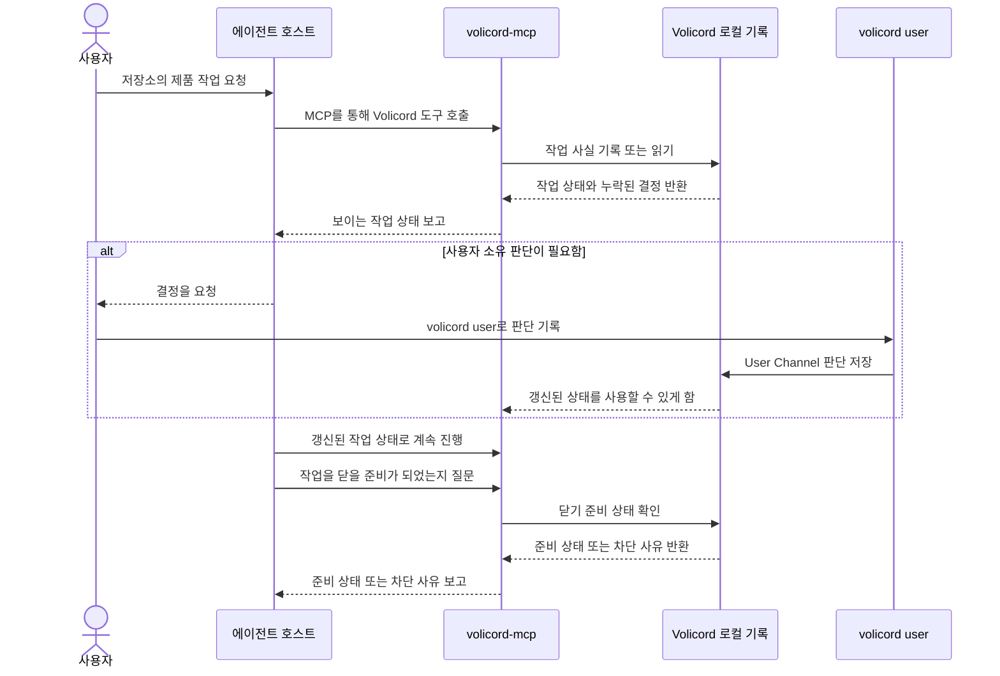
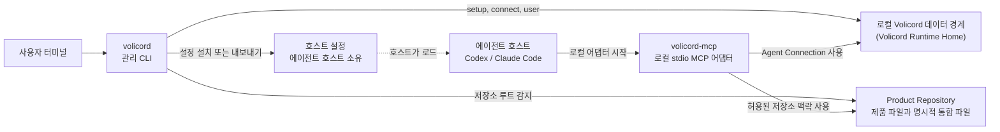

# Volicord

**AI가 움직여도, 판단은 사용자에게.**

[English](README.md) | **[한국어](README.ko.md)**

Volicord(볼리코드)는 AI 지원 제품 작업을 위한 로컬 작업 권한 시스템입니다. 사용자가
에이전트 호스트와 함께 일할 때, 대화, 도구, 셸, 테스트, 저장소 파일 사이를
오가는 작업 사실을 로컬에서 계속 보이게 해 줍니다.

모든 것이 대화에만 남으면 에이전트가 무엇을 하려는지, 어떤 증거가 현재 주장을
뒷받침하는지, 쓰기가 준비되었는지, 어떤 결정이 사용자에게 남아 있는지, 정직하게
닫기 전에 무엇이 아직 막고 있는지가 흐려질 수 있습니다. Volicord는 이런 작업
사실을 로컬 Volicord 기록 영역인 `Volicord Runtime Home`에 기록해 기억이나
다듬어진 요약에만 의존하지 않게 합니다.

Volicord 상태의 기준 정보는 로컬 기준 기록에 남습니다. 대화 메시지, 생성된
Markdown, 상태 요약, 상태 보기는 그 상태를 설명할 수 있지만 대신하지는 않습니다.

## 개요

Volicord는 AI 지원 제품 작업 중 아래 질문들이 분명하게 남아 있도록 돕습니다.

- 에이전트가 하려는 일은 무엇인가?
- 무엇이 범위 안이고 범위 밖인가?
- 현재 주장을 뒷받침하는 증거는 무엇인가?
- 현재 적용 범위에서 쓰기는 준비되었는가?
- 에이전트가 무엇을 실행하거나 기록했는가?
- 아직 필요한 사용자 소유 판단은 무엇인가?
- 정직하게 닫는 것을 아직 막는 것은 무엇인가?

## Volicord가 존재하는 이유

AI 지원 제품 작업은 빠르게 움직일 수 있습니다. 사용자는 에이전트 호스트에게 동작
변경, 실패 조사, 테스트 갱신, 릴리스 노트 준비를 요청할 수 있습니다. 에이전트는
파일을 살피고, 명령을 실행하고, 코드를 쓰고, 결과를 요약할 수 있습니다.

그 속도는 유용하지만, 오래 남는 기록이 대화에만 있으면 경계가 흐려질 수 있습니다.
범위가 조금씩 넓어지고, 수락이 암시된 것처럼 보이고, 잔여 위험이 대화에서 사라지고,
제품 결정이 구현 단계 안에 묻힐 수 있습니다. Volicord는 범위, 증거, 쓰기 준비 상태,
사용자 판단, 실행 기록, 닫기 준비 상태가 서로 다른 작업 사실로 계속 보이도록
존재합니다.

## 먼저 알아둘 개념

README와 나머지 문서에서 반복해서 나오는 이름들입니다.

| 용어 | 첫 읽기 의미 |
|---|---|
| Product repository | 에이전트가 작업하기를 원하는 코드 저장소입니다. Volicord 참조 문서의 정확한 제품 라벨은 `Product Repository`입니다. |
| Agent host | 사용자가 대화하는 에이전트 환경입니다. 예를 들면 Codex나 Claude Code입니다. 호스트는 작업 중 로컬 MCP 도구를 시작할 수 있습니다. |
| `volicord-mcp` | 에이전트 호스트가 Volicord와 통신할 때 사용하는 로컬 stdio MCP 어댑터입니다. |
| `Volicord Runtime Home` | Volicord가 작업 기록과 런타임 데이터를 저장하는 로컬 위치입니다. 제품 저장소와 분리됩니다. |
| `Core` | Volicord 상태를 위한 로컬 기준 기록입니다. 대화 요약과 생성 문서는 Core 상태를 설명할 수 있지만 대신하지는 않습니다. |
| `Agent Connection` | 한 호스트가 저장소 작업에 Volicord를 사용할 수 있게 하는 로컬 연결 기록입니다. |
| `User Channel` | 에이전트가 만들어 내거나 대신 기록하면 안 되는 사용자 결정을 사용자가 기록하는 경로입니다. 현재 로컬 CLI 경로는 `volicord user`입니다. |

정확한 용어 담당 문서는 [용어집](docs/ko/reference/glossary.md)과
[참조 색인](docs/ko/reference/README.md)을 사용합니다.

## 빠른 시작

이 Volicord 소스 체크아웃에서 로컬 바이너리를 빌드하고, 안내형 setup을 실행한 뒤,
에이전트가 작업할 제품 저장소에서 Codex를 연결합니다.

```sh
cargo build --workspace --bins
./target/debug/volicord setup
cd /path/to/your-product-repo
volicord connect codex
```

Setup 중 Volicord는 이후 터미널과 에이전트 호스트에서 `volicord`와
`volicord-mcp`를 사용할 수 있는지 확인합니다. 사용할 수 없다면 setup은 명령 링크
생성, 셸 명령 출력, 링크 단계 건너뛰기 같은 안전한 선택지를 제공합니다. 새 터미널
또는 에이전트 호스트를 시작하거나 `volicord connect`를 실행하기 전에 setup의
프롬프트나 `action_required` 출력을 따릅니다. Volicord는 부모 셸의 현재 `PATH`를
바꿀 수 없습니다.

`/path/to/your-product-repo`는 사용자의 제품 저장소 경로를 뜻합니다. Volicord 용어나
필수 디렉터리 이름이 아닙니다. `volicord connect codex`는 현재 디렉터리에서 저장소
루트를 감지하고, 해당 저장소 프로젝트를 등록하거나 재사용하고, 일치하는
`Agent Connection`을 만들거나 갱신하며, 그 연결에 맞는 지원 Codex 호스트 설정을
설치합니다.

정확한 setup, 연결, 옵션, 출력 동작은
[관리 CLI 참조](docs/ko/reference/admin-cli.md)가 담당합니다. 더 자세한 튜토리얼은
[빠른 시작](docs/ko/getting-started/quickstart.md)을 봅니다.

## 사용자 요청의 실제 흐름

설정 뒤의 일반 흐름은 사용자가 에이전트 호스트에게 저장소 작업을 요청하면서
시작됩니다.

> 결제 생성에 idempotency key 지원을 추가하고, 테스트를 갱신한 뒤, 닫을 준비가
> 되었을 때 알려 줘.

호스트는 계속 사용자의 에디터/대화 에이전트입니다. Volicord는 에디터, 셸, 테스트
실행기, 리뷰 과정을 대체하지 않습니다. 대신 호스트가 오래 남는 작업 상태가 필요할
때 `volicord-mcp`를 통해 Volicord 도구를 사용합니다. Volicord는 작업 의도, 현재
적용 범위, 증거, 점검과 실행, 쓰기 준비 상태, 대기 중인 사용자 판단, 닫기 차단
사유 같은 로컬 작업 사실을 기록하거나 읽습니다.

작업에 제품 결정, 범위 변경, 민감 단계, 최종 수락, 잔여 위험 수락, 취소가 필요하면
호스트는 그 결정을 요청할 수 있습니다. 답을 만들어 내면 안 됩니다. 권한을 지니는
답변은 사용자가 `volicord user` 같은 `User Channel`을 통해 기록하고, 호스트는
갱신된 Volicord 상태에서 계속 작업할 수 있습니다. 닫기 전에는 호스트가 Volicord에
아직 정직한 닫기를 막는 미해결 차단 사유가 있는지 물을 수 있습니다.

## 사용자 작업 흐름

이 첫 읽기용 작업 흐름은 협업 순서와 결정 인계를 보여 줍니다. 전체 API 호출 순서,
저장소 배치, 구성 요소 소유는 의도적으로 생략합니다. 정확한 Core 권한, MCP 전송,
런타임 경계는 [Core 모델](docs/ko/reference/core-model.md),
[MCP 전송](docs/ko/reference/mcp-transport.md),
[런타임 경계](docs/ko/reference/runtime-boundaries.md) 참조가 담당합니다.



닫기 준비 상태는 판단을 돕는 기록입니다. 제품 정확성, 테스트 충분성, QA 완료,
배포 성공, 위험 없는 결과를 증명하지 않습니다.

## 로컬 구성 요소 지도

이 지도는 로컬 실행, 설정 로드, 기록 접근, 저장소 맥락 사용을 보여 줍니다. 위의
사용자 작업 흐름과 별개의 그림이며, 모든 런타임 호출이나 저장 효과를 보여 주지는
않습니다. 정확한 명령, MCP, Agent Connection, 런타임 경계 동작은
[관리 CLI](docs/ko/reference/admin-cli.md),
[MCP 전송](docs/ko/reference/mcp-transport.md),
[Agent Connection](docs/ko/reference/agent-connection.md),
[런타임 경계](docs/ko/reference/runtime-boundaries.md) 참조가 담당합니다.



`Volicord Runtime Home`은 `Product Repository`와 분리됩니다. Volicord 런타임 기록,
SQLite 파일, 생성 기록, 로그, QA 결과, 수락 기록, 닫기 준비 상태, 잔여 위험 기록은
제품 파일 안에 두지 않습니다. `Product Repository`에는 프로젝트 범위 호스트 설정이나
관리 지침처럼 지원되는 setup 흐름이 담당하는 명시적 통합 파일만 들어갈 수 있습니다.

## Volicord가 보이게 해 주는 것

Volicord는 대화 기록만으로 부족한 작업에 유용합니다. 아래 작업 사실이 계속 보이도록
돕습니다.

- 작업 의도
- 범위 경계
- 뒷받침하는 증거
- 점검과 실행
- 쓰기 준비 상태
- 대기 중인 사용자 판단
- 정직한 닫기를 막는 차단 사유

## Volicord가 대신 결정하지 않는 것

Volicord는 경계를 보이게 하지만, 제품 판단은 사용자에게 남습니다.

- 제품 정확성을 증명하지 않습니다.
- 테스트나 리뷰를 대체하지 않습니다.
- OS 수준 쓰기 권한을 부여하지 않습니다.
- 에이전트가 사용자 소유 판단을 만들어 내게 하지 않습니다.
- MCP 호출이 기억에서 프로젝트 정체성을 추론하게 하지 않습니다.

## 다음에 볼 문서

| 필요 | 읽을 문서 |
|---|---|
| 실행 파일 설치와 확인 | [설치](docs/ko/getting-started/installation.md), 그다음 [빠른 시작](docs/ko/getting-started/quickstart.md) |
| 사용자 작업 흐름 이해 | [사용자 가이드](docs/ko/guides/user-workflow.md) |
| 에이전트 호스트 설정 또는 복구 | [에이전트 호스트 설정](docs/ko/guides/agent-host-setup.md)과 [에이전트 호스트 문제 해결](docs/ko/guides/agent-host-troubleshooting.md) |
| 에이전트 동작 경계 이해 | [에이전트 가이드](docs/ko/guides/agent-workflow.md) |
| 정확한 CLI, MCP, 런타임 계약 확인 | [관리 CLI 참조](docs/ko/reference/admin-cli.md), [MCP 전송](docs/ko/reference/mcp-transport.md), [런타임 경계](docs/ko/reference/runtime-boundaries.md) |
| Core 권한 개념 이해 | [Core 모델](docs/ko/reference/core-model.md) |
| 구현 학습 | [코드베이스 둘러보기](docs/ko/development/codebase-tour.md) |

Volicord 명령은 로컬 관리 명령이며 공개 Volicord API 메서드가 아닙니다. 정확한 공개
API 동작은 [참조 색인](docs/ko/reference/README.md)이 담당합니다.
