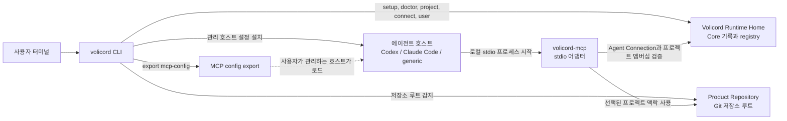

# Volicord(볼리코드)

AI가 움직여도, 판단은 사용자에게.

Volicord는 AI 지원 제품 작업을 위한 로컬 작업 권한 시스템입니다. 에이전트가
일반 제품 저장소에서 작업하는 동안 범위, 증거, 쓰기 준비 상태, 사용자 판단,
닫기 결정을 볼 수 있게 유지합니다.

Core는 Volicord 상태의 로컬 기준 기록입니다. `volicord` 관리 CLI는 로컬 설정을
준비하고, 저장소 프로젝트를 감지하고, 에이전트 호스트를 연결하고, MCP 설정을
내보내며, 사용자 소유 판단을 위한 로컬 `User Channel` 경로를 제공합니다.
`volicord-mcp` 프로세스는 에이전트 호스트가 시작하는 로컬 MCP 어댑터입니다.

## 빠른 시작

로컬 바이너리를 빌드하고, setup 프로필을 만들고, 제품 저장소로 이동한 뒤 Codex를
연결합니다.

```sh
cargo build --workspace --bins
./target/debug/volicord setup --link-bin ~/.local/bin
cd /work/acme-api
volicord connect codex
```

일어나는 일:

- `volicord setup`은 기본 `Volicord Runtime Home`을 준비하고, setup 프로필을
  기록하고, `volicord-mcp`를 찾으며, 사용자가 고른 bin 디렉터리에 `volicord`와
  `volicord-mcp` 명령을 준비할 수 있습니다.
- `volicord connect codex`는 현재 디렉터리에서 Git 저장소 루트를 감지하고, 해당
  저장소 프로젝트를 등록하거나 재사용하며, 저장소 디렉터리에서 프로젝트 이름을
  파생하고, 일치하는 `Agent Connection`을 만들거나 갱신한 뒤 관리 호스트 설정을
  설치합니다.
- 기본 연결 의도는 `personal`이고 기본 모드는 `workflow`입니다. 내부 프로젝트와
  연결 ID는 Volicord가 생성하고 관리합니다.

결과를 확인합니다.

```sh
volicord doctor
volicord project current
volicord connection status codex
volicord connection verify codex
```

`--link-bin`으로 setup한 뒤 셸이 `volicord`를 찾지 못하면 그 링크 디렉터리를 셸
설정에 추가하고 새 셸이나 MCP 호스트를 시작합니다.

명령이 `action_required`를 보고하면 이름 붙은 호스트 소유 trust, approval,
reload, restart, setup repair 동작을 완료한 뒤 관련 status 또는 verification
명령을 다시 실행합니다.

## Volicord가 관리하는 것

| 영역 | 사용자가 제공하는 것 | Volicord가 관리하는 것 |
|---|---|---|
| Setup 프로필 | 실행한 `volicord` 실행 파일, 선택적으로 setup 때 지정하는 링크 디렉터리나 명시적 `volicord-mcp` 경로. | Runtime Home 준비 상태, 저장된 `volicord`와 `volicord-mcp` 명령, setup 진단. |
| Runtime Home | 보통 없음. `VOLICORD_HOME`이나 `volicord setup --home`이 다른 경로를 고르지 않으면 기본값을 사용합니다. | Registry 상태, 프로젝트 상태, Agent Connection 기록, 아티팩트, setup 메타데이터. |
| 저장소 프로젝트 | 보통 현재 디렉터리인 Git 저장소 경로. | 프로젝트 등록, 저장소 디렉터리에서 파생한 사용자 대상 프로젝트 이름, 내부 프로젝트 ID. |
| Agent Connection | 호스트와 의도. 예: `codex`, `claude-code --shared`, `claude-code --global`. | 호스트 설정, 연결 모드, 프로젝트 멤버십, 연결 ID, 검증 상태, 필요한 사용자 동작. |
| MCP 설정 내보내기 | Volicord가 직접 관리하지 않는 호스트를 위한 선택적 출력 경로. | 선택된 저장소와 setup 프로필에 묶인 호스트 중립 MCP 설정. |
| User Channel | Core가 생성한 선택지를 고르는 사용자. | 권한을 지니는 답변을 Agent Connection과 분리하는 로컬 사용자 판단 명령. |

## 구성 요소 그림



`Volicord Runtime Home`은 `Product Repository`와 분리됩니다. Volicord가 관리하는
런타임 기록은 프로젝트 파일 안에 살지 않습니다. 공유 호스트 설정은 관련 호스트
setup 흐름이 담당하는 명시적 통합 파일을 통해서만 저장소에 나타날 수 있습니다.

## 핵심 흐름

1. 실행 파일과 setup 프로필을 준비합니다.

   ```sh
   cargo build --workspace --bins
   ./target/debug/volicord setup --link-bin ~/.local/bin
   volicord doctor
   ```

2. 제품 저장소로 들어갑니다.

   ```sh
   cd /work/acme-api
   volicord project current
   ```

   아직 프로젝트가 등록되지 않았다면 `volicord connect ...`나
   `volicord project use`가 감지된 Git 루트에서 등록할 수 있습니다.

3. 에이전트 호스트를 연결합니다.

   ```sh
   volicord connect codex
   ```

   호스트 설정을 프로젝트에서 공유해야 하면 `--shared`를 사용합니다. 사용자 전체
   연결을 지원하는 호스트에는 `--global`을 사용할 수 있습니다. Workflow 도구 대신
   읽기 중심 동작만 노출해야 하면 `--read-only`를 사용합니다.

4. 연결 상태를 조회하고 검증합니다.

   ```sh
   volicord connections
   volicord connection status codex
   volicord connection verify codex
   ```

5. Volicord가 직접 관리하지 않는 호스트에 설정 파일이 필요하면 generic MCP 설정을
   내보냅니다.

   ```sh
   volicord export mcp-config --output /tmp/volicord.mcp.json
   ```

6. 사용자 소유 판단은 User Channel에 남깁니다.

   ```sh
   volicord user status
   volicord user judgments
   volicord user judgment show 1
   volicord user judgment answer 1 1
   ```

   Agent Connection은 초점이 맞춰진 판단 필요를 요청하거나 보여 줄 수 있지만,
   권한을 지니는 사용자 답변을 기록하지 않습니다. Core가 생성한 선택지가 사용자의
   기록된 판단이 되어야 하면 `volicord user ...`를 사용합니다.

## 문서 경로

| 필요 | 읽을 문서 |
|---|---|
| 실행 파일 설치와 확인 | [설치](docs/ko/getting-started/installation.md) |
| 첫 호스트 연결 성공 | [Quickstart](docs/ko/getting-started/quickstart.md) |
| 호스트 설정 세부사항과 연결 의도 | [에이전트 호스트 Setup](docs/ko/guides/agent-host-setup.md) |
| 호스트 복구와 `action_required` 상태 | [에이전트 호스트 문제 해결](docs/ko/guides/agent-host-troubleshooting.md) |
| 사용자 소유 판단과 닫기 흐름 | [사용자 가이드](docs/ko/guides/user-workflow.md) |
| 에이전트 동작 경계 | [에이전트 가이드](docs/ko/guides/agent-workflow.md) |
| 정확한 CLI 동작 | [관리 CLI 참조](docs/ko/reference/admin-cli.md) |
| Runtime Home과 저장소 경계 | [런타임 경계](docs/ko/reference/runtime-boundaries.md) |
| MCP 프로세스 동작 | [MCP 전송](docs/ko/reference/mcp-transport.md) |
| 소스 코드 학습 경로 | [코드베이스 둘러보기](docs/ko/development/codebase-tour.md) |

Volicord 명령은 로컬 관리 명령이며 공개 Volicord API 메서드가 아닙니다. 정확한 공개
API 동작은 [참조 색인](docs/ko/reference/README.md)이 담당합니다.
