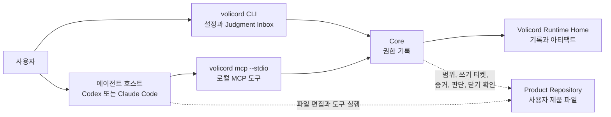
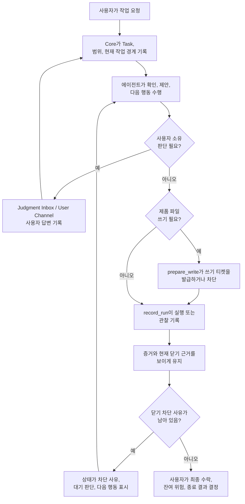

# Volicord

**AI가 움직여도, 판단은 사용자에게.**

[English](README.md) | **[한국어](README.ko.md)**

## 개요

Volicord(볼리코드)는 AI 지원 제품 작업을 위한 로컬 작업 권한 시스템입니다. Codex나
Claude Code 같은 에이전트 호스트가, 대화에만 남기면 안 되는 작업 사실을 로컬 기록으로
다룰 수 있게 합니다. 어떤 작업이 활성 상태인지, 현재 범위에서 어떤 쓰기가 호환되는지,
어떤 증거가 있는지, 어떤 판단이 아직 사용자에게 남아 있는지, 정직한 닫기를 무엇이 막는지
기록합니다.

Volicord는 에디터, 셸, 테스트, 코드 리뷰, 사용자 판단을 대체하지 않습니다. Volicord는
에이전트가 그런 도구를 쓰는 동안 범위, 증거, 사용자 결정, 닫기 차단 사유를 다듬어진
요약 안에 숨기지 않도록 돕는 로컬 권한 기록 계층입니다.

Core는 Volicord 상태의 로컬 기준 기록입니다. 대화 메시지, 생성된 Markdown, 상태 요약,
상태 보기는 Core 상태를 설명할 수 있지만 대신하지는 않습니다.

## Volicord가 존재하는 이유

Volicord는 AI 지원 제품 작업 중 아래 질문들이 분명하게 남아 있도록 돕습니다.

- 에이전트가 하려는 일은 무엇인가?
- 무엇이 범위 안이고 범위 밖인가?
- 현재 주장을 뒷받침하는 증거는 무엇인가?
- 현재 적용 범위에서 쓰기는 준비되었는가?
- 에이전트가 무엇을 실행하거나 기록했는가?
- 아직 필요한 사용자 소유 판단은 무엇인가?
- 정직하게 닫는 것을 아직 막는 것은 무엇인가?

AI 에이전트는 사람이 모든 경계를 작업 기억에 붙잡아 두는 속도보다 빠르게 파일을
살피고, 도구를 실행하고, 코드를 고치고, 결과를 요약할 수 있습니다.

그 속도는 유용하지만, 오래 남는 기록이 대화에만 있으면 경계가 흐려질 수 있습니다.
범위가 조금씩 넓어지고, 수락이 암시된 것처럼 보이고, 잔여 위험이 대화에서 사라지고,
제품 결정이 구현 단계 안에 묻힐 수 있습니다.

Volicord는 범위, 증거, 쓰기 준비 상태,
사용자 판단, 실행 기록, 닫기 준비 상태가 서로 다른 작업 사실로 계속 보이도록
존재합니다.

## 짧은 모델

README의 나머지 내용을 읽을 때는 아래 모델을 사용합니다.

| 개념 | 첫 사용자에게 필요한 의미 |
|---|---|
| `Task` | 구체화되거나, 작업 중이거나, 막혀 있거나, 닫히는 사용자 가치 단위입니다. 현재 목표, 범위, 범위 밖 항목, 현재 작업 경계를 담습니다. |
| 쓰기 | 제품 파일 변경은 현재 `Task`와 현재 범위에 호환되어야 합니다. `Write Check`은 제안된 쓰기 하나에 대한 좁은 Volicord 호환성 기록이며, OS 권한이나 최종 승인이 아닙니다. |
| 증거 | 실행, 관찰, 아티팩트 참조처럼 특정 주장을 뒷받침하도록 기록된 자료입니다. 증거는 주장을 돕지만 사용자 판단이나 정확성 증명이 되지는 않습니다. |
| 사용자 판단 | 제품 방향, 중요한 기술 방향, 범위, 민감 동작, 최종 수락, 잔여 위험 수락, 취소처럼 사용자에게 속한 결정입니다. |
| 닫기 | 현재 `Task`를 미해결 요구사항을 숨기지 않고 정직하게 끝낼 수 있는지 확인하는 일입니다. 닫기 준비 상태는 판단을 돕는 자료이지 제품 결과가 옳다는 증명이 아닙니다. |

## 구성 요소가 맞물리는 방식

이 지도는 처음 사용하는 독자가 알아야 할 로컬 구성 요소를 보여 줍니다. 실선 화살표는
일반적인 로컬 호출 또는 기록 경로입니다. 점선 화살표는 공개 Volicord API 밖의 제품
파일 작업이나 호환성 관계를 뜻합니다. 저장소 테이블, 완전한 API 동작, 호스트별 설정
세부사항은 생략합니다.


```mermaid
flowchart LR
  user["사용자"]
  host["에이전트 호스트<br/>Codex 또는 Claude Code"]
  mcp["volicord mcp --stdio<br/>로컬 MCP 도구"]
  core["Core<br/>권한 기록"]
  runtime["Volicord Runtime Home<br/>기록과 아티팩트"]
  repo["Product Repository<br/>사용자 제품 파일"]
  cli["volicord CLI<br/>설정과 Judgment Inbox"]

  user --> host
  host --> mcp
  mcp --> core
  core --> runtime
  user --> cli
  cli --> core
  host -. 파일 편집과 도구 실행 .-> repo
  core -. 범위, 쓰기 티켓,<br/>증거, 판단, 닫기 확인 .-> repo
```

권한 순환은 사용자 결정, 에이전트 작업, Core 기록을 분리해 둡니다. 화살표는 개요 수준의
작업 전달을 보여 주며, 정확한 API 호출 순서를 뜻하지 않습니다.


```mermaid
flowchart TD
  request["사용자가 작업 요청"]
  task["Core가 Task,<br/>범위, 현재 작업 경계 기록"]
  agent["에이전트가 확인, 제안,<br/>다음 행동 수행"]
  judgment{"사용자 소유<br/>판단 필요?"}
  inbox["Judgment Inbox / User Channel<br/>사용자 답변 기록"]
  write{"제품 파일<br/>쓰기 필요?"}
  ticket["prepare_write가 쓰기 티켓을<br/>발급하거나 차단"]
  run["record_run이 실행 또는<br/>관찰 기록"]
  evidence["증거와 현재 닫기 근거를<br/>보이게 유지"]
  close{"닫기 차단 사유가<br/>남아 있음?"}
  status["상태가 차단 사유,<br/>대기 판단, 다음 행동 표시"]
  finish["사용자가 최종 수락,<br/>잔여 위험, 종료 결과 결정"]

  request --> task --> agent --> judgment
  judgment -- 예 --> inbox --> task
  judgment -- 아니오 --> write
  write -- 예 --> ticket --> run
  write -- 아니오 --> run
  run --> evidence --> close
  close -- 예 --> status --> agent
  close -- 아니오 --> finish
```

## 설치와 초기화

일반 사용자 경로는 설치된 `volicord` 실행 파일 하나를 사용하는 것입니다. 시스템이 지원
target과 맞으면 릴리스 바이너리 설치가 기본 경로입니다. 소스 빌드는 개발용입니다.

Linux, WSL2, macOS에서는 Volicord 릴리스 자산을 게시하는 저장소에서
`scripts/install.sh`를 내려받거나 복사한 뒤, 릴리스 바이너리를 설치합니다.

```sh
VOLICORD_REPO=OWNER/REPO sh ./scripts/install.sh
volicord --version
```

Native Windows x86_64에서는 `scripts/install.ps1`을 내려받거나 복사한 뒤 PowerShell에서
실행합니다.

```powershell
.\scripts\install.ps1 -Repo OWNER/REPO
volicord --version
```

`OWNER/REPO`는 이 체크아웃의 Volicord 릴리스 자산을 호스팅하는 GitHub 저장소입니다.
POSIX 스크립트는 지원되는 Linux, WSL2, macOS target을 감지하고 target 이름이 붙은
tarball을 내려받습니다. PowerShell 스크립트는 기본적으로 사용자 로컬 디렉터리 아래에
`x86_64-pc-windows-msvc` zip artifact를 설치합니다. 두 스크립트 모두 사용할 수 있을 때
`.sha256` 파일을 검증하고 해당 플랫폼의 `volicord` 실행 파일 하나만 설치합니다. 셸 시작
파일은 암시적으로 편집하지 않습니다. 이 체크아웃에는 Homebrew tap, Homebrew formula,
Linux 패키지, Windows 패키지 관리자 패키지, 외부 패키지 registry 설치 경로가 없습니다.

미래의 에이전트 호스트가 `PATH`를 통해 `volicord`를 실행할 수 있게 한 뒤, 에이전트에게
작업을 요청할 Product Repository를 초기화합니다.

```sh
volicord init --host codex --repo /path/to/your-product-repo --profile record
```

Claude Code에는 `--host claude-code`를 사용합니다.

```sh
volicord init --host claude-code --repo /path/to/your-product-repo --profile record
```

`volicord init`은 대화 중심 사용을 위한 기본 첫 실행 설정 및 연결 명령입니다. 필요하면
Runtime Home을 초기화하고, 설치 프로필을 기록하며, 선택한 Product Repository를 등록하거나
재사용하고, Agent Connection을 만들며, `volicord mcp --stdio`를 시작하는 프로젝트 범위
MCP 설정을 씁니다. 또한 Volicord 관리 지침과 policy 메타데이터를 쓰고 통합 상태를
기록합니다. `--profile record`는 호스트 lifecycle hook 설치나 session watcher를 요구하지
않으며 native Windows에서 지원되는 프로필입니다. `--profile observe`는 지원되는 host
hook과 session watcher capability를 요구하고 native Windows에서는 지원되지 않습니다.
Observe 전제조건을 사용할 수 없으면 `--profile record`를 사용하거나, observe를 다시
실행하기 전에 지원되는 호스트, 플랫폼, 저장소 설정을 준비합니다.

명령이 `action_required`를 보고하면 이름 붙은 호스트 통제 동작이나 로컬 동작을 따릅니다.
예를 들면 호스트 restart 또는 reload, 프로젝트 MCP 설정 승인, 프로젝트 trust, 명령
가용성 복구가 있습니다. 그런 뒤 확인합니다.

```sh
volicord connection verify codex --repo /path/to/your-product-repo
```

정확한 명령 동작은 [관리 CLI 참조](docs/ko/reference/admin-cli.md)가 담당합니다. 환경
지원은 [시스템 요구사항](docs/ko/reference/system-requirements.md)이 담당합니다.

## 개발용 소스 빌드

Volicord 자체를 개발하거나 로컬 개발 바이너리가 필요할 때만 소스 빌드 경로를 사용합니다.

```sh
cargo build --workspace --bins
./target/debug/volicord --version
./target/debug/volicord init --host codex --repo /path/to/your-product-repo --profile record
```

이 경로에는 [시스템 요구사항](docs/ko/reference/system-requirements.md#toolchain-requirements)이
이름 붙인 Rust 도구 체인이 필요합니다. 첫 사용자의 기본 설치 경로가 아닙니다.

## 일반 사용은 대화입니다

초기화 뒤에는 Product Repository에서 평소처럼 에이전트 호스트와 대화로 일합니다.
터미널에서 워크플로를 직접 몰고 갈 필요가 없습니다.

예를 들어 대화에서 이렇게 요청합니다.

```text
결제 생성에 idempotency key 지원을 추가하고, 테스트를 갱신한 뒤, 닫기를 아직 막는 것이 무엇인지 알려줘.
```

호스트는 계속 사용자의 대화/에디터 에이전트입니다. Volicord는 오래 남는 작업 상태가
필요할 때 호스트가 호출할 수 있는 로컬 MCP 도구를 제공합니다.

- `Task` 만들기 또는 갱신
- 현재 범위, 차단 사유, 증거, 대기 판단 보여 주기
- 제안된 제품 파일 쓰기 준비
- 아티팩트 스테이징과 실행 또는 관찰 기록
- 초점이 맞춰진 사용자 판단 요청
- 에이전트가 완료를 주장하기 전에 닫기 준비 상태 확인

에이전트는 사용할 수 있을 때 Volicord 상태를 사용하고, 사용할 수 없으면 그 사실을
명시적으로 말해야 합니다. Volicord 도구, MCP 서버 instructions, 호스트 rule,
`AGENTS.md` 안내는 에이전트를 유도하지만 모델 동작을 절대적으로 강제하지 않습니다.

## 통합 프로필

`volicord init`의 기본값은 `--profile record`입니다. `--profile`을 생략하면 일반 첫
사용자 설정이 됩니다.

`record`는 host lifecycle hook이나 session watcher에 의존하지 않고 호스트가 Volicord의
로컬 MCP 도구와 Core 기록을 사용하게 할 때 선택합니다. 에이전트가 Volicord를 통해
`Task`, 범위, 쓰기 확인, 증거, 실행, 사용자 판단 요청을 기록하게 하려는 첫 경로입니다.

`observe`는 선택한 호스트, 플랫폼, Product Repository가 추가 관찰 표면을 지원할 때만
사용합니다. `record` 모델은 그대로 유지하면서 지원되는 host hook과 session watcher를
더합니다. 이 hook은 협력형 pre-tool warning 또는 denial을 제공할 수 있고, watcher는
coverage가 시작된 뒤 미기록 Product Repository 변경을 탐지할 수 있습니다.

Volicord는 선택된 연결 또는 session에 대해 control-surface 요약을 보고합니다. 이 요약은
현재 어떤 표면이 활성인지 알려 줍니다. 여기에는 `selected_profile`, host hook, session
watcher 관찰, 협력형 pre-tool warning 또는 denial, 미기록 변경 탐지, 행위자 identity
증명, OS 집행이 포함됩니다. 현재 Volicord 출력은 행위자 identity 증명과 OS 집행을
제공하지 않는다고 보고합니다. 이 요약은 운영 상태 공개이며 보안 증명이 아닙니다.

`observe`는 모든 쓰기를 막거나, 파일을 바꾼 사람이 누구인지 식별하거나, 모든 파일을
감시하거나, 네트워크를 격리하거나, 도구를 샌드박스하거나, 모델이 지침을 따랐다는 것을
증명하지 않습니다. 필요한 관찰이 실제로 활성일 때 Volicord가 닫기 준비 상태와 조정
워크플로에서 보여 주거나 사용할 수 있는 협력형 및 탐지형 신호를 더합니다.

`volicord init` 뒤나 호스트가 요구한 승인 또는 reload 단계를 마친 뒤에는 현재 설정을
검증합니다.

```sh
volicord connection verify codex --repo /path/to/your-product-repo
```

저장된 설정 상태, 필요한 사용자 동작, 현재 control-surface 사실을 확인해야 하면
`volicord connection status HOST --repo PATH`와 `volicord doctor`를 사용합니다. 설치된
파일, 생성된 안내, policy 메타데이터만으로 호스트가 observe 전용 구성 요소를 로드하거나
실행했다는 것이 증명되지는 않습니다.

호스트별 파일 배치, hook matcher, wrapper 출력 방식, 경로 안전성 진단, 호스트 approval
또는 reload 세부사항은 [에이전트 호스트 설정](docs/ko/guides/agent-host-setup.md)과
[에이전트 호스트 문제 해결](docs/ko/guides/agent-host-troubleshooting.md)이 담당합니다.
정확한 명령 동작은 [관리 CLI 참조](docs/ko/reference/admin-cli.md)가 담당합니다.

## 미기록 변경과 닫기 차단 사유

Observe hook과 활성 session watcher는 제품 파일 변경이 대응되는 예상 쓰기와 맞지 않을
때 미기록 Product Repository 변경을 보고할 수 있습니다. Session watcher 찾기는 선택된
session에 대한 한정된 제품 파일 메타데이터 비교에서 나옵니다. 변경된 경로를 감지하지만,
전체 파일 내용을 저장하거나, 누가 파일을 바꿨는지 증명하거나, 의도를 증명하거나, 쓰기를
막지 않습니다. 이런 항목은 조정될 때까지 미해결 관찰 찾기로 남으며, 미해결 찾기는 닫기를
막습니다.

조정은 호환되는 `Write Check`나 기록된 실행이 이미 다루는 찾기처럼 결정적으로 해결할
수 있는 경우를 해결할 수 있습니다. 수락이 필요하면 Volicord는 초점이 맞춰진 사용자 소유
판단을 만듭니다. 사용자는 MCP elicitation, 엄격한 채팅 명령, CLI 복구 경로로 답합니다.
에이전트는 Product Repository 우회 찾기를 조용히 무시하거나 사용자를 대신해 수락한
것으로 표시할 수 없습니다.

채팅에서는 에이전트에게 `volicord.reconcile_changes` 결과와 다음 행동을 보여 달라고
요청합니다. CLI 복구 경로는 `volicord changes reconcile`입니다.

## 사용자 판단 캡처

사용자 판단은 사용자에게 남습니다. Agent Connection은 판단을 요청할 수 있지만,
권한을 지니는 사용자 답변을 사용자처럼 기록하면 안 됩니다.

지원되는 캡처 경로는 아래와 같습니다.

| 경로 | 쓰이는 때 |
|---|---|
| MCP elicitation | 초기화된 MCP client가 `capabilities.elicitation`을 선언하면 Volicord는 초점이 맞춰진 대기 판단에 대해 `elicitation/create` 요청을 보낼 수 있습니다. 유효한 응답은 사용자 출처로 로컬 `User Channel`을 통해 기록됩니다. |
| 채팅 prompt capture | elicitation을 사용할 수 없고 prompt-capture 사용 가능 상태가 `configured`, `observed`, `active`이면 Volicord는 `Volicord: answer J-3 1 #AB7K`, `Volicord: answer J-3 reject #AB7K`, `Volicord: answer J-3 defer #AB7K`, `Volicord: note J-3 "text" #AB7K` 같은 정확한 채팅 명령을 반환합니다. prompt-capture hook은 현재 검증 코드가 있는 엄격하게 유효한 명령만 기록합니다. |
| Local web consent | elicitation과 prompt capture를 사용할 수 없고 adapter가 fallback을 안전하게 노출할 수 있으면 Volicord는 loopback 전용 consent URL을 반환합니다. URL은 프로젝트, 연결, 대기 판단에 묶인 짧게 만료되는 일회성 token을 사용하며, 유효한 답변은 로컬 사용자 출처로 `User Channel`을 통해 기록됩니다. |
| CLI fallback | elicitation, 채팅 캡처, local web consent를 사용할 수 없거나 비활성화, 저하 상태이거나 수동 점검이 필요하면 Product Repository에서 `volicord inbox`를 사용합니다. |

CLI fallback 예시:

```sh
volicord inbox
volicord inbox answer JUDGMENT_ID --choice CHOICE_ID
```

Local web consent는 MCP elicitation과 별개입니다. 로컬 HTTP MCP serve 모드는 여전히
HTTP elicitation을 구현하지 않으며, local web consent는 유효한 consent token이 있는
loopback endpoint에서만 사용할 수 있습니다.

## Volicord가 보장하지 않는 것

Volicord는 작업 권한을 보이게 하지만 일반 보안 제품이나 정확성 판정기가 아닙니다.
아래를 Volicord에 기대하면 안 됩니다.

- OS 수준 샌드박싱 또는 OS 권한 강제
- 악성코드 방어, 악성코드 검사, 비밀값 검사
- 네트워크 격리, 네트워크 모니터링, 네트워크 차단
- 모든 제품 파일 쓰기 예방
- 보편적 도구 실행 전 차단 또는 전체 파일시스템 모니터링
- 변조 불가능한 감사 로그
- 코드가 옳다는 증명
- 테스트가 충분하다는 증명
- 사람 리뷰, QA, 릴리스 판단, 위험 판단의 대체
- 외부 호스트가 `volicord mcp --stdio`를 신뢰, 승인, 로드, 초기화, 노출했다는 증명
- `AGENTS.md`, 호스트 rule, MCP instructions가 모델 동작을 강제했다는 증명

Observe hook은 지원되고 활성일 때 `warn` 또는 `deny` 결정을 반환할 수 있고, 닫기/쓰기
확인은 차단 사유를 드러낼 수 있습니다. 이것은 협력적인 로컬 제어이지 커널 수준 강제나
Volicord를 아는 경로 밖에서 도구가 파일을 쓸 수 없다는 보장이 아닙니다.

정확한 보장 표현과 명시적 비보장은 [보안 참조](docs/ko/reference/security.md)를 봅니다.

## Docker와 로컬 HTTP MCP

체크인된 `Dockerfile`을 통한 로컬 컨테이너 배치용 Docker 지원이 있습니다.

```sh
docker build -t volicord:local .
```

로컬 HTTP MCP 모드는 아래 명령으로 구현되어 있습니다.

```sh
volicord serve --transport local-http
```

이 모드는 Docker와 localhost MCP 사용을 위한 명시적 고급 모드이며 기본 호스트 설정
경로가 아닙니다. Loopback listen 주소만 허용하고 MCP local HTTP endpoint에는 bearer 인증을
요구하며, token을 제공하지 않으면 프로세스 로컬 token을 생성하고, 브라우저 요청 Origin은
설정된 `--allow-origin` 값과 대조합니다. `POST /mcp`를 노출하지만 server-sent event
스트림, HTTP elicitation, 전체 MCP Streamable HTTP 호환성은 구현하지 않습니다. 일반
네트워크 서비스처럼 다루면 안 되며, 지원되는 nonlocal listen 옵션은 없습니다.

자세한 Docker와 HTTP 경계는 [설치](docs/ko/getting-started/installation.md)와
[MCP 전송](docs/ko/reference/mcp-transport.md)을 사용합니다.

## 문제 해결

| 증상 | 할 일 |
|---|---|
| `volicord`를 찾지 못함 | 설치 디렉터리를 `PATH`에 넣거나 이미 `PATH`에 있는 디렉터리에 설치한 뒤 `volicord --version`을 다시 실행합니다. 미래의 에이전트 호스트도 `volicord`를 시작할 수 있어야 합니다. |
| `init`이 `action_required`를 보고함 | 호스트 restart 또는 reload, 프로젝트 trust, MCP approval, OAuth, 명령 링크 복구, 설치 프로필 복구처럼 이름 붙은 동작을 완료한 뒤 `volicord connection verify HOST --repo PATH`를 다시 실행합니다. |
| Observe 전용 점검이 활성화되지 않음 | `volicord connection verify HOST --repo PATH`를 실행하고, 이름 붙은 사용자 동작을 완료한 뒤, hook 또는 watcher 진단은 [에이전트 호스트 문제 해결](docs/ko/guides/agent-host-troubleshooting.md)을 사용합니다. |
| 호스트가 MCP를 시작하지 못함 | 같은 명령 경로로 호스트가 `volicord mcp --help`를 실행할 수 있는지 확인합니다. 설치 프로필 상태는 `volicord doctor`로 확인합니다. |
| Product Repository가 감지되지 않음 | `--repo /path/to/your-product-repo`를 넘기고, 그 경로가 Runtime Home과 분리된 기존 로컬 저장소인지 확인합니다. |
| 판단이 대기 중임 | 가능하면 호스트의 MCP elicitation이나 정확한 채팅 prompt-capture 명령을 우선 사용합니다. CLI fallback으로 `volicord inbox`와 `volicord inbox answer`를 사용합니다. |
| 닫기가 막힘 | 에이전트에게 `volicord.check_close` 결과, 대기 중인 사용자 판단, 빠진 증거, 미해결 미기록 변경, 잔여 위험을 보여 달라고 합니다. 요약으로 닫지 말고 이름 붙은 차단 사유를 처리합니다. |

## 더 읽을 문서

| 필요 | 읽을 문서 |
|---|---|
| 설치 세부사항과 Docker 예시 | [설치](docs/ko/getting-started/installation.md) |
| 지원 환경 | [시스템 요구사항](docs/ko/reference/system-requirements.md) |
| 사용자 작업 흐름과 판단 경계 | [사용자 가이드](docs/ko/guides/user-workflow.md) |
| 호스트 설정과 복구 | [에이전트 호스트 설정](docs/ko/guides/agent-host-setup.md)과 [에이전트 호스트 문제 해결](docs/ko/guides/agent-host-troubleshooting.md) |
| 정확한 CLI 동작 | [관리 CLI 참조](docs/ko/reference/admin-cli.md) |
| MCP stdio와 HTTP 전송 | [MCP 전송](docs/ko/reference/mcp-transport.md) |
| Agent Connection과 User Channel 경계 | [Agent Connection 참조](docs/ko/reference/agent-connection.md) |
| Core 권한 개념 | [Core 모델](docs/ko/reference/core-model.md) |
| 보안 표현과 비보장 | [보안 참조](docs/ko/reference/security.md) |
| 공개 API 메서드와 스키마 | [참조 색인](docs/ko/reference/README.md) |

Volicord 명령은 로컬 관리 명령이며 공개 Volicord API 메서드가 아닙니다. 정확한 공개 API
동작은 참조 문서가 담당합니다.
