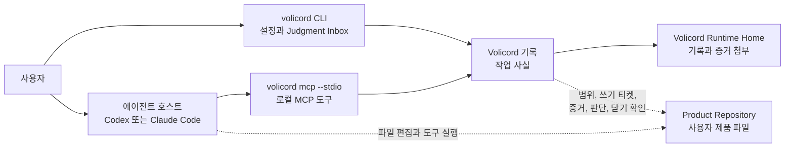
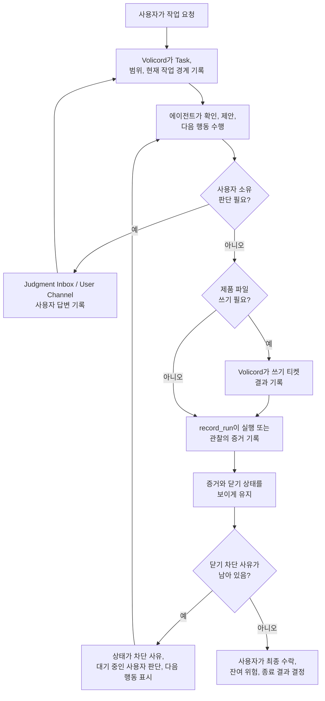

# Volicord

**AI가 움직여도, 판단은 사용자에게.**

[English](README.md) | **[한국어](README.ko.md)**

## 개요

Volicord(볼리코드)는 AI 지원 제품 작업을 위한 로컬 작업 권한 기록입니다. Codex나
Claude Code 같은 에이전트 호스트가, 대화에만 남기면 안 되는 작업 사실을 로컬 기록으로
다룰 수 있게 합니다. 어떤 작업이 활성 상태인지, 현재 범위가 무엇인지, 제안된 제품 파일
변경을 위한 어떤 쓰기 티켓이 있는지, 어떤 증거가 있는지, 어떤 판단이 아직 사용자에게
남아 있는지, 정직한 닫기를 무엇이 막는지 기록합니다.

Volicord는 에디터, 셸, 테스트, 코드 리뷰, 사용자 판단을 대체하지 않습니다. 에이전트가
그런 도구를 쓰는 동안 범위, 증거, 사용자 결정, 닫기 차단 사유를 다듬어진 요약 안에
숨기지 않도록 돕습니다.

대화 메시지, 생성된 Markdown, 상태 요약, 상태 보기는 Volicord 상태를 설명할 수 있지만
로컬 기록을 대신하지는 않습니다.

## 누가 사용하면 좋은가

Volicord는 AI 지원 제품 작업에서 아래 항목을 오래 남는 로컬 기록으로 유지하고 싶을 때
사용합니다.

- 현재 `Task`, 범위, 범위 밖 항목, 작업 경계
- 제안된 제품 파일 변경과 그 쓰기 티켓 결과
- 실행, 관찰, 주장에 대한 증거
- 에이전트가 사용자를 대신해 답하면 안 되는 대기 중인 사용자 판단
- 작업을 끝난 것으로 다루기 전의 닫기 상태와 이름 붙은 차단 사유

사용자나 팀이 실제 제품 작업에 에이전트 호스트를 이미 사용하고 있고, 범위, 증거,
사용자 소유 결정, 닫기 차단 사유가 대화가 이어지는 동안 계속 보이기를 원하는 로컬
Product Repository에 잘 맞습니다.

아래가 필요하다면 Volicord는 맞지 않습니다.

- OS sandbox(샌드박스), 네트워크 격리 계층, 파일 시스템 권한 시스템, 보안 경계
- 코드가 정확하다는 증명, 테스트가 충분하다는 증명, QA 완료 증명, 배포 성공 증명,
  사람 검토 완료 증명, 에이전트가 모든 지침을 따랐다는 증명
- 변조 불가능한 감사 로그 또는 중앙 집중식 다중 사용자 SaaS 워크플로
- 제품 방향, 최종 수락, 취소, 잔여 위험 결정을 사용자 대신 내려 주는 도구

## 빠른 시작

일반 경로는 설치된 `volicord` 실행 파일 하나를 준비한 뒤, 에이전트가 작업할 Product
Repository에서 `volicord init`을 실행하는 것입니다. 선택한 호스트, 플랫폼, 저장소가
Detective profile의 추가 관찰 표면을 지원한다는 것을 이미 알고 있는 경우가 아니라면
`--profile record`로 시작합니다.

### 1. 바이너리 설치와 확인

시스템이 지원 target과 맞으면 릴리스 바이너리 설치가 기본 경로입니다. 소스 빌드는
Volicord 개발용입니다.

Linux, WSL2, macOS에서는 `install.sh` 릴리스 자산을 임시 파일로 내려받은 뒤 같은
릴리스 자산 base URL을 지정해 실행합니다.

```sh
repo=OWNER/REPO
base="https://github.com/$repo/releases/latest/download"
tmp="$(mktemp "${TMPDIR:-/tmp}/install-volicord.XXXXXX")"
curl -fsSL "$base/install.sh" -o "$tmp"
VOLICORD_RELEASE_BASE_URL="$base" VOLICORD_REQUIRE_CHECKSUM=1 sh "$tmp"
volicord --version
```

Native Windows x86_64에서는 `install.ps1` 릴리스 자산을 내려받은 뒤 PowerShell에서
실행합니다.

```powershell
$repo = "OWNER/REPO"
$base = "https://github.com/$repo/releases/latest/download"
$tmp = Join-Path $env:TEMP "install-volicord.ps1"
Invoke-WebRequest "$base/install.ps1" -OutFile $tmp
& $tmp -ReleaseBaseUrl $base -RequireChecksum
volicord --version
```

릴리스 archive를 내려받거나 설치 파일을 쓰지 않고 선택될 target, asset, 설치
디렉터리, 바이너리, checksum 계획을 미리 보려면 내려받은 설치 스크립트를 POSIX에서는
`--dry-run`, PowerShell에서는 `-DryRun`으로 다시 실행합니다. `--print-target`과
`-PrintTarget`은 릴리스 target 식별자만 출력합니다.

`OWNER/REPO`는 Volicord 릴리스 자산을 호스팅하는 GitHub 저장소입니다. POSIX 스크립트는
지원되는 Linux, WSL2, macOS target을 감지하고 target 이름이 붙은 tarball을
내려받습니다. PowerShell 스크립트는 기본적으로 사용자 로컬 디렉터리 아래에
`x86_64-pc-windows-msvc` zip artifact를 설치합니다. 위 예시는 `.sha256` 검증을
필수로 요구하고 해당 플랫폼의 `volicord` 실행 파일 하나만 설치합니다. 셸 시작 파일은
암시적으로 편집하지 않습니다. Volicord는 현재 Homebrew tap, Homebrew formula, Linux
패키지, Windows 패키지 관리자 패키지, 외부 패키지 registry 설치 경로를 주장하지
않습니다.

미래의 에이전트 호스트가 `PATH`를 통해 `volicord`를 실행할 수 있게 합니다.

### 2. Product Repository 초기화 또는 연결

에이전트가 작업할 저장소에서 `volicord init`을 실행합니다.

```sh
volicord init --host codex --repo /path/to/your-product-repo --profile record
```

Claude Code에는 `--host claude-code`를 사용합니다.

```sh
volicord init --host claude-code --repo /path/to/your-product-repo --profile record
```

`volicord init`은 대화 중심 사용을 위한 기본 첫 실행 설정 및 연결 명령입니다. 필요하면
Runtime Home을 초기화하고, 설치 프로필을 기록하며, 선택한 Product Repository를
등록하거나 재사용하고, Agent Connection을 만들며, `volicord mcp --stdio`를 시작하는
프로젝트 범위 MCP 설정을 씁니다. 또한 프로젝트 범위 Volicord 지침과 로컬 설정 파일을
쓰고 통합 상태를 기록합니다.

명령이 `action_required`를 보고하면 이름 붙은 호스트 통제 동작이나 로컬 동작을 따릅니다.
예를 들면 호스트 restart 또는 reload, 프로젝트 MCP 설정 승인, 프로젝트 trust, 명령
가용성 복구가 있습니다. 그런 뒤 연결을 확인합니다.

```sh
volicord connection verify codex --repo /path/to/your-product-repo
volicord connection status codex --repo /path/to/your-product-repo
volicord doctor
```

정확한 명령 동작은 [관리 CLI 참조](docs/ko/reference/admin-cli.md)를 보세요. 환경
지원은 [시스템 요구사항](docs/ko/reference/system-requirements.md)에 있습니다.

### 3. 에이전트에게 평소처럼 작업 요청

초기화 뒤에는 Product Repository에서 에이전트 호스트와 대화로 일합니다. 터미널에서
워크플로를 직접 몰고 갈 필요가 없습니다.

예를 들어 대화에서 이렇게 요청합니다.

```text
결제 생성에 idempotency key 지원을 추가하고, 테스트를 갱신한 뒤, 닫기를 아직 막는 것이 무엇인지 알려줘.
```

호스트는 계속 사용자의 대화/에디터 에이전트입니다. Volicord는 오래 남는 작업 상태가
필요할 때 호스트가 호출할 수 있는 로컬 MCP 도구를 제공합니다. 에이전트는 사용할 수 있을
때 Volicord 상태를 사용하고, 사용할 수 없으면 그 사실을 명시적으로 말해야 합니다.
Volicord 도구, MCP 서버 instructions, 호스트 rule, `AGENTS.md` 안내는 에이전트를
유도하지만 모델 동작을 절대적으로 강제하지 않습니다.

### 4. 대기 중인 사용자 판단 확인

사용자에게 속한 결정이 필요하면 Volicord는 지원되는 User Channel로 답변될 때까지 그
항목을 대기 중인 사용자 판단으로 유지합니다. 에이전트는 호스트 프롬프트, 정확한 채팅
명령, 로컬 consent URL을 보여 주거나 CLI Judgment Inbox를 사용하라고 안내할 수 있습니다.

CLI inbox 경로:

```sh
volicord inbox --repo /path/to/your-product-repo
volicord inbox answer JUDGMENT_ID --choice CHOICE_ID --repo /path/to/your-product-repo
```

에이전트는 대기 중인 사용자 판단을 조용히 무시하거나 권한을 지니는 답변을 사용자처럼
기록할 수 없습니다.

### 5. 닫기 차단 사유 또는 닫기 준비 상태 확인

작업을 끝난 것으로 다루기 전에 에이전트에게 현재 닫기 상태와 `volicord.check_close`
결과를 보여 달라고 요청합니다. 답변은 알려진 경우 대기 중인 사용자 판단, 빠진 증거,
미해결 미기록 변경, 잔여 위험, 다음 행동을 이름 붙여야 합니다.

CLI 확인:

```sh
volicord status --repo /path/to/your-product-repo
```

미기록 변경이 이름 붙어 있고 지원되는 조정 경로가 필요할 때 `volicord changes reconcile`을
사용합니다. Volicord가 아직 차단 사유를 보고하는 동안 다듬어진 대화 요약만으로 닫지
않습니다.

## 일반 에이전트 사용

일반 대화에서 에이전트는 Volicord를 사용해 아래 일을 할 수 있습니다.

- `Task` 만들기 또는 갱신
- 현재 범위, 차단 사유, 증거, 대기 중인 사용자 판단 보여 주기
- 제안된 제품 파일 변경을 위한 쓰기 티켓 준비
- 필요할 때 증거 첨부 입력을 준비한 뒤 실행 또는 관찰을 통해 증거 기록
- 초점이 맞춰진 사용자 판단 요청
- 에이전트가 완료를 주장하기 전에 닫기 상태 확인

중요한 습관은 단순합니다. 범위, 증거, 사용자 결정, 쓰기, 닫기 준비 상태가 중요할 때
에이전트에게 Volicord 상태를 최신으로 유지하라고 요청합니다. 사용자는 평소의 에이전트
대화에 머물고, Volicord는 로컬 작업 흐름 사실을 계속 보이게 합니다.

## 보장 한계

Volicord는 작업 권한을 보이게 하지만 권한 시스템, 보안 경계, 정확성 판정기, 사람 검토
대체물이 아닙니다.

- 쓰기 티켓은 OS 권한, 코드 리뷰 승인, 최종 수락, 쓰기가 실제로 일어났다는 증명이
  아닙니다.
- Detective profile의 hook과 watcher 출력은 협력형 또는 탐지형 신호입니다. OS 수준
  차단, 행위자 증명, 네트워크 격리, sandbox(샌드박스)가 아닙니다.
- 증거와 성공한 명령 실행은 주장을 뒷받침하지만, 정확성, 테스트 충분성, QA 완료,
  배포 성공, 사람 검토 완료의 증명이 아닙니다.
- 닫기 상태는 현재 Volicord 기록을 바탕으로 판단을 돕는 자료이지 무위험 완료의 증명이
  아닙니다.
- Volicord 기록은 로컬 작업 흐름 기록입니다. 변조 불가능한 감사 로그로 취급하지
  않습니다.

자세한 보장 종류와 명시적 비보장은 [보안 참조](docs/ko/reference/security.md)에
정리되어 있습니다.

## 처음 읽을 개념

README의 나머지 내용을 읽을 때는 아래 모델을 사용합니다.

| 개념 | 첫 사용자에게 필요한 의미 |
|---|---|
| `Task` | 구체화되거나, 작업 중이거나, 막혀 있거나, 닫히는 사용자 가치 단위입니다. 현재 목표, 범위, 범위 밖 항목, 현재 작업 경계를 담습니다. |
| 쓰기 티켓 | 제품 파일 변경은 현재 `Task`와 현재 범위에 호환되어야 합니다. 쓰기 티켓은 제안된 제품 파일 변경 하나에 대한 Volicord 작업 권한 판단을 기록합니다. OS 권한, 코드 리뷰 승인, 최종 수락, 쓰기가 실제로 일어났다는 증명이 아닙니다. |
| 증거 | 실행, 관찰, 증거 첨부처럼 특정 주장을 뒷받침하도록 기록된 자료입니다. 증거는 주장을 돕지만 사용자 판단이나 정확성 증명이 되지는 않습니다. |
| 사용자 판단 | 제품 방향, 중요한 기술 방향, 범위, 민감 동작, 최종 수락, 잔여 위험 수락, 취소처럼 사용자에게 속한 결정입니다. |
| 닫기 상태 | 현재 `Task`를 미해결 요구사항을 숨기지 않고 정직하게 끝낼 수 있는지 확인하는 일입니다. 닫기 상태는 판단을 돕는 자료이지 정확성, 테스트 충분성, QA 완료, 배포 성공, 사람 검토 완료, 무위험 완료의 증명이 아닙니다. |

## 구성 요소가 맞물리는 방식

이 지도는 처음 사용하는 독자가 알아야 할 로컬 구성 요소를 보여 줍니다. 실선 화살표는
일반적인 로컬 호출 또는 기록 경로입니다. 점선 화살표는 공개 Volicord API 밖의 제품
파일 작업이나 호환성 관계를 뜻합니다. 저장소 테이블, 완전한 API 동작, 호스트별 설정
세부사항은 생략합니다.


```mermaid
flowchart LR
  user["사용자"]
  host["에이전트 호스트<br/>Codex 또는 Claude Code"]
  mcp["volicord mcp --stdio<br/>로컬 MCP 도구"]
  record["Volicord 기록<br/>작업 사실"]
  runtime["Volicord Runtime Home<br/>기록과 증거 첨부"]
  repo["Product Repository<br/>사용자 제품 파일"]
  cli["volicord CLI<br/>설정과 Judgment Inbox"]

  user --> host
  host --> mcp
  mcp --> record
  record --> runtime
  user --> cli
  cli --> record
  host -. 파일 편집과 도구 실행 .-> repo
  record -. 범위, 쓰기 티켓,<br/>증거, 판단, 닫기 확인 .-> repo
```

작업 순환은 사용자 결정, 에이전트 작업, Volicord 기록을 분리해 둡니다. 화살표는 개요 수준의
작업 전달을 보여 주며, 정확한 API 호출 순서를 뜻하지 않습니다.


```mermaid
flowchart TD
  request["사용자가 작업 요청"]
  task["Volicord가 Task,<br/>범위, 현재 작업 경계 기록"]
  agent["에이전트가 확인, 제안,<br/>다음 행동 수행"]
  judgment{"사용자 소유<br/>판단 필요?"}
  inbox["Judgment Inbox / User Channel<br/>사용자 답변 기록"]
  write{"제품 파일<br/>쓰기 필요?"}
  ticket["Volicord가 쓰기 티켓<br/>결과 기록"]
  run["record_run이 실행 또는<br/>관찰의 증거 기록"]
  evidence["증거와 닫기 상태를<br/>보이게 유지"]
  close{"닫기 차단 사유가<br/>남아 있음?"}
  status["상태가 차단 사유,<br/>대기 중인 사용자 판단, 다음 행동 표시"]
  finish["사용자가 최종 수락,<br/>잔여 위험, 종료 결과 결정"]

  request --> task --> agent --> judgment
  judgment -- 예 --> inbox --> task
  judgment -- 아니오 --> write
  write -- 예 --> ticket --> run
  write -- 아니오 --> run
  run --> evidence --> close
  close -- 예 --> status --> agent
  close -- 아니오 --> finish
```

## 개발용 소스 빌드

Volicord 자체를 개발하거나 로컬 개발 바이너리가 필요할 때만 소스 빌드 경로를 사용합니다.

```sh
cargo build --workspace --bins
./target/debug/volicord --version
./target/debug/volicord init --host codex --repo /path/to/your-product-repo --profile record
```

이 경로에는 [시스템 요구사항](docs/ko/reference/system-requirements.md#toolchain-requirements)이
이름 붙인 Rust 도구 체인이 필요합니다. 첫 사용자의 기본 설치 경로가 아닙니다.

## 통합 프로필

`volicord init`의 기본값은 `--profile record`입니다. `--profile`을 생략하면 일반 첫
사용자 설정이 됩니다.

Record profile(`--profile record`)은 host lifecycle hook이나 session watcher에 의존하지
않고 호스트가 Volicord의 로컬 MCP 도구와 기록을 사용하게 할 때 선택합니다. 에이전트가
Volicord를 통해 `Task`와 범위를 기록하고, 제안된 제품 파일 변경을 위한 쓰기 티켓을
준비하며, 실행 또는 관찰을 통해 증거를 기록하고 사용자 판단을 요청하게 하려는 첫 경로입니다.

Detective profile(`--profile detective`)은 선택한 호스트, 플랫폼, Product Repository가 추가
관찰 표면을 지원할 때만 사용합니다. Record profile 모델은 그대로 유지하면서 지원되는
host hook과 session watcher를 더합니다. 이 hook은 협력형 host warning 또는 denial
decision 신호를 제공할 수 있고, watcher는 coverage가 시작된 뒤 미기록 Product Repository
변경을 탐지할 수 있습니다.

Volicord는 선택된 연결 또는 session에 대해 관찰 요약을 보고합니다. 이 요약은 현재 어떤
표면이 활성인지 알려 줍니다. 여기에는 `selected_profile`, host hook, session watcher
관찰, 협력형 pre-tool warning 또는 denial, 미기록 변경 탐지, 행위자 identity 증명, OS
집행이 포함됩니다. 현재 Volicord 출력은 행위자 identity 증명과 OS 집행을 제공하지 않는다고
보고합니다. 이 요약은 운영 상태 공개이며 보안 증명이 아닙니다.

`detective` 프로필은 모든 쓰기를 막거나, 파일을 바꾼 사람이 누구인지 식별하거나, 모든
파일을 감시하거나, 네트워크를 격리하거나, 도구를 샌드박스하거나, 모델이 지침을 따랐다는 것을
증명하지 않습니다. 필요한 관찰이 실제로 활성일 때 Volicord가 닫기 상태와 조정
워크플로에서 보여 주거나 사용할 수 있는 협력형 및 탐지형 신호를 더합니다.

`volicord init` 뒤나 호스트가 요구한 승인 또는 reload 단계를 마친 뒤에는 현재 설정을
검증합니다.

```sh
volicord connection verify codex --repo /path/to/your-product-repo
```

저장된 설정 상태, 필요한 사용자 동작, 현재 관찰 사실을 확인해야 하면
`volicord connection status HOST --repo PATH`와 `volicord doctor`를 사용합니다. 설치된
파일, 생성된 프로젝트 지침, 로컬 설정 파일만으로 호스트가 detective 전용 구성 요소를
로드하거나 실행했다는 것이 증명되지는 않습니다.

호스트별 파일 배치, hook matcher, wrapper 출력 방식, 경로 안전성 진단, 호스트 approval
또는 reload 세부사항은 [에이전트 호스트 설정](docs/ko/user-guide/agent-host-setup.md)과
[에이전트 호스트 문제 해결](docs/ko/user-guide/agent-host-troubleshooting.md)을 보세요.
정확한 명령 동작은 [관리 CLI 참조](docs/ko/reference/admin-cli.md)를 보세요.

## 미기록 변경과 닫기 차단 사유

Detective profile의 host hook과 활성 session watcher는 제품 파일 변경이 대응되는 쓰기
티켓이나 기록된 실행과 맞지 않을 때 미기록 Product Repository 변경을 보고할 수 있습니다.
Session watcher 관찰은 선택된 session에 대한 한정된 제품 파일 메타데이터 비교에서
나옵니다. 변경된 경로를 감지하지만, 전체 파일 내용을 저장하거나, 누가 파일을 바꿨는지
증명하거나, 의도를 증명하거나, 쓰기를 막지 않습니다. 이런 미기록 변경은 조정될 때까지
미해결 상태로 남으며, 미해결 미기록 변경은 닫기를 막습니다.

조정은 호환되는 쓰기 티켓이나 기록된 실행이 이미 다루는 변경처럼 결정적으로 해결할 수
있는 경우를 해결할 수 있습니다. 수락이 필요하면 Volicord는 초점이 맞춰진 사용자 소유
판단을 만듭니다. 사용자는 MCP elicitation, 엄격한 채팅 명령, 로컬 consent URL, CLI
inbox를 User Channel 입력 방법으로 사용해 답합니다. 에이전트는 미기록 변경을 조용히
무시하거나 사용자를 대신해 수락한 것으로 표시할 수 없습니다.

채팅에서는 에이전트에게 `volicord.reconcile_changes` 결과와 다음 행동을 보여 달라고
요청합니다. CLI 복구 경로는 `volicord changes reconcile`입니다.

## 사용자 판단 캡처

사용자 판단은 사용자에게 남습니다. Agent Connection은 판단을 요청할 수 있지만,
권한을 지니는 사용자 답변을 사용자처럼 기록하면 안 됩니다.

지원되는 User Channel 입력 방법은 아래와 같습니다.

| 방법 | 쓰이는 때 |
|---|---|
| 호스트 프롬프트 | 초기화된 MCP client가 `capabilities.elicitation`을 선언하면 Volicord는 초점이 맞춰진 대기 판단에 대해 `elicitation/create` 요청을 보낼 수 있습니다. 유효한 응답은 사용자 출처로 로컬 `User Channel`을 통해 기록됩니다. |
| 채팅 명령 | 호스트 프롬프트 입력을 사용할 수 없고 채팅 명령 캡처가 `configured`, `observed`, `active`이면 Volicord는 `Volicord: answer J-3 1 #AB7K`, `Volicord: answer J-3 reject #AB7K`, `Volicord: answer J-3 defer #AB7K`, `Volicord: note J-3 "text" #AB7K` 같은 정확한 채팅 명령을 반환합니다. 호스트 hook은 현재 검증 코드가 있는 엄격하게 유효한 명령만 기록합니다. |
| 로컬 consent URL | 호스트 프롬프트 입력과 채팅 명령 캡처를 사용할 수 없고 adapter가 fallback을 안전하게 노출할 수 있으면 Volicord는 loopback 전용 consent URL을 반환합니다. URL은 프로젝트, 연결, 대기 판단에 묶인 짧게 만료되는 일회성 token을 사용하며, 유효한 답변은 로컬 사용자 출처로 `User Channel`을 통해 기록됩니다. |
| CLI inbox | 다른 User Channel 입력 방법을 사용할 수 없거나 비활성화, 저하 상태이거나 수동 점검이 필요하면 Product Repository에서 `volicord inbox`를 사용합니다. |

로컬 consent page는 프로젝트, 저장소 경로, 연결, 판단, 사용 가능한 선택지, token 만료 시각,
CLI fallback을 식별해 보여 줍니다. 이 page는 표시된 사용자 소유 판단 하나만 기록하며,
정확성, 테스트 충분성, 배포 성공, 검토 완료, 보안 강제, 닫기 준비 상태를 증명하지
않습니다.

CLI inbox 예시:

```sh
volicord inbox
volicord inbox answer JUDGMENT_ID --choice CHOICE_ID
```

로컬 consent URL은 호스트 프롬프트 입력과 별개입니다. Local HTTP transport는 여전히
HTTP 호스트 프롬프트를 구현하지 않으며, 로컬 consent는 유효한 consent token이 있는
loopback endpoint에서만 사용할 수 있습니다.

## Docker와 Local HTTP transport

체크인된 `Dockerfile`을 통한 로컬 컨테이너 배치용 Docker 지원이 있습니다.

```sh
docker build -t volicord:local .
```

컨테이너에서 Local HTTP를 제공할 때는 컨테이너 포트를 호스트 loopback에만 노출하고,
명시적인 `--container-listen` 모드를 사용합니다.

```sh
VOLICORD_HTTP_TOKEN="$(openssl rand -hex 32)"
docker run --rm \
  -p 127.0.0.1:8765:8765 \
  -v volicord-home:/var/lib/volicord \
  -v "$PWD:/workspace" \
  volicord:local serve --transport local-http \
    --container-listen 0.0.0.0:8765 \
    --token "$VOLICORD_HTTP_TOKEN" \
    --project /workspace
```

Local HTTP transport는 아래 명령으로 구현되어 있습니다.

```sh
volicord serve --transport local-http
```

이 transport는 Docker와 localhost MCP 사용을 위한 명시적 고급 모드이며 기본 호스트 설정
경로가 아닙니다. 로컬/Docker 전송일 뿐 공개 네트워크 API, SaaS endpoint, 다중 사용자
서버, 보안 경계가 아닙니다. 네이티브 로컬 실행에는 loopback listen 주소만 허용합니다.
별도의 `--container-listen` 옵션은 `-p 127.0.0.1:8765:8765` 같은 Docker host-loopback
노출에만 사용합니다. MCP local HTTP endpoint에는 bearer 인증을 요구하며, token을 제공하지
않으면 프로세스 로컬 token을 생성하고, 브라우저 요청 Origin은 설정된 `--allow-origin`
값과 대조합니다. `POST /mcp`를 노출하지만 server-sent event 스트림, HTTP elicitation,
전체 MCP Streamable HTTP 호환성은 구현하지 않습니다. 일반 네트워크 서비스처럼 다루거나
공개 호스트 인터페이스에 노출하면 안 됩니다.

자세한 Docker와 HTTP 경계는 [설치](docs/ko/user-guide/installation.md)와
[MCP 전송](docs/ko/reference/mcp-transport.md)을 사용합니다.

## 문제 해결

| 증상 | 할 일 |
|---|---|
| `volicord`를 찾지 못함 | 설치 디렉터리를 `PATH`에 넣거나 이미 `PATH`에 있는 디렉터리에 설치한 뒤 `volicord --version`을 다시 실행합니다. 미래의 에이전트 호스트도 `volicord`를 시작할 수 있어야 합니다. |
| `init`이 `action_required`를 보고함 | 호스트 restart 또는 reload, 프로젝트 trust, MCP approval, OAuth, 명령 링크 복구, 설치 프로필 복구처럼 이름 붙은 동작을 완료한 뒤 `volicord connection verify HOST --repo PATH`를 다시 실행합니다. |
| Detective 전용 점검이 활성화되지 않음 | `volicord connection verify HOST --repo PATH`를 실행하고, 이름 붙은 사용자 동작을 완료한 뒤, hook 또는 watcher 진단은 [에이전트 호스트 문제 해결](docs/ko/user-guide/agent-host-troubleshooting.md)을 사용합니다. |
| 호스트가 MCP를 시작하지 못함 | 같은 명령 경로로 호스트가 `volicord mcp --help`를 실행할 수 있는지 확인합니다. 설치 프로필 상태는 `volicord doctor`로 확인합니다. |
| Product Repository가 감지되지 않음 | `--repo /path/to/your-product-repo`를 넘기고, 그 경로가 Runtime Home과 분리된 기존 로컬 저장소인지 확인합니다. |
| 판단이 대기 중임 | 가능하면 호스트 프롬프트나 정확한 채팅 명령을 우선 사용합니다. CLI inbox 경로로 `volicord inbox`와 `volicord inbox answer`를 사용합니다. |
| 닫기 차단 사유가 있음 | 에이전트에게 `volicord.check_close` 결과, 대기 중인 사용자 판단, 빠진 증거, 미해결 미기록 변경, 잔여 위험을 보여 달라고 합니다. 요약으로 닫지 말고 이름 붙은 차단 사유를 처리합니다. |

## 더 읽을 문서

| 필요 | 읽을 문서 |
|---|---|
| 설치 세부사항과 Docker 예시 | [설치](docs/ko/user-guide/installation.md) |
| 단계별 첫 설정 | [빠른 시작](docs/ko/user-guide/quickstart.md) |
| 지원 환경 | [시스템 요구사항](docs/ko/reference/system-requirements.md) |
| 사용자 작업 흐름과 판단 경계 | [사용자 가이드](docs/ko/user-guide/user-workflow.md) |
| 호스트 설정과 복구 | [에이전트 호스트 설정](docs/ko/user-guide/agent-host-setup.md)과 [에이전트 호스트 문제 해결](docs/ko/user-guide/agent-host-troubleshooting.md) |
| 정확한 CLI 동작 | [관리 CLI 참조](docs/ko/reference/admin-cli.md) |
| MCP stdio와 HTTP 전송 | [MCP 전송](docs/ko/reference/mcp-transport.md) |
| Agent Connection과 User Channel 경계 | [Agent Connection 참조](docs/ko/reference/agent-connection.md) |
| 정확한 권한 구조 | [Core 모델](docs/ko/reference/core-model.md) |
| 보안 표현과 비보장 | [보안 참조](docs/ko/reference/security.md) |
| 공개 API 메서드와 스키마 | [참조 색인](docs/ko/reference/README.md) |

Volicord 명령은 로컬 관리 명령이며 공개 Volicord API 메서드가 아닙니다. 정확한 공개 API
동작은 참조 문서에 있습니다.
