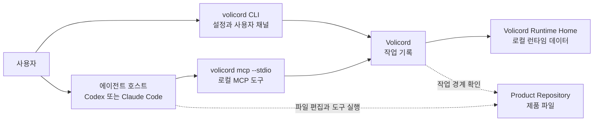
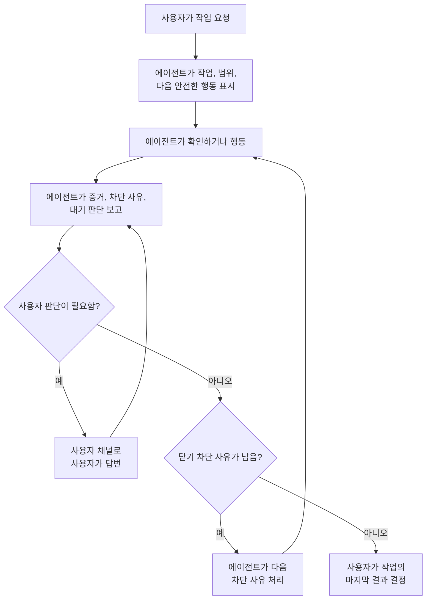

# Volicord

**AI가 움직여도, 판단은 사용자에게.**

[English](README.md) | **[한국어](README.ko.md)**

Volicord(볼리코드)는 AI 지원 제품 작업을 위한 로컬 작업 권한 기록입니다. 대화에만
남기면 안 되는 사실을 보존합니다. 여기에는 현재 작업과 범위, 제안된 쓰기, 증거,
사용자 소유 판단, 정직한 닫기를 막는 사유가 포함됩니다.

에이전트 호스트는 계속 편집기와 대화 창 역할을 합니다. Volicord는 호스트가 작업
상태를 기록하고 확인할 수 있는 로컬 MCP 도구를 제공합니다. 편집기, 셸, 테스트,
코드 리뷰, 사용자 판단을 대신하지 않습니다.

## Volicord가 유용한 경우

다음 경계를 에이전트가 계속 보이게 해야 할 때 Volicord를 사용합니다.

- 현재 `Task`에 포함되는 것과 제외되는 것
- 제안된 제품 파일 변경이 현재 적용 범위에 맞는지
- 각 주요 주장을 어떤 증거가 뒷받침하는지
- 어떤 판단이 아직 사용자에게 남아 있는지
- 작업을 닫기 전에 무엇을 해결해야 하는지

Volicord는 Codex나 Claude Code 같은 에이전트 호스트와 함께 쓰는 로컬
`Product Repository`(제품 저장소)를 대상으로 합니다. OS 샌드박스, 파일 권한 시스템,
정확성 판정기, 변조 방지 감사 로그, 중앙식 다중 사용자 서비스가 아닙니다.

## 빠른 시작

아래 경로는 현재 소스를 빌드하고 POSIX 사용자 `PATH`에 실행 파일을 설치한 뒤,
Codex를 Product Repository 하나에 연결합니다. Windows, Docker, 게시된 릴리스 자산은
[설치](docs/ko/user-guide/installation.md)를 보세요.

### 1. `volicord` 빌드와 설치

```sh
git clone https://github.com/minjungw00/Volicord.git
cd Volicord
cargo build --locked --release -p volicord-cli --bin volicord

mkdir -p "$HOME/.local/bin"
install -m 0755 target/release/volicord "$HOME/.local/bin/volicord"
volicord --version
```

`$HOME/.local/bin`이 `PATH`에 없다면 다른 명령 디렉터리를 사용하거나
[설치](docs/ko/user-guide/installation.md)의 실행 파일 찾기 안내를 따릅니다.

### 2. Product Repository 연결

```sh
volicord init --host codex --repo /path/to/your-product-repo --profile record
```

Claude Code는 `--host claude-code`를 사용합니다. 예시 경로는 에이전트가 작업할
저장소이며 Volicord 소스 저장소일 필요는 없습니다.

이 명령은 로컬 Volicord 상태를 준비하고 프로젝트 범위 호스트 설정 파일을 씁니다.
출력의 `Next` 단계를 따릅니다. 호스트 재시작이나 다시 불러오기, 프로젝트 신뢰,
MCP 승인이 더 필요할 수 있습니다.

이후 연결을 검증합니다.

```sh
volicord connection verify codex --shared --repo /path/to/your-product-repo
```

결과가 `action_required`이면 이름 붙은 동작을 완료하고 명령을 다시 실행합니다.
터미널 쪽 MCP 점검만으로 현재 호스트 세션에 Volicord 도구가 보인다고 단정할 수
없습니다. 현재 호스트에서 `volicord.list_projects`와 `volicord.status`를 사용할 수
있는지도 확인합니다.

### 3. 에이전트를 통해 작업

평소 말로 작업을 요청합니다.

```text
결제 생성에 멱등성 키 지원을 추가하고 테스트를 갱신해줘. 아직 닫기를 막는 것도 알려줘.
```

에이전트는 작업, 범위, 증거, 대기 중인 사용자 판단, 닫기 상태를 최신으로 유지해야
합니다. 사용자가 터미널에서 작업 흐름을 직접 조작할 필요는 없습니다.

사용자 판단을 기록해야 하면 Volicord가 보여 주는 답변 경로를 사용합니다. 안정적인
수동 경로는 CLI inbox입니다.

```sh
volicord inbox --repo /path/to/your-product-repo
volicord inbox answer JUDGMENT_ID --choice CHOICE_ID --repo /path/to/your-product-repo
```

작업을 끝났다고 보기 전에는 에이전트에게 현재 닫기 상태를 요청합니다. 로컬 요약도
확인할 수 있습니다.

```sh
volicord status --repo /path/to/your-product-repo
```

첫 실행 전체 흐름과 호스트별 점검은 [빠른 시작](docs/ko/user-guide/quickstart.md)과
[에이전트 호스트 설정](docs/ko/user-guide/agent-host-setup.md)을 이어서 봅니다.

## 처음 읽을 개념

| 개념 | 의미 |
|---|---|
| `Task` | 구체화하거나 수행하거나, 막혀 있거나, 닫으려는 작업 단위입니다. |
| 쓰기 티켓 | 제안된 제품 파일 변경 하나를 현재 작업 경계와 대조한 Volicord 기록입니다. OS 권한이나 쓰기가 실제로 일어났다는 증명이 아닙니다. |
| 증거 | 특정 주장을 뒷받침하는 기록입니다. 사용자 수락이나 정확성 증명이 아닙니다. |
| 사용자 판단 | 제품 방향, 중요한 기술 방향, 범위, 최종 수락, 잔여 위험 수락처럼 사용자에게 속한 결정입니다. |
| 닫기 상태 | 현재 Volicord 기록에 차단 사유가 남았는지 보여 주는 상태입니다. 판단을 돕지만 무위험 완료를 증명하지는 않습니다. |
| 사용자 채널 | 사용자 소유 판단을 기록하는 로컬 경로입니다. 에이전트 연결은 판단을 요청할 수 있지만 사용자를 대신해 기록하지 않습니다. |

정확한 권한 의미는 [Core 모델](docs/ko/reference/core-model.md)에 있습니다.

## 구성 요소

아래 그림은 처음 사용하는 사람이 알아야 할 로컬 구성 요소를 보여 줍니다. 실선은
로컬 호출이나 기록 경로를 뜻합니다. 점선은 제품 파일 작업이나 작업 경계 확인을
뜻합니다. 저장소 테이블, 정확한 API 동작, 호스트별 설정은 생략합니다.


```mermaid
flowchart LR
  user["사용자"]
  host["에이전트 호스트<br/>Codex 또는 Claude Code"]
  mcp["volicord mcp --stdio<br/>로컬 MCP 도구"]
  record["Volicord<br/>작업 기록"]
  runtime["Volicord Runtime Home<br/>로컬 런타임 데이터"]
  repo["Product Repository<br/>제품 파일"]
  cli["volicord CLI<br/>설정과 사용자 채널"]

  user --> host
  host --> mcp
  mcp --> record
  record --> runtime
  user --> cli
  cli --> record
  host -. 파일 편집과 도구 실행 .-> repo
  record -. 작업 경계 확인 .-> repo
```

일반 작업 흐름에서는 에이전트 행동과 사용자 판단을 분리합니다. 아래 그림은 가이드
수준의 전달 흐름이며 정확한 API 호출 순서가 아닙니다.


```mermaid
flowchart TD
  request["사용자가 작업 요청"]
  boundary["에이전트가 작업, 범위,<br/>다음 안전한 행동 표시"]
  action["에이전트가 확인하거나 행동"]
  status["에이전트가 증거, 차단 사유,<br/>대기 판단 보고"]
  judgment{"사용자 판단이 필요함?"}
  answer["사용자 채널로<br/>사용자가 답변"]
  close{"닫기 차단 사유가 남음?"}
  continue["에이전트가 다음<br/>차단 사유 처리"]
  finish["사용자가 작업의<br/>마지막 결과 결정"]

  request --> boundary --> action --> status --> judgment
  judgment -- 예 --> answer --> status
  judgment -- 아니오 --> close
  close -- 예 --> continue --> action
  close -- 아니오 --> finish
```

## 통합 프로필

일반적인 첫 설정에는 기록 프로필(`--profile record`)을 사용합니다. 호스트 생명주기
훅이나 세션 감시기를 요구하지 않고 MCP를 통한 협력적 작업 기록을 지원합니다.

탐지 프로필(`--profile detective`)은 선택한 호스트, 플랫폼, 저장소가 전제 조건을
충족할 때만 사용합니다. 지원되는 호스트 훅과 감시기 관찰을 추가합니다. 이 관찰은
미기록 변경을 드러낼 수 있지만 OS 수준 강제를 제공하거나 파일을 바꾼 사람을 증명하지
않습니다.

설정 선택은 [에이전트 호스트 설정](docs/ko/user-guide/agent-host-setup.md), 정확한 보장
한계는 [보안](docs/ko/reference/security.md)을 보세요.

## 보장 한계

- 쓰기 티켓은 파일시스템 권한, 코드 리뷰 승인, 최종 수락, 쓰기가 실제로 일어났다는
  증명이 아닙니다.
- 증거와 통과한 명령은 특정 주장을 뒷받침합니다. 정확성, 테스트 충분성, QA 완료,
  배포 성공, 사람 검토 완료를 증명하지 않습니다.
- 닫기 상태는 현재 기록을 바탕으로 판단을 돕습니다. 위험이 남지 않았음을 증명하지
  않습니다.
- 호스트 지침과 MCP 안내는 에이전트를 유도할 수 있습니다. 모델이 Volicord 도구를
  사용한다고 보장하지는 않습니다.

## 문서

| 필요 | 읽을 문서 |
|---|---|
| 제품 이해 | [사용자 가이드 개요](docs/ko/user-guide/overview.md) |
| 설치, 릴리스 자산, Windows, Docker | [설치](docs/ko/user-guide/installation.md) |
| 첫 작동 연결 | [빠른 시작](docs/ko/user-guide/quickstart.md) |
| 사용자 작업 흐름과 판단 예시 | [사용자 작업 흐름](docs/ko/user-guide/user-workflow.md), [판단 예시](docs/ko/user-guide/judgment-examples.md) |
| 에이전트 작업 흐름 | [에이전트 가이드](docs/ko/user-guide/agent-workflow.md) |
| 호스트 설정과 복구 | [에이전트 호스트 설정](docs/ko/user-guide/agent-host-setup.md), [문제 해결](docs/ko/user-guide/agent-host-troubleshooting.md) |
| 여러 Product Repository | [여러 저장소 에이전트 설정](docs/ko/user-guide/multi-repository-agent-setup.md) |
| 지원 환경 | [시스템 요구사항](docs/ko/reference/system-requirements.md) |
| 정확한 CLI와 MCP 동작 | [관리 CLI](docs/ko/reference/admin-cli.md), [MCP 전송](docs/ko/reference/mcp-transport.md) |
| 정확한 공개 API 계약 | [참조 색인](docs/ko/reference/README.md) |
| 보안 보장과 비보장 | [보안](docs/ko/reference/security.md) |

`volicord` 명령은 로컬 관리 명령입니다. 공개 Volicord API 메서드가 아닙니다.
