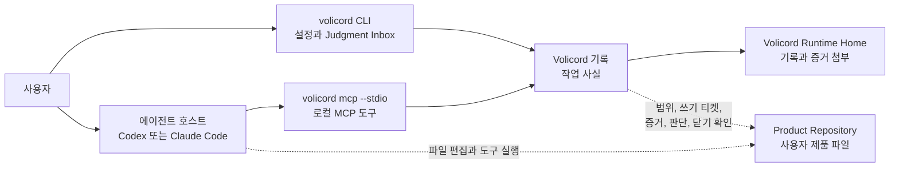
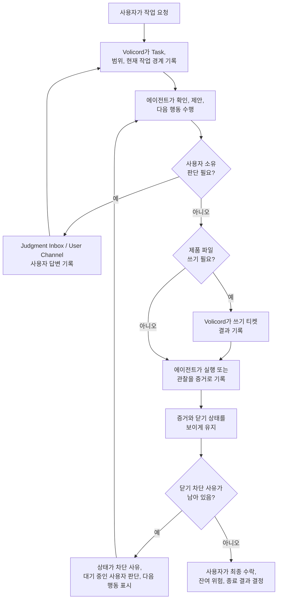

# Volicord

**AI가 움직여도, 판단은 사용자에게.**

[English](README.md) | **[한국어](README.ko.md)**

## 개요

Volicord(볼리코드)는 AI 지원 제품 작업을 위한 로컬 작업 권한 기록입니다. Codex나
Claude Code 같은 에이전트 호스트가, 대화에만 남기면 안 되는 작업 사실을 로컬 기록으로
다룰 수 있게 합니다. 어떤 작업이 활성 상태인지, 현재 범위가 무엇인지, 제안된 제품 파일
변경을 위한 어떤 쓰기 티켓이 있는지, 어떤 증거가 있는지, 어떤 판단이 아직 사용자에게
남아 있는지, 정직한 닫기를 무엇이 막는지 기록합니다.

Volicord는 에디터, 셸, 테스트, 코드 리뷰, 사용자 판단을 대체하지 않습니다. 에이전트가
그런 도구를 쓰는 동안 범위, 증거, 사용자 결정, 닫기 차단 사유를 다듬어진 요약 안에
숨기지 않도록 돕습니다.

대화 메시지, 생성된 Markdown, 상태 요약, 상태 보기는 Volicord 상태를 설명할 수 있지만
로컬 기록을 대신하지는 않습니다.

## 누가 사용하면 좋은가

Volicord는 AI 지원 제품 작업에서 아래 항목을 오래 남는 로컬 기록으로 유지하고 싶을 때
사용합니다.

- 현재 `Task`, 범위, 범위 밖 항목, 작업 경계
- 제안된 제품 파일 변경과 그 쓰기 티켓 결과
- 실행, 관찰, 주장에 대한 증거
- 에이전트가 사용자를 대신해 답하면 안 되는 대기 중인 사용자 판단
- 작업을 끝난 것으로 다루기 전의 닫기 상태와 이름 붙은 차단 사유

사용자나 팀이 실제 제품 작업에 에이전트 호스트를 이미 사용하고 있고, 범위, 증거,
사용자 소유 결정, 닫기 차단 사유가 대화가 이어지는 동안 계속 보이기를 원하는 로컬
Product Repository에 잘 맞습니다.

아래가 필요하다면 Volicord는 맞지 않습니다.

- OS sandbox(샌드박스), 네트워크 격리 계층, 파일 시스템 권한 시스템, 보안 경계
- 코드가 정확하다는 증명, 테스트가 충분하다는 증명, QA 완료 증명, 배포 성공 증명,
  사람 검토 완료 증명, 에이전트가 모든 지침을 따랐다는 증명
- 변조 불가능한 감사 로그 또는 중앙 집중식 다중 사용자 SaaS 워크플로
- 제품 방향, 최종 수락, 취소, 잔여 위험 결정을 사용자 대신 내려 주는 도구

## 빠른 시작

기본 호스트 설정에서는 `volicord` 실행 파일 하나를 준비한 뒤, 에이전트가 작업할
Product Repository에서 `volicord init`을 실행합니다. 이 체크아웃이 직접 지원하는
경로는 네이티브 소스 빌드와 로컬 Docker 이미지 빌드입니다. 릴리스 설치 스크립트는
서로 맞는 게시 설치 스크립트, archive, checksum 세트가 있어야 합니다. 소스 트리에
스크립트가 있다는 사실만으로 특정 릴리스 호스트에서 그 자산을 사용할 수 있는 것은
아닙니다. 선택한 호스트, 플랫폼, 저장소가 Detective profile의 추가 관찰 표면을
지원한다는 것을 이미 알고 있는 경우가 아니라면 `--profile record`로 시작합니다.

### 설치 또는 실행 경로 선택

네이티브 소스 빌드나 로컬 Docker 빌드 중 하나를 선택합니다. 배포처가 완전한 Volicord
릴리스 자산 세트를 제공한다면 [설치 가이드](docs/ko/user-guide/installation.md)의
조건부 릴리스 설치 경로를 사용할 수 있습니다.

#### 소스에서 네이티브 바이너리 빌드

현재 소스 트리에서 네이티브 실행 파일을 빌드할 때 이 경로를 사용합니다.

```sh
git clone https://github.com/minjungw00/Volicord.git
cd Volicord

cargo build --locked --release -p volicord-cli --bin volicord
./target/release/volicord --version
```

로컬에서 빌드한 바이너리를 사용자 `PATH`에 설치하려면 아래처럼 실행합니다.
필요하면 `$HOME/.local/bin`을 이미 `PATH`에 있는 다른 디렉터리로 바꿉니다.

```sh
mkdir -p "$HOME/.local/bin"
install -m 0755 target/release/volicord "$HOME/.local/bin/volicord"

volicord --version
```

#### 이 저장소에서 Docker 이미지 빌드 및 실행

Volicord 소스 저장소의 로컬 clone이 있고 이미지를 직접 빌드하려면 이 경로를 사용합니다.

```sh
git clone https://github.com/minjungw00/Volicord.git
cd Volicord

docker build -t volicord:local .
docker run --rm volicord:local --version
```

컨테이너에서 Product Repository에 대한 Volicord 설정을 초기화합니다.

```sh
docker run --rm -it \
  -v volicord-home:/var/lib/volicord \
  -v /path/to/your-product-repo:/workspace \
  volicord:local init --host codex --repo /workspace --profile record
```

`/path/to/your-product-repo`는 에이전트가 작업할 Product Repository입니다. 반드시
Volicord 소스 저장소일 필요는 없습니다. 이후 Docker 명령은 같은 Runtime Home 볼륨과
Product Repository mount를 재사용해야 합니다.

### Product Repository 초기화 또는 연결

에이전트가 작업할 저장소를 아래 명령으로 초기화합니다.

```sh
volicord init --host codex --repo /path/to/your-product-repo --profile record
```

Claude Code에는 `--host claude-code`를 사용합니다.

```sh
volicord init --host claude-code --repo /path/to/your-product-repo --profile record
```

`volicord init`은 대화 중심 사용을 위한 기본 첫 실행 설정 및 연결 명령입니다. 필요하면
Runtime Home을 초기화하고, 설치 프로필을 기록하며, 선택한 Product Repository를
등록하거나 재사용하고, Agent Connection을 만들며, `volicord mcp --stdio`를 시작하는
프로젝트 범위 MCP 설정을 씁니다. 또한 프로젝트 범위 Volicord 지침과 로컬 설정 파일을
쓰고 통합 상태를 기록합니다.

Codex에서는 저장소 로컬 설정으로 보통 `.codex/config.toml`,
`.volicord/policy.json`, `AGENTS.md` 안의 Volicord 관리 안내 블록이 생깁니다. Claude
Code에서는 프로젝트 설정으로 `.mcp.json`이 생기며, detective 설정은
`.claude/settings.json`, `.claude/rules/volicord.md`, `.claude/hooks/`도 쓸 수 있습니다.
이 파일은 Product Repository에 공유 Volicord와 호스트 설정을 함께 담고 싶을 때만
commit합니다. 그렇지 않다면 저장소의 일반 설정 파일 정책에 따라 로컬 설정 파일로 둡니다.

명령이 `action_required`를 보고하면 이름 붙은 호스트 통제 동작이나 로컬 동작을 따릅니다.
예를 들면 호스트 restart 또는 reload, 프로젝트 MCP 설정 승인, 프로젝트 trust, 명령
가용성 복구가 있습니다. 그런 뒤 연결을 확인합니다.

```sh
volicord connection verify codex --shared --repo /path/to/your-product-repo
volicord connection status codex --shared --repo /path/to/your-product-repo
volicord doctor
```

기본 text 출력은 대화형 사용자를 위한 사람이 읽는 요약입니다. 연결 검증과 상태에서는
먼저 `Status`, `Checks`, `Next`, `Diagnostics`를 읽습니다. 자동화와 전체 진단에는 JSON
출력을 사용하고, 간결한 text 출력을 파싱하지 않습니다.

```sh
volicord connection status codex --shared --repo /path/to/your-product-repo --json
```

CLI MCP preflight 또는 handshake 성공은 Volicord의 MCP 서버가 CLI 점검 경로에서 시작하고
응답할 수 있다는 뜻입니다. 그 자체만으로 Codex, Claude Code 또는 다른 호스트가 프로젝트
설정을 로드, 신뢰, 승인, 노출했다는 증명은 아닙니다. Codex에서는 Codex 프로젝트 trust,
Codex host runtime 관찰, `Codex host process` 환경의 호스트 MCP 명령 launch 가능성,
활성 Codex session에 Volicord 도구가 노출되는지도 함께 확인합니다.
Claude Code에서는 `claude mcp list`, `claude mcp get volicord`, 프로젝트 `.mcp.json`,
프로젝트 approval 또는 pending 상태, `/mcp`, Claude Code permissions, 활성
`volicord.list_projects` 또는 `volicord.status` 호출로 Claude Code 환경의 활성 런타임
노출을 검증합니다.

워크플로 상태를 만들기 전에는 읽기 전용 연결 점검을 사용합니다. 먼저
`volicord connection verify`를 실행하고, 활성 호스트에 `volicord.list_projects`와
`volicord.status`를 호출하게 합니다. 이 점검은 Volicord `Task` 생성을 요구하지 않아야
합니다. 워크플로 쓰기 경로 간단 점검은 Volicord 상태를 만들어도 될 때만 사용합니다.
그 경로는 `volicord.intake`, `volicord.update_scope`, `volicord.record_run`, 닫기가
필요할 때 최종 수락을 위한 `volicord.request_user_judgment`, 그리고
`volicord.check_close`를 사용할 수 있습니다. 이 워크플로 경로는 사용자가 최종 판단을
내릴 때까지 `Task`를 `missing_final_acceptance`로 막힌 상태에 둘 수 있습니다.

안내 흐름은 [빠른 시작](docs/ko/user-guide/quickstart.md)과
[에이전트 호스트 설정](docs/ko/user-guide/agent-host-setup.md)으로 이어집니다.
정확한 명령 계약은 [관리 CLI 참조](docs/ko/reference/admin-cli.md)를 보세요. 환경
지원은 [시스템 요구사항](docs/ko/reference/system-requirements.md)에 있습니다.

### 에이전트에게 평소처럼 작업 요청

초기화 뒤에는 Product Repository에서 에이전트 호스트와 대화로 일합니다. 터미널에서
워크플로를 직접 몰고 갈 필요가 없습니다.

예를 들어 대화에서 이렇게 요청합니다.

```text
결제 생성에 idempotency key 지원을 추가하고, 테스트를 갱신한 뒤, 닫기를 아직 막는 것이 무엇인지 알려줘.
```

호스트는 계속 사용자의 대화/에디터 에이전트입니다. Volicord는 오래 남는 작업 상태가
필요할 때 호스트가 호출할 수 있는 로컬 MCP 도구를 제공합니다. 에이전트는 사용할 수 있을
때 Volicord 상태를 사용하고, 사용할 수 없으면 그 사실을 명시적으로 말해야 합니다.
Volicord 도구, MCP 서버 instructions, 호스트 rule, `AGENTS.md` 안내는 에이전트를
유도하지만 모델 동작을 절대적으로 강제하지 않습니다.

### 대기 중인 사용자 판단 확인

사용자에게 속한 결정이 필요하면 Volicord는 지원되는 User Channel로 답변될 때까지 그
항목을 대기 중인 사용자 판단으로 유지합니다. 에이전트는 호스트 프롬프트, 정확한 채팅
명령, 로컬 consent URL을 보여 주거나 CLI Judgment Inbox를 사용하라고 안내할 수 있습니다.

CLI inbox 경로:

```sh
volicord inbox --repo /path/to/your-product-repo
volicord inbox answer JUDGMENT_ID --choice CHOICE_ID --repo /path/to/your-product-repo
```

에이전트는 대기 중인 사용자 판단을 조용히 무시하거나 권한을 지니는 답변을 사용자처럼
기록할 수 없습니다.

### 닫기 차단 사유 또는 닫기 상태 확인

작업을 끝난 것으로 다루기 전에 에이전트에게 현재 닫기 상태와 `volicord.check_close`
결과를 보여 달라고 요청합니다. 답변은 알려진 경우 대기 중인 사용자 판단, 빠진 증거,
미해결 미기록 변경, 잔여 위험, 다음 행동을 이름 붙여야 합니다.

CLI 확인:

```sh
volicord status --repo /path/to/your-product-repo
```

미기록 변경이 이름 붙어 있고 지원되는 조정 경로가 필요할 때 `volicord changes reconcile`을
사용합니다. Volicord가 아직 차단 사유를 보고하는 동안 다듬어진 대화 요약만으로 닫지
않습니다.

## 일반 에이전트 사용

일반 대화에서 에이전트는 Volicord를 사용해 아래 일을 할 수 있습니다.

- `Task` 만들기 또는 갱신
- 현재 범위, 차단 사유, 증거, 대기 중인 사용자 판단 보여 주기
- 제안된 제품 파일 변경을 위한 쓰기 티켓 준비
- 필요할 때 증거 첨부 입력을 준비한 뒤 실행 또는 관찰을 통해 증거 기록
- 초점이 맞춰진 사용자 판단 요청
- 에이전트가 완료를 주장하기 전에 닫기 상태 확인

중요한 습관은 단순합니다. 범위, 증거, 사용자 결정, 쓰기, 닫기 상태가 중요할 때
에이전트에게 Volicord 상태를 최신으로 유지하라고 요청합니다. 사용자는 평소의 에이전트
대화에 머물고, Volicord는 로컬 작업 흐름 사실을 계속 보이게 합니다.

## 보장 한계

Volicord는 작업 권한을 보이게 하지만 권한 시스템, 보안 경계, 정확성 판정기, 사람 검토
대체물이 아닙니다.

- 쓰기 티켓은 OS 권한, 코드 리뷰 승인, 최종 수락, 쓰기가 실제로 일어났다는 증명이
  아닙니다.
- Detective profile의 hook과 watcher 출력은 협력형 또는 탐지형 신호입니다. OS 수준
  차단, 행위자 증명, 네트워크 격리, sandbox(샌드박스)가 아닙니다.
- 증거와 성공한 명령 실행은 주장을 뒷받침하지만, 정확성, 테스트 충분성, QA 완료,
  배포 성공, 사람 검토 완료의 증명이 아닙니다.
- 닫기 상태는 현재 Volicord 기록을 바탕으로 판단을 돕는 자료이지 무위험 완료의 증명이
  아닙니다.
- Volicord 기록은 로컬 작업 흐름 기록입니다. 변조 불가능한 감사 로그로 취급하지
  않습니다.

자세한 보장 종류와 명시적 비보장은 [보안 참조](docs/ko/reference/security.md)에
정리되어 있습니다.

## 처음 읽을 개념

README의 나머지 내용을 읽을 때는 아래 모델을 사용합니다.

| 개념 | 첫 사용자에게 필요한 의미 |
|---|---|
| `Task` | 구체화되거나, 작업 중이거나, 막혀 있거나, 닫히는 사용자 가치 단위입니다. 현재 목표, 범위, 범위 밖 항목, 현재 작업 경계를 담습니다. |
| 쓰기 티켓 | 제품 파일 변경은 현재 `Task`와 현재 범위에 호환되어야 합니다. 쓰기 티켓은 제안된 제품 파일 변경 하나에 대한 Volicord 작업 권한 판단을 기록합니다. OS 권한, 코드 리뷰 승인, 최종 수락, 쓰기가 실제로 일어났다는 증명이 아닙니다. |
| 증거 | 실행, 관찰, 증거 첨부처럼 특정 주장을 뒷받침하도록 기록된 자료입니다. 증거는 주장을 돕지만 사용자 판단이나 정확성 증명이 되지는 않습니다. |
| 사용자 판단 | 제품 방향, 중요한 기술 방향, 범위, 민감 동작, 최종 수락, 잔여 위험 수락, 취소처럼 사용자에게 속한 결정입니다. |
| 닫기 상태 | 현재 `Task`를 미해결 요구사항을 숨기지 않고 정직하게 끝낼 수 있는지 확인하는 일입니다. 닫기 상태는 판단을 돕는 자료이지 정확성, 테스트 충분성, QA 완료, 배포 성공, 사람 검토 완료, 무위험 완료의 증명이 아닙니다. |

## 구성 요소가 맞물리는 방식

이 지도는 처음 사용하는 독자가 알아야 할 로컬 구성 요소를 보여 줍니다. 실선 화살표는
일반적인 로컬 호출 또는 기록 경로입니다. 점선 화살표는 공개 Volicord API 밖의 제품
파일 작업이나 호환성 관계를 뜻합니다. 저장소 테이블, 완전한 API 동작, 호스트별 설정
세부사항은 생략합니다.


```mermaid
flowchart LR
  user["사용자"]
  host["에이전트 호스트<br/>Codex 또는 Claude Code"]
  mcp["volicord mcp --stdio<br/>로컬 MCP 도구"]
  record["Volicord 기록<br/>작업 사실"]
  runtime["Volicord Runtime Home<br/>기록과 증거 첨부"]
  repo["Product Repository<br/>사용자 제품 파일"]
  cli["volicord CLI<br/>설정과 Judgment Inbox"]

  user --> host
  host --> mcp
  mcp --> record
  record --> runtime
  user --> cli
  cli --> record
  host -. 파일 편집과 도구 실행 .-> repo
  record -. 범위, 쓰기 티켓,<br/>증거, 판단, 닫기 확인 .-> repo
```

작업 순환은 사용자 결정, 에이전트 작업, Volicord 기록을 분리해 둡니다. 화살표는 개요 수준의
작업 전달을 보여 주며, 정확한 API 호출 순서를 뜻하지 않습니다.


```mermaid
flowchart TD
  request["사용자가 작업 요청"]
  task["Volicord가 Task,<br/>범위, 현재 작업 경계 기록"]
  agent["에이전트가 확인, 제안,<br/>다음 행동 수행"]
  judgment{"사용자 소유<br/>판단 필요?"}
  inbox["Judgment Inbox / User Channel<br/>사용자 답변 기록"]
  write{"제품 파일<br/>쓰기 필요?"}
  ticket["Volicord가 쓰기 티켓<br/>결과 기록"]
  run["에이전트가 실행 또는<br/>관찰을 증거로 기록"]
  evidence["증거와 닫기 상태를<br/>보이게 유지"]
  close{"닫기 차단 사유가<br/>남아 있음?"}
  status["상태가 차단 사유,<br/>대기 중인 사용자 판단, 다음 행동 표시"]
  finish["사용자가 최종 수락,<br/>잔여 위험, 종료 결과 결정"]

  request --> task --> agent --> judgment
  judgment -- 예 --> inbox --> task
  judgment -- 아니오 --> write
  write -- 예 --> ticket --> run
  write -- 아니오 --> run
  run --> evidence --> close
  close -- 예 --> status --> agent
  close -- 아니오 --> finish
```

## 통합 프로필

`volicord init`의 기본값은 `--profile record`입니다. `--profile`을 생략하면 일반 첫
사용자 설정이 됩니다. Record profile은 host lifecycle hook이나 session watcher를
요구하지 않고 MCP를 통한 협력적 작업 흐름 기록을 지원합니다.

Detective profile(`--profile detective`)은 선택한 호스트, 플랫폼, Product Repository가 추가
관찰 표면을 지원할 때만 사용합니다. Record profile 모델은 그대로 유지하면서 지원되는
host hook과 session watcher를 더합니다. 이는 협력형·탐지형 신호이며 OS 수준 강제나
파일을 바꾼 행위자의 증명이 아닙니다.

설정 뒤에는 빠른 시작의 검증 명령을 사용하고, 이름 붙은 `action_required` 단계가 있으면
따릅니다. 현재 역량과 진단 세부사항은 [에이전트 호스트 설정](docs/ko/user-guide/agent-host-setup.md)과
[에이전트 호스트 문제 해결](docs/ko/user-guide/agent-host-troubleshooting.md)을 보세요.
정확한 명령 동작은 [관리 CLI 참조](docs/ko/reference/admin-cli.md)를 보세요.

## 미기록 변경과 닫기 차단 사유

Detective 관찰이 활성화되어 있으면 Volicord는 기록된 작업과 맞지 않는 제품 파일 변경을
미기록 변경으로 보고할 수 있습니다. 이 관찰은 한정된 신호이며 파일을 바꾼 행위자나
의도를 증명하거나 쓰기를 막지 않습니다. 해결되지 않은 미기록 변경은 닫기를 막습니다.

채팅에서는 에이전트에게 `volicord.reconcile_changes` 결과와 다음 행동을 보여 달라고
요청합니다. CLI 복구 경로는 `volicord changes reconcile`입니다. 작업 흐름 안내는
[에이전트 가이드](docs/ko/user-guide/agent-workflow.md)를, 정확한 메서드 동작은
[`volicord.reconcile_changes` 참조](docs/ko/reference/api/method-reconcile-changes.md)를
보세요.

## 사용자 판단 캡처

사용자 판단은 사용자에게 남습니다. Agent Connection은 판단을 요청할 수 있지만,
권한을 지니는 사용자 답변을 사용자처럼 기록하면 안 됩니다.

활성 Agent Connection에 따라 Volicord는 호스트 프롬프트, 정확한 검증 채팅 명령,
loopback 로컬 consent URL, 빠른 시작에서 본 CLI inbox 경로 중 하나를 보여 줄 수
있습니다. 그 대기 판단에 대해 Volicord가 제시한 경로를 사용합니다. 실무 협업 흐름은
[사용자 작업 흐름](docs/ko/user-guide/user-workflow.md)을, 정확한 입력 방법과 권한 경계는
[Agent Connection 참조](docs/ko/reference/agent-connection.md)를 보세요.

## Docker Local HTTP transport

Local HTTP는 고급 로컬/Docker MCP 전송이며 기본 에이전트 호스트 설정, 공개 네트워크
API, 보안 경계가 아닙니다. 완전한 host-loopback Docker 절차는
[설치](docs/ko/user-guide/installation.md)에, 정확한 전송 동작은
[MCP 전송](docs/ko/reference/mcp-transport.md)에 있습니다.

## 문제 해결

먼저 이름 붙은 `action_required` 단계와 빠른 시작의 검증 명령을 사용합니다. 실행 파일을
사용할 수 없거나 `PATH` 문제가 있으면 [설치](docs/ko/user-guide/installation.md)를
보세요. 호스트 신뢰, 승인, hook, watcher, 프로젝트 선택, MCP 시작 문제는
[에이전트 호스트 문제 해결](docs/ko/user-guide/agent-host-troubleshooting.md)을
사용합니다. 정확한 진단 상태와 복구 명령은 이 랜딩 문서에 반복하지 않고 해당 담당
문서에 둡니다.

## 더 읽을 문서

| 필요 | 읽을 문서 |
|---|---|
| 설치 세부사항과 Docker 예시 | [설치](docs/ko/user-guide/installation.md) |
| 단계별 첫 설정 | [빠른 시작](docs/ko/user-guide/quickstart.md) |
| 호스트 설정과 복구 | [에이전트 호스트 설정](docs/ko/user-guide/agent-host-setup.md)과 [에이전트 호스트 문제 해결](docs/ko/user-guide/agent-host-troubleshooting.md) |
| 사용자 작업 흐름과 판단 경계 | [사용자 가이드](docs/ko/user-guide/user-workflow.md) |
| 지원 환경 | [시스템 요구사항](docs/ko/reference/system-requirements.md) |
| 정확한 CLI 플래그, JSON 필드, 결과 상태, 출력 계약 | [관리 CLI 참조](docs/ko/reference/admin-cli.md) |
| MCP stdio와 HTTP 전송 | [MCP 전송](docs/ko/reference/mcp-transport.md) |
| Agent Connection과 User Channel 경계 | [Agent Connection 참조](docs/ko/reference/agent-connection.md) |
| 정확한 권한 구조 | [Core 모델](docs/ko/reference/core-model.md) |
| 보안 표현과 비보장 | [보안 참조](docs/ko/reference/security.md) |
| 공개 API 메서드와 스키마 | [참조 색인](docs/ko/reference/README.md) |

Volicord 명령은 로컬 관리 명령이며 공개 Volicord API 메서드가 아닙니다. 정확한 공개 API
동작은 참조 문서에 있습니다.
