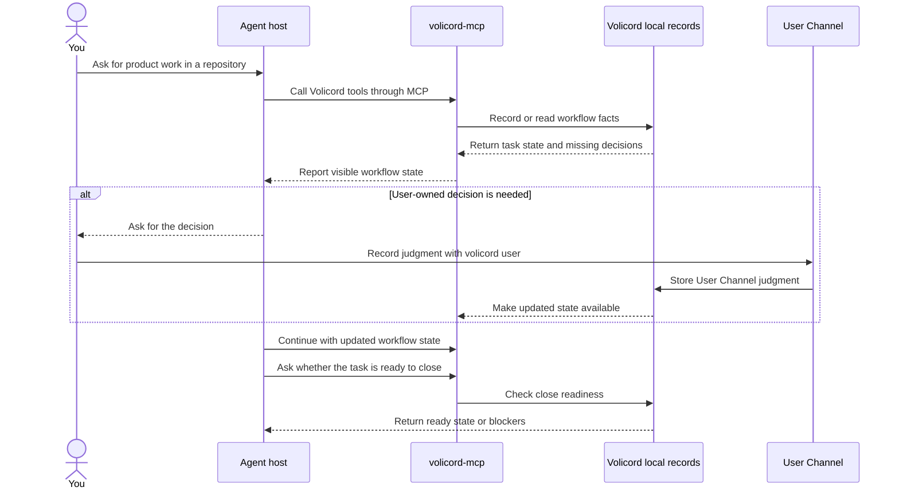
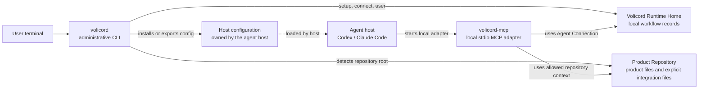

# Volicord

**AI moves. Judgment stays yours.**

**[English](README.md)** | [Korean](README.ko.md)

Volicord is a local work-authority system for AI-assisted product work. It
gives a user and an agent host a local place to keep workflow facts visible
while work moves through chat, tools, shells, tests, and repository files.

When everything stays only in chat, it can become unclear what the agent is
trying to do, what evidence supports a claim, whether a write is ready, which
decision belongs to the user, and what still blocks an honest close. Volicord
records those workflow facts in a local `Volicord Runtime Home` so they do not
depend on memory or a polished summary.

Core is the local authority record for Volicord state. Chat messages, generated
Markdown, status summaries, and projections can describe that state, but they
do not replace it.

## Overview

Volicord helps keep these questions explicit during agent-assisted product
work:

- What is the agent trying to do?
- What is in scope and out of scope?
- What evidence supports the current claim?
- Is a write ready under the current scope?
- What did the agent run or record?
- Which user-owned decision is still needed?
- What still blocks an honest close?

## Why Volicord Exists

AI-assisted product work can move quickly. A user may ask an agent host to
change behavior, investigate a failure, update tests, or prepare release notes.
The agent may inspect files, run commands, write code, and summarize the result.

That speed is useful, but it can blur boundaries if the durable record lives
only in chat. Scope can drift. Acceptance can sound implied. Residual risk can
disappear from the conversation. A product decision can be hidden inside an
implementation step. Volicord exists so scope, evidence, write readiness, user
judgment, run records, and close readiness stay visible as separate workflow
facts.

## First Concepts

These terms appear throughout the README and the rest of the documentation:

| Term | First-read meaning |
|---|---|
| Product repository | The code repository where you want the agent to work. In Volicord references this exact product label is `Product Repository`. |
| Agent host | The environment you chat with, such as Codex or Claude Code. The host may start local MCP tools while it works. |
| `volicord-mcp` | The local stdio MCP adapter that an agent host uses to talk to Volicord. |
| `Volicord Runtime Home` | The local place where Volicord stores workflow records and runtime data. It is separate from your product repository. |
| `Agent Connection` | The local connection record that lets one host use Volicord for repository work. |
| `User Channel` | The path where the user records decisions that the agent must not invent or impersonate. The current local CLI path is `volicord user`. |

For exact term ownership, use the
[Glossary](docs/en/reference/glossary.md) and
[Reference Index](docs/en/reference/README.md).

## Quick Start

From this Volicord source checkout, build the local binaries, put them on your
current shell `PATH`, prepare Volicord, then connect Codex from the product
repository you want the agent to work on:

```sh
cargo build --workspace --bins
export PATH="$PWD/target/debug:$PATH"
volicord setup
cd /path/to/your-product-repo
volicord connect codex
```

The `export PATH=...` line affects only the current terminal session. It lets
that shell find the freshly built `volicord` and `volicord-mcp` commands. Use
the Installation guide when you want commands to be available persistently; for
example, `--link-bin` is an installation detail, not a required root README
quick-start step.

`/path/to/your-product-repo` means the path to your own product repository, not
a Volicord term or required directory name. `volicord connect codex` detects the
repository root from the current directory, registers or reuses that repository
project, creates or updates the matching `Agent Connection`, and installs the
supported Codex host configuration for that connection.

Exact setup, connection, option, and output behavior belongs to the
[Administrative CLI Reference](docs/en/reference/admin-cli.md). For a fuller
tutorial, see [Quickstart](docs/en/getting-started/quickstart.md).

## A User Request In Practice

After setup, the ordinary flow starts with you asking an agent host to work on a
repository:

> Add idempotency-key support for payment creation, update the tests, and tell
> me when it is ready to close.

The host remains your editor/chat agent. Volicord does not replace the editor,
shell, test runner, or review process. Instead, the host uses Volicord tools
through `volicord-mcp` when it needs durable workflow state. Volicord records or
reads local workflow facts: task intent, current scope, evidence, checks and
runs, write readiness, pending user judgments, and close-readiness blockers.

If the work needs a product decision, scope change, sensitive step, final
acceptance, residual-risk acceptance, or cancellation, the host can ask for the
decision. It must not invent the answer. You record authority-bearing answers
through the `User Channel`, for example with `volicord user`, and the host can
continue from the updated Volicord state. Before closing, the host can ask
Volicord whether unresolved blockers still make the close dishonest.

## User Workflow

This first-read workflow shows collaboration order and decision handoffs.
It intentionally omits full API call order, storage layout, and component
ownership; exact Core authority, MCP transport, and runtime boundaries belong
to the
[Core Model](docs/en/reference/core-model.md),
[MCP Transport](docs/en/reference/mcp-transport.md), and
[Runtime Boundaries](docs/en/reference/runtime-boundaries.md) references.



Close readiness is decision support. It does not prove product correctness,
test sufficiency, QA completion, deployment success, or risk-free outcomes.

## Local Component Map

This map shows local launches, configuration loading, record access, and
repository-context use. It is distinct from the user workflow above and
intentionally does not show every runtime call or storage effect. Exact
command, MCP, Agent Connection, and runtime-boundary behavior belongs to the
[Administrative CLI](docs/en/reference/admin-cli.md),
[MCP Transport](docs/en/reference/mcp-transport.md),
[Agent Connection](docs/en/reference/agent-connection.md), and
[Runtime Boundaries](docs/en/reference/runtime-boundaries.md) references.



The `Volicord Runtime Home` is separate from the `Product Repository`. Volicord
runtime records, SQLite files, generated records, logs, QA results, acceptance
records, close-readiness state, and residual-risk records do not belong in your
product files. A `Product Repository` may contain only explicit integration
files owned by supported setup flows, such as project-scoped host configuration
or managed guidance.

## What Volicord Helps Keep Visible

Volicord is useful when the work needs more than a chat transcript. It helps
keep these workflow facts visible:

- task intent
- scope boundaries
- supporting evidence
- checks and runs
- write readiness
- pending user judgment
- blockers to an honest close

## What Volicord Does Not Decide For You

Volicord keeps boundaries visible, but the product judgment remains yours:

- It does not prove product correctness.
- It does not replace tests or review.
- It does not grant OS-level write permission.
- It does not let the agent invent user-owned judgments.
- It does not let MCP calls infer project identity from memory.

## Where To Go Next

| Need | Read |
|---|---|
| Install and verify executables | [Installation](docs/en/getting-started/installation.md), then [Quickstart](docs/en/getting-started/quickstart.md) |
| Understand the user work loop | [User Guide](docs/en/guides/user-workflow.md) |
| Set up or repair an agent host | [Agent Host Setup](docs/en/guides/agent-host-setup.md) and [Agent Host Troubleshooting](docs/en/guides/agent-host-troubleshooting.md) |
| Understand agent behavior boundaries | [Agent Guide](docs/en/guides/agent-workflow.md) |
| Check exact CLI, MCP, and runtime contracts | [Administrative CLI Reference](docs/en/reference/admin-cli.md), [MCP Transport](docs/en/reference/mcp-transport.md), and [Runtime Boundaries](docs/en/reference/runtime-boundaries.md) |
| Understand Core authority concepts | [Core Model](docs/en/reference/core-model.md) |
| Learn the implementation | [Codebase Tour](docs/en/development/codebase-tour.md) |

Volicord commands are local administrative commands, not public Volicord API
methods. Exact public API behavior is owned by the
[Reference Index](docs/en/reference/README.md).
