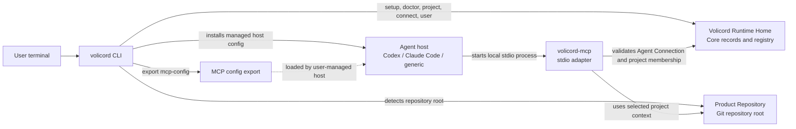

# Volicord

AI moves. Judgment stays yours.

Volicord is a local work-authority system for AI-assisted product work. It
keeps scope, evidence, write readiness, user judgment, and close decisions
visible while agents work through your normal product repositories.

Core is the local authority record for Volicord state. The `volicord`
administrative CLI prepares the local setup, detects repository projects,
connects agent hosts, exports MCP configuration, and provides the local
`User Channel` path for user-owned judgments. The `volicord-mcp` process is the
local MCP adapter that agent hosts start.

## Fast Start

Build the local binaries, create the installation profile, move into a product
repository, and connect Codex:

```sh
cargo build --workspace --bins
./target/debug/volicord setup --link-bin ~/.local/bin
cd /work/acme-api
volicord connect codex
```

What happens:

- `volicord setup` prepares the selected `Volicord Runtime Home` and records
  the installation profile used by later CLI, host connection, export, and MCP
  startup flows.
- `volicord connect codex` detects the Git repository root from the current
  directory, registers or reuses that repository project, derives the project
  name from the repository directory, creates or updates the matching
  `Agent Connection`, and installs the managed host configuration.
- Exact setup behavior, connection defaults, option semantics, and output
  behavior belong to the
  [Administrative CLI Reference](docs/en/reference/admin-cli.md).

Check the result:

```sh
volicord doctor
volicord project current
volicord connection status codex
volicord connection verify codex
```

If your shell cannot find `volicord` after setup with `--link-bin`, add that
link directory to your shell configuration and start a new shell or MCP host.

If a command reports `action_required`, complete the named host-owned trust,
approval, reload, restart, or setup repair action, then rerun the relevant
status or verification command.

## What Volicord Manages

| Area | What you provide | What Volicord manages |
|---|---|---|
| Installation profile | The `volicord` executable you run, and optionally a link directory or explicit `volicord-mcp` path during setup. | Runtime Home readiness, the stored `volicord` and `volicord-mcp` commands, and setup diagnostics. |
| Runtime Home | Usually nothing; the default is used unless `VOLICORD_HOME` or `volicord setup --home` selects another path. | Registry state, project state, Agent Connection records, artifacts, and setup metadata. |
| Repository project | A Git repository path, usually the current directory. | Project registration, a user-facing project name derived from the repository directory, and internal project identities. |
| Agent Connection | Host and intent: for example `codex`, `claude-code --shared`, or `claude-code --global`. | Host configuration, connection mode, project membership, internal connection identities, verification state, and required user actions. |
| MCP config export | An optional output path for hosts Volicord does not manage directly. | A host-neutral MCP config bound to the selected repository and installation profile. |
| User Channel | A user choosing a Core-generated option. | Local user judgment commands that keep authority-bearing answers separate from Agent Connections. |

## Component Diagram



The `Volicord Runtime Home` is separate from the `Product Repository`.
Volicord-managed runtime records do not live in your project files. Shared host
configuration can appear in a repository only through explicit integration files
owned by the relevant host setup flow.

## Core Workflow

1. Prepare executables and installation profile.

   ```sh
   cargo build --workspace --bins
   ./target/debug/volicord setup --link-bin ~/.local/bin
   volicord doctor
   ```

2. Enter the product repository.

   ```sh
   cd /work/acme-api
   volicord project current
   ```

   If the project is not registered yet, `volicord connect ...` or
   `volicord project use` can register it from the detected Git root.

3. Connect an agent host.

   ```sh
   volicord connect codex
   ```

   For project-shared, user-wide, or read-oriented variants, continue with the
   [Quickstart](docs/en/getting-started/quickstart.md). Exact option semantics
   belong to the [Administrative CLI Reference](docs/en/reference/admin-cli.md).

4. Inspect and verify connection state.

   ```sh
   volicord connections
   volicord connection status codex
   volicord connection verify codex
   ```

5. Export generic MCP configuration when a host needs a config file Volicord
   does not manage directly.

   ```sh
   volicord export mcp-config --output /tmp/volicord.mcp.json
   ```

6. Keep user-owned judgment on the User Channel.

   ```sh
   volicord user status
   volicord user judgments
   volicord user judgment show 1
   volicord user judgment answer 1 1
   ```

   Agent Connections can request or show focused judgment needs, but they do
   not record authority-bearing user answers. Use `volicord user ...` when a
   Core-generated option must become the user's recorded judgment.

## Documentation Routes

| Need | Read |
|---|---|
| Install and verify executables | [Installation](docs/en/getting-started/installation.md) |
| First successful host connection | [Quickstart](docs/en/getting-started/quickstart.md) |
| Host setup details and connection intents | [Agent Host Setup](docs/en/guides/agent-host-setup.md) |
| Host recovery and `action_required` states | [Agent Host Troubleshooting](docs/en/guides/agent-host-troubleshooting.md) |
| User-owned judgment and close workflow | [User Guide](docs/en/guides/user-workflow.md) |
| Agent behavior boundaries | [Agent Guide](docs/en/guides/agent-workflow.md) |
| Exact CLI behavior | [Administrative CLI Reference](docs/en/reference/admin-cli.md) |
| Runtime and repository boundary | [Runtime Boundaries](docs/en/reference/runtime-boundaries.md) |
| MCP process behavior | [MCP Transport](docs/en/reference/mcp-transport.md) |
| Source-code learning path | [Codebase Tour](docs/en/development/codebase-tour.md) |

Volicord commands are local administrative commands, not public Volicord API
methods. Exact public API behavior is owned by the [Reference Index](docs/en/reference/README.md).
