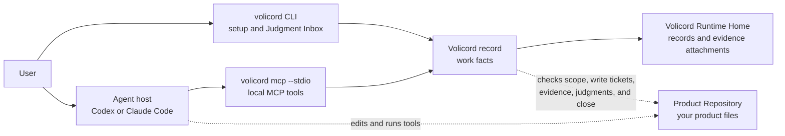
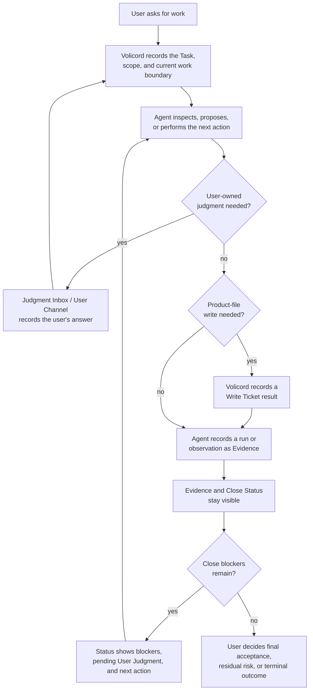

# Volicord

**AI moves. Judgment stays yours.**

**[English](README.md)** | [한국어](README.ko.md)

## Overview

Volicord is a local work authority record for AI-assisted product work. It gives
an agent host, such as Codex or Claude Code, a local record of work facts that
should not live only in chat: what task is active, what scope is current, what
write tickets exist for proposed product-file changes, what evidence exists,
what judgment still belongs to the user, and what blocks an honest close.

Volicord is not a replacement for your editor, shell, tests, code review, or
judgment. It helps an agent use those things without hiding scope, evidence,
user decisions, or close blockers inside a polished summary.

Chat messages, generated Markdown, status summaries, and projections can
describe Volicord state, but they do not replace the local record.

## Who Should Use Volicord

Use Volicord when you want AI-assisted product work to keep durable local
records for:

- the current `Task`, scope, non-goals, and work boundary
- proposed product-file changes and their Write Ticket results
- Evidence for runs, observations, and claims
- pending User Judgment that the agent must not answer for you
- Close Status and named blockers before a task is treated as finished

It is a good fit for local Product Repositories where a user or team already
uses an agent host for real product work and wants scope, evidence, user-owned
decisions, and close blockers to stay visible across the conversation.

Volicord is not a good fit when you need:

- an OS sandbox, network isolation layer, file-system permission system, or
  security boundary
- proof that code is correct, tests are sufficient, QA is complete, deployment
  succeeded, human review happened, or an agent followed every instruction
- a tamper-proof audit log or centralized multi-user SaaS workflow
- a tool that makes product direction, final acceptance, cancellation, or
  residual-risk decisions for the user

## Quick Start

For default host setup, prepare one `volicord` executable, then run
`volicord init` in the Product Repository where the agent will work. This
checkout directly supports a native source build and a locally built Docker
image. The release installer scripts require a matching published installer,
archive, and checksum set; their presence in the source tree does not mean
those assets are available from a particular release host. Start with
`--profile record` unless you already know the selected host, platform, and
repository support the extra Detective profile observation surfaces.

### Choose An Install Or Run Path

Choose a native source build or a local Docker build. If a distributor provides
a complete Volicord release-asset set, the
[Installation guide](docs/en/user-guide/installation.md) explains the
conditional release-installer path.

#### Build Native Binary From Source

Use this path for a native executable built from the current source tree.

```sh
git clone https://github.com/minjungw00/Volicord.git
cd Volicord

cargo build --locked --release -p volicord-cli --bin volicord
./target/release/volicord --version
```

To install that locally built binary on your user `PATH`, replace
`$HOME/.local/bin` with another directory already on `PATH` if needed:

```sh
mkdir -p "$HOME/.local/bin"
install -m 0755 target/release/volicord "$HOME/.local/bin/volicord"

volicord --version
```

#### Build And Run Docker Image From This Repository

Use this path when you have a local clone of the Volicord source repository and
want to build the image yourself.

```sh
git clone https://github.com/minjungw00/Volicord.git
cd Volicord

docker build -t volicord:local .
docker run --rm volicord:local --version
```

To initialize Volicord for a Product Repository from the container:

```sh
docker run --rm -it \
  -v volicord-home:/var/lib/volicord \
  -v /path/to/your-product-repo:/workspace \
  volicord:local init --host codex --repo /workspace --profile record
```

`/path/to/your-product-repo` is the Product Repository where the agent will
work, not necessarily the Volicord source repository. Later Docker commands
should reuse the same Runtime Home volume and Product Repository mount.

### Initialize Or Connect The Product Repository

Initialize the repository where the agent should work:

```sh
volicord init --host codex --repo /path/to/your-product-repo --profile record
```

Use `--host claude-code` for Claude Code:

```sh
volicord init --host claude-code --repo /path/to/your-product-repo --profile record
```

`volicord init` is the primary first-run setup and connection command for
chat-first use. It initializes the Runtime Home if needed, records the
installation profile, registers or reuses the selected Product Repository,
creates the Agent Connection, writes project-scoped MCP configuration that
starts `volicord mcp --stdio`, writes project-scoped Volicord guidance and
local setup files, and records integration status.

For Codex, repo-local setup usually includes `.codex/config.toml`,
`.volicord/policy.json`, and a managed Volicord guidance block in `AGENTS.md`.
For Claude Code, project setup writes `.mcp.json`; detective setup can also
write `.claude/settings.json`, `.claude/rules/volicord.md`, and
`.claude/hooks/`. Commit these files only when you want shared Volicord and
host setup to travel with the Product Repository; otherwise keep them as local
setup files according to the repository's normal configuration policy.

If the command reports `action_required`, follow the named host-controlled or
local action, such as restarting or reloading the host, approving project MCP
configuration, trusting the project, or repairing command availability. Then
verify the connection:

```sh
volicord connection verify codex --shared --repo /path/to/your-product-repo
volicord connection status codex --shared --repo /path/to/your-product-repo
volicord doctor
```

Default text output is an interactive human summary. For connection
verification and status, read `Status`, `Checks`, `Next`, and `Diagnostics`
first. For automation and full diagnostics, use JSON output and do not parse
the compact text:

```sh
volicord connection status codex --shared --repo /path/to/your-product-repo --json
```

CLI MCP preflight or handshake success means Volicord's MCP server can start
and respond from the CLI check path. It does not by itself prove that Codex,
Claude Code, or another host has loaded, trusted, approved, or exposed the
project configuration. For Codex, also check Codex project trust, Codex host
runtime observation, host MCP command launchability in the Codex host process
environment, and whether Volicord tools are exposed in the active Codex
session.
For Claude Code, use `claude mcp list`, `claude mcp get volicord`, project
`.mcp.json`, project approval or pending state, `/mcp`, Claude Code
permissions, and an active `volicord.list_projects` or `volicord.status` call
to validate active runtime exposure in the Claude Code environment.

Before creating workflow state, use a read-only connection check: run
`volicord connection verify`, then ask the active host to call
`volicord.list_projects` and `volicord.status`. That check should not require
creating a Volicord `Task`. Use a workflow write-path smoke check only when you
are willing to create Volicord state: `volicord.intake`,
`volicord.update_scope`, `volicord.record_run`,
`volicord.request_user_judgment` for final acceptance when close is required,
and `volicord.check_close`. The workflow path may leave the task blocked by
`missing_final_acceptance` until you make the final judgment.

The guided flow continues in [Quickstart](docs/en/user-guide/quickstart.md) and
[Agent Host Setup](docs/en/user-guide/agent-host-setup.md). Exact command
contracts live in the
[Administrative CLI Reference](docs/en/reference/admin-cli.md). Environment
support lives in [System Requirements](docs/en/reference/system-requirements.md).

### Ask The Agent To Work Normally

After initialization, work through the agent host in the Product Repository. You
do not need to drive the workflow from the terminal.

For example, ask in chat:

```text
Add idempotency-key support for payment creation, update the tests, and tell me what still blocks close.
```

The host remains your chat/editor agent. Volicord provides local MCP tools the
host can call when durable workflow state matters. Agents should use Volicord
state when it is available and say explicitly when it is unavailable. Volicord
tools, MCP server instructions, host rules, and `AGENTS.md` guidance help steer
the agent, but they do not absolutely force model behavior.

### Check Pending User Judgments

When a decision belongs to the user, Volicord keeps it as pending User Judgment
until it is answered through a supported User Channel. The agent may show a host
prompt, an exact chat command, a local consent URL, or tell you to use the CLI
Judgment Inbox.

CLI inbox path:

```sh
volicord inbox --repo /path/to/your-product-repo
volicord inbox answer JUDGMENT_ID --choice CHOICE_ID --repo /path/to/your-product-repo
```

Agents cannot silently dismiss pending User Judgment or record
authority-bearing answers as if they were the user.

### Check Close Blockers Or Close Status

Before treating work as finished, ask the agent to show the current Close Status
and `volicord.check_close` results. The answer should name pending User
Judgment, missing evidence, unresolved Unrecorded Changes, residual risks, and
the next action when those facts are known.

CLI check:

```sh
volicord status --repo /path/to/your-product-repo
```

Use `volicord changes reconcile` when Unrecorded Changes are named and need a
supported reconciliation path. Do not close from a polished chat summary while
Volicord still reports blockers.

## Normal Agent Use

In ordinary chat, the agent can use Volicord to:

- create or update a `Task`
- show current scope, blockers, evidence, and pending User Judgment
- prepare a write ticket for a proposed product-file change
- prepare Evidence attachment inputs when needed, then record Evidence through
  runs or observations
- request a focused user judgment
- check Close Status before the agent claims completion

The important habit is simple: ask the agent to keep Volicord state current
when scope, evidence, user decisions, writes, or Close Status matter. You
stay in the normal agent conversation, and Volicord keeps the local workflow
facts visible.

## Guarantee Limits

Volicord keeps work authority visible, but it is not a permission system,
security boundary, correctness oracle, or human review replacement.

- Write Tickets are not OS permission, code review approval, final acceptance,
  or proof that a write occurred.
- Detective profile hooks and watcher output are cooperative or detective
  signals. They are not OS-level blocking, actor proof, network isolation, or a
  sandbox.
- Evidence and successful command runs support claims, but they are not proof
  of correctness, test sufficiency, QA completion, deployment success, or human
  review completion.
- Close Status is decision support from current Volicord records, not proof of
  risk-free completion.
- Volicord records are local workflow records. Do not treat them as a
  tamper-proof audit log.

Detailed guarantee classes and explicit non-guarantees live in the
[Security Reference](docs/en/reference/security.md).

## Beginner Concepts

Use this short model when reading the rest of the README:

| Concept | First-user meaning |
|---|---|
| `Task` | The user-value unit being shaped, worked, blocked, or closed. It carries the current goal, scope, non-goals, and current work boundary. |
| Write Ticket | A product-file change should be compatible with the current `Task` and current scope. A Write Ticket records a Volicord work-authority decision for one proposed product-file change; it is not OS permission, code review approval, final acceptance, or proof that a write occurred. |
| Evidence | Recorded support for a specific claim, such as a run, observation, or evidence attachment. Evidence supports claims, but it does not become user judgment or proof of correctness. |
| User Judgment | A decision that belongs to the user: product direction, material technical direction, scope, sensitive action, final acceptance, residual-risk acceptance, cancellation, or similar authority-bearing choices. |
| Close Status | A check that the current `Task` can finish honestly without hiding unresolved requirements. Close Status is decision support, not proof of correctness, test sufficiency, QA completion, deployment success, human review completion, or risk-free completion. |

## How The Pieces Fit

This map shows the local pieces a first user needs to recognize. Solid arrows
are ordinary local call or record paths. Dotted arrows show product-file work
or compatibility relationships outside the public Volicord API. The map omits
storage tables, complete API behavior, and host-specific setup detail.


```mermaid
flowchart LR
  user["User"]
  host["Agent host<br/>Codex or Claude Code"]
  mcp["volicord mcp --stdio<br/>local MCP tools"]
  record["Volicord record<br/>work facts"]
  runtime["Volicord Runtime Home<br/>records and evidence attachments"]
  repo["Product Repository<br/>your product files"]
  cli["volicord CLI<br/>setup and Judgment Inbox"]

  user --> host
  host --> mcp
  mcp --> record
  record --> runtime
  user --> cli
  cli --> record
  host -. edits and runs tools .-> repo
  record -. checks scope, write tickets,<br/>evidence, judgments, and close .-> repo
```

The work loop keeps user decisions, agent work, and Volicord records separate.
Arrows show workflow handoff at overview depth, not exact API call order.


```mermaid
flowchart TD
  request["User asks for work"]
  task["Volicord records the Task,<br/>scope, and current work boundary"]
  agent["Agent inspects, proposes,<br/>or performs the next action"]
  judgment{"User-owned<br/>judgment needed?"}
  inbox["Judgment Inbox / User Channel<br/>records the user's answer"]
  write{"Product-file<br/>write needed?"}
  ticket["Volicord records a<br/>Write Ticket result"]
  run["Agent records a run or<br/>observation as Evidence"]
  evidence["Evidence and Close Status<br/>stay visible"]
  close{"Close blockers<br/>remain?"}
  status["Status shows blockers,<br/>pending User Judgment, and next action"]
  finish["User decides final acceptance,<br/>residual risk, or terminal outcome"]

  request --> task --> agent --> judgment
  judgment -- yes --> inbox --> task
  judgment -- no --> write
  write -- yes --> ticket --> run
  write -- no --> run
  run --> evidence --> close
  close -- yes --> status --> agent
  close -- no --> finish
```

## Integration Profiles

`volicord init` defaults to `--profile record`. Omitting `--profile` gives the
normal first-user setup. The Record profile supports cooperative workflow
recording through MCP without requiring host lifecycle hooks or a session
watcher.

Use the Detective profile (`--profile detective`) only when the selected host,
platform, and Product Repository support the extra observation surfaces. It
keeps the Record profile model and adds supported host hooks plus a session
watcher. These are cooperative and detective signals, not OS-level enforcement
or proof of who changed a file.

After setup, use the verification commands from the Quick Start and follow any
named `action_required` step. Current capability and diagnostic details live in
[Agent Host Setup](docs/en/user-guide/agent-host-setup.md) and
[Agent Host Troubleshooting](docs/en/user-guide/agent-host-troubleshooting.md).
Exact command behavior lives in the
[Administrative CLI Reference](docs/en/reference/admin-cli.md).

## Unrecorded Changes And Close Blockers

When Detective observations are active, Volicord can report Unrecorded Changes
for product-file changes that do not match recorded work. These observations
are bounded signals: they do not prove who changed a file, prove intent, or
prevent writes. Unresolved Unrecorded Changes block close.

In chat, ask the agent to show `volicord.reconcile_changes` results and next
actions. CLI recovery is available through `volicord changes reconcile`.
Workflow guidance lives in the
[Agent Guide](docs/en/user-guide/agent-workflow.md); exact method behavior lives
in the
[`volicord.reconcile_changes` Reference](docs/en/reference/api/method-reconcile-changes.md).

## User Judgment Capture

User judgment stays user-owned. An Agent Connection may request a judgment, but
it must not record authority-bearing user answers as if it were the user.

Depending on the active Agent Connection, Volicord may show a host prompt, an
exact verified chat command, a loopback local consent URL, or the CLI inbox
path already shown in the Quick Start. Use the path Volicord presents for that
pending judgment. The practical collaboration flow is in
[User Workflow](docs/en/user-guide/user-workflow.md); exact input-method and
authority boundaries are in the
[Agent Connection Reference](docs/en/reference/agent-connection.md).

## Docker Local HTTP Transport

Local HTTP is an advanced local/Docker MCP transport, not the default agent-host
setup and not a public network API or security boundary. The complete
host-loopback Docker procedure is maintained in
[Installation](docs/en/user-guide/installation.md); exact transport behavior
is maintained in [MCP Transport](docs/en/reference/mcp-transport.md).

## Troubleshooting

Start with the named `action_required` step and the verification commands in
the Quick Start. Use [Installation](docs/en/user-guide/installation.md) for an
unavailable executable or `PATH` problem, and use
[Agent Host Troubleshooting](docs/en/user-guide/agent-host-troubleshooting.md)
for host trust, approval, hook, watcher, project-selection, or MCP startup
problems. Exact diagnostic states and recovery commands remain in those owner
documents rather than this landing page.

## Deeper Docs

| Need | Read |
|---|---|
| Install details and Docker examples | [Installation](docs/en/user-guide/installation.md) |
| Step-by-step first setup | [Quickstart](docs/en/user-guide/quickstart.md) |
| Host setup and repair | [Agent Host Setup](docs/en/user-guide/agent-host-setup.md) and [Agent Host Troubleshooting](docs/en/user-guide/agent-host-troubleshooting.md) |
| User workflow and judgment boundaries | [User Guide](docs/en/user-guide/user-workflow.md) |
| Supported environments | [System Requirements](docs/en/reference/system-requirements.md) |
| Exact CLI flags, JSON fields, result states, and output contracts | [Administrative CLI Reference](docs/en/reference/admin-cli.md) |
| MCP stdio and HTTP transport | [MCP Transport](docs/en/reference/mcp-transport.md) |
| Agent Connection and User Channel boundaries | [Agent Connection Reference](docs/en/reference/agent-connection.md) |
| Exact authority structure | [Core Model](docs/en/reference/core-model.md) |
| Security wording and non-guarantees | [Security Reference](docs/en/reference/security.md) |
| Public API methods and schemas | [Reference Index](docs/en/reference/README.md) |

Volicord commands are local administrative commands, not public Volicord API
methods. Exact public API behavior is owned by the Reference docs.
