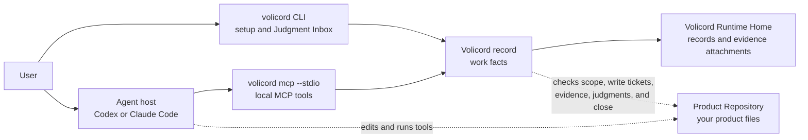

# Volicord

**AI moves. Judgment stays yours.**

**[English](README.md)** | [한국어](README.ko.md)

## Overview

Volicord is a local work authority record for AI-assisted product work. It
gives an agent host, such as Codex or Claude Code, a local record of work facts
that should not live only in chat: what task is active, what write tickets exist
for proposed product-file changes under the current scope, what evidence
exists, what judgment still belongs to the user, and what blocks an honest
close.

Volicord is not a replacement for your editor, shell, tests, code review, or
judgment. It is a local work authority record that helps an agent use those
things without hiding scope, evidence, user decisions, or close blockers inside
a polished summary.

Chat messages, generated Markdown, status summaries, and projections can
describe Volicord state, but they do not replace the local record.

## Why Volicord Exists

Volicord helps keep these questions explicit during agent-assisted product
work:

- What is the agent trying to do?
- What is in scope and out of scope?
- What evidence supports the current claim?
- Is a proposed product-file change compatible with the current scope and a
  write ticket?
- What did the agent run or record?
- Which user-owned decision is still needed?
- What still blocks an honest close?

AI agents can inspect files, run tools, edit code, and summarize results faster
than a human can keep every boundary in working memory.

That speed is useful, but it can blur boundaries if the durable record lives
only in chat. Scope can drift. Acceptance can sound implied. Residual risk can
disappear from the conversation. A product decision can be hidden inside an
implementation step.

Volicord exists so scope, evidence, write tickets, user judgment, run records,
and Close Status stay visible as separate workflow facts.

## Mental Model

Use this short model when reading the rest of the README:

| Concept | First-user meaning |
|---|---|
| `Task` | The user-value unit being shaped, worked, blocked, or closed. It carries the current goal, scope, non-goals, and current work boundary. |
| Write Ticket | A product-file change should be compatible with the current `Task` and current scope. A Write Ticket records a Volicord work-authority decision for one proposed product-file change; it is not OS permission, code review approval, final acceptance, or proof that a write occurred. |
| Evidence | Recorded support for a specific claim, such as a run, observation, or evidence attachment. Evidence supports claims, but it does not become user judgment or proof of correctness. |
| User Judgment | A decision that belongs to the user: product direction, material technical direction, scope, sensitive action, final acceptance, residual-risk acceptance, cancellation, or similar authority-bearing choices. |
| Close Status | A check that the current `Task` can finish honestly without hiding unresolved owner-defined requirements. Close Status is decision support, not proof of correctness, test sufficiency, QA completion, deployment success, human review completion, or risk-free completion. |

## How The Pieces Fit

This map shows the local pieces a first user needs to recognize. Solid arrows
are ordinary local call or record paths. Dotted arrows show product-file work
or compatibility relationships outside the public Volicord API. The map omits
storage tables, complete API behavior, and host-specific setup detail.


```mermaid
flowchart LR
  user["User"]
  host["Agent host<br/>Codex or Claude Code"]
  mcp["volicord mcp --stdio<br/>local MCP tools"]
  record["Volicord record<br/>work facts"]
  runtime["Volicord Runtime Home<br/>records and evidence attachments"]
  repo["Product Repository<br/>your product files"]
  cli["volicord CLI<br/>setup and Judgment Inbox"]

  user --> host
  host --> mcp
  mcp --> record
  record --> runtime
  user --> cli
  cli --> record
  host -. edits and runs tools .-> repo
  record -. checks scope, write tickets,<br/>evidence, judgments, and close .-> repo
```

The work loop keeps user decisions, agent work, and Volicord records separate.
Arrows show workflow handoff at overview depth, not exact API call order.


```mermaid
flowchart TD
  request["User asks for work"]
  task["Volicord records the Task,<br/>scope, and current work boundary"]
  agent["Agent inspects, proposes,<br/>or performs the next action"]
  judgment{"User-owned<br/>judgment needed?"}
  inbox["Judgment Inbox / User Channel<br/>records the user's answer"]
  write{"Product-file<br/>write needed?"}
  ticket["Volicord records a<br/>Write Ticket result"]
  run["record_run records<br/>execution or observation"]
  evidence["Evidence and Close Status<br/>stay visible"]
  close{"Close blockers<br/>remain?"}
  status["Status shows blockers,<br/>pending judgment, and next action"]
  finish["User decides final acceptance,<br/>residual risk, or terminal outcome"]

  request --> task --> agent --> judgment
  judgment -- yes --> inbox --> task
  judgment -- no --> write
  write -- yes --> ticket --> run
  write -- no --> run
  run --> evidence --> close
  close -- yes --> status --> agent
  close -- no --> finish
```

## Install And Initialize

The normal user path is one installed `volicord` executable. Release binary
installation is the primary path when your system matches a supported target.
Source builds are for development.

On Linux, WSL2, or macOS, download or copy `scripts/install.sh` from the
repository that publishes the Volicord release assets, then install the release
binary:

```sh
VOLICORD_REPO=OWNER/REPO sh ./scripts/install.sh
volicord --version
```

On native Windows x86_64, download or copy `scripts/install.ps1` and run it in
PowerShell:

```powershell
.\scripts\install.ps1 -Repo OWNER/REPO
volicord --version
```

`OWNER/REPO` is the GitHub repository that hosts the Volicord release assets for
this checkout. The POSIX script detects supported Linux, WSL2, and macOS
targets and downloads the target-named tarball. The PowerShell script installs
the `x86_64-pc-windows-msvc` zip artifact under a user-local directory by
default. Both scripts verify the `.sha256` file when available and install only
the `volicord` executable for that platform. They do not edit shell startup
files implicitly. This checkout does not contain a Homebrew tap, Homebrew
formula, Linux package, Windows package-manager package, or external
package-registry install path.

Make sure the future agent host can run `volicord` through `PATH`, then
initialize the Product Repository where you want the agent to work:

```sh
volicord init --host codex --repo /path/to/your-product-repo --profile record
```

Use `--host claude-code` for Claude Code:

```sh
volicord init --host claude-code --repo /path/to/your-product-repo --profile record
```

`volicord init` is the primary first-run setup and connection command for
chat-first use. It initializes the Runtime Home if needed, records the
installation profile, registers or reuses the selected Product Repository,
creates the Agent Connection, writes project-scoped MCP configuration that
starts `volicord mcp --stdio`, writes Volicord-managed guidance and policy
metadata, and records integration status. `--profile record` does not require
host lifecycle hook installation or a session watcher and is the supported
native Windows profile. `--profile observe` requires supported host hook and
session watcher capabilities and is not supported on native Windows. If observe
prerequisites are unavailable, use `--profile record` or prepare a supported
host, platform, and repository configuration for observe before rerunning init.

If the command reports `action_required`, follow the named host-controlled or
local action, such as restarting or reloading the host, approving project MCP
configuration, trusting the project, or repairing command availability. Then
verify:

```sh
volicord connection verify codex --repo /path/to/your-product-repo
```

Exact command behavior lives in the
[Administrative CLI Reference](docs/en/reference/admin-cli.md). Environment
support lives in [System Requirements](docs/en/reference/system-requirements.md).

## Source Build For Development

Use the source build path when you are developing Volicord itself or need a
local development binary:

```sh
cargo build --workspace --bins
./target/debug/volicord --version
./target/debug/volicord init --host codex --repo /path/to/your-product-repo --profile record
```

This path requires the Rust toolchain named in
[System Requirements](docs/en/reference/system-requirements.md#toolchain-requirements).
It is not the primary first-user install path.

## Normal Use Is Chat

After initialization, work normally through the agent host in the Product
Repository. You do not need to drive the workflow from the terminal.

For example, ask in chat:

```text
Add idempotency-key support for payment creation, update the tests, and tell me what still blocks close.
```

The host remains your chat/editor agent. Volicord provides local MCP tools the
host can call when durable workflow state matters:

- create or update a `Task`
- show current scope, blockers, evidence, and pending judgment
- prepare a write ticket for a proposed product-file change
- attach evidence inputs and record runs or observations
- request a focused user judgment
- check Close Status before the agent claims completion

Agents should use Volicord state when it is available and say explicitly when
it is unavailable. Volicord tools, MCP server instructions, host rules, and
`AGENTS.md` guidance help steer the agent, but they do not absolutely force
model behavior.

## Integration Profiles

`volicord init` defaults to `--profile record`. Omitting `--profile` gives the
normal first-user setup.

Use the Record profile (`--profile record`) when you want the host to use
Volicord's local MCP tools and records without depending on host lifecycle hooks
or a session watcher. This is the profile to start with when you want the agent
to record a `Task` and scope, prepare write tickets for proposed product-file
changes, and record evidence, runs, and User Judgment requests through
Volicord.

Use the Detective profile (`--profile observe`) only when the selected host,
platform, and Product Repository support the extra observation surfaces. It
keeps the Record profile model and adds supported host hooks plus a session
watcher. Those hooks may provide cooperative host warning or denial decision
signals, and the watcher may detect unrecorded Product Repository changes after
its coverage starts.

Volicord reports an observation summary for the selected connection or session.
The summary tells you which surfaces are currently active:
`selected_profile`, host hooks, session watcher observation, cooperative
pre-tool warning or denial, unrecorded-change detection, actor identity proof,
and OS enforcement. Current Volicord output reports no actor identity proof and
no OS enforcement. Treat the summary as an operational disclosure, not a
security proof.

`observe` does not prevent all writes, identify who changed a file, monitor all
files, isolate the network, sandbox tools, or prove that a model followed
instructions. It adds cooperative and detective signals that Volicord can show
or use in Close Status and reconciliation workflows when the required
observations are actually active.

After `volicord init`, or after any host-required approval or reload step, verify
the current setup:

```sh
volicord connection verify codex --repo /path/to/your-product-repo
```

Use `volicord connection status HOST --repo PATH` and `volicord doctor` when
you need to inspect stored setup state, required user actions, and the current
observation facts. Installed files, generated guidance, and policy metadata
alone do not prove that the host loaded or ran the observe-specific pieces.

Host-specific file layouts, hook matchers, wrapper output modes, path-safety
diagnostics, and host approval or reload details live in
[Agent Host Setup](docs/en/guides/agent-host-setup.md) and
[Agent Host Troubleshooting](docs/en/guides/agent-host-troubleshooting.md).
Exact command behavior lives in the
[Administrative CLI Reference](docs/en/reference/admin-cli.md).

## Unrecorded Changes And Close Blockers

The Detective profile's host hooks and an active session watcher can report
Unrecorded Changes when a product file changes without a matching write ticket
or recorded run. Session watcher observations come from bounded product-file
metadata comparison for the selected session. They detect changed paths; they
do not store full file contents, prove who changed a file, prove intent, or
prevent writes. Those Unrecorded Changes remain unresolved until reconciled,
and unresolved Unrecorded Changes block close.

Reconciliation can resolve deterministic cases, such as a change already
covered by a compatible write ticket or recorded run. If acceptance is needed,
Volicord creates a focused user-owned judgment. The user answers through MCP
elicitation, a strict chat command, or CLI recovery. Agents cannot silently
dismiss Unrecorded Changes or mark them accepted for the user.

In chat, ask the agent to show `volicord.reconcile_changes` results and next
actions. CLI recovery is available through `volicord changes reconcile`.

## User Judgment Capture

User judgment stays user-owned. An Agent Connection may request a judgment, but
it must not record authority-bearing user answers as if it were the user.

Supported User Channel input methods:

| Method | When it is used |
|---|---|
| Host prompt | If the initialized MCP client declares `capabilities.elicitation`, Volicord can send an `elicitation/create` request for a focused pending judgment. A valid response is recorded through the local `User Channel` with user provenance. |
| Chat command | If host prompt input is unavailable and chat command capture is `configured`, `observed`, or `active`, Volicord returns exact chat commands such as `Volicord: answer J-3 1 #AB7K`, `Volicord: answer J-3 reject #AB7K`, `Volicord: answer J-3 defer #AB7K`, or `Volicord: note J-3 "text" #AB7K`. The host hook records only strict valid commands with the current verification code. |
| Local consent URL | If host prompt input and chat command capture are unavailable and the adapter can safely expose the fallback, Volicord returns a loopback-only consent URL. The URL uses a short-lived one-time token tied to the project, connection, and pending judgment; a valid answer is recorded through the `User Channel` with local user provenance. |
| CLI inbox | If the other User Channel input methods are unavailable, disabled, degraded, or need inspection, use `volicord inbox` from the Product Repository. |

CLI inbox example:

```sh
volicord inbox
volicord inbox answer JUDGMENT_ID --choice CHOICE_ID
```

The local consent URL is separate from host prompt input. The Local HTTP
transport still does not implement HTTP host prompts, and local consent is
available only on loopback endpoints with a valid consent token.

## Guarantee Limits

Volicord keeps work authority visible, but it is not a permission system,
security boundary, correctness oracle, or human review replacement.

- Write Tickets are not OS permission, code review approval, final acceptance,
  or proof that a write occurred.
- Detective profile hooks and watcher output are cooperative or detective
  signals. They are not OS-level blocking, actor proof, network isolation, or a
  sandbox.
- Close Status is decision support from current Volicord records, not proof of
  correctness, test sufficiency, QA completion, deployment success, human review
  completion, or risk-free completion.

Detailed guarantee classes and explicit non-guarantees live in the
[Security Reference](docs/en/reference/security.md).

## Docker And Local HTTP Transport

Docker support exists through the checked-in `Dockerfile` for local container
layouts:

```sh
docker build -t volicord:local .
```

The Local HTTP transport is implemented as:

```sh
volicord serve --transport local-http
```

It is an explicit advanced transport for Docker and localhost MCP use, not the
default host setup path. It is local/Docker transport only: not a public network
API, SaaS endpoint, multi-user server, or security boundary. It accepts only
loopback listen addresses, requires bearer authentication for the MCP local HTTP
endpoint, generates a process-local token when no token is supplied, checks
browser request Origins against configured `--allow-origin` values, exposes
`POST /mcp`, and does not implement server-sent event streams, HTTP
elicitation, or full MCP Streamable HTTP compatibility. Do not treat it as a
general network service; there is no supported nonlocal listen option.

Use [Installation](docs/en/getting-started/installation.md) and
[MCP Transport](docs/en/reference/mcp-transport.md) for the detailed Docker and
HTTP boundaries.

## Troubleshooting

| Symptom | What to do |
|---|---|
| `volicord` is not found | Put the install directory on `PATH`, or install to a directory already on `PATH`, then rerun `volicord --version`. Future agent hosts must also be able to start `volicord`. |
| `init` reports `action_required` | Complete the named action, such as host restart or reload, project trust, MCP approval, OAuth, command-link repair, or installation-profile repair, then rerun `volicord connection verify HOST --repo PATH`. |
| Observe-specific checks are inactive | Run `volicord connection verify HOST --repo PATH`, complete the named user action, and use [Agent Host Troubleshooting](docs/en/guides/agent-host-troubleshooting.md) for hook or watcher diagnostics. |
| Host cannot start MCP | Confirm the host can run `volicord mcp --help` through the same command path. Run `volicord doctor` for installation-profile health. |
| Product Repository is not detected | Pass `--repo /path/to/your-product-repo` and make sure the path is an existing local repository separate from the Runtime Home. |
| A judgment is pending | Prefer the host prompt or exact chat command when available. Use `volicord inbox` and `volicord inbox answer` as the CLI inbox path. |
| Close has blockers | Ask the agent to show `volicord.check_close` results, pending user judgments, missing evidence, unresolved unrecorded changes, and residual risks. Address the named blocker instead of closing from a summary. |

## Deeper Docs

| Need | Read |
|---|---|
| Install details and Docker examples | [Installation](docs/en/getting-started/installation.md) |
| Supported environments | [System Requirements](docs/en/reference/system-requirements.md) |
| User workflow and judgment boundaries | [User Guide](docs/en/guides/user-workflow.md) |
| Host setup and repair | [Agent Host Setup](docs/en/guides/agent-host-setup.md) and [Agent Host Troubleshooting](docs/en/guides/agent-host-troubleshooting.md) |
| Exact CLI behavior | [Administrative CLI Reference](docs/en/reference/admin-cli.md) |
| MCP stdio and HTTP transport | [MCP Transport](docs/en/reference/mcp-transport.md) |
| Agent Connection and User Channel boundaries | [Agent Connection Reference](docs/en/reference/agent-connection.md) |
| Exact authority structure | [Core Model](docs/en/reference/core-model.md) |
| Security wording and non-guarantees | [Security Reference](docs/en/reference/security.md) |
| Public API methods and schemas | [Reference Index](docs/en/reference/README.md) |

Volicord commands are local administrative commands, not public Volicord API
methods. Exact public API behavior is owned by the Reference docs.
