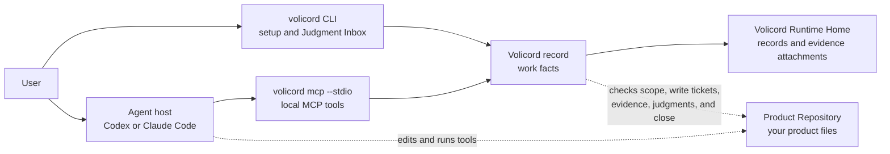
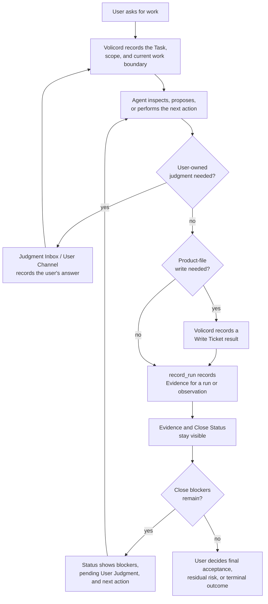

# Volicord

**AI moves. Judgment stays yours.**

**[English](README.md)** | [한국어](README.ko.md)

## Overview

Volicord is a local work authority record for AI-assisted product work. It gives
an agent host, such as Codex or Claude Code, a local record of work facts that
should not live only in chat: what task is active, what scope is current, what
write tickets exist for proposed product-file changes, what evidence exists,
what judgment still belongs to the user, and what blocks an honest close.

Volicord is not a replacement for your editor, shell, tests, code review, or
judgment. It helps an agent use those things without hiding scope, evidence,
user decisions, or close blockers inside a polished summary.

Chat messages, generated Markdown, status summaries, and projections can
describe Volicord state, but they do not replace the local record.

## Who Should Use Volicord

Use Volicord when you want AI-assisted product work to keep durable local
records for:

- the current `Task`, scope, non-goals, and work boundary
- proposed product-file changes and their Write Ticket results
- Evidence for runs, observations, and claims
- pending User Judgment that the agent must not answer for you
- Close Status and named blockers before a task is treated as finished

It is a good fit for local Product Repositories where a user or team already
uses an agent host for real product work and wants scope, evidence, user-owned
decisions, and close blockers to stay visible across the conversation.

Volicord is not a good fit when you need:

- an OS sandbox, network isolation layer, file-system permission system, or
  security boundary
- proof that code is correct, tests are sufficient, QA is complete, deployment
  succeeded, human review happened, or an agent followed every instruction
- a tamper-proof audit log or centralized multi-user SaaS workflow
- a tool that makes product direction, final acceptance, cancellation, or
  residual-risk decisions for the user

## Quick Start

For default host setup, the normal path is one installed `volicord` executable,
then `volicord init` in the Product Repository where the agent will work.
Docker paths use the same `init` shape from a container and must keep the same
Runtime Home volume and Product Repository mount. Start with `--profile record`
unless you already know the selected host, platform, and repository support the
extra Detective profile observation surfaces.

### Choose An Install Or Run Path

Choose the path that matches whether you want clone-free release artifacts, a
clone-free Docker image, or a local build from this repository.

#### Release Binary Install (planned)

This clone-free path becomes available after GitHub Release assets publish
installer scripts, target archives, and checksum files for
`https://github.com/minjungw00/Volicord`. It does not require cloning the
repository.

On Linux, WSL2, or macOS:

```sh
tmp="$(mktemp "${TMPDIR:-/tmp}/install-volicord.XXXXXX")"
curl -fsSL https://github.com/minjungw00/Volicord/releases/latest/download/install.sh -o "$tmp"
VOLICORD_REQUIRE_CHECKSUM=1 sh "$tmp"

volicord --version
```

On native Windows x86_64, use PowerShell:

```powershell
$tmp = Join-Path $env:TEMP "install-volicord.ps1"
Invoke-WebRequest "https://github.com/minjungw00/Volicord/releases/latest/download/install.ps1" -OutFile $tmp
& $tmp -RequireChecksum

volicord --version
```

For custom install directories, dry runs, target inspection, mirrors, and
pinned automation flows, see the
[Installation guide](docs/en/user-guide/installation.md).

#### Published Docker Image (planned)

This clone-free Docker path becomes available after a public Volicord image is
published to GHCR. It does not require cloning the repository.

```sh
docker pull ghcr.io/minjungw00/volicord:latest
docker run --rm ghcr.io/minjungw00/volicord:latest --version
```

For a pinned release, use a release tag:

```sh
docker pull ghcr.io/minjungw00/volicord:vX.Y.Z
docker run --rm ghcr.io/minjungw00/volicord:vX.Y.Z --version
```

#### Build And Run Docker Image From This Repository

Use this path when you have a local clone of the Volicord source repository and
want to build the image yourself.

```sh
git clone https://github.com/minjungw00/Volicord.git
cd Volicord

docker build -t volicord:local .
docker run --rm volicord:local --version
```

To initialize Volicord for a Product Repository from the container:

```sh
docker run --rm -it \
  -v volicord-home:/var/lib/volicord \
  -v /path/to/your-product-repo:/workspace \
  volicord:local init --host codex --repo /workspace --profile record
```

`/path/to/your-product-repo` is the Product Repository where the agent will
work, not necessarily the Volicord source repository. Later Docker commands
should reuse the same Runtime Home volume and Product Repository mount.

#### Build Native Binary From Source

Use this path for development, local review, or native builds before release
binaries are available. After release binaries exist, this is not the primary
path for users who only want release artifacts.

```sh
git clone https://github.com/minjungw00/Volicord.git
cd Volicord

cargo build --locked --release -p volicord-cli --bin volicord
./target/release/volicord --version
```

To install that locally built binary on your user `PATH`, replace
`$HOME/.local/bin` with another directory already on `PATH` if needed:

```sh
mkdir -p "$HOME/.local/bin"
install -m 0755 target/release/volicord "$HOME/.local/bin/volicord"

volicord --version
```

### Initialize Or Connect The Product Repository

Run `volicord init` for the repository where the agent should work:

```sh
volicord init --host codex --repo /path/to/your-product-repo --profile record
```

Use `--host claude-code` for Claude Code:

```sh
volicord init --host claude-code --repo /path/to/your-product-repo --profile record
```

`volicord init` is the primary first-run setup and connection command for
chat-first use. It initializes the Runtime Home if needed, records the
installation profile, registers or reuses the selected Product Repository,
creates the Agent Connection, writes project-scoped MCP configuration that
starts `volicord mcp --stdio`, writes project-scoped Volicord guidance and
local setup files, and records integration status.

If the command reports `action_required`, follow the named host-controlled or
local action, such as restarting or reloading the host, approving project MCP
configuration, trusting the project, or repairing command availability. Then
verify the connection:

```sh
volicord connection verify codex --shared --repo /path/to/your-product-repo
volicord connection status codex --shared --repo /path/to/your-product-repo
volicord doctor
```

The guided flow continues in [Quickstart](docs/en/user-guide/quickstart.md) and
[Agent Host Setup](docs/en/user-guide/agent-host-setup.md). Exact command
contracts live in the
[Administrative CLI Reference](docs/en/reference/admin-cli.md). Environment
support lives in [System Requirements](docs/en/reference/system-requirements.md).

### Ask The Agent To Work Normally

After initialization, work through the agent host in the Product Repository. You
do not need to drive the workflow from the terminal.

For example, ask in chat:

```text
Add idempotency-key support for payment creation, update the tests, and tell me what still blocks close.
```

The host remains your chat/editor agent. Volicord provides local MCP tools the
host can call when durable workflow state matters. Agents should use Volicord
state when it is available and say explicitly when it is unavailable. Volicord
tools, MCP server instructions, host rules, and `AGENTS.md` guidance help steer
the agent, but they do not absolutely force model behavior.

### Check Pending User Judgments

When a decision belongs to the user, Volicord keeps it as pending User Judgment
until it is answered through a supported User Channel. The agent may show a host
prompt, an exact chat command, a local consent URL, or tell you to use the CLI
Judgment Inbox.

CLI inbox path:

```sh
volicord inbox --repo /path/to/your-product-repo
volicord inbox answer JUDGMENT_ID --choice CHOICE_ID --repo /path/to/your-product-repo
```

Agents cannot silently dismiss pending User Judgment or record
authority-bearing answers as if they were the user.

### Check Close Blockers Or Close Readiness

Before treating work as finished, ask the agent to show the current Close Status
and `volicord.check_close` results. The answer should name pending User
Judgment, missing evidence, unresolved Unrecorded Changes, residual risks, and
the next action when those facts are known.

CLI check:

```sh
volicord status --repo /path/to/your-product-repo
```

Use `volicord changes reconcile` when Unrecorded Changes are named and need a
supported reconciliation path. Do not close from a polished chat summary while
Volicord still reports blockers.

## Normal Agent Use

In ordinary chat, the agent can use Volicord to:

- create or update a `Task`
- show current scope, blockers, evidence, and pending User Judgment
- prepare a write ticket for a proposed product-file change
- prepare Evidence attachment inputs when needed, then record Evidence through
  runs or observations
- request a focused user judgment
- check Close Status before the agent claims completion

The important habit is simple: ask the agent to keep Volicord state current
when scope, evidence, user decisions, writes, or close readiness matter. You
stay in the normal agent conversation, and Volicord keeps the local workflow
facts visible.

## Guarantee Limits

Volicord keeps work authority visible, but it is not a permission system,
security boundary, correctness oracle, or human review replacement.

- Write Tickets are not OS permission, code review approval, final acceptance,
  or proof that a write occurred.
- Detective profile hooks and watcher output are cooperative or detective
  signals. They are not OS-level blocking, actor proof, network isolation, or a
  sandbox.
- Evidence and successful command runs support claims, but they are not proof
  of correctness, test sufficiency, QA completion, deployment success, or human
  review completion.
- Close Status is decision support from current Volicord records, not proof of
  risk-free completion.
- Volicord records are local workflow records. Do not treat them as a
  tamper-proof audit log.

Detailed guarantee classes and explicit non-guarantees live in the
[Security Reference](docs/en/reference/security.md).

## Beginner Concepts

Use this short model when reading the rest of the README:

| Concept | First-user meaning |
|---|---|
| `Task` | The user-value unit being shaped, worked, blocked, or closed. It carries the current goal, scope, non-goals, and current work boundary. |
| Write Ticket | A product-file change should be compatible with the current `Task` and current scope. A Write Ticket records a Volicord work-authority decision for one proposed product-file change; it is not OS permission, code review approval, final acceptance, or proof that a write occurred. |
| Evidence | Recorded support for a specific claim, such as a run, observation, or evidence attachment. Evidence supports claims, but it does not become user judgment or proof of correctness. |
| User Judgment | A decision that belongs to the user: product direction, material technical direction, scope, sensitive action, final acceptance, residual-risk acceptance, cancellation, or similar authority-bearing choices. |
| Close Status | A check that the current `Task` can finish honestly without hiding unresolved requirements. Close Status is decision support, not proof of correctness, test sufficiency, QA completion, deployment success, human review completion, or risk-free completion. |

## How The Pieces Fit

This map shows the local pieces a first user needs to recognize. Solid arrows
are ordinary local call or record paths. Dotted arrows show product-file work
or compatibility relationships outside the public Volicord API. The map omits
storage tables, complete API behavior, and host-specific setup detail.


```mermaid
flowchart LR
  user["User"]
  host["Agent host<br/>Codex or Claude Code"]
  mcp["volicord mcp --stdio<br/>local MCP tools"]
  record["Volicord record<br/>work facts"]
  runtime["Volicord Runtime Home<br/>records and evidence attachments"]
  repo["Product Repository<br/>your product files"]
  cli["volicord CLI<br/>setup and Judgment Inbox"]

  user --> host
  host --> mcp
  mcp --> record
  record --> runtime
  user --> cli
  cli --> record
  host -. edits and runs tools .-> repo
  record -. checks scope, write tickets,<br/>evidence, judgments, and close .-> repo
```

The work loop keeps user decisions, agent work, and Volicord records separate.
Arrows show workflow handoff at overview depth, not exact API call order.


```mermaid
flowchart TD
  request["User asks for work"]
  task["Volicord records the Task,<br/>scope, and current work boundary"]
  agent["Agent inspects, proposes,<br/>or performs the next action"]
  judgment{"User-owned<br/>judgment needed?"}
  inbox["Judgment Inbox / User Channel<br/>records the user's answer"]
  write{"Product-file<br/>write needed?"}
  ticket["Volicord records a<br/>Write Ticket result"]
  run["record_run records<br/>Evidence for a run or observation"]
  evidence["Evidence and Close Status<br/>stay visible"]
  close{"Close blockers<br/>remain?"}
  status["Status shows blockers,<br/>pending User Judgment, and next action"]
  finish["User decides final acceptance,<br/>residual risk, or terminal outcome"]

  request --> task --> agent --> judgment
  judgment -- yes --> inbox --> task
  judgment -- no --> write
  write -- yes --> ticket --> run
  write -- no --> run
  run --> evidence --> close
  close -- yes --> status --> agent
  close -- no --> finish
```

## Integration Profiles

`volicord init` defaults to `--profile record`. Omitting `--profile` gives the
normal first-user setup.

Use the Record profile (`--profile record`) when you want the host to support
cooperative Volicord workflow recording through MCP without depending on host
lifecycle hooks or a session watcher. This is the profile to start with when you
want the agent to record a `Task` and scope, prepare write tickets for proposed
product-file changes, record Evidence through runs or observations, and request
User Judgment through Volicord.

Use the Detective profile (`--profile detective`) only when the selected host,
platform, and Product Repository support the extra observation surfaces. It
keeps the Record profile model and adds supported host hooks plus a session
watcher. Those hooks may provide cooperative host warning or denial decision
signals, and the watcher may detect unrecorded Product Repository changes after
its coverage starts.

Volicord reports an observation summary for the selected connection or session.
The summary tells you which surfaces are currently active:
`selected_profile`, host hooks, session watcher observation, cooperative
pre-tool warning or denial, unrecorded-change detection, actor identity proof,
and OS enforcement. Current Volicord output reports no actor identity proof and
no OS enforcement. Treat the summary as an operational disclosure, not a
security proof.

The `detective` profile does not prevent all writes, identify who changed a
file, monitor all files, isolate the network, sandbox tools, or prove that a
model followed instructions. It adds cooperative and detective signals that
Volicord can show or use in Close Status and reconciliation workflows when the
required observations are actually active.

After `volicord init`, or after any host-required approval or reload step,
verify the current setup:

```sh
volicord connection verify codex --shared --repo /path/to/your-product-repo
```

Use `volicord connection status HOST --repo PATH` and `volicord doctor` when
you need to inspect stored setup state, required user actions, and the current
observation facts. Installed files, generated project guidance, and local setup
files alone do not prove that the host loaded or ran the detective-specific
pieces.

Host-specific file layouts, hook matchers, wrapper output modes, path-safety
diagnostics, and host approval or reload details live in
[Agent Host Setup](docs/en/user-guide/agent-host-setup.md) and
[Agent Host Troubleshooting](docs/en/user-guide/agent-host-troubleshooting.md).
Exact command behavior lives in the
[Administrative CLI Reference](docs/en/reference/admin-cli.md).

## Unrecorded Changes And Close Blockers

The Detective profile's host hooks and an active session watcher can report
Unrecorded Changes when a product file changes without a matching write ticket
or recorded run. Session watcher observations come from bounded product-file
metadata comparison for the selected session. They detect changed paths; they
do not store full file contents, prove who changed a file, prove intent, or
prevent writes. Those Unrecorded Changes remain unresolved until reconciled,
and unresolved Unrecorded Changes block close.

Reconciliation can resolve deterministic cases, such as a change already
covered by a compatible write ticket or recorded run. If acceptance is needed,
Volicord creates a focused user-owned judgment. The user answers through MCP
elicitation, a strict chat command, local consent URL, or CLI inbox as User
Channel input methods. Agents cannot silently dismiss Unrecorded Changes or
mark them accepted for the user.

In chat, ask the agent to show `volicord.reconcile_changes` results and next
actions. CLI recovery is available through `volicord changes reconcile`.

## User Judgment Capture

User judgment stays user-owned. An Agent Connection may request a judgment, but
it must not record authority-bearing user answers as if it were the user.

Supported User Channel input methods:

| Method | When it is used |
|---|---|
| Host prompt | If the initialized MCP client declares `capabilities.elicitation`, Volicord can send an `elicitation/create` request for a focused pending judgment. A valid response is recorded through the local `User Channel` with user provenance. |
| Chat command | If host prompt input is unavailable and chat command capture is `configured`, `observed`, or `active`, Volicord returns exact chat commands such as `Volicord: answer J-3 1 #AB7K`, `Volicord: answer J-3 reject #AB7K`, `Volicord: answer J-3 defer #AB7K`, or `Volicord: note J-3 "text" #AB7K`. The host hook records only strict valid commands with the current verification code. |
| Local consent URL | If host prompt input and chat command capture are unavailable and the adapter can safely expose the fallback, Volicord returns a loopback-only consent URL. The URL uses a short-lived one-time token tied to the project, connection, and pending judgment; a valid answer is recorded through the `User Channel` with local user provenance. |
| CLI inbox | If the other User Channel input methods are unavailable, disabled, degraded, or need inspection, use `volicord inbox` from the Product Repository. |

The local consent page identifies the project, repository path, connection,
judgment, available choices, token expiry, and CLI fallback. It records only the
shown user-owned judgment; it is not proof of correctness, test sufficiency,
deployment success, review completion, security enforcement, or close
readiness.

CLI inbox example:

```sh
volicord inbox
volicord inbox answer JUDGMENT_ID --choice CHOICE_ID
```

The local consent URL is separate from host prompt input. The Local HTTP
transport still does not implement HTTP host prompts, and local consent is
available only on loopback endpoints with a valid consent token.

## Docker Local HTTP Transport

The install/run section above shows how to obtain a Docker image. Use this
section when you intentionally want Docker/localhost Local HTTP MCP transport
instead of the default `volicord mcp --stdio` host setup.

```sh
VOLICORD_IMAGE=volicord:local
# or, after a public image is published:
# VOLICORD_IMAGE=ghcr.io/minjungw00/volicord:latest
```

Initialize with the same Runtime Home volume and Product Repository mount you
will use for serving:

```sh
docker run --rm -it \
  -v volicord-home:/var/lib/volicord \
  -v /path/to/your-product-repo:/workspace \
  "$VOLICORD_IMAGE" init --host codex --repo /workspace --profile record
```

Serve Local HTTP with host-loopback-only port publishing and a token file:

```sh
umask 077
VOLICORD_HTTP_TOKEN_FILE="$(mktemp)"
openssl rand -hex 32 > "$VOLICORD_HTTP_TOKEN_FILE"

docker run --rm \
  -p 127.0.0.1:8765:8765 \
  -v "$VOLICORD_HTTP_TOKEN_FILE:/tmp/volicord-http-token:ro" \
  -v volicord-home:/var/lib/volicord \
  -v /path/to/your-product-repo:/workspace \
  "$VOLICORD_IMAGE" serve --transport local-http \
    --container-listen 0.0.0.0:8765 \
    --token-file /tmp/volicord-http-token \
    --project /workspace
```

`-p 127.0.0.1:8765:8765` publishes the container port only on host loopback.
`--container-listen 0.0.0.0:8765` is for this Docker host-loopback publishing
shape. Do not publish the container port on `0.0.0.0`, a public host
interface, or a remote host. Local HTTP is not a public network API, SaaS
endpoint, multi-user server, or security boundary.

Use [Installation](docs/en/user-guide/installation.md) and
[MCP Transport](docs/en/reference/mcp-transport.md) for the detailed Docker and
HTTP boundaries.

## Troubleshooting

| Symptom | What to do |
|---|---|
| `volicord` is not found | Put the install directory on `PATH`, or install to a directory already on `PATH`, then rerun `volicord --version`. Future agent hosts must also be able to start `volicord`. |
| `init` reports `action_required` | Follow the `Next:` checklist first. Complete the named action, such as host restart or reload, project trust, MCP approval, OAuth, command-link repair, or installation-profile repair, then rerun `volicord connection verify HOST --shared --repo PATH` for the ordinary init path. |
| Detective-specific checks are inactive | Run `volicord connection verify HOST --repo PATH`, complete the named user action, and use [Agent Host Troubleshooting](docs/en/user-guide/agent-host-troubleshooting.md) for hook or watcher diagnostics. |
| Host cannot start MCP | Confirm the host can run `volicord mcp --help` through the same command path. Run `volicord doctor` for installation-profile health. |
| Product Repository is not detected | Pass `--repo /path/to/your-product-repo` and make sure the path is an existing local repository separate from the Runtime Home. |
| A judgment is pending | Prefer the host prompt or exact chat command when available. Use `volicord inbox` and `volicord inbox answer` as the CLI inbox path. |
| Close has blockers | Ask the agent to show `volicord.check_close` results, pending User Judgment, missing evidence, unresolved unrecorded changes, and residual risks. Address the named blocker instead of closing from a summary. |

## Deeper Docs

| Need | Read |
|---|---|
| Install details and Docker examples | [Installation](docs/en/user-guide/installation.md) |
| Step-by-step first setup | [Quickstart](docs/en/user-guide/quickstart.md) |
| Host setup and repair | [Agent Host Setup](docs/en/user-guide/agent-host-setup.md) and [Agent Host Troubleshooting](docs/en/user-guide/agent-host-troubleshooting.md) |
| User workflow and judgment boundaries | [User Guide](docs/en/user-guide/user-workflow.md) |
| Supported environments | [System Requirements](docs/en/reference/system-requirements.md) |
| Exact CLI flags, JSON fields, result states, and output contracts | [Administrative CLI Reference](docs/en/reference/admin-cli.md) |
| MCP stdio and HTTP transport | [MCP Transport](docs/en/reference/mcp-transport.md) |
| Agent Connection and User Channel boundaries | [Agent Connection Reference](docs/en/reference/agent-connection.md) |
| Exact authority structure | [Core Model](docs/en/reference/core-model.md) |
| Security wording and non-guarantees | [Security Reference](docs/en/reference/security.md) |
| Public API methods and schemas | [Reference Index](docs/en/reference/README.md) |

Volicord commands are local administrative commands, not public Volicord API
methods. Exact public API behavior is owned by the Reference docs.
