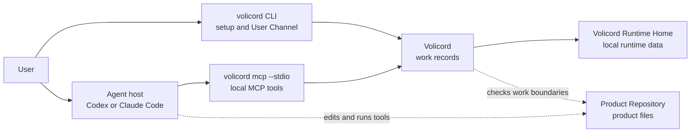
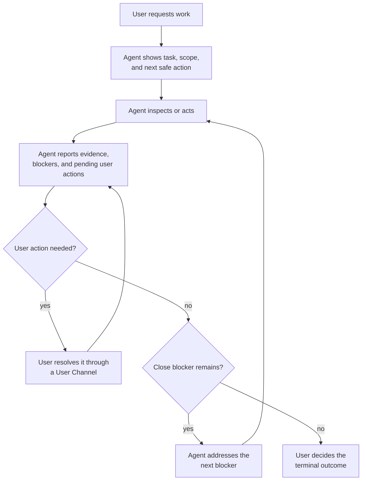

# Volicord

**AI moves. Judgment stays yours.**

**[English](README.md)** | [한국어](README.ko.md)

Volicord is a local work authority record for AI-assisted product work. It
keeps the facts that should not live only in chat: the current task and scope,
proposed writes, evidence, user-owned decisions, and blockers to an honest
close.

The agent host remains your editor and chat interface. Volicord gives that host
local MCP tools for recording and checking work state. It does not replace your
editor, shell, tests, code review, or judgment.

## When Volicord Helps

Volicord is useful when you want an agent to keep these boundaries visible:

- what the current `Task` includes and excludes
- whether a proposed product-file change fits the current scope
- what Evidence supports each important claim
- which decisions still belong to the user
- what must be resolved before the work can close

It is designed for local Product Repositories used with an agent host such as
Codex or Claude Code. It is not an OS sandbox, a file-permission system, a
correctness oracle, a tamper-proof audit log, or a centralized multi-user
service.

## Quick Start

This path builds the current source, installs the executable on a POSIX user
`PATH`, and connects Codex to one Product Repository. For Windows, Docker, or a
published release-asset set, use [Installation](docs/en/user-guide/installation.md).

### 1. Build And Install `volicord`

```sh
git clone https://github.com/minjungw00/Volicord.git
cd Volicord
cargo build --locked --release -p volicord-cli --bin volicord

mkdir -p "$HOME/.local/bin"
install -m 0755 target/release/volicord "$HOME/.local/bin/volicord"
volicord --version
```

If `$HOME/.local/bin` is not on `PATH`, use another command directory or follow
the executable-discovery guidance in [Installation](docs/en/user-guide/installation.md).

### 2. Connect A Product Repository

```sh
volicord init --host codex --repo /path/to/your-product-repo --profile record
```

Use `--host claude-code` for Claude Code. The example path is the repository
where the agent will work, not the Volicord source repository.

The command prepares local Volicord state and writes project-scoped host setup
files. Follow the `Next` steps it prints. The host may still require a restart,
reload, project trust decision, or MCP approval.

Then verify the connection:

```sh
volicord connection verify codex --shared --repo /path/to/your-product-repo
```

If the result is `action_required`, complete the named action and rerun the
command. A terminal-side MCP check does not by itself prove that the active host
session exposes Volicord tools. In the active host, confirm that
`volicord.list_projects` and `volicord.status` are available.

### 3. Work Through The Agent

Ask for work in ordinary language:

```text
Add idempotency-key support for payment creation, update the tests, and tell me what still blocks close.
```

The agent should keep the task, scope, evidence, pending user decisions, and
Close Status current. You do not need to drive the workflow from the terminal.

When Volicord needs a recorded user action, use the resolution path it shows. The
stable manual path is the CLI inbox:

```sh
volicord inbox --repo /path/to/your-product-repo
volicord inbox resolve USER_ACTION_REQUEST_ID --choice CHOICE_ID --repo /path/to/your-product-repo
```

Before treating the work as finished, ask the agent for the current Close
Status. You can also inspect the local summary:

```sh
volicord status --repo /path/to/your-product-repo
```

For a guided first run and host-specific checks, continue with
[Quickstart](docs/en/user-guide/quickstart.md) and
[Agent Host Setup](docs/en/user-guide/agent-host-setup.md).

## Concepts For A First Read

| Concept | Meaning |
|---|---|
| `Task` | The unit of work being shaped, performed, blocked, or closed. |
| Write Ticket | A Volicord record that one proposed product-file change was checked against the current work boundary. It is not OS permission or proof that a write occurred. |
| Evidence | Recorded support for a specific claim. It is not user acceptance or proof of correctness. |
| User Judgment | A decision that belongs to the user, such as product direction, material technical direction, scope, final acceptance, or residual-risk acceptance. |
| Close Status | A view of whether current Volicord records still show blockers. It is decision support, not proof of risk-free completion. |
| User Channel | The local path that records a user-owned decision. An Agent Connection may request a decision but does not record it for the user. |

Exact authority meanings are defined in [Core Model](docs/en/reference/core-model.md).

## How The Pieces Fit

This map shows the local components a new user needs to recognize. Solid arrows
show local call or record paths. Dotted arrows show product-file work or a
work-boundary check. The map omits storage tables, exact API behavior, and
host-specific configuration.


```mermaid
flowchart LR
  user["User"]
  host["Agent host<br/>Codex or Claude Code"]
  mcp["volicord mcp --stdio<br/>local MCP tools"]
  record["Volicord<br/>work records"]
  runtime["Volicord Runtime Home<br/>local runtime data"]
  repo["Product Repository<br/>product files"]
  cli["volicord CLI<br/>setup and User Channel"]

  user --> host
  host --> mcp
  mcp --> record
  record --> runtime
  user --> cli
  cli --> record
  host -. edits and runs tools .-> repo
  record -. checks work boundaries .-> repo
```

The normal work loop keeps agent action and User Channel resolution separate. This is a
guide-level handoff, not an exact API sequence.


```mermaid
flowchart TD
  request["User requests work"]
  boundary["Agent shows task, scope,<br/>and next safe action"]
  action["Agent inspects or acts"]
  status["Agent reports evidence,<br/>blockers, and pending user actions"]
  judgment{"User action needed?"}
  answer["User resolves it through<br/>a User Channel"]
  close{"Close blocker remains?"}
  continue["Agent addresses the<br/>next blocker"]
  finish["User decides the<br/>terminal outcome"]

  request --> boundary --> action --> status --> judgment
  judgment -- yes --> answer --> status
  judgment -- no --> close
  close -- yes --> continue --> action
  close -- no --> finish
```

## Integration Profiles

Use the Record profile (`--profile record`) for the ordinary first setup. It
supports cooperative workflow recording through MCP without requiring host
lifecycle hooks or a session watcher.

Use the Detective profile (`--profile detective`) only when the selected host,
platform, and repository meet its prerequisites. It adds supported host-hook
and watcher observations. Those observations can reveal Unrecorded Changes, but
they do not provide OS-level enforcement or prove who changed a file.

See [Agent Host Setup](docs/en/user-guide/agent-host-setup.md) for setup choices
and [Security](docs/en/reference/security.md) for exact guarantee limits.

## Guarantee Limits

- Write Tickets are not filesystem permission, code review approval, final
  acceptance, or proof that a write occurred.
- Evidence and passing commands support specific claims. They do not prove
  correctness, test sufficiency, QA completion, deployment success, or human
  review completion.
- Close Status is decision support from current records. It does not prove that
  no risk remains.
- Host guidance and MCP instructions can steer an agent. They cannot guarantee
  that a model will use Volicord tools.

## Documentation

| Need | Read |
|---|---|
| Product orientation | [User Guide Overview](docs/en/user-guide/overview.md) |
| Installation, release assets, Windows, and Docker | [Installation](docs/en/user-guide/installation.md) |
| First working connection | [Quickstart](docs/en/user-guide/quickstart.md) |
| User workflow and judgment examples | [User Workflow](docs/en/user-guide/user-workflow.md) and [Judgment Examples](docs/en/user-guide/judgment-examples.md) |
| Agent workflow | [Agent Guide](docs/en/user-guide/agent-workflow.md) |
| Host setup and recovery | [Agent Host Setup](docs/en/user-guide/agent-host-setup.md) and [Troubleshooting](docs/en/user-guide/agent-host-troubleshooting.md) |
| Multiple Product Repositories | [Multi-Repository Agent Setup](docs/en/user-guide/multi-repository-agent-setup.md) |
| Supported environments | [System Requirements](docs/en/reference/system-requirements.md) |
| Exact CLI and MCP behavior | [Administrative CLI](docs/en/reference/admin-cli.md) and [MCP Transport](docs/en/reference/mcp-transport.md) |
| Exact public API contracts | [Reference Index](docs/en/reference/README.md) |
| Security guarantees and non-guarantees | [Security](docs/en/reference/security.md) |

`volicord` commands are local administrative commands. They are not public
Volicord API methods.
