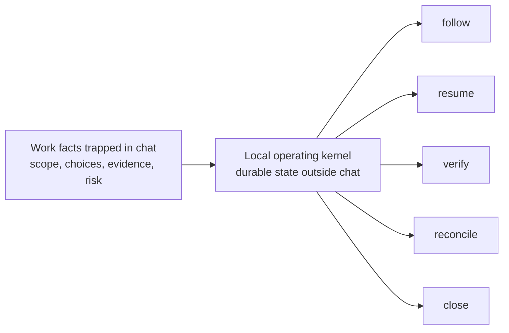
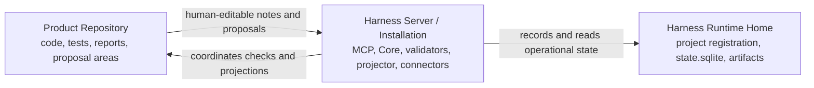
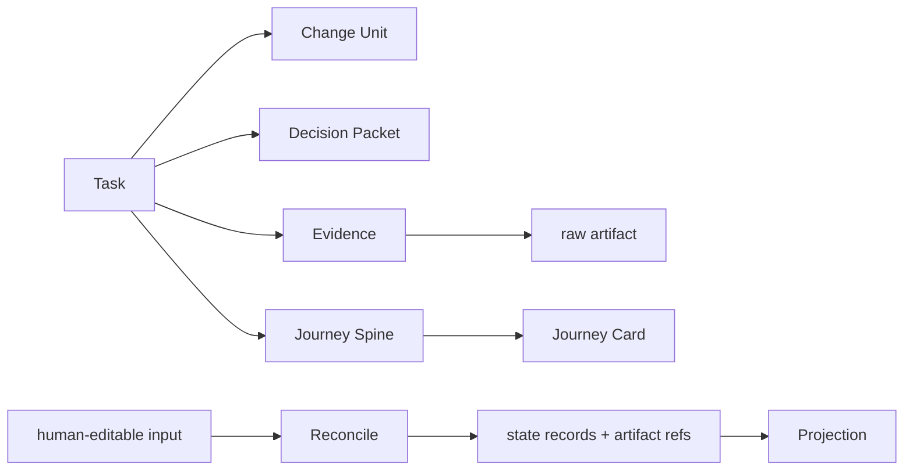
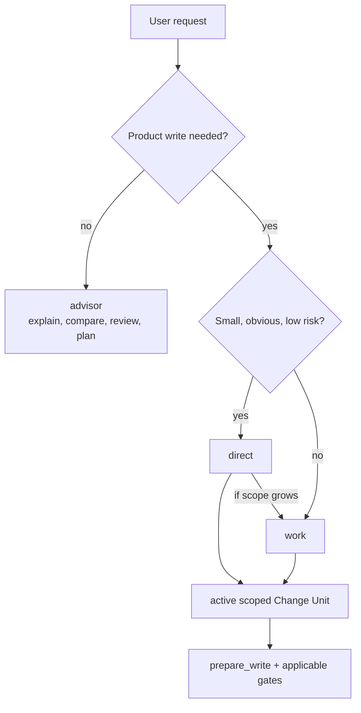
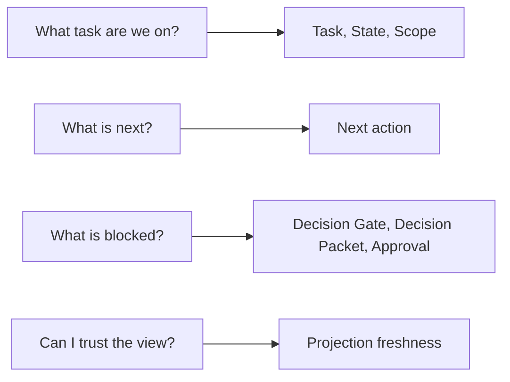
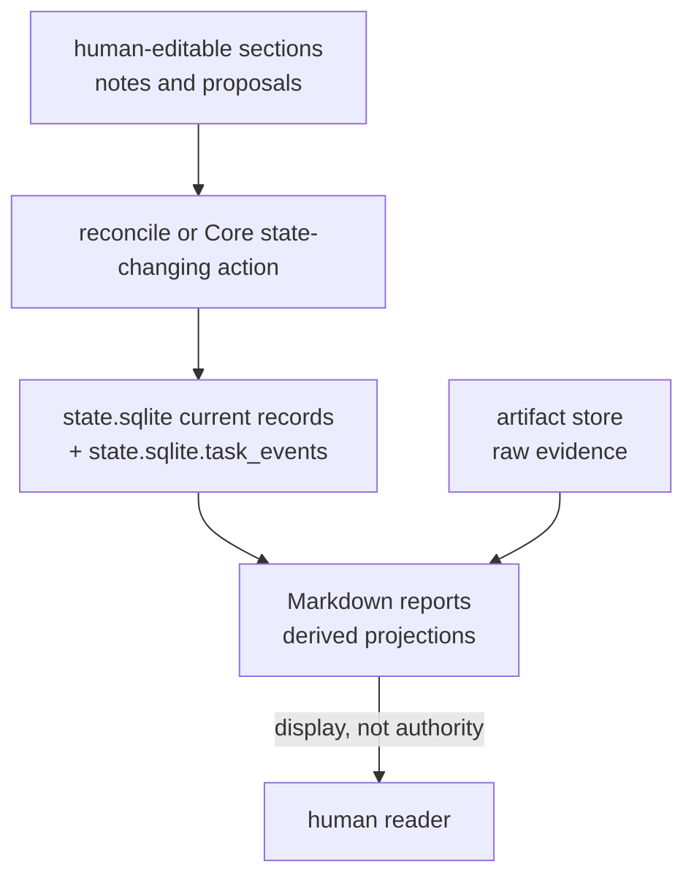

# Introduction

## Document Role

A shared mental model for users and implementers.

## Owns

- summary of the problems the harness reduces
- summary of the three-space model
- basic concepts for Task, Change Unit, Strategic Agency, Shared Design, Decision Gate, Decision Packet, Evidence, Journey Card, Journey Spine, Residual Risk, and Projection
- introduction to advisor/direct/work
- Journey Card example
- source-of-truth summary

## Does Not Own

- implementation schemas
- state transition tables
- tool schema
- full template text

## Sections

### Why Harness Exists

AI-assisted development moves quickly, but important work facts often stay trapped in chat: what the user asked for, what scope was agreed, what design direction was chosen, what changed, what evidence exists, what still needs approval or product judgment, whether the result was actually checked, and what residual risk remains.

The harness gives that work an agency-preserving local operating kernel. Conversation stays natural, but durable work state is recorded outside the chat so a task can be followed, resumed, verified, reconciled, and closed from current state instead of memory.



The short version:

```text
Harness keeps the AI work journey followable while preserving user strategic agency through explicit state, scope, decisions, evidence, verification, QA, acceptance, and residual risk.
```

### The Three Spaces

Harness keeps three spaces separate:

| Space | Reader-level meaning |
|---|---|
| Product Repository | The user's real product workspace: code, tests, generated readable reports, and human-editable proposal areas. |
| Harness Server / Installation | The local harness process and tools: MCP server, Core, validators, projector, connectors, and operator commands. |
| Harness Runtime Home | The local operational store: project registration, per-project state, and durable evidence artifacts. |



This separation keeps product files, generated Markdown, chat text, and operational state from becoming confused with each other. The canonical architecture details are owned by [04-runtime-architecture.md](04-runtime-architecture.md).

### Core Concepts

- A Task is the user value unit: the thing the user wants done or answered.
- A Change Unit bounds product writes; Core still decides whether a write may proceed through `prepare_write` and applicable gates.
- Strategic Agency is the user's retained authority to understand the work journey and make or withhold judgment over goals, scope, design, trade-offs, codebase stewardship, QA, acceptance, and residual risk.
- Shared Design is the minimum recorded shared understanding of goal, scope, non-goals, acceptance criteria, assumptions, decisions, rejected options, domain/module/interface impact, and first Change Unit shape before implementation hardens into a plan.
- A Decision Gate is a point where progress is blocked until product judgment is recorded.
- A Decision Packet records the decision needed, options, trade-offs, evidence, affected scope, residual risk, and next action for a blocking product judgment.
- Evidence is recorded support for claims about the work, such as diffs, logs, tests, screenshots, run summaries, Eval records, or Manual QA records.
- A raw artifact is a durable evidence file in the artifact store.
- A Journey Spine is the ordered, state-derived thread of the Task, Change Units, decisions, runs, evidence, QA, acceptance, and residual risk.
- A Journey Card is a compact projection of the current position in that journey.
- A projection is a human-readable Markdown rendering of state records and artifact refs.
- Reconcile is the explicit path for turning human-editable notes or projection drift into accepted state changes, rejected proposals, notes, decisions, or deferred items.



The detailed entity and gate model is owned by [03-kernel-spec.md](03-kernel-spec.md). Projection rules are owned by [07-document-projection.md](07-document-projection.md).

### Work Modes

Harness uses three work modes:

| Mode | Use it for | Product writes |
|---|---|---|
| `advisor` | Explanation, comparison, review, planning, or decision support. | Not allowed. |
| `direct` | Small, low-risk changes with obvious scope and result. | Checked through `prepare_write` and applicable gates inside an active scoped Change Unit. |
| `work` | Feature work, structural change, risky work, or multi-step implementation. | Checked through `prepare_write` and applicable gates inside an active scoped Change Unit, and normally requires stronger evidence and verification. |



A task can start small. If the scope grows, the harness should make that visible and move the work into the shape needed for safe execution.

### Reading A Journey Card

A Journey Card is a derived display, not canonical state. It is there to answer four reader questions quickly:

- What task are we on?
- What is the next safe action?
- Which user decisions or gates are blocking progress?
- Is the readable projection current enough to trust?



Example:

```text
TASK-0044 Email login flow
State: work / shaping
Next action: decide failed-login UX
Scope: login form, login API call, session storage
Decision Gate: failed-login UX pending
Decision Packet: DEC-0012 current
Approval: dependency_change required
Evidence: none
Verification: not started
Manual QA: pending
Acceptance: pending
Residual risk: none recorded
Projection: current
```

Friendly labels such as `Manual QA: pending` are display text. Canonical fields and close rules are defined by the kernel.

### Source Of Truth Summary

The source-of-truth boundary is:

```text
Operational state:
  state.sqlite current records plus state.sqlite.task_events

Raw evidence:
  durable files in the artifact store

Markdown reports:
  projections generated from state records and artifact refs

Human-editable sections:
  input surfaces for notes and proposals
```



Human-editable input becomes operational truth only after reconcile or a Core state-changing action records an accepted state event or record.

For the canonical rules, read [03-kernel-spec.md](03-kernel-spec.md), [04-runtime-architecture.md](04-runtime-architecture.md), and [07-document-projection.md](07-document-projection.md).
