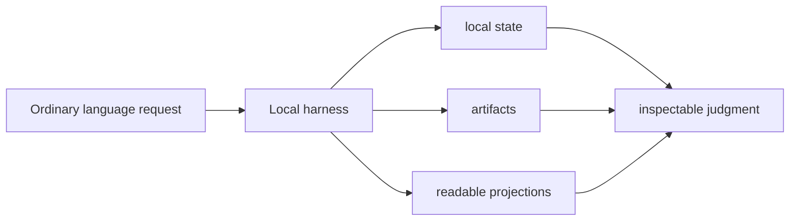
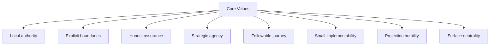
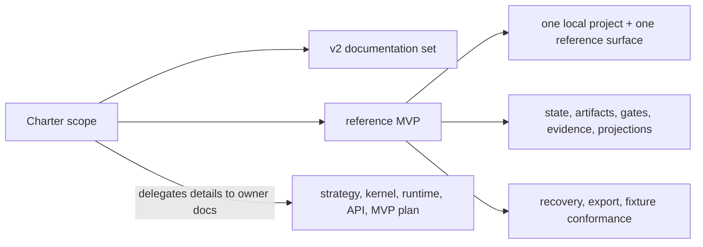
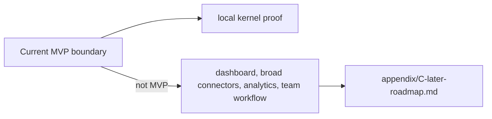
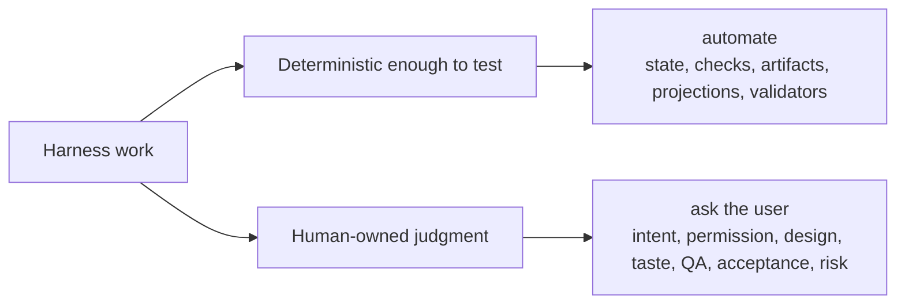

# Project Charter

## Document Role

Project purpose, audience, values, scope, and non-goals.

## Owns

- project purpose
- target users
- core values
- current non-goals
- automation philosophy

## Does Not Own

- strategy invariant details
- state model
- API contract
- operating procedures

## Sections

### Purpose

The project exists to build a local harness for AI-assisted development: an agency-preserving local operating kernel that keeps the work journey followable and keeps strategic judgment with the user.

The harness is not meant to replace conversation. It lets users begin in ordinary language while durable work facts live in local state, artifacts, and readable projections, so goals, scope, design, trade-offs, codebase stewardship, QA, acceptance, and residual risk remain inspectable.

### Target Users

Primary users:

- developers using AI agents to modify, verify, or explain product code
- solo maintainers who need reliable resume, evidence, and close behavior across sessions
- operators or technical leads who want a local record of approvals, verification, QA, and acceptance
- connector authors integrating one agent surface with the harness contract
- documentation authors maintaining the v2 ownership model

### Core Values

The project values:

- Local authority: operational state and evidence are kept in the local harness runtime, not in a remote chat transcript.
- Explicit boundaries: scope, approval, decisions, evidence, verification, Manual QA, acceptance, and residual risk are visible as separate concerns.
- Honest assurance: the system should say what was checked and how independent that check was.
- Strategic agency: the user keeps control of goals, scope, design direction, product trade-offs, codebase stewardship, QA judgment, acceptance, and residual-risk acceptance.
- Followable journey: current state, next action, decisions, evidence, and blockers should be reconstructable without relying on chat memory.
- Small implementability: MVP choices should be concrete enough to build and test with fixtures.
- Projection humility: Markdown helps humans read and propose changes, but it does not silently become operational truth.
- Surface neutrality: capability is described by profile and guarantee level, not assumed from a product name.

### Scope

Current scope is the v2 documentation set and the reference MVP it describes.

The reference MVP should prove the local kernel with one project, one reference agent surface, local runtime state, durable artifacts, public MCP tools, write gating, evidence, detached verification support, Manual QA, acceptance, projections, reconcile, recovery, export, and fixture-based conformance.

This charter leaves detailed ownership to the rest of the documentation set:

- strategy and policy boundary: [02-strategy.md](02-strategy.md)
- kernel behavior: [03-kernel-spec.md](03-kernel-spec.md)
- runtime architecture: [04-runtime-architecture.md](04-runtime-architecture.md)
- API and schemas: [05-mcp-api-and-schemas.md](05-mcp-api-and-schemas.md)
- reference implementation plan: [06-reference-mvp.md](06-reference-mvp.md)

### Non-Goals

Current non-goals:

- replacing the user's product repository, VCS, test runner, or review process
- treating chat history as durable state
- treating generated Markdown reports as canonical operational records
- supporting every agent surface in MVP
- promising preventive enforcement where a connected surface only supports cooperative or detective behavior
- building a dashboard, team workflow platform, long-term analytics layer, or broad connector ecosystem as MVP scope
- hiding approval, QA, verification, acceptance, or remaining risk behind a single "done" label

Later automation belongs in [appendix/C-later-roadmap.md](appendix/C-later-roadmap.md) until a future version assigns ownership, fixtures, fallback behavior, and implementation scope.

### Automation Philosophy

Automation should make the work easier to trust, not harder to understand.

Harness does not make the agent autonomous by default. Harness makes autonomy legible, scoped, evidenced, and interruptible.

The harness should automate state recording, write checks, artifact registration, projection refresh, validator execution, recovery, export, and conformance where those actions are deterministic enough to test. It should ask for human judgment when the question is about intent, sensitive permission, design direction, codebase stewardship, product taste, trade-off acceptance, QA, acceptance, or residual risk.

When automation cannot enforce a rule preventively, it should report the actual guarantee level and fall back to cooperative or detective behavior instead of pretending enforcement is stronger than it is.

The project prefers a small, inspectable MVP over a broad system whose authority boundaries are unclear.
