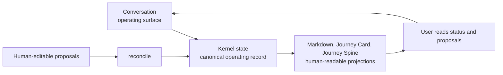
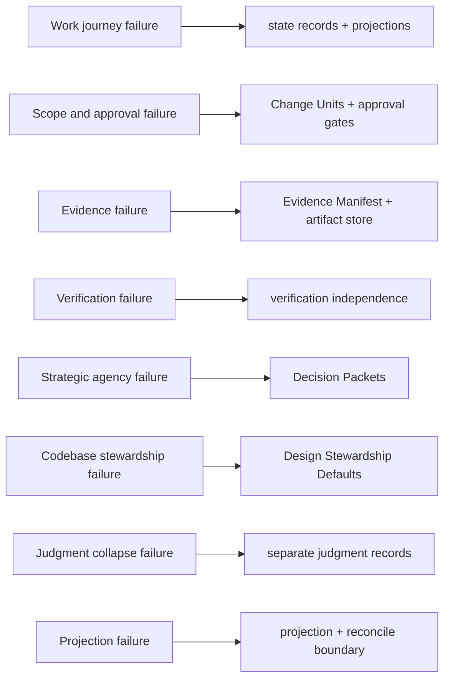
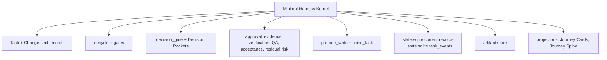
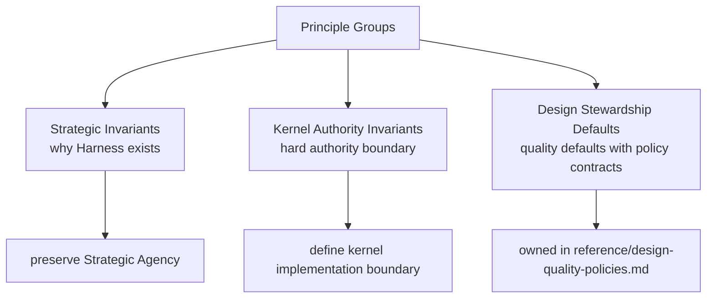
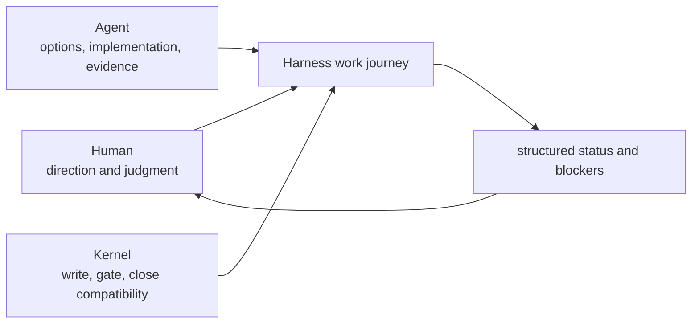
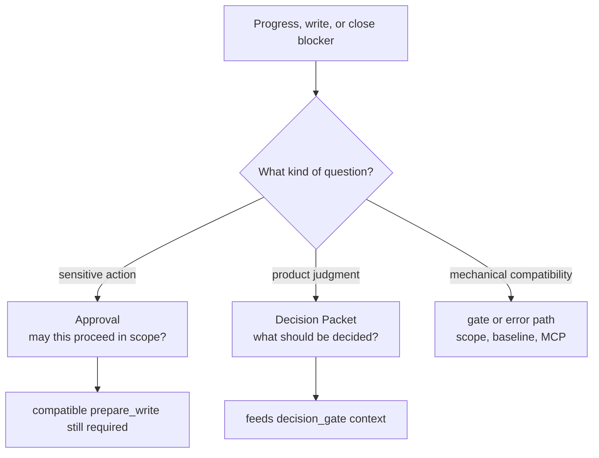
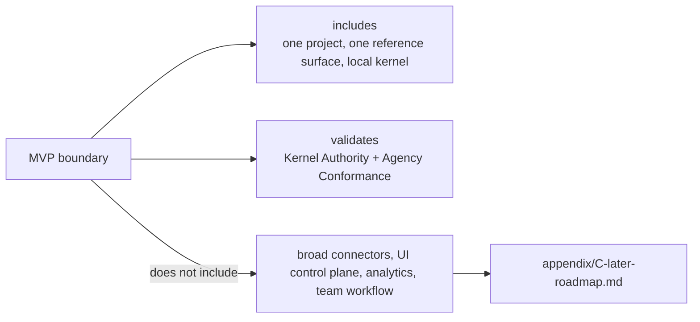

# Strategy

## Document Role

This document owns the strategic layer of the harness: why the harness exists, what failure modes it prevents, which principles preserve Strategic Agency, which principles are Kernel Authority Invariants, and which defaults guide Design Stewardship. The operational state machine is defined in [03-kernel-spec.md](03-kernel-spec.md); design-quality policy details are owned by [Design Quality Policies](reference/design-quality-policies.md).

This document does not define lifecycle transition tables, gate enum details, MCP request or response schemas, SQLite DDL, full projection templates, or surface-specific connector behavior.

## Strategic Thesis

The harness is an agency-preserving local operating kernel for AI-assisted development. Its purpose is not to make the chat transcript longer or to turn every task into heavyweight ceremony. Its purpose is to let users follow the work journey and retain strategic judgment over goals, scope, design, trade-offs, codebase stewardship, QA, acceptance, and residual risk.

The central thesis is:

```text
AI agents can move quickly without displacing the user when the kernel keeps the work journey explicit, the durable truth small, and product judgment recorded at decision gates.
```

The user should be able to begin in ordinary language. The agent should be able to ask clarifying questions, shape work, make changes, record evidence, and request decisions. But the durable facts of the work live outside the chat transcript. Completion is not a feeling in the conversation; it is a state transition judged by the kernel after the relevant evidence, QA, acceptance, and residual-risk questions have been made explicit.

The harness therefore separates three concerns:

- Conversation is the operating surface.
- Kernel state is the canonical operating record.
- Markdown documents, Journey Cards, and Journey Spine views are human-readable projections and proposal surfaces.



## Failure Model

The harness is designed around failures that appear repeatedly in AI development workflows.



### Work Journey Failure

The user loses the work journey because the current state, next action, open decisions, trade-offs, residual risk, and evidence are buried in conversation. When a chat disappears or an agent session resumes cold, the task cannot be reconstructed reliably.

The harness responds by keeping Task state, Change Units, runs, decisions, Decision Packets, evidence, QA, acceptance, residual risk, and close status in canonical records, with projections generated for human reading.

### Scope And Approval Failure

Work expands during a conversation. A small request becomes a broad rewrite, or a sensitive change proceeds without explicit approval. Approval may be granted for one scope while the actual write touches a different path, command, network target, secret, or baseline.

The harness responds by requiring scoped Change Units for product writes and explicit approval for sensitive categories.

### Evidence Failure

An agent reports that work is done without durable evidence tied to acceptance criteria. Logs, diffs, checks, and evaluation reports remain in the chat or vanish with the session.

The harness responds by requiring evidence coverage where evidence is required and by storing raw evidence in the artifact store.

### Verification Failure

The same agent that implemented the work self-reviews it and the system treats that as independent verification. This confuses confidence with independence.

The harness responds by separating self-checks from detached verification and by refusing to upgrade assurance from same-session review alone.

### Strategic Agency Failure

The agent proceeds as though product judgment belongs to the agent because choices are hidden inside implementation. Goals, scope, design direction, codebase stewardship, QA judgment, acceptance, or residual risk can be decided implicitly without the user seeing the decision.

The harness responds by preserving strategic agency. When progress is blocked on product judgment, the system records a Decision Packet that names the decision, options, trade-offs, recommendation when available, affected scope, evidence, residual risk, and next action.

### Codebase Stewardship Failure

Agent work can locally complete while the codebase becomes harder to understand, test, and change. A task may satisfy the immediate request but blur domain language, cross module or interface boundaries, widen scope into a horizontal slice, skip useful TDD traces, or leave quality findings disconnected from follow-up work.

The harness responds by treating codebase stewardship as part of the work journey. Domain language, module and interface boundaries, vertical-slice shape, feedback loops, TDD traces, Manual QA findings, and Decision Packets for blocking design trade-offs keep local completion from hiding long-term maintainability risk.

### Judgment Collapse Failure

Approval, technical assurance, Manual QA, acceptance, and residual-risk acceptance collapse into one vague "looks good." The user cannot tell which question has been answered.

The harness responds by separating those judgments:

- Approval: may this sensitive change proceed?
- Assurance: how has the result been technically checked?
- Manual QA: has a human inspected the experiential result where needed?
- Acceptance: does the user accept the result and remaining trade-offs?
- Residual risk: what known uncertainty or trade-off remains, and has the user accepted it when close depends on that acceptance?

### Projection Failure

Generated documents, stale summaries, or human-edited notes are treated as canonical state. A document change silently changes the operational truth.

The harness responds by treating Markdown reports as projections. Human-editable areas are input surfaces; accepted human edits become state only through reconcile or a Core state-changing action.

## Minimal Harness Kernel

The minimal kernel is the smallest implementable mechanism that preserves the Kernel Authority Invariants:

- Task and Change Unit records for continuity and write scope.
- Lifecycle plus gates for state compatibility.
- The `decision_gate` aggregate and recorded Decision Packets for blocking product judgments.
- Approval, evidence, verification, QA, acceptance, and residual-risk records for distinct judgments.
- `prepare_write` as the product-write decision point.
- `close_task` as the completion decision point.
- `state.sqlite` current records plus `state.sqlite.task_events` for operational history.
- Artifact store for raw evidence.
- Projections, Journey Cards, and Journey Spine views for human-readable reports and user proposal surfaces.



The kernel specification is the owner for entity semantics, lifecycle fields, gate enums, transition rules, close semantics, waiver semantics, and invariant enforcement.

## Principle Groups

The harness separates Strategic Invariants, Kernel Authority Invariants, and Design Stewardship Defaults. This keeps human agency visible without turning every good practice into a hard kernel gate.



### Strategic Invariants

These invariants preserve the reason the harness exists. A system that violates them may still store records, but it no longer preserves the user's strategic agency.

1. Strategic agency stays with the user.
2. The work journey remains followable from current state.
3. Product judgment is explicit for goals, scope, design, trade-offs, codebase stewardship, QA, acceptance, and residual risk.
4. Agents may propose, implement, and verify within recorded autonomy boundaries, but they do not silently take over product judgment.
5. Automation must make choices, blockers, evidence, and remaining risk easier to inspect.

### Kernel Authority Invariants

These invariants define the authority boundary of the local kernel. A system that violates one of them is no longer implementing the harness kernel.

1. Chat is not state.
2. Product write requires an active scoped Change Unit.
3. Sensitive change requires explicit approval.
4. Blocking product judgment requires a recorded Decision Packet.
5. Completion requires evidence coverage where evidence is required.
6. Work cannot self-certify detached verification.
7. Required QA and acceptance are separate gates.
8. Projection cannot override canonical state.

### Design Stewardship Defaults

The following are Design Stewardship Defaults, not Kernel Authority Invariants. They are important because they improve product quality, but they have applicability rules, allowed waivers, required records, validators, and close impact defined by the policy pack.

- Shared design for work.
- Domain language consistency.
- Vertical slice default.
- TDD trace for suitable work.
- Module and interface review.
- Codebase stewardship for module boundaries, interface contracts, dependency direction, testability, maintainability, and future-change risk.
- Manual QA for UI, UX, copy, accessibility, visual output, and product taste.
- Feedback loops from user decisions, QA findings, Eval findings, and residual-risk decisions back into state, scope, design, evidence, or follow-up work.
- Context hygiene.

The strategy keeps these defaults visible because they shape the product experience. The policy pack owns their detailed contracts, including how multiple applicable defaults compose into merged gate, write-blocker, close-blocker, waiver, or Decision Packet impact. That composition guides policy outcomes without promoting these defaults into Kernel Authority Invariants.

## Human Judgment Model

The harness assumes that the human provides strategic direction and judgment, while agents provide options, implementation, evidence, verification support, and structured status.



The human owns:

- goals and priorities
- scope confirmation
- design direction and product trade-offs
- codebase stewardship judgment
- sensitive-change approval
- Manual QA results where human inspection is required
- final acceptance or rejection
- residual-risk acceptance when close depends on it

The agent owns:

- surfacing choices and risks
- preparing Decision Packets when product judgment blocks progress
- proposing a Change Unit
- staying inside approved scope
- recording runs and evidence
- requesting decisions when gates require them
- launching or preparing detached verification when required

The kernel owns:

- whether a write is allowed
- whether a task can close
- whether a blocking product judgment has a recorded Decision Packet
- whether evidence, verification, QA, and acceptance states are compatible
- whether projections are fresh enough to trust as display

### Decision Packets And Approval Are Siblings, Not Substitutes

Approval answers whether a sensitive action may proceed inside a defined scope. A Decision Packet answers what product judgment the user is making.



Approval never resolves product trade-off, design direction, QA waiver, verification risk, acceptance, or residual risk unless those judgments are separately recorded through the compatible authority path.

Mechanical write blockers such as missing scope, missing approval, stale baseline, or MCP unavailable use their own gate or error path. A Decision Packet is required only when the blocker is product judgment or a user-owned waiver, risk, or acceptance decision.

Not every implementation choice requires a Decision Packet. A Decision Packet is required when the choice blocks progress, write, close, waiver, acceptance, residual-risk acceptance, product direction, scope, design trade-off, stewardship judgment, or public commitment. Ordinary reversible implementation choices inside the active Change Unit and Autonomy Boundary can be recorded as run notes or evidence.

This model keeps the user in charge without requiring the user to manually police every file write or status claim.

## Source-Of-Truth Summary

The strategy-level rule is that generated or human-edited Markdown must never become operational truth by accident. Operational state, raw evidence, projection authority, and reconcile behavior keep their canonical contracts in the owner docs: [03-kernel-spec.md](03-kernel-spec.md#authority-rules), [04-runtime-architecture.md](04-runtime-architecture.md#raw-artifacts-state-records-and-markdown-reports), [06-reference-mvp.md](06-reference-mvp.md#statesqlite), and [Document Projection Reference](reference/document-projection.md#document-authority-matrix).

In short: `state.sqlite` current records plus `state.sqlite.task_events` are the operational record, raw evidence lives in the artifact store, Markdown reports are projections, and human-editable areas become state only through reconcile or another Core state-changing action.

## Guarantee Level Summary

Guarantee levels keep the strategy honest about what a connected surface can enforce. The level definitions are owned by [04-runtime-architecture.md](04-runtime-architecture.md#guarantee-levels), and profile/fallback behavior is owned by [09-agent-integration.md](09-agent-integration.md#capability-profile).

The MVP reference surface is primarily cooperative and detective. Capability is not a kernel gate; the kernel boundary is defined in [03-kernel-spec.md](03-kernel-spec.md#capability-boundary).

## MVP Boundary

MVP is a kernel authority and agency-conformance validation project, not a broad agent-integration platform.



MVP delivery is staged without changing final MVP scope. Kernel Smoke is the first runnable proof of the kernel authority path; Agency-Hardened MVP is the complete reference MVP that satisfies the agency, stewardship, verification, operations, and fixture-conformance requirements. The staged reading maps onto the existing MVP-0 through MVP-5 sequence and does not move MVP-critical authority or agency requirements to later. See [Reference MVP staging](06-reference-mvp.md#staged-delivery-interpretation) for the compact contract.

MVP includes:

- one local project registration
- one reference agent surface
- `state.sqlite` current records plus `state.sqlite.task_events`
- artifact registry and artifact store
- public MCP tool surface
- `prepare_write` gatekeeping
- Decision Packet and `decision_gate` support for blocking product judgment
- approval, evidence, verification, Manual QA, and acceptance gate enforcement
- Journey Card or equivalent compact status projection
- required MVP report projections for Task status, approval, runs, evidence, Eval, and direct results
- detached verification bundle or manual evaluator instruction bundle
- agency-conformance smoke coverage for decision visibility and residual-risk visibility
- basic doctor, recover, reconcile, export, and conformance smoke paths

MVP does not include:

- broad connector coverage beyond the reference surface
- UI control plane and automatic capture features
- native hook expansion beyond the reference surface
- fully automatic parallel execution
- long-term analytics
- team workflow management

These later automation items are owned by [appendix/C-later-roadmap.md](appendix/C-later-roadmap.md). Later automation can strengthen the guarantee level, but it must not weaken the Strategic Agency model or the Kernel Authority Invariants model.
