# Runtime Architecture

## Document Role

This document owns the local runtime architecture of the harness: the three spaces, runtime layers, Core process model, state transaction flow, artifact store architecture, projection/reconcile flow, guarantee levels, and failure/recovery overview.

It does not define public MCP request/response schemas, SQLite DDL, full CLI command semantics, conformance fixtures, or surface-specific connector cookbooks.

## Architecture Scope

The harness is a local operating kernel for AI-assisted product work. Its architecture keeps three concerns separate:

```text
Product Repository:
  product code, tests, human-readable projections, and human-editable proposal areas

Harness Server / Installation:
  MCP server, Core, validators, connectors, projector, reconcile worker, and operator tools

Harness Runtime Home:
  registry.sqlite, project.yaml, state.sqlite, and the artifact store
```

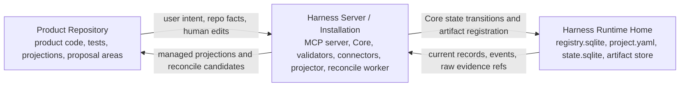

This split prevents chat, Markdown reports, generated connector files, and product source files from becoming accidental operational state. The canonical operational state is in `state.sqlite` current records plus `state.sqlite.task_events`. Raw evidence is canonical in the artifact store. Product Repository Markdown files are projections or proposal surfaces.

## Product Repository

The Product Repository is the user's real product workspace. It contains product source code, tests, repository-level agent rules, and human-readable harness projections.

Typical repository-owned paths are:

```text
repo/
  AGENTS.md
  docs/
    tasks/
    approvals/
    reports/
    design/
  .harness/
    agent/generated/
    reconcile/pending/
```

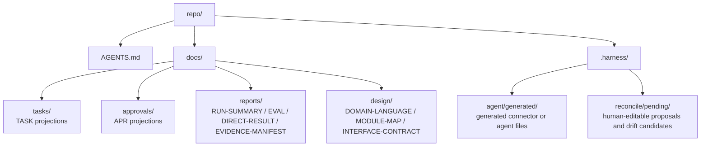

The repository may hold generated TASK, APR, RUN-SUMMARY, EVAL, DIRECT-RESULT, EVIDENCE-MANIFEST, TDD-TRACE, MANUAL-QA, DOMAIN-LANGUAGE, MODULE-MAP, and INTERFACE-CONTRACT Markdown reports. These files help humans and agents read the work, but they are not canonical state. A human-editable section is an input surface; accepted changes become state only through reconcile or a Core state-changing action.

## Harness Server / Installation

The Harness Server / Installation is the control plane. MVP can implement it as one local process with internal modules rather than a fleet of services.

Core runtime responsibilities:

- expose read resources and public tools through the MCP server
- execute kernel state transitions in Core
- run validators before writes, after runs, and before close
- record artifacts and integrity metadata
- enqueue and render projection jobs
- detect reconcile candidates from human edits or managed-block drift
- provide diagnostic, recovery, export, and conformance entrypoints

The MCP server is not a thin wrapper around shell commands. It exposes high-level intent calls that Core translates into state transitions, validators, artifact records, and projection jobs.

## Harness Runtime Home

Harness Runtime Home stores local operational authority. The reference location is `~/.harness`, but the exact MVP layout is owned by the reference MVP document.

Runtime Home contains:

- `registry.sqlite` for project registration, connected surfaces, and connector manifests
- one `project.yaml` per registered project for static project configuration
- one `state.sqlite` per project for current operational records and `state.sqlite.task_events`
- artifact directories for durable evidence files

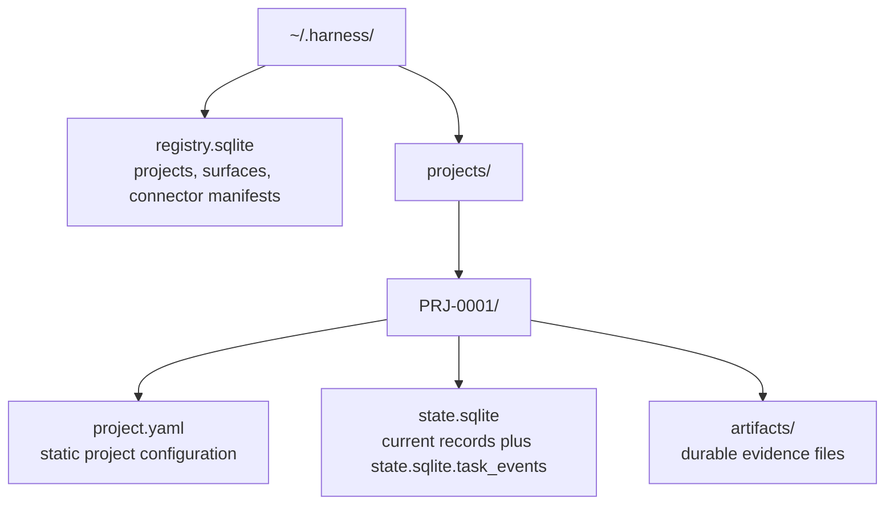

Runtime Home must be sufficient to recover operational state even if chat history disappears or Product Repository projections are stale. Product Repository documents can be regenerated from state records plus artifact refs; they do not replace those records.

## Runtime Layers

```text
User conversation surface
  ↓
Agent surface
  ↓
Harness rules / skill / local instructions
  ↓
Harness MCP server
  ↓
Harness Core
  ↓
state.sqlite / artifact store / validators / projector / reconcile worker
```

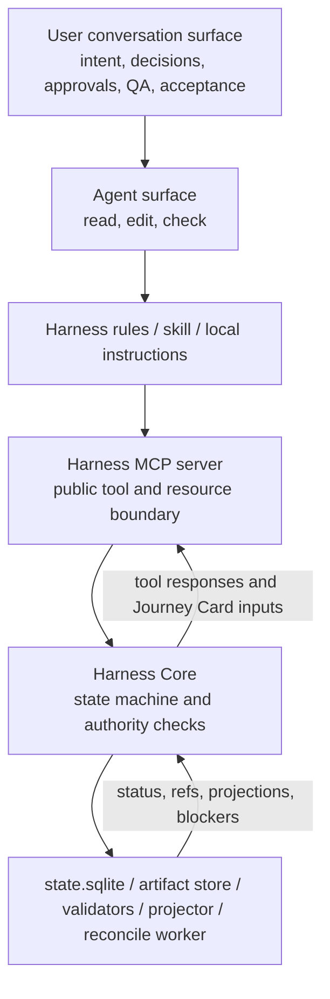

The conversation surface gathers user intent, decisions, approvals, QA judgments, and acceptance. The agent surface performs reading, editing, and checking. Harness rules and skills keep the agent oriented. The MCP server provides the tool boundary. Core owns the state machine. Validators, artifact capture, projection, and reconcile attach evidence and readable output to state transitions.

Native hooks, sidecars, command wrappers, file watchers, and worktree isolation are capability-dependent enforcement layers. MVP relies on cooperative/detective behavior for the reference surface unless a concrete capability profile proves stronger enforcement.

## Core Process Model

MVP Core can run as a single process with these internal modules:

| Module | Runtime responsibility |
|---|---|
| State store | current records, state versions, locks, and `state.sqlite.task_events` |
| Task workflow | intake, mode selection, next action, gate updates, close decisions |
| Journey module | Journey Spine reconstruction, Journey Spine Entry support records, Journey Card inputs, and continuity refs |
| Decision module | Decision Packet lifecycle, `decision_gate` aggregation, user judgment routing, and residual-risk visibility inputs |
| Approval module | scope-bound approval request, decision, expiry, and drift handling |
| Evidence module | run records, artifact refs, evidence manifests, and coverage checks |
| Verification module | verification bundles, evaluator runs, Eval records, and independence checks |
| Manual QA module | QA records and `qa_gate` aggregation |
| Projection module | projection jobs, managed blocks, freshness, and report paths |
| Reconcile module | human-editable proposals, managed drift, and accepted-state routing |
| Validator runner | core, decision, autonomy/boundary, design-quality, artifact, projection, and connector checks |
| Autonomy/Boundary validator responsibility | Autonomy Boundary compatibility, agent latitude, user-judgment requirements, AFK stop conditions, and boundary drift findings |
| Connector adapter | reference surface registration, capability reporting, and capture hints |

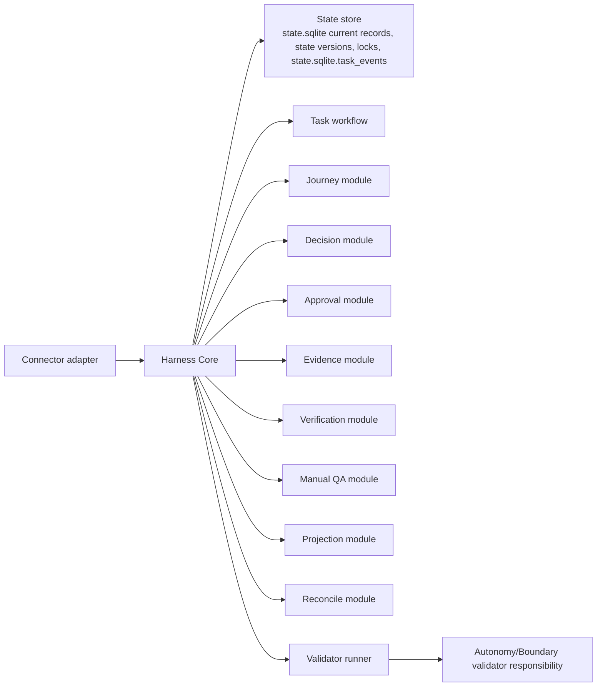

Core is the only component that updates canonical operational state. Agents, CLI commands, projectors, and reconnect/recovery flows must enter through Core logic or use recovery code that preserves the same state compatibility rules.

Decision, Journey, and Autonomy/Boundary modules do not create a new authority tier. Their canonical records live in `state.sqlite` current records plus `state.sqlite.task_events`, their raw evidence lives in the artifact store, and their Markdown views remain projections or proposal surfaces.

## State Transaction Flow

Every state-changing operation uses one SQLite transaction for current records and event history:

```text
1. validate request envelope and expected state version
2. acquire the project/task lock needed for the transition
3. read current state records
4. run pre-transition validators
5. update current records
6. append one or more rows to state.sqlite.task_events
7. increment state/projection versions as needed
8. enqueue projection jobs
9. commit
10. render Markdown projections after commit
```

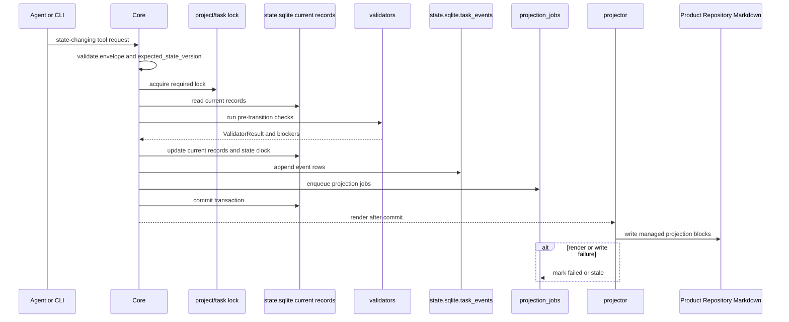

Within that transaction, Core increments the affected scope clock. Task-scoped changes increment `tasks.state_version`; project-scoped changes with `task_id=null` increment `project_state.state_version`. Event rows record the resulting state version for their affected scope.

Projection rendering happens after the transaction. A projection failure marks projection freshness as stale or failed and leaves the committed state intact. Projection cannot turn a passed task into a failed task, and it cannot repair canonical state without a later reconcile decision.

## Artifact Store Architecture

The artifact store holds durable evidence files. Raw artifacts include files such as diffs, logs, screenshots, checkpoints, bundles, captured manifests, exported bundle components, and other evidence files that are stored with integrity metadata.

An artifact has two parts:

- the raw file in the artifact store
- the artifact state record in `state.sqlite` that names its kind, path, hash, size, redaction state, task/run relation, and retention class

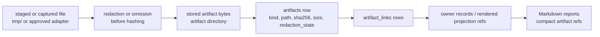

Core records artifact refs on existing owner records such as runs, evidence manifests, Eval records, Manual QA records, Decision Packets, and rendered projection refs. Export snapshots and components remain artifact files linked back to those owners or projections. Large logs and patches should stay as raw artifacts; Markdown reports should link to artifact refs instead of embedding unbounded evidence.

Raw secrets should not be stored as artifacts. If secret-related evidence is required, Core records a redacted artifact, a secret handle, or an operator note that passed the relevant validator.

## Raw Artifacts, State Records, And Markdown Reports

The boundary is:

| Item | Authority | Examples |
|---|---|---|
| Raw artifact | Durable evidence file in artifact store | diff, log, screenshot, checkpoint, bundle, manifest file |
| State record | Canonical structured record in `state.sqlite` | Task, Change Unit, Decision Packet, Journey Spine Entry, Residual Risk, Run, Approval, Eval, Manual QA record, Evidence Manifest, Shared Design, Artifact record |
| Markdown report | Human-readable projection from records and artifact refs | TASK, Journey Card/Spine views, Decision Packet views, APR, RUN-SUMMARY, EVAL, DIRECT-RESULT, EVIDENCE-MANIFEST |

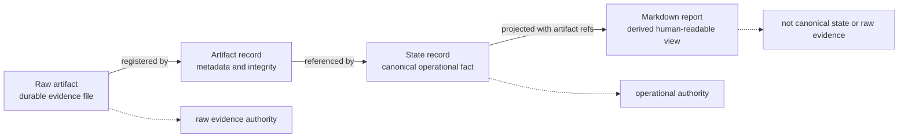

These named report kinds are projections generated from state records and artifact refs by default. They may refer to evidence files in the artifact store, and an export may include snapshots of them, but that does not make the Markdown report the canonical evidence file.

## Projection And Reconcile Flow

Projection is an outbox-style flow:

```text
state transition committed
→ projection job queued
→ managed block rendered from state records and artifact refs
→ projected version and managed hash recorded
→ human-editable area preserved
```

Projector writes only managed areas and preserves human-editable areas. If a managed area was edited directly, projector records a reconcile candidate instead of silently treating the edit as state. If a human-editable area contains a proposal, reconcile creates a candidate record and asks for an explicit decision.

Reconcile authority path:

```text
human-editable input
→ state.sqlite.reconcile_items
→ accepted state event/record or rejected/deferred note
```

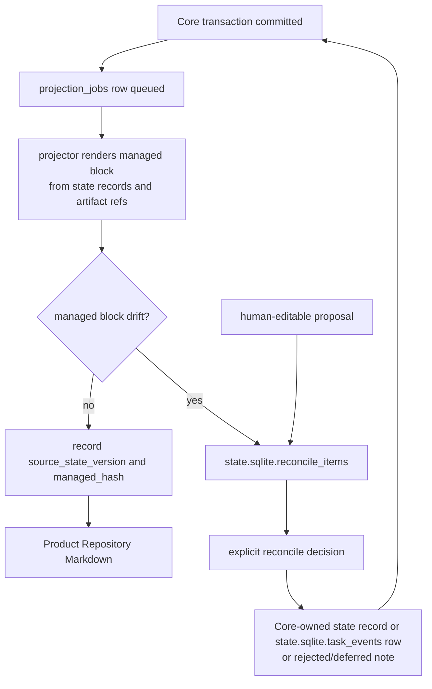

Reconcile can merge, reject, convert to note, create a decision, create or update a design support record, or defer. Accepted operational changes are recorded through Core and appended to `state.sqlite.task_events`.

## Validators And Adapter Placement

Validators sit beside Core and return structured results to Core. Core decides whether the result blocks a transition, marks a gate stale/partial/blocked, requests a user decision, or only affects display.

Stable MVP validator IDs:

- `decision_gate_check`
- `decision_quality_check`
- `autonomy_boundary_check`
- `feedback_loop_check`
- `tdd_trace_required`
- `codebase_stewardship_check`
- `residual_risk_visibility_check`
- `shared_design_alignment`
- `vertical_slice_shape`
- `domain_language_consistency`
- `module_interface_review`
- `manual_qa_required`
- `context_hygiene_check`
- `surface_capability_check`

`feedback_loop_check` reads Feedback Loop support records and related execution evidence; it does not introduce a separate kernel gate. Its consequences flow through `design_gate`, evidence sufficiency, blockers, or display in the same validator placement model as the other design-quality checks.

Core preconditions and mechanical checks such as state/envelope validation, active Task, active Change Unit, changed paths, baseline freshness, approval scope, evidence sufficiency, artifact integrity, verification independence, same-session verification guard, and projection freshness may run before or beside these validators. They are not alternate validator IDs unless this section, the MCP API, or the Reference MVP explicitly promotes them into the stable ValidatorResult-emitting set. Surface capability is intentionally modeled as the `surface_capability_check` capability validator when emitted as a `ValidatorResult`.

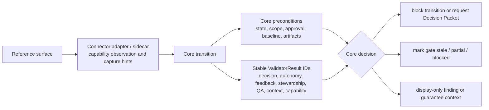

Adapters and sidecars translate surface capability into observable facts. They do not create a kernel gate for capability. Capability appears through the `surface_capability_check` validator, `prepare_write` blocked reasons, and guarantee display.

## Guarantee Levels

The harness reports guarantee levels to make enforcement strength honest:

| Level | Meaning |
|---|---|
| `cooperative` | the agent surface is expected to follow harness instructions and MCP decisions |
| `detective` | the harness can detect violations and mark state blocked, stale, partial, or failed after observation |
| `preventive` | the connector or runtime can block a violating action before it executes |
| `isolated` | risky work is separated by a worktree, sandbox, process boundary, or equivalent isolation |

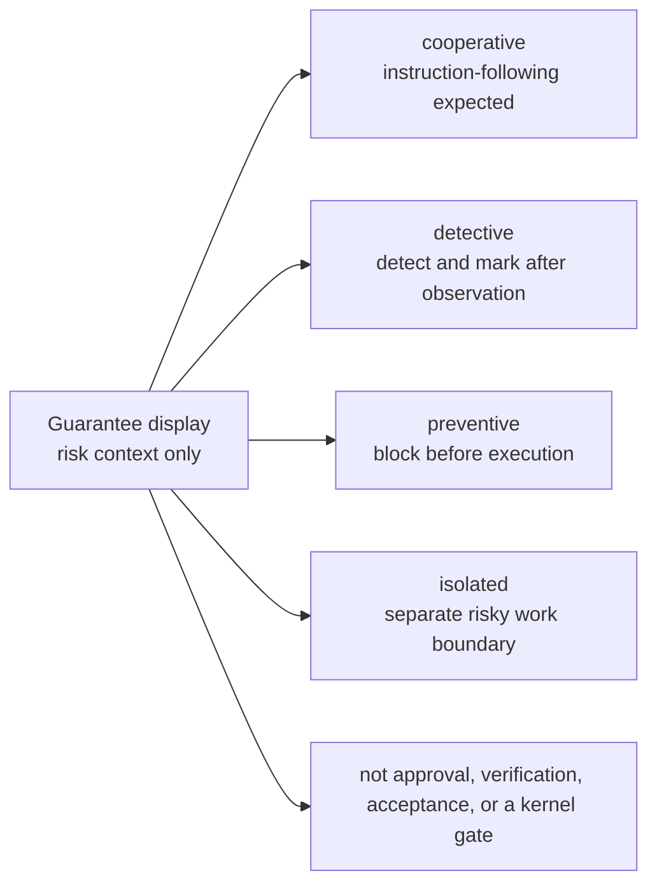

MVP reference behavior is cooperative/detective unless the connected surface has a concrete pre-tool guard or isolation layer. Native hook expansion, advanced sidecar watching, and broad isolated execution are later roadmap items unless explicitly implemented for the MVP reference surface.

Guarantee level is display and risk context. It is not approval, verification, acceptance, or a kernel gate.

## Failure And Recovery Overview

Failures are recorded rather than hidden:

| Failure | Architecture-level handling |
|---|---|
| Agent crash during write | mark active run interrupted; capture diff/log snapshot when possible; register artifacts |
| Baseline drift after approval | mark approval or evidence stale; require reconfirmation when scope is affected |
| Evaluator observes repo drift | block or stale verification; require fresh baseline or new bundle |
| Artifact file missing | mark artifact/evidence stale; rescan or restore through recovery |
| Projection job failed | keep state current; mark projection failed and retry or reconcile |
| Managed Markdown edited directly | create reconcile item; do not mutate state directly |
| MCP unavailable | distinguish diagnostic condition `MCP_SERVER_UNAVAILABLE`, where the tool call cannot reach Core and no authoritative Core response is possible, from diagnostic condition `SURFACE_MCP_UNAVAILABLE`, where Core or an operator can observe that the connected surface lacks usable MCP, has stale MCP configuration, or cannot call required tools; `MCP_UNAVAILABLE` remains the stable public availability code; product/runtime/code writes are held by instruction on cooperative surfaces or blocked by stronger guards when available |
| Surface capability mismatch | record validator result, adjust guarantee display, and block unsafe writes when required checks cannot be satisfied |

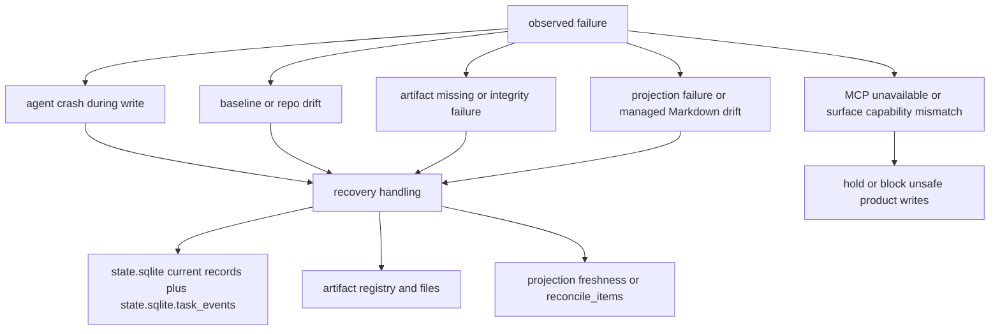

Recovery tools may repair projection freshness, rescan artifacts, interrupt stale runs, expire drifted approvals, or create reconcile items. They must preserve the same authority rules: `state.sqlite` is operational state, `state.sqlite.task_events` is the event history inside that state store, raw evidence lives in the artifact store, and Markdown reports remain projections.
