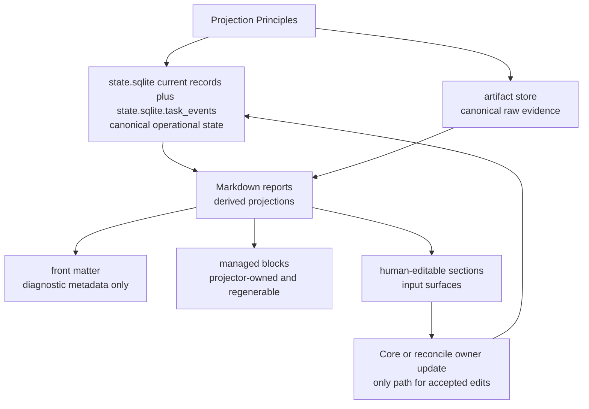
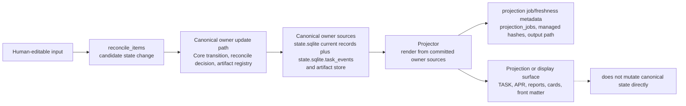
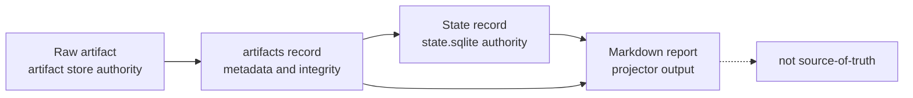
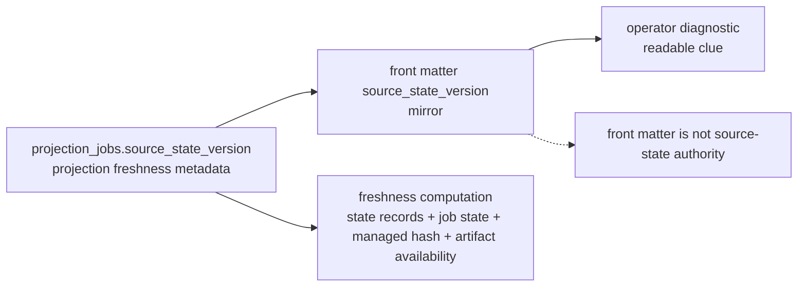
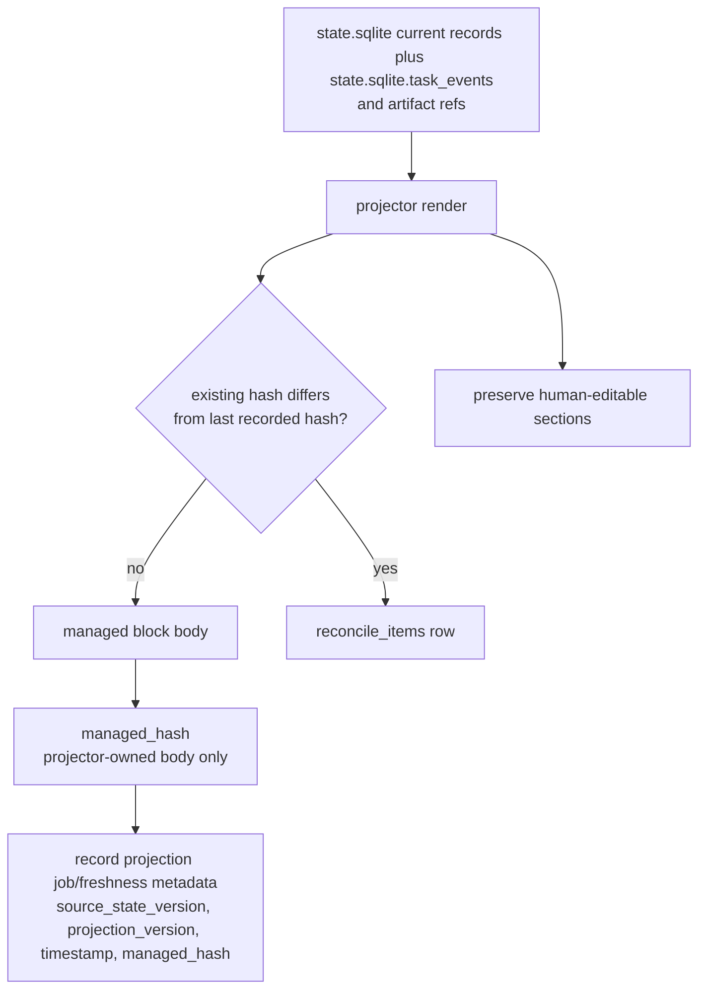
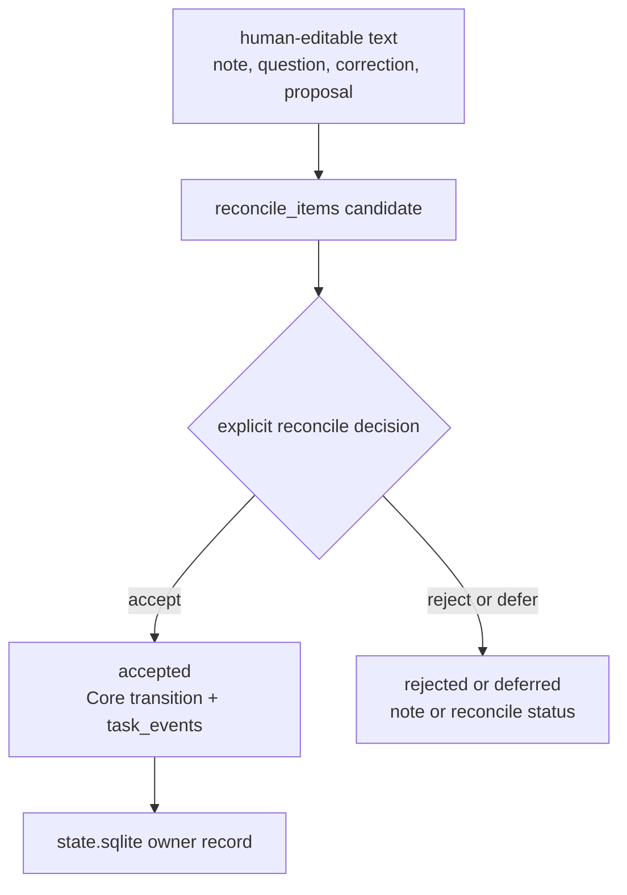
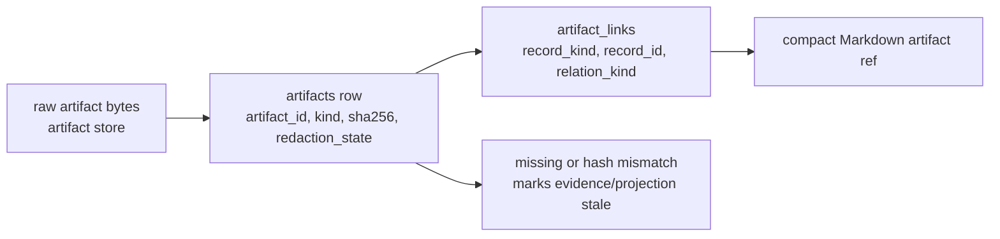
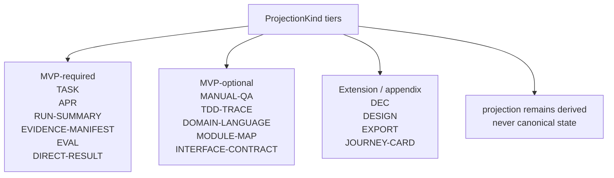
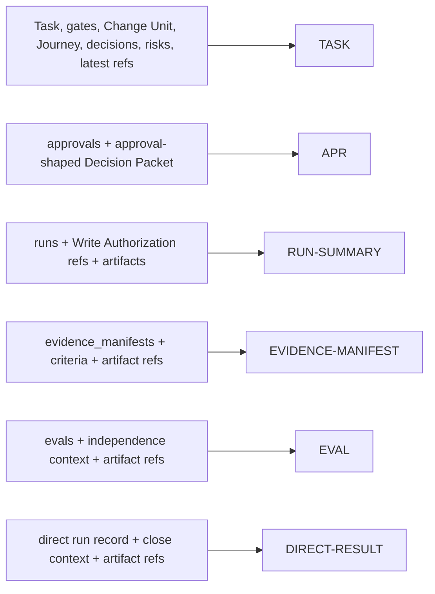
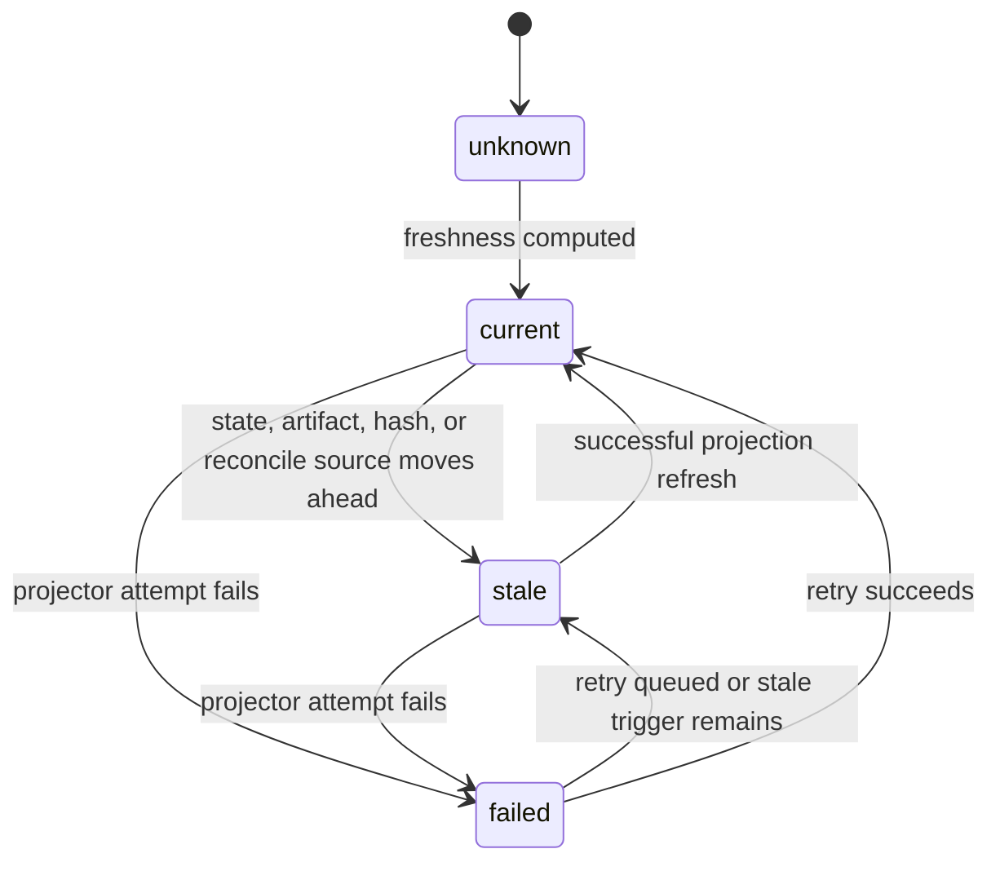

# Document Projection

## Document Role

This document owns the rules for human-readable Markdown projections in the Product Repository. It defines projection principles, document authority boundaries, managed block rules, human-editable rules, artifact reference rendering, template tiers, required MVP template summaries, optional design-quality and appendix variant template summaries, and projection freshness rules.

It does not define canonical kernel state, MCP request/response schemas, SQLite DDL, design-quality policy requirements, or full template text. Full templates live in [Appendix A](appendix/A-template-library.md).

## Projection Principles

1. Projection is not source-of-truth.
2. Canonical operational state is `state.sqlite` current records plus `state.sqlite.task_events`.
3. Raw evidence is canonical in the artifact store.
4. Markdown reports are rendered from state records and artifact references.
5. Markdown reports are not raw artifacts by default.
6. Front matter carries only identity, projection version or status, `source_state_version`, and timestamp/freshness metadata.
7. Managed blocks are generated by the projector and may be regenerated.
8. Human-editable sections are input surfaces for notes and proposals.
9. Accepted human edits become state only through reconcile or a Core state-changing action.
10. Large logs, diffs, traces, screenshots, bundles, and checkpoints are linked by artifact refs instead of embedded.
11. Projection failure or staleness never changes the underlying task result.
12. User-facing cards may use friendly labels, but canonical gate names remain the kernel fields.
13. Decision Packet, Journey Card, Journey Spine, Autonomy Boundary, Write Authority Summary, Change Unit DAG, Residual Risk, and Stewardship Impact displays are non-canonical projections from owner records and artifact refs.

Source-of-truth caption: canonical operational state is `state.sqlite` current records plus `state.sqlite.task_events`; raw evidence stays in the artifact store; Markdown is a derived view.



## Document Authority Matrix

| Fact or surface | Canonical source | Projection or display surface | Update path |
|---|---|---|---|
| Current Task state | `state.sqlite.tasks`, `task_gates`, and `state.sqlite.task_events` | `TASK` Current Summary and status card | Core transition, then projector |
| Task continuity | `state.sqlite` Task, Change Unit, Run, Evidence Manifest, Eval, Manual QA, Decision Packet, Approval, Residual Risk, `task_gates.acceptance_gate`, acceptance Decision Packet user-decision state, close events, artifact refs, `journey_spine_entries` when needed, and `state.sqlite.task_events` | `TASK` Journey Spine | Core transition or reconcile, Journey reconstruction, then projector |
| Decision Packet | `state.sqlite.decision_packets`, related `decision_gate` state, decision events, related approval or reconcile records, artifact refs, and linked `state.sqlite.residual_risks` when applicable | `TASK` Pending Decisions, Journey Card decision line, status/next responses, judgment-context resources, and decision-packet resources; optional `DEC` when standalone projection is enabled | `request_user_decision` / `record_user_decision`, then projector |
| Journey Spine | `state.sqlite` Task, Change Unit, Run, Decision Packet, Approval, Evidence Manifest, Eval, Manual QA, Residual Risk, `task_gates.acceptance_gate`, acceptance Decision Packet user-decision state, close events, artifact refs, `journey_spine_entries` when needed, and `state.sqlite.task_events` | `TASK` Journey Spine section, resume views, Journey Spine-oriented cards | Core transition or reconcile, Journey reconstruction, then projector |
| Journey Card | current `state.sqlite` Task state, gates, active Change Unit, Autonomy Boundary summary, active Decision Packet refs, residual-risk summary, latest evidence/eval/QA/report refs, and projection freshness | `JOURNEY-CARD`, status card, `harness.status` card text, `harness.next` current-position text, significant resume output | Read or projection refresh from current state; never direct card edit |
| Autonomy Boundary | active `state.sqlite.change_units` Autonomy Boundary fields plus related Decision Packet resolutions and events | `TASK` Autonomy Boundary, Change Unit block, Journey Card autonomy line, optional related `DEC` when standalone projection is enabled | shaping update or user Decision Packet resolution, then projector |
| Write Authorization | `state.sqlite.write_authorizations` plus related Task, Change Unit, approval, Decision Packet, baseline, and consumed Run refs | `TASK` Write Authority Summary, Journey Card Write Authority Summary line, `RUN-SUMMARY` relation | `prepare_write` creates it; idempotent replay returns the already committed response; `record_run` consumes the authorization, then projector |
| Change Unit DAG | `state.sqlite.change_units`, `state.sqlite.change_unit_dependencies`, dependency-related events, and active Task state | `TASK` Change Unit Dependencies / DAG summary | shaping update or reconcile, then projector |
| Residual Risk | `state.sqlite.residual_risks`, accepted-risk metadata and residual-risk refs, related Decision Packets, evidence/QA/eval refs, and artifact refs | `TASK` Residual Risk, optional `DEC` accepted-risk context when standalone projection is enabled, Journey Card residual-risk line | Core transition from decision, evidence, QA, Eval, reconcile, or close flow, then projector |
| Stewardship Impact Summary | `domain_terms`, `module_map_items`, `interface_contracts`, `feedback_loops`, TDD records when TDD is selected, `state.sqlite.residual_risks`, `state.sqlite.decision_packets`, policy validator results, and related refs | `TASK` Stewardship Impact and status/resume stewardship displays | Owner record update, validator result, reconcile, or close flow, then projector |
| User Notes | human-editable input -> `reconcile_items` -> accepted state event/record | `TASK` User Notes and Proposals | human edit, reconcile decision, Core event |
| Shared Design | shared design records and events | `TASK` summary, `DESIGN`, optional `DEC` when standalone projection is enabled | Core transition or reconcile, then projector |
| Domain Language | `domain_terms` table | `DOMAIN-LANGUAGE` projection | Core transition or reconcile, then projector |
| Module Map | `module_map_items` table | `MODULE-MAP` projection | Core transition or reconcile, then projector |
| Interface Contract | `interface_contracts` table | `INTERFACE-CONTRACT` projection | Core transition or reconcile, then projector |
| Feedback Loop | `feedback_loops` table plus refs to runs, artifacts, TDD traces, Manual QA, and evidence manifests | `TASK` Stewardship Impact and Evidence Manifest design-quality coverage; no standalone Feedback Loop projection in MVP | `FeedbackLoopUpdate` through `record_run` shaping or evidence update, `record_manual_qa` via `feedback_loop_ref`, or reconcile, then projector |
| Approval | `approvals`, approval-shaped Decision Packet, optional decision request routing/replay record if implementation keeps one, and events; never `approval_request_candidate` alone | `APR` projection and approval card | `request_user_decision(decision_kind=approval)` creates the pending Approval record, `record_user_decision` updates the approval decision, then projector |
| Run summary | `runs` table plus artifact refs | `RUN-SUMMARY` projection | `record_run`, then projector |
| Direct result | direct run record plus artifact refs | `DIRECT-RESULT` projection | `record_run` / `close_task`, then projector |
| Evidence coverage | `evidence_manifests` plus artifact refs | `EVIDENCE-MANIFEST` projection | evidence module update, then projector |
| Verification verdict | `evals` plus artifact refs | `EVAL` projection and verification card | `record_eval`, then projector |
| TDD trace | `tdd_traces` plus artifact refs | `TDD-TRACE` projection | `record_run` or reconcile, then projector |
| Manual QA | `manual_qa_records` plus artifact refs when a record exists; `qa_gate` is canonical gate for pending or satisfied QA | `MANUAL-QA` projection and QA card | `record_manual_qa`, then projector |
| Raw evidence | artifact store plus `artifacts` records | artifact references in reports | artifact registry |
| Projection freshness | `projection_jobs.source_state_version`, `projection_jobs.projection_version`, job status, managed hashes, artifact records | front matter mirror, status card, operations output | projector and recovery tools |

Source-of-truth caption: owner update paths write canonical owner state; the projector records projection job/freshness metadata and renders Markdown afterward.



Required authority statements:

- User Notes: human-editable input -> `reconcile_items` -> accepted state event/record
- Domain Language: `domain_terms` table -> `DOMAIN-LANGUAGE` projection; public refs to canonical term rows use `StateRecordRef.record_kind=domain_term`
- Module Map: `module_map_items` table -> `MODULE-MAP` projection; public refs to canonical module rows use `StateRecordRef.record_kind=module_map_item`
- Interface Contract: `interface_contracts` table -> `INTERFACE-CONTRACT` projection; public refs to canonical contract rows use `StateRecordRef.record_kind=interface_contract`
- Feedback Loop: `feedback_loops` table -> `TASK` and Evidence Manifest display; public refs to canonical feedback-loop rows use `StateRecordRef.record_kind=feedback_loop`; TDD Trace refs remain separate execution evidence refs
- Decision Packet: `state.sqlite.decision_packets` and related refs -> `TASK` Pending Decisions, status/next responses, judgment-context resources, and decision-packet resources; optional `DEC` projection when standalone projection is enabled
- Journey Spine: reconstructed from owner records, artifact refs, `journey_spine_entries` supplements, and `state.sqlite.task_events`; it is not its own authority record
- Journey Card: derived display from current state and refs; it is never canonical state
- Autonomy Boundary: active `state.sqlite.change_units` boundary fields -> projection surfaces; it is judgment latitude, not scope authority
- Write Authority Summary: derived display from active scope, approval, Write Authorization, baseline, and guarantee refs; it is never canonical state and cannot authorize work
- Write Authorization: `state.sqlite.write_authorizations` records a specific allowed write attempt; it is not scope, approval, evidence, verification, QA, acceptance, or residual-risk acceptance
- Approval: `approvals` plus the approval-shaped Decision Packet -> `APR` projection only after the Approval record exists or changes; an `approval_request_candidate` from `prepare_write` may appear as candidate display, but it is not an `APR` source
- Change Unit DAG: `state.sqlite.change_unit_dependencies` and Change Unit refs -> dependency projection; it is not a scheduler or authorization surface
- Residual Risk: `state.sqlite.residual_risks` including accepted-risk metadata/refs -> residual-risk displays
- Stewardship Impact Summary: derived from owner records, validator results, and refs -> `StewardshipImpactSummary` display; it is not a canonical record

## Markdown Report Boundary

The boundary is deliberately strict:

| Item | What it is | Authority |
|---|---|---|
| Raw artifact | Durable evidence file such as a diff, log, screenshot, checkpoint, bundle, or manifest file | artifact store |
| State record | Canonical structured record such as Task, Change Unit, Decision Packet, Journey Spine Entry, Residual Risk, Run, Approval, Write Authorization, Eval, Manual QA record, Evidence Manifest, Artifact record, or Reconcile Item | `state.sqlite` |
| Markdown report | Human-readable projection from records and artifact refs | projector output |

Source-of-truth caption: a Markdown report can link to evidence and summarize state, but it is neither the raw artifact nor the state record.



These report kinds are projections generated from state records and artifact refs by default. They can link to evidence files in the artifact store, and an export can include snapshots of them, but that does not make the Markdown report canonical evidence.

## Front Matter Metadata

Projection front matter stays diagnostic and compact. It may identify the rendered object, show the projection version or status, mirror `source_state_version`, and include the rendered timestamp. It must not contain large state summaries, evidence bodies, gate rollups, or artifact inventories.

`projection_version` is the projection/template/job version. It is not a state clock and must not be used as the source-state freshness basis. `source_state_version` is the affected-scope state clock value used as the render source: the Task State Version when the projection is task-scoped, otherwise the Project State Version or extension-defined owner state clock.

The canonical per-projection value is `projection_jobs.source_state_version` for the successful render job. Front matter `source_state_version` only mirrors that value for operator diagnosis. Recording it in Markdown does not make the Markdown canonical state, and stale detection still compares canonical state records, projection job state, managed hashes, and artifact availability.

Source-of-truth caption: `projection_jobs.source_state_version` is authoritative for projection freshness metadata; front matter only mirrors it and is not owner state.



## Managed Blocks

Managed blocks are the only Markdown areas the projector may overwrite:

```md
<!-- HARNESS:BEGIN managed -->
...
<!-- HARNESS:END managed -->
```

Rules:

- Managed block content is generated from committed state records and artifact refs.
- The projector records `projection_jobs.source_state_version`, projection version, rendered timestamp, and managed hash. Front matter mirrors the recorded source state version for operators.
- The managed hash is computed from the projector-owned managed block body, excluding the `HARNESS:BEGIN` and `HARNESS:END` marker lines, after normalizing line endings to LF and preserving meaningful whitespace required by the projector rules.
- If the managed block hash differs from the last projected hash before rendering, the projector creates or updates a reconcile item.
- The managed hash is used only for drift detection; it never makes the rendered Markdown canonical state.
- The projector does not silently treat a direct edit inside a managed block as accepted state.
- Re-rendering a managed block must preserve unrelated human-editable sections.
- A failed render marks projection freshness `failed` or `stale`; it does not roll back state.

Source-of-truth caption: managed hashes detect projection drift; they do not make rendered Markdown canonical state or update owner records.



## Human-Editable Sections

Human-editable sections give users a place to leave notes, questions, corrections, and proposals:

```md
## User Notes and Proposals
-
```

Rules:

- Human-editable text is input, not canonical state.
- Reconcile reads the edit and creates a `reconcile_items` candidate when state may need to change.
- Accepted proposals become state only through a Core transition and appended `state.sqlite.task_events` row.
- Rejected proposals remain notes or rejected reconcile items.
- The projector must preserve human-editable content across refreshes.
- Human-editable proposals may target Task summary, acceptance criteria, Domain Language, Module Map, Interface Contract, Manual QA notes, or other state-backed records, but the proposal itself is not the target record.

Source-of-truth caption: human-editable text is input; accepted changes become state only through reconcile or a Core state-changing action.



## Artifact References In Markdown

Markdown reports render artifact references compactly and consistently. The payload shape is owned by the MCP API document; projection owns only presentation rules.

Recommended display:

```text
- Diff: DIFF-0001 (`artifact_id=ART-0001`, sha256:abc123..., redaction:none)
- Test log: LOG-0002 (`artifact_id=ART-0002`, sha256:def456..., redaction:redacted)
- Bundle: BUNDLE-0001 (`artifact_id=ART-0003`, sha256:789abc..., redaction:secret_omitted)
```

Rules:

- Every artifact ref must resolve to an artifact record.
- Every raw artifact ref must carry integrity metadata and redaction state.
- Large or sensitive evidence is linked, not pasted into Markdown.
- Missing or hash-mismatched artifacts mark related evidence or projection freshness stale.
- State record refs use record identity and optional projection path; they are not rendered as raw artifact refs.
- `artifact_links.record_kind` must resolve to an existing state owner or projection ref. `EXPORT` is a `ProjectionKind` only; export snapshots and components remain artifacts linked to their owner records or to `record_kind=projection`, not to `record_kind=export`.

Source-of-truth caption: Markdown renders compact artifact refs from artifact records; large or sensitive evidence remains outside the report body.



## Template Tiers

Projection templates match the API `ProjectionKind` tiers.

| Tier | Templates | Rule |
|---|---|---|
| MVP-required | `TASK`, `APR`, `RUN-SUMMARY`, `EVIDENCE-MANIFEST`, `EVAL`, `DIRECT-RESULT` | MVP projector must render these. |
| MVP-optional | `MANUAL-QA`, `TDD-TRACE`, `DOMAIN-LANGUAGE`, `MODULE-MAP`, `INTERFACE-CONTRACT` | Render when policy applies, records exist, or the user/operator enables the projection. |
| Extension / appendix | `DEC`, `DESIGN`, `EXPORT`, `JOURNEY-CARD` | Render only when the corresponding extension or appendix projection is enabled. Full text lives in Appendix A. |

Source-of-truth caption: `ProjectionKind` tiering controls renderer support expectations; no tier makes a projection canonical state.

The `EXPORT` template is an optional projection output. It does not introduce an `export` state record for artifact links.



Main docs define each template's purpose and source records only. Full template bodies live in [Appendix A](appendix/A-template-library.md).

Persisted `JOURNEY-CARD` Markdown is optional. Current-position Journey Card output in `harness.status`, `harness.next`, and significant resume flows is required for agency conformance.

MVP Decision Packet visibility is required through `TASK` projections, status/next responses, judgment-context resources, and decision-packet resources. Standalone `DEC` Markdown is optional unless the standalone Decision Packet projection feature is enabled.

Decision Packet record IDs use `DEC-*`. `DEC` as a `projection_kind` is only the projection kind label; when a standalone projection needs its own identity, use a separate `projection_id` such as `DEC-PROJ-0001`.

## Required MVP Templates

Source-of-truth caption: required MVP templates render from owner record families and artifact refs; the templates do not replace those owners.



### TASK

Purpose: the continuity projection for the active work. It summarizes where the work is, judgment context, Autonomy Boundary, Write Authority Summary, Stewardship Impact, next evidence, residual risk, mode, lifecycle phase, next action, current gates, active Change Unit, pending decisions, evidence, report refs, and projection freshness.

Sources: `state.sqlite` Task, task gates, active Change Unit, Change Unit dependencies, Write Authorization records, Write Authority Summary display inputs, Decision Packets, Residual Risks, latest Run, latest Evidence Manifest, latest Eval, latest Manual QA record, approval records, Journey Spine source records, `domain_terms`, `module_map_items`, `interface_contracts`, `feedback_loops`, `tdd_traces` when TDD is selected, design-quality validator results, artifact refs, projection freshness.

Boundary: Stewardship Impact in `TASK` is the `StewardshipImpactSummary` display derived from owner records, validator results, and refs. It does not replace Domain Language, Module Map, Interface Contract, Feedback Loop, TDD Trace, residual-risk, or Decision Packet owner records.

Human-editable area: User Notes and Proposals.

### APR

Purpose: a readable approval request and decision record for sensitive change after the approval request has been committed.

Sources: approval record, related approval-shaped Decision Packet, optional decision request routing/replay record if implementation keeps one, Change Unit scope, sensitive categories, allowed paths/tools/commands/network/secrets, baseline, expiry, alternatives, decision note. A non-mutating `approval_request_candidate` returned by `prepare_write` is not an `APR` source and must be displayed, if at all, as candidate display.

Boundary: approval does not resolve product judgment, prove correctness, satisfy evidence, replace verification, replace Manual QA, imply acceptance, or accept residual risk. Decision request routing records are not decision authority and cannot affect `decision_gate` except through a linked compatible Decision Packet.

### RUN-SUMMARY

Purpose: a readable summary of an execution run.

Sources: run record, actor/surface identity, baseline, Change Unit, consumed Write Authorization ref when present, changed paths, command results, validator results, artifact refs, evidence updates, follow-ups.

Boundary: raw logs and diffs stay as artifacts; the report links to them.

### EVIDENCE-MANIFEST

Purpose: a readable map from acceptance criteria and completion conditions to supporting evidence.

Sources: evidence manifest record, acceptance criteria, changed file coverage, design-quality coverage, approval refs, artifact refs, related Run, Eval, Feedback Loop, Manual QA, and TDD trace refs.

Boundary: where evidence is required, close depends on the canonical `evidence_gate`, not the report text alone.

### EVAL

Purpose: a readable verification result with independence context.

Sources: Eval record, verification target, verdict, independence qualifier, baseline relationship, checks performed, evidence reviewed, blockers, artifact refs.

Boundary: an Eval verdict alone does not upgrade assurance. `detached_verified` requires a passed verification with valid independence and no same-session self-review violation.

### DIRECT-RESULT

Purpose: a compact result report for small direct work.

Sources: direct run record, consumed Write Authorization ref when present for direct product writes, changed paths, checks performed, artifact refs, escalation flag, close assurance.

Boundary: direct work may close self-checked by default, unless policy or the user requires detached verification or other gates. A consumed Write Authorization ref may be displayed, but the projection does not become the canonical authorization record.

## Optional Template Summaries

### DOMAIN-LANGUAGE

Purpose: a readable projection of canonical product vocabulary.

Source: `domain_terms` table. Human edits are proposals that reconcile into `domain_terms`. Public refs to canonical term rows use `StateRecordRef.record_kind=domain_term`; projection refs target only the rendered `DOMAIN-LANGUAGE` document.

### MODULE-MAP

Purpose: a readable projection of modules, responsibilities, public interfaces, dependencies, test boundaries, and watchpoints.

Source: `module_map_items` table. Human edits are proposals that reconcile into module map records. Public refs to canonical module map rows use `StateRecordRef.record_kind=module_map_item`; projection refs target only the rendered `MODULE-MAP` document.

### INTERFACE-CONTRACT

Purpose: a readable projection of public interface expectations, compatibility impact, callers, and boundary tests.

Source: `interface_contracts` table. Human edits are proposals that reconcile into interface contract records. Public refs to canonical interface contract rows use `StateRecordRef.record_kind=interface_contract`; projection refs target only the rendered `INTERFACE-CONTRACT` document.

### TDD-TRACE

Purpose: a readable red/green/refactor evidence trail or a recorded non-TDD justification.

Source: `tdd_traces` plus artifact refs. Policy determines when the trace is required or waivable. A `TDD-TRACE` projection shows TDD evidence; it does not define the selected Feedback Loop record.

### MANUAL-QA

Purpose: a readable human inspection record for UX, workflow, copy, accessibility, visual output, or other experiential quality.

Source: `manual_qa_records` plus artifact refs when a record exists, and `qa_gate` for the aggregate requirement state. User-facing cards may say `Manual QA: pending/passed/failed/waived`, but `pending` is a requirement/gate display from `qa_gate`, not `manual_qa_record.result=pending`.

## Appendix Variant Summaries

### DEC

Purpose: an optional readable projection of a Decision Packet for product judgment, approval-shaped judgment, waiver, acceptance, residual-risk acceptance, or reconcile decision when standalone Decision Packet projection is enabled. It should make why the decision is needed now, what the user is deciding, what the agent may decide without the user, options, trade-offs, recommendation, uncertainty, deferral consequence, minimum context, final user decision, and accepted risk visible.

Sources: `state.sqlite.decision_packets`, related Task and Change Unit refs, affected gates, related approval or reconcile records, residual-risk refs, evidence refs, artifact refs, and decision events.

Boundary: the Markdown packet is not the decision authority. Only the canonical Decision Packet and recorded user decision or reconcile action can affect `decision_gate`, approvals, Autonomy Boundary, residual risk, acceptance, or close. Decision request routing metadata, when present, is not an authority source.

Identity: the Decision Packet record keeps its `DEC-*` ID. Standalone Markdown projections may use `projection_kind: DEC`, but that kind label is not the projection identity; use `projection_id: DEC-PROJ-*` when the projection requires a distinct ID.

### JOURNEY-CARD

Purpose: a compact current-position card for status and resume surfaces. It answers where the Task is, what blocks or guides judgment, what the agent may do now, what evidence is next, what residual risk remains, and whether the projection is fresh.

Sources: current `state.sqlite` Task state and gates, active Change Unit, Autonomy Boundary summary, Write Authorization records, Write Authority Summary display inputs, approval status, baseline refs, guarantee refs, active Decision Packet refs, Journey Spine source records, latest Run/Evidence Manifest/Eval/Manual QA/report refs, Residual Risks, artifact refs, and projection freshness.

Boundary: the card is derived display. It cannot authorize work, resolve decisions, accept risk, satisfy evidence, replace verification, replace Manual QA, or close the Task.

Rendering note: `harness.status` and `harness.next` may return a Journey Card ephemerally without creating a projection job. Significant resume flows must show current-position Journey Card output for agency conformance. Freshness metadata applies when the card is rendered or persisted as a projection.

## Status Cards

Status cards and Journey Cards are derived display, not state. They may use friendly labels such as:

```text
Manual QA: pending
Manual QA: passed
Manual QA: failed
Manual QA: waived
```

The card must not imply that card text is canonical. The canonical field is `qa_gate`; a pending display must point back to `qa_gate`, not to an individual Manual QA record result.

## Projection Freshness

Projection freshness is computed from the current owner or affected-scope state clock, canonical `projection_jobs.source_state_version`, projection job state, managed hashes, artifact availability, and known stale triggers. Front matter `source_state_version` mirrors the canonical value from the last successful render so operators can diagnose stale projections without treating the Markdown as canonical.

| Projection | Generated when | Stale when |
|---|---|---|
| `TASK` | Task created, resumed, changed, or refreshed | current `tasks.state_version > projection_jobs.source_state_version` for the `TASK` projection, managed block drift, unresolved reconcile required, stewardship owner refs or design-quality validator results changed |
| `APR` | committed approval request is created by `request_user_decision(decision_kind=approval)`, or approval decision changes through `record_user_decision` | approval-shaped Decision Packet, linked Approval record status, scope, baseline, expiry, or decision note changes |
| `RUN-SUMMARY` | run completes or is interrupted | run relation changes, artifact ref missing, artifact integrity fails |
| `EVIDENCE-MANIFEST` | evidence coverage changes | baseline drift, changed files modified, required evidence missing/stale, approval expired |
| `EVAL` | verification result recorded | baseline changes after Eval, evidence becomes stale, independence relation invalidated |
| `DIRECT-RESULT` | direct run closes or escalates | changed file drift, escalation state changes, artifact ref missing |
| `DEC` | standalone Decision Packet projection is enabled and a Decision Packet is created, requested, resolved, deferred, rejected, blocked, or superseded | packet status, affected scope, current-state context, related approval/reconcile state, residual-risk refs, or evidence refs change |
| `JOURNEY-CARD` | card is rendered or persisted as a projection; `harness.status` and `harness.next` may also return it ephemerally without a projection job | any displayed Task/gate/Change Unit/Autonomy Boundary/Write Authorization/approval/baseline/guarantee/Decision Packet/Residual Risk/evidence/report/freshness source moves ahead of the rendered card |
| `DOMAIN-LANGUAGE` | domain terms change | term conflict, accepted term record changes, related code representation moves |
| `MODULE-MAP` | module map records change | module path, public interface, dependency direction, or test boundary changes |
| `INTERFACE-CONTRACT` | interface contract records change | linked interface, caller, compatibility impact, or boundary tests change |
| `TDD-TRACE` | trace recorded or updated | red/green log missing, baseline drift, linked test file changes |
| `MANUAL-QA` | QA record created or updated | linked UI/code changes, required capture missing, finding unresolved |

Freshness states:

| State | Meaning |
|---|---|
| `current` | projected content matches the committed state version recorded in canonical `projection_jobs.source_state_version` and the managed hash |
| `stale` | state or referenced evidence moved ahead of the projection |
| `failed` | projector attempted refresh and failed |
| `unknown` | freshness cannot be computed, usually during recovery or migration |



Projection staleness can block actions that require current readable context, but it does not change lifecycle result, gate values, or assurance by itself.
