# Agent Integration

## Document Role

This document owns the common integration contract for connecting an agent surface to the harness. It defines capability tiers, capability profiles, generated manifest expectations, context push/pull principles, fallback semantics, the reference surface contract, and connector conformance overview.

The main body is product-name-neutral. Surface-specific recipes live in [Appendix B](appendix/B-surface-cookbook.md).

This document does not define kernel state transitions, MCP request/response schemas, SQLite DDL, a capability gate, operational fixture details, or surface-specific cookbooks.

## Integration Goal

The integration goal is that a user can talk naturally with an agent while the harness supplies bounded work, state recording, evidence, verification, Manual QA, acceptance, projection, and reconcile flow behind the scenes.

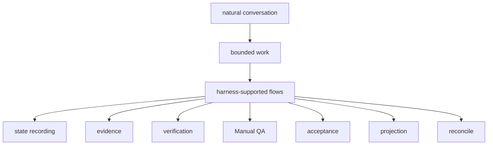

An integrated surface should help the agent:

- start with status or intake
- classify advisor, direct, or work mode
- shape work into scoped Change Units
- shape and update the Autonomy Boundary for what the agent may do without another user decision
- check design-quality policies when they apply
- call MCP tools for state changes
- respect `prepare_write` and returned Write Authorization before product writes
- show the Write Authority Summary separately from Autonomy Boundary
- request or show Decision Packets for blocking product judgment
- record runs, artifacts, evidence, user decisions, QA, and acceptance
- distinguish approval, product decision, QA waiver, verification waiver, residual-risk acceptance, and final acceptance
- make known close-relevant residual risk visible before any successful close
- launch or package detached verification
- refresh or reconcile projections

## Common Integration Structure

```text
user conversation surface
  -> short always-on rules/context
  -> harness skill, command, or playbook
  -> harness MCP server
  -> harness Core
  -> adapter, hook, sidecar, validator, or isolation layer
```

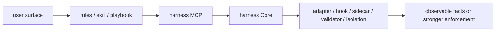

### Always-On Rules

Always-on rules should be short. They should tell the agent when to use the harness, where to read status or the Journey Card, and that product writes require `prepare_write`.

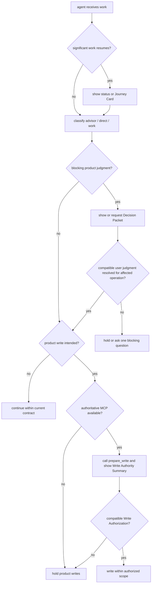

Always-on rules should also preserve user agency:

- show the current Journey Card before significant work resumes
- do not ask for broad approval when a Decision Packet is required
- ask one blocking question at a time, with a recommendation and uncertainty when available
- allow AFK implementation only when active Change Unit scope, Autonomy Boundary latitude, any granted sensitive approval, and compatible `prepare_write` / Write Authorization before actual product writes all apply
- treat the Autonomy Boundary as judgment latitude, not write authority
- show the Write Authority Summary when work is about to write
- hold product writes if authoritative MCP is unavailable
- keep planning direction, product trade-offs, QA waiver, verification risk acceptance, and final acceptance human-held

Write Authority Summary displays the current write boundary from the active scoped Change Unit's scope, `prepare_write`, approval, allowed paths/tools/commands/network/secrets, and compatible Decision Packet refs that remove product-judgment blockers. Decision Packets do not authorize writes by themselves. The Autonomy Boundary only says what judgment the agent may exercise without another user decision.

They should not contain full state transition tables, MCP schemas, full templates, long design playbooks, or all historical project context.

### Skill Or Playbook Layer

The skill/playbook layer teaches procedure:

- when to call status, intake, and next
- how to use `recommended_playbooks` from status/next as optional stage-router guidance
- how to classify advisor/direct/work
- how to ask shaping questions
- how to form a Change Unit
- how to shape or update the Autonomy Boundary
- how to request or show Decision Packets for blocking product judgment
- how to show the Write Authority Summary before writes and record the compatible Write Authorization with the run
- how to record user decisions
- how to distinguish approval, product decision, QA waiver, verification waiver, residual-risk acceptance, and final acceptance
- how to record TDD trace, evidence, Manual QA, and acceptance
- how to run the two review stages: Spec Compliance Review first, then Code Quality / Stewardship Review
- how to make known close-relevant residual risk visible before any successful close, require accepted Residual Risk refs for risk-accepted close, and record acceptance only after close-relevant residual risk is visible
- why work verification must be detached
- how to handle stale projection and reconcile

Stage routing may use recommended playbooks such as shared-design, product-review, eng-review, tdd-loop, spec-review, code-quality-review, qa-review, guard-check, release-handoff, or browser-qa-candidate. These recommendations live inside the skill/playbook layer. They are display guidance only: they do not mutate state, authorize writes, satisfy gates, create evidence, verify work, waive QA, accept risk, or close a Task. If a recommended playbook proposes product judgment, the surface should route to an existing Decision Packet or the normal Decision Packet request path.

Two-stage review procedure should keep the stages visibly separate:

1. Spec Compliance Review checks whether the requested work is complete under current Harness authority: acceptance criteria, Change Unit completion conditions, scope/write authority compatibility, Decision Packet compatibility, evidence coverage, and residual-risk visibility.
2. Code Quality / Stewardship Review checks whether the implementation is maintainable: domain language, module/interface boundary, vertical slice shape, feedback loop or TDD trace, codebase stewardship, context hygiene, and follow-up risk.

Findings from either stage should route to validator results, evidence gaps, Decision Packet candidates, Change Unit update recommendations, residual-risk candidates, or close blockers. Same-session review may be useful self-checking, but it is not detached verification and must not display `assurance_level=detached_verified`; detached verification still needs a valid independence boundary and Eval path.

Core and validators enforce policy. The skill is guidance, not authority.

### MCP Layer

MCP is the preferred state boundary. Public tool names and schemas are owned by the MCP API document. Integration docs may reference tool intent, but connectors must use the schemas from `05-mcp-api-and-schemas.md`.

### Adapter, Hook, Sidecar, Validator, Isolation

Adapters and sidecars translate surface behavior into observable facts or stronger enforcement:

- artifact capture
- command output capture
- changed-path detection
- generated file drift detection
- projection freshness detection
- approval and scope guard support
- same-session verification guard support
- evaluator read-only or fresh-context support
- Manual QA capture support

These layers can improve guarantee level, but they do not create a kernel capability gate.

## Capability Tiers

| Tier | Meaning | Typical capability |
|---|---|---|
| `T0 Context` | Surface can read harness principles | rules/context file |
| `T1 Skill` | Surface can follow a harness procedure | skill, command, prompt, playbook |
| `T2 MCP` | Surface can call harness tools and resources | MCP server connection |
| `T3 Capture` | Surface can return diffs, logs, and run output reliably | structured output, wrapper, adapter |
| `T4 Guard` | Surface can block or interrupt out-of-scope files, commands, network, or secrets before execution | hook, permission system, policy engine, sidecar |
| `T5 Isolation` | Surface can run verification or risky work in a separate boundary | worktree, sandbox, fresh process, isolated runner |
| `T6 QA Capture` | Surface can structure browser, screenshot, walkthrough, or Manual QA artifacts | browser runner, screenshot capture, QA note capture |

Normal interactive harness use is most natural at `T2` or higher. Reliable detached verification usually needs `T3` capture plus a real independence boundary. High-risk work should use `T4` guard or `T5` isolation when available. `T6` improves UI/UX evidence but is not required for MVP when a human QA note can be recorded.

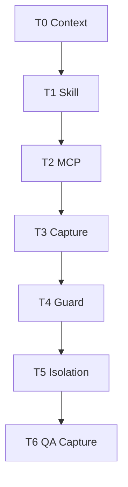

## Capability Profile

Harness connectors must use a capability profile rather than assuming behavior from a product or surface name.

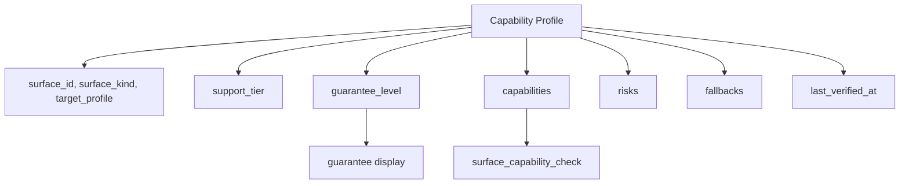

```yaml
surface_id: SURF-0001
surface_kind: generic_agent
target_profile: local_cli
detected_version: optional string
capability_profile_version: 1
last_verified_at: 2026-05-06T10:05:00+09:00
support_tier: T2
guarantee_level: cooperative
capabilities:
  project_rules: true
  skills_or_commands: true
  mcp_tools: true
  mcp_resources: true
  structured_output: false
  artifact_capture: manual
  hooks: false
  pre_tool_guard: false
  explicit_permissions: false
  changed_path_detection: validator
  fresh_verify: manual_bundle
  worktree_isolation: false
  local_sidecar: false
  browser_qa_capture: false
  screenshot_capture: false
risks:
  - no pre-tool guard
fallbacks:
  - cooperative prepare_write discipline
  - changed_paths validator
  - manual verification bundle
```

Target profile values may include:

- `local_cli`
- `ide_chat`
- `ide_agent`
- `cloud_agent`
- `extension`
- `custom_agent`
- `manual_bundle`

Capability profiles must be refreshed when version, MCP config, hooks, permissions, workspace policy, generated files, conformance result, capture method, or QA capture method changes.

## Guarantee Levels

Integration uses the guarantee levels defined in [04-runtime-architecture.md](04-runtime-architecture.md#guarantee-levels) and applies them to connected surface profiles, current enforcement paths, and fallback choices.

This document owns how connector profiles report and display those levels. It must not infer a stronger level from a surface name, and it must not treat guarantee level as approval, verification, QA, acceptance, or a kernel gate.

## Guarantee Display Requirements

Every status or `prepare_write` result that relies on surface behavior should expose the actual guarantee level. Display the level as a property of the connected profile and current enforcement path, not as a promise inferred from a surface name.

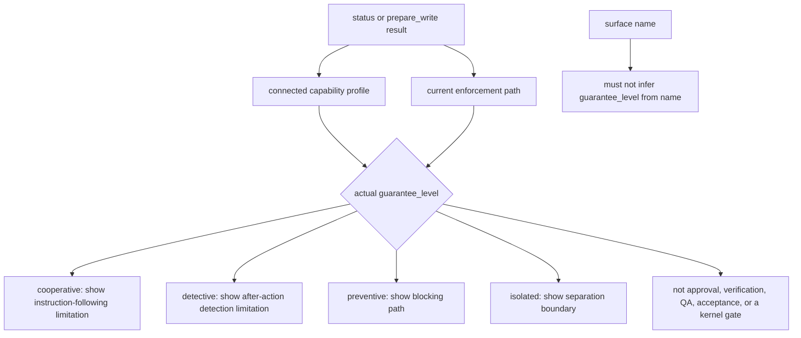

User-visible examples:

| Level | Example display text |
|---|---|
| `cooperative` | "This surface is expected to follow Harness decisions, but Harness may not physically block an out-of-scope write before it happens. Changed-path validation can detect violations afterward." |
| `detective` | "Harness can observe changed paths or artifacts after action and mark scope/evidence/projection stale or blocked." |
| `preventive` | "A hook, wrapper, permission layer, or sidecar can block a violating write before execution." |
| `isolated` | "Risky work or verification runs in a separate worktree, sandbox, process, or equivalent boundary." |

Rules:

- Do not imply cooperative means preventive.
- Do not imply a surface name guarantees a level.
- Guarantee level is not approval, verification, QA, acceptance, or a kernel gate.

## Generated Manifest Concept

Connectors may generate rules, skills, MCP config snippets, prompts, or local adapter files. Every generated or managed path must be recorded in a connector manifest.

Manifest responsibilities:

- name generated paths
- record managed block hashes
- record capability profile used when generated
- record surface target profile
- record creation and update times
- detect drift before overwriting human edits
- route drift to reconcile when needed

The manifest concept is common. Surface-specific generated filenames belong in Appendix B.

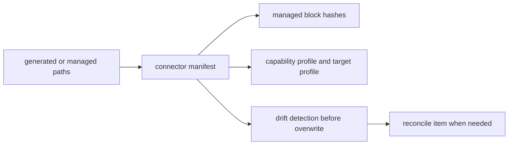

## Push And Pull Context

Implementation agents should receive small current context and pull larger references only when needed.

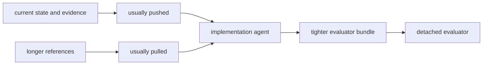

Usually push:

- Journey Card
- active Decision Packet summary
- Autonomy Boundary summary
- Write Authority Summary
- active scoped Change Unit
- acceptance criteria snapshot
- approval status
- latest evidence manifest/run refs
- residual risk summary when close or acceptance is near

Usually pull:

- older PRDs
- old designs
- closed issues
- long logs
- module maps
- interface contracts
- domain language
- coding standards
- TDD guidance

Evaluators should receive a tighter verification bundle that includes:

- acceptance criteria
- changed files
- approval scope
- Decision Packets relevant to the work, including resolved, pending, or close-relevant packets
- residual risk summary
- Autonomy Boundary
- deferred decisions and follow-up constraints
- codebase stewardship refs, including relevant domain, module, and interface records
- evidence manifest
- TDD trace if required
- Manual QA requirement
- artifact refs
- forbidden patterns

This context model supports the Context Hygiene policy: current state and evidence are preferred over stale chat or old docs.

## Direct Fast Path

For small direct work, the agent should keep Harness mostly invisible: define a narrow active scope, call `prepare_write`, make the change, record changed paths, self-check evidence, and close if no blocker appears.

If scope, risk, uncertainty, or file spread grows, escalate the same Task to `work` instead of turning direct mode into broad autonomy.

## Fallback Semantics

Fallbacks are described by guarantee level and risk, not by surface name.

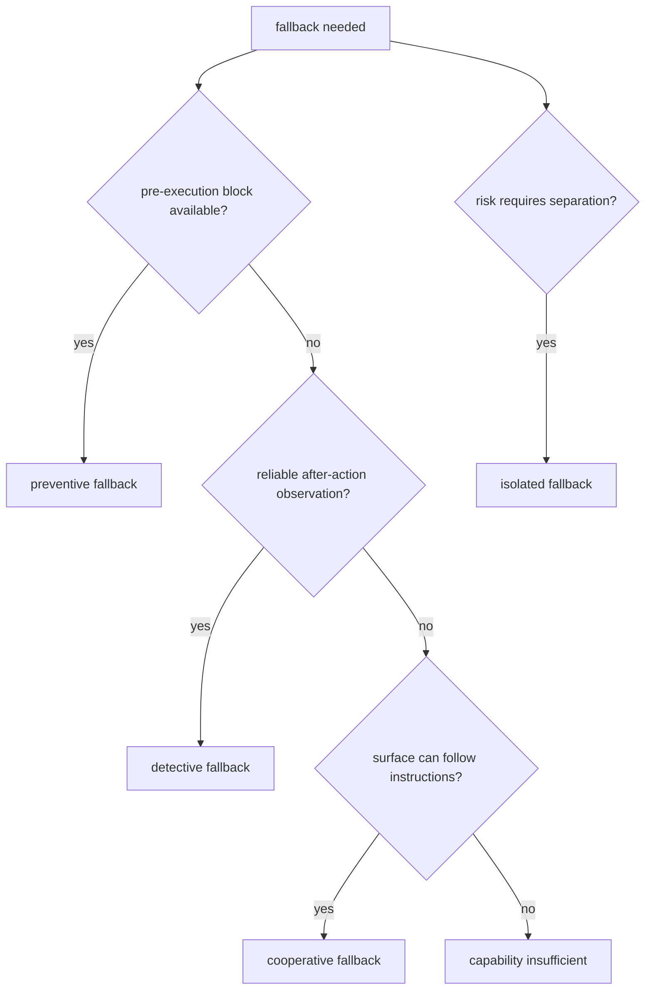

### Cooperative Fallback

Use when the surface can follow instructions but cannot enforce them. The connector tells the agent to call `prepare_write`, hold on blocked decisions, and record runs. Product writes must be paused if authoritative MCP is unavailable or the write scope cannot be checked.

### Detective Fallback

Use when the harness can observe changed files, logs, projection drift, or artifact gaps after the action. Validators may mark state stale, partial, blocked, or failed and require repair, reconcile, or fresh verification.

### Preventive Fallback

Use when a hook, permission layer, wrapper, policy engine, or sidecar can block a violating edit, command, network call, or secret access before it happens.

### Isolated Fallback

Use when risk requires separation. The connector launches work or verification in a separate worktree, sandbox, process, or manual evaluator bundle. This is the preferred fallback for detached verification when same-session review would not qualify.

### MCP Unavailable

If MCP is unavailable, the connector must not claim authoritative state updates. `MCP_SERVER_UNAVAILABLE` and `SURFACE_MCP_UNAVAILABLE` are diagnostic conditions, not additional public `ErrorCode` values. When either condition is surfaced through `ToolError`, use the API-owned error selection and details shape: `MCP_UNAVAILABLE` remains the stable public availability code, while surface-side availability or capability cases may use `MCP_UNAVAILABLE` or `CAPABILITY_INSUFFICIENT` with `details.mcp_unavailable_kind` according to context. `MCP_SERVER_UNAVAILABLE` means the tool call cannot reach Core, so no authoritative Core response is possible; the caller must reconnect or diagnose before claiming state changes. `SURFACE_MCP_UNAVAILABLE` means Core or an operator can observe that the connected surface lacks usable MCP, has stale MCP configuration, or cannot call required MCP tools. For product/runtime/code writes, the safe behavior is to hold the write and direct the user/operator to reconnect or diagnose MCP. Stronger profiles may also enforce a preventive block.

A pre-MVP Harness documentation-authoring batch may proceed only under an explicit `DOCS_AUTHORING_OVERRIDE` with an exact path allowlist. The connector must label this as a documentation-maintainer override, not Core authorization, Write Authorization, evidence, verification, QA, acceptance, residual-risk acceptance, close, or a canonical state transition. Product/runtime/code writes still hold when authoritative MCP is unavailable.

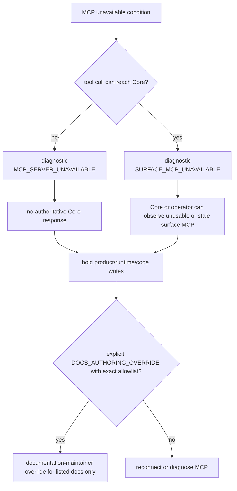

### Weak Guard

If MCP works but pre-tool guard is weak, low-risk direct work may proceed with cooperative `prepare_write` and detective changed-path validation. Medium/high-risk work should require stricter validation, sidecar guard, explicit approval, detached verification, or isolation.

### Projection Stale

Projection staleness is reported separately from state. A connector may continue from canonical state if it can read state directly, but actions that depend on the Markdown projection should refresh or reconcile first.

### Capability Insufficient

The connector should name the missing capability, not the product name. Example:

```text
The connected profile does not provide pre-tool guard. This work needs sidecar guard, another profile, or a smaller active scoped Change Unit.
```

## Reference Surface Contract

The MVP targets one reference surface. The reference surface should demonstrate the kernel rather than broad ecosystem support.

Minimum reference expectations:

- `T2 MCP` available for public tools and resources
- cooperative `prepare_write` before product writes
- detective changed-path and artifact validation after runs
- run summary and artifact capture sufficient for evidence manifests
- manual verification bundle or fresh evaluator instructions
- Manual QA note artifact support
- connector manifest for generated files
- conformance smoke covering common state and fallback paths

Reference surface behavior details and product-specific setup belong in Appendix B only when they name a concrete surface.

## Connector Conformance Overview

Connector conformance should prove that a profile can uphold the common contract at its declared capability tier.

Overview scenarios:

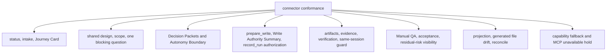

- status with and without an active Task
- current Journey Card shown before significant work resumes as required
- intake classification into advisor/direct/work
- work shaping with shared design and decisions
- Change Unit scope and vertical/horizontal exception handling
- one blocking question with recommendation and uncertainty when available
- Decision Packet shown instead of broad approval for blocking product judgment
- Autonomy Boundary breach stops or routes to Decision Packet
- AFK work remains covered by active Change Unit scope, Autonomy Boundary latitude, any granted sensitive approval that applies, and compatible `prepare_write` / Write Authorization before actual product writes
- `prepare_write` allowed and blocked paths
- Write Authorization created for allowed writes and exposed through Write Authority Summary
- write-capable `record_run` consumes a compatible Write Authorization
- sensitive approval request, granted, denied, and expired paths
- `record_run` with artifacts and evidence update
- direct result projection
- verification launch or manual verification bundle
- same-session verification guard
- Manual QA required, passed, failed, and waived
- QA waiver with product/user risk routes through Decision Packet
- acceptance required and recorded
- acceptance focus includes residual risk visibility before acceptance is requested
- Known close-relevant residual risk must be visible before any successful close
- Risk-accepted close additionally requires accepted Residual Risk refs
- Acceptance, when required, can be recorded only after close-relevant residual risk is visible
- stale projection and reconcile flow
- generated file drift detection
- capability fallback when a required tier is missing
- MCP unavailable product-write hold

Exact fixture format and operational commands are owned by operations and conformance docs.
