# User Guide

## Document Role

This document explains how users talk to the agent, how to read state, and which judgments to make at which points.

It does not cover implementation internals or installation details.

## 5-Minute Path

If you only want to run one task under Harness, start with one phrase:

```text
Run this work under the harness.
```

Expect the agent to first answer three everyday questions, preferably in a compact status or Journey Card:

- What is the scope: what is included, and what is out of bounds?
- What evidence exists: what changed, if anything, what was checked, and what is still missing?
- What judgment is needed now: choose a direction, approve a sensitive step, inspect QA, accept shown residual risk, or accept the result when acceptance is required?

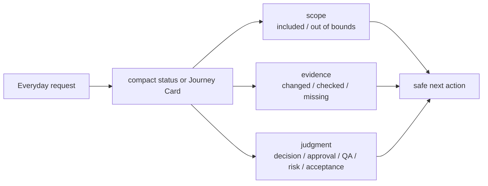

Only when one of those answers matters should the agent use the deeper labels: Decision Packet, Write Authority, Autonomy Boundary, Manual QA, acceptance, residual risk, approval, evidence, or verification.

Most of the time, you only decide a few things:

- whether the scope matches what you want
- which product direction or trade-off to choose when a Decision Packet appears
- whether a sensitive change is approved
- whether Manual QA is needed, completed/passed, or validly waived
- whether shown residual risk is acceptable before close or before final acceptance when acceptance is required

When blocked, ask for the smallest next unblocker:

```text
What is blocking this task now, and what one decision or check would unblock it?
```

Near close, check that the result matches scope, evidence is not required or covers the acceptance criteria, verification is not required, passed, or explicitly waived with recorded risk, Manual QA is not required, passed/completed, or validly waived, close-relevant residual risk has been shown or the agent reports `ResidualRiskSummary.status=none`, and any final acceptance request is separate from approval.

Use the rest of this guide as deeper reference when the task stops on a specific gate or judgment.

## Phrase Reference

Everyday work starts as a conversation, not as a command.

```text
Run this work under the harness.
```

This means: check state, shape the scope, confirm allowed boundaries before writing, and proceed while recording relevant evidence, checks, and user judgment when they apply.

Common phrases:

```text
Show me the status.
Continue this work. Check harness state first.
Show me the Journey Card before resuming.
Start with the scope and questions.
If this is small, handle it as direct; if it grows, move it to work.
Show the Decision Packet with options, recommendation, and uncertainty.
Use the product-review lens for trade-offs; use eng-review, design-review, security-review, qa-review, or release-handoff when that review is the useful next step.
Approved. The scope is only what you just described.
Proceed AFK only when active Change Unit scope and Autonomy Boundary latitude both apply; sensitive categories still need granted approval, and actual product writes still need a compatible `prepare_write` Write Authorization.
Start detached verify.
Decide whether Manual QA is needed.
Show close-relevant residual risk before I accept.
Generate a release handoff for the PR and deploy review.
Accepted. Close this task after final acceptance is requested.
Final acceptance is not required here; close once applicable blockers are clear.
Freeze this task to the current Change Unit and do not expand scope without a Decision Packet.
Freeze this task to docs/en/09-agent-integration.md and docs/ko/09-agent-integration.md.
Show the current guard level and what it can actually prevent.
Use careful mode for this change: narrow scope, show write authority before writes, and ask before product trade-offs.
```

## Basic Flow

The normal path should feel like a short conversation, not a work-management system. Users usually see a compact status card, the next safe action, and sometimes optional recommended playbooks, not every internal record.

1. Check status or intake.
2. Classify as `advisor`, `direct`, or `work`.
3. Confirm scope and the Change Unit.
4. If product judgment blocks progress, read and answer the Decision Packet.
5. Let optional recommended playbooks guide the procedure when useful.
6. Before writing, the agent or Harness checks `prepare_write`.
7. After any changes or advice, the agent records the relevant result and evidence when evidence applies.
8. When the task path calls for it, verify, record Manual QA, show close-relevant residual risk, and ask for acceptance.
9. Close.

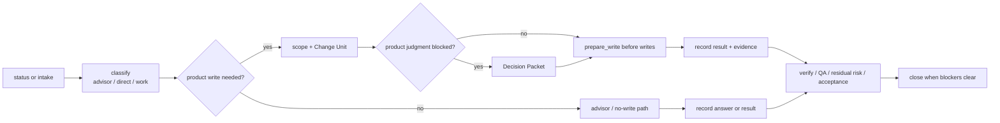

Many advisor or direct tasks skip some later checks. If final acceptance is not required, the status should say so or simply close after the applicable blockers are clear and residual risk has been shown or confirmed as none.

Gates should be explained as why the task cannot safely proceed or close yet. Evidence insufficiency should be shown by acceptance criterion, not as an abstract internal condition. If a cooperative guarantee is shown, explain plainly that the surface is expected to follow Harness decisions but may not physically block every violating write before it happens.

```text
Close blocked:
- AC-02 evidence missing
- Manual QA pending for UI copy
- Verification waived would close as risk accepted, not detached verified
```

## What You Usually Decide

Most sessions should reserve your attention for scope when it is not obvious, product or design trade-offs, sensitive approval, QA, shown residual risk, and final acceptance when the task path requires it.

You own the work direction and acceptable risk; you should not need to operate internal records by hand.

## What Harness Should Handle

Harness should handle state recording, `prepare_write` checks, artifact registration, evidence mapping, projection freshness, and close blockers.

Harness should translate your judgments into recorded state and clear blockers so you can stay focused on ownership, not bookkeeping.

Recommended playbooks are optional procedure hints. They can help the agent choose a review, TDD, QA, guard-check, release-handoff, browser-QA path, or role lens, but they are not approvals, write authority, evidence, verification, QA results, acceptance, or close.

## Using Freeze And Guard

Freeze and guard are plain-language safety controls. They are useful because they tell the agent how cautious to be, but their strength depends on the connected surface.

`Freeze` means "hold here" or "use a narrower posture." You can ask the agent to freeze a task to the current Change Unit, to specific paths, to read-only advice, or until the Journey Card is refreshed. A freeze can hold product writes, make the next action stricter, or cause `prepare_write` to block or hold when existing scope does not match the request. It does not authorize work or directly rewrite scope by itself; persistent changes to Change Unit scope, allowed paths, Autonomy Boundary, or AFK stop conditions still go through the normal Core state-changing path or Decision Packet route.

`Guard` means "show or use the available protection around this work." On a cooperative surface, the agent is instructed to stay inside the boundary. On a detective surface, Harness can detect changed-path, log, artifact, or projection violations after the fact. On a preventive surface, a hook, wrapper, permission layer, or sidecar can block covered violations before execution. On an isolated path, risky work or verification happens in a separate boundary.

`Careful mode` means stricter posture, not a new authority tier. Expect narrower scope, more explicit `prepare_write` checks, clearer evidence mapping, fresher status, and more one-question stops for user judgment.

Useful phrases:

```text
Freeze this task to the current Change Unit.
Freeze writes until I answer the Decision Packet.
Show current guard level and limitation.
Use the strongest available guard for this surface, and say whether it is cooperative, detective, preventive, or isolated.
Use careful mode, but do not treat it as approval or write authority.
```

## Using Role Lenses

A Role Lens asks the agent to review from a familiar posture such as product, engineering, design, security, QA, or release handoff.

```text
Use the security-review lens on this auth change.
Use release-handoff and show what is still blocking close.
```

The lens can recommend a Decision Packet, evidence, Manual QA, residual risk, validator route, release handoff input, or another playbook. It cannot approve anything, authorize writes, waive checks, accept risk, accept the result, upgrade assurance, or close the task by itself.

The TASK document may also show an Implementation Micro-Plan: a readable view of what the agent plans to do next in small steps. It is there to make execution easier to follow. You do not need to manage it by hand, and it does not authorize writes; active Change Unit scope and `prepare_write` still control product writes.

When TDD is required, expect the agent to name the feedback loop and RED target before implementation, write or run the failing RED check, then implement until the GREEN check passes. A plan for the RED check helps the agent create the test, but it is not RED evidence by itself. If the agent needs to skip TDD, Harness should record why and what alternate feedback loop will prove the behavior. A non-test implementation write may be blocked until actual RED evidence or that waiver exists.

If Harness or the connected surface cannot use MCP reliably, product/runtime/code changes should pause until the connection or surface setup is diagnosed. A documentation-only bootstrap override, when explicitly granted for exact paths, is not the same thing as Harness authorization.

## Generating Release Handoff

Ask for Release Handoff when you want a release-readiness report for an external PR, review, deploy, rollback, or monitoring process.

```text
Generate a release handoff for this task.
Use release-handoff and include PR and deploy checklist notes.
```

Expect a report with close readiness, blockers, evidence refs, verification refs, Manual QA refs, residual-risk refs, changed files, projection freshness, redaction notes, and suggested checklist items. The report can help you prepare the external review or deployment, but Harness still does not merge, deploy, monitor production, approve, waive QA or verification, satisfy gates, accept residual risk, accept the result, upgrade assurance, or close the task from the handoff alone.

Future context indexes or local metrics may make status and handoff reports easier to inspect. Treat them as pointers and diagnostics only; current state, evidence, gates, decisions, QA, verification, risk acceptance, and close still come from Harness state and the normal Core flows.

## Reading A Status Card

A good harness session first shows a short status card. When significant work resumes, that card should be the Journey Card or an equivalent current-position view.

```text
TASK-0044 Add email login flow
Mode: work
State: shaping
Next action: decide failed-login UX
Scope: login form, login API call, session storage
Decision Gate: pending
Decision Packet: DEC-0012 failed-login UX
Autonomy Boundary: may implement agreed login flow details only
Write Authority: not yet requested
Recommended playbooks: product-review, guard-check
Approval: dependency_change required
Evidence: none
Verification: not started
Manual QA: pending
Acceptance: pending
Residual risk: none recorded
Projection: current
```

Look for these things.

- Does the request match the scope?
- What Decision Packet, if any, do I need to answer?
- What may the agent do inside the Autonomy Boundary?
- Is Write Authority not yet requested, blocked, or allowed for the intended write?
- Are any recommended playbooks useful for the next safe action?
- Does the Implementation Micro-Plan, if shown, match the next small step you expect?
- What remains among approval, evidence, verification, Manual QA, residual risk, and acceptance?
- Is the next action safe to proceed with?

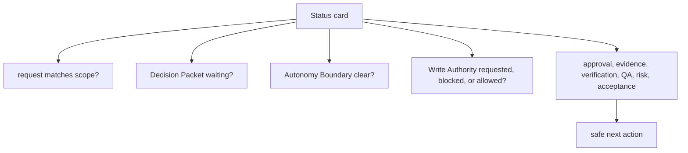

If the status looks wrong, say:

```text
Show the current status and next action again from state.
```

## Following The Journey Card

The Journey Card tells you where the work is right now. Use it before resuming, after long pauses, and near close.

Look for these lines:

- `Next action`: what the agent thinks is safe to do next
- `Decision Packet`: whether a product judgment is waiting for you
- `Autonomy Boundary`: what the agent may do without another question
- `Write Authority`: whether a specific `prepare_write` authorization exists for the intended write; it is separate from Autonomy Boundary
- `Evidence`, `Verification`, and `Manual QA`: what has been checked
- `Residual risk`: what uncertainty or trade-off remains
- `Projection`: whether the readable view is current enough to trust

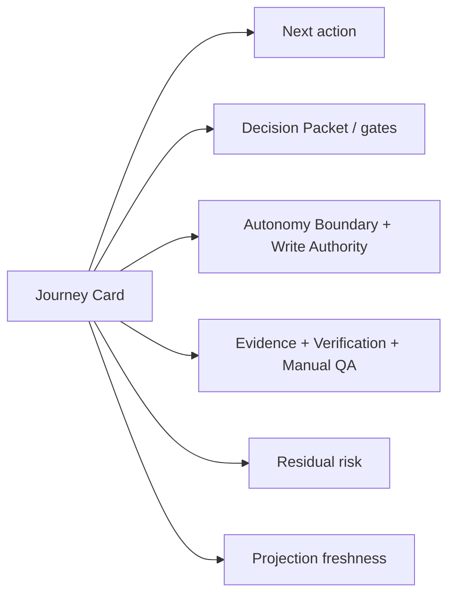

Useful phrases:

```text
Pause there. Show the Decision Packet first.
That next action is fine. Continue inside that boundary.
Refresh the Journey Card after this run.
```

When a write is already authorized, the line should stay specific:

```text
Write Authority: WA-0017 allowed for src/auth/login.ts and tests/auth/login.test.ts
Guarantee: cooperative; changed-path validation detects violations after the fact
```

## Reading A Decision Packet

Start from the user question: "Given this context, do I choose this direction, defer it, or ask for a smaller Change Unit?"

A Decision Packet is used when the work needs human judgment before it can safely proceed, close, waive QA, accept verification risk, or accept remaining risk. It is not a request for broad approval.

Read it in this order:

- Why is this decision needed now?
- What exactly am I deciding?
- What are the options and trade-offs?
- What does the agent recommend, and how uncertain is it?
- What may the agent decide without me?
- What happens if I defer?
- What residual risk or follow-up would remain?

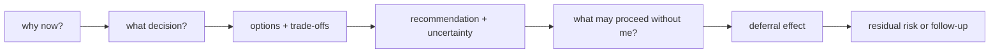

Good answers are specific:

```text
Choose Option A. Keep the failed-login message generic and record the security trade-off.
Defer this decision until after the smoke test. Record the follow-up risk.
I do not accept this trade-off. Propose a smaller Change Unit.
```

## advisor, direct, work

`advisor` is for reading, explaining, comparing, and reviewing. It does not write product files.

```text
Explain this module's role.
Summarize the trade-offs of this design choice.
```

`direct` handles small, low-risk changes quickly. Direct still needs an active scoped Change Unit before writing product files, and its default assurance is `self_checked`.

```text
Fix the typo on the profile save button. If it is small, handle it as direct.
```

`work` is for feature additions, structural changes, risky fixes, or multi-file work that needs scope shaping, evidence, and independent verification.

```text
Add the email login flow. Run it under the harness.
```

If the work starts small but grows, the agent should say that it is moving the same Task to `work`.

## Small Direct Work Should Stay Light

For small obvious work, Harness should define narrow scope as an active Change Unit, check write permission with `prepare_write`, record changed paths and self-check evidence, and close when no blockers appear.

If the work grows, the same Task should move to `work` and show scope, decisions, evidence, and risk instead of turning direct mode into silent broad autonomy.

## User Judgments

Product judgment, approval, assurance, Manual QA, residual-risk acceptance, and final acceptance answer different questions.

| Judgment | Question it answers | It cannot replace |
|---|---|---|
| Product judgment / Decision Packet | Which product direction, trade-off, waiver, or close-relevant decision should be taken? | approval, implementation, verification, QA, acceptance |
| Approval | May this sensitive change proceed? | product judgment, verification, QA, acceptance |
| Assurance | How far was this technically checked? | approval, QA, acceptance |
| Manual QA | Did a human inspect the actual experience quality? | verification, acceptance |
| Residual-risk acceptance | Does the user accept a known remaining risk or limitation? | approval, evidence, verification, Manual QA, final acceptance |
| Final acceptance | Does the user accept the result and remaining trade-offs? | approval, evidence, verification, Manual QA, residual-risk acceptance |

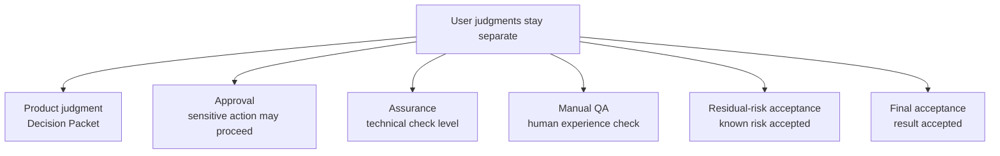

Examples that need approval include dependency additions, auth/permission changes, data model changes, public API changes, destructive writes, secret access, and production config changes. Approval does not mean correctness or acceptance.

When approval itself needs your judgment, Harness may show it as an approval-shaped Decision Packet. In that case you are deciding whether the sensitive scope is allowed. That answer does not pick a product option, waive QA or verification, accept residual risk, or let the agent edit without the write check passing afterward.

Product judgment should appear as a Decision Packet when it blocks progress. That packet should show options, trade-offs, recommendation, uncertainty, and what happens if the decision is deferred.

Assurance usually appears as `none`, `self_checked`, or `detached_verified`. `detached_verified` means the result passed a separate verification boundary, not a same-session self-review.

The user may accept verification risk and close the task, but that is a risk-accepted close, not `detached_verified`. Residual-risk acceptance can make a known risk acceptable for close, but it does not replace approval, evidence, verification, Manual QA, or final acceptance.

## What The Agent May Do AFK

AFK implementation means the agent may continue while you are away. It is allowed only when active Change Unit scope, Autonomy Boundary latitude, and granted sensitive approval where applicable all apply. Actual product writes also require a compatible `prepare_write` / Write Authorization before writing.

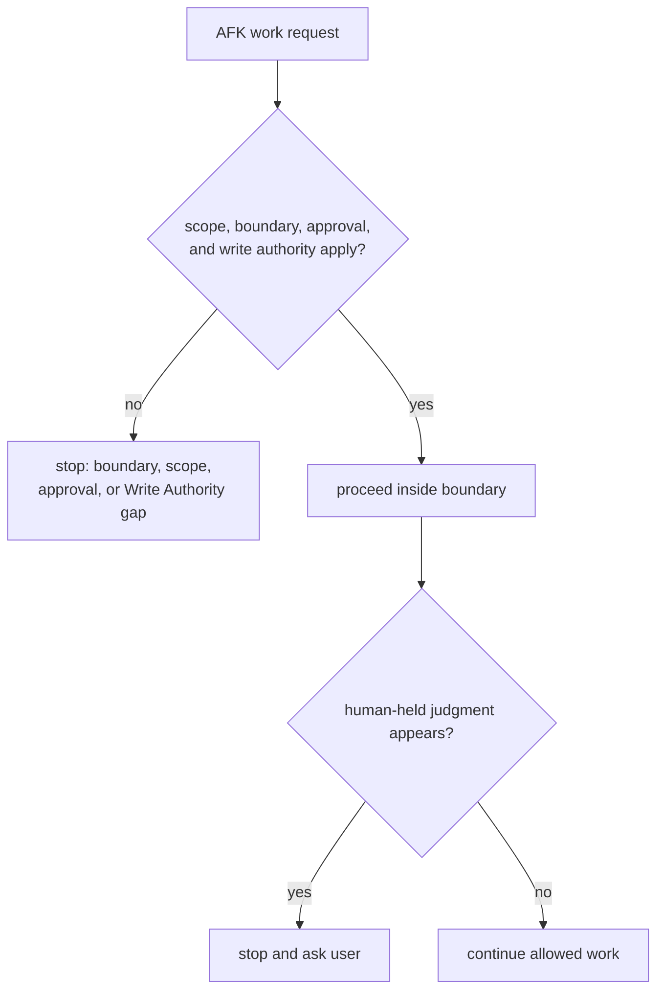

The Autonomy Boundary is not a scope grant or write permission. The agent still needs `prepare_write`, active Change Unit scope, allowed paths, allowed tools, allowed commands, network targets, secret access, and sensitive approval where applicable.

The agent may usually implement agreed details, run allowed checks, collect evidence, update summaries, and stop with a clear blocker.

The agent must stop for human-held judgment:

- planning direction
- product trade-offs
- scope expansion
- sensitive-change approval
- QA waiver
- verification risk acceptance
- final acceptance

Useful phrase:

```text
Proceed AFK inside this boundary. Stop for product trade-offs, QA waiver, verification risk, or acceptance.
```

## Missing Evidence

Evidence is not a statement that something was done. It is a record that supports acceptance criteria.

```text
Evidence: partial
Close blocked: AC-02 supporting evidence missing
```

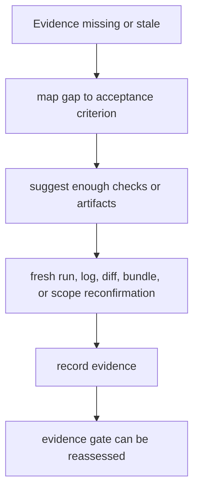

Say:

```text
Show which acceptance criteria are missing evidence, and suggest what additional checks would be enough.
```

If evidence is stale, the work may need a fresh run, fresh logs, a fresh diff, a fresh verification bundle, or scope reconfirmation.

## Reading Review Stages

Harness may show review in two stages. Spec Compliance Review asks whether the requested thing is actually complete: acceptance criteria, Change Unit completion conditions, write authority compatibility, decisions, evidence, and visible residual risk. Code Quality / Stewardship Review asks whether the implementation is maintainable: domain language, module/interface boundaries, slice shape, feedback loop or TDD, codebase stewardship, context hygiene, and follow-up risk.

These review stages can point to validator results, missing evidence, Decision Packets, Change Unit updates, residual risk, or close blockers. They are not detached verification. A passed same-session review is useful, but it does not make the task `detached_verified`.

## Verify

Work does not become `detached_verified` from the implementer's self-report alone.

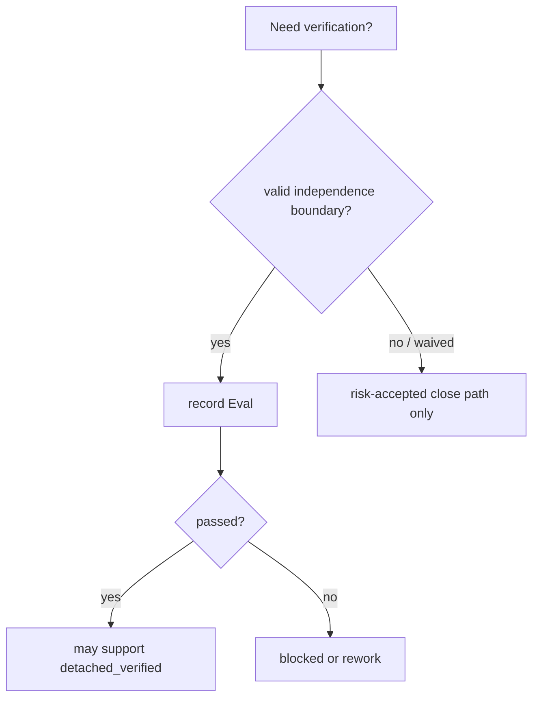

```text
Start detached verify.
```

When verification passes, the agent should summarize what was checked, why the verification boundary counts as independent, and whether any blockers remain.

If you need to close without verification now, say:

```text
Accept the verification risk and close. Record the remaining risk.
```

In that case, the task can close successfully, but assurance is not displayed as `detached_verified`.

## Accepting Residual Risk

Residual risk is known remaining uncertainty, limitation, unchecked condition, or trade-off. Before final acceptance or a risk-accepted close, the agent should show the close-relevant residual risk in plain language. If there is no known close-relevant residual risk, the agent should say so with `ResidualRiskSummary.status=none`; that is different from known risk being hidden. A risk-accepted close still needs visible and accepted Residual Risk refs.

Accepting residual risk can allow close, but it does not replace approval, evidence, verification, Manual QA, or acceptance.

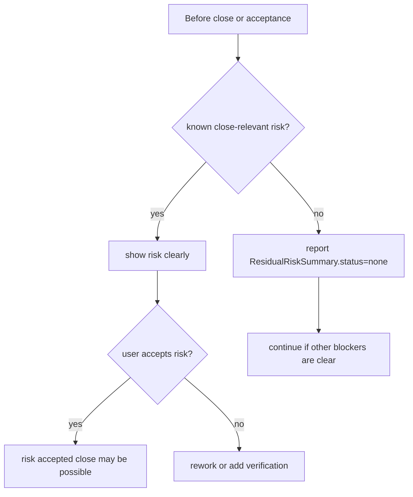

Useful phrases:

```text
Show close-relevant residual risk before acceptance.
I accept the residual risk shown here. Close with risk accepted.
I do not accept that risk. Rework or add verification.
```

## Manual QA

Manual QA is the user's judgment about qualities that a person needs to inspect, such as UX, workflow, copy, accessibility, and visual result.

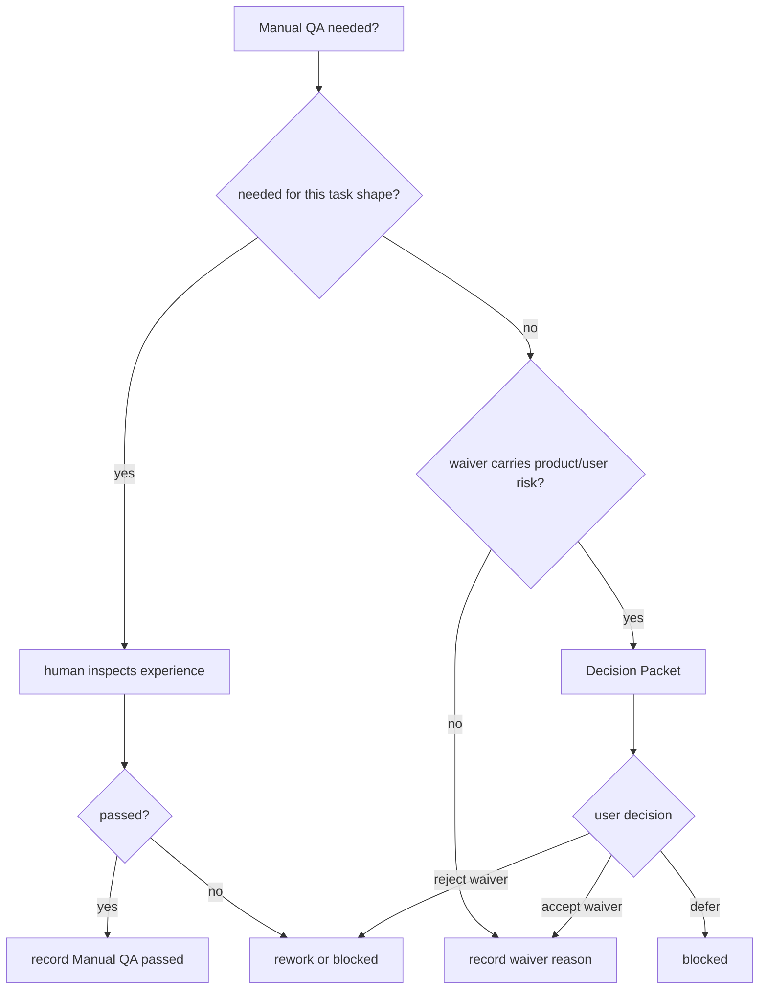

When a card says `Manual QA: pending`, that is the `qa_gate` display. It means the required QA has not yet produced a satisfying Manual QA record, not that there is a pending Manual QA record result.

```text
Decide whether Manual QA is needed.
```

If the Manual QA judgment is "not acceptable yet," the task does not close and returns to rework or blocked. If Manual QA is not useful for this task shape, record the waiver reason.

```text
Mark Manual QA waived for this internal CLI work. Reason: there is no user UI, and tests/logs are enough to verify it.
```

If skipping QA carries product or user risk, the waiver may require a Decision Packet; a waiver reason alone may not be enough.

```text
Show the QA waiver Decision Packet before I decide.
```

### Browser QA Capture

When a connected surface supports Browser QA Capture, the agent may offer a browser QA pass for Manual QA profiles such as `browser_smoke`, `workflow`, `ui_quality`, or `accessibility`. The capture can attach artifact refs to the Manual QA record, such as screenshots, `qa_capture` bundles, console logs, network traces, accessibility snapshots, or workflow recordings.

```text
Run browser QA capture for this checkout flow if the connected profile supports it. Attach the screenshot and console log to the Manual QA record.
```

Browser QA Capture is helpful evidence, not final acceptance. It does not replace human Manual QA judgment when taste, experience quality, accessibility interpretation, copy, or visual review needs a person. It also does not count as detached verification unless the verification path separately meets the independence requirements.

If the surface cannot capture the browser workflow, ask for a human Manual QA note and manually supplied artifacts instead.

## Acceptance

Acceptance is the final user judgment that says, "I accept this result." It appears only when the task path requires final acceptance.

When acceptance is required, the task does not close until the user accepts the result and remaining trade-offs after close-relevant residual risk has been shown or reported as none. Passing verification, completing Manual QA, granting approval, or accepting a specific residual risk does not by itself count as final acceptance.

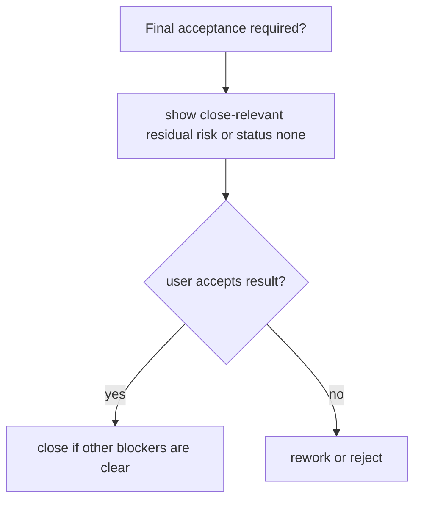

```text
Accepted. Close this task.
```

The user can also reject it.

```text
I do not accept it. Rework the session-expiration UX.
```

Acceptance is not approval, verification, Manual QA, or residual-risk acceptance.

## Resuming Work

Resume from harness state instead of searching through old chat.

```text
Show the active task status for this project.
Continue TASK-0044. Check harness state first.
```

When resuming, check two questions.

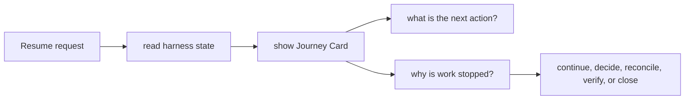

```text
What is the next action now?
Why is the work stopped now?
```

If you left notes in a document, say:

```text
Check the user notes in the TASK document and reconcile anything that should be reflected in state.
```

Documents are human-readable projections. If state and documents seem out of sync, check projection freshness and ask for a state-based summary.
