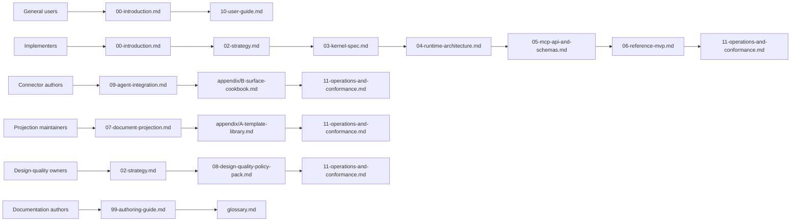
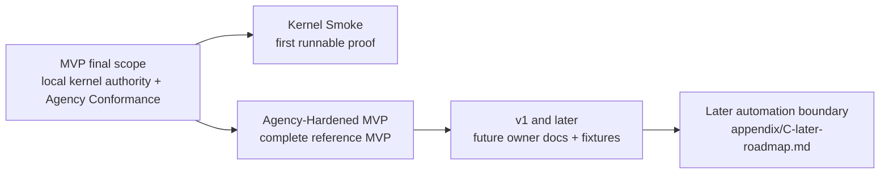
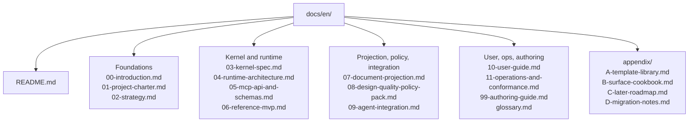
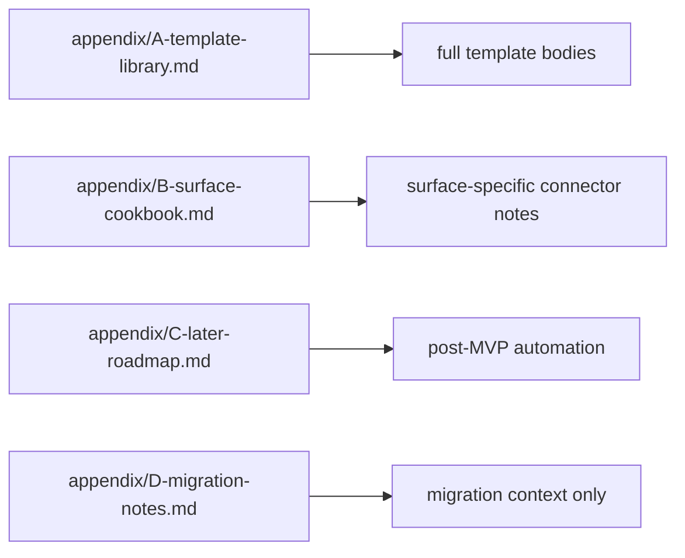

# Harness Documentation Set

Harness is an agency-preserving local operating kernel for AI-assisted development. It keeps the work journey followable while preserving the user's strategic judgment over goals, scope, design, trade-offs, codebase stewardship, QA, acceptance, and residual risk.

This file is `docs/en/README.md`, the entry point for the English harness documentation set. The repository root `README.md` is the repository landing page.

## Principle Groups

Strategic Invariants, Kernel Authority Invariants, and Design Stewardship Defaults are owned by [02-strategy.md](02-strategy.md#principle-groups). Kernel Authority Invariants are distinct from Design Stewardship Defaults.

## Reader Paths

This diagram shows the common entry paths at a glance; the lists below keep the exact reading order.



General users:

```text
00-introduction.md
-> 10-user-guide.md
```

Implementers:

```text
00-introduction.md
-> 02-strategy.md
-> 03-kernel-spec.md
-> 04-runtime-architecture.md
-> 05-mcp-api-and-schemas.md
-> 06-reference-mvp.md
-> 11-operations-and-conformance.md
```

Connector authors:

```text
09-agent-integration.md
-> appendix/B-surface-cookbook.md
-> 11-operations-and-conformance.md
```

Projection maintainers:

```text
07-document-projection.md
-> appendix/A-template-library.md
-> 11-operations-and-conformance.md
```

Design-quality owners:

```text
02-strategy.md
-> 08-design-quality-policy-pack.md
-> 11-operations-and-conformance.md
```

Documentation authors:

```text
99-authoring-guide.md
-> glossary.md
```

## MVP / v1 / Later

MVP is a small local operating kernel that validates Kernel Authority Invariants and Agency Conformance, not a platform that supports many agent surfaces at once.

This boundary map is explanatory; [06-reference-mvp.md](06-reference-mvp.md#staged-delivery-interpretation) owns the staged delivery contract, and [appendix/C-later-roadmap.md](appendix/C-later-roadmap.md) owns later automation.



MVP focuses on one reference surface, local state, artifacts, public MCP tools, write gating, evidence, verification, Manual QA, acceptance, projections, reconcile, recovery, export, and fixture-based conformance.

Read MVP delivery in two stages that map onto the existing MVP-0 through MVP-5 sequence without reducing final scope. The short contract for Kernel Smoke and Agency-Hardened MVP is in [06-reference-mvp.md](06-reference-mvp.md#staged-delivery-interpretation).

Later automation is cataloged in [appendix/C-later-roadmap.md](appendix/C-later-roadmap.md) and must not read as part of MVP scope.

## Target Tree

This English documentation set lives under `docs/en/`. The Korean documentation set under `docs/ko/` mirrors the same structure.



```text
docs/en/
  README.md
  00-introduction.md
  01-project-charter.md
  02-strategy.md
  03-kernel-spec.md
  04-runtime-architecture.md
  05-mcp-api-and-schemas.md
  06-reference-mvp.md
  07-document-projection.md
  08-design-quality-policy-pack.md
  09-agent-integration.md
  10-user-guide.md
  11-operations-and-conformance.md
  99-authoring-guide.md
  glossary.md

  appendix/
    A-template-library.md
    B-surface-cookbook.md
    C-later-roadmap.md
    D-migration-notes.md
```

## Main Documents

The table remains the precise owner list; this map groups the same documents by the kind of ownership they carry.

```mermaid
flowchart TD
  D00["00-introduction.md"] --> Mental["shared mental model"]
  D01["01-project-charter.md"] --> Charter["purpose, audience, values, scope"]
  D02["02-strategy.md"] --> Strategic["strategy, failure model, principle groups"]
  D03["03-kernel-spec.md"] --> KernelOwner["kernel entities, lifecycle, gates"]
  D04["04-runtime-architecture.md"] --> RuntimeOwner["three spaces and runtime architecture"]
  D05["05-mcp-api-and-schemas.md"] --> ApiOwner["MCP API, schemas, errors"]
  D06["06-reference-mvp.md"] --> MvpOwner["MVP plan, DDL, storage layout"]
  D07["07-document-projection.md"] --> ProjectionOwner["projection and managed areas"]
  D08["08-design-quality-policy-pack.md"] --> PolicyOwner["design-quality policy contracts"]
  D09["09-agent-integration.md"] --> IntegrationOwner["agent surface integration"]
  D10["10-user-guide.md"] --> UserOwner["user phrases, status, judgments"]
  D11["11-operations-and-conformance.md"] --> OpsOwner["operations and conformance"]
  D99["99-authoring-guide.md"] --> AuthorOwner["authoring rules"]
  DG["glossary.md"] --> GlossaryOwner["official terms"]
```



| Document | Owner role |
|---|---|
| [00-introduction.md](00-introduction.md) | shared mental model for users and implementers |
| [01-project-charter.md](01-project-charter.md) | project purpose, audience, values, scope, and non-goals |
| [02-strategy.md](02-strategy.md) | strategic thesis, failure model, principle groups, Design Stewardship Defaults |
| [03-kernel-spec.md](03-kernel-spec.md) | operating kernel, entities, lifecycle, gates, transitions, close semantics |
| [04-runtime-architecture.md](04-runtime-architecture.md) | three spaces, runtime home, Core, artifact, projection/reconcile architecture |
| [05-mcp-api-and-schemas.md](05-mcp-api-and-schemas.md) | MCP resources/tools, schemas, errors, validators, artifact refs |
| [06-reference-mvp.md](06-reference-mvp.md) | MVP implementation sequence, DDL, storage layout, validator skeleton |
| [07-document-projection.md](07-document-projection.md) | Markdown projection, managed/human-editable areas, template tiers |
| [08-design-quality-policy-pack.md](08-design-quality-policy-pack.md) | design-quality policies as policy contracts |
| [09-agent-integration.md](09-agent-integration.md) | agent surface integration and capability profile |
| [10-user-guide.md](10-user-guide.md) | user conversation phrases, status reading, judgments, resume |
| [11-operations-and-conformance.md](11-operations-and-conformance.md) | operator procedures, fixture-based conformance, and docs-maintenance smoke reporting |
| [99-authoring-guide.md](99-authoring-guide.md) | document ownership, authoring rules, and docs-maintenance conformance checklist |
| [glossary.md](glossary.md) | official terms |

## Appendices

Appendices hold expanded material without taking over the main owner contracts.



| Document | Owner role |
|---|---|
| [appendix/A-template-library.md](appendix/A-template-library.md) | full template library and expanded report variants |
| [appendix/B-surface-cookbook.md](appendix/B-surface-cookbook.md) | surface-specific connector notes and profile examples |
| [appendix/C-later-roadmap.md](appendix/C-later-roadmap.md) | later automation and post-MVP roadmap |
| [appendix/D-migration-notes.md](appendix/D-migration-notes.md) | migration context only; not an active canonical owner |
