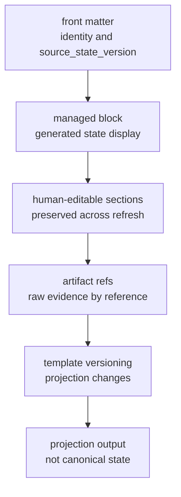
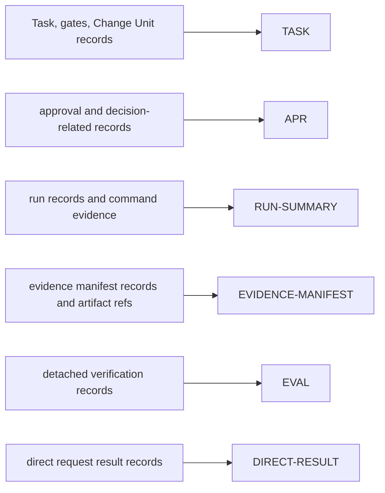
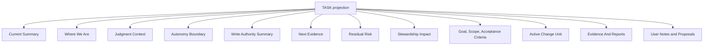
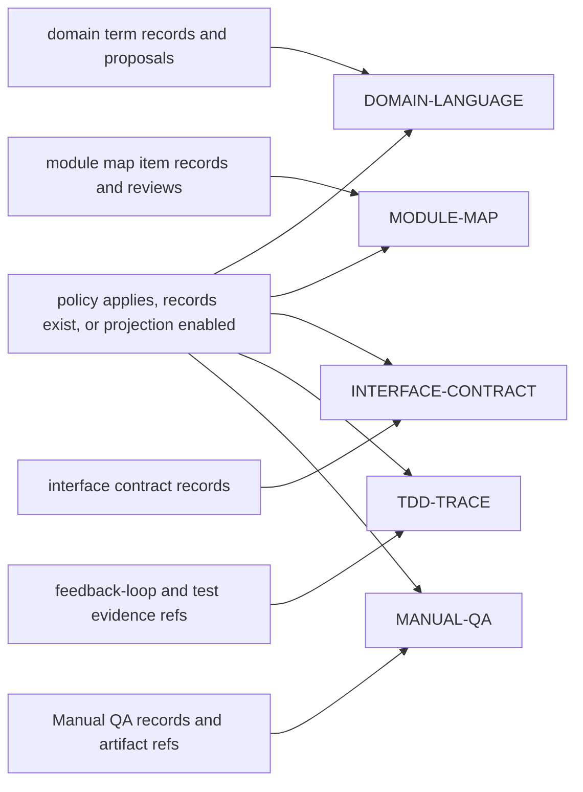
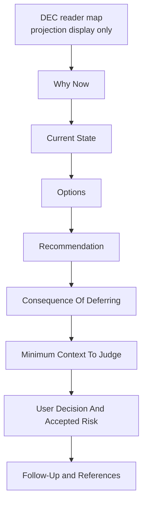
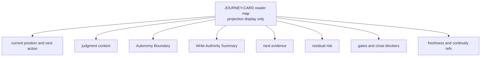

# Appendix A: Template Library

## Document Role

This appendix owns full Markdown projection template variants. The projection rules and template tiers are owned by `07-document-projection.md`; this appendix provides complete bodies that implement those rules. A template body appearing here does not by itself enable or require its `ProjectionKind`.

Templates are examples of rendered shape. They are not canonical state and must not redefine kernel fields, MCP schemas, or SQLite DDL.

## Template Rules

1. Keep front matter minimal: identity, task/project relation, projection version or status, `source_state_version`, and timestamp.
2. Keep generated state inside managed blocks.
3. Preserve human-editable sections across refreshes.
4. Link raw evidence by artifact ref.
5. Do not paste large logs, diffs, traces, bundles, screenshots, or secrets.
6. Keep approval, verification, Manual QA, and acceptance visibly separate.
7. Treat `qa_gate` as canonical even when a card says `Manual QA: pending/passed/failed/waived`.
8. Version template changes as projection changes.
9. Treat Decision Packet, Journey Card, Journey Spine, Autonomy Boundary, Write Authority Summary, displayed Write Authorization refs, Change Unit DAG, Residual Risk text, Stewardship Impact text, and `source_state_version` as projection output, not canonical state or the canonical Write Authorization record itself.



## Required MVP Templates

These bodies correspond to the MVP-required `ProjectionKind` tier: `TASK`, `APR`, `RUN-SUMMARY`, `EVIDENCE-MANIFEST`, `EVAL`, and `DIRECT-RESULT`.



### TASK



````md
---
doc_type: task
task_id: TASK-0001
display_state: executing
projection_version: 7
source_state_version: 42
updated_at: 2026-05-06T09:30:15+09:00
---

# TASK-0001 Task Title

<!-- HARNESS:BEGIN managed -->
## Current Summary
- mode:
- lifecycle phase:
- result:
- close reason:
- assurance:
- next action:
- pending decision:
- risk:
- scope gate:
- decision gate:
- approval gate:
- design gate:
- evidence gate:
- verification gate:
- Manual QA:
- acceptance gate:
- active change unit:
- write authority summary:
- latest report:
- projection freshness:

## Where We Are
- current position:
- active path:
- current blocker:
- latest meaningful evidence:
- next state transition:

## Judgment Context
- pending decision packets:
- what user is deciding:
- what agent may decide without user:
- recommendation:
- main trade-off:
- reversibility:
- uncertainty:
- minimum context to judge:
- affected gates:

## Autonomy Boundary
- profile:
- agent may do:
- user judgment required:
- AFK stop conditions:
- boundary status:

## Write Authority Summary
- active Change Unit:
- write authorization:
- allowed paths:
- allowed tools:
- allowed commands:
- allowed network targets:
- secret scope:
- sensitive categories:
- approval status:
- baseline:
- guarantee:
- note: Autonomy Boundary is judgment latitude, not write authority.

## Next Evidence
- next evidence action:
- evidence needed for:
- expected artifact refs:
- stale or missing evidence:

## Residual Risk
- close-relevant risk:
- visibility status:
- accepted residual-risk refs:
- follow-up required:
- close impact:

## Stewardship Impact
- summary shape: StewardshipImpactSummary
- domain_language_impact: none | updated | conflict | unresolved
- module_boundary_impact: none | local | public_boundary | unresolved
- interface_contract_impact: none | compatible | breaking | unresolved
- feedback_loop_status: defined | missing | waived
- future_change_risk: none | visible | accepted | unresolved
- close_impact: none | blocks_close | requires_decision | residual_risk
- refs:
  - domain term refs:
  - module map item refs:
  - interface contract refs:
  - feedback loop refs:
  - TDD trace refs when selected:
  - residual risk:
  - Decision Packets:

## Goal
-

## Scope
### In
-

### Out
-

## Acceptance Criteria
- [ ] AC-01:
- [ ] AC-02:

## Active Change Unit
| ID | Purpose | Status | Slice Type | TDD | Manual QA | Core Verification |
|---|---|---|---|---|---|---|
| CU-01 | | | vertical | required | pending | |

## Pending Decisions
-

## Evidence And Reports
- Evidence Manifest:
- Run Summary:
- Eval:
- Direct Result:
- TDD Trace:
- Manual QA:
- Approval:
- Decision:
- Diff:
- Logs:
<!-- HARNESS:END managed -->

## User Notes and Proposals
-
````

#### Expanded TASK Sections

Use these sections for long-running `work` tasks. Keep them managed unless explicitly marked human-editable.

````md
<!-- HARNESS:BEGIN managed -->
## Shared Design Concept
### Questions Resolved
| ID | Question | User Answer | Decision / Assumption |
|---|---|---|---|

### Remaining Ambiguity
- item / owner / stop condition:

## Domain Term Refs
- Terms in force:
  - Term:

## Module and Interface Refs
- module map item refs:
- interface contract refs:
- rendered projection refs, if shown: MODULE-MAP, INTERFACE-CONTRACT
- DESIGN:

## Change Unit Dependencies
| ID | blocked_by | unblocks | parallelizable_with | merge risk |
|---|---|---|---|---|

## Journey Spine
### Facts in Force
- fact / evidence ref:

### Assumptions in Force
- assumption / expiry condition:

### Decisions in Force
- DEC-0001:

### Domain Terms in Force
- term / meaning / code representation:

### Module / Interface Impacts
- module / impact / interface / test boundary:

### Rejected Options
- option / reason / DEC:

### Watchpoints
- regression:
- security/performance/operations:
- architecture drift:

### Resume Notes
- next session should know:
- current blocker:
<!-- HARNESS:END managed -->
````

#### Change Unit Block

This is a TASK sub-template, not a separate canonical projection tier.

````md
### CU-01 Title
- purpose:
- non-goals:
- slice type: vertical | enabling | cleanup | horizontal-exception
- horizontal exception reason:
- follow-up vertical CU:
- autonomy profile:
- agent may do:
  - implementation detail:
  - local refactor inside scope:
  - evidence collection:
- user judgment required:
  - product direction:
  - public interface or compatibility commitment:
  - residual risk acceptance:
- AFK stop conditions:
  - boundary exceeded:
  - evidence cannot be produced:
  - close-relevant risk discovered:
- end-to-end path:
  - trigger / input:
  - domain logic:
  - persistence:
  - API / caller boundary:
  - UI / observable output:
- allowed paths:
  - `src/...`
  - `tests/...`
- allowed tools:
  - read
  - edit
  - shell: `npm test -- ...`
- check profile:
  - changed_paths
  - approval_scope
  - evidence_sufficiency
- ValidatorResult IDs:
  - vertical_slice_shape
  - shared_design_alignment
  - decision_quality_check
  - autonomy_boundary_check
  - feedback_loop_check
  - tdd_trace_required
  - domain_language_consistency
  - module_interface_review
  - codebase_stewardship_check
  - residual_risk_visibility_check
  - manual_qa_required
- sensitive categories:
  - none
- TDD:
  - required: yes | no | recommended
  - red evidence:
  - green evidence:
  - non-TDD justification:
- Manual QA:
  - required: yes | no
  - profile: ui_quality | workflow | copy | accessibility | browser_smoke | none
- dependencies:
  - blocked_by:
  - unblocks:
  - parallelizable_with:
  - merge risk:
- completion conditions:
  - [ ]
- evaluator focus:
  - item:
````

### APR

````md
---
doc_type: approval
approval_id: APR-0001
task_id: TASK-0001
category: dependency_change
status: pending
source_state_version: 42
updated_at: 2026-05-06T09:30:15+09:00
---

# APR-0001 Approval Request

## Request Summary
- proposed action:

## Related Decision Packet
- approval-shaped Decision Packet:
- separate product-judgment Decision Packet, if required:
- decision gate impact:
- approval gate impact:

## Requested Scope
- sensitive categories:
- allowed paths:
- allowed tools:
- allowed commands:
- allowed network targets:
- required secrets:
- baseline ref:
- expected diff envelope:
- expires on scope drift:

## Why This Is Needed
- purpose:
- relation to current task:

## Impact
- code/docs:
- user/operations:
- security/privacy:
- cost/deployment:
- domain language:
- module/interface:

## Risks
- main risk:
- failure impact:
- scope drift condition:

## Alternatives
### Alternative A
- description:
- benefit:
- cost/risk:

### Alternative B
- description:
- benefit:
- cost/risk:

## Recommendation
- recommendation:
- reason:

## Decision
- status: pending | granted | denied | expired
- decision note:
- decided by:
- decided at:

## Boundary
- approval does not resolve product judgment, prove correctness, replace verification, replace Manual QA, imply acceptance, or accept residual risk.
- approval is not Write Authorization; a later compatible `prepare_write` retry must allow the write before implementation or direct `record_run` can consume authorization.
````

### RUN-SUMMARY

````md
---
doc_type: run_summary
run_id: RUN-20260506-093015-LEAD-01
task_id: TASK-0001
change_unit_id: CU-01
profile: lead
kind: implementation
surface_id: reference
source_state_version: 43
updated_at: 2026-05-06T09:45:10+09:00
---

# RUN-SUMMARY

## Run Identity
- run_id:
- actor kind:
- surface:
- baseline_ref:
- state_version:
- status:

## Scope
- task_id:
- change_unit_id:
- slice type:
- write authorization:
- allowed paths:
- allowed tools:
- allowed commands:
- allowed network targets:
- secret scope:
- sensitive categories:
- approval refs:

## Changed Files
- `path/to/file`

## Commands And Checks
```bash
npm test -- --runInBand
```

## Checks And Validator Outcomes
### Core Checks And Command Checks
- changed_paths:
- approval_scope:
- lint:
- test:
- build:
- evidence_sufficiency:

### ValidatorResult IDs
- vertical_slice_shape:
- shared_design_alignment:
- decision_quality_check:
- autonomy_boundary_check:
- feedback_loop_check:
- tdd_trace_required:
- domain_language_consistency:
- module_interface_review:
- codebase_stewardship_check:
- residual_risk_visibility_check:
- manual_qa_required:

## TDD Trace Summary
- required:
- red evidence:
- green evidence:
- refactor notes:
- trace ref:

## Key Changes
-

## Issues And Follow-Ups
-

## Journey Spine Updates
- new facts:
- rejected options:
- domain language update:
- module/interface update:
- watchpoint changes:
- next run should know:

## Evidence Refs
- evidence manifest:
- TDD trace:
- Manual QA:
- diff:
- logs:
- bundle:
- checkpoint:
````

### EVIDENCE-MANIFEST

````md
---
doc_type: evidence_manifest
evidence_manifest_id: EM-0001
task_id: TASK-0001
change_unit_id: CU-01
status: partial
source_state_version: 44
updated_at: 2026-05-06T09:50:00+09:00
---

# EM-0001 Evidence Manifest

## Identity
- task_id:
- change_unit_id:
- baseline_ref:
- run_summary:
- latest_eval:

## Summary
- evidence state:
- unsupported criteria:
- stale conditions:
- next evidence action:

## Acceptance Criteria Coverage
| AC ID | Statement | Status | Supporting Evidence | Notes |
|---|---|---|---|---|
| AC-01 | | supported | test:, tdd:, log:, diff: | |
| AC-02 | | unsupported | | |

## Changed File Coverage
| Path | Covered Criteria | Evidence Refs |
|---|---|---|
| `src/...` | AC-01 | DIFF-0001, LOG-0001 |

## Design Quality Coverage
| Item | Status | Evidence Refs | Notes |
|---|---|---|---|
| vertical_slice_shape | passed | CU-01 | |
| decision_quality_check | passed | DEC-0001 | |
| autonomy_boundary_check | passed | CU-01 | |
| feedback_loop_check | passed | FBL-0001, TDD-0001, LOG-0001 | |
| tdd_trace_required | passed | TDD-0001 | |
| module_interface_review | passed | module_map_item: MMI-0001, interface_contract: IFACE-0001, DEC-0001 | |
| codebase_stewardship_check | passed | domain_term: TERM-0001, module_map_item: MMI-0001, interface_contract: IFACE-0001, feedback_loop: FBL-0001 | |
| residual_risk_visibility_check | pending | RR-0001 | |
| manual_qa_required | pending | qa_gate; no satisfying Manual QA record yet | |

## Approval Refs
- APR-0001:

## Evidence Refs
- run summary:
- feedback loop:
- TDD trace:
- Manual QA:
- diff:
- logs:
- bundle:
- checkpoint:
- tests:
- build:

## Stale If
- baseline head changes
- changed files are modified after eval
- approval scope expires
- relevant config changes
- domain term records change
- interface contract records change
````

### EVAL

````md
---
doc_type: eval
eval_id: EVAL-0001
task_id: TASK-0001
change_unit_id: CU-01
verdict: passed
surface_id: reference
source_state_version: 45
updated_at: 2026-05-06T10:05:00+09:00
---

# EVAL-0001 Verification Result

## Target
- task_id:
- change_unit_id: CU-01 | null
- target_run_id:
- evaluator_run_id:

## Verdict
- verdict: passed | failed | blocked | inconclusive
- assurance impact:
- verification gate impact:
- Manual QA impact:
- acceptance impact:
- next action:

## Environment And Independence
- fresh run:
- evaluator surface:
- context independence: same_session | subagent_context | fresh_session | fresh_worktree | sandbox | manual_bundle
- write capable:
- product file write allowed:
- baseline verified:
- repo drift observed:
- source input: chat_history | task_summary | bundle | raw_artifacts
- source bundle:
- parent run:

## Checks And Validator Outcomes
### Core Checks And Preconditions
- [ ] changed_paths
- [ ] approval_scope
- [ ] same_session_verify_guard
- [ ] evidence_sufficiency
- [ ] bundle_integrity
- [ ] acceptance_review
- [ ] baseline_freshness
- [ ] public_interface_change_review
- [ ] lint
- [ ] test
- [ ] build

### ValidatorResult IDs
- [ ] vertical_slice_shape
- [ ] shared_design_alignment
- [ ] decision_quality_check
- [ ] autonomy_boundary_check
- [ ] feedback_loop_check
- [ ] tdd_trace_required
- [ ] domain_language_consistency
- [ ] module_interface_review
- [ ] codebase_stewardship_check
- [ ] residual_risk_visibility_check
- [ ] manual_qa_required
- [ ] surface_capability_check

## Evidence Reviewed
- task summary:
- Journey Spine:
- Decision Packets:
- Residual Risks:
- Autonomy Boundary:
- domain term refs:
- module map item refs:
- interface contract refs:
- run summary:
- feedback loop:
- TDD trace:
- Manual QA:
- evidence manifest:
- diff:
- bundle:
- logs:
- approvals:
- decisions:

## Acceptance Criteria Review
| AC ID | Statement | Evidence Reviewed | Result | Notes |
|---|---|---|---|---|

## Design Quality Review
- vertical slice:
- Decision Packets:
- Autonomy Boundary:
- Residual Risks:
- feedback loop:
- TDD trace:
- module/interface:
- architecture drift:
- domain language consistency:

## Rationale
-

## Blockers Or Rework
-

## User Follow-Up
- trade-off needing confirmation:
- remaining options:
- Manual QA need:
````

### DIRECT-RESULT

````md
---
doc_type: direct_result
task_id: TASK-0001
run_id: RUN-20260506-093015-LEAD-01
result: passed
assurance_level: self_checked
surface_id: reference
source_state_version: 41
updated_at: 2026-05-06T09:40:00+09:00
---

# DIRECT-RESULT

## Request
- user request:

## Scope
- direct run scope:
- limits:
- write authorization:
- allowed paths:
- allowed tools:
- allowed commands:
- approval refs:

## Changed Files
- `path/to/file`

## Checks And Validator Outcomes
### Core Checks And Command Checks
- changed_paths:
- approval_scope:
- test:
- build:

### ValidatorResult IDs
- context_hygiene_check:
- surface_capability_check:

## Outcome
- result summary:

## Assurance
- assurance_level:
- meaning:
- detached verify needed:

## Escalation
- escalated_to_work: yes | no
- reason:

## Evidence Refs
- logs:
- diff:
- follow-up report:
````

## Optional Design-Quality Templates

These bodies correspond to the MVP-optional `ProjectionKind` tier: `DOMAIN-LANGUAGE`, `MODULE-MAP`, `INTERFACE-CONTRACT`, `TDD-TRACE`, and `MANUAL-QA`. Render them only when policy applies, records exist, or the user/operator enables the projection.



### DOMAIN-LANGUAGE

````md
---
doc_type: domain_language
project_id: PRJ-0001
status: active
projection_version: 1
source_state_version: 12
updated_at: 2026-05-06T09:30:15+09:00
---

# Domain Language

<!-- HARNESS:BEGIN managed -->
## Summary
- current status:
- latest reconciled task:
- stale conditions:

## Terms
| Term | Meaning | Code Representation | Not This | Related Terms | Source | Status |
|---|---|---|---|---|---|---|
| Account | login-capable user identity | `src/auth/account.ts` | Profile | User, Session | TASK-0001 | active |

## Pending Term Decisions
| Term | Question | Options | Recommendation | Owner |
|---|---|---|---|---|

## Deprecated Terms
| Term | Replaced By | Reason | Since |
|---|---|---|---|
<!-- HARNESS:END managed -->

## User Notes and Proposals
-
````

### MODULE-MAP

````md
---
doc_type: module_map
project_id: PRJ-0001
status: active
projection_version: 1
source_state_version: 12
updated_at: 2026-05-06T09:30:15+09:00
---

# Module Map

<!-- HARNESS:BEGIN managed -->
## Summary
- architecture state:
- latest review:
- stale conditions:

## Modules
| Module | Role | Public Interface | Internal Complexity | Dependencies | Test Boundary | Owner Decision |
|---|---|---|---|---|---|---|
| AuthService | verifies auth and issues sessions | `login`, `logout` | credential validation, session issue | UserRepo, SessionStore | service interface tests | human_reviewed |

## Deep Module Candidates
| Candidate | Current Pain | Proposed Boundary | Expected Test Boundary | Priority |
|---|---|---|---|---|

## Architecture Watchpoints
- shallow module growth:
- dependency direction risk:
- public interface drift:
<!-- HARNESS:END managed -->

## User Notes and Proposals
-
````

### INTERFACE-CONTRACT

````md
---
doc_type: interface_contract
interface_contract_id: IFACE-0001
task_id: TASK-0001
status: proposed
projection_version: 1
source_state_version: 42
updated_at: 2026-05-06T09:30:15+09:00
---

# IFACE-0001 Interface Title

<!-- HARNESS:BEGIN managed -->
## Identity
- module:
- interface:
- change type: new | changed | deprecated | removed

## Contract
- inputs:
- outputs:
- errors:
- side effects:
- compatibility impact: none | minor | breaking

## Callers Impacted
- caller:

## Test Boundary
- boundary tests:
- integration tests:
- contract tests:

## Review
- status:
- reviewed by:
- decision:
- waiver reason:

## References
- TASK:
- DESIGN:
- DEC:
- EVIDENCE-MANIFEST:
<!-- HARNESS:END managed -->

## User Notes and Proposals
-
````

### TDD-TRACE

````md
---
doc_type: tdd_trace
tdd_trace_id: TDD-0001
task_id: TASK-0001
change_unit_id: CU-01
status: recorded
source_state_version: 43
updated_at: 2026-05-06T09:40:00+09:00
---

# TDD-0001 Trace Title

## Identity
- task_id:
- change_unit_id:
- required: yes | no | recommended

## Red
- failing test ref:
- command:
- result: failed_as_expected | failed_unexpectedly | missing
- log ref:

## Green
- command:
- result: passed | failed | missing
- log ref:

## Refactor
- performed: yes | no
- notes:
- verification command:
- log ref:

## Non-TDD Justification
- reason:
- feedback loop ref:
- alternate feedback loop:

## Evidence Refs
- test:
- red log:
- green log:
- diff:
````

### MANUAL-QA

````md
---
doc_type: manual_qa
manual_qa_record_id: null
task_id: TASK-0001
change_unit_id: CU-01
qa_gate: pending
result: null
source_state_version: 45
updated_at: 2026-05-06T10:05:00+09:00
---

# Manual QA

## Identity
- manual_qa_record_id: QA-0001 | null
- task_id:
- change_unit_id: CU-01 | null
- qa_profile: ui_quality | workflow | copy | accessibility | browser_smoke | performance_smoke | other
- required: yes | no
- performed by:

## Setup
- build/run command:
- test account/data:
- route or screen:

## Checklist
- [ ] primary workflow works
- [ ] errors are understandable
- [ ] visual layout acceptable
- [ ] accessibility smoke check
- [ ] no obvious regression

## Result
- record result: passed | failed | waived | null when no record exists
- qa_gate: pending | passed | failed | waived | not_required
- qa_gate note: canonical close-relevant gate; this projection is display only
- summary:
- waiver reason:

## Waiver And Risk
- waiver Decision Packet:
- residual risk refs:
- accepted residual-risk summary:

## Findings
| Severity | Finding | Suggested Action | Follow-up CU |
|---|---|---|---|
| minor | | | |

## Evidence Refs
- screenshot:
- browser log:
- video:
- note:
````

## Appendix Templates

Appendix templates correspond to the extension / appendix `ProjectionKind` tier and are optional unless explicitly enabled. The `DEC` template is an optional standalone Decision Packet Markdown variant; its presence in Appendix A does not make standalone `DEC` an MVP-required projection. `DESIGN`, `EXPORT`, and persisted `JOURNEY-CARD` Markdown are also optional extension / appendix projections. The `EXPORT` manifest is a projection output; its `export_id` is manifest identity, not a public `StateRecordRef.record_kind`.

### DEC



````md
---
doc_type: decision_packet
projection_kind: DEC
projection_id: DEC-PROJ-0001
decision_packet_id: DEC-0001
task_id: TASK-0001
change_unit_id: CU-01
decision_kind: product_tradeoff
status: pending_user
source_state_version: 42
updated_at: 2026-05-06T09:30:15+09:00
---

# DEC-0001 Decision Packet Title

## Why Now
- trigger:
- blocker:
- affected operation:
- why this cannot proceed under current state:

## Current State
- task state:
- active change unit:
- current gates:
- latest evidence:
- residual risk:
- source refs:

## Approval-Shaped Context, If Applicable
- decision_kind=approval scope:
- linked approval record:
- sensitive categories:
- product judgment requiring separate Decision Packet:
- approval boundary:
- write authorization boundary:

## What User Is Deciding
- decision:
- affected scope:
- affected acceptance criteria:
- affected gates:

## What Agent May Decide Without User
- implementation detail:
- code organization inside approved scope:
- evidence collection:
- follow-up proposal:

## Autonomy Boundary Impact, If Any
- current boundary impact:
- proposed boundary update:
- user judgment required:

## Options
### Option A
- choice:
- benefits:
- costs:
- risks:
- reversibility: reversible | partially_reversible | irreversible | unknown
- confidence: low | medium | high
- evidence refs:

### Option B
- choice:
- benefits:
- costs:
- risks:
- reversibility: reversible | partially_reversible | irreversible | unknown
- confidence: low | medium | high
- evidence refs:

## Recommendation
- recommendation:
- reason:
- uncertainty:

## Consequence Of Deferring
- consequence:
- operation impact:
- close impact:
- residual risk or follow-up visibility:

## Minimum Context To Judge
- relevant facts:
- assumptions:
- constraints:
- evidence refs:
- residual risk refs:
- related decisions:

## User Decision And Accepted Risk
- status: proposed | pending_user | resolved | deferred | rejected | blocked | superseded
- selected option:
- user decision:
- decision note:
- accepted residual-risk summary:
- accepted residual-risk refs:
- accepted consequence:
- decided by:
- decided at:

## Follow-Up
- [ ]

## References
- TASK:
- Change Unit:
- DESIGN:
- APR:
- EVIDENCE-MANIFEST:
- EVAL:
- MANUAL-QA:
- Residual Risk:
- artifacts:
````

### DESIGN

````md
---
doc_type: design
design_id: DESIGN-0001
task_id: TASK-0001
status: draft
source_state_version: 42
updated_at: 2026-05-06T09:30:15+09:00
---

# DESIGN-0001 Design Title

## Problem
- design problem:

## Goals
- goal:

## Non-Goals
- non-goal:

## Constraints
- technical:
- operational:
- compatibility:
- security/privacy:

## Shared Design Summary
- resolved questions:
- remaining assumptions:
- rejected options:

## Domain Language Impact
| Term | Impact | Action |
|---|---|---|

## Module And Interface Plan
| Module | Current Role | Proposed Change | Public Interface | Test Boundary | Risk |
|---|---|---|---|---|---|

## Proposed Shape
- components:
- boundaries and responsibilities:
- data flow:
- dependency direction:

## Alternatives
### Alternative A
- benefits:
- drawbacks:

### Alternative B
- benefits:
- drawbacks:

## Recommendation
- recommendation:
- remaining trade-off:

## Verification Considerations
- success criteria:
- regression watchpoint:
- selected feedback loop:
- required TDD trace:
- required Manual QA:
- required evidence:

## References
- TASK:
- DEC:
- APR:
- design-support owner refs:
  - domain term refs:
  - module map item refs:
  - interface contract refs:
- rendered projection refs, if shown:
  - DOMAIN-LANGUAGE:
  - MODULE-MAP:
  - INTERFACE-CONTRACT:
- EVIDENCE-MANIFEST:
````

### EXPORT Manifest

````md
---
doc_type: export_manifest
export_id: EXPORT-0001
project_id: PRJ-0001
status: complete
source_state_version: 50
updated_at: 2026-05-06T10:30:00+09:00
---

# EXPORT-0001 Harness Export

## Scope
- project_id:
- task_ids:
- included state version range:
- created by:
- created at:

## State Snapshots
- tasks:
- task gates:
- change units:
- runs:
- approvals:
- evidence manifests:
- Eval records:
- Manual QA records:
- reconcile items:

## Projection Snapshots
- TASK:
- APR:
- RUN-SUMMARY:
- EVIDENCE-MANIFEST:
- EVAL:
- DIRECT-RESULT:
- optional design projections:

## Artifact Refs
| Artifact ID | Kind | Owner Record | URI | SHA256 | Redaction State | Retention |
|---|---|---|---|---|---|---|

## Redaction Summary
- secrets omitted:
- redacted artifacts:
- blocked artifacts:

## Integrity
- export hash:
- manifest hash:
- generated at:
````

## Expanded Cards

### JOURNEY-CARD



````text
TASK-{id} {title}
Where we are: {mode} / {lifecycle_phase} / {current_position}
Next action: {next_action}

Judgment context:
- pending decision: {decision_packet_ref|none}
- user deciding: {what_user_is_deciding|none}
- agent may decide: {what_agent_may_decide_without_user}

Autonomy boundary:
- profile: {autonomy_profile}
- agent may do: {agent_may_do}
- user judgment required: {user_judgment_required}
- AFK stop conditions: {afk_stop_conditions}

Write Authority Summary:
- active Change Unit: {active_change_unit_ref|none}
- write authorization: {write_authorization_ref|none}
- allowed paths: {allowed_paths}
- allowed tools: {allowed_tools}
- allowed commands: {allowed_commands}
- allowed network targets: {allowed_network_targets}
- secret scope: {secret_scope}
- sensitive categories: {sensitive_categories}
- approval status: {approval_status}
- baseline: {baseline_ref|none}
- guarantee: {guarantee_display}
- note: Autonomy Boundary is judgment latitude, not write authority.

Next evidence:
- action: {next_evidence_action}
- needed for: {evidence_needed_for}
- latest evidence: {latest_evidence_ref|none}

Residual risk:
- status: {residual_risk_status}
- close impact: {residual_risk_close_impact}
- accepted residual-risk record refs: {accepted_residual_risk_record_refs|none}

Gates:
- scope: {scope_gate}
- decision: {decision_gate}
- approval: {approval_gate}
- evidence: {evidence_gate}
- verification: {verification_gate}
- Manual QA: {qa_gate display: pending|passed|failed|waived|not_required}
- acceptance: {acceptance_gate}

Projection freshness: {projection_freshness}
````

### Compact Status Card

````text
TASK-{id} {title}
State: {mode} / {lifecycle_phase}
Next action: {next_action}
User decision: {pending_decision_summary|none}
Risk: {risk_summary}
Evidence gate: {evidence_gate}
Design gate: {design_gate}
Manual QA: {qa_gate display: pending|passed|failed|waived|not_required}
Latest report: {latest_report|none}
````

### Approval Card

````text
Approval is required.

{approval_id} {category}
Request: {summary}
Purpose: {why_needed}
Allowed paths:
{allowed_paths}

Allowed tools:
{allowed_tools}

Network:
{allowed_network}

Required secrets:
{required_secrets}

Baseline:
{baseline_ref}

Risks:
{risks}

Alternatives:
{alternatives}

Recommendation:
{recommendation}

Do you approve this scope?
````

### Verification Result Card

````text
Verification complete.

{eval_id}
Verdict: {verdict}
Assurance: {assurance_impact}
Verification independence: {verification_independence}
Manual QA: {manual_qa_impact}
Acceptance: {acceptance_impact}

Evidence reviewed:
- task summary: {task_summary_ref}
- run summary: {run_summary_ref}
- evidence manifest: {evidence_manifest_ref}
- TDD trace: {tdd_trace_ref}
- diff: {diff_ref}
- logs: {logs_ref}
- approvals: {approval_refs}
- design refs: {design_refs}

Remaining work:
{blockers_or_rework}

User follow-up:
{user_followup}
````

### Manual QA Card

````text
Manual QA is required.

Record: {manual_qa_record_id|none until recorded}
Gate: {qa_gate display: pending|passed|failed|waived|not_required}
Profile: {profile}
Target: {screen_or_flow}
Checklist:
- {checklist_item}

Evidence to record:
- screenshot or walkthrough note
- browser log when relevant

Record the QA result?
````

## Template Change Notes

- `DOMAIN-LANGUAGE`, `MODULE-MAP`, and `INTERFACE-CONTRACT` are projections from canonical records, not canonical documents.
- `MANUAL-QA` is a record or requirement projection.
- When no record exists yet, use `manual_qa_record_id: null` and `result: null`.
- The pending requirement is displayed through `qa_gate: pending`. Do not represent pending as a Manual QA record result. The close-relevant gate remains `qa_gate`.
- `ProjectionKind` tiers control implementation support and conformance expectations only; they do not make Markdown projections canonical state.
- `DEC` is the optional standalone Decision Packet visibility projection when enabled. MVP Decision Packet visibility still comes through `TASK` projections, status/next responses, judgment-context resources, and decision-packet resources. It does not resolve a decision unless Core records the user decision or reconcile action.
- `JOURNEY-CARD` is a compact current-position projection. It does not authorize writes, resolve decisions, accept risk, satisfy evidence, replace verification, replace Manual QA, or close work.
- Autonomy Boundary text in `TASK`, `DEC`, `JOURNEY-CARD`, and Change Unit blocks describes judgment latitude only; Write Authority Summary and Write Authorization displays remain separate, and scope and approval remain separate owner records and gates.
- Write Authority Summary text is display from current scope, approval, baseline, guarantee, and Write Authorization refs. It does not authorize work, prove evidence, replace verification or Manual QA, imply acceptance, or accept residual risk.
- Residual-risk text is a projection from residual-risk records and accepted-risk metadata/refs on those records; it does not create detached verification or acceptance.
- `EVAL` must show independence context because a passed verdict alone does not produce `detached_verified`.
- `RUN-SUMMARY`, `EVIDENCE-MANIFEST`, and `DIRECT-RESULT` link evidence files by artifact ref rather than embedding large evidence.
