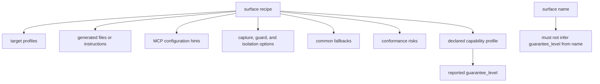
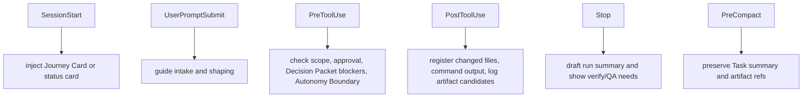
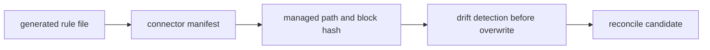
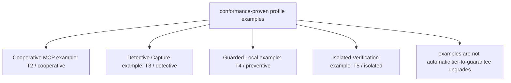
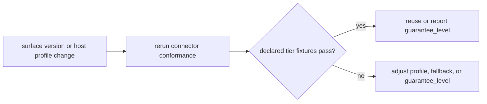

# Appendix B: Surface Cookbook

## Document Role

This appendix owns surface-specific connector notes, generated file details, and profile examples. The common integration contract is owned by `09-agent-integration.md`.

Use this cookbook only for local differences that depend on a concrete surface. Do not repeat kernel state rules, MCP schemas, or generic policy contracts here.

## Cookbook Scope

Each surface recipe should describe:

- target profiles that are plausible for the surface
- generated files or instructions
- MCP configuration hints
- capture, guard, and isolation options
- common fallbacks
- conformance risks

The connector must still declare a capability profile. A surface name does not imply a guarantee level.

Surface recipes may mention user-facing guard or freeze controls, but only as labels over the connected profile's actual capability. "Freeze" should mean a visible hold or narrowed boundary. "Guard" should mean cooperative instruction, detective validation, preventive blocking, or isolation according to the profile. "Careful mode" should mean stricter `prepare_write`, scope, evidence, and user-question posture, not a new authority tier.

```mermaid
flowchart TB
  Codex["codex"] --> CodexProfiles["profiles: local_cli, ide_chat, custom_agent"]
  Codex --> CodexStrengths["strengths: repository rules, editing workflow, MCP-capable profiles"]
  Codex --> CodexFallbacks["fallbacks: cooperative prepare_write, sidecar watcher, changed_paths validator"]
  Codex --> CodexRisks["risks: guard proof, artifact capture, long rules"]

  Claude["claude_code"] --> ClaudeProfiles["profiles: local_cli, ide_chat, custom_agent"]
  Claude --> ClaudeStrengths["strengths: CLAUDE.md, hooks, evaluator candidates"]
  Claude --> ClaudeFallbacks["fallbacks: read-only evaluator, fresh worktree, stop-hook report"]
  Claude --> ClaudeRisks["risks: versioned hooks, read-only proof"]

  Gemini["gemini"] --> GeminiProfiles["profiles: local_cli, extension, ide_chat, custom_agent"]
  Gemini --> GeminiStrengths["strengths: extension/prompt package, MCP-capable profiles, sidecar workflows"]
  Gemini --> GeminiFallbacks["fallbacks: CLI wrapper, sidecar-controlled run, Manual QA note"]
  Gemini --> GeminiRisks["risks: large extension context, host-varying capture and guard"]

  Copilot["github_copilot"] --> CopilotProfiles["profiles: vscode_chat, vscode_agent, cloud_agent, custom_agent"]
  Copilot --> CopilotStrengths["strengths: custom instructions, VS Code task/terminal, MCP-capable profiles"]
  Copilot --> CopilotFallbacks["fallbacks: VS Code task wrapper, sidecar adapter, approval card"]
  Copilot --> CopilotRisks["risks: cloud/IDE differences, profile-specific guard proof"]

  Cursor["cursor"] --> CursorProfiles["profiles: ide_agent, local_cli, custom_agent"]
  Cursor --> CursorStrengths["strengths: project rules, MCP-capable profiles, sidecar support"]
  Cursor --> CursorFallbacks["fallbacks: sidecar changed-file detection, generated drift detection, manual bundle"]
  Cursor --> CursorRisks["risks: verbose rules, IDE permission differences"]
```





## Codex Notes

```yaml
surface_kind: codex
target_profiles:
  - local_cli
  - ide_chat
  - custom_agent
primary_strengths:
  - repository instruction files for short always-on rules
  - code editing workflow with frequent user-visible updates
  - MCP-capable profiles can call harness tools directly
common_fallbacks:
  - cooperative prepare_write discipline unless pre-tool guard is proven
  - sidecar changed-file watcher
  - changed_paths validator
  - manual verification bundle
profile_risks:
  - pre-tool guard strength depends on host environment and must be proven by conformance
  - artifact capture may need wrapper or explicit record_run discipline
  - long AGENTS.md files can bury Journey Card, Decision Packet, Write Authority Summary, and Autonomy Boundary context
  - document rewrite sessions can sprawl without batch boundaries
```

Generated files may include:

- `AGENTS.md` or a managed harness section inside it
- local skill or command instructions when supported
- MCP config snippet
- connector manifest entry

Codex-specific connector work should keep `AGENTS.md` short enough to scan every turn. Treat it as an always-on compass, not a procedure manual, schema reference, or project history. Put procedural workflow in a skill, command, or MCP resource so the Journey Card, Decision Packet, Write Authority Summary, and Autonomy Boundary do not get buried.

Codex-facing wording may expose phrases such as "freeze this task to these paths" or "show current guard level." For profiles without proven pre-tool blocking, Codex must describe that as cooperative freeze plus detective changed-path validation when available, not as a preventive guard.

The Codex flow should preserve user agency:

- show the Journey Card before significant work resumes
- surface a Decision Packet instead of asking for broad approval when product judgment is required
- ask one blocking question at a time, with a recommendation and uncertainty when available
- continue AFK only when active Change Unit scope, Autonomy Boundary latitude, any granted sensitive approval, and compatible `prepare_write` / Write Authorization before actual product writes all apply
- treat the Autonomy Boundary as judgment latitude, not write authority
- show the Write Authority Summary before product writes
- hold product writes if authoritative MCP is unavailable
- stop for planning direction, product trade-offs, QA waiver, verification risk acceptance, and final acceptance

For any Codex profile without proven pre-tool blocking, use the cooperative fallback: call `prepare_write`, respect the returned Write Authorization for allowed writes, record changed paths and evidence through `record_run`, and rely on changed-path validation, sidecar capture, or a manual verification bundle when risk warrants it.

Docs-authoring bootstrap fallback: if authoritative MCP is unavailable, product/runtime/code writes still hold. Treat diagnostic condition `MCP_SERVER_UNAVAILABLE` as no reachable Core response, and diagnostic condition `SURFACE_MCP_UNAVAILABLE` as a connected surface that lacks usable MCP, has stale MCP configuration, or cannot call required tools. These are diagnostic labels; `MCP_UNAVAILABLE` remains the stable public availability code. A pre-MVP Harness documentation-authoring batch may proceed only under explicit `DOCS_AUTHORING_OVERRIDE` with an exact path allowlist, and must be labeled as a documentation-maintainer override, not Core authorization, Write Authorization, evidence, verification, QA, acceptance, residual-risk acceptance, close, or a canonical state transition.

For document rewrite workflows, a connector may recommend one-batch-per-session so changed sections, added user-facing phrases, and surface-specific advice remain reviewable.

## Claude Code Notes

```yaml
surface_kind: claude_code
target_profiles:
  - local_cli
  - ide_chat
  - custom_agent
primary_strengths:
  - CLAUDE.md and skill-style procedures
  - hook candidates for guard and capture
  - fresh evaluator profile candidates
common_fallbacks:
  - read-only evaluator profile
  - fresh worktree evaluator
  - stop-hook report draft
profile_risks:
  - hook behavior is version and configuration dependent
  - read-only verification profile must be tested by conformance
```

Hook mapping candidates:

| Hook point | Harness use |
|---|---|
| `SessionStart` | inject Journey Card or status card |
| `UserPromptSubmit` | guide intake and shaping |
| `PreToolUse` | check edit/write/bash/network/secret access against scope, approval, Decision Packet blockers, and Autonomy Boundary |
| `PostToolUse` | register changed files, command output, and log artifact candidates |
| `Stop` | draft run summary and show verify/QA needs |
| `PreCompact` | preserve Task summary and artifact refs |



Write-capable Claude Code profiles should show the Write Authority Summary before product writes, respect the returned Write Authorization, and record write-capable runs so `record_run` consumes the compatible authorization.

Evaluator profiles should be read-only by default. A profile may claim preventive or isolated guarantees only after the connector conformance proves those hooks or boundaries are active.

Claude Code recipes may map "guard" to `PreToolUse` only when that hook is configured and conformance proves it can block the covered edit, command, network, or secret access before execution. Otherwise, "freeze" and "careful mode" remain cooperative instructions plus any available post-tool capture.

## Gemini Notes

```yaml
surface_kind: gemini
target_profiles:
  - local_cli
  - extension
  - ide_chat
  - custom_agent
primary_strengths:
  - extension or prompt package
  - MCP-capable profiles
  - sidecar-friendly local workflows
common_fallbacks:
  - CLI wrapper
  - sidecar-controlled run
  - Manual QA note artifact
profile_risks:
  - extension context can become too large
  - capture and guard behavior varies by host
```

Gemini connectors should keep extension context small. Push the Journey Card or status card, active Decision Packet summary, Autonomy Boundary summary, Change Unit scope, and residual-risk summary near close. Let the agent pull longer standards, domain language, module maps, and interface contracts through MCP resources. Write-capable profiles should show the Write Authority Summary before product writes, respect the returned Write Authorization, and ensure `record_run` consumes it.

Gemini recipes should avoid implying that extension wording alone is a guard. If a local CLI wrapper or sidecar controls execution, the recipe may report detective or preventive behavior only for the covered paths and commands; otherwise freeze requests are cooperative holds or narrowed boundaries.

## GitHub Copilot Notes

```yaml
surface_kind: github_copilot
target_profiles:
  - vscode_chat
  - vscode_agent
  - cloud_agent
  - custom_agent
primary_strengths:
  - workspace custom instructions
  - VS Code task and terminal integration
  - MCP-capable profiles where available
common_fallbacks:
  - VS Code task wrapper
  - sidecar adapter
  - explicit approval card
profile_risks:
  - cloud and IDE profiles may differ materially
  - write guard and artifact capture need profile-specific verification
```

Copilot connectors should prioritize Journey Card or status card display, MCP tool invocation, Decision Packet display, Autonomy Boundary summary, approval card display for sensitive changes, Manual QA card display, residual-risk visibility near close, and acceptance prompts. For product writes, show the Write Authority Summary, respect the returned Write Authorization, and consume it through `record_run`. For terminal/task execution, prefer wrappers that can capture output and associate it with the active Run.

Copilot recipes should distinguish IDE or cloud profiles. A VS Code task wrapper may support detective capture or preventive blocking for tasks it owns, while chat instructions alone are cooperative. User-facing "freeze" cards should show the allowed paths and the current guarantee level.

## Cursor Notes

```yaml
surface_kind: cursor
target_profiles:
  - ide_agent
  - local_cli
  - custom_agent
primary_strengths:
  - project rules
  - MCP-capable profiles
  - IDE agent workflow with sidecar support
common_fallbacks:
  - sidecar changed-file detection
  - generated file drift detection
  - manual verification bundle
profile_risks:
  - project rules can become too verbose
  - guard behavior depends on IDE profile and permissions
```

Cursor connectors should keep project rules short and use the skill/playbook plus MCP for procedural depth. Write-capable profiles should show the Write Authority Summary before product writes, respect the returned Write Authorization, and record write-capable runs so `record_run` consumes the compatible authorization. Generated project rules should be covered by the connector manifest so local edits become reconcile candidates instead of being overwritten silently.

Cursor recipes may expose guard/freeze through project rules, IDE permissions, or sidecar support, but the recipe must report the actual profile. Project-rule wording alone is cooperative; IDE permission or sidecar proof is required before claiming preventive guard behavior.

## Generated File Details

### Always-On Rule File

Use this shape for surface rule files such as `AGENTS.md`, `CLAUDE.md`, Gemini instructions, Copilot custom instructions, or Cursor rules. Keep only the lines that the specific surface needs.



````md
# Harness Rules

## Repository Summary
- purpose:
- main execution path:
- modules to treat carefully:

## Harness Rule
Use Harness for product code changes, verification, approval, Manual QA, acceptance, resume, and close decisions.

## Working Rules
- Read current Harness status before changing product files.
- Show the Journey Card before significant work resumes.
- Small low-risk changes may be `direct`.
- Feature, structural, risky, or multi-file changes are `work`.
- Direct Fast Path: for small direct work, keep Harness mostly invisible with narrow scope, `prepare_write`, changed paths, self-check evidence, and close if no blocker appears; if scope or risk grows, move the same Task to `work`.
- Freeze means hold or narrow the current task boundary; Guard means use the available cooperative, detective, preventive, or isolated protection and show its limitation.
- Careful mode means stricter `prepare_write`, scope, evidence, and user-question posture; it is not approval or write authority.
- Work starts with enough shared design to define scope and acceptance criteria.
- A product write requires `harness.prepare_write`.
- Show the Write Authority Summary before product writes.
- If authoritative MCP is unavailable, hold product writes.
- Sensitive categories require approval before proceeding.
- If a Decision Packet is required, present it instead of asking for broad approval.
- Ask one blocking question at a time, with a recommendation and uncertainty when available.
- Stay inside the active scoped Change Unit.
- AFK implementation is only allowed when active Change Unit scope, Autonomy Boundary latitude, any granted sensitive approval, and compatible `prepare_write` / Write Authorization before actual product writes all apply.
- Autonomy Boundary is not write authority; still obey `prepare_write`, Change Unit scope, approvals, allowed paths/tools/commands/network/secrets.
- Planning direction, product trade-offs, QA waiver, verification risk acceptance, and final acceptance are human-held.
- Record runs, commands, changed files, artifacts, and evidence.
- Work cannot self-certify detached verification.
- Required Manual QA and acceptance are separate close checks.
- Known close-relevant residual risk must be visible before any successful close.
- Risk-accepted close additionally requires accepted Residual Risk refs.
- Acceptance, when required, can be recorded only after close-relevant residual risk is visible.
- Prefer current Harness state and evidence over chat memory.
- For document rewrite workflows, prefer one batch per session when that keeps review clear.

## Default Checks
- lint:
- test:
- build:
````

### Harness Skill Or Command Template

````md
---
name: harness
description: Use this when the user asks to modify code, verify work, resume a task, request a user decision, perform QA, close a task, inspect project work state, or record a development decision.
---

# Harness Skill

## Purpose
Use Harness to keep AI-assisted development visible, bounded, evidenced, verifiable, and aligned with product design.

## Core Rule
Before editing product files, call `harness.prepare_write`. An allowed response returns a Write Authorization for that intended write, and `harness.record_run` consumes it. If `prepare_write` is blocked, do not edit product files. If authoritative MCP is unavailable, hold product writes and report the guarantee limitation. The Autonomy Boundary is judgment latitude, not write authority.

Guard, freeze, and careful-mode phrases are safety controls over this same rule. Freeze holds or narrows the current boundary. Guard uses the connected profile's actual cooperative, detective, preventive, or isolated protection. Careful mode tightens posture around `prepare_write`, scope, evidence, and user questions; it does not add authority.

## Workflow

### Minimal Happy Path
1. Check status or intake.
2. Classify as `advisor`, `direct`, or `work`.
3. Show the Journey Card before significant work resumes, then confirm scope and the Change Unit.
4. If product judgment blocks progress, request or show the Decision Packet.
5. Before editing product files, call `harness.prepare_write`, show the Write Authority Summary, and keep the returned Write Authorization for the run.
6. After changes, record runs, changed paths, commands, artifacts, and evidence; write-capable runs consume the compatible Write Authorization.
7. Verify, record Manual QA, make close-relevant residual risk visible, and request acceptance when needed.
8. Close.

### Direct Fast Path
For small direct work, keep Harness mostly invisible: use narrow scope, call `harness.prepare_write`, make the change, record changed paths and self-check evidence, and close if no blocker appears. If scope, risk, or uncertainty grows, move the same Task to `work`.

### 1. Status Or Intake
- If the user asks for status, call `harness.status`.
- If the user asks for a new task, call `harness.intake`.
- If the user asks to resume, call `harness.status` and `harness.next`.

### 2. Classify
- `advisor`: explanation, comparison, review, or decision support.
- `direct`: small, low-risk, clear change.
- `work`: feature, structural change, non-local fix, refactor, or high-risk change.

### 3. Shape Work
- Ask one blocking question at a time when requirements are ambiguous, with a recommendation and uncertainty when available.
- When product judgment blocks progress, request or show a Decision Packet instead of asking for broad approval. A Decision Packet is not broad approval.
- Record decisions, assumptions, rejected options, scope, and acceptance criteria.
- Record the Autonomy Boundary for what the agent may do without another user decision.
- Check domain language and module/interface impact.
- Propose Change Units, preferring vertical slices.

### 4. Before Writing
- Call `harness.prepare_write`.
- If allowed, show the Write Authority Summary and carry the returned Write Authorization into `harness.record_run`.
- If `prepare_write` is blocked, do not edit product files.
- If authoritative MCP is unavailable, hold product writes and report that the surface cannot provide an authoritative write decision.
- Respect allowed paths, tools, commands, network, and secret scope.
- Continue AFK only when active Change Unit scope, Autonomy Boundary latitude, any granted sensitive approval, and compatible `prepare_write` / Write Authorization before actual product writes all apply.
- Autonomy Boundary is not write authority; `prepare_write`, Change Unit scope, allowed paths/tools/commands/network/secrets, and sensitive approval still control writes.
- Stop when approval, scope confirmation, a Decision Packet, or human-held judgment is required.
- Use `harness.request_user_decision` for blocking product judgment; approval is one decision kind for sensitive changes.
- Decision Packets can remove product-judgment blockers; they do not authorize writes by themselves.
- Do not collapse product trade-offs into approval.

### 5. During Implementation
- Prefer TDD when suitable.
- Keep feedback loops short.
- Avoid changes outside the active scoped Change Unit.
- Do not decide planning direction, product trade-offs, QA waiver, verification risk acceptance, or final acceptance for the user.

### 6. After Changing
- Call `harness.record_run` with the compatible Write Authorization for write-capable runs, plus changed paths, commands, logs, diff refs, artifacts, TDD trace, evidence mapping, and design updates.
- Record evidence after changes; do not leave changed paths, commands, artifacts, or evidence only in chat.

### 7. Finish
- For work verification, call `harness.launch_verify` or record a fresh evaluator result through `harness.record_eval`.
- Work cannot self-certify detached verification.
- For Manual QA, call `harness.record_manual_qa`.
- Record user decisions through `harness.record_user_decision`.
- Known close-relevant residual risk must be visible before any successful close.
- Risk-accepted close additionally requires accepted Residual Risk refs.
- Acceptance, when required, can be recorded only after close-relevant residual risk is visible.
- Call `harness.close_task` after required verification, Manual QA, evidence, and acceptance are resolved.
````

### MCP Config Snippet

Each surface has its own config format. The connector manifest should record the generated path and managed hash. Local stdio is the default MVP transport; local HTTP may be allowed by profile.

```yaml
mcp_server:
  name: harness
  transport: stdio
  command: harness
  args:
    - serve
    - mcp
  project_id: PRJ-0001
```

## Profile Examples

These examples are connector-profile recipes, not MVP reference-surface requirements. A `T4`, `T5`, or `T6` example counts only when the selected surface declares the capability and passes the relevant conformance coverage; otherwise the MVP reference surface stays at the proven cooperative or detective guarantee level.



### Cooperative MCP Profile

```yaml
surface_id: SURF-0001
surface_kind: generic_agent
target_profile: ide_chat
support_tier: T2
guarantee_level: cooperative
capabilities:
  project_rules: true
  skills_or_commands: true
  mcp_tools: true
  mcp_resources: true
  structured_output: false
  artifact_capture: manual
  pre_tool_guard: false
  changed_path_detection: validator
  fresh_verify: manual_bundle
  worktree_isolation: false
fallbacks:
  - cooperative prepare_write
  - changed_paths validator
  - manual verify bundle
```

### Detective Capture Profile

```yaml
surface_id: SURF-0002
surface_kind: generic_agent
target_profile: local_cli
support_tier: T3
guarantee_level: detective
capabilities:
  project_rules: true
  skills_or_commands: true
  mcp_tools: true
  mcp_resources: true
  structured_output: true
  artifact_capture: wrapper
  pre_tool_guard: false
  changed_path_detection: sidecar
  command_output_capture: wrapper
  fresh_verify: manual_bundle
  worktree_isolation: false
fallbacks:
  - sidecar changed-file watcher
  - artifact integrity check
  - fresh evaluator instructions
```

### Guarded Local Profile

```yaml
surface_id: SURF-0003
surface_kind: generic_agent
target_profile: local_cli
support_tier: T4
guarantee_level: preventive
capabilities:
  project_rules: true
  skills_or_commands: true
  mcp_tools: true
  mcp_resources: true
  structured_output: true
  artifact_capture: wrapper
  hooks: true
  pre_tool_guard: true
  explicit_permissions: true
  changed_path_detection: sidecar
  command_output_capture: wrapper
  fresh_verify: fresh_session
  worktree_isolation: optional
fallbacks:
  - sidecar guard
  - approval card
  - fresh evaluator profile
```

### Isolated Verification Profile

```yaml
surface_id: SURF-0004
surface_kind: manual_bundle
target_profile: manual_bundle
support_tier: T5
guarantee_level: isolated
capabilities:
  mcp_tools: false
  mcp_resources: false
  structured_output: true
  artifact_capture: bundle
  pre_tool_guard: read_only_bundle
  changed_path_detection: bundle_manifest
  fresh_verify: fresh_worktree
  worktree_isolation: true
fallbacks:
  - read-only evaluator bundle
  - operator record_eval
```

## Surface Conformance Notes

Each connector recipe should be tested against the operations-owned fixtures for its declared capability tier. When a surface version or host profile changes, rerun conformance before reusing the previous guarantee level.


