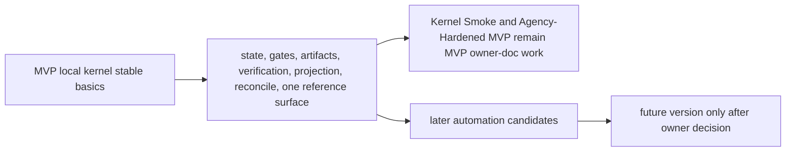
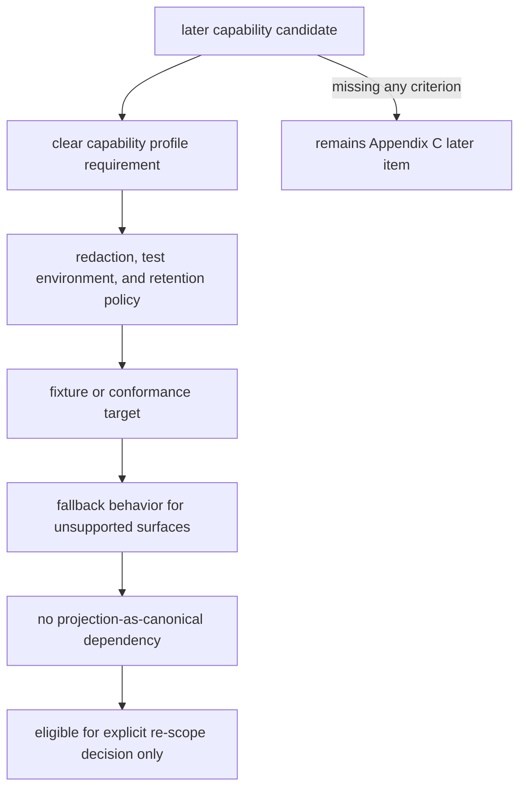
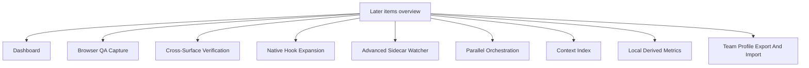
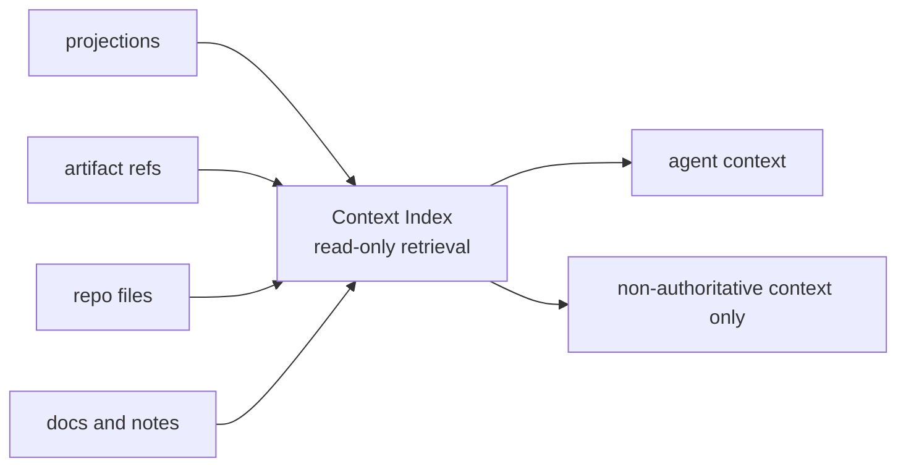
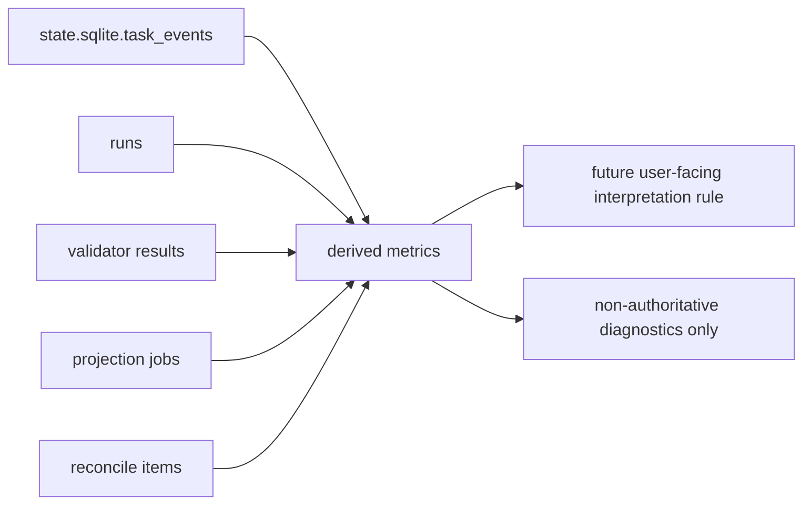

# Appendix C: Later Roadmap

## Document Role

This appendix collects later automation and post-MVP roadmap items so they do not read as MVP requirements.

It does not own kernel invariants, public MCP schemas, MVP implementation requirements, or required conformance for MVP.

## Roadmap Scope

The MVP proves the local kernel: state, gates, artifacts, verification, projection, reconcile, and one reference surface. The items below are useful follow-ons after those basics are stable.

Kernel Smoke and Agency-Hardened MVP are both MVP delivery stages, not Appendix C scope. This appendix must not absorb kernel authority, Decision Packet, residual-risk visibility, detached verification, Manual QA, recover/export, or fixture-conformance behavior that the MVP owner documents require.

Later items may become v1 work only after they have:

- a clear capability profile requirement
- a redaction and secret/PII handling policy
- a test environment and artifact retention policy when they capture runtime surfaces
- a fixture or conformance target
- a fallback behavior for unsupported surfaces
- no dependency on treating projections as canonical state

## Dashboard

A dashboard can visualize active Tasks, gates, approvals, evidence coverage, projection freshness, artifact integrity, and reconcile items.

Later because MVP should first stabilize the records, projections, and conformance fixtures that the dashboard would display. The first version should be read-only over `state.sqlite`, artifact refs, and projection job status.

## Browser QA Capture

Browser QA Capture is a v1 priority candidate, not an MVP requirement. Automatic or assisted capture can gather screenshots, console logs, network traces, accessibility snapshots, and workflow recordings for Manual QA records where the connected surface supports it.

Promotion requires a declared `T6 QA Capture` capability profile, redaction and secret/PII handling policy, test environment setup, artifact retention rules, fixture or conformance target, and fallback behavior for unsupported surfaces.

Captured browser QA material should attach to Manual QA records through artifact refs, commonly `qa_capture`, `screenshot`, `log`, or `other` when the captured file is a console log, network trace, accessibility snapshot, or workflow recording. It can improve QA evidence, but it is not final acceptance, does not replace Manual QA judgment when human taste or experience judgment is required, and does not replace detached verification unless the verification independence requirements are also met.

Unsupported surfaces should fall back to human Manual QA notes and manually supplied artifacts. MVP supports Manual QA records and artifact refs without requiring automated browser capture.

## Cross-Surface Verification

Cross-surface verification can send a verification bundle to a different agent surface or evaluator environment.

Later because MVP only needs one reference surface plus detached verification bundles/manual evaluator instructions. Cross-surface verify should wait for connector conformance and capability profiles to be stable.

## Native Hook Expansion

Native hooks can provide stronger pre-tool guards, command interception, file write blocking, or richer artifact capture in surfaces that support them.

Later because hook APIs vary by surface. MVP may use a concrete hook only when the reference surface actually supports it; otherwise native hooks are a capability-dependent enhancement.

## Advanced Sidecar Watcher

An advanced sidecar watcher can observe file writes, command execution, generated-file drift, artifact capture opportunities, and repo baseline drift in near real time.

Later because MVP can start with cooperative `prepare_write`, git diff checks, artifact registration, and detective validators. Advanced watching should not be required for the core state model to work.

## Parallel Orchestration

Parallel Change Unit orchestration can split work into multiple active implementation lanes, manage dependency DAGs, isolate baselines, and reconcile concurrent evidence.

Later because parallel execution depends on stable locks, baseline freshness, approval scope composition, artifact partitioning, and close semantics.

## Context Index

A Context Index is a read-only context provider that may help an agent find relevant projections, artifact refs, repo files, docs, or user notes without treating indexed knowledge as Harness state.

Later because indexed memory can blur local authority if introduced before the kernel and source-of-truth boundaries are stable. A future Context Index may rank, summarize, or retrieve context, but indexed or retrieved context must not authorize writes, resolve Decision Packets, grant approval, satisfy gates, create evidence, perform or record verification, record QA, waive QA or verification, accept residual risk, accept the result, upgrade assurance, enqueue or refresh projections, change projection freshness, declare implementation readiness, or close Tasks.

A Context Index should become v1 work only if a future decision assigns an owner, freshness and staleness rules, privacy/redaction behavior, connector capability expectations, fixture coverage, and a display rule that distinguishes retrieved context from canonical state.

## Local Derived Metrics

Local Derived Metrics can derive diagnostic rates, counts, durations, and guard-trigger summaries from `state.sqlite.task_events`, runs, validator results, projection jobs, and reconcile items.

Later because metrics are derived values, not authority. They may help users spot process bottlenecks, reporting gaps, and recurring operational patterns, but they are diagnostic only. Metric readouts must not mutate state, satisfy gates, authorize writes, grant approval, create evidence, enqueue or refresh projections, change projection freshness, change close readiness or implementation readiness, perform or record verification, record QA, waive QA or verification, accept residual risk, accept the result, upgrade assurance, or close Tasks.

Candidate derived metrics from the legacy operations guide:

- `direct_to_work_escalation_rate`
- `approval_turnaround_time`
- `verify_latency`
- `reopen_within_7d`
- `evaluator_blocked_due_to_missing_evidence`
- `same_session_verify_guard_triggered`
- `surface_fallback_rate`
- `mcp_connection_failure_rate`
- `projection_stale_duration`
- `reconcile_pending_count`
- `shaping_unresolved_decision_count`
- `horizontal_exception_rate`
- `tdd_red_missing_rate`
- `manual_qa_pending_duration`
- `evidence_insufficiency_rate`
- `architecture_drift_warning_count`
- `domain_language_mismatch_count`
- `interface_review_required_count`

These metrics should become v1 work only if a future decision assigns an owner, fixture coverage, retention behavior, privacy/redaction behavior when needed, and a user-facing interpretation rule. Even then, the metric value remains derived; any state change must still go through the normal Core owner path.

## Team Profile Export And Import

Team profile export/import can share policy defaults, connector profiles, surface capability assumptions, validator profiles, and project setup templates across a team.

Later because MVP is a local kernel. Team sharing needs versioning, privacy review, secret handling, and conflict behavior before it should affect runtime state.

## Additional Later Candidates

The following are also later unless a future batch promotes them with fixtures and implementation ownership:

- deployment, canary, rollback, merge, and production-monitoring automation; Release Handoff may exist earlier only as a v1 report/export profile that leaves those authorities external
- artifact dashboard
- worktree-based fresh verify automation
- advanced architecture drift validator
- advanced public interface validator
- semantic domain language consistency checks
- status/approval/acceptance/Manual QA card UX expansion
- multi-agent policy and scheduling
