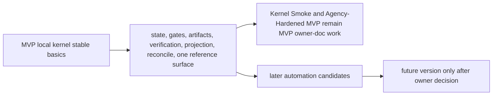
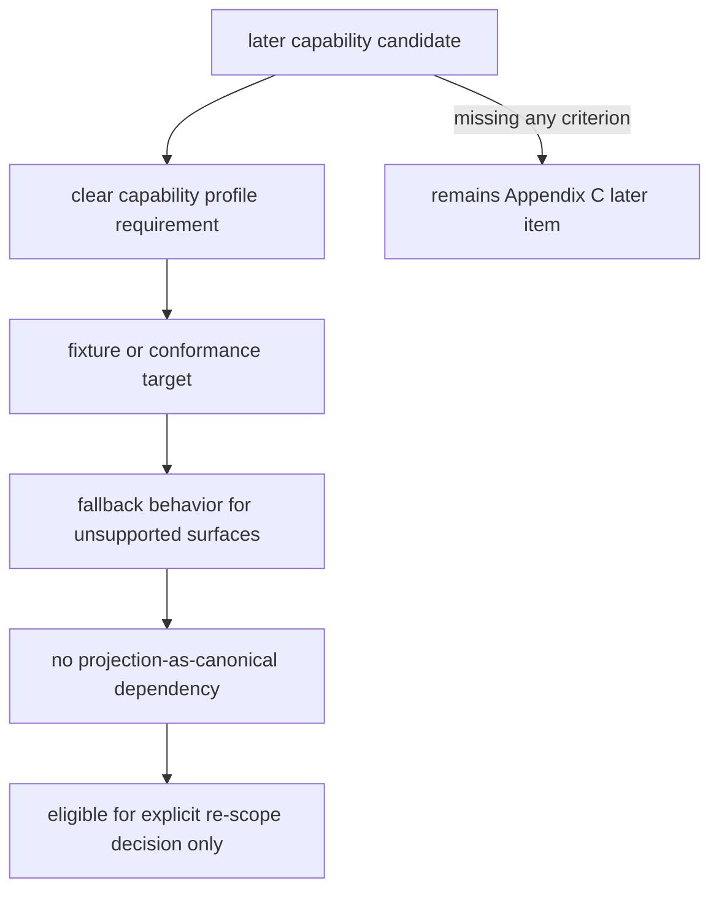
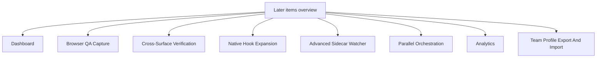
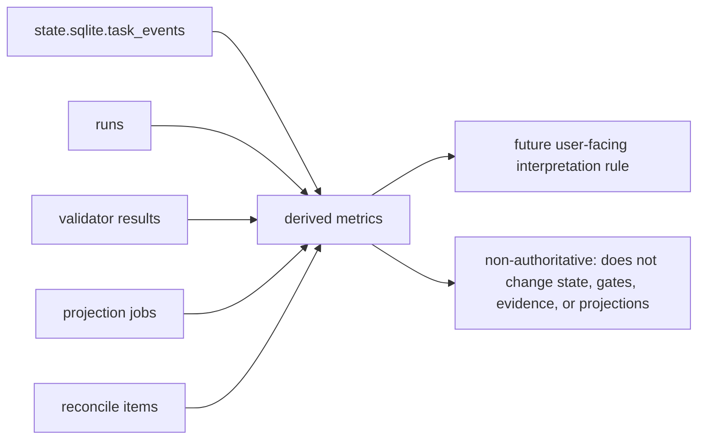

# Appendix C: Later Roadmap

## Document Role

This appendix collects later automation and post-MVP roadmap items so they do not read as MVP requirements.

It does not own kernel invariants, public MCP schemas, MVP implementation requirements, or required conformance for MVP.

## Roadmap Scope

The MVP proves the local kernel: state, gates, artifacts, verification, projection, reconcile, and one reference surface. The items below are useful follow-ons after those basics are stable.

Kernel Smoke and Agency-Hardened MVP are both MVP delivery stages, not Appendix C scope. This appendix must not absorb kernel authority, Decision Packet, residual-risk visibility, detached verification, Manual QA, recover/export, or fixture-conformance behavior that the MVP owner documents require.

Later items may become v1 work only after they have:

- a clear capability profile requirement
- a fixture or conformance target
- a fallback behavior for unsupported surfaces
- no dependency on treating projections as canonical state

## Dashboard

A dashboard can visualize active Tasks, gates, approvals, evidence coverage, projection freshness, artifact integrity, and reconcile items.

Later because MVP should first stabilize the records, projections, and conformance fixtures that the dashboard would display. The first version should be read-only over `state.sqlite`, artifact refs, and projection job status.

## Browser QA Capture

Automatic browser QA capture can gather screenshots, console logs, network traces, accessibility snapshots, and workflow recordings for Manual QA records.

Later because reliable browser capture requires additional surface capability, redaction policy, test environment setup, and artifact retention rules. MVP supports Manual QA records and artifact refs without requiring automated browser capture.

## Cross-Surface Verification

Cross-surface verification can send a verification bundle to a different agent surface or evaluator environment.

Later because MVP only needs one reference surface plus detached verification bundles/manual evaluator instructions. Cross-surface verify should wait for connector conformance and capability profiles to be stable.

## Native Hook Expansion

Native hooks can provide stronger pre-tool guards, command interception, file write blocking, or richer artifact capture in surfaces that support them.

Later because hook APIs vary by surface. MVP may use a concrete hook only when the reference surface actually supports it; otherwise native hooks are a capability-dependent enhancement.

## Advanced Sidecar Watcher

An advanced sidecar watcher can observe file writes, command execution, generated-file drift, artifact capture opportunities, and repo baseline drift in near real time.

Later because MVP can start with cooperative `prepare_write`, git diff checks, artifact registration, and detective validators. Advanced watching should not be required for the core state model to work.

## Parallel Orchestration

Parallel Change Unit orchestration can split work into multiple active implementation lanes, manage dependency DAGs, isolate baselines, and reconcile concurrent evidence.

Later because parallel execution depends on stable locks, baseline freshness, approval scope composition, artifact partitioning, and close semantics.

## Analytics

Analytics can derive rates and latencies from `state.sqlite.task_events`, runs, validator results, projection jobs, and reconcile items.

Later because metrics are derived values, not authority. Candidate metrics include approval turnaround, verification latency, evidence insufficiency rate, projection stale duration, reconcile volume, and same-session verification guard triggers.

Candidate derived metrics from the legacy operations guide:

- `direct_to_work_escalation_rate`
- `approval_turnaround_time`
- `verify_latency`
- `reopen_within_7d`
- `evaluator_blocked_due_to_missing_evidence`
- `same_session_verify_guard_triggered`
- `surface_fallback_rate`
- `mcp_connection_failure_rate`
- `projection_stale_duration`
- `reconcile_pending_count`
- `shaping_unresolved_decision_count`
- `horizontal_exception_rate`
- `tdd_red_missing_rate`
- `manual_qa_pending_duration`
- `architecture_drift_warning_count`
- `domain_language_mismatch_count`
- `interface_review_required_count`

These metrics should become v1 or MVP only if a future decision assigns an owner, fixture coverage, retention behavior, and a user-facing interpretation rule.

## Team Profile Export And Import

Team profile export/import can share policy defaults, connector profiles, surface capability assumptions, validator profiles, and project setup templates across a team.

Later because MVP is a local kernel. Team sharing needs versioning, privacy review, secret handling, and conflict behavior before it should affect runtime state.

## Additional Later Candidates

The following are also later unless a future batch promotes them with fixtures and implementation ownership:

- artifact dashboard
- worktree-based fresh verify automation
- advanced architecture drift validator
- advanced public interface validator
- semantic domain language consistency checks
- status/approval/acceptance/Manual QA card UX expansion
- multi-agent policy and scheduling
