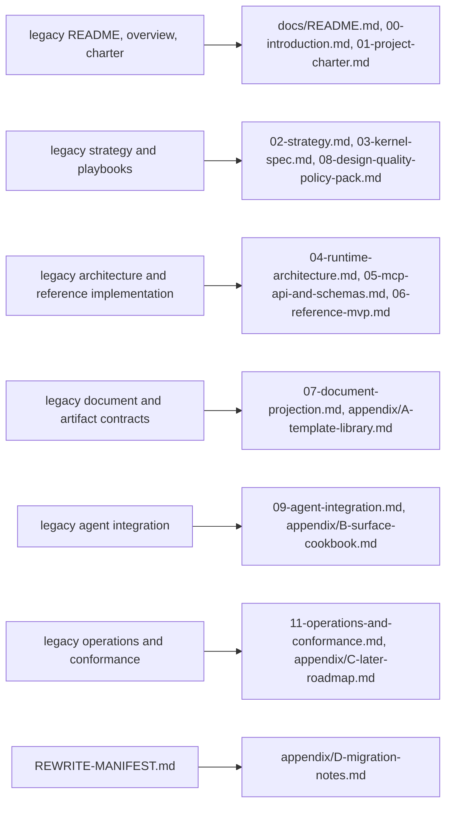
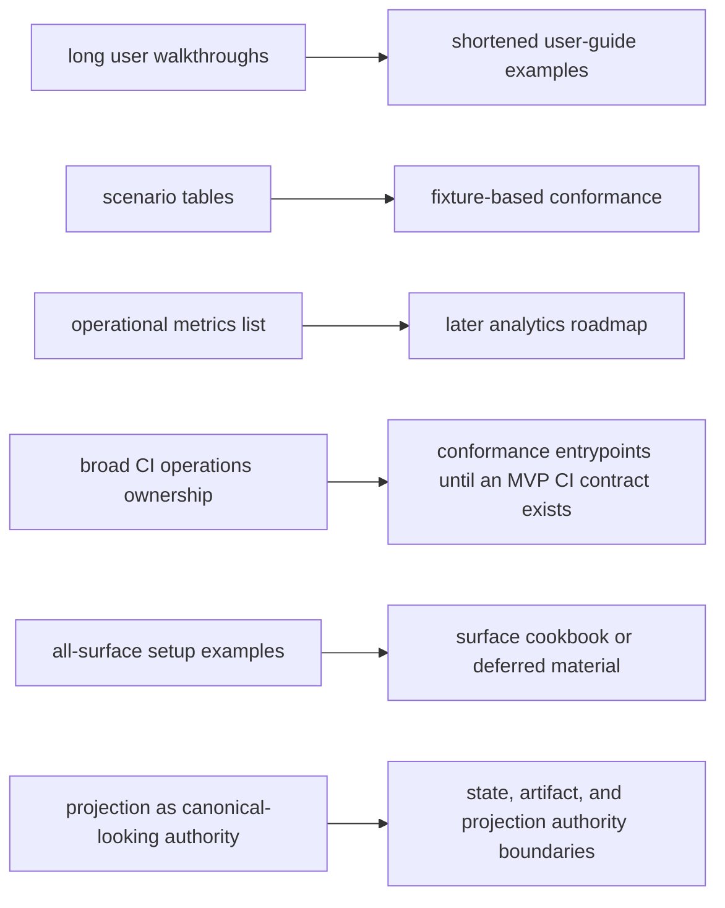
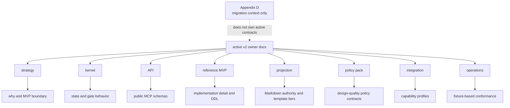

# Appendix D: Migration Notes

## Document Role

This appendix records old-to-new document mapping, removed or renamed sections, and compatibility guidance for the v2 documentation rewrite.

It is migration context only. It does not own canonical runtime contracts, kernel state semantics, MCP schemas, projection templates, user procedure, or conformance rules.

## Migration Scope

The active canonical docs are the v2 target files under `docs/` plus appendices A-C. This appendix is migration context, not an active canonical owner.

Legacy v1 files and rewrite manifests are source material for migration history only. After Batch H, replaced legacy files are no longer retained as active-tree Markdown documents; the old-to-new mapping in this appendix is the visible compatibility record.

`REWRITE-MANIFEST.md` is migration input. It records earlier simplification goals and confirms preservation themes such as three spaces, source-of-truth/projection separation, public MCP surface reduction, SQLite-centered runtime, MVP/later separation, four judgment separation, detached verification, and design-quality principles. It does not override the v2 owner docs.

## Old-To-New Mapping

| Archived legacy source | v2 destination |
|---|---|
| `docs/legacy-v1/README.md` | `docs/README.md` |
| `docs/legacy-v1/00-overview.md` | `docs/00-introduction.md` |
| `docs/legacy-v1/01-project-charter.md` | `docs/01-project-charter.md` |
| `docs/legacy-v1/02-strategy.md` | `docs/02-strategy.md`, `docs/03-kernel-spec.md`, `docs/08-design-quality-policy-pack.md` |
| `docs/legacy-v1/03-architecture.md` | `docs/04-runtime-architecture.md` |
| `docs/legacy-v1/04-reference-implementation.md` | `docs/03-kernel-spec.md`, `docs/05-mcp-api-and-schemas.md`, `docs/06-reference-mvp.md`, `docs/appendix/C-later-roadmap.md` |
| `docs/legacy-v1/05-user-guide.md` | `docs/10-user-guide.md` |
| `docs/legacy-v1/06-agent-integration.md` | `docs/09-agent-integration.md`, `docs/appendix/B-surface-cookbook.md` |
| `docs/legacy-v1/07-document-and-artifact-contracts.md` | `docs/07-document-projection.md`, `docs/appendix/A-template-library.md` |
| `docs/legacy-v1/08-operations-and-conformance.md` | `docs/11-operations-and-conformance.md`, `docs/appendix/C-later-roadmap.md` |
| `docs/legacy-v1/09-design-quality-playbooks.md` | `docs/08-design-quality-policy-pack.md` |
| `docs/legacy-v1/99-authoring-guide.md` | `docs/99-authoring-guide.md` |
| `docs/legacy-v1/glossary.md` | `docs/glossary.md` |
| `docs/legacy-v1/REWRITE-MANIFEST.md` | `docs/appendix/D-migration-notes.md` |

## Legacy Path Cleanup Status

Batch H removes replaced legacy documents from the active tree instead of keeping migration stubs. These paths are not canonical docs; use the v2 destination listed here.

| Removed legacy path | v2 destination |
|---|---|
| `docs/00-overview.md` | `docs/00-introduction.md` |
| `docs/03-architecture.md` | `docs/04-runtime-architecture.md` |
| `docs/04-reference-implementation.md` | `docs/03-kernel-spec.md`, `docs/05-mcp-api-and-schemas.md`, `docs/06-reference-mvp.md`, `docs/appendix/C-later-roadmap.md` |
| `docs/05-user-guide.md` | `docs/10-user-guide.md` |
| `docs/06-agent-integration.md` | `docs/09-agent-integration.md`, `docs/appendix/B-surface-cookbook.md` |
| `docs/07-document-and-artifact-contracts.md` | `docs/07-document-projection.md`, `docs/appendix/A-template-library.md` |
| `docs/08-operations-and-conformance.md` | `docs/11-operations-and-conformance.md`, `docs/appendix/C-later-roadmap.md` |
| `docs/09-design-quality-playbooks.md` | `docs/08-design-quality-policy-pack.md` |

The archived `docs/legacy-v1/` copies of these files, plus the old charter, strategy, authoring guide, glossary, README, and rewrite manifest, were also removed from the active tree. Their compatibility mapping remains in `docs/appendix/D-migration-notes.md`.

## Major Removed Or Renamed Sections

| Legacy section or theme | v2 treatment |
|---|---|
| `05-user-guide.md` long work walkthroughs | shortened into conversation examples in `10-user-guide.md` |
| detailed report-reading tables in user guide | removed from main user guide; projection ownership stays in `07-document-projection.md` |
| user-facing setup internals | moved to operations or integration owner docs |
| `08-operations-and-conformance.md` scenario tables | rewritten as fixture-based conformance in `11-operations-and-conformance.md` |
| operational metrics list | moved to later analytics in `appendix/C-later-roadmap.md` |
| CI as a broad operations owner | reduced to conformance entrypoints until an MVP CI contract is defined |
| all-surface connector setup examples | moved or deferred to `appendix/B-surface-cookbook.md` |
| surface-specific addenda in main integration docs | renamed as cookbook material |
| `03-architecture.md` | renamed/split into `04-runtime-architecture.md` plus owner summaries elsewhere |
| `04-reference-implementation.md` | split across kernel, API/schema, reference MVP, and later roadmap |
| `07-document-and-artifact-contracts.md` | renamed/split into `07-document-projection.md` and `appendix/A-template-library.md` |
| `09-design-quality-playbooks.md` | converted from playbook prose to policy contracts |
| old 17-item invariant style | split into Strategic Invariants, Kernel Authority Invariants, and Design Stewardship Defaults |
| single-axis status model | replaced by lifecycle plus gates |
| event log phrasing as a separate store | replaced by `state.sqlite.task_events` wording |
| projection as canonical-looking document authority | replaced by state/artifact/projection authority boundaries |

## Compatibility Guidance

If a reader encounters an old file name, use the mapping above and prefer the v2 destination. Do not cite archived legacy documents as canonical docs.

If a legacy section contains a useful example that has not moved, treat it as source material only. The active owner doc decides whether the example belongs in main text, appendix, later roadmap, or migration notes.

If a legacy term conflicts with the glossary, use `docs/glossary.md`.

If a legacy behavior conflicts with a v2 owner doc, use the v2 owner doc.

## Version Comparison Summary

v1 mixed strategy, state, implementation, template, connector, operations, and design-quality guidance across fewer documents. v2 separates them by ownership:

- strategy owns why, failure model, Strategic Invariants, Kernel Authority Invariants, Design Stewardship Defaults, and MVP boundary
- kernel owns state and gate behavior
- API owns public MCP schemas
- reference MVP owns implementation detail and DDL
- projection owns Markdown authority and template tiers
- policy pack owns design-quality policy contracts
- integration owns capability profiles
- operations owns fixture-based conformance

The migration keeps the original product intent but removes duplicated authority, long user examples, broad all-surface implications, and MVP/later ambiguity.
