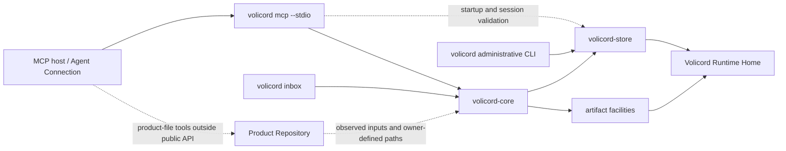

# Implementation architecture

This page is the top-level Architecture Guide overview for the local Rust
workspace. It owns guide-level operational paths, workspace shape, dependency
direction, durable implementation boundaries, and routes to focused detail
owners.

It is not a source map, CLI workflow guide, request trace, storage transaction
guide, testing strategy, change guide, or product contract. Use the
[Architecture Guide](README.md) entry point for the source-code learning path,
the [Codebase Tour](codebase-tour.md) for reading order, the [Source Map](source-map.md)
for exact source paths, the [Request Lifecycle](request-lifecycle.md) for
representative MCP/Core request flow, [CLI Workflows](cli-workflows.md) for
administrative CLI workflow boundaries, [Implementation Design Patterns](design-patterns.md)
for recurring structures, [Storage and Transactions](storage-and-transactions.md)
for Store commit and artifact boundaries, [Testing Strategy](testing-strategy.md)
for test-layer choice, [Architecture Decisions](decisions/README.md) for
focused decision records, the [Implementation Guide](change-guide.md) for
change routing, and the focused [Reference Index](../reference/README.md) for
exact behavior.

Volicord is the local work authority record for AI-assisted product work. Core
is the local authority record for Volicord state.

This checkout is the Volicord source repository and Rust workspace maintained
by this repository. It contains implementation crates, tests, documentation,
validation tooling, and repository configuration. A Volicord installation is a
deployed subset of executables and required runtime resources, so this
workspace overview is not an installation manifest.

Code and test paths that are meant to be opened directly are written relative
to the repository root.

## Operational paths

At the overview level, the implementation has three durable local path shapes:

- MCP host -> `volicord mcp --stdio` -> `volicord-mcp` -> `volicord-core` ->
  Store and artifact facilities under `Volicord Runtime Home`.
- Operator -> `volicord` administrative CLI -> setup, registration, host, and
  diagnostic facilities -> `Volicord Runtime Home` and supported host
  configuration boundaries.
- Local user -> `volicord inbox` CLI -> `volicord-core` -> Store under
  `Volicord Runtime Home`, using the `User Channel`.

The `volicord-mcp` adapter library may use Store directly for startup
inspection, session validation, Agent Connection context, and request-time
project routing. That direct Store use is not an alternate implementation of
public Volicord method semantics; public method execution routes through Core.

`Product Repository` remains a separate product-file boundary. Public Volicord
methods record owner-defined compatibility, observations, judgments, evidence,
and artifact links. Product-file writes themselves happen through an Agent
Connection, local tooling, or explicit administrative integration paths outside
the public method execution path.

## Workspace shape

| Workspace member | Guide-level role |
|---|---|
| `crates/volicord-types` | Shared request, response, schema-shaped, value-set, MCP tool-name, identifier, and canonical-hash types. |
| `crates/volicord-store` | SQLite, Runtime Home, bootstrap, project Store, artifact storage, inspection, guard/session observation storage, local web consent storage, export snapshots, and storage-error implementation. |
| `crates/volicord-core` | Adapter-independent Core service, shared request pipeline, method planning, policy checks, response construction, and Store coordination. |
| `crates/volicord-cli` | Local `volicord` administrative binary and reusable command modules for setup, project registration, User Channel commands, Agent Connection setup, host adapters, guard workflows, and MCP process handoff. |
| `crates/volicord-mcp` | MCP adapter library for startup validation, tool listing, `tools/call` decoding and dispatch, stdio framing, local HTTP transport, local web consent, and Core invocation. |
| `crates/volicord-test-support` | Disposable Runtime Home, Product Repository, Store, Core, Agent Connection, and fixture helpers shared by implementation tests. |
| `tests/conformance` | Baseline cross-method scenarios through Core-facing APIs and shared fixtures. |
| `tests/integration` | Cross-layer MCP, Core, Store, Agent Connection binding, operation-category, and public schema snapshot tests. |
| `xtask` | Repository maintenance tooling for documentation validation; it is outside Volicord runtime architecture. |

## Dependency boundaries

The durable dependency direction is:

- `volicord-types` sits at the shared type boundary and has no internal
  product-crate dependencies.
- `volicord-store` depends on shared types and owns persistence mechanics; it
  does not depend on Core, CLI, or MCP adapter crates.
- `volicord-core` depends on Store and shared types; Core-facing code stays
  independent of CLI and MCP adapter crates.
- `volicord-cli` and `volicord-mcp` are adapter or local orchestration layers.
  They may depend on Core, Store, and shared types for their distinct setup,
  startup validation, routing, and invocation responsibilities.
- Test-support and test packages compose implementation crates only for
  disposable fixtures and cross-layer verification.
- `xtask` stays isolated as repository maintenance tooling and has no internal
  product-crate dependency.

Exact Cargo dependency edges remain with the Cargo manifests. Exact source
placement remains with the Source Map.

## Durable implementation boundaries

| Boundary | Overview responsibility | Detail and contract routes |
|---|---|---|
| Core and adapters | Core owns adapter-independent public method handling. CLI and MCP adapters own process, setup, transport, routing, and rendering boundaries around Core. Core does not depend on either adapter layer. | [Request Lifecycle](request-lifecycle.md), [Implementation Design Patterns](design-patterns.md), [Core and adapter dependency boundary](decisions/core-adapter-boundary.md), [API Methods](../reference/api/methods.md), [MCP Transport](../reference/mcp-transport.md), and [Administrative CLI](../reference/admin-cli.md). |
| Runtime Home and Product Repository | `Volicord Runtime Home` holds Volicord runtime records and artifact data as storage/runtime owners define them. `Product Repository` holds user product files and explicit integration files where owner documents allow them. | [Storage and Transactions](storage-and-transactions.md), [Runtime Home and Product Repository separation](decisions/runtime-home-and-product-repository.md), [Runtime Boundaries](../reference/runtime-boundaries.md), and [Security](../reference/security.md). |
| Store commit boundary | Core method planners choose read-only, no-effect, dry-run, staging, or committed branches. Store applies normal committed Core mutations through its transaction boundary and keeps artifact staging separate from normal Core mutation commit. Core authority meaning stays with Core owners; exact storage records and effects stay with storage owners. | [Storage and Transactions](storage-and-transactions.md), [Request Lifecycle](request-lifecycle.md), [Core Model](../reference/core-model.md), [Storage](../reference/storage.md), and [Storage Effects](../reference/storage-effects.md). |
| MCP adapter boundary | `volicord mcp --stdio` resolves Runtime Home and Agent Connection context, validates startup/session facts, exposes owner-defined tools by connection mode, selects permitted projects, decodes `tools/call`, derives adapter-managed invocation facts, calls Core, and wraps Core JSON as MCP content. | [Request Lifecycle](request-lifecycle.md), [Source Map](source-map.md), [MCP Transport](../reference/mcp-transport.md), and [Agent Connection](../reference/agent-connection.md). |
| Administrative CLI and host adapters | The CLI orchestrates local setup, project registration, Agent Connection management, host integration, guard integration, diagnostics, and `User Channel` commands. These workflows are local administrative orchestration, not public Core methods or security proofs. | [CLI Workflows](cli-workflows.md), [Source Map](source-map.md), [Administrative CLI](../reference/admin-cli.md), and [Security](../reference/security.md). |
| Tests and validation | Implementation tests verify owner-defined facts at the appropriate layer. Tests, fixtures, generated snapshots, and documentation checks do not become product contract owners. | [Testing Strategy](testing-strategy.md) and [Validation](../maintain/validation.md). |

## Detail routes

| Need | Route |
|---|---|
| Exact source paths, module responsibilities, CLI submodule boundaries, adapter modules, and test-support paths | [Source Map](source-map.md) |
| First-pass reading order through crates, entry symbols, and implementation flows | [Codebase Tour](codebase-tour.md) |
| Setup, connection provisioning, status, verification, doctor, guard, host integration, and guard integration execution-flow boundaries | [CLI Workflows](cli-workflows.md) |
| Representative MCP/Core request flow, branch differences, method traces, Store interaction, and response wrapping | [Request Lifecycle](request-lifecycle.md) |
| Store transactions, effect paths, replay, artifact staging, commit boundaries, and failure boundaries | [Storage and Transactions](storage-and-transactions.md) |
| Test-layer choice, fixtures, generated-output drift checks, durable tests, and validation responsibilities | [Testing Strategy](testing-strategy.md) |
| Change classification, owner routing, source-path routing, and validation-command selection | [Implementation Guide](change-guide.md) |
| Durable architecture rationale, consequences, non-goals, implementation areas, tests, and owner routes | [Architecture Decisions](decisions/README.md) |

## Decision routes

Focused decision consequences and non-goals live in the decision records:

| Boundary | Focused decision |
|---|---|
| Agent Connection, host routing, and explicit Connection Project membership | [Agent Connection and host routing](decisions/agent-connection-routing.md) |
| Core independence from MCP and CLI adapters | [Core and adapter dependency boundary](decisions/core-adapter-boundary.md) |
| Method planning before normal committed Store mutation | [Planning before atomic mutation commit](decisions/plan-and-atomic-commit.md) |
| Runtime data separated from product files | [Runtime Home and Product Repository separation](decisions/runtime-home-and-product-repository.md) |
