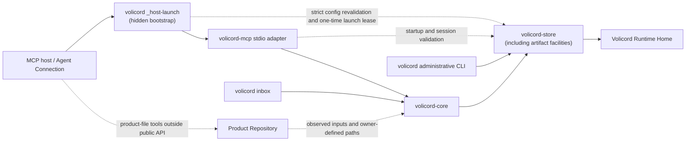

# Implementation architecture

This page is the top-level Architecture Guide overview for the local Rust
workspace. It owns guide-level operational paths, workspace shape, dependency
direction, durable implementation boundaries, and routes to focused detail
owners.

It is not a source map, workflow trace, testing strategy, change guide, or
product contract. Start at the [Architecture Guide](README.md) when you need a
learning route. Use the focused [Reference Index](../reference/README.md) for
exact behavior. The tables below route each implementation question to the
appropriate Architecture Guide page.

Volicord is the local work authority record for AI-assisted product work. Core
is the local authority record for Volicord state.

This checkout is the Volicord source repository and Rust workspace maintained
by this repository. It contains implementation crates, tests, documentation,
validation tooling, and repository configuration. A Volicord installation is a
deployed subset of executables and required runtime resources, so this
workspace overview is not an installation manifest.

Code and test paths that are meant to be opened directly are written relative
to the repository root.

## Operational paths

The diagram separates the three first-release entry paths: managed stdio MCP,
the administrative CLI, and the CLI inbox `User Channel`. Solid arrows show
the main call or storage direction. Dotted arrows show validation, observed
input, or work that stays outside public method execution.



The hidden launcher and `volicord-mcp` adapter library may use Store directly for startup
inspection, Agent Connection context, session validation, and request-time
project routing. That direct Store use is not an alternate implementation of
public Volicord method semantics; public method execution routes through Core.
The launcher stays in the original process, revalidates the current managed
configuration, issues a short-lived Registry lease, and passes the claim only
in memory to the MCP adapter. The public `volicord mcp serve` entry remains a
manual transport and always records `manual_cli`.

`Product Repository` remains a separate product-file boundary. Public Volicord
methods record owner-defined compatibility, observations, judgments, evidence,
and artifact links. Product-file writes themselves happen through an Agent
Connection, local tooling, or explicit administrative integration paths outside
the public method execution path.

## Workspace shape

| Workspace member | Guide-level role |
|---|---|
| `crates/volicord-types` | Shared request, response, schema-shaped, value-set, identifier, canonical-hash, platform, and host-configuration types; diagnostic lifecycle and `CurrentDiagnosticKey` identity types; selected-Connection and lifecycle-aware lookup report types; the shared tagged integration-verification workflow model; and the canonical `AgentToolId` catalog and wire-name projection. |
| `crates/volicord-host-contract` | Dependency-safe versioned Codex wire-contract parsing through the distinct `CodexMcpTurnMetadataV1` and `CodexHooksV1` markers, deterministic contract identities, bounded host values and errors, and source-specific MCP, prompt-hook, and tool-hook correlation types. It owns no Store, Core, CLI, or MCP policy. |
| `crates/volicord-store` | Canonical SQLite storage, Runtime Home, bootstrap, project Store, one-time managed MCP launch leases, Agent Connection runtime/project sessions, lifecycle-specific structured finding persistence, explicit diagnostic query and cause-graph traversal APIs, artifact storage, inspection, export snapshots, and storage-error implementation. |
| `crates/volicord-core` | Adapter-independent Core service, shared request pipeline, method planning, policy checks, response construction, and Store coordination. |
| `crates/volicord-cli` | Local `volicord` administrative binary and reusable command modules for setup, project registration, CLI inbox commands, Codex Agent Connection install/verify/repair/uninstall, host/MCP/Guard verification checks, dependency-graph policy, selected-Connection report presentation, lifecycle-aware exact lookup presentation, the hidden same-process managed-host launcher, and managed stdio MCP supervision policy, deadlines, framing, progress, and diagnostics. |
| `crates/volicord-platform-fs` | Internal safe facade for process-target and platform observation, native Linux/WSL2 classification, WSL2 distribution validation and filesystem observation, platform-native filesystem namespace operations, and read-only canonical Git common-directory/worktree snapshots. It does not own managed launch or Codex configuration policy. |
| `crates/volicord-platform-process` | Internal safe facade for bounded platform-specific child-process containment and nonblocking child-pipe readiness. It owns low-level Unix process-group, Windows Job Object, and pipe-polling primitives. |
| `crates/volicord-mcp-protocol` | Host-independent internal owner of exact MCP revision parsing, the closed reviewed production registry, message/tool/schema feature declarations, deterministic supported-revision ordering, and the separately selected preferred server revision. Tracked pre-release metadata remains outside the production registry. |
| `crates/volicord-mcp` | MCP adapter library for the canonical managed-launch configuration contract, in-memory launch-lease consumption, startup validation, registry-driven executable protocol conformance, consumption of the canonical tool model supplied by Volicord tool owners, revision-specific `tools/list` and `tools/call` projection, stdio lifecycle and framing, Core invocation, and consumption of typed protocol profiles. |
| `crates/volicord-test-support` | Reusable implementation-test fixtures only: disposable Runtime Home and Product Repository setup, Store inspection, Core request builders, and Agent Connection setup. It owns no product-behavior assertions or contracts. |
| `tests/conformance` | Baseline cross-method scenarios through Core-facing APIs, shared fixtures, and versioned offline MCP specification inputs. Pinned upstream inputs do not define runtime support. |
| `tests/integration` | Cross-layer MCP, Core, Store, Agent Connection session, operation-category, and public schema snapshot tests. |
| `tests/release-integrity` | Generic five-target coverage, version consistency, canonical text bytes, package shape, packaged-binary identity, checksum output, and release-workflow structure. It owns no production runtime behavior. |
| `xtask` | Lightweight repository maintenance tooling for documentation validation, pinned MCP specification manifest handling, release-version checks, and the cross-platform release-binary smoke harness. The smoke command executes an exact supplied `volicord` binary through public `init` and `mcp serve` processes and obtains the preferred initialize revision from `volicord-mcp-protocol`. Only MCP specification synchronization performs network operations. `xtask` does not link the runtime adapter, Core, Store, or platform crates and remains outside Volicord runtime architecture. |

## Dependency boundaries

The durable dependency direction is:

- `volicord-types` sits at the shared type boundary and has no internal
  product-crate dependencies. It owns lifecycle-specific diagnostic inputs,
  current-key identity and digest derivation, the shared read-only finding and
  report projections, stable namespaced-code validation, bounded redacting
  projection of typed owner facts, and the canonical tool-identity catalog.
  Domain crates retain their closed detailed code sets and exhaustive
  error-to-finding conversions.
- `volicord-host-contract` depends only on low-level shared types and
  general-purpose serialization and hashing. Store, CLI, and MCP consume its
  explicit `codex-hooks-v1` or `codex-mcp-2025-06-18-v1` parser and typed
  correlations. It never depends on Store, Core, CLI, or MCP.
- `volicord-store` depends on shared types and the read-only canonical Git
  layout primitive used to validate stored owner paths. It owns persistence
  mechanics and does not depend on Core, CLI, or MCP adapter crates.
- `volicord-core` depends on Store and shared types; Core-facing code stays
  independent of CLI and MCP adapter crates.
- `volicord-mcp-protocol` has no internal product-crate dependencies. It owns
  the closed revision-profile boundary without depending on Core, Store, CLI,
  host integration, or Volicord tool implementations.
- `volicord-cli` and `volicord-mcp` are adapter or local orchestration layers.
  They may depend on Core, Store, and shared types for their distinct setup,
  startup validation, routing, and invocation responsibilities;
  `volicord-mcp` also depends on `volicord-mcp-protocol` for revision-profile
  ownership.
- `volicord-platform-process` has no internal product-crate dependencies. It
  supplies safe child-process containment and pipe-polling primitives to local
  orchestration layers without owning MCP supervision policy, deadlines,
  framing, progress, or diagnostics.
- `volicord-platform-fs` has no internal product-crate dependencies. It owns
  safe observation of the current process target and platform, WSL2
  distribution identity and path filesystem, platform-native namespace
  operations, and the read-only Git layout identity primitive. Store and local
  adapters retain their planning, managed-file policy, ownership and authority
  comparisons, recovery, and diagnostic responsibilities.
- Test-support and test packages compose implementation crates only for
  disposable fixtures and cross-layer verification.
- `xtask` remains repository maintenance tooling outside product runtime. Its
  MCP specification checker and release-binary smoke harness depend on
  `volicord-mcp-protocol` for the compiled production profiles and preferred
  server revision. The smoke harness executes the supplied `volicord` process;
  it does not link the MCP adapter, Core, Store, CLI, host integration, or
  platform runtime crates. Ordinary checks remain offline; only the explicitly
  invoked specification sync command uses the network.

Exact Cargo dependency edges remain with the Cargo manifests. Exact source
placement remains with the Source Map.

## Canonical release boundaries

Boundary adapters decode their owner-defined current inputs into one canonical
internal model. Codex wire boundaries explicitly choose a versioned
`volicord-host-contract` profile; they do not infer a profile from field shape
or reuse MCP correlation as hook correlation. Core and Store do not branch on host configuration syntax,
shell syntax, generated wrappers, or platform command strings. Store opens only
the database whose manifest and canonical SQL digests match the current release
contract. The Codex adapter owns Codex configuration parsing, serialization,
and managed-entry validation. The platform filesystem boundary separately owns
process target and environment observation plus target and filesystem
validation. MCP validates current Store-owned runtime/project sessions and
supplies Core with a typed `ValidatedAgentSession`.

The failure, storage, and Agent Connection contracts remain in
[Failure Model](../reference/failure-model.md),
[Storage Versioning](../reference/storage-versioning.md),
[Agent Connection](../reference/agent-connection.md).

### Activation-state ownership

Activation is one typed projection across existing boundaries:

```text
host/config inspection + Store session/event evidence
  -> volicord-cli focused checks and typed actions
  -> volicord-types ConnectionVerificationReport
  -> concise / verbose / JSON projections
```

`volicord-types` owns `HookActivationState`,
`ConnectionActivationState`, focused check dependencies, fixed action
metadata, and the closed `IntegrationVerificationWorkflowState` with canonical
typed tool references. `volicord-cli` collects current managed configuration,
host reload, hook-source, session, capability, Guard, and separate
project-trust evidence. `volicord-store` preserves the Guard definition
boundary and is the single domain projector from a verification record to the
shared workflow state: unchanged manifests retain current observation
eligibility and changed managed definition content invalidates earlier events.
Begin, probe, get, `volicord-mcp`, CLI checks, and generated host guidance all
consume that projection. Completed exact probe replay stays `complete`;
failed or expired replay stays `restart_required`. Adapters and renderers do
not derive parallel state or classify summary prose.

Host-provided disabled, policy-managed, or invocation-bypass evidence is
accepted only through the typed host evidence boundary. In its absence,
Volicord can establish hook effectiveness from a compatible event for the
current definition or report `unknown`; it cannot manufacture a trust state.
Core authorization remains separate and still validates every managed MCP call.

## Durable implementation boundaries

| Boundary | Overview responsibility | Detail and contract routes |
|---|---|---|
| Shared diagnostic structures | `volicord-types` owns the lifecycle-specific finding inputs, current-key identity and digest derivation, dependency-safe read-only finding, cause and action representations, the selected-Connection report, and the separate lifecycle-aware exact-lookup envelope. Each domain owner maps its closed typed failures and facts into those structures; persistence, verification, and rendering stay with their existing owners. | [Source Map](source-map.md), [Testing Strategy](testing-strategy.md), [Failure Model](../reference/failure-model.md), and [Security](../reference/security.md). |
| CLI operational diagnostics | `volicord-cli` keeps immutable operational definitions, closed typed subjects and facts, typed action selection, and owner-scoped current-condition persistence in `operational_diagnostics`. The separate Connection verification package coordinates host, MCP, and Guard checks, dependency-graph evaluation, report inputs, and projection of those typed observations into findings. Store remains the lifecycle and query implementation owner. | [Source Map](source-map.md), [Failure Model](../reference/failure-model.md), [Administrative CLI](../reference/admin-cli.md), and [Agent Connection](../reference/agent-connection.md). |
| Diagnostic persistence and queries | `volicord-store` separates insert-only occurrences, replaceable current snapshots, cause-graph validation and traversal, lifecycle-aware exact lookup and graph APIs, current-report projection, and internal row encoding. Exact reads retain occurrence/current lifecycle, active/resolved state, and resolution time; reportable reads project only eligible occurrences and active current findings. | [Source Map](source-map.md), [Storage](../reference/storage.md), [Storage Records](../reference/storage-records.md), and [Failure Model](../reference/failure-model.md). |
| Core and adapters | Core owns adapter-independent public method handling. CLI and MCP adapters own process, setup, transport, routing, and rendering boundaries around Core. Core does not depend on either adapter layer. | [Request Lifecycle](request-lifecycle.md), [Implementation Design Patterns](design-patterns.md), [Core and adapter dependency boundary](decisions/core-adapter-boundary.md), [API Methods](../reference/api/methods.md), [MCP Transport](../reference/mcp-transport.md), and [Administrative CLI](../reference/admin-cli.md). |
| Codex host-wire contracts | `volicord-host-contract` owns the distinct `CodexMcpTurnMetadataV1`/`codex-mcp-2025-06-18-v1` and `CodexHooksV1`/`codex-hooks-v1` decoders, their deterministic profile digests, bounded values and failures, and non-interchangeable correlation types. MCP supplies session/thread/turn; prompt hooks supply session/turn; tool hooks additionally supply tool-use ID and canonical tool name. Store owns normalization and phase constraints after decoding. | [Source Map](source-map.md), [MCP Transport](../reference/mcp-transport.md), [Agent Connection](../reference/agent-connection.md), [Storage Records](../reference/storage-records.md), and [Failure Model](../reference/failure-model.md). |
| Runtime Home and Product Repository | `Volicord Runtime Home` holds Volicord runtime records and artifact data as storage/runtime owners define them. `Product Repository` holds user product files and explicit integration files where owner documents allow them. | [Storage and Transactions](storage-and-transactions.md), [Runtime Home and Product Repository separation](decisions/runtime-home-and-product-repository.md), [Runtime Boundaries](../reference/runtime-boundaries.md), and [Security](../reference/security.md). |
| Store commit boundary | Core method planners choose read-only, no-effect, dry-run, staging, or committed branches. Store applies normal committed Core mutations through its transaction boundary and keeps artifact staging separate from normal Core mutation commit. Core authority meaning stays with Core owners; exact storage records and effects stay with storage owners. | [Storage and Transactions](storage-and-transactions.md), [Request Lifecycle](request-lifecycle.md), [Core Model](../reference/core-model.md), [Storage](../reference/storage.md), and [Storage Effects](../reference/storage-effects.md). |
| MCP protocol-profile and conformance boundary | `volicord-mcp-protocol` owns the closed typed revision set, reviewed production profiles, message/tool/schema feature declarations, explicit iteration order, and preferred server revision. The generic executable conformance test and CLI server probe iterate that production registry directly. `xtask` independently enforces exact parity between released manifest production support and the same compiled registry. Host compatibility fixtures remain independently pinned and do not own server preference or revision conformance. | [Source Map](source-map.md), [Testing Strategy](testing-strategy.md), and [MCP Transport](../reference/mcp-transport.md). |
| MCP adapter boundary | `volicord mcp serve` is the public manual transport entry path; only the hidden launcher's in-memory lease claim may create a `managed_host` runtime. `volicord-types` supplies the closed `AgentToolId` identity catalog, reusing `MethodName` for Core-owned tools and binding operational verification roles at compile time. `volicord-mcp` keys the canonical registry by that identity and projects wire names, definitions, and results through the selected profile instead of forking tool ownership by revision. The adapter also resolves Runtime Home and Agent Connection context, validates startup/session facts, exposes tools by connection mode, selects permitted projects, parses `tools/call` names into `AgentToolId`, derives adapter-managed local invocation facts, calls Core, and wraps Core JSON as MCP content. | [Request Lifecycle](request-lifecycle.md), [Source Map](source-map.md), [MCP Transport](../reference/mcp-transport.md), and [Agent Connection](../reference/agent-connection.md). |
| Administrative CLI and Codex adapter | The CLI owns Codex configuration discovery, managed-entry installation and validation, dependency-aware verification policy, deterministic diagnostic root selection, concise/verbose/JSON selected-Connection reports, lifecycle-aware finding and runtime-session lookup output, repair, uninstall, and the hidden same-process host launcher. The launcher revalidates the exact current entry before issuing a one-time Store lease; it does not place lease material in configuration, arguments, environment, or output. Lookup success is independent of stored finding severity. The Codex adapter converts the canonical managed launch contract to and from Codex TOML while preserving only the allowed tool-approval overlay. It does not classify Linux or WSL2. | [CLI Workflows](cli-workflows.md), [Source Map](source-map.md), [Administrative CLI](../reference/admin-cli.md), [Agent Connection](../reference/agent-connection.md), and [Security](../reference/security.md). |
| Release integrity | Generic checks cover every published Volicord target, package and checksum continuity, and workflow shape. Ordinary CI and every native release matrix entry run the same cross-platform `xtask` smoke harness against the exact binary built for that job. The harness exercises public manual stdio and remains separate from optional real-Codex observation and managed-host evidence. | [Testing Strategy](testing-strategy.md) and [Validation](../maintain/validation.md). |
| Platform filesystem facade | `volicord-platform-fs` observes the process target and kernel, distinguishes native Linux from WSL2, validates the WSL2 distribution through `/etc/os-release`, and supplies path-filesystem observations for target-path restriction enforcement. It also isolates platform-native namespace primitives and canonical read-only Git common-directory/worktree discovery. It does not decide which files are managed, whether a replacement or write is authorized, or what recovery means. | [Source Map](source-map.md), [CLI Workflows](cli-workflows.md), [Administrative CLI](../reference/admin-cli.md), [Runtime Boundaries](../reference/runtime-boundaries.md), and [System Requirements](../reference/system-requirements.md). |
| Platform process facade | `volicord-platform-process` exposes safe bounded child-process containment and child-pipe readiness APIs. It owns low-level process groups, Windows Job Objects, nonblocking pipe configuration, and pipe polling. `volicord-cli` retains MCP supervision policy, lifecycle deadlines, protocol framing, exchange progress, and diagnostics. | [Source Map](source-map.md), [CLI Workflows](cli-workflows.md), [Administrative CLI](../reference/admin-cli.md), and [Agent Connection](../reference/agent-connection.md). |
| Tests and validation | Implementation tests verify owner-defined facts at the appropriate layer. MCP module tests are partitioned by lifecycle, batching, protocol projection, tool calls, managed-host observation, diagnostics, and conformance contracts, with shared setup isolated from those assertions. MCP production support requires a pinned released manifest entry and a production profile with exact set parity enforced by the lightweight checker. The independent registry-driven conformance test executes actual wire behavior for every production profile. Tracked pre-release schemas remain outside production iteration, and local conformance is not external certification. Tests, fixtures, generated snapshots, and documentation checks do not become product contract owners. | [Testing Strategy](testing-strategy.md) and [Validation](../maintain/validation.md). |

## Detail routes

| Need | Route |
|---|---|
| Exact source paths, module responsibilities, CLI submodule boundaries, adapter modules, and test-support paths | [Source Map](source-map.md) |
| First-pass reading order through crates, entry symbols, and implementation flows | [Codebase Tour](codebase-tour.md) |
| Setup, connection provisioning, status, verification, doctor, guard, host integration, and guard integration execution-flow boundaries | [CLI Workflows](cli-workflows.md) |
| Representative MCP/Core request flow, branch differences, method traces, Store interaction, and response wrapping | [Request Lifecycle](request-lifecycle.md) |
| Store transactions, effect paths, replay, artifact staging, commit boundaries, and failure boundaries | [Storage and Transactions](storage-and-transactions.md) |
| Test-layer choice, fixtures, generated-output drift checks, durable tests, and validation responsibilities | [Testing Strategy](testing-strategy.md) |
| Change classification, owner routing, source-path routing, and validation-command selection | [Implementation Guide](change-guide.md) |
| Durable architecture rationale, consequences, non-goals, implementation areas, tests, and owner routes | [Architecture Decisions](decisions/README.md) |

## Decision routes

Focused decision consequences and non-goals live in the decision records:

| Boundary | Focused decision |
|---|---|
| Agent Connection, host routing, and explicit Connection Project membership | [Agent Connection and host routing](decisions/agent-connection-routing.md) |
| Core independence from MCP and CLI adapters | [Core and adapter dependency boundary](decisions/core-adapter-boundary.md) |
| Method planning before normal committed Store mutation | [Planning before atomic mutation commit](decisions/plan-and-atomic-commit.md) |
| Runtime data separated from product files | [Runtime Home and Product Repository separation](decisions/runtime-home-and-product-repository.md) |
