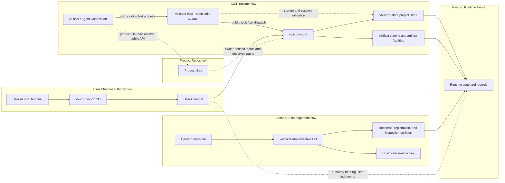
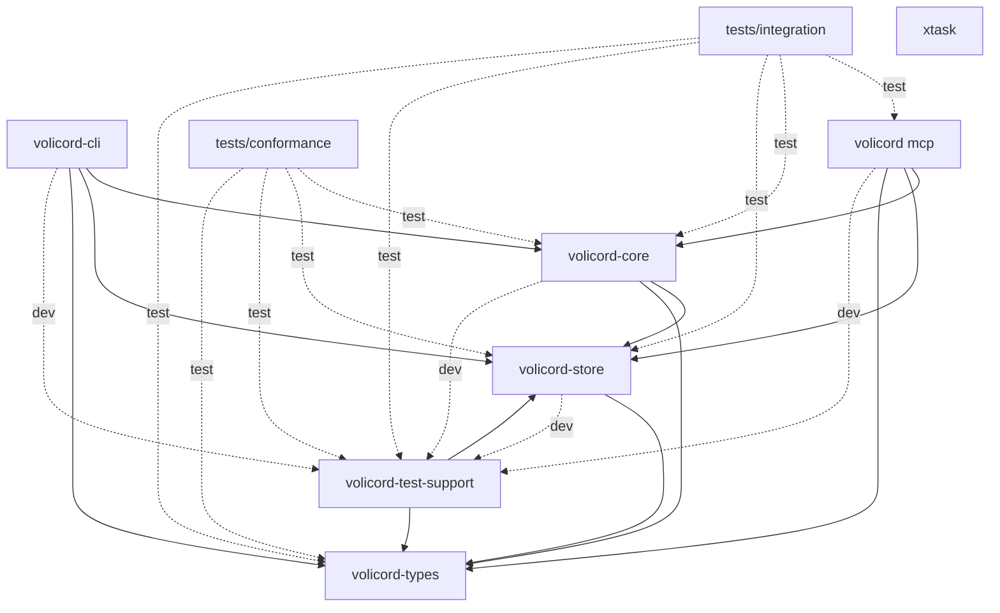
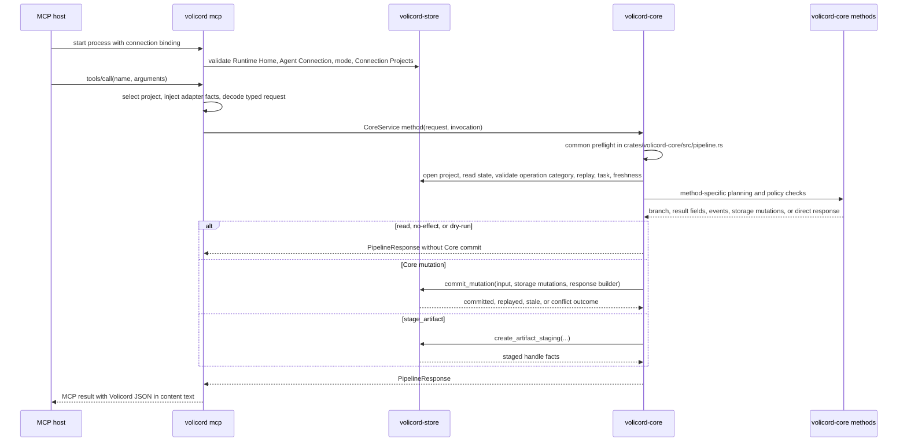

# Implementation architecture

This guide owns guide-level implementation structure and execution-flow explanation for the local Rust workspace. It helps implementers locate code, understand responsibility boundaries, and route code questions to the contract owners.

It does not define or override public API behavior, request or response fields, schema meaning, storage effects, DDL or table columns, security guarantees, runtime enforcement, Core authority semantics, or product contracts. Use the [Architecture Guide](README.md) entry point for the source-code learning path, the [Codebase Tour](codebase-tour.md) for crate-by-crate first files and symbols, the [Source Map](source-map.md) for exact source paths and module responsibilities, the [Request Lifecycle](request-lifecycle.md) for representative method traces, [CLI Workflows](cli-workflows.md) for administrative CLI execution-flow boundaries, [Implementation Design Patterns](design-patterns.md) for recurring implementation structures, [Storage and Transactions](storage-and-transactions.md) for Store commit and artifact boundaries, [Testing Strategy](testing-strategy.md) for test-layer choice, [Architecture Decisions](decisions/README.md) for focused decision records, the [Implementation Guide](change-guide.md) for change workflow, and the focused Reference owners for exact behavior.

Volicord is the local work authority record for AI-assisted product work. Core is the local authority record for Volicord state.

Code and test paths that are meant to be opened directly are written relative to the repository root.

This checkout is the Volicord source repository and Rust workspace for the repository-maintained Volicord implementation. It contains implementation crates for Core, storage, shared types, the `volicord` administrative CLI and MCP process entry, the `volicord-mcp` adapter library, tests, documentation, validation tooling, and repository configuration. A Volicord installation is a deployed subset of executables and required runtime resources, so this workspace overview must not be read as an installation manifest.

## Operational paths

This guide-level map shows which local implementation components and file
boundaries participate in the main operational paths. It orients execution
paths for implementers; it is not a public API contract, installation manifest,
storage ERD, or user workflow.

Read solid arrows as primary local call or record-access paths and dotted
arrows as validation, authority-record, observed-input, or outside-public-API
relationships. The `Volicord Runtime Home` and `Product Repository` boxes are
storage/file boundaries, not process containers; the Product Repository remains
outside the Runtime Home. Exact behavior belongs to the source areas and
Reference owners named in the surrounding sections.

The Volicord implementation in this repository has three distinct operational path shapes:

- MCP host -> `volicord mcp --stdio` -> `volicord-mcp` adapter library -> `volicord-core` -> Store and artifact facilities under `Volicord Runtime Home`.
- Operator -> `volicord` administrative CLI -> bootstrap and registration facilities -> `Volicord Runtime Home` and host configuration files.
- User at a local terminal -> `volicord inbox` CLI -> `volicord-core` -> Store under `Volicord Runtime Home`, using the `User Channel`.

The `volicord-mcp` adapter library also uses `volicord-store` directly during startup and request routing. That Store use checks Runtime Home, Agent Connection state, Connection Projects membership, project availability, `connection.mode`, `operation_category`, and `actor_source` provenance before dispatching a public method to Core. It is not an alternate implementation path for public Volicord method semantics, which route through `volicord-core`.

`Product Repository` remains a separate product-file boundary. The public Volicord API records owner-defined compatibility, observations, and artifact links; product-file writes themselves happen through an Agent Connection or local tooling outside the public API path.

## Workspace shape

The Cargo workspace contains these members:

| Workspace member | Cargo package | Targets | Guide-level role |
|---|---|---|---|
| `crates/volicord-types` | `volicord-types` | Library | Shared Rust request, response, schema-shaped, value-set, MCP tool-name, identifier, and canonical-hash types. |
| `crates/volicord-store` | `volicord-store` | Library | SQLite, Runtime Home, bootstrap, project Store, artifact storage, inspection, guard/session observation storage, local web consent storage, export snapshots, and storage-error implementation. |
| `crates/volicord-core` | `volicord-core` | Library | Core service, shared request pipeline, method planning, policy checks, and Store coordination. |
| `crates/volicord-cli` | `volicord-cli` | Library and `volicord` binary | Local administrative CLI for Runtime Home setup, project registration, User Channel commands, Agent Connection setup, host adapters, and the public `volicord mcp` process entry. |
| `crates/volicord-mcp` | `volicord-mcp` | Library | MCP stdio adapter, startup validation, tool listing, `tools/call` dispatch, and Core invocation. |
| `crates/volicord-test-support` | `volicord-test-support` | Library | Disposable Runtime Home, Store, Core, and fixture helpers shared by implementation tests. |
| `tests/conformance` | `volicord-conformance-tests` | `baseline` test target | Baseline cross-method scenarios that exercise owner-defined behavior through Core-facing APIs. |
| `tests/integration` | `volicord-integration-tests` | `mcp_connection` and `public_contract_snapshots` test targets | Cross-layer MCP, Core, Store, Agent Connection binding, operation-category, and public schema snapshot verification. |
| `xtask` | `xtask` | Library and `xtask` binary | Repository maintenance tooling for read-only documentation validation. It is not part of Volicord runtime architecture. |

Internal dependency direction from the Cargo manifests:

| Member | Normal internal dependencies | Test-only internal dependencies |
|---|---|---|
| `volicord-types` | None | None |
| `volicord-store` | `volicord-types` | `volicord-test-support` |
| `volicord-core` | `volicord-store`, `volicord-types` | `volicord-test-support` |
| `volicord-cli` | `volicord-core`, `volicord-mcp`, `volicord-store`, `volicord-types` | `volicord-store` with `test-support`, `volicord-test-support` |
| `volicord-mcp` | `volicord-core`, `volicord-store`, `volicord-types` | `volicord-test-support` |
| `volicord-test-support` | `volicord-store`, `volicord-types` | None |
| `tests/conformance` | None; the package contains only test targets | `volicord-core`, `volicord-store`, `volicord-test-support`, `volicord-types` |
| `tests/integration` | None; the package contains only test targets | `volicord-core`, `volicord-mcp`, `volicord-store`, `volicord-test-support`, `volicord-types` |
| `xtask` | None | None |

The next Mermaid diagram shows which workspace members may depend on which
other internal packages. It uses Cargo dependency direction, not runtime
process topology, and exactness belongs to the Cargo manifests. Solid arrows
point from a crate or package to a normal internal dependency. Dashed `dev` and
`test` arrows are development and test-only dependency edges.

The durable dependency boundaries are:

- Core does not depend on CLI or MCP adapter crates.
- MCP may depend on Core, Store, and shared types for distinct responsibilities: transport and dispatch, Agent Connection startup validation, request-time project routing, and typed request handling.
- The administrative CLI uses Store, MCP, and shared types for local setup, registration, process-mode handoff, and preflight orchestration. Its `volicord inbox` command path also depends on Core to invoke selected Core-facing methods through the `User Channel`.
- Store depends on shared types.
- Test-support and test packages compose implementation crates only for disposable fixtures and cross-layer verification.
- `xtask` has no internal product-crate dependencies. Documentation-tooling dependencies stay isolated in the maintenance crate.

## Source map route

This page keeps the workspace dependency and execution-flow view. Use the
[Source Map](source-map.md) for exact source paths, module responsibilities,
CLI submodule boundaries, host-adapter placement, guard integration placement,
MCP adapter modules, and test-support paths. Source placement remains
implementation guidance; exact behavior stays with the focused Reference
owners.

## Design responsibility map

Use this map when you need the implementer view of a product area. It names the
durable source area or development page to read first, then the contract owner
that keeps public behavior precise.

| Design topic | Implementer orientation | Contract owner route |
|---|---|---|
| Architecture overview | This page's operational paths, workspace shape, and dependency boundaries; [CLI Workflows](cli-workflows.md) for administrative CLI execution flows; [Source Map](source-map.md) for exact source ownership. | [Runtime Boundaries](../reference/runtime-boundaries.md), [Scope](../reference/scope.md), and [Security](../reference/security.md). |
| Core pipeline | [Request Lifecycle](request-lifecycle.md), this page's Core pipeline section, and [Source Map](source-map.md) for Core paths and policy/method module ownership. | [API Methods](../reference/api/methods.md), [API Schema Core](../reference/api/schema-core.md), and [Storage Effects](../reference/storage-effects.md). |
| Store, events, and projections | [Storage and Transactions](storage-and-transactions.md), this page's Store boundary section, and [Source Map](source-map.md) for Store paths and module ownership. | [Storage Records](../reference/storage-records.md), [Storage Versioning](../reference/storage-versioning.md), and [Projection and Templates](../reference/projection-and-templates.md). |
| MCP adapter | [Source Map](source-map.md) for MCP adapter paths and this page's MCP/Core execution-flow section for guide-level call order. | [MCP Transport](../reference/mcp-transport.md), [Agent Connection](../reference/agent-connection.md), and [API Methods](../reference/api/methods.md). |
| CLI architecture | [CLI Workflows](cli-workflows.md) for setup, connection provisioning, status and verification, doctor diagnostics, guard lifecycle, host integration, and guard integration boundaries; [Source Map](source-map.md) for exact source ownership. | [Administrative CLI](../reference/admin-cli.md), [Runtime Boundaries](../reference/runtime-boundaries.md), and [Agent Connection](../reference/agent-connection.md). |
| Write ticket design | [Source Map](source-map.md) for Core policy and method paths, plus Core and conformance tests for implementation verification. | [Core Model](../reference/core-model.md), [Prepare-write Method](../reference/api/method-prepare-write.md), [Record-run Method](../reference/api/method-record-run.md), and [Storage Effects](../reference/storage-effects.md). |
| Judgment Inbox design | [Source Map](source-map.md) for Core judgment, CLI User Channel, MCP elicitation, and local web consent source ownership. | [Administrative CLI](../reference/admin-cli.md#user-channel-commands), [Agent Connection](../reference/agent-connection.md), [Judgment Schemas](../reference/api/schema-judgment.md#judgmentinboxitem), [Request-user-judgment Method](../reference/api/method-request-user-judgment.md#volicordrequest_user_judgment), and [Record-user-judgment Method](../reference/api/method-record-user-judgment.md#volicordrecord_user_judgment). |
| Detective and session-watch design | [Source Map](source-map.md) for guard command, guard integration, host integration, and session-watch storage ownership. | [Administrative CLI](../reference/admin-cli.md#guard-hook-commands), [Storage Records](../reference/storage-records.md), [MCP Transport](../reference/mcp-transport.md), and [Security](../reference/security.md). |
| Local HTTP design | [Source Map](source-map.md) for local HTTP and local web consent adapter paths. | [MCP Transport](../reference/mcp-transport.md), [Administrative CLI](../reference/admin-cli.md), and [Security](../reference/security.md). |

This map is for source navigation. If source and Reference disagree, treat that
as an owner-routing or implementation gap rather than inferring a new product
contract from the code.

## Core pipeline and Store boundary

`crates/volicord-core/src/pipeline.rs`, `crates/volicord-core/src/methods/`, `crates/volicord-core/src/policy/`, and `crates/volicord-store/src/core_pipeline.rs` have separate jobs:

| Component | Job in the implementation |
|---|---|
| `crates/volicord-core/src/pipeline.rs` | Runs common preflight, prepares `VerifiedRequestContext`, routes prepared requests to read, no-effect, dry-run, or committed Core paths, and builds common response bases. |
| `crates/volicord-core/src/methods/` | Decodes already typed requests into method-specific plans: validation outcomes, dry-run summaries, event payloads, result fields, and `CoreStorageMutation` lists. |
| `crates/volicord-core/src/policy/` | Supplies reusable checks used by method planners and preflight: operation category, replay context, Product Repository path normalization, write-ticket compatibility, evidence status, judgment relevance, and close-readiness calculations. |
| `crates/volicord-store/src/core_pipeline.rs` and sibling modules under `crates/volicord-store/src/core_pipeline/` | `core_pipeline.rs` owns the Store-facing record, mutation, and read-helper surface. `core_pipeline/open.rs` opens project-local Store handles. `core_pipeline/replay.rs` owns replay-row lookup and replay context matching. `core_pipeline/commit.rs` owns the atomic `CoreProjectStore::commit_mutation` transaction. `core_pipeline/mutation_apply.rs` applies selected storage mutations inside that transaction. `core_pipeline/validation.rs` owns shared persisted-value validation and decoding helpers. |

Method modules decide what should happen for one public method. The shared Core pipeline decides the common ordering and effect path. Store commits apply the selected storage mutations atomically; Store does not decide method policy.

## MCP and Core execution flow

This sequence follows the shared execution order that connects an MCP
`tools/call` to Core planning and Store effects. Sequence arrows show
representative implementation call order and return flow; they do not show
onboarding, every method branch, or exact public method contracts. Exact source
areas are named in the numbered flow below, and public behavior remains with
the focused Reference owners.

Implementation flow:

1. `volicord mcp --stdio` resolves Runtime Home and one Agent Connection process context from `--connection <connection_id>` and optional `VOLICORD_HOME`.
2. `McpConnectionStartupInspection` validates Runtime Home metadata, Agent Connection state, `connection.mode`, Connection Projects readability, and registry JSON needed before stdio begins. It does not select one project for all calls.
3. The stdio loop accepts line-delimited JSON-RPC and dispatches `initialize`, `ping`, `tools/list`, and `tools/call`.
4. `tools/list` exposes tools by Agent Connection mode: `workflow` mode exposes ten public Volicord method tools and the adapter-owned `volicord.list_projects` utility, while `read_only` mode exposes two public method tools and the same utility. It does not expose the public User Channel method `volicord.record_user_judgment`. For `tools/call` of a public method, the adapter decodes MCP-visible arguments, deterministically selects an allowed project from `project_selector` or connection context, validates that the Agent Connection allows that project, generates the Core request envelope, injects adapter-managed `operation_category` and `actor_source` facts, then decodes the request into the matching typed request from `volicord-types`.
5. `tools/call` derives the current connection context from the selected project, `connection_id`, `connection.mode`, method-derived `operation_category`, and `actor_source` before dispatching to Core.
6. `McpAdapter::call_tool` dispatches to the matching `CoreService` method.
7. Each `CoreService` method selects a `MethodPolicy` and calls common preflight before method-specific planning.
8. Common preflight validates request-envelope shape, rejects adapter binding mismatches, validates committed-effect envelope requirements, computes the canonical request hash, opens the project Store, reads `project_state`, verifies the current connection context, handles idempotency replay for committed branches, resolves the Task according to the method policy, checks `state_version` freshness where applicable, checks the method-derived `operation_category`, and prepares a validated request context.
9. The method module performs method-specific validation, policy evaluation, and plan or result construction.
10. The selected branch returns a read-only result, no-persistence result, dry-run preview, Core mutation commit, or transient artifact staging result.
11. Core returns a `PipelineResponse`; MCP wraps the exact Volicord response JSON as MCP `tools/call` content text.

This flow is an implementation map. Exact public method contracts, error precedence, response schemas, and storage effects remain with the focused Reference owners.

## Effect and commit boundaries

| Effect path | Implementation location | Storage consequence at guide level |
|---|---|---|
| Read-only result | `OwnerPipelineBranch::ReadOnly` through `crates/volicord-core/src/pipeline.rs` | Builds a result from current Store reads; no Core mutation commit. |
| Result with no persistence | `OwnerPipelineBranch::NoEffectResult` through `crates/volicord-core/src/pipeline.rs` | Returns a method result without a Core state mutation, such as a blocked close result. |
| Dry-run result | `OwnerPipelineBranch::DryRunPreview` through `crates/volicord-core/src/pipeline.rs` | Returns preview data with no persistent storage effect. |
| Core mutation commit | `OwnerPipelineBranch::CommitMutation` through `crates/volicord-core/src/pipeline.rs` and `CoreProjectStore::commit_mutation` | Applies method-provided `CoreStorageMutation` values inside one Store transaction, appends authority events, stores replay response when idempotent, and advances project state where applicable. |
| Transient artifact staging | `crates/volicord-core/src/methods/stage_artifact.rs` with `CoreProjectStore::create_artifact_staging` in `crates/volicord-store/src/artifacts.rs` | Creates a transient staged-handle row and safe staged bytes. It does not follow the normal Core mutation commit path, does not increment `project_state.state_version`, does not append `authority_events`, and does not create a replay row. |

`CoreProjectStore::commit_mutation` is the Store transaction boundary for normal committed Core mutations. The detailed commit sequence, replay handling, state-version relationship, artifact staging distinction, and failure boundaries are explained in [Storage and Transactions](storage-and-transactions.md). Table layout, DDL, storage record detail, method-specific persistence effects, and artifact lifecycle rules belong to the storage Reference owners.

## CLI workflow route

Local administrative CLI workflows are orchestration paths, not public Core
methods. This architecture overview keeps only the top-level boundary: the CLI
combines Runtime Home and installation-profile setup, Agent Connection registry
state, host adapters, guard integration, MCP preflight, optional stdio
handshake, diagnostics, and rendering while exact product behavior remains with
Reference owners.

Use [CLI Workflows](cli-workflows.md) for setup, connection init/add,
connection status/verify, guard hook lifecycle, doctor diagnostics, host
integration, and guard integration execution-flow boundaries. Use the
[Source Map](source-map.md) for exact source paths. Use
[Administrative CLI](../reference/admin-cli.md), [MCP Transport](../reference/mcp-transport.md),
[Runtime Boundaries](../reference/runtime-boundaries.md), [Agent Connection](../reference/agent-connection.md),
and [Security](../reference/security.md) for exact command, transport,
runtime, connection, and non-guarantee contracts.

## Decision Routes

The architecture overview keeps the workspace and execution map. Focused
decision consequences and non-goals live in the decision records:

| Boundary | Focused decision |
|---|---|
| Core independence from MCP and CLI adapters | [Core and adapter dependency boundary](decisions/core-adapter-boundary.md) |
| Method planning before normal committed Store mutation | [Planning before atomic mutation commit](decisions/plan-and-atomic-commit.md) |
| Runtime data separated from product files | [Runtime Home and Product Repository separation](decisions/runtime-home-and-product-repository.md) |

Other durable boundaries remain visible in the flow above: administrative CLI
setup is local bootstrap rather than public Core method behavior, MCP Store use
is limited to startup and session validation, artifact staging is separate from
normal Core mutation commit, and tests verify owner-defined facts rather than
owning product contracts.

## Test topology

This section maps test locations. Use [Testing Strategy](testing-strategy.md)
to choose a test layer for a concrete change.

| Test area | Verification role |
|---|---|
| Colocated unit tests in implementation modules | Check local helpers, parsing, serialization, migration, Store, policy, and edge behavior close to the code under test. |
| `crates/volicord-core/src/methods/tests/mod.rs` | Exercises Core method planning, shared preflight behavior, effect branches, replay behavior, staging distinction, artifact promotion, close-readiness calculations, and method-owned storage mutation outcomes through `CoreService`. |
| `crates/volicord-cli/tests/binary_admin.rs` | Runs the `volicord` binary for setup through `volicord init`, project registration, `volicord status`, `volicord connection add`, `volicord connection list`, `volicord connection status/verify/mode/remove`, `volicord inbox ...`, dry-run behavior, host integration preflight handling, host config writes, repository detection, and command-line error paths. |
| `crates/volicord-cli/tests/guard_command.rs` | Runs guard hook lifecycle behavior for session start, pre-tool, post-tool, prompt capture, stop, expected-write matching, recorded observations, host-native rendering, and guarded init/status lifecycle scenarios. |
| `crates/volicord-cli/tests/mcp_transport.rs` | Runs the `volicord mcp` subcommand for help/version, `--check`, stdio framing, line-delimited JSON-RPC, reconnection behavior, and MCP response wrapping. |
| `crates/volicord-cli/tests/support/` | Provides reusable binary, fake host, fake MCP, JSON, assertion, and guard lifecycle fixtures for CLI integration tests. |
| `tests/integration/mcp_connection.rs` | Verifies MCP connection binding, tool schemas, public method exposure, per-method `operation_category` derivation, Core/MCP parity, session rejection cases, replay context binding, and cross-layer storage effects. |
| `tests/conformance/baseline.rs` | Exercises baseline public behavior scenarios through Core-facing APIs using shared fixtures, including replay, no-effect branches, write tickets, artifact lifecycle, judgment boundaries, close readiness, error routing, and corruption handling. |
| `crates/volicord-test-support` | Supplies disposable Runtime Home fixtures, project and Agent Connection helpers, request builders, Store helpers, and shared assertions for the test packages and crate tests. |

Tests verify behavior that owner documents define. A test fixture, assertion, or scenario name must not become the only source for a product contract.

## Code-to-owner routing

| Implementation area | First relevant contract owner |
|---|---|
| Public method implementation in `crates/volicord-core/src/methods/` | [API Methods](../reference/api/methods.md), then the linked method owner. |
| Common Core pipeline, response branches, envelope handling, request hashing, and public error routing | [API Schema Core](../reference/api/schema-core.md), [API Error Family Index](../reference/api/errors.md), and [Storage Effects](../reference/storage-effects.md) where persistence is involved. |
| Core policies for user-owned judgment, write tickets, evidence, close readiness, and authority boundaries | [Core Model](../reference/core-model.md), method owners, [Runtime Boundaries](../reference/runtime-boundaries.md), [Security](../reference/security.md), and [API Value Sets](../reference/api/schema-value-sets.md) as applicable. |
| Product Repository path normalization and product/runtime location separation | [Runtime Boundaries](../reference/runtime-boundaries.md). |
| Shared Rust types and schema-shaped data in `crates/volicord-types/src/` | [API Schema Core](../reference/api/schema-core.md), [API State Schemas](../reference/api/schema-state.md), [API Artifact Schemas](../reference/api/schema-artifacts.md), [API Judgment Schemas](../reference/api/schema-judgment.md), and [API Value Sets](../reference/api/schema-value-sets.md). |
| Atomic Store commit, replay rows, locking/versioning, storage records, and DDL | [Storage](../reference/storage.md), [Storage Effects](../reference/storage-effects.md), [Storage Records](../reference/storage-records.md), [Storage DDL](../reference/storage-ddl.md), and [Storage Versioning](../reference/storage-versioning.md). |
| Artifact staging and persistent artifact body verification | [Artifact Storage](../reference/storage-artifacts.md) and the method owner that references the artifact. |
| MCP startup, process binding, stdio framing, and `tools/call` wrapping | [MCP Transport](../reference/mcp-transport.md), with [Runtime Boundaries](../reference/runtime-boundaries.md) and [Security](../reference/security.md) for Agent Connection, project allowlist, and operation-category boundaries. |
| Administrative agent setup and local registration | [Administrative CLI](../reference/admin-cli.md), with [Runtime Boundaries](../reference/runtime-boundaries.md), [MCP Transport](../reference/mcp-transport.md), and [Security](../reference/security.md) for adjacent host, location, process, and non-guarantee behavior. |
| Guard hook lifecycle, host-native rendering, generated guard files, capability metadata, and guard audit facts | [Administrative CLI](../reference/admin-cli.md#guard-hook-commands), with [Runtime Boundaries](../reference/runtime-boundaries.md), [Storage Records](../reference/storage-records.md), [MCP Transport](../reference/mcp-transport.md), and [Security](../reference/security.md) for adjacent diagnostic and non-guarantee boundaries. |

Use this page to orient code reading and preserve implementation boundaries. Use the focused owners to decide behavior.
