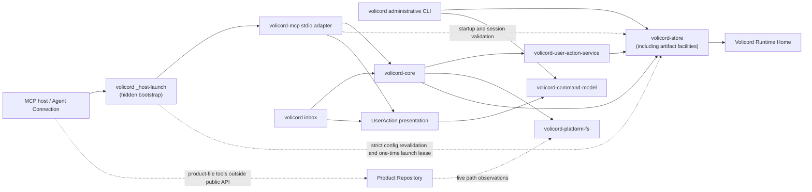

# Implementation architecture

This page is the top-level Architecture Guide overview for the local Rust
workspace. It owns guide-level operational paths, workspace shape, dependency
direction, durable implementation boundaries, and routes to focused detail
owners.

It is not a source map, workflow trace, testing strategy, change guide, or
product contract. Start at the [Architecture Guide](README.md) when you need a
learning route. Use the focused [Reference Index](../reference/README.md) for
exact behavior. The tables below route each implementation question to the
appropriate Architecture Guide page.

Volicord is the local work authority record for AI-assisted product work. Core
is the local authority record for Volicord state.

This checkout is the Volicord source repository and Rust workspace maintained
by this repository. It contains implementation crates, tests, documentation,
validation tooling, and repository configuration. A Volicord installation is a
deployed subset of executables and required runtime resources, so this
workspace overview is not an installation manifest.

Code and test paths that are meant to be opened directly are written relative
to the repository root.

## Operational paths

The diagram separates the three current entry paths: managed stdio MCP,
the administrative CLI, and the CLI inbox `User Channel`. Solid arrows show
the main call or storage direction. Dotted arrows show validation, observed
input, or work that stays outside public method execution.



The hidden launcher and `volicord-mcp` adapter library may use Store directly for startup
inspection, Agent Connection context, session validation, and request-time
project routing. That direct Store use is not an alternate implementation of
public Volicord method semantics; public method execution routes through Core.
The launcher stays in the original process, revalidates the current managed
configuration, issues a short-lived Registry lease, and passes the claim only
in memory to the MCP adapter. The public `volicord mcp serve` entry remains a
manual transport and always records `manual_cli`.

`Product Repository` remains a separate product-file boundary. Public Volicord
methods record owner-defined compatibility, observations, judgments, evidence,
and artifact links. Product-file writes themselves happen through an Agent
Connection, local tooling, or explicit administrative integration paths outside
the public method execution path. Shared types carry only platform-neutral
relative path identities and pure relationships. Core requests live
containment observations from `volicord-platform-fs`; semantic services receive
only the resulting relative identities and do not inspect the filesystem.

<a id="workspace-package-architecture"></a>

## Workspace package architecture

`workspace.metadata.architecture.packages` in the root `Cargo.toml` is the
single machine-readable owner for every current workspace package's semantic
group, responsibility, classification, production status, boundary, and
normal, development, and build dependency allowlists. `architecture-check`
compares those declarations with actual Cargo metadata, enforces the Core,
UserAction service, shared-types, Store, adapter, presentation, and test-support
boundaries, restricts each `*-wire` group to its matching adapter and
validation tooling or tests, and rejects normal/build dependency cycles.
`volicord-mcp-wire` is therefore unavailable to Core, shared types, Store,
UserAction service, CLI, and presentation packages even if an allowlist entry
were added. Development-only
backedges do not participate in the deployable graph.

The generated tables below are replaced by `docs-sync`. Exact module placement
remains in the [Source Map](source-map.md).

<!-- BEGIN GENERATED: workspace-package-architecture -->
<!-- Generated by `cargo run -p xtask -- docs-sync`; do not edit this region. -->

### Package responsibilities

Each current workspace package has one responsibility entry in the root Cargo metadata.

| Package | Group | Kind | Runtime | Boundary | Responsibility |
|---|---|---|---|---|---|
| `volicord-agent-evaluation` | `agent-evaluation` | validation | non-production | neutral | Standalone agent evaluation catalog, runner, schemas, and result harness. |
| `volicord-cli` | `cli-adapter` | adapter | production | adapter | Administrative CLI, local orchestration, Codex setup, rendering, and managed MCP supervision. |
| `volicord-command-model` | `command-model` | schema | production | neutral | Execution-free administrative command declaration, syntax model, and canonical invocation builders. |
| `volicord-conformance-tests` | `conformance-validation` | validation | non-production | neutral | Cross-method conformance scenarios over Core-facing APIs. |
| `volicord-core` | `core` | application | production | Core | Adapter-independent request orchestration, policy evaluation, method planning, and atomic commit coordination. |
| `volicord-host-contract` | `host-contract` | schema | production | Core-facing | Dependency-safe semantic host contracts and typed host correlation identities. |
| `volicord-integration-tests` | `integration-validation` | validation | non-production | neutral | Cross-layer integration, Agent Connection, and public contract snapshot tests. |
| `volicord-mcp` | `mcp-adapter` | adapter | production | adapter | MCP lifecycle, transport, tool projection, session binding, and Core invocation adapter. |
| `volicord-mcp-protocol` | `mcp-protocol` | schema | production | neutral | Host-independent MCP revision profiles and semantic capability registry. |
| `volicord-mcp-wire` | `mcp-wire` | schema | production | adapter | MCP request, result, error, structured-content, JSON-RPC envelope, and generated wire-schema ownership. |
| `volicord-platform-fs` | `platform-filesystem` | infrastructure | production | Core-facing | Invocation-scoped Product Repository observation, platform filesystem observation, publication, mutation admission, and Git layout primitives. |
| `volicord-platform-process` | `platform-process` | infrastructure | production | neutral | Platform child-process containment, termination, and pipe-readiness primitives. |
| `volicord-release-integrity-tests` | `release-integrity` | validation | non-production | neutral | Release packaging, version, canonical-byte, checksum, and workflow integrity validation. |
| `volicord-release-smoke` | `release-smoke` | validation | non-production | neutral | Cross-platform actual-binary release smoke orchestration and transcript validation. |
| `volicord-store` | `storage` | infrastructure | production | Core-facing | Canonical persistence, Runtime Home mechanics, strict persisted-row decoding into invariant-preserving typed records, and transaction application. |
| `volicord-test-process` | `test-process` | test support | non-production | neutral | Reusable bounded process execution and cleanup for tests and smoke harnesses. |
| `volicord-test-support` | `test-support` | test support | non-production | neutral | Reusable disposable Runtime Home, Store, Core request, and Agent Connection fixtures. |
| `volicord-types` | `shared-types` | schema | production | Core-facing | Dependency-safe shared schemas, identifiers, closed values, canonical encodings, platform-neutral path values, and adapter-neutral domain facts. |
| `volicord-user-action-presentation` | `user-action-presentation` | presentation | production | adapter | Typed CLI UserAction presentation, JSON Schemas, and command-model-backed recovery instructions. |
| `volicord-user-action-service` | `user-action-service` | application | production | Core-facing | Semantic UserAction validation, authority, lifecycle, persistence mapping, resolution, continuity, and projection from Store-validated typed records. |
| `xtask` | `repository-validation` | validation | non-production | neutral | Repository architecture, documentation, protocol fixture, release metadata, and Git-tree source-bundle validation, generation, and synchronization. |

### Allowed internal dependency directions

The lists are package-level allowlists by Cargo dependency kind. An em dash means that no internal package is allowed for that kind.

| Package | Normal | Development | Build |
|---|---|---|---|
| `volicord-agent-evaluation` | — | — | — |
| `volicord-cli` | `volicord-command-model`, `volicord-core`, `volicord-host-contract`, `volicord-mcp`, `volicord-mcp-protocol`, `volicord-platform-fs`, `volicord-platform-process`, `volicord-store`, `volicord-types`, `volicord-user-action-presentation`, `volicord-user-action-service` | `volicord-store`, `volicord-test-support` | — |
| `volicord-command-model` | — | — | — |
| `volicord-conformance-tests` | — | `volicord-core`, `volicord-host-contract`, `volicord-platform-fs`, `volicord-store`, `volicord-test-support`, `volicord-types`, `volicord-user-action-service` | — |
| `volicord-core` | `volicord-platform-fs`, `volicord-store`, `volicord-types`, `volicord-user-action-service` | `volicord-test-support` | — |
| `volicord-host-contract` | `volicord-types` | — | — |
| `volicord-integration-tests` | — | `volicord-core`, `volicord-mcp`, `volicord-mcp-wire`, `volicord-store`, `volicord-test-support`, `volicord-types` | — |
| `volicord-mcp` | `volicord-core`, `volicord-host-contract`, `volicord-mcp-protocol`, `volicord-mcp-wire`, `volicord-platform-fs`, `volicord-store`, `volicord-types`, `volicord-user-action-presentation`, `volicord-user-action-service` | `volicord-test-support` | — |
| `volicord-mcp-protocol` | — | — | — |
| `volicord-mcp-wire` | `volicord-mcp-protocol`, `volicord-types` | — | — |
| `volicord-platform-fs` | `volicord-types` | — | — |
| `volicord-platform-process` | — | — | — |
| `volicord-release-integrity-tests` | `volicord-store`, `volicord-types` | — | — |
| `volicord-release-smoke` | `volicord-mcp-protocol`, `volicord-test-process`, `volicord-types` | — | — |
| `volicord-store` | `volicord-host-contract`, `volicord-platform-fs`, `volicord-types` | `volicord-platform-fs`, `volicord-test-support` | — |
| `volicord-test-process` | `volicord-platform-process` | — | — |
| `volicord-test-support` | `volicord-host-contract`, `volicord-platform-fs`, `volicord-store`, `volicord-types` | — | — |
| `volicord-types` | — | — | — |
| `volicord-user-action-presentation` | `volicord-command-model`, `volicord-types` | — | — |
| `volicord-user-action-service` | `volicord-store`, `volicord-types` | `volicord-test-support` | — |
| `xtask` | `volicord-command-model`, `volicord-mcp-protocol`, `volicord-mcp-wire`, `volicord-types` | — | — |

<!-- END GENERATED: workspace-package-architecture -->

### Store mutation visibility

Store writable database opens and low-level mutation helpers remain
crate-private. External callers enter mutation paths through public APIs that
require a live, non-cloneable `RuntimeHomeMutationContext`, which in turn
borrows the exact `RuntimeHomeMutationPermit` held for one canonical Runtime
Home. Rust visibility and the unforgeable lifetime relationship prevent an
external crate from calling the internal opens or constructing a detached
mutation context. Compile-fail coverage protects both inaccessible Store entry
points and the permit-bound context lifetime.

## Core method ownership

`crates/volicord-core/src/methods/` owns public-method entry points and
request-specific orchestration. `methods/mod.rs` contains only module wiring; it
is not a helper prelude or a service locator. `operation_plan.rs` owns the
method-neutral execution carrier for Task and Change Unit identity, Store
mutations, and event payloads. Method-specific result fields and response
composition remain in each public method module.
Method modules import durable identity, artifact policy, continuity planning,
Write Ticket planning, close readiness, and record-reference conversion from
their focused Core owners. Store-backed acceptance, Task, enforcement, and
evidence reads live in `acceptance_facts.rs`, `task_facts.rs`,
`enforcement_facts.rs`, and `evidence_facts.rs`. `state_summary.rs`,
`evidence_projection.rs`, and `guarantee_projection.rs` are Store-independent
typed-fact-to-view projections.

Within the focused Write Ticket owner, `write_ticket/planning.rs` evaluates
focused semantic input and returns typed decision reasons, semantic record
identities, mutation facts, and one closed `PrepareWriteTicketPlan` branch:
identity-free issuance draft, reusable stored ticket, or no-ticket decision
paths. `WriteTicketPathScope` is the dependency-safe immutable path owner for
planned and stored tickets. The public `prepare_write` method owns dry-run
selection, durable ID allocation, state-versioned record references, guarantee
display, error-to-response mapping, and conversion to one closed
`MaterializedPrepareWriteTicket`. Its issued branch carries the validated
`PlannedWriteTicket` used for both insertion and response projection; its
reused and none branches cannot create an insertion.
`write_ticket/semantic.rs` provides the immutable semantic view shared by a
plan and an opaque Store-validated record; planned and stored lifecycle
identities remain in distinct types. `write_ticket/read_model.rs` acquires
typed stored-ticket, Task, workflow-policy, observation-time,
UserAction-resolution, and evidence facts. Its `WriteTicketCurrentFacts`
contains only the non-approval facts used by current-validity evaluation.
`write_ticket/approval.rs` is the only Write Ticket owner that consumes raw
UserAction authority values. It uniquely constructs the canonical approval
requirement and private current sensitive-approval identity set, then returns a
typed approval basis or `WriteTicketApprovalAssessment`. Summary evaluation,
reuse, Record Run admission, close readiness, and the CLI guard context consume
that assessment or an evaluated stored state derived from it.
`write_ticket/current_validity.rs` first closes terminal stored states, then
evaluates only active candidates into reusable or invalidated stored states.
Every resulting `StoredWriteTicketEvaluation` has a mandatory persisted
identity. `write_ticket/selection.rs` selects only among those stored
evaluations. `write_ticket/summary.rs` exposes separate planned and stored
projection paths without a Store handle or policy evaluation.
`write_ticket/service.rs` partitions terminal and active records before current
fact loading, evaluates the active partition, selects a stored result, and
loads evidence after selection. `write_ticket/admission.rs` combines a
`ReusableStoredWriteTicket` with the matching exact-attempt compatibility proof
and returns an `AdmissibleStoredWriteTicket` for protected mutation planning.
The Store remains independent of Core.

`ChangeUnitUpdate` schema accessors own exact method-field extraction, and
`change_unit_planning.rs` owns Change Unit mutation planning. `task_policy.rs`
owns Task lifecycle interpretation and lifecycle mutation planning.
`guidance.rs` owns typed semantic next-action selection and normalization,
while `summary_text.rs` owns adapter-neutral public summary wording. Neither
text owner emits CLI syntax, transport framing, Markdown, or terminal
rendering. Public method modules import these focused owners directly; Core has
no catch-all projection facade, helper prelude, or re-export service locator.

`method_execution.rs` contains only method-generic request preparation and plan
support. `method_rejection.rs` constructs method-neutral validation and
rejection responses. The focused modules under `error_boundary/` translate
Store, UserAction, close-readiness, artifact-policy, and Product Repository path
failures where those source and destination error models meet. Semantic owners
return typed facts, plans, or service errors and do not depend on public-method
response composition.

## Repository Observation responsibility boundaries

`volicord-host-contract` decodes exact source-specific Codex hook correlation
and classifies the prospective Product Repository effect.
`volicord-platform-fs::repository_observation` owns bounded stable repository
baselines and outcomes plus deterministic net deltas. CLI Guard modules adapt
the host events and project the host result. Store owns the exact
invocation-scoped aggregate, atomic pre/post transactions, expected-write
matching, strict replay, and Unrecorded Change materialization.

Core reads only Store-validated unresolved Unrecorded Changes for
reconciliation and close readiness. It does not capture snapshots, correlate
hook events, reconstruct deltas, or turn observation-unavailable diagnostics
into change facts. Exact behavior remains in
[Repository Observation](../reference/repository-observation.md); the focused
implementation flow remains in
[Repository Observation Boundary Design](design/repository-observation-boundary.md).

## Record Run responsibility boundaries

The `volicord.record_run` entry point remains in
`crates/volicord-core/src/methods/record_run.rs`. It verifies the method
envelope through the common Core pipeline, converts the public request to the
semantic `RecordRunInput`, delegates planning to
`crates/volicord-core/src/recording/`, maps the closed `RecordingError` model
to the public response branch, converts the returned operation and result facts
to `OperationPlan` and `RecordRunResultFields`, and records method-specific
workflow metrics. It does not own evidence, artifact, close-basis,
residual-risk, or Write Ticket policy.

The recording package keeps the operation flow typed:

1. `context.rs` normalizes the request and acquires the current typed Task,
   Change Unit, workflow, and control facts.
2. `authority.rs`, `evidence.rs`, and `artifact.rs` resolve Store-backed capture
   records and build typed authority, evidence-target, observation, producer,
   and artifact plans. Their policy decisions reuse `evidence_facts.rs`, `artifact.rs`,
   `volicord-user-action-service`, and the pure evidence policy modules; no
   recording module decodes a physical Store row.
3. `write_ticket/admission.rs` receives the typed operation facts, passes raw
   approval authority directly to `write_ticket/approval.rs`, and validates the
   current ticket from the returned assessment through the canonical Write
   Ticket policy.
   `close_readiness/recording.rs` resolves the typed close-basis and
   residual-risk inputs through the existing close-readiness and evidence
   policy owners.
4. `recording/plan.rs` assembles `RecordRunMutationPlan`. Its closed
   `RecordRunMutation` variants keep Run, Task, UserAction, Write Ticket,
   evidence, and artifact mutations distinct until the final Store-plan
   conversion.
5. `recording/state.rs` performs the Store-aware acquisition needed for the
   projected post-operation `StateSummary`. `recording/plan.rs` returns the
   closed `RecordRunOperationPlan`, whose `RecordRunEffect` and
   `RecordRunResultFacts` contain only semantic execution and result facts.

Store-aware recording services return typed facts, plans, or semantic errors;
they do not import public method request or response types and do not construct
`PipelineResponse`. Request identity, idempotency, expected-state, locale, and
response metadata remain in method orchestration. A semantic field crosses the
Recording boundary only when Recording evaluates it; project identity and
dry-run intent are examples used by current Record Run policy. Reusable pure
policy modules accept typed inputs and have no Store handle. The public method
layer alone maps semantic recording errors and result facts into response
envelopes.

## UserAction ownership

`crates/volicord-user-action-service/` owns reusable UserAction semantics.
Its responsibility modules cover validation, canonical typed request-body and
basis construction, source identity, authority, lifecycle interpretation,
materialization, persistence mapping, resolution, continuity derivation, and
adapter-neutral projections and summaries. The crate accepts explicit semantic
construction and persistence contexts, returns typed service errors and facts,
and depends on Store and shared types without depending on Core or adapters.
Its Store dependency is the focused `UserActionStoreReader` typed read
capability. Store returns invariant-preserving `StoredUserActionRequest`,
`StoredUserActionResolution`, and `StoredUserActionRecordSet` values with
private fields and typed semantic accessors. Physical row and serialized-value
representations, duplicated-column checks, request-resolution pairing, and
persisted corruption diagnostics remain private to Store. The service
evaluates semantic policy from those records and reports service-owned
invariant failures for inconsistent valid typed facts.

`crates/volicord-core/src/methods/user_action.rs` and `user_action_read.rs` own
request-specific invocation authority, Store transaction sequencing,
originating-result replay, method-result composition, and service-error
projection. `crates/volicord-core/src/continuity/` acquires typed continuity
facts and returns typed continuity plans using an injected durable-ID generator.
Callers supply semantic intent to the service; neither Core consumers nor
adapters construct canonical stored action JSON.

`volicord-types` derives the adapter-neutral `UserActionResolutionForm` from the
stored semantic request body. `volicord-user-action-presentation` projects
those facts into the typed `CliUserActionInboxResponse` and its closed
channel/capture-path states and JSON Schemas. Its command text comes from typed
`volicord-command-model` invocations derived from the actual Clap declaration.
CLI renders that typed model directly. MCP owns only its safe compound protocol
projection and maps neutral fact-read failures into MCP errors.
`methods/reconcile_changes.rs` and other Core consumers call the shared
responsibility owners directly and decide how typed UserAction results
participate in their own plans and responses. Production method modules do
not use sibling method implementations as reusable libraries.

Exact public behavior and schema meaning remain with
[Request User Action](../reference/api/method-request-user-action.md),
[Resolve User Action](../reference/api/method-resolve-user-action.md),
[Reconcile Changes](../reference/api/method-reconcile-changes.md), and
[User Action Schemas](../reference/api/schema-user-action.md). Store records and
effects remain with the focused [storage owners](../reference/storage.md).

## Core evidence and close-readiness boundaries

Core separates evidence fact acquisition from evidence policy evaluation.
Store performs strict owner-row decoding.
`crates/volicord-core/src/evidence_facts.rs` performs shared reads of
those typed records and constructs policy inputs for stored and projected
evidence. The responsibility-owned modules under
`crates/volicord-core/src/policy/` evaluate provenance, relevance and support,
target and `CurrentCloseBasis` matching, producer and artifact binding, and
close-readiness evidence interpretation. These evaluations are pure where
their inputs are already available.

Close readiness is owned by the responsibility package at
`crates/volicord-core/src/close_readiness/`. `mod.rs` exposes the
narrow typed surface used by method planners. `facts.rs` acquires one typed
current fact set, including acceptance criteria, workflow policy, and
unresolved-change reads through the current `CoreProjectStore`, and assembles
method projections without deciding readiness. `change_control.rs`,
`evidence.rs`, and `acceptance.rs`
evaluate their respective change/write, evidence/artifact, and user-authority
conditions. Write Ticket close conditions consume
`StoredWriteTicketEvaluation` values produced by the focused Write Ticket
service and do not receive raw approval authorities. Evidence evaluation calls
the focused pure policy modules under
`crates/volicord-core/src/policy/`; it does not reimplement provenance,
relevance, target, binding, or evidence-gate policy.

`policy.rs` resolves control from acquired facts and purely combines those
typed evaluations in close-contract order to select the close state. It accepts
no Store handle. `blockers.rs` constructs and normalizes the public
typed blocker projection. `guidance.rs` owns semantic continuation selection,
including the typed owner method and operation category; it does not construct
CLI commands, capture paths, Markdown instructions, adapter renderings, or
credentials. `summary.rs` owns the full close assessment and the smaller
method-neutral readiness projection. `service.rs` coordinates fact acquisition,
responsibility-owned evaluation, and pure policy combination through that
narrow API. `recording.rs` owns Record Run close-basis reference resolution,
current sensitive-action basis construction, and residual-risk input
validation; it calls the same typed evidence and close-readiness policy used by
`check_close`, `close_task`, and `status`. The pure current-basis and
user-authority compatibility functions shared with other Core domains remain
in `crates/volicord-core/src/policy/close_readiness.rs`.

`close_task.rs` is the request-specific close-operation orchestrator. It
validates the public request, invokes the close-readiness service, plans the
terminal mutation, and assembles the typed close result. `status` consumes the
readiness summary. `prepare_write` consumes the package's blocker projection
surface. `reconcile_changes`, `intake`, `update_scope`, `record_run`, and
`user_action` pass their projected typed facts to the readiness service. No
method module provides reusable close-readiness policy or adapter presentation
to sibling methods.

Production method modules name dependencies from the applicable Core pipeline,
service, policy, Store, or `volicord-types` owner. The methods parent module
owns only genuinely shared coordination helpers; it is not an import prelude
for child modules. Exact evidence and close-readiness meaning remains with
[Core Model](../reference/core-model.md), the applicable
[API method owners](../reference/api/methods.md), the
[state schema](../reference/api/schema-state.md), the
[artifact schema](../reference/api/schema-artifacts.md), and the focused
[storage owners](../reference/storage.md).

## Canonical release boundaries

Boundary adapters decode their owner-defined current inputs into one canonical
internal model. Codex wire boundaries explicitly choose a semantic
`volicord-host-contract` profile; they do not infer a profile from field shape
or reuse MCP correlation as hook correlation. Core and Store do not branch on host configuration syntax,
shell syntax, generated wrappers, or platform command strings. Store opens only
the database whose manifest and canonical SQL digests match the current release
contract. The Codex adapter owns Codex configuration parsing, serialization,
and managed-entry validation. The platform filesystem boundary separately owns
process target and environment observation plus target and filesystem
validation. It also owns canonical Product Repository root and candidate-path
observation, including nearest-existing-ancestor and link containment checks,
and returns opaque typed observations to Core. MCP validates current
Store-owned runtime/project sessions and supplies Core with a typed
`ValidatedAgentSession`.

The failure, storage, and Agent Connection contracts remain in
[Failure Model](../reference/failure-model.md),
[Storage Versioning](../reference/storage-versioning.md),
[Agent Connection](../reference/agent-connection.md).

### Activation-state ownership

Activation is one typed projection across existing boundaries:

```text
host/config inspection + Store session/event evidence
  -> volicord-cli focused checks and one hierarchical activation plan
  -> volicord-types ConnectionVerificationReport + IntegrationActivationPlan
  -> concise / verbose / JSON projections
```

`volicord-types` owns `HookActivationState`,
`IntegrationActivationState`, focused check dependencies, stable
`ActivationStep` metadata, deterministic prerequisite ordering, and the closed
`IntegrationVerificationWorkflowState` with canonical typed tool references.
The report is the only activation-plan owner; host plans and effects contain no
parallel action list. `volicord-cli` collects current managed configuration,
host reload, hook-source, session, capability, Guard, and separate
project-trust evidence. `volicord-store` preserves the Guard definition
boundary and is the single domain projector from an immutable semantic
verification coordinate to the shared workflow state. `volicord-host-contract`
owns the semantic synchronous/deferred observation policy; the current Codex
contract selects one synchronous status read without a version branch. Begin,
probe, get, `volicord-mcp`, CLI checks, and generated host guidance all consume
that projection. Exact replay retains the same verification ID and state;
`complete` and typed `repair_required` remain terminal. Adapters and renderers
do not derive parallel state or classify summary prose. The user-level
`request_integration_verification` step nests list, begin, workflow-directed
probe, and workflow-directed status calls; the Guard probe is not a top-level
user action.

The CLI projects Guard through two independent check/evidence paths.
`AmbientGuardCoverageEvidence` owns current-definition and configured-phase
coverage. `CorrelatedGuardAttemptEvidence` and `CorrelatedGuardProof` own the
latest attempt and latest completed proof. Report context gathers both Guard
and managed-MCP runtime sessions, canonicalizes their four closed evidence
roles, and carries relevant verification IDs. Typed repair reason and
acquisition stage select diagnostics; renderer wording and numeric Codex
versions do not.

Within Store, the integration-verification facade delegates create/resume,
probe acknowledgement, event correlation, bounded observation, typed
repair/retry projection, coordinate validation, and SQL row conversion to
lifecycle-specific modules. Each
mutating entry point owns its immediate Registry transaction; row and
coordinate helpers do not open transactions or expose database
representations outside Store.

Host-provided disabled, policy-managed, or invocation-bypass evidence is
accepted only through the typed host evidence boundary. In its absence,
Volicord can establish hook effectiveness from a compatible event for the
current definition or report `unknown`; it cannot manufacture a trust state.
Core authorization remains separate and still validates every managed MCP call.

## Durable implementation boundaries

| Boundary | Overview responsibility | Detail and contract routes |
|---|---|---|
| Shared diagnostic structures | `volicord-types` owns the lifecycle-specific finding inputs, current-key identity and digest derivation, dependency-safe read-only finding, cause and action representations, the selected-Connection report, the separate immutable MCP preflight and active-verification evidence types, and the separate lifecycle-aware exact-lookup envelope. Each domain owner maps its closed typed failures and facts into those structures; persistence, verification, and rendering stay with their existing owners. | [Source Map](source-map.md), [Testing Strategy](testing-strategy.md), [Failure Model](../reference/failure-model.md), and [Security](../reference/security.md). |
| Administrative command model | `volicord-command-model` owns the complete Clap declaration, syntax DTOs and validators, public/hidden classification from the actual command tree, root-command construction, command-path traversal, canonical synopses, canonical parseable public invocations, and typed invocation builders that derive paths and option spellings from the same tree. It does not start processes, dispatch commands, call Core or Store, render output, resolve Runtime Homes, or run application services. | [CLI Workflows](cli-workflows.md), [Source Map](source-map.md), and [Administrative CLI](../reference/admin-cli.md). |
| CLI operational diagnostics | `volicord-cli` keeps immutable operational definitions, closed typed subjects and facts, typed action selection, and owner-scoped current-condition persistence in `operational_diagnostics`. The separate Connection verification package coordinates host, MCP, and Guard checks, dependency-graph evaluation, report inputs, immutable preflight construction, active write/conformance evidence, and projection of those typed observations into findings. Store remains the lifecycle and query implementation owner. | [Source Map](source-map.md), [Failure Model](../reference/failure-model.md), [Administrative CLI](../reference/admin-cli.md), and [Agent Connection](../reference/agent-connection.md). |
| Diagnostic persistence and queries | `volicord-store` creates the non-authority diagnostics carrier through complete staged initialization and atomic publication before caller data, then separates insert-only occurrences, replaceable current snapshots, cause-graph validation and traversal, lifecycle-aware exact lookup and graph APIs, current-report projection, and internal row encoding. Exact reads retain occurrence/current lifecycle, active/resolved state, and resolution time; reportable reads project only eligible occurrences and active current findings. | [Source Map](source-map.md), [Storage](../reference/storage.md), [Storage Records](../reference/storage-records.md), and [Failure Model](../reference/failure-model.md). |
| Core and adapters | Core owns adapter-independent public method handling, adapter-neutral semantic facts, and typed neutral operational failures when a required dependency cannot produce a method result. Operational failures remain outside public response branches and shared method `ErrorCode` schemas. Shared UserAction presentation owns CLI-oriented projection from semantic facts; CLI owns terminal rendering and runtime-error mapping, while MCP owns protocol envelopes, its operational wire identity, and capability-selected failure projection. Core does not depend on any adapter or presentation layer. Read-only callers construct `CoreService` from a path; admitted callers construct it only from `RuntimeHomeMutationContext`, with no second Runtime Home coordinate. | [Request Lifecycle](request-lifecycle.md), [Implementation Design Patterns](design-patterns.md), [Core and adapter dependency boundary](design/core-adapter-boundary.md), [API Methods](../reference/api/methods.md), [MCP Transport](../reference/mcp-transport.md), and [Administrative CLI](../reference/admin-cli.md). |
| Codex host-wire contracts | `volicord-host-contract` owns `CodexMcpTurnMetadata`/`codex-mcp-turn-metadata`, `CodexCommandHooks`/`codex-command-hooks`, and `CodexMcpCallableNames`/`codex-mcp-callable-names`; deterministic profile digests; bounded values and failures; non-interchangeable correlation types; and the explicit `McpServerKey` plus complete `McpRawToolName` projection to `HostCallableIdentity`. It also owns the typed hook-routing strategy that unifies reviewed native host tools with server-qualified MCP routing, using the registered namespace where representable and catalog-derived exact callables otherwise. Generated configuration projects that strategy and strict audit reconstructs it. The canonical `AgentToolId` catalog assigns every tool exactly one integration-verification role—probe target, workflow control, or unrelated known tool—and `McpToolCatalog` rejects contradictory role metadata as well as normalized collisions. Routing delivers events; Store resolves callable and role before probe coordinates. Workflow controls and other known tools are bounded nonterminal trace, while only the probe target proceeds to session, turn, verification-ID, and tool-use checks. No host behavior is selected from a Codex package version. | [Source Map](source-map.md), [MCP Transport](../reference/mcp-transport.md), [Agent Connection](../reference/agent-connection.md), [Storage Records](../reference/storage-records.md), and [Failure Model](../reference/failure-model.md). |
| Runtime Home and Product Repository | `Volicord Runtime Home` holds Volicord runtime records and artifact data as storage/runtime owners define them. `Product Repository` holds user product files and explicit integration files where owner documents allow them. | [Storage and Transactions](storage-and-transactions.md), [Runtime Home and Product Repository separation](design/runtime-home-and-product-repository.md), [Runtime Boundaries](../reference/runtime-boundaries.md), and [Security](../reference/security.md). |
| Runtime Home bootstrap | `volicord-store` inspects an existing Registry read-only against the exact current manifest and physical schema. An absent final path is prepared in same-parent staging with an opaque publication ID, its singleton, and initial installation profile. A successful atomic no-replace rename creates an invocation-specific publication guard before parent synchronization and read-back validation. `AlreadyExists` returns only the exact read-only current winner. | [Runtime Boundaries](../reference/runtime-boundaries.md), [Storage Versioning](../reference/storage-versioning.md), [Storage Records](../reference/storage-records.md), and [Storage DDL](../reference/storage-ddl.md). |
| Runtime Home mutation admission | `volicord-platform-fs` owns one shared/exclusive OS-backed coordination region per canonical Runtime Home. `SharedWriter` admits concurrent ordinary writers, while `ExclusiveSetup` conflicts with every shared or exclusive holder. A borrowed permit carries the exact canonical target and held mode to `volicord-store`, which derives a non-cloneable `RuntimeHomeMutationContext` required by writable database opens and mutation APIs. Setup derives that context from its one exclusive permit; CLI, MCP, Guard, Core, operational-session, diagnostic, and artifact operations retain a shared-derived context through their complete effects. Its `CanonicalRuntimeHomePath` is the only post-admission identity for mutation-dependent planning, reads, services, handles, diagnostics, effects, and responses; aliases cannot introduce a second authority coordinate. The coordination file is outside the Runtime Home, and the lock is coordination rather than actor identity, a credential, or a security boundary. | [Source Map](source-map.md) and [Runtime Boundaries](../reference/runtime-boundaries.md). |
| Init setup transaction | `volicord-cli` acquires `ExclusiveSetup` mutation admission for the canonical Runtime Home before inspection and planning, then builds one read-only typed plan for Runtime Home, Store, Codex configuration, repository managed files, and activation. The same non-cloneable lease remains held through preparation, publication, Store and file commit, reporting, cleanup, preservation, or complete rollback; its coordination file is outside the rollbackable Runtime Home and closing the OS handle releases ownership. Prepare validates snapshots and stages same-directory files while `volicord-store` prepares and checkpoints recovery entries. A supported concurrent setup is reported as busy before planning. An unexpected `AlreadyExists` while leased aborts the stale plan without Store or managed-file mutation. Failures use bounded reverse rollback; Runtime Home removal requires the owned guard to revalidate the exact publication ID, Runtime Home identity, manifest, paths, schema, installation identity, and absence of managed-host consumption. Platform removal reports recursive effect, exact-path observation, failure phase, and parent-entry durability independently. Known removal and incomplete removal both make the guard terminal, and confirmation failure retains its primary error together with the complete rollback result. This is not global cross-filesystem atomicity. | [Administrative CLI](../reference/admin-cli.md), [Runtime Boundaries](../reference/runtime-boundaries.md), [Agent Connection](../reference/agent-connection.md), and [Failure Model](../reference/failure-model.md). |
| Project Store facade and aggregate ownership | `CoreProjectStore` remains the project-database facade. Its handle and open entry points are infrastructure-owned, while aggregate modules own their grouped typed mutation inputs, storage validation and SQL application, column projections, private raw-row shapes, strict decoding, invariant-preserving typed read records, inherent facade methods, and focused tests. Core and services consume those typed fields directly; they do not decode physical JSON, closed strings, timestamps, or Product Repository paths and do not construct Store corruption. The Write Ticket aggregate exclusively owns its physical table, columns, normal and transaction-scoped canonical decoder, and persisted cross-field invariants. Workflow-policy persistence consumes only a focused typed authority view produced from that decoder. Exact committed method response bytes remain the explicit semantic replay exception and are interpreted by their Core method owner. Task and acceptance, Change Unit, Write Ticket, Run, evidence, artifact, User Action, and continuity responsibilities live under `core_pipeline/`; workflow-policy records and their mutation group remain in `workflow_records.rs`. Project state, replay identity, reconciliation observations, blockers, events, Agent Sessions, and clock data retain their focused infrastructure modules. | [Storage and Transactions](storage-and-transactions.md), [Source Map](source-map.md), [Storage](../reference/storage.md), and [Storage Records](../reference/storage-records.md). |
| Store commit boundary | Core method planners choose read-only, no-effect, dry-run, staging, or committed branches. A thin static mutation dispatcher preserves planner order and delegates to aggregate owners. The commit coordinator owns only the immediate transaction, replay and freshness gates, one canonical state-version advance, event and replay persistence, response construction, and commit or rollback. Artifact staging stays separate from normal Core mutation commit. Core authority meaning stays with Core owners; exact storage records and effects stay with storage owners. | [Storage and Transactions](storage-and-transactions.md), [Request Lifecycle](request-lifecycle.md), [Core Model](../reference/core-model.md), [Storage](../reference/storage.md), and [Storage Effects](../reference/storage-effects.md). |
| MCP protocol-profile and conformance boundary | `volicord-mcp-protocol` owns the closed typed revision set, reviewed production profiles, message/tool/schema feature declarations, explicit iteration order, and preferred server revision. The generic executable conformance test and CLI server probe iterate that production registry directly. CLI conformance uses only fresh disposable Runtime Home and Product Repository state; selected live databases are limited to explicit rollback-only writeability probes. `xtask` independently enforces exact parity between released manifest production support and the same compiled registry. Host compatibility fixtures remain independently pinned and do not own server preference or revision conformance. | [Source Map](source-map.md), [Testing Strategy](testing-strategy.md), and [MCP Transport](../reference/mcp-transport.md). |
| MCP adapter boundary | `volicord mcp serve` is the public manual transport entry path; only the hidden launcher's in-memory lease claim may create a `managed_host` runtime. The `stdio` facade delegates to responsibility-owned modules for bounded transport, JSON-RPC envelopes, lifecycle, Runtime Home/repository/Connection binding, tool dispatch, and telemetry. Lifecycle uses closed `SessionState` variants: initialization selection cannot exist before initialize, ready-only session data cannot exist before the initialized transition, and termination data exists only in `Closed`. Framing has no result-projection knowledge, JSON-RPC parsing performs no Core operation, lifecycle admits messages, binding selects routing identity, and tool dispatch decodes calls and invokes the adapter without owning framing. `volicord-types` supplies the closed `AgentToolId` identity catalog, reusing `MethodName` for Core-owned tools and binding operational verification roles at compile time. `volicord-mcp` keys the canonical registry by that identity and projects wire names, definitions, method results, and MCP-owned operational failures through the selected semantic profile instead of forking tool ownership by revision. The adapter resolves its pre-operation Runtime Home and Agent Connection routing context, then requires each live mutation context to match that routing identity. It uses the admitted identity for project routing, diagnostics, Store access, and Core construction, derives adapter-managed local invocation facts, wraps Core JSON as MCP content, and maps neutral Core operational failures without creating a method response. | [Request Lifecycle](request-lifecycle.md), [Source Map](source-map.md), [MCP Transport](../reference/mcp-transport.md), and [Agent Connection](../reference/agent-connection.md). |
| Administrative CLI and Codex adapter | `volicord-cli` owns process startup and dispatch over parsed command-model DTOs, Codex configuration discovery, managed-entry installation and validation, dependency-aware verification policy, deterministic diagnostic root selection, concise/verbose/JSON selected-Connection reports, lifecycle-aware finding and runtime-session lookup output, repair, uninstall, and the hidden same-process host launcher. The launcher revalidates the exact current entry before issuing a one-time Store lease; it does not place lease material in configuration, arguments, environment, or output. Lookup success is independent of stored finding severity. The Codex adapter converts the canonical managed launch contract to and from Codex TOML while preserving only the allowed tool-approval overlay. It does not classify Linux or WSL2. | [CLI Workflows](cli-workflows.md), [Source Map](source-map.md), [Administrative CLI](../reference/admin-cli.md), [Agent Connection](../reference/agent-connection.md), and [Security](../reference/security.md). |
| Release integrity | `xtask` creates and validates the one deterministic source ZIP from an exact committed Git tree, including tracked file types, contents, and modes without walking the working directory. Generic checks cover every published Volicord target, package and checksum continuity, source-bundle workflow routing, and workflow semantics. One reusable workflow action invokes the dedicated `tests/release-smoke` package exactly once after the local debug build in ordinary CI and exactly once for every native release target before artifact staging. The package exercises the exact supplied binary through public manual stdio with a stable test-owned Codex fixture and remains separate from optional real-Codex observation and managed-host evidence. | [Testing Strategy](testing-strategy.md) and [Validation](../maintain/validation.md). |
| Platform filesystem facade | `volicord-platform-fs` observes the process target and kernel, distinguishes native Linux from WSL2, validates the WSL2 distribution through `/etc/os-release`, and supplies path-filesystem observations for target-path restriction enforcement. It exclusively owns live Product Repository root and candidate-path observation, private canonical identities, nearest-existing-ancestor handling, link containment, and typed path diagnostics; Core consumes its opaque observation and semantic services never receive filesystem coordinates. Its repository observer builds bounded stable invocation-scoped baselines and outcomes over the complete status and typed invocation candidate sets, then combines both snapshots with changed-tree candidates to calculate deterministic content- and mode-aware net path transitions or return a typed unavailable outcome. It also isolates effect-aware no-replace regular-file publication with parent-entry durability, platform-native namespace primitives, per-canonical-Runtime-Home shared/exclusive mutation admission, borrowed permits, and canonical read-only Git common-directory/worktree discovery. It does not decide which files are managed, whether a replacement or write is authorized, or what recovery means. | [Source Map](source-map.md), [CLI Workflows](cli-workflows.md), [Administrative CLI](../reference/admin-cli.md), [Runtime Boundaries](../reference/runtime-boundaries.md), [Repository Observation](../reference/repository-observation.md), and [System Requirements](../reference/system-requirements.md). |
| Platform process facade | `volicord-platform-process` exposes safe bounded child-process containment and child-pipe readiness APIs. It owns low-level process groups, Windows Job Objects, nonblocking pipe configuration, and pipe polling. `volicord-cli` retains MCP supervision policy, lifecycle deadlines, protocol framing, exchange progress, and diagnostics. | [Source Map](source-map.md), [CLI Workflows](cli-workflows.md), [Administrative CLI](../reference/admin-cli.md), and [Agent Connection](../reference/agent-connection.md). |
| Test process boundary | `volicord-test-process` owns reusable bounded child execution for repository tests and smoke harnesses. It creates platform containment before spawn, pumps bounded stdio under one lifecycle deadline, terminates the process tree on timeout or failure, reaps the direct child, and bounds final pipe cleanup. It exposes no Volicord product API, and product process policy remains in `volicord-cli`. | [Source Map](source-map.md) and [Testing Strategy](testing-strategy.md). |
| Tests and validation | Implementation tests verify owner-defined facts at the appropriate layer. MCP module tests are partitioned by lifecycle, batching, protocol projection, tool calls, managed-host observation, diagnostics, and conformance contracts, with shared setup isolated from those assertions. MCP production support requires a pinned released manifest entry and a production profile with exact set parity enforced by the lightweight checker. The independent registry-driven conformance test executes actual wire behavior for every production profile. Tracked pre-release schemas remain outside production iteration, and local conformance is not external certification. Tests, fixtures, generated snapshots, and documentation checks do not become product contract owners. | [Testing Strategy](testing-strategy.md) and [Validation](../maintain/validation.md). |

## Detail routes

| Need | Route |
|---|---|
| Exact source paths, module responsibilities, CLI submodule boundaries, adapter modules, and test-support paths | [Source Map](source-map.md) |
| First-pass reading order through crates, entry symbols, and implementation flows | [Codebase Tour](codebase-tour.md) |
| Setup, connection provisioning, status, verification, doctor, guard, host integration, and guard integration execution-flow boundaries | [CLI Workflows](cli-workflows.md) |
| Representative MCP/Core request flow, branch differences, method traces, Store interaction, and response wrapping | [Request Lifecycle](request-lifecycle.md) |
| Store transactions, effect paths, replay, artifact staging, commit boundaries, and failure boundaries | [Storage and Transactions](storage-and-transactions.md) |
| Test-layer choice, fixtures, generated-output drift checks, durable tests, and validation responsibilities | [Testing Strategy](testing-strategy.md) |
| Change classification, owner routing, source-path routing, and validation-command selection | [Implementation Guide](change-guide.md) |
| Current implementation design, invariants, responsibility and failure boundaries, scope exclusions, implementation routes, and Reference owners | [Architecture Design](design/README.md) |

## Design reference routes

Focused implementation concerns have current design references:

| Boundary | Design reference |
|---|---|
| Agent Connection, host routing, and explicit Connection Project membership | [Agent Connection and host routing](design/agent-connection-routing.md) |
| Core independence from MCP and CLI adapters | [Core and adapter dependency boundary](design/core-adapter-boundary.md) |
| Method planning before normal committed Store mutation | [Planning before atomic mutation commit](design/plan-and-atomic-commit.md) |
| Invocation-scoped repository baselines, outcomes, deltas, and exact expected-write matching | [Repository Observation boundary](design/repository-observation-boundary.md) |
| Runtime data separated from product files | [Runtime Home and Product Repository separation](design/runtime-home-and-product-repository.md) |
