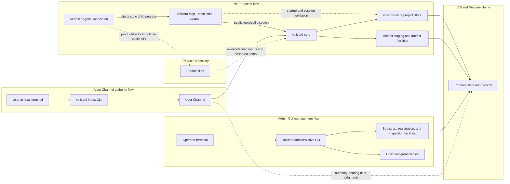
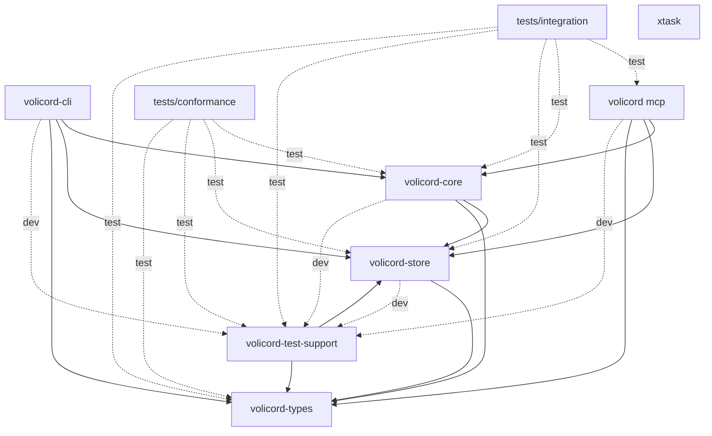

# Implementation architecture

This guide owns guide-level implementation structure and execution-flow explanation for the local Rust workspace. It helps implementers locate code, understand responsibility boundaries, and route code questions to the contract owners.

It does not define or override public API behavior, request or response fields, schema meaning, storage effects, DDL or table columns, security guarantees, runtime enforcement, Core authority semantics, or product contracts. Use the [Architecture Guide](README.md) entry point for the source-code learning path, the [Codebase Tour](codebase-tour.md) for crate-by-crate first files and symbols, the [Source Map](source-map.md) for exact source paths and module responsibilities, the [Request Lifecycle](request-lifecycle.md) for representative method traces, [CLI Workflows](cli-workflows.md) for administrative CLI execution-flow boundaries, [Implementation Design Patterns](design-patterns.md) for recurring implementation structures, [Storage and Transactions](storage-and-transactions.md) for Store commit and artifact boundaries, [Testing Strategy](testing-strategy.md) for test-layer choice, [Architecture Decisions](decisions/README.md) for focused decision records, the [Implementation Guide](change-guide.md) for change workflow, and the focused Reference owners for exact behavior.

Volicord is the local work authority record for AI-assisted product work. Core is the local authority record for Volicord state.

Code and test paths that are meant to be opened directly are written relative to the repository root.

This checkout is the Volicord source repository and Rust workspace for the repository-maintained Volicord implementation. It contains implementation crates for Core, storage, shared types, the `volicord` administrative CLI and MCP process entry, the `volicord-mcp` adapter library, tests, documentation, validation tooling, and repository configuration. A Volicord installation is a deployed subset of executables and required runtime resources, so this workspace overview must not be read as an installation manifest.

## Operational paths

This guide-level map shows which local implementation components and file
boundaries participate in the main operational paths. It orients execution
paths for implementers; it is not a public API contract, installation manifest,
storage ERD, or user workflow.

Read solid arrows as primary local call or record-access paths and dotted
arrows as validation, authority-record, observed-input, or outside-public-API
relationships. The `Volicord Runtime Home` and `Product Repository` boxes are
storage/file boundaries, not process containers; the Product Repository remains
outside the Runtime Home. Exact behavior belongs to the source areas and
Reference owners named in the surrounding sections.

The Volicord implementation in this repository has three distinct operational path shapes:

- MCP host -> `volicord mcp --stdio` -> `volicord-mcp` adapter library -> `volicord-core` -> Store and artifact facilities under `Volicord Runtime Home`.
- Operator -> `volicord` administrative CLI -> bootstrap and registration facilities -> `Volicord Runtime Home` and host configuration files.
- User at a local terminal -> `volicord inbox` CLI -> `volicord-core` -> Store under `Volicord Runtime Home`, using the `User Channel`.

The `volicord-mcp` adapter library also uses `volicord-store` directly during startup and request routing. That Store use checks Runtime Home, Agent Connection state, Connection Projects membership, project availability, `connection.mode`, `operation_category`, and `actor_source` provenance before dispatching a public method to Core. It is not an alternate implementation path for public Volicord method semantics, which route through `volicord-core`.

`Product Repository` remains a separate product-file boundary. The public Volicord API records owner-defined compatibility, observations, and artifact links; product-file writes themselves happen through an Agent Connection or local tooling outside the public API path.

## Workspace shape

The Cargo workspace contains these members:

| Workspace member | Cargo package | Targets | Guide-level role |
|---|---|---|---|
| `crates/volicord-types` | `volicord-types` | Library | Shared Rust request, response, schema-shaped, value-set, MCP tool-name, identifier, and canonical-hash types. |
| `crates/volicord-store` | `volicord-store` | Library | SQLite, Runtime Home, bootstrap, project Store, artifact storage, inspection, guard/session observation storage, local web consent storage, export snapshots, and storage-error implementation. |
| `crates/volicord-core` | `volicord-core` | Library | Core service, shared request pipeline, method planning, policy checks, and Store coordination. |
| `crates/volicord-cli` | `volicord-cli` | Library and `volicord` binary | Local administrative CLI for Runtime Home setup, project registration, User Channel commands, Agent Connection setup, host adapters, and the public `volicord mcp` process entry. |
| `crates/volicord-mcp` | `volicord-mcp` | Library | MCP stdio adapter, startup validation, tool listing, `tools/call` dispatch, and Core invocation. |
| `crates/volicord-test-support` | `volicord-test-support` | Library | Disposable Runtime Home, Store, Core, and fixture helpers shared by implementation tests. |
| `tests/conformance` | `volicord-conformance-tests` | `baseline` test target | Baseline cross-method scenarios that exercise owner-defined behavior through Core-facing APIs. |
| `tests/integration` | `volicord-integration-tests` | `mcp_connection` and `public_contract_snapshots` test targets | Cross-layer MCP, Core, Store, Agent Connection binding, operation-category, and public schema snapshot verification. |
| `xtask` | `xtask` | Library and `xtask` binary | Repository maintenance tooling for read-only documentation validation. It is not part of Volicord runtime architecture. |

Internal dependency direction from the Cargo manifests:

| Member | Normal internal dependencies | Test-only internal dependencies |
|---|---|---|
| `volicord-types` | None | None |
| `volicord-store` | `volicord-types` | `volicord-test-support` |
| `volicord-core` | `volicord-store`, `volicord-types` | `volicord-test-support` |
| `volicord-cli` | `volicord-core`, `volicord-mcp`, `volicord-store`, `volicord-types` | `volicord-store` with `test-support`, `volicord-test-support` |
| `volicord-mcp` | `volicord-core`, `volicord-store`, `volicord-types` | `volicord-test-support` |
| `volicord-test-support` | `volicord-store`, `volicord-types` | None |
| `tests/conformance` | None; the package contains only test targets | `volicord-core`, `volicord-store`, `volicord-test-support`, `volicord-types` |
| `tests/integration` | None; the package contains only test targets | `volicord-core`, `volicord-mcp`, `volicord-store`, `volicord-test-support`, `volicord-types` |
| `xtask` | None | None |

The next Mermaid diagram shows which workspace members may depend on which
other internal packages. It uses Cargo dependency direction, not runtime
process topology, and exactness belongs to the Cargo manifests. Solid arrows
point from a crate or package to a normal internal dependency. Dashed `dev` and
`test` arrows are development and test-only dependency edges.

The durable dependency boundaries are:

- Core does not depend on CLI or MCP adapter crates.
- MCP may depend on Core, Store, and shared types for distinct responsibilities: transport and dispatch, Agent Connection startup validation, request-time project routing, and typed request handling.
- The administrative CLI uses Store, MCP, and shared types for local setup, registration, process-mode handoff, and preflight orchestration. Its `volicord inbox` command path also depends on Core to invoke selected Core-facing methods through the `User Channel`.
- Store depends on shared types.
- Test-support and test packages compose implementation crates only for disposable fixtures and cross-layer verification.
- `xtask` has no internal product-crate dependencies. Documentation-tooling dependencies stay isolated in the maintenance crate.

## Source map route

This page keeps the workspace dependency and execution-flow view. Use the
[Source Map](source-map.md) for exact source paths, module responsibilities,
CLI submodule boundaries, host-adapter placement, guard integration placement,
MCP adapter modules, and test-support paths. Source placement remains
implementation guidance; exact behavior stays with the focused Reference
owners.

## Design responsibility map

Use this map when you need the implementer view of a product area. It names the
durable source area or development page to read first, then the contract owner
that keeps public behavior precise.

| Design topic | Implementer orientation | Contract owner route |
|---|---|---|
| Architecture overview | This page's operational paths, workspace shape, and dependency boundaries; [CLI Workflows](cli-workflows.md) for administrative CLI execution flows; [Source Map](source-map.md) for exact source ownership. | [Runtime Boundaries](../reference/runtime-boundaries.md), [Scope](../reference/scope.md), and [Security](../reference/security.md). |
| Core pipeline | [Request Lifecycle](request-lifecycle.md) for representative request flow, [Storage and Transactions](storage-and-transactions.md) for Store commit boundaries, and [Source Map](source-map.md) for Core paths and policy/method module ownership. | [API Methods](../reference/api/methods.md), [API Schema Core](../reference/api/schema-core.md), and [Storage Effects](../reference/storage-effects.md). |
| Store, events, and projections | [Storage and Transactions](storage-and-transactions.md) for Store transactions, replay, artifact staging, and failure boundaries, and [Source Map](source-map.md) for Store paths and module ownership. | [Storage Records](../reference/storage-records.md), [Storage Versioning](../reference/storage-versioning.md), and [Projection and Templates](../reference/projection-and-templates.md). |
| MCP adapter | [Request Lifecycle](request-lifecycle.md) for adapter-to-Core request flow and [Source Map](source-map.md) for MCP adapter paths. | [MCP Transport](../reference/mcp-transport.md), [Agent Connection](../reference/agent-connection.md), and [API Methods](../reference/api/methods.md). |
| CLI architecture | [CLI Workflows](cli-workflows.md) for setup, connection provisioning, status and verification, doctor diagnostics, guard lifecycle, host integration, and guard integration boundaries; [Source Map](source-map.md) for exact source ownership. | [Administrative CLI](../reference/admin-cli.md), [Runtime Boundaries](../reference/runtime-boundaries.md), and [Agent Connection](../reference/agent-connection.md). |
| Write ticket design | [Source Map](source-map.md) for Core policy and method paths, plus Core and conformance tests for implementation verification. | [Core Model](../reference/core-model.md), [Prepare-write Method](../reference/api/method-prepare-write.md), [Record-run Method](../reference/api/method-record-run.md), and [Storage Effects](../reference/storage-effects.md). |
| Judgment Inbox design | [Source Map](source-map.md) for Core judgment, CLI User Channel, MCP elicitation, and local web consent source ownership. | [Administrative CLI](../reference/admin-cli.md#user-channel-commands), [Agent Connection](../reference/agent-connection.md), [Judgment Schemas](../reference/api/schema-judgment.md#judgmentinboxitem), [Request-user-judgment Method](../reference/api/method-request-user-judgment.md#volicordrequest_user_judgment), and [Record-user-judgment Method](../reference/api/method-record-user-judgment.md#volicordrecord_user_judgment). |
| Detective and session-watch design | [Source Map](source-map.md) for guard command, guard integration, host integration, and session-watch storage ownership. | [Administrative CLI](../reference/admin-cli.md#guard-hook-commands), [Storage Records](../reference/storage-records.md), [MCP Transport](../reference/mcp-transport.md), and [Security](../reference/security.md). |
| Local HTTP design | [Source Map](source-map.md) for local HTTP and local web consent adapter paths. | [MCP Transport](../reference/mcp-transport.md), [Administrative CLI](../reference/admin-cli.md), and [Security](../reference/security.md). |

This map is for source navigation. If source and Reference disagree, treat that
as an owner-routing or implementation gap rather than inferring a new product
contract from the code.

## Request And Storage Boundary Routes

This overview keeps only the top-level implementation boundaries. Detailed
request traces belong in [Request Lifecycle](request-lifecycle.md); Store
transaction, effect, artifact staging, and failure boundaries belong in
[Storage and Transactions](storage-and-transactions.md).

| Boundary | High-level role | Detail route |
|---|---|---|
| MCP adapter | Owns stdio transport handling, startup/session validation, project routing, adapter-managed request facts, typed request decoding, and MCP response wrapping before or after Core invocation. | [Request Lifecycle](request-lifecycle.md), [Source Map](source-map.md), [MCP Transport](../reference/mcp-transport.md), and [Agent Connection](../reference/agent-connection.md). |
| Core pipeline | Owns common preflight, method-policy selection, prepared request context, branch routing, and Store coordination. Core stays independent of CLI and MCP adapter crates. | [Request Lifecycle](request-lifecycle.md), [Implementation Design Patterns](design-patterns.md), and [API Schema Core](../reference/api/schema-core.md). |
| Method modules | Own method-specific planning, validation outcomes, dry-run summaries, result fields, events, and `CoreStorageMutation` values. | [Request Lifecycle](request-lifecycle.md), [Source Map](source-map.md), [API Methods](../reference/api/methods.md), and the linked method owner. |
| Store and artifacts | Own project Store access, read helpers, normal commit transactions, replay rows, storage mutation application, artifact staging, and persistent artifact body handling. | [Storage and Transactions](storage-and-transactions.md), [Storage](../reference/storage.md), [Storage Effects](../reference/storage-effects.md), and [Artifact Storage](../reference/storage-artifacts.md). |

Method modules decide what should happen for one public method. The shared Core
pipeline decides common request ordering and effect-path routing. Store applies
the selected storage mutations and artifact operations through its own storage
boundaries. Exact public behavior, response schemas, storage effects, and
storage records remain with the focused Reference owners.

## CLI workflow route

Local administrative CLI workflows are orchestration paths, not public Core
methods. This architecture overview keeps only the top-level boundary: the CLI
combines Runtime Home and installation-profile setup, Agent Connection registry
state, host adapters, guard integration, MCP preflight, optional stdio
handshake, diagnostics, and rendering while exact product behavior remains with
Reference owners.

Use [CLI Workflows](cli-workflows.md) for setup, connection init/add,
connection status/verify, guard hook lifecycle, doctor diagnostics, host
integration, and guard integration execution-flow boundaries. Use the
[Source Map](source-map.md) for exact source paths. Use
[Administrative CLI](../reference/admin-cli.md), [MCP Transport](../reference/mcp-transport.md),
[Runtime Boundaries](../reference/runtime-boundaries.md), [Agent Connection](../reference/agent-connection.md),
and [Security](../reference/security.md) for exact command, transport,
runtime, connection, and non-guarantee contracts.

## Decision Routes

The architecture overview keeps the workspace and execution map. Focused
decision consequences and non-goals live in the decision records:

| Boundary | Focused decision |
|---|---|
| Core independence from MCP and CLI adapters | [Core and adapter dependency boundary](decisions/core-adapter-boundary.md) |
| Method planning before normal committed Store mutation | [Planning before atomic mutation commit](decisions/plan-and-atomic-commit.md) |
| Runtime data separated from product files | [Runtime Home and Product Repository separation](decisions/runtime-home-and-product-repository.md) |

Other durable boundaries remain visible in the flow above: administrative CLI
setup is local bootstrap rather than public Core method behavior, MCP Store use
is limited to startup and session validation, artifact staging is separate from
normal Core mutation commit, and tests verify owner-defined facts rather than
owning product contracts.

## Testing and validation routes

This architecture overview keeps only the workspace and dependency boundaries
that explain where implementation tests fit. Detailed test topology,
test-layer selection, fixture/support structure, generated output drift checks,
`xtask` docs-check coverage, and durable validation principles belong in
[Testing Strategy](testing-strategy.md).

Tests verify behavior that owner documents define. A test fixture, assertion,
or scenario name must not become the only source for a product contract.

## Change and owner routes

This architecture overview does not own code-to-owner routing, change-type
routing, or validation commands by change type. Use the
[Implementation Guide](change-guide.md) for implementation-area routing to
source paths, Reference or documentation owners, and validation choices. Use
the [Source Map](source-map.md) for exact source paths and module
responsibilities.
