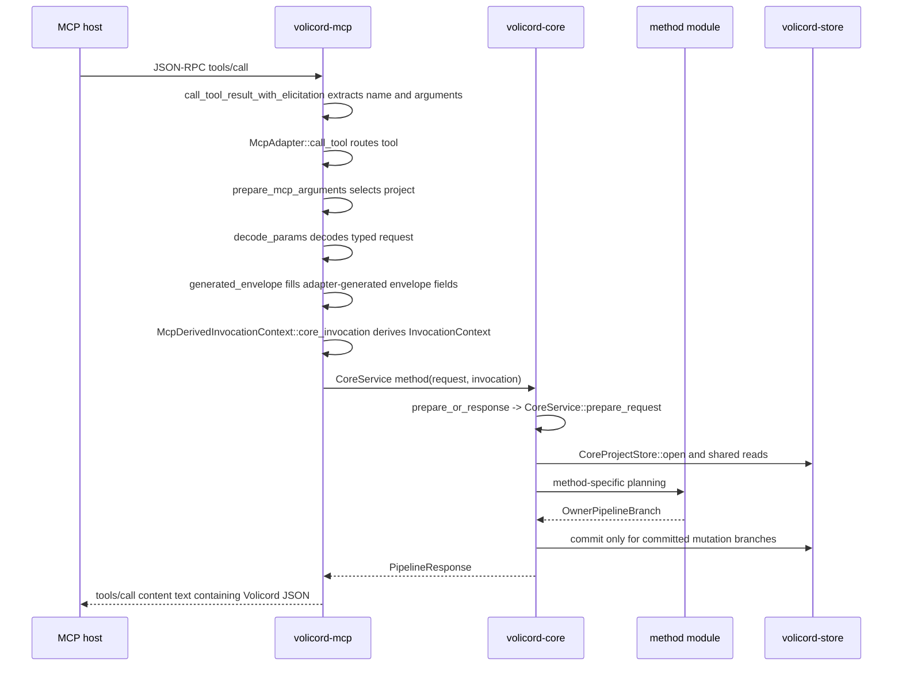

# Request lifecycle

This guide traces four representative public method calls through the current
Rust implementation:

- `volicord.status` as a read-only path
- `volicord.intake` as a committed state-mutation path
- `volicord.prepare_write` as a policy- and write-ticket-sensitive path
- `volicord.record_run` as the independent ticket-consumption defense

It names source files and symbols so developers can follow the code. It does
not define exact public method behavior, request or response schemas, storage
effects, security guarantees, runtime boundaries, error semantics, or Core
authority semantics. Exact behavior belongs to the Reference owners linked in
each section.

Within the Architecture Guide, this page owns the representative flow from
adapter or transport input through Core method handling, Store interaction, and
response or error shaping. Store transaction ordering, dry-run storage
boundaries, artifact staging, and commit failure boundaries are explained in
[Storage and Transactions](storage-and-transactions.md).

## Shared MCP to Core shape

This sequence follows the representative call order for a public MCP
`tools/call` before Core returns a Volicord response. Sequence arrows show
implementation order and return flow for the shared path; they are not
onboarding steps, exact public method contracts, or storage-effect definitions.
Implementation exactness belongs to the named `volicord-mcp`, `volicord-core`,
method-module, and `volicord-store` code areas described below; product
behavior exactness remains with the linked Reference owners.

For the stdio MCP path, `volicord mcp --stdio` first resolves Runtime Home and
Agent Connection process context, then startup inspection validates the facts
needed before stdio begins. The local HTTP path enters through
`volicord serve --transport local-http`; it resolves the bound connection
context, applies the transport project allowlist, and routes HTTP MCP requests
to the same adapter. After transport dispatch, a public `tools/call` selects a
permitted project, decodes the typed request, fills adapter-generated request
facts, derives local Core invocation facts, and calls the matching
`CoreService` method.

The shared adapter path is split across the `volicord-mcp` modules:

- [`crates/volicord-mcp/src/stdio.rs`](../../../crates/volicord-mcp/src/stdio.rs):
  `run_stdio` reads line-delimited JSON-RPC,
  `handle_json_rpc_request` dispatches `initialize`, `ping`, `tools/list`, and
  `tools/call`, and `call_tool_result_with_elicitation` extracts `params.name`
  and `params.arguments`, calls `McpAdapter`, and wraps
  `PipelineResponse.response_json` as MCP text content.
- [`crates/volicord-mcp/src/local_http.rs`](../../../crates/volicord-mcp/src/local_http.rs):
  `run_local_http_server` resolves the connection-bound adapter context, applies
  the transport project allowlist, and routes local HTTP sessions and MCP
  requests to `McpAdapter`.
- [`crates/volicord-mcp/src/tool_registry.rs`](../../../crates/volicord-mcp/src/tool_registry.rs):
  `PUBLIC_METHOD_TOOL_NAMES`, `McpToolDefinition`, and tool-list metadata.
- [`crates/volicord-mcp/src/adapter.rs`](../../../crates/volicord-mcp/src/adapter.rs):
  `McpAdapter::call_tool` matches the tool name, per-method helpers construct
  typed Core requests, `prepare_mcp_arguments<T>` rejects internal-only fields,
  selects a permitted project, and decodes arguments with `decode_params<T>`,
  `generated_envelope` fills adapter-generated envelope fields, and
  `call_core_request` derives local invocation facts before calling
  `CoreService`.
- [`crates/volicord-mcp/src/routing.rs`](../../../crates/volicord-mcp/src/routing.rs):
  startup inspection, `McpConnectionContext`, connection-mode parsing, project
  allowlist checks, and project availability helpers.
- After project selection, `call_core_request` uses
  `derive_invocation_context` to create `McpDerivedInvocationContext` for the
  selected project, bound Agent Connection actor source, requested operation
  category, and adapter-binding basis.
- `McpDerivedInvocationContext::core_invocation` creates the Core
  `InvocationContext`.

Startup and session validation also live in `volicord-mcp`, especially
`McpConnectionStartupInspection::resolve`. That startup path reads Store
directly to validate Runtime Home initialization, the installation profile,
the Agent Connection identifier, enabled state, metadata object shape, and
mode, Connection Project memberships, and project availability. It does not
derive `actor_source` or select one project for all calls. Request-time adapter
code derives `actor_source` from the bound Agent Connection after project
selection. Startup inspection is not an alternate implementation of public
method behavior; public method execution routes through `volicord-core`.

The shared Core path lives mainly in
[`crates/volicord-core/src/pipeline.rs`](../../../crates/volicord-core/src/pipeline.rs)
and [`crates/volicord-core/src/methods/mod.rs`](../../../crates/volicord-core/src/methods/mod.rs):

- Method files call `prepare_or_response`, which delegates to
  `CoreService::prepare_request`.
- `MethodPolicy` selects the required `OperationCategory`, `TaskRequirement`,
  `ReplayPolicy`, `FreshnessPolicy`, and `MethodEffectPolicy`.
- `CoreService::prepare_request` validates the envelope, rejects adapter
  binding mismatches, validates committed-effect envelope requirements,
  computes `canonical_request_hash`, opens `CoreProjectStore`, reads
  `project_state`, derives `VerifiedInvocationContext`, handles replay preflight,
  resolves the Task, checks state-version freshness, checks operation category, and
  produces `PreparedRequest`.
- A request that reaches `PreparedRequest` samples the project's canonical Core
  UTC clock exactly once after common preflight. `PreparedRequest.operation_now`
  is the only current-time sample method planning uses for that operation.
- `SystemClock` uses the Store's SQLite-live-plus-persisted-floor sample. A
  custom Clock can replace only the live source; `CoreService` still takes the
  maximum with the persisted floor and same-handle accepted sample and never
  rewrites stored owner timestamps as clock normalization.
- Planner TTL derivation uses checked addition and canonical RFC 3339 UTC
  representability. Overflow returns a controlled pre-commit rejection.
- `CoreService::execute_prepared_request` routes `OwnerPipelineBranch` to
  read-only, no-effect, dry-run, or committed mutation response construction.

The Store commit path lives in
[`crates/volicord-store/src/core_pipeline.rs`](../../../crates/volicord-store/src/core_pipeline.rs)
and
[`crates/volicord-store/src/core_pipeline/mutation_apply.rs`](../../../crates/volicord-store/src/core_pipeline/mutation_apply.rs):

- Core builds `CommitMutationInput` with `commit_input`, carrying
  `operation_now` as the commit clock floor.
- `CoreProjectStore::commit_mutation` performs replay lookup, stale-state
  checking, `project_state.state_version` increment, method-supplied
  `CoreStorageMutation` application through transaction-scoped SQL helpers,
  authority event insertion, response JSON construction, optional replay-row
  insertion, canonical commit-time selection, and transaction commit.
- `MutationCommitOutcome` routes committed, replayed, replay-context mismatch,
  idempotency conflict, and stale-state results back to Core.

Response and error shaping follows the same layer split. Adapter or routing
failures can return before Core planning. Core returns `PipelineResponse` for
prepared public method calls, including rejected, read-only, no-effect,
dry-run, committed, replay, and conflict outcomes. MCP wraps
`PipelineResponse.response_json` as `tools/call` content text. Exact public
error precedence, response schemas, and MCP transport wrapping rules remain
with [API Errors](../reference/api/errors.md),
[API Schema Core](../reference/api/schema-core.md), and
[MCP Transport](../reference/mcp-transport.md).

## Branch differences

`OwnerPipelineBranch` is the Core-side branch selected after common preflight
and method-specific planning. Exact storage-effect contracts stay in
[Storage Effects](../reference/storage-effects.md); this table is an
implementation-oriented map for following the source.

| Branch or response path | Where to read | Durable storage consequence at guide level |
|---|---|---|
| Rejected response from MCP decoding or preflight | `McpAdapter::call_tool`, `CoreService::prepare_request`, `validation_rejected` | Returns a rejected response or JSON-RPC error without a Core commit. No `state_version` increment, authority event, replay row, artifact effect, write-ticket effect, or persisted canonical-UTC-floor update is created. |
| `OwnerPipelineBranch::ReadOnly` | `CoreService::execute_prepared_request` | Builds a result with `EffectKind::ReadOnly` from current reads and does not call `CoreProjectStore::commit_mutation`. Computed close blockers, artifact observations, and current project-time samples in the response are read-time data and do not persist the clock floor. |
| `OwnerPipelineBranch::NoEffectResult` | `CoreService::execute_prepared_request`; currently used by `close_task` blocked result paths | Builds a valid result with `EffectKind::NoEffect` and does not call `CoreProjectStore::commit_mutation`. A blocker-shaped result here is response data, not a committed blocker row. |
| `OwnerPipelineBranch::DryRunPreview` | `CoreService::execute_prepared_request` | Builds `ToolDryRunResponse` preview data and does not persist generated refs, authority events, replay rows, staged handles, artifacts, `state_version` changes, or a later clock floor. |
| `OwnerPipelineBranch::CommitMutation` | `CoreService::execute_prepared_request`, Core `commit_mutation`, Store `CoreProjectStore::commit_mutation` | Runs the Store commit transaction. The transaction increments `project_state.state_version`, selects one canonical `committed_at >= operation_now`, appends at least one authority event, stores a replay row when the committed call is idempotent, and applies method-supplied `CoreStorageMutation` values. `project_state.updated_at`, event/replay creation time, and Store-generated transaction metadata use exact `committed_at`; owner-defined semantic operation and observation times retain their prepared or verified source values. |
| `volicord.stage_artifact` staging path | `crates/volicord-core/src/methods/stage_artifact.rs`, Store artifact staging helpers | Returns `StageArtifactResult` with `EffectKind::StagingCreated` and may create transient storage-owned staging plus safe bytes. It atomically advances `project_state.updated_at` to at least staging `created_at`, but does not use the ordinary Core commit transaction, append authority events or replay rows, increment `project_state.state_version`, or create a persistent `ArtifactRef`. See [Artifact Storage](../reference/storage-artifacts.md). |

Do not treat all blocked-looking outcomes as the same implementation path. For
example, `volicord.prepare_write` can reject before commit with no effect,
return a dry-run preview with no effect, commit a non-allow decision event
without issuing a write ticket, or commit an allowed decision that inserts a
write-ticket compatibility row. `volicord.check_close` can return close
blockers on a read-only check, while `volicord.close_task` can return them on
the baseline no-effect blocked path. API errors remain rejected
responses, not close-readiness blockers; route exact blocker/API boundaries to
[API blocker routing](../reference/api/blocker-routing.md).

## `volicord.status`: read-only path

Reference owner:

- [Status method](../reference/api/method-status.md)

Primary source path:

1. [`crates/volicord-types/src/methods.rs`](../../../crates/volicord-types/src/methods.rs)
   defines `StatusRequest`, `StatusInclude`, `StatusResult`, and the
   `MethodOperationCategory` implementation that returns `OperationCategory::Read`.
2. [`crates/volicord-mcp/src/adapter.rs`](../../../crates/volicord-mcp/src/adapter.rs)
   routes `"volicord.status"` in `McpAdapter::call_tool`, prepares typed
   status arguments, builds the adapter-generated envelope, derives local
   invocation facts and `InvocationContext`, and calls `CoreService::status`.
3. [`crates/volicord-core/src/methods/status.rs`](../../../crates/volicord-core/src/methods/status.rs)
   implements `CoreService::status`, `status_task`, and
   `status_result_fields`.
4. [`crates/volicord-core/src/pipeline.rs`](../../../crates/volicord-core/src/pipeline.rs)
   runs common preflight and the `OwnerPipelineBranch::ReadOnly` response path.
5. [`crates/volicord-store/src/core_pipeline.rs`](../../../crates/volicord-store/src/core_pipeline.rs)
   supplies `CoreProjectStore` reads such as `project_state`, Task reads, Change
   Unit reads, write-authority reads, evidence reads, and close-readiness input
   reads, and project-continuity reads.

Lifecycle:

1. The MCP host sends `tools/call` with `name="volicord.status"`.
2. `call_tool_result_with_elicitation` extracts the tool name and arguments.
3. `McpAdapter::call_tool` routes the call to the status branch.
4. `prepare_mcp_arguments` selects an allowed project from the
   `McpConnectionContext` and decodes the typed status arguments,
   `generated_envelope` fills the adapter-generated envelope fields for the
   status operation category, and `call_core_request` produces the Core
   `InvocationContext` from local invocation facts.
5. `CoreService::status` serializes the typed request to request JSON and calls
   `prepare_or_response` with `MethodPolicy::exact`,
   `TaskRequirement::Optional`, `ReplayPolicy::None`,
   `FreshnessPolicy::None`, and `MethodEffectPolicy::ReadOnly`.
6. `CoreService::prepare_request` runs common preflight. If preflight returns a
   response, the method returns it without method-specific result construction.
7. `status_task` selects the envelope Task when present or the active Task when
   absent.
8. `status_result_fields` builds result fields from Store reads and the
   requested `StatusInclude` flags. When `include.close=true`, it reuses
   `close_task::plan_close_task` with `CloseIntent::Check` to compute the
   read-only close view. When `include.continuity=true`, it reads active
   project-continuity summaries without mutating storage.
9. `CoreService::execute_prepared_request` receives
   `OwnerPipelineBranch::ReadOnly`, builds a result with `EffectKind::ReadOnly`,
   and returns `PipelineResponse`.
10. `call_tool_result_with_elicitation` wraps `PipelineResponse.response_json` in MCP
    `content[0].text`.

What does not happen:

- No `CoreProjectStore::commit_mutation` call.
- No state-version increment.
- No authority event.
- No replay row.
- No write-ticket change.
- No project-continuity record creation.

Representative tests:

- `status_is_read_only_including_dry_run` and
  `status_include_false_omits_optional_sections_without_effect` in
  [`crates/volicord-core/src/methods/tests/status.rs`](../../../crates/volicord-core/src/methods/tests/status.rs)
- `mcp_status_succeeds_with_readonly_storage` and
  `mcp_status_does_not_advance_state_version` in
  [`crates/volicord-mcp/src/tests.rs`](../../../crates/volicord-mcp/src/tests.rs)
- `status_projection_matches_public_close_check_and_stays_read_only` in
  [`tests/conformance/baseline.rs`](../../../tests/conformance/baseline.rs)

Exact behavior questions:

- Method behavior: [Status method](../reference/api/method-status.md)
- Common response shapes: [API Schema Core](../reference/api/schema-core.md)
- State and close-readiness display shapes:
  [API State Schemas](../reference/api/schema-state.md)
- Storage effects: [Storage Effects](../reference/storage-effects.md)

## `volicord.intake`: committed mutation path

Reference owner:

- [Intake method](../reference/api/method-intake.md)

Primary source path:

1. [`crates/volicord-types/src/methods.rs`](../../../crates/volicord-types/src/methods.rs)
   defines `IntakeRequest`, `InitialScope`, `IntakeResult`, and the
   `MethodOperationCategory` implementation that returns `OperationCategory::AgentWorkflow`.
2. [`crates/volicord-mcp/src/adapter.rs`](../../../crates/volicord-mcp/src/adapter.rs)
   routes `"volicord.intake"` in `McpAdapter::call_tool`, prepares typed
   intake arguments, builds the adapter-generated envelope, derives local
   invocation facts and `InvocationContext`, and calls `CoreService::intake`.
3. [`crates/volicord-core/src/methods/intake.rs`](../../../crates/volicord-core/src/methods/intake.rs)
   implements `CoreService::intake` and `plan_intake`.
4. [`crates/volicord-core/src/methods/mod.rs`](../../../crates/volicord-core/src/methods/mod.rs)
   supplies `mutation_method_policy`, `prepare_or_response`, common method
   planning helpers, and response helpers.
5. [`crates/volicord-core/src/pipeline.rs`](../../../crates/volicord-core/src/pipeline.rs)
   executes `OwnerPipelineBranch::DryRunPreview` or
   `OwnerPipelineBranch::CommitMutation`.
6. [`crates/volicord-store/src/core_pipeline.rs`](../../../crates/volicord-store/src/core_pipeline.rs)
   opens the commit transaction and commits the event and replay row, while
   [`crates/volicord-store/src/core_pipeline/mutation_apply.rs`](../../../crates/volicord-store/src/core_pipeline/mutation_apply.rs)
   applies `CoreStorageMutation` values inside that transaction.

Lifecycle:

1. The MCP host sends `tools/call` with `name="volicord.intake"`.
2. `McpAdapter::call_tool` prepares typed intake arguments, builds the
   adapter-generated envelope, derives local invocation facts and
   `InvocationContext`, and calls `CoreService::intake`.
3. `CoreService::intake` selects `mutation_method_policy` with
   `TaskRequirement::None`. For dry run, the policy uses
   `MethodEffectPolicy::DryRunPreview` and `ReplayPolicy::None`. For committed
   calls, it uses `MethodEffectPolicy::CoreMutation` and
   `ReplayPolicy::Committed`.
4. `prepare_or_response` delegates to `CoreService::prepare_request` for common
   preflight. Committed calls use the shared committed-effect envelope checks,
   replay preflight, freshness policy, and operation-category checks.
   A call that proceeds to planning receives exactly one `operation_now` sample.
5. The method rejects `ResumePolicy::RejectIfActive` when the current project
   state already has an active Task.
6. `plan_intake` resolves whether to create a new Task, resume the active Task,
   or supersede the active Task. It may allocate a generated `TaskId`, build a
   `TaskRecord`, select the current Change Unit for a resumed Task, compute a
   projected `StateSummary`, and produce `CoreStorageMutation` values.
7. If `request.envelope.dry_run` is true, Core executes
   `OwnerPipelineBranch::DryRunPreview` and returns a dry-run response with no
   Store commit.
8. Otherwise Core executes `OwnerPipelineBranch::CommitMutation` with
   `event_kind="task_intake"`, method result fields, the selected `task_id`,
   and the planned storage mutations.
9. Core's internal `commit_mutation` helper builds `CommitMutationInput` with
   the canonical request hash, replay context, expected state version, and
   `PendingTaskEvent`, plus `operation_now` as the clock floor.
10. `CoreProjectStore::commit_mutation` opens one immediate transaction,
    rechecks replay and freshness, increments `project_state.state_version`,
    applies `CoreStorageMutation` values, inserts the authority event, builds and
    validates response JSON, inserts the replay row for idempotent committed
    calls, writes one canonical commit timestamp across the project floor,
    events, replay row, and Store-generated transaction metadata, and commits.
11. The committed response returns through `PipelineResponse` and is wrapped by
    MCP as `tools/call` text content.

What changes by branch:

- Dry-run intake uses `OwnerPipelineBranch::DryRunPreview`; no Task, event,
  replay row, or state-version increment is created.
- Preflight or validation rejection returns a rejected response without a Core
  commit.
- Committed intake uses `OwnerPipelineBranch::CommitMutation`; it increments
  state version, appends a `task_intake` event, stores a replay row when an
  idempotency key is present, and applies the method-planned mutations.

Representative tests:

- `intake_commits_once_and_replays_without_effect` and
  `intake_dry_run_has_no_storage_effect` in
  [`crates/volicord-core/src/methods/tests/intake.rs`](../../../crates/volicord-core/src/methods/tests/intake.rs)
- `adapter_auto_selects_single_project_and_injects_connection_invocation` in
  [`crates/volicord-mcp/src/tests.rs`](../../../crates/volicord-mcp/src/tests.rs)
- `connection_invocation_is_injected_and_single_project_is_auto_selected` in
  [`tests/integration/mcp_connection.rs`](../../../tests/integration/mcp_connection.rs)
- `no_effect_branches_state_version_and_idempotency_are_stable` in
  [`tests/conformance/baseline.rs`](../../../tests/conformance/baseline.rs)

Exact behavior questions:

- Method behavior: [Intake method](../reference/api/method-intake.md)
- Common envelope and response branches:
  [API Schema Core](../reference/api/schema-core.md)
- Task and state shapes: [API State Schemas](../reference/api/schema-state.md)
- Storage effects: [Storage Effects](../reference/storage-effects.md)
- Replay and error behavior: [API Errors](../reference/api/errors.md) and the
  method owner

## `volicord.prepare_write`: policy and write-ticket path

Reference owner:

- [Prepare-write method](../reference/api/method-prepare-write.md)

Primary source path:

1. [`crates/volicord-types/src/methods.rs`](../../../crates/volicord-types/src/methods.rs)
   defines `PrepareWriteRequest`, `PrepareWriteResult`, and the
   `MethodOperationCategory` implementation that returns
   `OperationCategory::AgentWorkflow`.
2. [`crates/volicord-mcp/src/adapter.rs`](../../../crates/volicord-mcp/src/adapter.rs)
   routes `"volicord.prepare_write"` in `McpAdapter::call_tool`, prepares typed
   prepare-write arguments, builds the adapter-generated envelope, derives
   local invocation facts and `InvocationContext`, and calls
   `CoreService::prepare_write`.
3. [`crates/volicord-core/src/methods/prepare_write.rs`](../../../crates/volicord-core/src/methods/prepare_write.rs)
   implements `CoreService::prepare_write`, `prepare_write_policy`, and
   `plan_prepare_write`.
4. [`crates/volicord-core/src/policy/write_ticket.rs`](../../../crates/volicord-core/src/policy/write_ticket.rs)
   supplies `prepare_write_decision`, `prepare_write_dry_run_summary`,
   write-ticket compatibility helpers, and `write_decision_reason`.
5. [`crates/volicord-core/src/policy/path.rs`](../../../crates/volicord-core/src/policy/path.rs)
   supplies Product Repository path normalization helpers.
6. [`crates/volicord-core/src/policy/user_action_relevance.rs`](../../../crates/volicord-core/src/policy/user_action_relevance.rs)
   supplies user-action relevance checks used by the planner.
7. [`crates/volicord-core/src/policy/workflow.rs`](../../../crates/volicord-core/src/policy/workflow.rs)
   loads the authoritative project policy, resolves current Task control, and
   exposes its normalized write-authority fingerprint.
8. [`crates/volicord-store/src/workflow_records.rs`](../../../crates/volicord-store/src/workflow_records.rs)
   derives that fingerprint and owns policy-apply reevaluation and active-ticket
   invalidation.
9. [`crates/volicord-store/src/core_pipeline/mutation_apply.rs`](../../../crates/volicord-store/src/core_pipeline/mutation_apply.rs)
   applies `CoreStorageMutation::InsertWriteTicket` inside the Store commit
   transaction when the committed allowed branch issues a write ticket.

Lifecycle:

1. The MCP host sends `tools/call` with `name="volicord.prepare_write"`.
2. `McpAdapter::call_tool` prepares typed prepare-write arguments, builds the
   adapter-generated envelope, derives local invocation facts and
   `InvocationContext`, and calls `CoreService::prepare_write`.
3. `CoreService::prepare_write` first checks that `envelope.task_id`, when
   present, matches `PrepareWriteRequest.task_id`.
4. `prepare_write_policy` selects `TaskRequirement::Exact` when the request or
   envelope supplies a Task ID, otherwise `TaskRequirement::Required`. Dry runs
   use `MethodEffectPolicy::DryRunPreview` and `ReplayPolicy::None`; committed
   calls use `MethodEffectPolicy::CoreMutation` and
   `ReplayPolicy::Committed`.
5. `prepare_or_response` delegates to common preflight. Access mismatches,
   stale state, missing committed-effect envelope fields, replay mismatch, and
   Store unavailability can return before method-specific planning.
6. `plan_prepare_write` reloads the authoritative project workflow policy and
   resolves current Task control before normalizing `intended_operation`,
   `sensitive_categories`, and Product Repository paths. It reevaluates a
   policy-marked Task even when stored control and final acceptance did not
   rise. Current paths can move `light` work to `tracked` or `sensitive`;
   `sensitive` work requires matching user approval before ticket issuance.
7. The planner resolves the current Change Unit and compares product-write
   intent, baseline, path scope, pending user-owned judgments, sensitive-action
   approval, verified operation category, and connection capability. The
   required validity basis includes the current normalized
   `write_authority_fingerprint`.
8. `prepare_write_decision` classifies the collected
   `WriteDecisionReason` values. With no reasons, the plan is allowed. With
   reasons, the plan is a non-allow decision.
9. If the request is a dry run, `CoreService::execute_prepared_request` receives
   `OwnerPipelineBranch::DryRunPreview` with `prepare_write_dry_run_summary`.
   No write ticket ID is allocated and no Store commit runs.
10. For a committed allowed plan, a current compatible active ticket is reused;
    otherwise the commit carries `CoreStorageMutation::InsertWriteTicket` with
    the current policy binding. An active ticket with a missing or different
    binding is excluded from reuse and invalidated with `explicit_revoke` in
    that commit. The event is `write_ticket_reused` or `write_ticket_issued`.
11. For a committed non-allow plan, `OwnerPipelineBranch::CommitMutation`
    carries `event_kind="write_decision_recorded"` and no
    `InsertWriteTicket` mutation. The Store transaction still records
    the decision event, advances state version, and stores replay data when the
    committed call is idempotent. If ticket selection found active legacy or
    mismatched policy bindings, that same commit invalidates those tickets with
    `explicit_revoke` before returning the non-allow decision.
12. `CoreProjectStore::commit_mutation` executes the transaction and returns a
    `MutationCommitOutcome`. Core turns that outcome into `PipelineResponse`,
    and MCP wraps the response JSON as `tools/call` text content.

What changes by branch:

- Preflight or early validation rejection has no Core commit and issues no
  write ticket.
- Dry-run returns `ToolDryRunResponse`, has no Core commit, and allocates no
  durable write ticket ID.
- Committed non-allow decisions commit an audit/result event but create no
  write ticket; selected active tickets with stale policy bindings are still
  invalidated in that commit.
- Committed allowed decisions reuse one compatible ticket or commit an event
  and `CoreStorageMutation::InsertWriteTicket`. Missing or mismatched legacy
  bindings fail closed and are replaced, not reused.
- Reapplying a normalized-equivalent write authority does not make an otherwise
  compatible ticket stale.
- Idempotent replay returns the stored original response through replay
  handling instead of creating another write ticket.

Representative tests:

- `prepare_write_allowed_issues_one_write_ticket_with_post_commit_basis`,
  `prepare_write_replaces_active_ticket_missing_write_authority_binding`,
  `prepare_write_replaces_active_ticket_with_mismatched_write_authority_binding`,
  `prepare_write_blocked_path_issues_no_write_ticket`,
  `prepare_write_dry_run_has_no_write_ticket_effect`, and
  `prepare_write_user_only_category_is_invocation_context_rejection` in
  [`crates/volicord-core/src/methods/tests/prepare_write.rs`](../../../crates/volicord-core/src/methods/tests/prepare_write.rs)
- `read_only_mode_rejects_agent_workflow_methods_before_core` in
  [`tests/integration/mcp_connection.rs`](../../../tests/integration/mcp_connection.rs)
- `committed_non_allow_prepare_write_audit_and_replay_are_exact` and
  `prepare_write_issues_write_ticket_only_on_committed_allowed_effect` in
  [`tests/conformance/baseline.rs`](../../../tests/conformance/baseline.rs)

Exact behavior questions:

- Method behavior and decision branches:
  [Prepare-write method](../reference/api/method-prepare-write.md)
- Core authority terms such as write ticket, write approval,
  sensitive-action approval, final acceptance, and residual-risk acceptance:
  [Core Model](../reference/core-model.md)
- Product Repository path normalization:
  [Runtime Boundaries](../reference/runtime-boundaries.md)
- Common response branches: [API Schema Core](../reference/api/schema-core.md)
- Judgment shapes: [API Judgment Schemas](../reference/api/schema-judgment.md)
- Storage effects: [Storage Effects](../reference/storage-effects.md)
- Security guarantee meaning: [Security](../reference/security.md)

## `volicord.record_run`: ticket-consumption defense

Reference owner:

- [Record-run method](../reference/api/method-record-run.md)

Primary source path:

1. [`crates/volicord-types/src/methods.rs`](../../../crates/volicord-types/src/methods.rs)
   defines the request, observed-change input, and result shapes.
2. [`crates/volicord-mcp/src/adapter.rs`](../../../crates/volicord-mcp/src/adapter.rs)
   routes `"volicord.record_run"` through the shared typed adapter path.
3. [`crates/volicord-core/src/methods/record_run.rs`](../../../crates/volicord-core/src/methods/record_run.rs)
   loads current policy, validates the ticket, plans the Run, and requests
   ticket consumption.
4. [`crates/volicord-core/src/policy/workflow.rs`](../../../crates/volicord-core/src/policy/workflow.rs)
   resolves current Task control and normalized write authority.
5. [`crates/volicord-store/src/core_pipeline/mutation_apply.rs`](../../../crates/volicord-store/src/core_pipeline/mutation_apply.rs)
   rechecks ticket and policy authority inside the consumption transaction.

Lifecycle:

1. MCP decoding and common Core preflight follow the shared path with an exact
   Task and committed-mutation policy.
2. `plan_record_run` normalizes changed paths and sensitive categories, loads
   the current project policy, and resolves current Task control.
3. A product-file write or an effective `sensitive` Task requires a Write Ticket.
   Pending policy-control reevaluation requires a new `prepare_write` before an
   existing ticket can be consumed.
4. Core requires the ticket to be active and compatible with the current Task,
   Change Unit, scope, baseline, workspace, paths, categories, approval basis,
   idle limit, and `write_authority_fingerprint`. A missing legacy binding or a
   mismatch returns `WRITE_TICKET_INVALID` with
   `policy_authority_mismatch` and creates no Run.
5. Core places `ConsumeWriteTicket`, its expected basis state version, and the
   current fingerprint in the same mutation plan as the Run. Required
   sensitive-action approval is checked before this plan; later final
   acceptance cannot substitute for that pre-write approval.
6. Store reloads the ticket and current project policy in the transaction. A
   changed status, basis version, stored binding, or current authority causes a
   conflict and rolls back the whole mutation.
7. A successful commit records the Run and consumes the ticket exactly once.
   Consumed ticket history remains inspectable.

Guard may deny a stale policy-bound ticket earlier in the cooperative pre-tool
path, but bypassing Guard still reaches the independent Core and Store checks.
These records are not an OS sandbox, filesystem permission boundary,
tamper-proof audit log, or correctness proof.

Representative tests:

- `record_run_rejects_missing_write_authority_binding_without_consumption` and
  `record_run_rejects_mismatched_write_authority_binding_without_consumption`
  in [`crates/volicord-core/src/methods/tests/record_run.rs`](../../../crates/volicord-core/src/methods/tests/record_run.rs)
- `write_ticket_consumption_revalidates_policy_authority_inside_transaction`
  in [`crates/volicord-store/src/core_pipeline.rs`](../../../crates/volicord-store/src/core_pipeline.rs)

Exact behavior questions:

- Method behavior: [Record-run method](../reference/api/method-record-run.md)
- Ticket and approval authority: [Core Model](../reference/core-model.md)
- Durable effects and history: [Storage Effects](../reference/storage-effects.md)
  and [Storage Records](../reference/storage-records.md)
- Cooperative Guard and non-guarantees: [Security](../reference/security.md)
