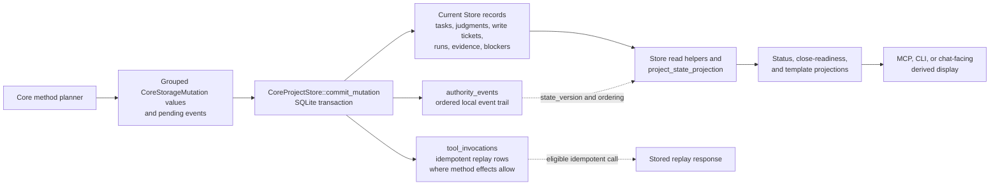

# Storage and transactions

This guide explains how the current implementation separates Runtime Home
storage, project Store access, method planning, storage mutation values,
atomic commits, replay records, and artifacts. It is not a storage contract.
Exact storage effects, record meanings, DDL, artifact lifecycle rules, and
versioning behavior belong to the storage Reference owners.

Start with [Storage](../reference/storage.md) for the storage owner family,
[Storage Effects](../reference/storage-effects.md) for method branch effects,
[Storage Records](../reference/storage-records.md), [Storage DDL](../reference/storage-ddl.md),
[Artifact Storage](../reference/storage-artifacts.md), and
[Storage Versioning](../reference/storage-versioning.md) when exact behavior is
needed.

## Storage shape

`Volicord Runtime Home` is the local runtime data location for Volicord-owned
records and artifact data. `Product Repository` is the user's product-file
workspace. The implementation keeps these locations separate:

- Runtime Home path handling lives in
  [`crates/volicord-store/src/runtime_home.rs`](../../../crates/volicord-store/src/runtime_home.rs).
- Registry and project bootstrap live in
  [`crates/volicord-store/src/bootstrap.rs`](../../../crates/volicord-store/src/bootstrap.rs).
- SQLite open, validation, and transaction helpers live in
  [`crates/volicord-store/src/sqlite.rs`](../../../crates/volicord-store/src/sqlite.rs).
- Canonical schema SQL and initialization helpers live in
  [`crates/volicord-store/src/schema.rs`](../../../crates/volicord-store/src/schema.rs)
  and [`crates/volicord-store/src/schema/`](../../../crates/volicord-store/src/schema/).
- Project-local Core Store access is rooted at
  [`crates/volicord-store/src/core_pipeline/`](../../../crates/volicord-store/src/core_pipeline/).
  `CoreProjectStore` remains the project-database facade. Connection and
  project identity live in
  [`facade.rs`](../../../crates/volicord-store/src/core_pipeline/facade.rs);
  read-only and mutation-capable entry points live in
  [`open.rs`](../../../crates/volicord-store/src/core_pipeline/open.rs).
  Aggregate modules own their grouped mutation types, storage-representation
  validation and application SQL, typed application facts where needed, read
  projections, row and JSON decoding, facade methods, and focused tests.
- Artifact staging and persistent artifact body verification live in
  [`crates/volicord-store/src/artifacts.rs`](../../../crates/volicord-store/src/artifacts.rs).

The registry database tracks Runtime Home-level registration. Project
databases hold project-local state. This page avoids reproducing table layouts
or column definitions; use the storage Reference owners for those details.

### Project Store module ownership

The facade distributes inherent `CoreProjectStore` methods across modules
without adding a second Store abstraction:

| Modules | Current implementation ownership |
|---|---|
| `facade.rs`, `open.rs` | Project-database handle, retained Runtime Home and project identity, read snapshots, and read-only or mutation-capable opening. |
| `project_state.rs`, `enforcement_profile.rs`, `clock.rs` | Project header and enforcement-profile reads, strict stored-value decoding, and the project UTC floor. |
| `tasks.rs` | Task and acceptance mutation inputs and SQL; Task rows, acceptance criteria, evidence claims, and Task revisions. |
| `change_units.rs`, `write_tickets.rs`, `runs.rs` | Typed Change Unit, Write Ticket, and Run mutation inputs and SQL; private physical rows; strict closed-value, JSON, timestamp, and Product Repository path decoding into typed reads and Run observed-change projections. `write_tickets.rs` is the sole physical Write Ticket owner and shares one canonical row projection, decoder, and persisted-invariant validator across normal and transaction-scoped reads. Its decoder creates the opaque `StoredWriteTicket`, whose private fields are available through semantic accessors. |
| `evidence.rs`, `artifacts.rs` | Evidence and artifact mutation inputs and SQL; evidence summary and observation reads, artifact staging records, durable artifact records, artifact links, and artifact-body verification on reads. |
| `user_actions.rs`, `continuity.rs` | User-action and continuity mutation inputs and SQL; strict decoding of physical JSON and stored scalar values into typed request/resolution records, effective-status reads, project-continuity rows, and bounded pages. |
| `replay.rs` | Private tool-invocation rows, strict typed identity and replay-context decoding, immutable operation-result projection, and exact method-response bytes retained for Core-owned semantic replay. |
| `reconciliation.rs`, `blockers.rs`, `events.rs`, `agent_sessions.rs` | Strictly decoded typed product-write observation candidates and paths, active blocker references, event identity lookup, and the project-local Agent Session entry point. |
| `record_refs.rs`, `inspection.rs` | Shared stored-record references and no-effect storage counters used by verification paths. |
| `mutations.rs` | Thin static dispatch from each top-level mutation group to its aggregate owner and the transaction-scoped application context. |
| `commit.rs` | Cross-aggregate transaction coordination: replay and freshness gates, ordered delegation, one canonical state-version advance, event and replay persistence, response construction, and commit or rollback. |
| `validation.rs` | Persisted-value and mutation-input validation shared by current Store owners. |

Project workflow-policy record reads and writes remain in
[`workflow_records.rs`](../../../crates/volicord-store/src/workflow_records.rs).
That owner keeps the physical policy row private and verifies its current
schema, closed values, canonical bytes, fingerprint, source, and timestamps
before returning a typed policy record.
When a policy mutation evaluates active Write Ticket bindings,
`workflow_records.rs` receives a focused typed authority view from the Write
Ticket aggregate. It neither queries the ticket table nor parses ticket JSON,
and it applies only current workflow-policy semantics to the validated view.
Transient artifact staging and durable artifact-body path operations remain in
[`artifacts.rs`](../../../crates/volicord-store/src/artifacts.rs), while the
project-facade artifact read side is owned by `core_pipeline/artifacts.rs`.

## Store, events, and projections

This implementation map shows how method plans become current Store records,
events, replay rows, and read-time projections. Solid arrows show normal data
flow inside the implementation. Dotted arrows show ordering or replay
relationships. The diagram is not a storage contract, projection authority
contract, or table relationship diagram; exact meanings stay with
[Storage Records](../reference/storage-records.md), [Storage Effects](../reference/storage-effects.md),
[Storage Versioning](../reference/storage-versioning.md), and
[Projection and template display boundaries](../reference/projection-and-templates.md).

Current Store records are the source for ordinary reads. `authority_events`
preserve committed Core mutation order and local event facts. `tool_invocations`
support idempotent replay only for method branches whose storage effects define
that replay. Read-time projections and rendered displays help callers see
state, but they do not create authority, write tickets, evidence, acceptance,
or close readiness by display alone.

## Bootstrap and schema boundary

Administrative setup uses Store bootstrap and inspection paths before public
method execution is available:

1. `volicord-cli` plans connection provisioning through
   [`crates/volicord-cli/src/connection_command.rs`](../../../crates/volicord-cli/src/connection_command.rs)
   and
   [`crates/volicord-cli/src/connection_command/service.rs`](../../../crates/volicord-cli/src/connection_command/service.rs).
2. Store bootstrap initializes Runtime Home metadata and registers projects,
   while Agent Connection Store helpers create connection records and
   Connection Project memberships.
3. Empty registry/project state databases are initialized from canonical SQL,
   and existing state is opened only after SQLite helpers validate the current
   schema shape and storage profile.
4. Public method reads later use `CoreProjectStore::open_read_only`; committed
   paths use `CoreProjectStore::open_for_mutation` with the live
   `RuntimeHomeMutationContext` retained by the caller.

This keeps local administrative preparation separate from Core method
semantics. Exact CLI behavior is owned by [Administrative CLI](../reference/admin-cli.md).

All ordinary Runtime Home writers acquire `SharedWriter` before
mutation-dependent reads and derive one target-bound Store context from its
borrowed permit. Writable Registry and project database helpers are private to
Store and require that context. Setup instead derives the context from its one
`ExclusiveSetup` permit and passes it through bootstrap, checkpoints,
publication confirmation, and rollback without nested acquisition. A conflict
returns `runtime_home.mutation.setup_in_progress` before any transaction,
artifact staging, or observation effect.

Core construction mirrors this boundary. `CoreService::for_read_only(path)`
retains a read-only path binding, while `CoreService::for_mutation(context)`
accepts no path and retains the context's `CanonicalRuntimeHomePath`.
`CoreProjectStore::open_for_mutation(context, project_id)` retains that same
typed identity. Mutation authorization compares the retained Core and Store
identities directly and rejects a read-only/admitted mix or a different
Runtime Home; it does not recanonicalize either path. Admitted Registry and
setup helpers likewise derive their Runtime Home from the context instead of
accepting a second path.

For a new project, bootstrap initializes `project_state.created_at` and
`project_state.updated_at` from SQLite current UTC. Re-registering an existing
project validates and preserves its exact `updated_at` canonical-clock floor;
the registration upsert changes only owner-allowed registration data. A
malformed existing floor fails before a write, and a future-valued valid floor
is never reset to live or host time.

## Read and planning flow

Normal public method execution has two implementation phases before persistence:

1. The shared Core preflight in
   [`crates/volicord-core/src/pipeline.rs`](../../../crates/volicord-core/src/pipeline.rs)
   validates the envelope, adapter binding, committed-effect envelope
   requirements, request hash, project state, verified connection context, replay
   eligibility, Task requirement, freshness, and operation category.
2. The method module in [`crates/volicord-core/src/methods/`](../../../crates/volicord-core/src/methods/)
   orchestrates the request-specific branch and response. Focused Core owners
   such as [`identity.rs`](../../../crates/volicord-core/src/identity.rs),
   [`artifact.rs`](../../../crates/volicord-core/src/artifact.rs),
   [`continuity/`](../../../crates/volicord-core/src/continuity/),
   [`write_ticket/`](../../../crates/volicord-core/src/write_ticket/), and
   [`close_readiness/`](../../../crates/volicord-core/src/close_readiness/)
   perform reusable semantic planning over typed facts. The method then returns
   an `OwnerPipelineBranch`.

Semantic owners do not construct public method responses or map Store failures.
[`method_execution.rs`](../../../crates/volicord-core/src/method_execution.rs)
owns shared execution mechanics, while focused modules under
[`error_boundary/`](../../../crates/volicord-core/src/error_boundary/) translate
typed Store or semantic-owner failures at the method-response boundary.

After common preflight, a request that reaches planning obtains exactly one
`operation_now` from the project-scoped canonical Core UTC clock. For
`SystemClock`, Store samples that clock as the maximum of live SQLite UTC,
persisted `project_state.updated_at`, and any later accepted sample held by the
Store handle. Method planning reuses `operation_now` for all current-time
decisions and semantic operation timestamps.

`SystemClock` obtains its live candidate from SQLite. An injected Clock can
replace that candidate, but the `CoreService` boundary still takes the maximum
with the persisted floor and same-handle sample. This composition does not
rewrite stored owner timestamps. A future-valued row fails closed only where
its owner defines that value as invalid. TTL derivation uses checked addition
and canonical RFC 3339 UTC representability before a branch can commit. The
same configured candidate choice applies at commit: `SystemClock` samples
SQLite current UTC inside the transaction, while an injected Clock supplies
its live candidate instead of, not in addition to, that SQLite candidate. Exact
selection belongs to
[Storage Versioning](../reference/storage-versioning.md#canonical-core-utc-clock).

Read-only methods and dry runs can return without a Core mutation commit.
`OwnerPipelineBranch<F>` retains the typed method-fields owner across
read-only, no-effect, dry-run, and committed branch selection. Committed
branches also provide event data and a list of `CoreStorageMutation` values.
The pipeline constructs a complete method result from `F` only after the
branch's common result facts are known.

## Effect path boundary summary

This page owns the implementation-level Store boundary for effect paths. Exact
method results and public storage-effect contracts remain with the method owner
and [Storage Effects](../reference/storage-effects.md).

| Effect path | Store boundary |
|---|---|
| Rejected before planning or commit | Returns without calling `CoreProjectStore::commit_mutation`; no Store transaction for a Core mutation starts and no later clock floor is persisted. |
| Read-only result | Uses Store reads and returns without a Core mutation commit. A current project-time sample is not persisted merely because it was read. |
| No-effect result | Returns a valid method result without calling the normal Core mutation commit path or advancing the persisted floor. |
| Dry-run preview | Builds semantic plans and preview data without treating those plans as persisted records or persisting generated refs, authority events, replay rows, staged handles, artifacts, state-version changes, or a later clock floor. |
| Normal committed Core mutation | Runs `CoreProjectStore::commit_mutation`, which applies method-provided `CoreStorageMutation` values and pending events with one canonical commit timestamp inside one transaction. |
| Transient artifact staging | Uses artifact staging helpers instead of the normal Core mutation commit path. Its transaction advances the project-time floor to at least staging `created_at` without changing `state_version`. |
| Registered evidence-capture fulfillment | Creates the receipt, transient staging, and source claims together, and advances the floor to at least receipt `created_at`; no Core event, replay row, or state-version increment. |
| Local User Channel token issuance | Inserts the request-bound token and advances the floor to at least token `created_at`; no Core event, replay row, or state-version increment. |

## Mutation values

`CoreStorageMutation` functions as a command-like value between method planning
and Store persistence. Its top-level variants group Task and acceptance,
Change Unit, Write Ticket, Run, evidence, artifact, user-action, continuity,
and workflow-policy mutations. Each group is a static enum owned by the
aggregate module that defines its inputs, storage-representation validation,
SQL application, and any typed result facts required by commit coordination.
`mutations.rs` delegates the ordered list to those owners inside the active
transaction.

For new Write Ticket issuance, Core validates one `PlannedWriteTicket` and
derives both the response projection and the fully typed `WriteTicketInsert`
from that plan. Store serializes the insertion and creates the opaque
`StoredWriteTicket` on persisted reads. The method dispatcher and projection
code do not construct a persisted ticket.

This structure gives the implementation a clear split:

- Core method planners decide what method-specific effect is intended.
- Store decides how that intended effect is applied to project-local storage.
- Reference owners decide the exact product meaning of the effect.

## Commit input and atomic commit

For normal committed Core mutations, Core builds `CommitMutationInput` with the
project ID, method name, optional idempotency key, canonical request hash,
verified replay context, optional expected state version, pending events, and
the prepared `operation_now` as the commit clock floor.

`CoreProjectStore::commit_mutation` in
[`core_pipeline/commit.rs`](../../../crates/volicord-store/src/core_pipeline/commit.rs)
is the atomic Store boundary. It:

1. validates commit input and pending events;
2. begins an immediate SQLite transaction;
3. reads current project state inside the transaction;
4. handles eligible replay, replay-context mismatch, idempotency conflict, and
   stale expected-state outcomes before applying a new mutation;
5. chooses one canonical `committed_at` using the configured Clock branch:
   - for production `SystemClock`, the maximum of `operation_now`, SQLite
     current UTC sampled inside the transaction, the persisted project-time
     floor, and any later same-handle accepted sample;
   - for an injected or custom Clock, the maximum of `operation_now`, its
     injected live-time candidate, the persisted floor, and any later
     same-handle accepted sample; the injected candidate replaces rather than
     supplements SQLite current UTC;
6. advances `project_state.state_version` for a new committed mutation;
7. delegates method-provided grouped `CoreStorageMutation` values to their
   aggregate owners in list order;
8. writes `project_state.updated_at=committed_at` and appends authority events
   with `created_at=committed_at`;
9. combines the typed method fields with the final common result facts, then
   builds and validates the complete response JSON;
10. stores that complete response in an idempotency replay row with
    `created_at=committed_at` when the committed call is idempotent;
11. commits the transaction, or rolls back the whole attempt on error.

Store transaction metadata that mutation application generates, including
applicable `created_at`, `updated_at`, `retired_at`, and `promoted_at`, uses the
same exact `committed_at`. Owner-defined semantic times such as `requested_at`,
`resolved_at`, `closed_at`, `recorded_at`, and `consumed_at`, plus observation
facts such as `observed_at` and `started_at`, retain the prepared operation
sample or verified source time. The commit timestamp can be later than
`operation_now`; it does not rewrite those semantic facts.

The implementation tests that protect this boundary include
`ordered_multi_aggregate_commit_is_versioned_replayable_and_durable`,
`intermediate_aggregate_failure_rolls_back_every_commit_effect`,
`transaction_replay_returns_stored_response_before_stale_expected_state`,
`transaction_replay_hash_conflict_rejects_without_effect`, and
`transaction_replay_context_mismatch_precedes_request_hash_conflict` in
[`crates/volicord-store/src/core_pipeline/`](../../../crates/volicord-store/src/core_pipeline/),
plus Core pipeline tests in
[`crates/volicord-core/src/pipeline.rs`](../../../crates/volicord-core/src/pipeline.rs).

## State version and replay

The normal commit path advances project state once for a newly committed Core
mutation and stores the corresponding `authority_events` row or owner-defined
event batch with that resulting state version. Replay returns the stored
original response for an eligible idempotent call instead of applying another
mutation. Before returning it, Core strictly decodes the complete stored result
as the current method result type.

`state_version` and the persisted UTC floor are independent coordinates. The
first orders authority-state transitions; the second prevents later temporal
checks from observing an earlier project time. A replay, conflict, rejection,
dry run, or read-only result neither increments `state_version` nor persists a
later floor. Multiple state versions may share one non-decreasing UTC value.

The request hash used for replay comes from `canonical_request_hash` in
[`crates/volicord-types/src/canonical.rs`](../../../crates/volicord-types/src/canonical.rs)
after typed request decoding. This supports stable comparison across JSON
property ordering and formatting while preserving semantic differences.

Exact state-version and replay behavior routes to
[Storage Versioning](../reference/storage-versioning.md), [API Errors](../reference/api/errors.md),
and the relevant method owner.

## Artifact boundary

Artifact staging is intentionally separate from the normal Core mutation
commit path:

- `CoreService::stage_artifact` uses method preflight and then calls
  `CoreProjectStore::create_artifact_staging`.
- `create_artifact_staging` creates a transient staged-handle row and safe
  staged bytes.
- It does not use `CoreProjectStore::commit_mutation`, increment
  `project_state.state_version`, append `authority_events`, create replay rows,
  or insert persistent artifact rows. Its own transaction advances
  `project_state.updated_at` to at least the staging row's `created_at`; equality
  is not required if another writer already established a later floor.

Persistent artifact promotion happens through method-planned Core mutations,
such as `record_run`, when the applicable owner-defined behavior allows it.
For Record Run, `crates/volicord-core/src/recording/artifact.rs` validates
typed staged or existing artifact facts and returns a
`RecordRunArtifactPlan`. `recording/plan.rs` places its typed promotion and link
mutations in `RecordRunMutationPlan`; only the final projection converts that
closed plan to the Store mutation carrier. The public method does not inspect
staging records or assemble artifact persistence values.

Relevant tests include
`stage_artifact_creates_transient_handle_without_core_commit`,
`stage_artifact_dry_run_creates_no_handle_or_storage` in
[`crates/volicord-core/src/methods/tests/stage_artifact.rs`](../../../crates/volicord-core/src/methods/tests/stage_artifact.rs),
`record_run_promotes_staged_artifact_and_updates_evidence` in
[`crates/volicord-core/src/methods/tests/record_run.rs`](../../../crates/volicord-core/src/methods/tests/record_run.rs),
the Record Run artifact validation and staging matrix in
[`crates/volicord-core/src/recording/tests/artifact.rs`](../../../crates/volicord-core/src/recording/tests/artifact.rs),
and `artifact_lifecycle_promotes_valid_handles_and_rolls_back_invalid_ones`
in [`tests/conformance/baseline.rs`](../../../tests/conformance/baseline.rs).

## Other storage-owned clock-floor writers

Registered evidence-capture fulfillment runs outside the normal Core mutation
commit. It atomically inserts one receipt, its transient staging row and bytes,
and all source claims while advancing the floor to at least receipt
`created_at`.

This path does not increment `state_version` or create authority events or
replay rows. A failed transaction rolls back both the owned rows and its floor
update.

## Failure boundaries

The implementation separates failure boundaries by effect path:

- Preflight and validation rejections return without a Core commit.
- Clock or TTL overflow and unrepresentable derived timestamps reject before
  commit and leave no row or floor effect; Store also revalidates timestamp
  columns at its write boundary.
- Read-only, no-effect, and dry-run branches do not call
  `CoreProjectStore::commit_mutation`.
- Store commit outcomes distinguish committed, replayed, replay-context
  mismatch, idempotency conflict, and stale expected-state cases.
- Errors during the Store transaction roll back the commit attempt, including
  its state-version and canonical-floor changes.
- Artifact staging has its own transaction and file cleanup boundary.
- Direct Product Repository file writes are outside the public Volicord API path.

These are implementation boundaries, not acceptance, security, or close-readiness
claims. Route exact method effects to the method owner and
[Storage Effects](../reference/storage-effects.md).
