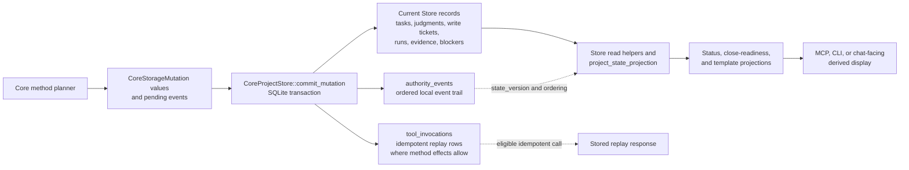

# Storage and transactions

This guide explains how the current implementation separates Runtime Home
storage, project Store access, method planning, storage mutation values,
atomic commits, replay records, and artifacts. It is not a storage contract.
Exact storage effects, record meanings, DDL, artifact lifecycle rules, and
versioning behavior belong to the storage Reference owners.

Start with [Storage](../reference/storage.md) for the storage owner family,
[Storage Effects](../reference/storage-effects.md) for method branch effects,
[Storage Records](../reference/storage-records.md), [Storage DDL](../reference/storage-ddl.md),
[Artifact Storage](../reference/storage-artifacts.md), and
[Storage Versioning](../reference/storage-versioning.md) when exact behavior is
needed.

## Storage Shape

`Volicord Runtime Home` is the local runtime data location for Volicord-owned
records and artifact data. `Product Repository` is the user's product-file
workspace. The implementation keeps these locations separate:

- Runtime Home path handling lives in
  [`crates/volicord-store/src/runtime_home.rs`](../../../crates/volicord-store/src/runtime_home.rs).
- Registry and project bootstrap live in
  [`crates/volicord-store/src/bootstrap.rs`](../../../crates/volicord-store/src/bootstrap.rs).
- SQLite open, validation, and transaction helpers live in
  [`crates/volicord-store/src/sqlite.rs`](../../../crates/volicord-store/src/sqlite.rs).
- Canonical schema SQL and initialization helpers live in
  [`crates/volicord-store/src/schema.rs`](../../../crates/volicord-store/src/schema.rs)
  and [`crates/volicord-store/src/schema/`](../../../crates/volicord-store/src/schema/).
- Project-local Core Store access is rooted at
  [`crates/volicord-store/src/core_pipeline.rs`](../../../crates/volicord-store/src/core_pipeline.rs)
  as `CoreProjectStore`. Opening lives in
  [`core_pipeline/open.rs`](../../../crates/volicord-store/src/core_pipeline/open.rs),
  replay lookup in
  [`core_pipeline/replay.rs`](../../../crates/volicord-store/src/core_pipeline/replay.rs),
  the atomic commit transaction in
  [`core_pipeline/commit.rs`](../../../crates/volicord-store/src/core_pipeline/commit.rs),
  mutation writers in
  [`core_pipeline/mutation_apply.rs`](../../../crates/volicord-store/src/core_pipeline/mutation_apply.rs),
  and shared persisted-value validation in
  [`core_pipeline/validation.rs`](../../../crates/volicord-store/src/core_pipeline/validation.rs).
- Artifact staging and persistent artifact body verification live in
  [`crates/volicord-store/src/artifacts.rs`](../../../crates/volicord-store/src/artifacts.rs).

The registry database tracks Runtime Home-level registration. Project
databases hold project-local state. This page avoids reproducing table layouts
or column definitions; use the storage Reference owners for those details.

## Store, Events, And Projections

This implementation map shows how method plans become current Store records,
events, replay rows, and read-time projections. Solid arrows show normal data
flow inside the implementation. Dotted arrows show ordering or replay
relationships. The diagram is not a storage contract, projection authority
contract, or table relationship diagram; exact meanings stay with
[Storage Records](../reference/storage-records.md), [Storage Effects](../reference/storage-effects.md),
[Storage Versioning](../reference/storage-versioning.md), and
[Projection and template display boundaries](../reference/projection-and-templates.md).

Current Store records are the source for ordinary reads. `authority_events`
preserve committed Core mutation order and local event facts. `tool_invocations`
support idempotent replay only for method branches whose storage effects define
that replay. Read-time projections and rendered displays help callers see
state, but they do not create authority, write tickets, evidence, acceptance,
or close readiness by display alone.

## Bootstrap And Schema Boundary

Administrative setup uses Store bootstrap and inspection paths before public
method execution is available:

1. `volicord-cli` plans administrative setup through
   [`crates/volicord-cli/src/connection_command.rs`](../../../crates/volicord-cli/src/connection_command.rs)
   and registration metadata helpers in
   [`crates/volicord-cli/src/registration.rs`](../../../crates/volicord-cli/src/registration.rs).
2. Store bootstrap initializes Runtime Home metadata and registers projects and
   Agent Connections through `initialize_runtime_home`, `register_project`, and connection registration helpers.
3. Empty registry/project state databases are initialized from canonical SQL,
   and existing state is opened only after SQLite helpers validate the current
   schema shape and storage profile.
4. Public method calls later open a project through `CoreProjectStore::open`
   rather than going through CLI setup code.

This keeps local administrative preparation separate from Core method
semantics. Exact CLI behavior is owned by [Administrative CLI](../reference/admin-cli.md).

## Read And Planning Flow

Normal public method execution has two implementation phases before persistence:

1. The shared Core preflight in
   [`crates/volicord-core/src/pipeline.rs`](../../../crates/volicord-core/src/pipeline.rs)
   validates the envelope, adapter binding, committed-effect envelope
   requirements, request hash, project state, verified connection context, replay
   eligibility, Task requirement, freshness, and operation category.
2. The method module in [`crates/volicord-core/src/methods/`](../../../crates/volicord-core/src/methods/)
   performs method-specific planning and returns an `OwnerPipelineBranch`.

Read-only methods and dry runs can return without a Core mutation commit.
Committed branches provide result fields, event data, and a list of
`CoreStorageMutation` values.

## Mutation Values

`CoreStorageMutation` functions as a command-like value between method planning
and Store persistence. Method planners create values such as `InsertTask`,
`InsertWriteTicket`, `InsertRun`, `PromoteStagedArtifact`,
`LinkArtifact`, and judgment updates. Store applies those values through
`ProjectMutation` inside the active commit transaction.

This structure gives the implementation a clear split:

- Core method planners decide what method-specific effect is intended.
- Store decides how that intended effect is applied to project-local storage.
- Reference owners decide the exact product meaning of the effect.

## Commit Input And Atomic Commit

For normal committed Core mutations, Core builds `CommitMutationInput` with the
project ID, method name, optional idempotency key, canonical request hash,
verified replay context, optional expected state version, and pending events.

`CoreProjectStore::commit_mutation` in
[`core_pipeline/commit.rs`](../../../crates/volicord-store/src/core_pipeline/commit.rs)
is the atomic Store boundary. It:

1. validates commit input and pending events;
2. begins an immediate SQLite transaction;
3. reads current project state inside the transaction;
4. handles eligible replay, replay-context mismatch, idempotency conflict, and
   stale expected-state outcomes before applying a new mutation;
5. advances `project_state.state_version` for a new committed mutation;
6. applies method-provided `CoreStorageMutation` values through
   `ProjectMutation`;
7. appends authority events;
8. builds and validates response JSON;
9. stores an idempotency replay row when the committed call is idempotent;
10. commits the transaction, or rolls back the whole attempt on error.

The implementation tests that protect this boundary include
`transaction_replay_returns_stored_response_before_stale_expected_state`,
`transaction_replay_hash_conflict_rejects_without_effect`, and
`transaction_replay_context_mismatch_precedes_request_hash_conflict` in
[`crates/volicord-store/src/core_pipeline.rs`](../../../crates/volicord-store/src/core_pipeline.rs),
plus Core pipeline tests in
[`crates/volicord-core/src/pipeline.rs`](../../../crates/volicord-core/src/pipeline.rs).

## State Version And Replay

The normal commit path advances project state once for a newly committed Core
mutation and stores the corresponding `authority_events` row or owner-defined
event batch with that resulting state version. Replay returns the stored
original response for an eligible idempotent call instead of applying another
mutation.

The request hash used for replay comes from `canonical_request_hash` in
[`crates/volicord-types/src/canonical.rs`](../../../crates/volicord-types/src/canonical.rs)
after typed request decoding. This supports stable comparison across JSON
property ordering and formatting while preserving semantic differences.

Exact state-version and replay behavior routes to
[Storage Versioning](../reference/storage-versioning.md), [API Errors](../reference/api/errors.md),
and the relevant method owner.

## Artifact Boundary

Artifact staging is intentionally separate from the normal Core mutation
commit path:

- `CoreService::stage_artifact` uses method preflight and then calls
  `CoreProjectStore::create_artifact_staging`.
- `create_artifact_staging` creates a transient staged-handle row and safe
  staged bytes.
- It does not use `CoreProjectStore::commit_mutation`, increment
  `project_state.state_version`, append `authority_events`, create replay rows,
  or insert persistent artifact rows.

Persistent artifact promotion happens through method-planned Core mutations,
such as `record_run`, when the applicable owner-defined behavior allows it.

Relevant tests include
`stage_artifact_creates_transient_handle_without_core_commit`,
`stage_artifact_dry_run_creates_no_handle_or_storage`, and
`record_run_promotes_staged_artifact_and_updates_evidence` in
[`crates/volicord-core/src/methods/tests/mod.rs`](../../../crates/volicord-core/src/methods/tests/mod.rs),
and `artifact_lifecycle_promotes_valid_handles_and_rolls_back_invalid_ones`
in [`tests/conformance/baseline.rs`](../../../tests/conformance/baseline.rs).

## Failure Boundaries

The implementation separates failure boundaries by effect path:

- Preflight and validation rejections return without a Core commit.
- Read-only, no-effect, and dry-run branches do not call
  `CoreProjectStore::commit_mutation`.
- Store commit outcomes distinguish committed, replayed, replay-context
  mismatch, idempotency conflict, and stale expected-state cases.
- Errors during the Store transaction roll back the commit attempt.
- Artifact staging has its own transaction and file cleanup boundary.
- Direct Product Repository file writes are outside the public Volicord API path.

These are implementation boundaries, not acceptance, security, or close-readiness
claims. Route exact method effects to the method owner and
[Storage Effects](../reference/storage-effects.md).
