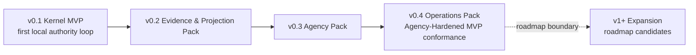
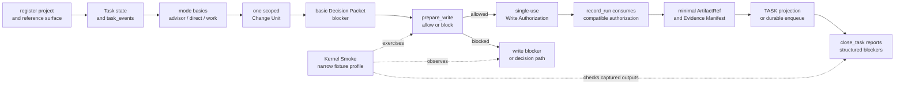

# Build: MVP Plan

## What this document helps you do

This document turns the MVP scope material into an implementable staged delivery plan. It keeps delivery order separate from storage schemas, DDL, projection template bodies, operator command syntax, and executable fixture contracts.

This is planning documentation. It does not authorize runtime/server implementation, generated operational files, executable fixtures, or runtime data before the documentation set is accepted for implementation planning. The first product MVP target is v0.1 Kernel MVP, also exercised by the Kernel Smoke conformance profile: one local process with modules proving one authority loop. v0.2 through v0.4 are staged packs toward the Agency-Hardened MVP reference conformance target. v1+ Expansion remains roadmap scope unless owner docs promote and prove it.

Use this when you need to plan what to build after the first runnable slice. Use the reference docs for exact contracts.

## Read this when

- You are planning v0.1 Kernel MVP or the packs that follow it.
- You need to review staged delivery scope without expanding the first implementation batch.
- You want to separate implementation order from storage, schema, fixture, and template details.

## Before you read

Read [Implementation Overview](implementation-overview.md), including its [Documentation Acceptance Status](implementation-overview.md#documentation-acceptance-status), [First Runnable Slice](first-runnable-slice.md), and [Runtime Walkthrough](runtime-walkthrough.md). For exact API contracts, use [MCP API And Schemas](../reference/mcp-api-and-schemas.md). For storage details and DDL, use [Storage And DDL](../reference/storage-and-ddl.md). For design-quality gate and validator behavior, use [Design Quality Policies](../reference/design-quality-policies.md). For conformance fixture semantics, use [Conformance Fixtures Reference](../reference/conformance-fixtures.md). For operator procedures and the conformance run overview, use [Operations And Conformance](../reference/operations-and-conformance.md). For v1+ Expansion candidates and promotion criteria, use the [Roadmap](../roadmap.md).

## Main idea

Delivery starts with a true Kernel MVP, not a full agency-hardened platform. v0.1 proves the first local authority loop. Later packs add evidence/projection depth, agency hardening, and operations/conformance coverage without changing the first target or promoting roadmap automation.

The center of the first plan is Core state, `task_events`, scoped write authority, artifact refs, a minimal Evidence Manifest, blockers, and the minimal reference surface and MCP reachability needed to exercise them. The initial implementation assumption remains one local process with modules. Projection-template polish, dashboards or hosted workflow UI, indexes, broad connector ecosystems or marketplaces, team workflow, surface-specific connector automation, metrics, parallel orchestration, and broad automation become useful after that path exists; they are not part of v0.1 Kernel MVP.

## Staged delivery

| Stage | Delivery target | Scope boundary |
|---|---|---|
| v0.1 | Kernel MVP | First local authority loop only. This is the first product MVP target and the first runnable conformance target through Kernel Smoke fixtures. |
| v0.2 | Evidence & Projection Pack | Deeper evidence, projection, and reconcile behavior after the kernel loop exists. |
| v0.3 | Agency Pack | Agency-Hardened MVP behavior around user judgment, Manual QA, detached verification, residual risk, stewardship, TDD, and feedback policy. |
| v0.4 | Operations Pack | Operator readiness, recover/export, artifact integrity, release handoff, and broader conformance suite coverage. |

Kernel Smoke remains the conformance authoring profile for v0.1 Kernel MVP. The name "Smoke" means the fixture profile is narrow; it does not make the first product target a sub-target.

### Boundary After Staged Delivery: v1+ Expansion

v1+ Expansion is roadmap scope, not a Build-owned staged delivery phase. Dashboard, hosted workflow UI, Browser QA Capture, Cross-Surface Verification, Context Index, broader connectors, metrics, team workflow, orchestration, and similar candidates stay outside v0.1 Kernel MVP and Agency-Hardened MVP unless owner docs explicitly promote and prove a future item.

## v0.1 Kernel MVP

v0.1 proves only the first local authority loop for one local project, one reference surface, and one Task. It should be small enough that every behavior can be observed through Core state, `task_events`, artifacts, projection freshness or enqueueing, and structured blockers.

v0.1 must prove:

- project registration
- Task state and `task_events`
- direct, work, and advisor mode basics
- one scoped Change Unit
- basic Decision Packet lifecycle sufficient to request, record, expose, and block on a needed decision
- `prepare_write` allow and block behavior
- durable single-use Write Authorization creation
- `record_run` consumption of one compatible authorization
- minimal `ArtifactRef`
- minimal Evidence Manifest
- close blocked when evidence or required decisions are missing
- `status` and `next` reads without mutation
- minimal `TASK` projection or durable projection enqueue
- basic Core fixture execution through the Kernel Smoke queue

v0.1 should not prove full detached verification independence, a Manual QA policy matrix, residual-risk accepted close semantics, stewardship validators, TDD trace, feedback loop policy, release handoff, full export/recover behavior, or a large fixture suite. Those are later-pack work.

At this point, the user or operator can observe a small but complete loop: current Task status, mode basics, active Change Unit, basic Decision Packet state, scoped write block/allow, durable Write Authorization creation and consumption, artifact and Evidence Manifest links, projection freshness or enqueueing, next-action guidance, and structured close blockers.

### Kernel MVP pack flow

This diagram is an implementation-order sketch for the v0.1 pack. Notice that the first proof is a single local authority loop. Deeper evidence, full projection behavior, agency hardening, and operations coverage stay in later staged packs; broader automation stays in v1+ Expansion unless owner docs promote and prove it.

Exact state and close behavior is owned by [Kernel Reference](../reference/kernel.md), public tool shapes by [MCP API And Schemas](../reference/mcp-api-and-schemas.md), projection rules by [Document Projection Reference](../reference/document-projection.md), and fixture semantics by [Conformance Fixtures Reference](../reference/conformance-fixtures.md#conformance-fixture-format). This flow does not add pack gates or fixture body requirements.

For practical fixture authoring order, use the [Kernel Smoke Authoring Queue](../reference/conformance-fixtures.md#kernel-smoke-authoring-queue). It maps the v0.1 runtime fixture candidates to this stage without changing the exact fixture body shape.

Kernel Smoke pass/fail comes from runtime fixtures that drive Core or operator actions and compare captured state, `task_events`, artifacts, projections, and primary errors. Status prose, Journey Card text, close prose, and scenario descriptions are observable context only; exact fixture body and assertion rules stay in [Conformance Fixtures Reference](../reference/conformance-fixtures.md#conformance-fixture-format).

## v0.2 Evidence & Projection Pack

v0.2 builds on the kernel loop by making evidence and readable output more complete while keeping projections derived from Core records.

Focus on:

- evidence manifest coverage beyond the minimum v0.1 loop
- evidence sufficiency, stale, blocked, partial, supported, unsupported, and not-applicable reporting where owner docs already define those states
- artifact relation and redaction/integrity checks needed by evidence and projection display
- Reference-required projection renderers when their source records exist
- projection freshness and failure isolation across the Reference-required `ProjectionKind` values
- reconcile behavior for human-editable proposal areas and managed-block drift
- projection and evidence fixture coverage beyond Kernel Smoke

Do not make projection template polish or renderer-first work drive Task, Run, evidence, verification, or close design. Reference-required projection support is staged/reference support, not a retroactive v0.1 requirement; v0.1 remains limited to a minimal `TASK` projection or durable projection enqueue. `ProjectionKind` values and API-owned tiering belong to [MCP API And Schemas](../reference/mcp-api-and-schemas.md#shared-schemas); [Document Projection Reference](../reference/document-projection.md#template-tiers) owns authority boundaries, source-record rules, freshness rules, and template tier presentation; [Template Reference](../reference/templates/README.md) owns rendered template bodies and display cards.

## v0.3 Agency Pack

v0.3 preserves Agency-Hardened MVP as a later reference conformance target, not as first implementation scope. This pack hardens the kernel so the local reference path can route user-owned judgment, assurance, and risk with honest boundaries.

Focus on:

- Decision Packet quality and user-judgment routing
- sensitive-action Approval, Decision Packet, and Write Authorization separation
- Manual QA policy matrix and Manual QA blockers
- detached verification independence, including same-session verification guard behavior
- residual-risk visibility before acceptance and close
- residual-risk accepted close full semantics
- stewardship validators and codebase stewardship coverage
- TDD trace behavior where policy requires it
- feedback loop policy where policy requires it
- distinct Approval, Manual QA, verification-waiver, acceptance, and residual-risk-acceptance judgments
- agency conformance fixtures that prove behavior through Core state, events, artifacts, projections, and errors

Passing this pack means the local reference path handles the agency-preserving parts of work with clear boundaries. It does not promote v1+ Expansion automation into staged delivery.

## v0.4 Operations Pack

v0.4 completes the local operational proof around the same Core state model.

Focus on:

- doctor/readiness categories for runtime home, project state, artifact store, reference surface, MCP availability, projections, reconcile, validators/checks, and agency/stewardship/context
- recover handling for interrupted or drifted operational state
- export behavior for state snapshots, report projection snapshots, artifact refs, redaction status, omitted-secret notes, and retained, expired, or unavailable artifact status
- artifact integrity checks
- release handoff report/export profile where owner docs define it
- operator smoke over connect, doctor, serve MCP, projection refresh, reconcile, recover, export, artifacts check, and conformance run
- large fixture suite coverage for the Agency-Hardened MVP reference target
- later-boundary checks that keep Dashboard, hosted workflow UI, Browser QA Capture, Cross-Surface Verification, Context Index, parallel orchestration, team workflow, broad connector automation, native hook or sidecar expansion, derived metrics, and preventive guard expansion in v1+ Expansion unless separately proven and promoted

Do not create a second state model for operator commands. Operators diagnose, repair, export, or run fixtures over the same Core state model. Exact command names and flags can vary; the contract is the command-independent behavior over Core state, `task_events`, artifacts, projections, and existing errors or diagnostics.

Docs-maintenance remains a separate read-only documentation profile. It may report documentation drift, but it is not v0.1 Kernel MVP, not Agency-Hardened runtime conformance, and not an implementation-readiness signal.

## Roadmap-Scoped v1+ Expansion Candidates

Keep these in roadmap-scoped v1+ Expansion unless a future plan promotes them through owner docs with a capability profile, exact contracts, redaction/secret/PII policy, artifact retention and test-environment rules when runtime surfaces are captured, fixtures or a conformance target, fallback behavior, and no projection-as-canonical dependency:

- dashboard, hosted workflow UI, or local metrics as authority, implementation-readiness, or close-readiness surfaces
- broad connector marketplace or surface ecosystem beyond the one reference surface
- Browser QA Capture as required automation or acceptance replacement
- Cross-Surface Verification as a required assurance path
- preventive `T4` guard expansion without a proven pre-tool blocking path
- native hook expansion or Advanced Sidecar Watcher beyond a concrete reference-surface capability
- Context Index as authority or read/write prerequisite
- deployment, canary, rollback, or production monitoring automation
- parallel orchestration and concurrent lane scheduling
- team workflow, permissions, and team profile export/import
- Local Derived Metrics or long-term operational metrics as staged-delivery-critical state

If a later feature is useful during implementation, keep it as read-only display, metadata, artifact candidates for existing owner paths, or fixture candidate until owner docs define and prove its authority path. It must not become a prerequisite for v0.1 Kernel MVP, Agency-Hardened MVP, or any close-readiness claim.

## Exit criteria by stage

Use these as implementation-readable checklists for future runtime planning after documentation acceptance. They restate staged exits; they do not add schemas, fixtures, DDL, or new runtime requirements, and they do not authorize implementation while the [Documentation Acceptance Status](implementation-overview.md#documentation-acceptance-status) still blocks first runtime-batch planning.

### v0.1 Kernel MVP exit checklist

- One project is registered.
- One reference surface is registered with an honest guarantee level.
- One Task can be created, read, advanced, and represented in `task_events`.
- Direct, work, and advisor mode basics are observable without implying full policy coverage.
- One Change Unit scopes product writes.
- Basic Decision Packet lifecycle can request, record, expose, and block on a required decision.
- Product writes without an active compatible Change Unit block.
- Out-of-scope intended writes block.
- Allowed `prepare_write` creates a durable single-use Write Authorization.
- A compatible `record_run` consumes the authorization once.
- Minimal artifact registration returns an `ArtifactRef`.
- Minimal Evidence Manifest links Run and artifact support.
- `status` and `next` return current state without mutating state.
- A `TASK` projection is current or durably enqueued.
- `close_task` blocks when required evidence or a required decision is missing.

### v0.2 Evidence & Projection Pack exit checklist

- Evidence state covers owner-defined sufficient, partial, stale, blocked, unsupported, and not-applicable cases needed after v0.1.
- Artifact relations, integrity, and redaction metadata support evidence and projection display.
- Reference-required pre-verification projections can enqueue or render when source records exist.
- Projection failure is isolated from Core state failure.
- Managed Markdown edits or proposal sections create reconcile items.
- Evidence and projection fixtures extend Kernel Smoke without changing the fixture body shape.

### v0.3 Agency Pack exit checklist

- Decision Packet quality and user-judgment routing are fixture-proven.
- Sensitive-action Approval does not substitute for Decision Packets, Write Authorization, Manual QA, verification, acceptance, or residual-risk acceptance.
- Detached verification independence and same-session verification guard behavior are fixture-proven.
- Manual QA policy matrix and QA blockers are fixture-proven where policy requires them.
- Close-relevant residual risk is visible before successful acceptance or close.
- Risk-accepted close cites accepted Residual Risk refs under the owner semantics.
- Stewardship validators, feedback loop policy, and TDD trace behavior are covered where policy requires them.
- Agency conformance proves Journey visibility, user judgment, Autonomy Boundary respect, distinct user judgments, and residual-risk visibility.

### v0.4 Operations Pack exit checklist

- Doctor/readiness reports runtime home, project state, artifact store, reference surface, MCP availability, projections, reconcile, validators/checks, and agency/stewardship/context categories.
- Recover handles interrupted or drifted operational state without treating recovery artifacts as successful completion proof.
- Export includes state snapshots, report projection snapshots, artifact refs, redaction status, omitted-secret notes, and retained, expired, or unavailable artifact status.
- Artifact integrity check reports missing or mismatched artifacts through existing diagnostics.
- Release handoff report/export behavior follows its owner profile without taking over deployment, merge, rollback, or production authority.
- Large fixture suite coverage proves Agency-Hardened MVP through exact-shape fixtures, not prose.
- Later-boundary checks keep v1+ Expansion items out of staged delivery unless owner docs promote and prove them.

## Observable by stage

| Stage | What the user or operator can observe |
|---|---|
| v0.1 Kernel MVP | A local project and Task move through the first authority loop: mode basics, Change Unit scope, Decision Packet blocker, `prepare_write`, Write Authorization, `record_run`, artifact, Evidence Manifest, status/next, `TASK` projection or enqueue, and close blockers. |
| v0.2 Evidence & Projection Pack | Evidence state, artifact-backed support, projection freshness, projection failure isolation, and reconcile items are visible from owner records. |
| v0.3 Agency Pack | Decision quality, Approval separation, Manual QA, detached verification, residual risk, stewardship, TDD, feedback, acceptance, and close behavior explain whether work can proceed or close. |
| v0.4 Operations Pack | Doctor, recover, reconcile, export, release handoff, artifact integrity, and conformance fixtures prove the same Core state and leave later automation in roadmap-scoped v1+ Expansion. |

After staged delivery, promoted roadmap items can read, display, wrap, or extend the authority loop only after owner docs define exact contracts and fixture coverage.
