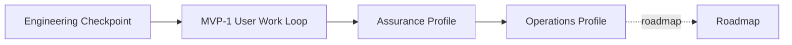
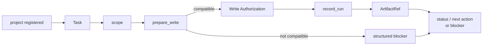

# Build: Staged Delivery Plan

## What this document helps you do

This document turns the broad early-stage planning material into a deliberately smaller delivery model. Engineering Checkpoint is an internal authority-loop smoke for Core-owned state, not a product MVP. MVP-1 User Work Loop is the first user-value milestone: the first narrow user-facing loop where ordinary work can be tracked, explained, and blocked honestly without becoming a full assurance, QA, evaluation, reporting, or operations system.

This is planning documentation. It does not authorize runtime/server implementation, generated operational files, executable fixtures, fixture files, or runtime data before documentation acceptance and a separate implementation-planning readiness decision. Conformance fixture documentation is a future verification plan; the current documentation-only repository does not contain runnable Harness Server conformance tests. The first runnable target is Engineering Checkpoint, with Kernel Smoke as a narrow future smoke-check authoring label. The first user-value target is MVP-1 User Work Loop. Assurance Profile and Operations Profile harden agency assurance, operations, and handoff behavior later. Roadmap remains future scope unless owner docs promote and prove it.

Use this when you need to plan what to build after documentation acceptance and a separate implementation-planning readiness decision. Use the reference docs for exact contracts.

## Read this when

- You are separating the first internal authority proof from the first user-value slice.
- You need to review staged delivery scope without expanding the first implementation batch.
- You want to keep implementation order separate from storage, schema, fixture, and template details.

## Before you read

Read [Implementation Overview](implementation-overview.md), including its [Documentation Acceptance Status](implementation-overview.md#documentation-acceptance-status), before using this stage plan. Use [First Runnable Slice](first-runnable-slice.md) for the Engineering Checkpoint smoke sequence and [Runtime Walkthrough](runtime-walkthrough.md) for the request-to-close runtime path.

For exact contracts, use the [Reference Index](../reference/README.md) and pick the owner for the question in front of you. For Roadmap candidates and promotion criteria, use the [Roadmap](../roadmap.md).

## Main idea

Harness value is not merely that a pre-write scope-check loop exists. Harness should preserve scope, user-owned judgment, evidence references, close readiness, acceptance boundaries, and residual risk in a local authority record. Delivery therefore has two early targets:

- Engineering Checkpoint proves the smallest coherent internal Core authority loop.
- MVP-1 User Work Loop proves that ordinary users can start or resume tracked work, see the scope and judgment boundaries, and understand evidence, blockers, next action, and residual-risk visibility without a full assurance system.

The first slice stays intentionally narrow. It proves one local project registration, one active Task, one scoped boundary, one `prepare_write` pre-write scope-check path, one single-use internal Write Authorization record, one recorded Run, one artifact/evidence reference, and one structured status/blocker response. It is not a product MVP. MVP-1 begins user value when the user-facing path can translate normal work into scope, non-goals, success criteria, user-owned judgment, evidence summary, close blockers, and residual-risk visibility without confusing sensitive-action approval, work acceptance, and risk acceptance.

Projection-template polish, detailed reports, dashboards or hosted workflow UI, indexes, broad connector ecosystems or marketplaces, team workflow, surface-specific connector automation, metrics, parallel orchestration, and broad automation become useful after the authority record and user-facing value path exist. They are not first-slice requirements.

The early output model is intentionally small:

- Engineering Checkpoint needs only minimal status/blocker output from Core state; it does not need a projection renderer.
- MVP-1 needs only a compact Core-derived status card and minimum user-readable summaries for current work status, next output, user judgment request/record, evidence summary, close blocker summary, residual-risk visibility, and separate display of sensitive approval, work acceptance, and risk acceptance. These summaries are not a full projection/reporting system.
- Journey Card, Journey Spine, Run Summary, TDD Trace, Module Map, Interface Contract, Export, detailed Evidence Manifest, and detailed Eval outputs remain Future/diagnostic projections or other later-profile scope unless an owner profile explicitly promotes them.

## MVP-1 User Work Loop implementation contract

MVP-1 User Work Loop is the first user-value implementation contract. It is reached after Engineering Checkpoint and must not be pulled into the first runnable internal smoke. Its target statement is:

When a user starts work in plain language, Harness preserves a local basis for the work scope, pending user judgments, evidence summary, close blockers, next safe action, and minimal separation between work acceptance and residual-risk acceptance.

MVP-1 includes:

- plain-language work intake and resume
- scope, non-goals, and success criteria
- user judgment request and record through `harness.request_user_judgment` and `harness.record_user_judgment`
- cooperative pre-write scope check through Core and `prepare_write`, not OS-level blocking or arbitrary-tool isolation
- run and evidence reference recording through the `record_run` / artifact-ref path
- compact status and next-action summary through `harness.status.next_actions`; a separate `harness.next` method is later/compatibility material, not an MVP-1 requirement
- close-blocker display through status or close responses
- minimal work acceptance and residual-risk separation through user-judgment and residual-risk records when those routes are required

MVP-1 excludes:

- dashboard
- hosted UI
- full Decision Packet output for every judgment
- OS-level sandbox or permission isolation
- detailed Evidence Manifest
- full report/export
- runtime conformance suite
- operations, recovery, and handoff pack

This contract is deliberately user-visible but small. It does not require detached verification by default, a full Manual QA matrix, full Approval lifecycle hardening, projection job infrastructure, broad connector support, operations tooling, or any roadmap automation. Later profiles may add those behaviors only through their owner contracts.

## Delivery Model

| Concept | What it proves | What it does not prove |
|---|---|---|
| Engineering Checkpoint | A first runnable internal Core authority loop over one local project registration, one active Task, one scoped boundary, one `prepare_write` pre-write scope-check path, one single-use internal Write Authorization record, one recorded Run, one artifact/evidence ref, and one structured status/blocker response. | User-facing product value, natural-language intake, full Discovery, full-format user judgment presentation, full Evidence Manifest, Eval, Manual QA, Acceptance, residual-risk acceptance, full close semantics, projection rendering, conformance runner, operations/export/recover, dashboards, and connectors. |
| MVP-1 User Work Loop | Users can start or resume tracked work in ordinary language and see Core-derived scope, non-goals, success criteria, judgment requests/records, status/next output, evidence summary, close blockers, residual-risk visibility, and separated sensitive approval / work acceptance / risk acceptance display. | Dashboard, hosted UI, full Decision Packet output for every judgment, OS-level sandbox or permission isolation, detailed Evidence Manifest, full report/export, runtime conformance suite, operations/recovery/handoff pack, full detached verification unless an active profile requires it, full Manual QA matrix, full waiver machinery, polished Journey/Spine/reporting, detailed Eval, TDD Trace, Module Map, Interface Contract, broad connectors, and operations suite. |
| Assurance Profile | The MVP-1 user-value path is hardened with verification, QA, residual-risk, work-acceptance, and stewardship profiles. | Operator recovery/export completeness, release handoff, broad operations coverage, roadmap automation. |
| Operations Profile | The same Core model supports doctor/readiness, recover/export, artifact integrity, release handoff, and broader conformance coverage. | Dashboard, hosted workflow UI, broad connectors, Browser QA Capture automation, Cross-Surface Verification automation, Context Index, team workflow, orchestration. |
| Roadmap | Future expansion candidates can be promoted only after owner docs define exact contracts, guarantee level, fixtures, fallback behavior, and no projection-as-canonical dependency. | No roadmap candidate is required for Engineering Checkpoint, MVP-1, Assurance Profile, or Operations Profile unless explicitly promoted. |

Legacy aliases appear only to help readers map older text to the current model:

| Current concept | Legacy alias |
|---|---|
| Engineering Checkpoint | `v0.1 Core Authority Smoke` |
| MVP-1 User Work Loop | `v0.2 First User-Value Slice` |
| Assurance Profile | `v0.3 Agency Assurance Pack` |
| Operations Profile | `v0.4 Operations & Handoff Pack` |
| Roadmap | `v1+ Expansion` |

Delivery map summary: staged delivery moves from a narrow Core authority smoke loop to first user value, then assurance, then operations and handoff; Roadmap remains future promotion scope.

Kernel Smoke remains a narrow future authoring label for Engineering Checkpoint checks. The label does not make Engineering Checkpoint a product MVP, and it does not require a full conformance suite, conformance runner, or future fixture catalog before the internal Core authority path is proven.

Conformance fixture profiles follow the same boundaries: Engineering Checkpoint fixtures for Engineering Checkpoint, MVP-1 User Work Loop fixtures for MVP-1 User Work Loop, Assurance Profile fixtures for Assurance Profile, and Operations Profile or promoted-expansion fixtures for Operations Profile and promoted Roadmap candidates.

The hardened local reference target is only the aggregate target reached by Assurance Profile and Operations Profile, not a profile name or separate delivery stage.

### Security guarantee staging

Build staging does not upgrade security guarantees by itself. Security wording follows the [Security Threat Model stage map](../reference/security-threat-model.md#guarantee-levels-by-stage):

| Stage | Guarantee posture to plan for |
|---|---|
| Engineering Checkpoint | Cooperative plus limited detective behavior. Core can refuse invalid state changes and return structured blockers, but the reference path does not stop arbitrary local processes or isolate tools by default. |
| MVP-1 User Work Loop | Cooperative plus limited detective behavior with honest user-visible blockers, MCP availability, evidence gaps, close readiness, and honest guarantee display. No preventive or isolated behavior is claimed. |
| Assurance Profile | Stronger separation and detective assurance around verification, Manual QA, residual risk, work acceptance, Approval, and stewardship. |
| Operations Profile | Detective operations around doctor/readiness, recover/export, artifact integrity, projection freshness, and release handoff. |
| Roadmap | Preventive or isolated candidates only after owner docs define and promote exact covered operations or real isolation boundaries, with conformance proof. |

### API surface by stage

The API reference defines exact schemas for every method it documents. Staged delivery decides when a method/profile is active. Use the API [Stage Profile Manifest](../reference/api/schema-core.md#stage-profile-manifest) as the owner table, and use its [stage-specific active value sets](../reference/api/schema-core.md#stage-specific-active-value-sets) for artifact and owner-ref enum validation. Later-profile fields stay exact for their profile, but they are not part of an earlier stage exit.

| Stage | Active API surface | Later-profile fields to keep out of the stage exit |
|---|---|---|
| Engineering Checkpoint | Minimal `harness.status` status/blocker read, `harness.prepare_write`, `harness.record_run`, one owner-valid active Task/scope setup path, and optionally a narrow `harness.close_task` blocker smoke. | Natural-language intake, full Discovery, full-format user judgment presentation, Evidence Manifest, Eval, Manual QA, Acceptance, residual-risk acceptance, full close semantics, projection rendering, conformance runner, separate `harness.next`, reconcile, export/recover, broad operations. |
| MVP-1 User Work Loop | User-facing intake/start/resume behavior, work-shape classification, next-safe-action output through `harness.status.next_actions`, minimal `harness.request_user_judgment` / `harness.record_user_judgment`, evidence summaries through `harness.record_run`, close blocker summaries through `harness.close_task`, and a compact Core-derived status card. | Separate `harness.next`, full detached verification independence unless required by active profile/user request/task type/risk profile, full Manual QA matrix, full waiver machinery, Approval hardening, detailed Eval, TDD Trace, Module Map, Interface Contract, export/recover, broad operations. |
| Assurance Profile | `harness.launch_verify`, `harness.record_eval`, `harness.record_manual_qa`, assurance/waiver/approval/risk profiles of judgment methods, evidence/feedback/TDD profiles of `harness.record_run`, and ValidatorResult-emitting assurance paths. | Operator recover/export completeness, broad projection/reconcile operations, release handoff. |
| Operations Profile | Projection freshness in API responses, reconcile judgment profile, operator readiness/recover/export/artifact-integrity/conformance surfaces owned by Operations. | Dashboard, hosted workflow UI, broad connectors, automation, team workflow, orchestration unless promoted later. |

### Read-only MCP resources by stage

MCP resources are read-only and follow the same staged delivery boundary as public tools. Reading a resource must not create Task records, decisions, projection jobs, reconcile items, or state changes.

| Stage | Resource scope in stage | Keep out of the stage exit |
|---|---|---|
| Engineering Checkpoint | `harness://project/current`, `harness://task/active`, `harness://task/{task_id}`, and optional `harness://task/{task_id}/summary` / `harness://status/card` for current state, blockers, pre-write scope-check status, and minimal Run/artifact/evidence refs. | Journey, Spine, full user judgment storage/presentation, Evidence Manifest, bundle, reports, design/domain maps, module maps, interface contracts, projection jobs, and full projection rendering. |
| MVP-1 User Work Loop | Engineering Checkpoint resources plus minimal user-judgment context for current work. Evidence summary, close blocker summary, work-acceptance display, sensitive-approval display, and residual-risk visibility can appear through status/card or task summary output. | Detailed Evidence Manifest resource, detached verification/QA resources unless profile-required, reports, bundles, Journey/Spine polish, design maps, module maps, interface contracts, export/recover. |
| Assurance Profile | Profile-gated assurance reads such as `harness://policy/sensitive-categories` and `harness://task/{task_id}/evidence-manifest` when evidence/assurance support is enabled. | Operator report/export completeness and broad operations resources. |
| Operations Profile | Operations reads such as broad `harness://project/surfaces`, `harness://task/{task_id}/reports/latest`, and `harness://task/{task_id}/bundle/current` when connector freshness, report, export, recover, or handoff profiles are in scope. | Dashboard, hosted workflow UI, broad connector automation, and roadmap resources unless promoted later. |
| Future/diagnostic | Owner-promoted reads such as `harness://task/{task_id}/spine`, `harness://task/{task_id}/journey`, `harness://task/{task_id}/change-unit-dag`, `harness://design/domain-language`, `harness://design/module-map`, and `harness://design/interface-contracts`. | Treating diagnostic resources as required for Engineering Checkpoint or minimum MVP-1. |

### Operator surface by stage

Operator commands are illustrative implementation choices. The stage requirement is the behavior, not the final command spelling.

| Stage | Operator behavior in scope | Operator behavior outside the stage |
|---|---|---|
| Engineering Checkpoint | Minimal local connect/register, basic status or diagnostic read, and local API/MCP exposure only if the first slice requires that boundary. | Projection refresh, reconcile, recover, export, artifacts check, conformance runner, release handoff, and broad doctor/readiness. |
| MVP-1 User Work Loop | The same minimal surface plus user-facing status/next diagnostics for current work, user judgments, evidence state, close blockers, residual-risk visibility, and separated sensitive approval / work acceptance / risk acceptance display. | Assurance operations, recover/export, release handoff, broad projection/reconcile operations, full conformance run, and broad operations coverage. |
| Assurance Profile | Assurance-profile support for verification, Manual QA, residual-risk, work-acceptance, stewardship, and context-hygiene behavior through owner paths. | Operator recover/export completeness, release handoff, broad projection/reconcile operations, and full operations conformance. |
| Operations Profile | Full local operations support: doctor/readiness, projection refresh, reconcile, recover, export, artifacts check, release handoff where defined, and conformance run after runtime suites are materialized. | Remote/shared operations, dashboards, hosted workflow UI, broad connector automation, team workflow, and orchestration unless later promoted. |
| Roadmap | Promoted roadmap operations only after owner docs define exact contracts, guarantee level, fixtures, and fallback behavior. | Unpromoted roadmap candidates remain outside staged delivery. |

### Boundary after staged delivery: Roadmap

Roadmap is future scope, not a Build-owned staged delivery phase. Dashboard, hosted workflow UI, Browser QA Capture automation, Cross-Surface Verification automation, Context Index, broader connectors, metrics, team workflow, orchestration, and similar candidates stay outside Engineering Checkpoint through Operations Profile unless owner docs explicitly promote and prove a future item.

## Engineering Checkpoint

Engineering Checkpoint is an internal Core authority smoke slice for implementer confidence. It should prove only the smallest coherent loop that makes Harness a local authority record instead of chat memory or generated Markdown. It is not user value validation and must not be described as a product MVP.

Engineering Checkpoint must prove:

- one local project registration
- one active Task in Core-owned state
- one scoped boundary for the intended change, represented by the Change Unit owner shape only where the reference contract requires it
- one `prepare_write` compatible/structured-blocker path
- one durable single-use internal Write Authorization record
- one `record_run` that consumes that internal Write Authorization record
- one registered `ArtifactRef` or equivalent evidence reference owned by Core/API contracts
- one structured status/blocker response for missing scope, missing pre-write scope check, or missing artifact/evidence support

The matching storage path is the minimal authority subset of [Storage And DDL: MVP-1 minimal storage schema](../reference/storage-and-ddl.md#mvp-1-minimal-storage-schema): project identity, one Task, one task-scope/Change Unit row, one cooperative write-check / Write Authorization path, one Run, one evidence ref, and structured blockers. User-facing judgment records are added for MVP-1 user value, but Approval records, detailed Evidence Manifest, Manual QA, Eval, residual-risk lifecycle tables, projection jobs, reconcile items, validator runs, Journey records, and diagnostic/stewardship tables remain later-profile storage unless a profile owner explicitly promotes them.

Engineering Checkpoint explicitly excludes natural-language intake, full Discovery, full-format user judgment presentation, full Evidence Manifest, Eval, Manual QA, Acceptance, residual-risk acceptance, full close semantics, detached verification, Product/UX judgment versus Technical judgment presentation, stewardship, feedback-loop policy, projection rendering, conformance runner, operations/export/recover, dashboards, connectors, broad operator entrypoints, future fixture catalog, and release handoff. Those are later stages or future scope.

Kernel Smoke candidates for Engineering Checkpoint should assert only the minimal authority loop through Core state, the required owner records for that loop, artifact/evidence refs, and structured blockers. Projection polish, detailed templates, renderer output, and broad fixture catalogs are not first-slice conformance truth.

At this point, an implementer can observe that Core owns the minimal state, a scoped write is compatible or rejected with a structured blocker, one internal Write Authorization record is consumed once, an artifact/evidence ref is linked to the recorded Run, and status/blocker output can return structured blockers. This is implementer confidence, not proof that users experience Harness value.

### Contract field staging

Reference schemas may list fields that become necessary only when the related capability is in scope. Build does not redefine field requiredness; it tells implementers when a capability enters the staged plan. Read each field through the owner contract and the active stage:

| Stage | Build reading rule | Owner contracts to apply |
|---|---|---|
| Engineering Checkpoint | Use only the owner-defined fields needed to prove the narrow authority loop in the [MVP-1 minimal storage schema](../reference/storage-and-ddl.md#mvp-1-minimal-storage-schema). Avoid creating future-profile records just to satisfy a broad checklist; if a minimal seeded blocker uses an owner ref, apply only the valid shape for that owner path, not profile-specific user-facing judgment presentation quality. | [Kernel Reference](../reference/kernel.md), [MVP API](../reference/api/mvp-api.md), [API Schema Core](../reference/api/schema-core.md), [Storage And DDL](../reference/storage-and-ddl.md), [Conformance Fixtures Reference](../reference/conformance-fixtures.md#kernel-smoke-authoring-queue). |
| MVP-1 User Work Loop | Add the fields and display summaries needed for users to understand current work shape, scope/non-goals/success criteria, pending user judgments, evidence summary, close blockers, next safe action, residual-risk visibility, and separated approval/work-acceptance/risk-acceptance displays. Work-acceptance and residual-risk facts stay distinct when relevant, but they fit inside the minimal summaries. | [MVP API](../reference/api/mvp-api.md), [API Schema Core](../reference/api/schema-core.md), [Kernel Reference](../reference/kernel.md), [Document Projection Reference](../reference/document-projection.md), [Template Reference](../reference/templates/README.md). |
| Assurance Profile / Operations Profile | Add verification, QA, residual-risk, work-acceptance, stewardship, projection/reconcile, operations, export/recover, artifact-integrity, and release-handoff profiles only where owner docs define them. | [Design Quality Policies](../reference/design-quality-policies.md), [Operations And Conformance](../reference/operations-and-conformance.md), [Conformance Fixtures Reference](../reference/conformance-fixtures.md), [Future Fixture Catalog](../reference/future-fixture-catalog.md), [Storage And DDL](../reference/storage-and-ddl.md). |

Required in an API schema therefore means required when that tool call, record, or profile is active or used. It does not make a future-profile field part of the smallest runnable slice by itself.

### Implementation decisions needed before server coding

This section is the central server-coding decision log for decisions found during maintainer review or first runtime-batch planning. Do not create scattered `TODO_DECISION` markers or vague follow-ups for major implementation choices.

#### Documentation-resolved decisions for MVP-1

The items below are resolved in the documentation baseline. They still require maintainer acceptance with the rest of the documentation before coding, but they are no longer open Build-scope questions.

| Decision-log item | Documentation baseline decision | Coding boundary |
|---|---|---|
| Simplified judgment model and naming | Canonical docs use `UserJudgment` / `user_judgment`, `harness.request_user_judgment`, `harness.record_user_judgment`, `judgment_type`, `presentation`, and `display_label`. Decision Packet is optional full-format presentation, not the default record family. | Preserve these names unless maintainers explicitly reopen the item before API/DDL coding. |
| `request_user_decision` vs `request_user_judgment` | `harness.request_user_judgment` and `harness.record_user_judgment` are canonical. `harness.request_user_decision` and `harness.record_user_decision` are compatibility aliases only. | Compatibility aliases must not create extra methods, state paths, or authority. |
| `harness.next` separate method vs `status.next_actions` | `harness.status.next_actions` is the MVP-1 next-safe-action output. `harness.next` has moved to later/compatibility material derived from the same Core state. | MVP-1 satisfies the minimum next-action requirement through status when it clearly returns the next safe action and smallest unblocker. |
| MVP-1 storage minimum | MVP-1 uses a small persistence model: `projects` / `project_state`, `tasks`, task-scope fields or `change_units`, `user_judgments`, cooperative `write_authorizations`, `runs`, `evidence_refs`, and `blockers`, with `tool_invocations` / `task_events` only as replay/audit support. | Do not add later-profile `task_intake`, `residual_risks`, `evidence_summaries`, `close_readiness`, `projection_status_cards`, `approvals`, `evidence_manifests`, Manual QA, Eval, projection job, reconcile, export/recover, validator-run, Journey, or operations tables to the MVP-1 exit unless an owner profile promotes them. |
| Local access error taxonomy | API-visible early failures use the MCP/API owner taxonomy: `MCP_UNAVAILABLE`, `LOCAL_ACCESS_MISMATCH`, `STATE_CONFLICT` for stale expected state or replay conflict, `CAPABILITY_INSUFFICIENT` for recognized surfaces lacking required capability, and `PROJECTION_STALE` only for stale readable views. Operations may distinguish `MCP_SERVER_UNAVAILABLE` from `SURFACE_MCP_UNAVAILABLE`. | Build docs do not define new error codes. Use the MCP/API and Security owner contracts for precedence and display-safe details. |
| Compact status card scope | MVP-1 status/card output is a Core-derived display of current work shape, scope/non-goals/success criteria, pending judgments, evidence summary or gaps, close blockers, residual-risk summary, next safe action, guarantee level, and source/freshness refs. Optional card persistence is not required. | A compact card must not create Write Authorization records, make writes compatible, satisfy evidence, record acceptance, accept residual risk, close a Task, or become canonical state. Stale, failed, or unknown freshness must be visible. |
| Small direct change evidence requirement | Small direct changes still use explicit scope, compatible `prepare_write`, and `record_run`. Evidence may be lightweight, but the completion claim must be backed by the Run/artifact/evidence refs or evidence summary required by the active path. | Missing required evidence blocks close; small-change labeling must not bypass authority, user judgment, evidence, or risk visibility. Detailed Evidence Manifest remains later-profile scope. |
| Acceptance and residual risk minimal records | MVP-1 separates sensitive-action approval, work acceptance, and residual-risk acceptance through `user_judgment` records when those routes are required. Visible residual risk can be represented by `blockers` and the related judgment/evidence refs; rich `residual_risks` rows are later-profile. | Work acceptance is not sensitive-action approval, and residual-risk acceptance is not work acceptance. Committed Approval lifecycle, full residual-risk lifecycle metadata, and assurance hardening remain later-profile unless promoted. |

#### Implementation decisions still open

No old MVP-1 scope item from the ledger above remains open as a Build-contract question after this pass. The remaining open items are implementation-readiness and future-review gates, not scattered product-contract TODOs.

| Decision-log item | Current status | Decision condition |
|---|---|---|
| Implementation-readiness judgment | Not accepted. | Maintainers must deliberately update [Implementation Overview: Documentation acceptance status](implementation-overview.md#documentation-acceptance-status) after the readiness criteria are satisfied or remaining blockers are reclassified. |
| Public API/DDL coding acceptance | Not accepted for coding. The documentation baseline records the intended Engineering Checkpoint and MVP-1 contracts, but maintainer acceptance is still required before server code, DDL, migrations, fixtures, or runtime data are created. | Before coding a behavior, maintainers must accept the relevant owner docs or explicitly defer a behavior with stage impact. |
| Newly discovered owner-contract conflict | None currently recorded in this Build ledger. | If maintainer review or runtime-batch planning discovers a real schema/design, stage-boundary, guarantee-level, fixture-semantics, or storage/API conflict, add it here with stage impact before coding the affected behavior. |
| Documentation drift | Not a server-coding decision by default. | If a docs-maintenance finding exposes a real owner-contract decision or stage blocker, promote it into this log with stage impact; otherwise route it through the Authoring Guide tracker. |

When a confirmed decision is added, record:

- owner document or owner section
- affected behavior, field, table, fixture semantics, guarantee level, or stage boundary
- affected stage
- options considered
- decision needed before server code or DDL changes
- whether the item blocks documentation acceptance, implementation planning, server coding, or only a later stage

### Implementation readiness checklist

This checklist is not accepted yet. Maintainers must accept each item, or explicitly defer it with stage impact, before first runtime-batch planning or server coding begins.

- Engineering Checkpoint API subset accepted.
- Engineering Checkpoint DDL accepted.
- State transitions accepted.
- Internal Write Authorization lifecycle accepted.
- Artifact/evidence ref shape accepted.
- Structured blocker shape accepted.
- Local access posture accepted.
- MVP-1 promotion criteria accepted.

### Engineering Checkpoint flow

Engineering Checkpoint summary: this planning flow proves one authority loop around project/Task setup, scope, `prepare_write`, internal Write Authorization record, `record_run`, artifact/evidence refs, and structured status/blocker output. It is not an implemented runtime flow in this repository today.

Exact state and blocker behavior is owned by [Kernel Reference](../reference/kernel.md), public tool shapes by [MVP API](../reference/api/mvp-api.md), shared API shapes by [API Schema Core](../reference/api/schema-core.md), API errors by [API Errors](../reference/api/errors.md), and active-path fixture body/assertion mechanics by [Conformance Fixtures Reference](../reference/conformance-fixtures.md#conformance-fixture-format). Later-profile scenario and shorthand catalogs stay in [Future Fixture Catalog](../reference/future-fixture-catalog.md) and do not add requirements to this flow. This flow does not add pack gates, projection-renderer requirements, or fixture body requirements.

For future smoke authoring order, use the [Kernel Smoke Authoring Queue](../reference/conformance-fixtures.md#kernel-smoke-authoring-queue). It maps candidate checks to this internal slice without implying executable fixture files already exist or that Engineering Checkpoint requires a full conformance suite.

## MVP-1 User Work Loop

MVP-1 is the first user-value slice. It is not a full product MVP, assurance system, QA matrix, evaluation harness, reporting suite, operations suite, dashboard, or hosted UI. It is defined by the smallest ordinary-language experience that lets a user see Harness preserving the local basis for work scope, pending user judgments, evidence summary, close blockers, next safe action, work acceptance, and residual risk in Core-owned local state.

The slice must demonstrate:

- ordinary-language start or resume of tracked work without requiring Harness vocabulary
- work shape classification, including a small direct change vs tracked work distinction
- scope, non-goals, and success criteria summary
- codebase-answerable or state-answerable facts are checked before asking the user to repeat them
- clarification asks enough to unblock the next safe action without dumping a long questionnaire
- Product/UX judgment and Technical judgment can be presented separately from each other and from Sensitive action approval, Work acceptance, and Residual risk acceptance
- minimal user judgment request and record
- small changes and tracked work have different procedural budgets without letting small-change labeling bypass authority
- ambiguous feature requests enter clarification instead of premature implementation
- status and next-output explain current scope, missing judgments, evidence state, close blockers, residual-risk visibility, and safe next action
- pre-write scope checking is cooperative Core record/check behavior through `prepare_write`, not OS-level blocking, arbitrary-tool isolation, permission isolation, or tamper-proof local storage
- run and evidence references are recorded through `record_run`, registered artifacts, or the minimum evidence summary path
- evidence summary
- close blocker summary when required evidence or a required user-owned judgment is missing
- residual risk visibility before acceptance and close when known close-relevant risk exists
- sensitive-action Approval, work acceptance, and risk acceptance are displayed separately
- a compact status card derived from Core state, not from chat or rendered Markdown
- ambiguous consent such as "go ahead" or "looks good" does not resolve ambiguous judgment routes, waive evidence, accept residual risk, or make out-of-scope work compatible
- MCP/Core unavailable status does not fabricate authority state
- projection/template output remains derived and cannot become state
- verification is required only when the active profile, user request, task type, or risk profile requires it
- verification waiver is needed only when required verification is intentionally skipped
- readable summaries or cards show current work status, user judgment request, evidence summary, and close blockers without template polish becoming the source of truth

Evidence records, readable summaries, and projection freshness support this experience. They are not the identity of the stage, and projection polish beyond this compact user-readable path stays out of scope.

MVP-1 explicitly excludes dashboard, hosted UI, full Decision Packet output for every judgment, OS-level sandbox or permission isolation, detailed Evidence Manifest, full report/export, runtime conformance suite, operations/recovery/handoff pack, full detached verification independence unless an active profile requires it, the full Manual QA matrix, full waiver machinery, polished Journey/Spine/reporting, detailed Eval, TDD Trace, Module Map, Interface Contract, broad connectors, operations suite, stewardship validators, feedback-loop policy, release handoff, Browser QA Capture, Cross-Surface Verification automation, Context Index, metrics, team workflow, and orchestration.

Passing MVP-1 means a user can see why Harness is more than a write-check wrapper: it keeps the work's scope, judgments, evidence summary, close blockers, acceptance boundaries, and risk visibility locally inspectable.

## Assurance Profile

Assurance Profile hardens the MVP-1 user-value path so the local reference path can route verification, QA, residual risk, work acceptance, and stewardship with honest boundaries.

Focus on:

- profile-specific user judgment quality and routing
- sensitive-action Approval, User Judgment, Write Authorization, work acceptance, and residual-risk acceptance separation
- detached verification independence, including same-session verification guard behavior
- Manual QA policy matrix, Manual QA blockers, and valid QA waivers
- residual-risk accepted close full semantics
- stewardship validators and codebase stewardship coverage
- TDD trace behavior where policy requires it
- feedback-loop policy where policy requires it
- context-hygiene validators and current-state versus stale-context boundaries
- Assurance Profile conformance fixtures that prove judgment, QA, verification, residual-risk, and acceptance separation through Core state, events, artifacts, projection/freshness facts, and errors

Passing this profile means the user-value path is agency-preserving, policy-aware, and honest about verification, QA, residual risk, acceptance, and stewardship boundaries. It does not promote Roadmap automation into staged delivery.

## Operations Profile

Operations Profile completes the local operational proof around the same Core state model.

Focus on:

- doctor/readiness categories for runtime home, project state, artifact store, reference surface, MCP availability, projections, reconcile, validators/checks, and agency/stewardship/context
- recover handling for interrupted or drifted operational state
- export behavior for state snapshots, report projection snapshots, artifact refs, redaction status, omitted-secret notes, and retained, expired, or unavailable artifact status
- artifact integrity checks
- release handoff report/export profile where owner docs define it
- operator smoke over the Operations Profile: connect, doctor, serve MCP, projection refresh, reconcile, recover, export, artifacts check, and conformance run, with earlier stages retaining only their smaller subsets
- operations/future fixture coverage for export/recover, artifact integrity, release handoff, operator readiness, and higher guarantee levels only where owner docs define and prove them
- later-boundary checks that keep roadmap items in Roadmap unless separately proven and promoted

Do not create a second state model for operator commands. Operators diagnose, repair, export, or run fixtures over the same Core state model.

Docs-maintenance remains a separate read-only documentation profile. It may report documentation drift, but it is not Engineering Checkpoint, not MVP-1 User Work Loop, not Assurance Profile or operations runtime conformance, and not an implementation-readiness signal.

## Roadmap-scoped candidates

Keep these outside staged delivery unless a future plan promotes them through owner docs under the [Roadmap promotion criteria](../roadmap.md#promotion-criteria). Promotion must preserve user-owned judgment, avoid bypassing Core authority, use stage-appropriate security guarantee wording, state evidence/verification/QA/work-acceptance/residual-risk implications, avoid inflating Engineering Checkpoint through Operations Profile, and define the needed capability profile, exact contracts, redaction/secret/PII policy, artifact retention and test-environment rules when runtime surfaces are captured, fixtures or conformance target, fallback behavior, and no projection-as-canonical dependency.

| Candidate | Stage boundary |
|---|---|
| Dashboard, hosted workflow UI, artifact dashboard, rich card expansion | May display state; must not become authority, implementation readiness, close readiness, acceptance, or risk acceptance. |
| Broad connector marketplace or surface ecosystem | May extend surfaces later; must not replace the first Core authority-loop proof or widen MCP exposure by default. |
| Browser QA Capture automation | May assist Manual QA after promotion; must not replace human QA judgment, work acceptance, or profile-required detached verification. |
| Cross-Surface Verification automation | May automate evaluator routing after promotion; must not satisfy Eval or assurance without Core-owned return records and any independence semantics required by the active profile. |
| Preventive guard expansion, native hooks, Advanced Sidecar Watcher | May strengthen surfaces after a proven pre-tool blocking or observation path; must not be claimed by label alone. |
| Context Index, Local Derived Metrics, long-term metrics | May provide read-only retrieval or diagnostics; must not make writes compatible, satisfy gates, refresh projections, or close Tasks. |
| Team workflow, permissions, orchestration, parallel lanes | May coordinate future work; must not become required for staged delivery or single-project local authority. |
| Deployment, canary, rollback, merge, production monitoring | May be future integration work; release handoff remains a report/export boundary unless owner docs promote more. |

If a later feature is useful during implementation, keep it as read-only display, metadata, artifact candidate, or fixture candidate until owner docs define and prove its authority path. Build owns staged delivery; the Roadmap tracks candidate examples only.

## Exit criteria by stage

Use these as implementation-readable checklists for future runtime planning after documentation acceptance and a separate implementation-planning readiness decision. They restate staged exits; they do not add schemas, fixtures, DDL, or new runtime requirements, and they do not authorize implementation while the [Documentation Acceptance Status](implementation-overview.md#documentation-acceptance-status) still blocks first runtime-batch planning.

### Engineering Checkpoint exit checklist

- One local project is registered.
- One Task exists in Core-owned state.
- One scoped work boundary names the intended change boundary.
- Product writes without compatible scope are refused by Core with a structured blocker; this is not a default pre-tool security block.
- Out-of-scope intended writes are refused by Core with a structured blocker; this is not a default pre-tool security block.
- Compatible `prepare_write` creates a durable single-use internal Write Authorization record.
- A compatible `record_run` consumes the internal Write Authorization record once.
- A second distinct product-write Run cannot reuse the consumed internal Write Authorization record.
- One artifact/evidence ref is registered and linked to the Run or minimal owner relation.
- Status/blocker output reports current state or a blocker without mutating state.
- A structured blocker/status response reports missing scope, missing pre-write scope check, or missing artifact/evidence support.

### MVP-1 User Work Loop exit checklist

- Ordinary user language can start or resume tracked work without requiring Harness vocabulary.
- The user-facing path classifies work shape and distinguishes small direct changes from tracked work.
- The user-facing path summarizes scope, non-goals, success criteria, evidence expectations, close readiness, and judgment boundaries.
- Codebase-answerable or state-answerable facts are checked before asking the user to repeat them.
- Clarification quality is sufficient for the next safe action: it does not stop at one superficial question, does not dump a long questionnaire, separates blocking from useful-but-not-blocking questions, and gives choices and consequences for user-owned judgments.
- Product/UX judgment and Technical judgment can be presented separately from each other and from Sensitive action approval, Work acceptance, and Residual risk acceptance.
- Minimal user judgment requests and records exist for MVP-1 decisions without requiring full-format judgment presentation machinery.
- Small direct changes and tracked work use different procedural budgets without bypassing pre-write scope checks, evidence, or a required user judgment.
- Pre-write scope checking is cooperative Harness record/check behavior through Core and `prepare_write`, with limited detective behavior where changed paths or record mismatches are observed. MVP-1 does not claim OS-level blocking, permission isolation, arbitrary-tool sandboxing, tamper-proof enforcement, preventive blocking, or isolated behavior.
- Run/evidence references are recorded through `record_run`, registered artifacts, or the minimum evidence summary path.
- Ambiguous feature requests enter clarification instead of premature implementation.
- Status/next output explains current scope, missing judgments, evidence summary, residual-risk visibility, close blockers, next output, and next safe action.
- Close blocker summary reports when required evidence is missing.
- Close reports a blocker when a required user judgment is missing or unresolved.
- Residual risk is visible before successful acceptance or close when known close-relevant risk exists.
- Ambiguous consent phrases such as "go ahead," "looks good," "좋아," or "진행해" do not resolve ambiguous routes, waive evidence, accept residual risk, or make out-of-scope work compatible.
- MCP/Core unavailable status reports the lack of authority access and does not fabricate Task state, Write Authorization, evidence, approval, acceptance, or close readiness.
- Work acceptance is recorded or represented separately from sensitive-action Approval and residual-risk acceptance.
- Residual-risk acceptance, when supported, is visibly distinct from work acceptance.
- A compact status card is derived from Core records and is sufficient for the MVP-1 path without making template polish authoritative.
- Dashboard, hosted UI, detailed Evidence Manifest, full report/export, runtime conformance suite, and operations/recovery/handoff pack are not MVP-1 exit requirements.
- Projection/template output does not become state.
- Detached verification is not required by default.
- Verification is required only when the active profile, user request, task type, or risk profile requires it.
- Verification waiver is needed only when required verification is intentionally skipped.

### Assurance Profile exit checklist

- User judgment quality and routing are fixture-proven.
- Sensitive-action Approval does not substitute for User Judgments, Write Authorization, Manual QA, verification, work acceptance, or residual-risk acceptance.
- Detached verification independence and same-session verification guard behavior are fixture-proven.
- Manual QA policy matrix and QA blockers are fixture-proven where policy requires them.
- Risk-accepted close cites residual-risk acceptance user-judgment refs and later rich Residual Risk refs only when that owner profile is active.
- Stewardship validators, feedback-loop policy, TDD trace behavior, and context-hygiene behavior are covered where policy requires them.
- Agency conformance proves Journey visibility, user-judgment routing, Autonomy Boundary respect, distinct judgment categories/routes, and residual-risk handling.

### Operations Profile exit checklist

- Doctor/readiness reports runtime home, project state, artifact store, reference surface, MCP availability, projections, reconcile, validators/checks, and agency/stewardship/context categories.
- Recover handles interrupted or drifted operational state without treating recovery artifacts as successful completion proof.
- Export includes state snapshots, report projection snapshots, artifact refs, redaction status, omitted-secret notes, and retained, expired, or unavailable artifact status.
- Artifact integrity check reports missing or mismatched artifacts through existing diagnostics.
- Release handoff report/export behavior follows its owner profile without taking over deployment, merge, rollback, or production authority.
- Operations/future fixture coverage proves export/recover, artifact integrity, release handoff, operator readiness, and promoted higher guarantee levels through exact-shape fixtures, not prose.
- Later-boundary checks keep Roadmap items out of staged delivery unless owner docs promote and prove them.

## Observable by stage

| Stage | What the user or operator can observe |
|---|---|
| Engineering Checkpoint | An implementer can see one local Task move through a scoped boundary, `prepare_write`, internal Write Authorization record, `record_run`, artifact/evidence ref, and structured status/blocker output. |
| MVP-1 User Work Loop | A user can see ordinary work clarified into scope, non-goals, success criteria, user-owned judgment, evidence summary, close blockers, next safe action, work acceptance display, and residual-risk visibility, with close reporting a blocker when required evidence or a required user judgment is missing and work acceptance kept separate from residual-risk acceptance. |
| Assurance Profile | The local path explains verification, Manual QA, residual-risk acceptance, work acceptance, stewardship, TDD, feedback, context hygiene, and close behavior through Core records and fixtures. |
| Operations Profile | Operators can diagnose, recover, reconcile, export, check artifacts, run conformance, and prepare release handoff over the same Core state. |

After staged delivery, promoted roadmap items can read, display, wrap, or extend the authority loop only after owner docs define exact contracts and fixture coverage.
