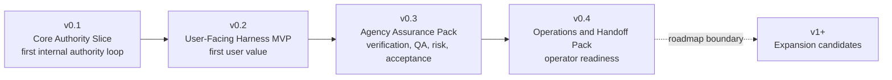
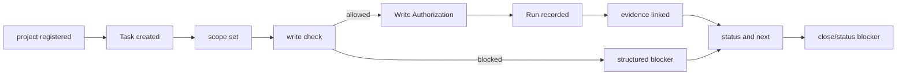

# Build: MVP Plan

## What this document helps you do

This document turns the MVP scope material into an implementable staged delivery plan. It separates v0.1 Core Authority Slice from the first user-facing MVP so the word "MVP" is reserved for a milestone where users can experience Harness value, not only observe that an authority loop exists.

This is planning documentation. It does not authorize runtime/server implementation, generated operational files, executable fixtures, fixture files, or runtime data before documentation acceptance and a separate implementation-planning readiness decision. Conformance fixture documentation is a future verification plan; the current documentation-only repository does not contain runnable Harness Server conformance tests. The first runnable target is v0.1 Core Authority Slice, with Kernel Smoke as a narrow future smoke-check authoring label. The first product MVP target is v0.2 User-Facing Harness MVP. Later packs harden agency assurance, operations, and handoff behavior. v1+ Expansion remains roadmap scope unless owner docs promote and prove it.

Use this when you need to plan what to build after documentation acceptance and a separate implementation-planning readiness decision. Use the reference docs for exact contracts.

## Read this when

- You are separating the first internal authority proof from the first user-facing product MVP.
- You need to review staged delivery scope without expanding the first implementation batch.
- You want to keep implementation order separate from storage, schema, fixture, and template details.

## Before you read

Read [Implementation Overview](implementation-overview.md), including its [Documentation Acceptance Status](implementation-overview.md#documentation-acceptance-status), [First Runnable Slice](first-runnable-slice.md), and [Runtime Walkthrough](runtime-walkthrough.md). For exact API contracts, use [MCP API And Schemas](../reference/mcp-api-and-schemas.md). For storage details and DDL, use [Storage And DDL](../reference/storage-and-ddl.md). For design-quality gate and validator behavior, use [Design Quality Policies](../reference/design-quality-policies.md). For conformance fixture semantics, use [Conformance Fixtures Reference](../reference/conformance-fixtures.md). For operator procedures and the conformance run overview, use [Operations And Conformance](../reference/operations-and-conformance.md). For v1+ Expansion candidates and promotion criteria, use the [Roadmap](../roadmap.md).

## Main idea

Harness value is not merely that a write authority loop exists. Harness should preserve scope, user-owned judgment, evidence, close readiness, and residual risk in a local authority record. Delivery therefore has two early targets:

- v0.1 Core Authority Slice proves the smallest coherent internal Core authority loop.
- v0.2 User-Facing Harness MVP proves that ordinary users can feel the core Harness value in how work is clarified, budgeted, blocked, accepted, and risk-explained.

The first slice stays intentionally narrow. It proves one local project registration, one Task, one scoped work boundary, one `prepare_write` authority path, one single-use Write Authorization, one recorded Run, one artifact/evidence reference, and one structured blocker/status response. It is not the MVP. The MVP comes when the user-facing path can translate normal work into scope, user-owned judgment, evidence, close-readiness, and residual-risk language without confusing sensitive-action approval, final acceptance, and residual-risk acceptance.

Projection-template polish, detailed reports, dashboards or hosted workflow UI, indexes, broad connector ecosystems or marketplaces, team workflow, surface-specific connector automation, metrics, parallel orchestration, and broad automation become useful after the authority record and user-facing value path exist. They are not first-slice requirements.

The early output model is intentionally small:

- v0.1 needs only minimal status/blocker output from Core state; it does not need a projection renderer.
- v0.2 needs user-readable current work status, user decision request, evidence summary, close readiness / blocker summary, final-acceptance need/status, and residual-risk visibility when relevant.
- Journey Card, Journey Spine, Run Summary, TDD Trace, Module Map, Interface Contract, Export, detailed Evidence Manifest, and detailed Eval outputs remain optional, diagnostic, or later-profile scope unless an owner profile explicitly promotes them.

## Staged delivery

| Stage | Delivery target | What it proves | What it does not prove |
|---|---|---|---|
| v0.1 | Core Authority Slice | A first runnable internal Core authority loop over one local project registration, one Task, one scoped work boundary, one `prepare_write` authority path, one single-use Write Authorization, one recorded Run, one artifact/evidence ref, and one structured blocker/status response. | User-facing MVP value, full intake/discovery, full Decision Packet quality, full Evidence Manifest, Manual QA, detached verification, residual-risk acceptance semantics, final acceptance semantics, multiple projection kinds, recover/export, broad operator entrypoints, full conformance suite, future fixture catalog, dashboard/UI behavior. |
| v0.2 | User-Facing Harness MVP | Users can experience Harness preserving scope, user-owned judgment, evidence, close readiness, final acceptance, and residual-risk visibility in a local authority record. | Full agency assurance hardening, detached verification independence, Manual QA matrix, stewardship policy suite, feedback-loop policy, export/recover, release handoff. |
| v0.3 | Agency Assurance Pack | The MVP path is hardened with verification, QA, residual-risk, final-acceptance, and stewardship profiles. | Operator recovery/export completeness, release handoff, broad operations coverage, roadmap automation. |
| v0.4 | Operations & Handoff Pack | The same Core model supports doctor/readiness, recover/export, artifact integrity, release handoff, and broader conformance coverage. | Dashboard, hosted workflow UI, broad connectors, Browser QA Capture automation, Cross-Surface Verification automation, Context Index, team workflow, orchestration. |

Kernel Smoke remains a narrow future authoring label for v0.1 Core Authority Slice checks. The label does not make v0.1 a product MVP, and it does not require a full conformance suite or future fixture catalog before the internal Core authority path is proven.

Conformance fixture profiles follow the same stage names: Core Authority Slice fixtures for v0.1 Core Authority Slice, User-Facing Harness MVP fixtures for v0.2 User-Facing Harness MVP, Agency Assurance Pack fixtures for v0.3 Agency Assurance Pack, and Operations & Handoff Pack or promoted-expansion fixtures for v0.4 Operations & Handoff Pack and promoted v1+ Expansion candidates.

These fixture profile names remain the conformance labels. The hardened local reference target is only the aggregate target reached by v0.3 Agency Assurance Pack and v0.4 Operations & Handoff Pack, not a profile name or separate delivery stage.

### Boundary after staged delivery: v1+ Expansion

v1+ Expansion is roadmap scope, not a Build-owned staged delivery phase. Dashboard, hosted workflow UI, Browser QA Capture automation, Cross-Surface Verification automation, Context Index, broader connectors, metrics, team workflow, orchestration, and similar candidates stay outside v0.1 through v0.4 unless owner docs explicitly promote and prove a future item.

## v0.1 Core Authority Slice

v0.1 is an internal implementation milestone for implementer confidence. It should prove only the smallest coherent loop that makes Harness a local authority record instead of chat memory or generated Markdown. It is not user value validation and should not be described as the first product MVP.

v0.1 must prove:

- one local project registration
- one Task in Core-owned state
- one scoped work boundary for the intended change, represented by the Change Unit owner shape only where the reference contract requires it
- one `prepare_write` allow/block path
- one durable single-use Write Authorization
- one `record_run` that consumes that authorization
- one registered `ArtifactRef` or equivalent evidence reference owned by Core/API contracts
- one structured blocker/status response for missing scope, missing write authority, or missing artifact/evidence support

v0.1 explicitly excludes full natural-language intake, full Discovery, full Decision Packet quality, full Evidence Manifest, Manual QA, detached verification, residual-risk acceptance semantics, final acceptance semantics, product/UX versus architecture judgment presentation, stewardship, feedback-loop policy, multiple projection kinds, full projection rendering, export/recover, broad operator entrypoints, full conformance suite, future fixture catalog, full dashboard/UI behavior, and release handoff. Those are later stages or roadmap scope.

Kernel Smoke candidates for v0.1 should assert only the minimal authority loop through Core state, the required owner records for that loop, artifact/evidence refs, and structured blockers. Projection polish, detailed templates, renderer output, and broad fixture catalogs are not first-slice conformance truth.

At this point, an implementer can observe that Core owns the minimal state, a scoped write is allowed or blocked, one authorization is consumed once, an artifact/evidence ref is linked to the recorded Run, and status/blocker output can return structured blockers. This is implementer confidence, not proof that users experience Harness value.

### Contract field staging

Reference schemas may list fields that become necessary only when the related capability is in scope. Build does not redefine field requiredness; it tells implementers when a capability enters the staged plan. Read each field through the owner contract and the active stage:

| Stage | Build reading rule | Owner contracts to apply |
|---|---|---|
| v0.1 Core Authority Slice | Use only the owner-defined fields needed to prove the narrow authority loop. Avoid creating future-profile records just to satisfy a broad checklist; if a minimal seeded blocker uses an owner ref, apply only the valid shape for that owner path, not full user-facing Decision Packet quality. | [Kernel Reference](../reference/kernel.md), [MCP API And Schemas](../reference/mcp-api-and-schemas.md), [Storage And DDL](../reference/storage-and-ddl.md), [Conformance Fixtures Reference](../reference/conformance-fixtures.md#kernel-smoke-authoring-queue). |
| v0.2 User-Facing Harness MVP | Add the fields and display summaries needed for users to understand the pending user decision context, evidence, close readiness, final acceptance separation, and residual-risk visibility. | [MCP API And Schemas](../reference/mcp-api-and-schemas.md), [Kernel Reference](../reference/kernel.md), [Document Projection Reference](../reference/document-projection.md), [Template Reference](../reference/templates/README.md). |
| v0.3 Agency Assurance Pack / v0.4 Operations & Handoff Pack | Add verification, QA, residual-risk, final-acceptance, stewardship, projection/reconcile, operations, export/recover, artifact-integrity, and release-handoff profiles only where owner docs define them. | [Design Quality Policies](../reference/design-quality-policies.md), [Operations And Conformance](../reference/operations-and-conformance.md), [Conformance Fixtures Reference](../reference/conformance-fixtures.md), [Storage And DDL](../reference/storage-and-ddl.md). |

Required in an API schema therefore means required when that tool call, record, or profile is implemented or used. It does not make a future-profile field part of the smallest runnable slice by itself.

### Implementation decisions needed before server coding

Decision-log baseline: the server-coding decision log is empty here at this baseline. This is not proof that no decisions remain. Implementation-readiness criteria still require maintainer judgment, and the documentation is available for maintainer acceptance review only as a candidate until maintainers deliberately update [Implementation Overview: Documentation acceptance status](implementation-overview.md#documentation-acceptance-status).

Do not leave major implementation decisions as scattered TODOs or vague follow-ups. If current review or first runtime-batch planning finds one, record it here with the owner doc, affected behavior or field, affected stage, options considered, and the decision needed before changing server code or DDL.

### Core Authority Slice flow

Exact state and blocker behavior is owned by [Kernel Reference](../reference/kernel.md), public tool shapes by [MCP API And Schemas](../reference/mcp-api-and-schemas.md), and future fixture semantics by [Conformance Fixtures Reference](../reference/conformance-fixtures.md#conformance-fixture-format). This flow does not add pack gates, projection-renderer requirements, or fixture body requirements.

For future smoke authoring order, use the [Kernel Smoke Authoring Queue](../reference/conformance-fixtures.md#kernel-smoke-authoring-queue). It maps candidate checks to this internal slice without implying executable fixture files already exist or that v0.1 requires a full conformance suite.

## v0.2 User-Facing Harness MVP

v0.2 is the first product MVP and the first stage where users experience core Harness behavior. It is defined by experienced user value, not by a longer component checklist.

The MVP must demonstrate:

- an ordinary user request is clarified into scope, user-owned judgment, evidence, and close-readiness language
- product/UX judgments and material technical architecture judgments can be presented separately from each other and from sensitive-action approval, final acceptance, and residual-risk acceptance
- small changes and tracked work have different procedural budgets without letting small-change labeling bypass authority
- status and next-action output explain current scope, missing decisions, evidence state, close blockers, and safe next action
- close is blocked when required evidence or a required user-owned decision is missing
- residual risk can be displayed before acceptance and close
- final acceptance is distinct from sensitive-action Approval and residual-risk acceptance
- readable summaries or cards show current work status, user decision request, evidence summary, close readiness/blockers, final-acceptance need/status, and residual-risk visibility without template polish becoming the source of truth
- conformance can prove the path through Core state, events, artifacts, projection/freshness facts, and structured errors rather than prose or renderer output alone

Evidence records, readable summaries, and projection freshness support this experience. They are not the identity of the stage, and projection polish beyond this user-readable path stays out of scope.

v0.2 should keep detached verification, the full Manual QA policy matrix, stewardship validators, feedback-loop policy, export/recover, release handoff, Journey Card/Spine polish, Run Summary, TDD Trace, Module Map, Interface Contract, detailed Evidence Manifest, detailed Eval, and Export projections as staged profiles unless a specific user-facing MVP scenario needs a minimal display or blocker hook. Browser QA Capture, Cross-Surface Verification automation, dashboards, broad connectors, Context Index, metrics, team workflow, and orchestration remain outside the MVP.

Passing v0.2 means a user can see why Harness is more than an authorization wrapper: it keeps the work's scope, decisions, evidence, acceptance, and risk boundaries locally inspectable.

## v0.3 Agency Assurance Pack

v0.3 hardens the MVP path so the local reference path can route verification, QA, residual risk, final acceptance, and stewardship with honest boundaries.

Focus on:

- full Decision Packet quality and user-judgment routing
- sensitive-action Approval, Decision Packet, Write Authorization, final acceptance, and residual-risk acceptance separation
- detached verification independence, including same-session verification guard behavior
- Manual QA policy matrix, Manual QA blockers, and valid QA waivers
- residual-risk accepted close full semantics
- stewardship validators and codebase stewardship coverage
- TDD trace behavior where policy requires it
- feedback-loop policy where policy requires it
- context-hygiene validators and current-state versus stale-context boundaries
- Agency Assurance Pack conformance fixtures that prove judgment, QA, verification, residual-risk, and acceptance separation through Core state, events, artifacts, projection/freshness facts, and errors

Passing this pack means the user-facing MVP path is agency-preserving, policy-aware, and honest about verification, QA, residual risk, acceptance, and stewardship boundaries. It does not promote v1+ Expansion automation into staged delivery.

## v0.4 Operations & Handoff Pack

v0.4 completes the local operational proof around the same Core state model.

Focus on:

- doctor/readiness categories for runtime home, project state, artifact store, reference surface, MCP availability, projections, reconcile, validators/checks, and agency/stewardship/context
- recover handling for interrupted or drifted operational state
- export behavior for state snapshots, report projection snapshots, artifact refs, redaction status, omitted-secret notes, and retained, expired, or unavailable artifact status
- artifact integrity checks
- release handoff report/export profile where owner docs define it
- operator smoke over connect, doctor, serve MCP, projection refresh, reconcile, recover, export, artifacts check, and conformance run
- operations/future fixture coverage for export/recover, artifact integrity, release handoff, operator readiness, and higher guarantee levels only where owner docs define and prove them
- later-boundary checks that keep roadmap items in v1+ Expansion unless separately proven and promoted

Do not create a second state model for operator commands. Operators diagnose, repair, export, or run fixtures over the same Core state model.

Docs-maintenance remains a separate read-only documentation profile. It may report documentation drift, but it is not v0.1 Core Authority Slice, not v0.2 User-Facing Harness MVP, not Agency Assurance Pack or operations runtime conformance, and not an implementation-readiness signal.

## Roadmap-scoped v1+ Expansion candidates

Keep these outside staged delivery unless a future plan promotes them through owner docs with a capability profile, exact contracts, redaction/secret/PII policy, artifact retention and test-environment rules when runtime surfaces are captured, fixtures or a conformance target, fallback behavior, and no projection-as-canonical dependency.

| Candidate | Stage boundary |
|---|---|
| Dashboard, hosted workflow UI, artifact dashboard, rich card expansion | May display state; must not become authority, implementation readiness, close readiness, acceptance, or risk acceptance. |
| Broad connector marketplace or surface ecosystem | May extend surfaces later; must not replace the first Core authority-loop proof or widen MCP exposure by default. |
| Browser QA Capture automation | May assist Manual QA after promotion; must not replace human QA judgment, final acceptance, or detached verification. |
| Cross-Surface Verification automation | May automate evaluator routing after promotion; must not satisfy Eval or assurance without Core-owned return records. |
| Preventive guard expansion, native hooks, Advanced Sidecar Watcher | May strengthen surfaces after a proven pre-tool blocking or observation path; must not be claimed by label alone. |
| Context Index, Local Derived Metrics, long-term metrics | May provide read-only retrieval or diagnostics; must not authorize writes, satisfy gates, refresh projections, or close Tasks. |
| Team workflow, permissions, orchestration, parallel lanes | May coordinate future work; must not become required for staged delivery or single-project local authority. |
| Deployment, canary, rollback, merge, production monitoring | May be future integration work; release handoff remains a report/export boundary unless owner docs promote more. |

If a later feature is useful during implementation, keep it as read-only display, metadata, artifact candidate, or fixture candidate until owner docs define and prove its authority path.

## Exit criteria by stage

Use these as implementation-readable checklists for future runtime planning after documentation acceptance and a separate implementation-planning readiness decision. They restate staged exits; they do not add schemas, fixtures, DDL, or new runtime requirements, and they do not authorize implementation while the [Documentation Acceptance Status](implementation-overview.md#documentation-acceptance-status) still blocks first runtime-batch planning.

### v0.1 Core Authority Slice exit checklist

- One local project is registered.
- One Task exists in Core-owned state.
- One scoped work boundary names the intended change boundary.
- Product writes without compatible scope block.
- Out-of-scope intended writes block.
- Allowed `prepare_write` creates a durable single-use Write Authorization.
- A compatible `record_run` consumes the authorization once.
- A second distinct product-write Run cannot reuse the consumed authorization.
- One artifact/evidence ref is registered and linked to the Run or minimal owner relation.
- Status/blocker output reports current state or a blocker without mutating state.
- A structured blocker/status response reports missing scope, missing write authority, or missing artifact/evidence support.

### v0.2 User-Facing Harness MVP exit checklist

- Ordinary user language can start or resume tracked work without requiring Harness vocabulary.
- The user-facing path clarifies scope, non-goals, acceptance criteria, evidence expectations, close readiness, and judgment boundaries.
- Product/UX judgment and material technical architecture judgment can be presented separately from each other and from approval, final acceptance, and residual-risk acceptance.
- Small direct changes and tracked work use different procedural budgets without bypassing write authority, evidence, or a required user decision.
- Status/next output explains current scope, missing decisions, evidence state, residual-risk display, close blockers, and next safe action.
- Close blocks when required evidence is missing.
- Close blocks when a required user decision is missing or unresolved.
- Residual risk is visible before successful acceptance or close when known close-relevant risk exists.
- Final acceptance is recorded or represented separately from sensitive-action Approval and residual-risk acceptance.
- Residual-risk acceptance, when supported, is visibly distinct from final acceptance.
- User-facing readable summaries or cards are derived from Core records and are sufficient for the MVP path without making template polish authoritative.

### v0.3 Agency Assurance Pack exit checklist

- Decision Packet quality and user-judgment routing are fixture-proven.
- Sensitive-action Approval does not substitute for Decision Packets, Write Authorization, Manual QA, verification, final acceptance, or residual-risk acceptance.
- Detached verification independence and same-session verification guard behavior are fixture-proven.
- Manual QA policy matrix and QA blockers are fixture-proven where policy requires them.
- Risk-accepted close cites accepted Residual Risk refs under the owner semantics.
- Stewardship validators, feedback-loop policy, TDD trace behavior, and context-hygiene behavior are covered where policy requires them.
- Agency conformance proves Journey visibility, user-owned decision routing, Autonomy Boundary respect, distinct decision types, and residual-risk handling.

### v0.4 Operations & Handoff Pack exit checklist

- Doctor/readiness reports runtime home, project state, artifact store, reference surface, MCP availability, projections, reconcile, validators/checks, and agency/stewardship/context categories.
- Recover handles interrupted or drifted operational state without treating recovery artifacts as successful completion proof.
- Export includes state snapshots, report projection snapshots, artifact refs, redaction status, omitted-secret notes, and retained, expired, or unavailable artifact status.
- Artifact integrity check reports missing or mismatched artifacts through existing diagnostics.
- Release handoff report/export behavior follows its owner profile without taking over deployment, merge, rollback, or production authority.
- Operations/future fixture coverage proves export/recover, artifact integrity, release handoff, operator readiness, and promoted higher guarantee levels through exact-shape fixtures, not prose.
- Later-boundary checks keep v1+ Expansion items out of staged delivery unless owner docs promote and prove them.

## Observable by stage

| Stage | What the user or operator can observe |
|---|---|
| v0.1 Core Authority Slice | An implementer can see one local Task move through a scoped work boundary, `prepare_write`, Write Authorization, `record_run`, artifact/evidence ref, and structured status/blocker output. |
| v0.2 User-Facing Harness MVP | A user can see ordinary work clarified into scope, user-owned judgment, evidence, close readiness, final-acceptance, and residual-risk language, with close blocked when evidence or a required user decision is missing. |
| v0.3 Agency Assurance Pack | The local path explains verification, Manual QA, residual-risk acceptance, final acceptance, stewardship, TDD, feedback, context hygiene, and close behavior through Core records and fixtures. |
| v0.4 Operations & Handoff Pack | Operators can diagnose, recover, reconcile, export, check artifacts, run conformance, and prepare release handoff over the same Core state. |

After staged delivery, promoted roadmap items can read, display, wrap, or extend the authority loop only after owner docs define exact contracts and fixture coverage.
