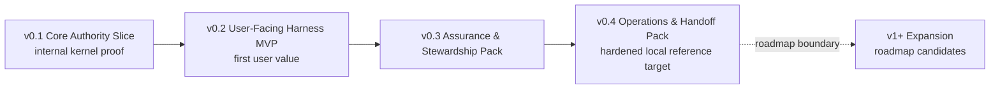
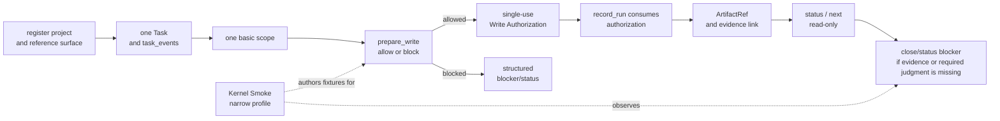

# Build: MVP Plan

## What this document helps you do

This document turns the MVP scope material into an implementable staged delivery plan. It separates the first runnable kernel slice from the first user-facing MVP so the word "MVP" is reserved for a milestone where users can experience Harness value, not only observe that an authority loop exists.

This is planning documentation. It does not authorize runtime/server implementation, generated operational files, executable fixtures, or runtime data before the documentation set is accepted for implementation planning. The first runnable target is v0.1 Core Authority Slice, with Kernel Smoke as its narrow conformance authoring profile. The first product MVP target is v0.2 User-Facing Harness MVP. Later packs harden assurance, stewardship, operations, and handoff behavior. v1+ Expansion remains roadmap scope unless owner docs promote and prove it.

Use this when you need to plan what to build after documentation acceptance. Use the reference docs for exact contracts.

## Read this when

- You are separating the first runnable kernel proof from the first user-facing product MVP.
- You need to review staged delivery scope without expanding the first implementation batch.
- You want to keep implementation order separate from storage, schema, fixture, and template details.

## Before you read

Read [Implementation Overview](implementation-overview.md), including its [Documentation Acceptance Status](implementation-overview.md#documentation-acceptance-status), [First Runnable Slice](first-runnable-slice.md), and [Runtime Walkthrough](runtime-walkthrough.md). For exact API contracts, use [MCP API And Schemas](../reference/mcp-api-and-schemas.md). For storage details and DDL, use [Storage And DDL](../reference/storage-and-ddl.md). For design-quality gate and validator behavior, use [Design Quality Policies](../reference/design-quality-policies.md). For conformance fixture semantics, use [Conformance Fixtures Reference](../reference/conformance-fixtures.md). For operator procedures and the conformance run overview, use [Operations And Conformance](../reference/operations-and-conformance.md). For v1+ Expansion candidates and promotion criteria, use the [Roadmap](../roadmap.md).

## Main idea

Harness value is not merely that a write authority loop exists. Harness should preserve scope, user-owned judgments, evidence, close readiness, and residual risk in a local authority record. Delivery therefore has two early targets:

- v0.1 Core Authority Slice proves the smallest coherent internal kernel loop.
- v0.2 User-Facing Harness MVP proves that ordinary users can feel the Harness value in how work is clarified, budgeted, blocked, accepted, and risk-explained.

The first slice stays intentionally narrow. It proves one local project, one Task, one scope, one write authority path, one recorded Run, one evidence link, and one structured blocker/status response. It is not the MVP. The MVP comes when the user-facing path can translate normal work into scope, judgment, evidence, close-readiness, and residual-risk language without confusing approval, acceptance, and risk acceptance.

Projection-template polish, dashboards or hosted workflow UI, indexes, broad connector ecosystems or marketplaces, team workflow, surface-specific connector automation, metrics, parallel orchestration, and broad automation become useful after the authority record and user-facing value path exist. They are not first-slice requirements.

## Staged delivery

| Stage | Delivery target | What it proves | What it does not prove |
|---|---|---|---|
| v0.1 | Core Authority Slice | A first runnable internal kernel loop over one local project, one Task, one scope, one write authority path, one recorded Run, one evidence link, and one structured blocker/status response. | User-facing MVP value, full intake/discovery, full Decision Packet quality, residual-risk semantics, Manual QA, detached verification, projection completeness, operations readiness. |
| v0.2 | User-Facing Harness MVP | Users can experience Harness preserving scope, user-owned judgment, evidence, close readiness, final acceptance, and residual-risk visibility in a local authority record. | Full agency hardening, detached verification independence, Manual QA matrix, stewardship policy suite, feedback-loop policy, export/recover, release handoff. |
| v0.3 | Assurance & Stewardship Pack | The MVP path is hardened with assurance, QA, verification, stewardship, design-quality, context-hygiene, TDD, and feedback-loop profiles. | Operator recovery/export completeness, release handoff, broad operations coverage, roadmap automation. |
| v0.4 | Operations & Handoff Pack | The same Core model supports doctor/readiness, recover/export, artifact integrity, release handoff, and broader conformance coverage. | Dashboard, hosted workflow UI, broad connectors, Browser QA Capture automation, Cross-Surface Verification automation, Context Index, team workflow, orchestration. |

Kernel Smoke remains the narrow conformance authoring profile for v0.1 Core Authority Slice. The profile name does not make v0.1 a product MVP; it means the fixture queue proves the internal kernel path.

### Boundary after staged delivery: v1+ Expansion

v1+ Expansion is roadmap scope, not a Build-owned staged delivery phase. Dashboard, hosted workflow UI, Browser QA Capture automation, Cross-Surface Verification automation, Context Index, broader connectors, metrics, team workflow, orchestration, and similar candidates stay outside v0.1 through v0.4 unless owner docs explicitly promote and prove a future item.

## v0.1 Core Authority Slice

v0.1 is an internal implementation milestone. It should prove only the smallest coherent loop that makes Harness a local authority record instead of chat memory or generated Markdown.

v0.1 must prove:

- project registration and one reference surface
- one Task with current state and `task_events`
- one basic scope for the intended change
- one `prepare_write` allow/block path
- one durable single-use Write Authorization
- one `record_run` that consumes that authorization
- one registered `ArtifactRef` or equivalent evidence link owned by Core/API contracts
- one minimal Evidence Manifest or evidence relation sufficient to report support or insufficiency
- one read-only status/next response from current Core state
- one structured blocker/status response for missing evidence, missing scope, or a required seeded user judgment

v0.1 should not prove full natural-language intake, full Discovery, full Decision Packet quality, product/UX versus architecture judgment presentation, residual-risk display, final acceptance, residual-risk acceptance, Manual QA, detached verification, stewardship, feedback-loop policy, export/recover, release handoff, or projection/template completeness. Those are later stages.

At this point, an implementer or operator can observe that Core owns state, a scoped write is allowed or blocked, one authorization is consumed once, evidence is linked to the recorded Run, reads do not mutate state, and close/status output can return structured blockers.

### Core Authority Slice flow

Exact state and close behavior is owned by [Kernel Reference](../reference/kernel.md), public tool shapes by [MCP API And Schemas](../reference/mcp-api-and-schemas.md), projection rules by [Document Projection Reference](../reference/document-projection.md), and fixture semantics by [Conformance Fixtures Reference](../reference/conformance-fixtures.md#conformance-fixture-format). This flow does not add pack gates or fixture body requirements.

For practical fixture authoring order, use the [Kernel Smoke Authoring Queue](../reference/conformance-fixtures.md#kernel-smoke-authoring-queue). It maps v0.1 fixture candidates to this internal slice without implying executable fixture files already exist.

## v0.2 User-Facing Harness MVP

v0.2 is the first product MVP. It is defined by experienced user value, not by a longer component checklist.

The MVP must demonstrate:

- an ordinary user request is clarified into scope, user-owned judgment, evidence, and close-readiness language
- product/UX judgments and material technical architecture judgments can be presented separately
- small changes and tracked work have different procedural budgets without letting small-change labeling bypass authority
- status and next-action output explain current scope, missing decisions, evidence state, close blockers, and safe next action
- close is blocked when required evidence or required user judgment is missing
- residual risk can be displayed before acceptance and close
- final user acceptance is distinct from sensitive-action Approval and residual-risk acceptance
- readable projections or cards are sufficient to show the user-facing path, without template polish becoming the source of truth
- conformance can prove the path through Core state, events, artifacts, projection/freshness facts, and structured errors rather than prose alone

v0.2 should keep detached verification, the full Manual QA policy matrix, stewardship validators, feedback-loop policy, export/recover, and release handoff as staged profiles unless a specific user-facing MVP scenario needs a minimal display or blocker hook. Browser QA Capture, Cross-Surface Verification automation, dashboards, broad connectors, Context Index, metrics, team workflow, and orchestration remain outside the MVP.

Passing v0.2 means a user can see why Harness is more than an authorization wrapper: it keeps the work's scope, decisions, evidence, acceptance, and risk boundaries locally inspectable.

## v0.3 Assurance & Stewardship Pack

v0.3 hardens the MVP path so the local reference path can route assurance, policy, and stewardship with honest boundaries.

Focus on:

- full Decision Packet quality and user-judgment routing
- sensitive-action Approval, Decision Packet, Write Authorization, final acceptance, and residual-risk acceptance separation
- detached verification independence, including same-session verification guard behavior
- Manual QA policy matrix, Manual QA blockers, and valid QA waivers
- residual-risk accepted close full semantics
- stewardship validators and codebase stewardship coverage
- TDD trace behavior where policy requires it
- feedback-loop policy where policy requires it
- context-hygiene validators and current-state versus stale-context boundaries
- agency conformance fixtures that prove behavior through Core state, events, artifacts, projections, and errors

Passing this pack means the user-facing MVP path is agency-preserving and policy-aware. It does not promote v1+ Expansion automation into staged delivery.

## v0.4 Operations & Handoff Pack

v0.4 completes the local operational proof around the same Core state model.

Focus on:

- doctor/readiness categories for runtime home, project state, artifact store, reference surface, MCP availability, projections, reconcile, validators/checks, and agency/stewardship/context
- recover handling for interrupted or drifted operational state
- export behavior for state snapshots, report projection snapshots, artifact refs, redaction status, omitted-secret notes, and retained, expired, or unavailable artifact status
- artifact integrity checks
- release handoff report/export profile where owner docs define it
- operator smoke over connect, doctor, serve MCP, projection refresh, reconcile, recover, export, artifacts check, and conformance run
- broader fixture suite coverage for the hardened local reference target
- later-boundary checks that keep roadmap items in v1+ Expansion unless separately proven and promoted

Do not create a second state model for operator commands. Operators diagnose, repair, export, or run fixtures over the same Core state model.

Docs-maintenance remains a separate read-only documentation profile. It may report documentation drift, but it is not v0.1 Core Authority Slice, not v0.2 User-Facing Harness MVP, not hardened runtime conformance, and not an implementation-readiness signal.

## Roadmap-scoped v1+ Expansion candidates

Keep these outside staged delivery unless a future plan promotes them through owner docs with a capability profile, exact contracts, redaction/secret/PII policy, artifact retention and test-environment rules when runtime surfaces are captured, fixtures or a conformance target, fallback behavior, and no projection-as-canonical dependency.

| Candidate | Stage boundary |
|---|---|
| Dashboard, hosted workflow UI, artifact dashboard, rich card expansion | May display state; must not become authority, implementation readiness, close readiness, acceptance, or risk acceptance. |
| Broad connector marketplace or surface ecosystem | May extend surfaces later; must not replace the reference surface proof or widen MCP exposure by default. |
| Browser QA Capture automation | May assist Manual QA after promotion; must not replace human QA judgment, final acceptance, or detached verification. |
| Cross-Surface Verification automation | May automate evaluator routing after promotion; must not satisfy Eval or assurance without Core-owned return records. |
| Preventive guard expansion, native hooks, Advanced Sidecar Watcher | May strengthen surfaces after a proven pre-tool blocking or observation path; must not be claimed by label alone. |
| Context Index, Local Derived Metrics, long-term metrics | May provide read-only retrieval or diagnostics; must not authorize writes, satisfy gates, refresh projections, or close Tasks. |
| Team workflow, permissions, orchestration, parallel lanes | May coordinate future work; must not become required for staged delivery or single-project local authority. |
| Deployment, canary, rollback, merge, production monitoring | May be future integration work; release handoff remains a report/export boundary unless owner docs promote more. |

If a later feature is useful during implementation, keep it as read-only display, metadata, artifact candidate, or fixture candidate until owner docs define and prove its authority path.

## Exit criteria by stage

Use these as implementation-readable checklists for future runtime planning after documentation acceptance. They restate staged exits; they do not add schemas, fixtures, DDL, or new runtime requirements, and they do not authorize implementation while the [Documentation Acceptance Status](implementation-overview.md#documentation-acceptance-status) still blocks first runtime-batch planning.

### v0.1 Core Authority Slice exit checklist

- One project and one reference surface are registered.
- One Task can be created, read, advanced minimally, and represented in `task_events`.
- One scope record names the intended change boundary.
- Product writes without compatible scope block.
- Out-of-scope intended writes block.
- Allowed `prepare_write` creates a durable single-use Write Authorization.
- A compatible `record_run` consumes the authorization once.
- A second distinct product-write Run cannot reuse the consumed authorization.
- One artifact or evidence ref is registered and linked to the Run or evidence relation.
- Minimal evidence state can report support, partial support, or insufficiency for the selected claim.
- `status` and `next` return current state without mutating state.
- A structured blocker/status response reports missing scope, evidence, or required seeded user judgment.

### v0.2 User-Facing Harness MVP exit checklist

- Ordinary user language can start or resume tracked work without requiring Harness vocabulary.
- The user-facing path clarifies scope, non-goals, acceptance criteria, evidence expectations, close readiness, and judgment boundaries.
- Product/UX judgment and material technical architecture judgment can be presented separately.
- Small direct changes and tracked work use different procedural budgets without bypassing write authority, evidence, or required user judgment.
- Status/next output explains current scope, missing decisions, evidence state, residual-risk display, close blockers, and next safe action.
- Close blocks when required evidence is missing.
- Close blocks when required user judgment is missing or unresolved.
- Residual risk is visible before successful acceptance or close when known close-relevant risk exists.
- Final user acceptance is recorded or represented separately from sensitive-action Approval and residual-risk acceptance.
- User-facing projections or cards are derived from Core records and are sufficient for the MVP path without making template polish authoritative.

### v0.3 Assurance & Stewardship Pack exit checklist

- Decision Packet quality and user-judgment routing are fixture-proven.
- Sensitive-action Approval does not substitute for Decision Packets, Write Authorization, Manual QA, verification, acceptance, or residual-risk acceptance.
- Detached verification independence and same-session verification guard behavior are fixture-proven.
- Manual QA policy matrix and QA blockers are fixture-proven where policy requires them.
- Risk-accepted close cites accepted Residual Risk refs under the owner semantics.
- Stewardship validators, feedback-loop policy, TDD trace behavior, and context-hygiene behavior are covered where policy requires them.
- Agency conformance proves Journey visibility, user judgment, Autonomy Boundary respect, distinct user judgments, and residual-risk handling.

### v0.4 Operations & Handoff Pack exit checklist

- Doctor/readiness reports runtime home, project state, artifact store, reference surface, MCP availability, projections, reconcile, validators/checks, and agency/stewardship/context categories.
- Recover handles interrupted or drifted operational state without treating recovery artifacts as successful completion proof.
- Export includes state snapshots, report projection snapshots, artifact refs, redaction status, omitted-secret notes, and retained, expired, or unavailable artifact status.
- Artifact integrity check reports missing or mismatched artifacts through existing diagnostics.
- Release handoff report/export behavior follows its owner profile without taking over deployment, merge, rollback, or production authority.
- Broader fixture suite coverage proves the hardened local reference target through exact-shape fixtures, not prose.
- Later-boundary checks keep v1+ Expansion items out of staged delivery unless owner docs promote and prove them.

## Observable by stage

| Stage | What the user or operator can observe |
|---|---|
| v0.1 Core Authority Slice | An implementer/operator can see one local Task move through scope, `prepare_write`, Write Authorization, `record_run`, artifact/evidence link, read-only status/next, and structured blockers. |
| v0.2 User-Facing Harness MVP | A user can see ordinary work clarified into scope, judgment, evidence, close readiness, acceptance, and residual-risk language, with close blocked when evidence or user judgment is missing. |
| v0.3 Assurance & Stewardship Pack | The local path explains verification, Manual QA, stewardship, TDD, feedback, context hygiene, acceptance, residual-risk acceptance, and close behavior through Core records and fixtures. |
| v0.4 Operations & Handoff Pack | Operators can diagnose, recover, reconcile, export, check artifacts, run conformance, and prepare release handoff over the same Core state. |

After staged delivery, promoted roadmap items can read, display, wrap, or extend the authority loop only after owner docs define exact contracts and fixture coverage.
