# Build: Runtime Walkthrough

## What this document helps you do

Follow one Harness work item from user request to close outcome without reading every strict contract first.

This is Build documentation. It summarizes the runtime path for implementers and reviewers, but it does not authorize runtime/server implementation, generated operational files, executable fixtures, runtime data, or new schemas before documentation acceptance and a separate implementation-planning readiness decision. The first runnable target is Engineering Checkpoint, with Kernel Smoke as a narrow future smoke-check authoring label. The first user-value target is MVP-1 User Work Loop. Assurance Profile and Operations Profile harden agency assurance, operations, and handoff behavior, and Roadmap remains future scope unless owner docs promote and prove it.

## Read this when

- You want a runtime-shaped mental model before reading the reference contracts.
- You are checking how requirements become scoped work.
- You need to explain the difference between state, artifacts, projections, and close blockers.
- You are reviewing the first Engineering Checkpoint path without expanding it into the first user-value slice.

## Before you read

Read [Implementation Overview](implementation-overview.md) and [First Runnable Slice](first-runnable-slice.md) for implementation context. Use [Kernel Reference](../reference/kernel.md), [Runtime Architecture Reference](../reference/runtime-architecture.md), [Document Projection Reference](../reference/document-projection.md), [MVP API](../reference/api/mvp-api.md), [API Schema Core](../reference/api/schema-core.md), [API Errors](../reference/api/errors.md), [Storage And DDL](../reference/storage-and-ddl.md), and [Operations And Conformance](../reference/operations-and-conformance.md) for exact behavior.

## Main idea

For write-capable tracked work, a request becomes safe product work only after Harness knows the Task and the initial scope, and after any stage-required clarification or user-owned judgments are recorded. Product writes then pass through `prepare_write`, which can create a one-attempt Write Authorization. Runs consume that authority, evidence and artifacts support claims, and status/blocker output makes the current state readable. Later user-value, assurance, projection, and close paths explain blockers or close the Task only when their stage is in scope.

The walkthrough shows a staged reader path. The Engineering Checkpoint design target covers only the smallest internal part of it: one local project registration, one active Task, one scoped boundary represented by the Change Unit owner shape only where the reference contract requires it, one `prepare_write` authority path, one single-use Write Authorization, one recorded Run, one artifact/evidence ref, and one structured status/blocker response. Engineering Checkpoint does not require natural-language intake, full Discovery, full-format user judgment presentation, full Evidence Manifest, Eval, Manual QA, Acceptance, residual-risk acceptance, full close semantics, projection rendering, conformance runner, recover/export, operations suite, dashboards, connectors, or detached verification. MVP-1 User Work Loop adds ordinary-language start/resume, work-shape classification, scope/non-goals/success criteria summary, minimal user judgment request/record, cooperative pre-write scope checking, small direct vs tracked work distinction, status/next output, run/evidence reference recording, evidence summary, close blocker summary, next safe action, residual-risk visibility, separated sensitive approval / work acceptance / risk acceptance display, and a compact Core-derived status card.

## Walkthrough at a glance

Walkthrough summary: this planning diagram follows one intended request-to-close path; it is a reader aid, not a second source of truth or proof of an implemented runtime.

```mermaid
flowchart LR
  Request["ordinary request"] --> Clarify["requirements clarification"]
  Clarify --> Decision["user-owned judgment"]
  Clarify --> Scope["scoped work"]
  Decision --> Scope
  Scope --> Prepare["prepare_write"]
  Prepare -->|allowed| Authorization["Write Authorization"]
  Prepare -->|blocked| Blocker["structured blocker"]
  Authorization --> Run["record_run"]
  Run --> Evidence["run and evidence record"]
  Evidence --> Readable["status/blocker output"]
  Blocker --> Readable
  Readable --> CloseCheck["close readiness"]
  CloseCheck -->|blocked| CloseBlocker["close blocker"]
  CloseCheck -->|ready| Close["Task closed"]
```

What to notice: the diagram is a reader path, not a second source of truth or a Engineering Checkpoint requirement list. Requirements clarification and projection-like output help shape or read work when their stage is in scope, but write authority is `prepare_write`, execution is recorded by `record_run`, and completion blockers are reported by the close/status owner paths. For Engineering Checkpoint, the readable output can be only status/blocker output. For MVP-1, the close-facing output is a blocker summary and compact status card, not the full later assurance close model. Exact state and gate behavior lives in [Kernel Reference](../reference/kernel.md); active MVP-1 public calls live in [MVP API](../reference/api/mvp-api.md).

## Step-by-step runtime path

### 1. Request -> Task

The user describes work in ordinary language. In MVP-1 and later, Harness intake classifies the task shape and creates or updates Task state when tracking is useful. Engineering Checkpoint may use an owner-valid seed/setup path instead of natural-language intake.

Strict behavior: Task lifecycle, modes, and state transitions are owned by [Kernel Reference](../reference/kernel.md#lifecycle-and-transitions). Storage layout is owned by [Storage And DDL](../reference/storage-and-ddl.md).

### 2. Task -> requirements clarification

Requirements clarification, internally named Discovery, is MVP-1-and-later behavior, not a Engineering Checkpoint requirement. It is used when the request is ambiguous, risky, multi-step, product-facing, or likely to need user-owned judgment. It clarifies goal, user value, non-goals, success criteria, inspectable facts, assumptions, technical and product choices, security or privacy concerns, QA expectations, remaining uncertainty, and scope boundaries.

Strict behavior: requirements clarification / Discovery is shaping input. It is not Approval, Write Authorization, evidence, verification, QA, work acceptance, residual-risk acceptance, close, scope authority, or a new authority path. Judgment routing is owned by [User Judgment](../reference/kernel.md#user-judgment) and the public judgment call in [MVP API](../reference/api/mvp-api.md#harnessrequest_user_judgment).

### 3. Requirements clarification -> scoped next work -> Change Unit

Requirements clarification separates inspectable facts from user-owned judgments, then tracks remaining uncertainty and proposes scoped next work, a smaller scope, or a work split once goals, non-goals, success criteria, and major judgment candidates are clear enough. When product writes are near, that proposal can become a Change Unit candidate. The active Change Unit names what work surface may change, what remains out of bounds, and what judgment the agent may exercise inside that scope.

These proposal phrases are not standalone schema fields, canonical record types, gate values, projection kinds, or authority paths.

Strict behavior: Change Unit and Autonomy Boundary semantics are owned by [Kernel Reference](../reference/kernel.md#change-unit) and [Autonomy Boundary](../reference/kernel.md#autonomy-boundary). A Change Unit scopes work, but it does not authorize a write by itself.

### 4. Change Unit -> `prepare_write`

Before a product write, the agent asks Core for write authority for the intended operation. Core checks current state, Change Unit scope, Autonomy Boundary where in scope, and any active-stage requirements such as baseline freshness, sensitive-action Approval, user judgments, applicable design policy, and surface capability. Engineering Checkpoint needs only the scope/write-authority checks required for Engineering Checkpoint. MVP-1 makes this a cooperative pre-write scope check: Core can refuse authority and the connected agent or surface should hold by instruction, but this is not OS-level blocking, arbitrary-tool isolation, or permission isolation.

Strict behavior: `prepare_write` is owned by [Kernel Reference](../reference/kernel.md#prepare_write). Public request and response shapes are owned by [`harness.prepare_write`](../reference/api/mvp-api.md#harnessprepare_write).

### 5. `prepare_write` -> Write Authorization or blocker

If the checks pass, Core creates or returns a compatible Write Authorization for one specific attempt. If the checks do not pass, the response routes to a blocker, state conflict, sensitive-action Approval path, or user judgment path.

Strict behavior: Write Authorization semantics are owned by [Write Authorization](../reference/kernel.md#write-authorization). Approval and User Judgment non-substitution rules are owned by [Judgment route boundaries](../reference/kernel.md#judgment-route-boundaries).

### 6. Write Authorization -> Run

The implementation or direct write happens, then `record_run` records what happened. A product-write Run consumes one compatible, unexpired, unconsumed Write Authorization. Out-of-scope observations are not normalized by prose; they route to repair, recovery, or blocker handling.

Strict behavior: Run recording and authorization consumption are owned by [record_run](../reference/kernel.md#record_run). Guarantee level behavior is summarized in [Runtime Architecture Reference](../reference/runtime-architecture.md#guarantee-level-behavior-map).

### 7. Run -> Evidence and artifacts

Evidence maps completion claims or success criteria to supporting owner records and registered artifact refs. Engineering Checkpoint needs one artifact/evidence ref and owner link. MVP-1 needs an evidence summary. Full Evidence Manifest behavior is later-profile scope. Raw artifacts hold durable evidence bytes; artifact records and refs carry identity, integrity, redaction, retention, and owner relation.

Strict behavior: evidence and gate semantics are owned by [Evidence Manifest](../reference/kernel.md#evidence-manifest), [Evidence Gate](../reference/kernel.md#evidence-gate), and [Artifact](../reference/kernel.md#artifact). Artifact storage and DDL details are owned by [Storage And DDL](../reference/storage-and-ddl.md).

### 8. Evidence -> status/blocker output or projection

The minimal path can return status/blocker output directly from state records and artifact refs. Later profiles may render readable Markdown and cards from those records. Projection freshness helps people know whether a readable view is current, but Markdown does not become state or evidence authority.

Strict behavior: projection authority, managed blocks, human-editable sections, and freshness rules are owned by [Document Projection Reference](../reference/document-projection.md). Rendered template bodies live in [Template Reference](../reference/templates/README.md).

### 9. Status/blocker output or projection -> close blocker or close

Near completion, `close_task` checks close-relevant state when its stage is in scope and either closes the Task or returns structured blockers. Engineering Checkpoint may use only a narrow close/status blocker smoke and does not prove full close semantics. MVP-1 needs a close blocker summary, not detached verification by default. Verification is required only when the active profile, user request, task type, or risk profile requires it; a verification waiver is needed only when required verification is intentionally skipped. Close Readiness is a user-facing summary of blockers, not a new gate.

Strict behavior: completion checks are owned by [`close_task`](../reference/kernel.md#close_task), close result wording by [Close result semantics](../reference/kernel.md#close-result-semantics), and public error precedence by [API Errors](../reference/api/errors.md#primary-error-code-precedence).

## First implementation boundary

For Engineering Checkpoint, keep the path narrow: one local project registration, one active Task, one scoped boundary, `prepare_write`, one single-use Write Authorization consumed by `record_run`, one artifact/evidence ref, and structured status/blocker output. Treat any projection-like output as status/blocker output; do not require full projection support.

For MVP-1 User Work Loop, add the user-visible value path: ordinary-language start/resume, work-shape classification, scope/non-goals/success criteria summary, separate product/UX and architecture judgment presentation, minimal user judgment request/record, cooperative pre-write scope checking, small direct change versus tracked-work distinction, status/next output, run/evidence reference recording, evidence summary, close blocker summary, next safe action, residual-risk visibility, compact Core-derived status card, and separate display of sensitive Approval, work acceptance, and risk acceptance.

The staged order and Kernel Smoke boundary are summarized in [Staged Delivery Plan](mvp-plan.md). Exact fixture body shape and assertion rules stay in [Conformance Fixtures Reference](../reference/conformance-fixtures.md#conformance-fixture-format).
