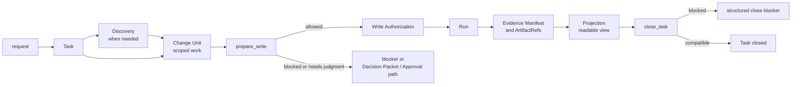

# Build: Runtime Walkthrough

## What this document helps you do

Follow one Harness work item from user request to close outcome without reading every strict contract first.

This is Build documentation. It summarizes the runtime path for implementers and reviewers, but it does not authorize runtime/server implementation, generated operational files, executable fixtures, runtime data, or new schemas before the documentation set is accepted for implementation planning. The first product MVP target is v0.1 Kernel MVP, exercised by Kernel Smoke as its narrow conformance profile. v0.2 through v0.4 are staged packs toward the Agency-Hardened MVP reference conformance target, and v1+ Expansion remains roadmap scope unless owner docs promote and prove it.

## Read this when

- You want a runtime-shaped mental model before reading the reference contracts.
- You are checking how requirements become scoped work.
- You need to explain the difference between state, artifacts, projections, and close blockers.
- You are reviewing the first Kernel MVP path without expanding it.

## Before you read

Read [Implementation Overview](implementation-overview.md) and [First Runnable Slice](first-runnable-slice.md) for implementation context. Use [Kernel Reference](../reference/kernel.md), [Runtime Architecture Reference](../reference/runtime-architecture.md), [Document Projection Reference](../reference/document-projection.md), [MCP API And Schemas](../reference/mcp-api-and-schemas.md), [Storage And DDL](../reference/storage-and-ddl.md), and [Operations And Conformance](../reference/operations-and-conformance.md) for exact behavior.

## Main idea

For write-capable tracked work, a request becomes safe product work only after Harness knows the Task, the needed Discovery or decisions, and the first scoped Change Unit. Product writes then pass through `prepare_write`, which can create a one-attempt Write Authorization. Runs consume that authority, evidence and artifacts support claims, projections make the state readable, and `close_task` either returns structured blockers or closes the Task.

## Walkthrough at a glance

What to notice: the diagram is a reader path, not a second source of truth. Discovery and projections help shape or read work, but write authority is `prepare_write`, execution is recorded by `record_run`, and completion is decided by `close_task`. Exact state and gate behavior lives in [Kernel Reference](../reference/kernel.md); public calls live in [MCP API And Schemas](../reference/mcp-api-and-schemas.md).

## Step-by-step runtime path

### 1. Request -> Task

The user describes work in ordinary language. Harness intake classifies the task shape and creates or updates Task state when tracking is useful.

Strict behavior: Task lifecycle, modes, and state transitions are owned by [Kernel Reference](../reference/kernel.md#lifecycle-and-transitions). Storage layout is owned by [Storage And DDL](../reference/storage-and-ddl.md).

### 2. Task -> Discovery

Discovery is used when the request is ambiguous, risky, multi-step, product-facing, or likely to need user-owned judgment. It clarifies goal, non-goals, acceptance criteria, assumptions, technical and product choices, security or privacy concerns, QA expectations, and scope boundaries.

Strict behavior: Discovery is shaping input. It is not Approval, Write Authorization, evidence, verification, QA, acceptance, residual-risk acceptance, close, or a new authority path. Decision routing is owned by [Decision Packet](../reference/kernel.md#decision-packet) and the public decision call in [MCP API And Schemas](../reference/mcp-api-and-schemas.md#harnessrequest_user_decision).

### 3. Discovery -> Change Unit

The first safe Change Unit turns the request into a scoped implementation unit. It names what work surface may change, what remains out of bounds, and what judgment the agent may exercise inside that scope.

Strict behavior: Change Unit and Autonomy Boundary semantics are owned by [Kernel Reference](../reference/kernel.md#change-unit) and [Autonomy Boundary](../reference/kernel.md#autonomy-boundary). A Change Unit scopes work, but it does not authorize a write by itself.

### 4. Change Unit -> `prepare_write`

Before a product write, the agent asks Core for write authority for the intended operation. Core checks current state, Change Unit scope, Autonomy Boundary, baseline freshness, sensitive-action Approval, Decision Packets, applicable design policy, and surface capability.

Strict behavior: `prepare_write` is owned by [Kernel Reference](../reference/kernel.md#prepare_write). Public request and response shapes are owned by [`harness.prepare_write`](../reference/mcp-api-and-schemas.md#harnessprepare_write).

### 5. `prepare_write` -> Write Authorization or blocker

If the checks pass, Core creates or returns a compatible Write Authorization for one specific attempt. If the checks do not pass, the response routes to a blocker, state conflict, sensitive-action Approval path, or Decision Packet path.

Strict behavior: Write Authorization semantics are owned by [Write Authorization](../reference/kernel.md#write-authorization). Approval and Decision Packet non-substitution rules are owned by [Judgment route boundaries](../reference/kernel.md#judgment-route-boundaries).

### 6. Write Authorization -> Run

The implementation or direct write happens, then `record_run` records what happened. A product-write Run consumes one compatible, unexpired, unconsumed Write Authorization. Out-of-scope observations are not normalized by prose; they route to repair, recovery, or blocker handling.

Strict behavior: Run recording and authorization consumption are owned by [record_run](../reference/kernel.md#record_run). Guarantee level enforcement is summarized in [Runtime Architecture Reference](../reference/runtime-architecture.md#guarantee-level-enforcement-map).

### 7. Run -> Evidence and artifacts

Evidence maps completion claims or acceptance criteria to supporting owner records and registered artifact refs. Raw artifacts hold durable evidence bytes; artifact records and refs carry identity, integrity, redaction, retention, and owner relation.

Strict behavior: evidence and gate semantics are owned by [Evidence Manifest](../reference/kernel.md#evidence-manifest), [Evidence Gate](../reference/kernel.md#evidence-gate), and [Artifact](../reference/kernel.md#artifact). Artifact storage and DDL details are owned by [Storage And DDL](../reference/storage-and-ddl.md).

### 8. Evidence -> Projection

The projector renders readable Markdown and cards from state records, events, and artifact refs. Projection freshness helps people know whether a readable view is current, but Markdown does not become state or evidence authority.

Strict behavior: projection authority, managed blocks, human-editable sections, and freshness rules are owned by [Document Projection Reference](../reference/document-projection.md). Rendered template bodies live in [Template Reference](../reference/templates/README.md).

### 9. Projection -> close blocker or close

Near completion, `close_task` checks close-relevant state and either closes the Task or returns structured blockers. Close Readiness is a user-facing summary of those blockers, not a new gate.

Strict behavior: completion checks are owned by [`close_task`](../reference/kernel.md#close_task), close result wording by [Close result semantics](../reference/kernel.md#close-result-semantics), and public error precedence by [MCP API And Schemas](../reference/mcp-api-and-schemas.md#primary-error-code-precedence).

## First implementation boundary

For v0.1 Kernel MVP, keep the path narrow: one local project, one reference surface, one Task, one scoped Change Unit, basic Decision Packet behavior, `prepare_write`, one Write Authorization consumed by `record_run`, minimal artifact and Evidence Manifest support, minimal `TASK` projection or durable enqueue, status/next reads, and structured close blockers.

The staged order and Kernel Smoke boundary are summarized in [MVP Plan](mvp-plan.md). Exact fixture body shape and assertion rules stay in [Operations And Conformance](../reference/operations-and-conformance.md#conformance-fixture-format).
