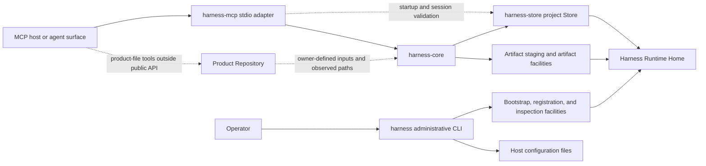
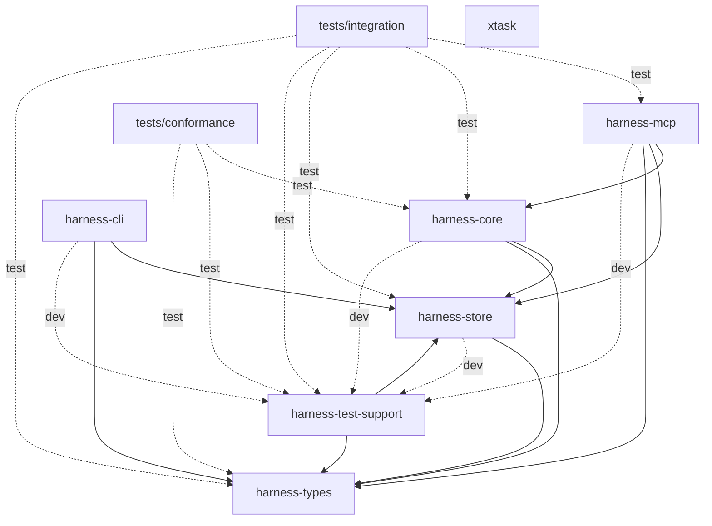
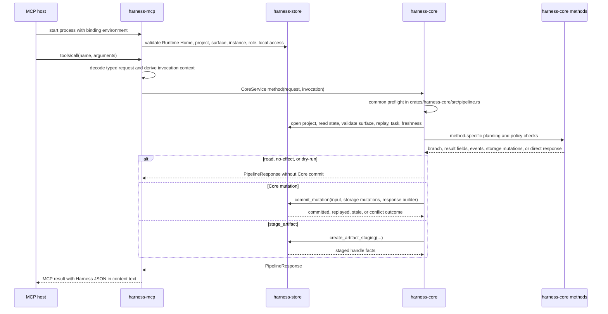

# Implementation architecture

This guide owns guide-level implementation structure and execution-flow explanation for the local Rust workspace. It helps implementers locate code, understand responsibility boundaries, and route code questions to the contract owners.

It does not define or override public API behavior, request or response fields, schema meaning, storage effects, DDL or table columns, security guarantees, runtime enforcement, Core authority semantics, or product contracts. Use the [Developer Documentation](README.md) entry point for the source-code learning path, the [Codebase Tour](codebase-tour.md) for crate-by-crate first files and symbols, the [Request Lifecycle](request-lifecycle.md) for representative method traces, [Implementation Design Patterns](design-patterns.md) for recurring implementation structures, [Storage and Transactions](storage-and-transactions.md) for Store commit and artifact boundaries, [Testing Strategy](testing-strategy.md) for test-layer choice, [Architecture Decisions](decisions/README.md) for focused decision records, the [Implementation Guide](change-guide.md) for change workflow, and the focused Reference owners for exact behavior.

Harness is the local work-authority product/system for AI-assisted product work. Core is the local authority record for Harness state.

Code and test paths that are meant to be opened directly are written relative to the repository root.

## Operational paths

The repository implementation has two distinct operational paths:

- MCP host -> `harness-mcp` -> `harness-core` -> Store and artifact facilities under `Harness Runtime Home`.
- Operator -> `harness` administrative CLI -> bootstrap and registration facilities -> `Harness Runtime Home` and host configuration files.

`harness-mcp` also uses `harness-store` directly during startup and session-binding validation. That Store use checks Runtime Home, project, surface, surface instance, role, and local-access registration before stdio begins. It is not an alternate implementation path for public Harness method semantics, which route through `harness-core`.

`Product Repository` remains a separate product-file boundary. The public Harness API records owner-defined compatibility, observations, and artifact links; product-file writes themselves happen through a connected surface or local tooling outside the public API path.

## Workspace shape

The Cargo workspace contains these members:

| Workspace member | Cargo package | Targets | Guide-level role |
|---|---|---|---|
| `crates/harness-types` | `harness-types` | Library | Shared Rust request, response, schema-shaped, value-set, identifier, and canonical-hash types. |
| `crates/harness-store` | `harness-store` | Library | SQLite, Runtime Home, bootstrap, project Store, artifact storage, migration, inspection, and storage-error implementation. |
| `crates/harness-core` | `harness-core` | Library | Core service, shared request pipeline, method planning, policy checks, and Store coordination. |
| `crates/harness-cli` | `harness-cli` | Library and `harness` binary | Local administrative CLI for Runtime Home setup, project registration, surface registration, local MCP setup, and host config generation. |
| `crates/harness-mcp` | `harness-mcp` | Library and `harness-mcp` binary | MCP stdio adapter, startup validation, tool listing, `tools/call` dispatch, and Core invocation. |
| `crates/harness-test-support` | `harness-test-support` | Library | Disposable Runtime Home, Store, Core, and fixture helpers shared by implementation tests. |
| `tests/conformance` | `harness-conformance-tests` | `baseline` test target | Baseline cross-method scenarios that exercise owner-defined behavior through Core-facing APIs. |
| `tests/integration` | `harness-integration-tests` | `mcp_surface` test target | Cross-layer MCP, Core, Store, surface-binding, and access-path verification. |
| `xtask` | `xtask` | Library and `xtask` binary | Repository maintenance tooling for read-only documentation validation. It is not part of Harness runtime architecture. |

Internal dependency direction from the Cargo manifests:

| Member | Normal internal dependencies | Test-only internal dependencies |
|---|---|---|
| `harness-types` | None | None |
| `harness-store` | `harness-types` | `harness-test-support` |
| `harness-core` | `harness-store`, `harness-types` | `harness-test-support` |
| `harness-cli` | `harness-store`, `harness-types` | `harness-store` with `test-support`, `harness-test-support` |
| `harness-mcp` | `harness-core`, `harness-store`, `harness-types` | `harness-test-support` |
| `harness-test-support` | `harness-store`, `harness-types` | None |
| `tests/conformance` | None; the package contains only test targets | `harness-core`, `harness-test-support`, `harness-types` |
| `tests/integration` | None; the package contains only test targets | `harness-core`, `harness-mcp`, `harness-store`, `harness-test-support`, `harness-types` |
| `xtask` | None | None |

The durable dependency boundaries are:

- Core does not depend on CLI or MCP adapter crates.
- MCP may depend on Core, Store, and shared types for distinct responsibilities: transport and dispatch, startup/session validation, and typed request handling.
- The administrative CLI uses Store and shared types for local setup and registration rather than invoking public Core methods.
- Store depends on shared types.
- Test-support and test packages compose implementation crates only for disposable fixtures and cross-layer verification.
- `xtask` has no internal product-crate dependencies. Documentation-tooling dependencies stay isolated in the maintenance crate.

## Source module map

| Area | Major module paths | Durable responsibility |
|---|---|---|
| `crates/harness-types` | `crates/harness-types/src/methods.rs`, `crates/harness-types/src/schema.rs`, `crates/harness-types/src/values.rs`, `crates/harness-types/src/ids.rs`, `crates/harness-types/src/canonical.rs` | `methods.rs` carries typed public request/result models and method-to-access mapping. `schema.rs` carries shared schema-shaped Rust data, response branches, Core state shapes, artifact and judgment structures, and persisted helper shapes. `values.rs` carries controlled Rust enums and constants for documented value names. `ids.rs` carries opaque identifier wrappers and durable ID generation helpers. `canonical.rs` carries deterministic canonical JSON serialization and request hashing. |
| `crates/harness-store` | `crates/harness-store/src/runtime_home.rs`, `crates/harness-store/src/bootstrap.rs`, `crates/harness-store/src/sqlite.rs`, `crates/harness-store/src/migrations.rs`, `crates/harness-store/src/core_pipeline.rs`, `crates/harness-store/src/artifacts.rs`, `crates/harness-store/src/inspection.rs`, `crates/harness-store/src/error.rs` | `runtime_home.rs` resolves Runtime Home paths. `bootstrap.rs` initializes Runtime Home metadata and registers projects and surfaces. `sqlite.rs` opens and validates registry/project SQLite databases. `migrations.rs` applies baseline migrations. `core_pipeline.rs` exposes `CoreProjectStore`, read helpers, replay rows, storage mutation types, and the atomic Core mutation commit boundary. `artifacts.rs` handles transient staging and persistent artifact body verification. `inspection.rs` supports read-only setup inspection. `error.rs` classifies storage failures for higher layers. |
| `crates/harness-core` | `crates/harness-core/src/pipeline.rs`, `crates/harness-core/src/methods/`, `crates/harness-core/src/policy/` | `pipeline.rs` owns common request preflight, validated request context preparation, effect-path selection, response construction, replay handling, and Core commit orchestration. `methods/` owns method-specific validation, planning, storage mutation lists, event payloads, dry-run summaries, and result fields. `policy/` owns reusable Core policy helpers for access, replay context, product paths, write authorization, close readiness, evidence, and judgment relevance. |
| `crates/harness-cli` | `crates/harness-cli/src/main.rs`, `crates/harness-cli/src/local_mcp_command.rs`, `crates/harness-cli/src/setup.rs`, `crates/harness-cli/src/wizard.rs`, `crates/harness-cli/src/host_config.rs`, `crates/harness-cli/src/registration.rs` | `main.rs` dispatches administrative commands and binary exit behavior. `local_mcp_command.rs` parses and orchestrates `harness setup local-mcp`, preflight checks, config destination checks, output rendering, and config-file writing. `setup.rs` plans, prepares, revalidates, and applies Runtime Home/project/surface setup. `wizard.rs` is the interactive frontend for the same setup path. `host_config.rs` renders host-neutral MCP configuration JSON. `registration.rs` builds deterministic capability-profile and local-access metadata. |
| `crates/harness-mcp` | `crates/harness-mcp/src/main.rs`, `crates/harness-mcp/src/lib.rs` | `main.rs` handles command modes such as stdio, `--check`, help, and version. `lib.rs` owns MCP tool metadata, startup inspection, session context, typed `tools/call` decoding, invocation-context derivation, JSON-RPC stdio framing, and response wrapping. |
| `crates/harness-test-support` | `crates/harness-test-support/src/lib.rs` | Provides disposable Runtime Home helpers, fixture setup for Core and Store tests, shared request builders, and fixture-only helpers used by conformance and integration tests. |

These module descriptions are implementation placement guidance. Exact API fields, method behavior, storage records, storage effects, security wording, and Core authority semantics stay with the Reference owners.

## Core pipeline and Store boundary

`crates/harness-core/src/pipeline.rs`, `crates/harness-core/src/methods/`, `crates/harness-core/src/policy/`, and `crates/harness-store/src/core_pipeline.rs` have separate jobs:

| Component | Job in the implementation |
|---|---|
| `crates/harness-core/src/pipeline.rs` | Runs common preflight, prepares `VerifiedRequestContext`, routes prepared requests to read, no-effect, dry-run, or committed Core paths, and builds common response bases. |
| `crates/harness-core/src/methods/` | Decodes already typed requests into method-specific plans: validation outcomes, dry-run summaries, event payloads, result fields, and `CoreStorageMutation` lists. |
| `crates/harness-core/src/policy/` | Supplies reusable checks used by method planners and preflight: registered-surface access, replay context, Product Repository path normalization, write-authorization compatibility, evidence status, judgment relevance, and close-readiness calculations. |
| `crates/harness-store/src/core_pipeline.rs` | Owns project-local Store access, read helpers, replay rows, storage mutation application, and the atomic `CoreProjectStore::commit_mutation` transaction. |

Method modules decide what should happen for one public method. The shared Core pipeline decides the common ordering and effect path. Store commits apply the selected storage mutations atomically; Store does not decide method policy.

## MCP and Core execution flow

Implementation flow:

1. `harness-mcp` resolves Runtime Home and fixed binding inputs from process environment or configured registration data.
2. `McpStartupInspection` validates Runtime Home metadata, project registration and status, project state availability, surface registration, usable surface instance selection, role, capability-profile JSON, metadata JSON, and local-access grants through Store-facing facilities.
3. The stdio loop accepts line-delimited JSON-RPC and dispatches `initialize`, `ping`, `tools/list`, and `tools/call`.
4. `tools/call` reads the tool name, decodes `arguments` into the matching typed request from `harness-types`, and derives an `InvocationContext` from the fixed MCP session plus the typed request's method-derived access class.
5. `McpAdapter::call_tool` dispatches to the matching `CoreService` method.
6. Each `CoreService` method selects a `MethodPolicy` and calls common preflight before method-specific planning.
7. Common preflight validates request-envelope shape, rejects adapter binding mismatches, validates committed-effect envelope requirements, computes the canonical request hash, opens the project Store, reads `project_state`, derives the verified surface context, handles idempotency replay for committed branches, resolves the Task according to the method policy, checks `state_version` freshness where applicable, checks registered access for the method-derived access class, and prepares a validated request context.
8. The method module performs method-specific validation, policy evaluation, and plan or result construction.
9. The selected branch returns a read-only result, no-persistence result, dry-run preview, Core mutation commit, or transient artifact staging result.
10. Core returns a `PipelineResponse`; MCP wraps the exact Harness response JSON as MCP `tools/call` content text.

This flow is an implementation map. Exact public method contracts, error precedence, response schemas, and storage effects remain with the focused Reference owners.

## Effect and commit boundaries

| Effect path | Implementation location | Storage consequence at guide level |
|---|---|---|
| Read-only result | `OwnerPipelineBranch::ReadOnly` through `crates/harness-core/src/pipeline.rs` | Builds a result from current Store reads; no Core mutation commit. |
| Result with no persistence | `OwnerPipelineBranch::NoEffectResult` through `crates/harness-core/src/pipeline.rs` | Returns a method result without a Core state mutation, such as a blocked close result. |
| Dry-run result | `OwnerPipelineBranch::DryRunPreview` through `crates/harness-core/src/pipeline.rs` | Returns preview data with no persistent storage effect. |
| Core mutation commit | `OwnerPipelineBranch::CommitMutation` through `crates/harness-core/src/pipeline.rs` and `CoreProjectStore::commit_mutation` | Applies method-provided `CoreStorageMutation` values inside one Store transaction, appends events, stores replay response when idempotent, and advances project state where applicable. |
| Transient artifact staging | `crates/harness-core/src/methods/stage_artifact.rs` with `CoreProjectStore::create_artifact_staging` in `crates/harness-store/src/artifacts.rs` | Creates a transient staged-handle row and safe staged bytes. It does not follow the normal Core mutation commit path, does not increment `project_state.state_version`, does not append `task_events`, and does not create a replay row. |

`CoreProjectStore::commit_mutation` is the Store transaction boundary for normal committed Core mutations. The detailed commit sequence, replay handling, state-version relationship, artifact staging distinction, and failure boundaries are explained in [Storage and Transactions](storage-and-transactions.md). Table layout, DDL, storage record detail, method-specific persistence effects, and artifact lifecycle rules belong to the storage Reference owners.

## Administrative CLI setup flow

`harness setup local-mcp` is implemented as local administrative orchestration, not as a public Core method:

1. `crates/harness-cli/src/main.rs` dispatches `harness setup local-mcp` to `crates/harness-cli/src/local_mcp_command.rs`.
2. `crates/harness-cli/src/local_mcp_command.rs` parses options, resolves Runtime Home, resolves Product Repository root, resolves optional config directory, and discovers the `harness-mcp` executable.
3. `crates/harness-cli/src/setup.rs` builds a read-only `LocalMcpSetupPlan` by inspecting Runtime Home, registry, project records, project state, and surfaces. It also reports project or surface conflicts.
4. Config destination checks inspect the target directory and files before setup writes.
5. Dry-run returns rendered text or JSON output from the plan, planned preflight entries, and generated host config content without storage preparation, registration, preflight execution, or config-file writes.
6. Non-dry-run setup prepares storage: create or validate Runtime Home, and validate or migrate selected existing project state when reusing a project.
7. The command regenerates the plan after preparation and compares it with the earlier plan to catch conflicts introduced during preparation.
8. `apply_local_mcp_setup_plan` creates or reuses Runtime Home, registers or reuses the project, and creates or updates the fixed agent and optional user-interaction surface registrations.
9. For each configured binding, the CLI runs `harness-mcp --check` with generated environment variables and validates the deterministic preflight report.
10. `crates/harness-cli/src/host_config.rs` renders host-neutral MCP configuration JSON, and `crates/harness-cli/src/local_mcp_command.rs` writes config files only after destination validation and successful preflight.
11. The command renders final text or JSON output with setup status, actions, preflight status, and generated configuration information.

`crates/harness-cli/src/wizard.rs` is an interactive frontend over the same planning and application path. The wizard collects inputs, conflict approvals, config overwrite decisions, and final approval, then calls the non-interactive setup executor; it is not an independent setup engine.

## Decision Routes

The architecture overview keeps the workspace and execution map. Focused
decision consequences and non-goals live in the decision records:

| Boundary | Focused decision |
|---|---|
| Core independence from MCP and CLI adapters | [Core and adapter dependency boundary](decisions/core-adapter-boundary.md) |
| Method planning before normal committed Store mutation | [Planning before atomic mutation commit](decisions/plan-and-atomic-commit.md) |
| Runtime data separated from product files | [Runtime Home and Product Repository separation](decisions/runtime-home-and-product-repository.md) |

Other durable boundaries remain visible in the flow above: administrative CLI
setup is local bootstrap rather than public Core method behavior, MCP Store use
is limited to startup and session validation, artifact staging is separate from
normal Core mutation commit, and tests verify owner-defined facts rather than
owning product contracts.

## Test topology

This section maps test locations. Use [Testing Strategy](testing-strategy.md)
to choose a test layer for a concrete change.

| Test area | Verification role |
|---|---|
| Colocated unit tests in implementation modules | Check local helpers, parsing, serialization, migration, Store, policy, and edge behavior close to the code under test. |
| `crates/harness-core/src/methods/tests.rs` | Exercises Core method planning, shared preflight behavior, effect branches, replay behavior, staging distinction, artifact promotion, close-readiness calculations, and method-owned storage mutation outcomes through `CoreService`. |
| `crates/harness-cli/tests/binary_admin.rs` | Runs the `harness` binary for administrative initialization, registration, setup help and usage errors, dry-run behavior, local MCP setup, preflight failure handling, and config-file safety. |
| `crates/harness-mcp/tests/binary_transport.rs` | Runs the `harness-mcp` binary for help/version, `--check`, stdio framing, line-delimited JSON-RPC, reconnection behavior, and MCP response wrapping. |
| `tests/integration/mcp_surface.rs` | Verifies MCP surface binding, tool schemas, public method exposure, per-method access derivation, Core/MCP parity, session rejection cases, replay context binding, and cross-layer storage effects. |
| `tests/conformance/baseline.rs` | Exercises baseline public behavior scenarios through Core-facing APIs using shared fixtures, including replay, no-effect branches, write authorization, artifact lifecycle, judgment boundaries, close readiness, error routing, and corruption handling. |
| `crates/harness-test-support` | Supplies disposable Runtime Home fixtures, project and surface registration helpers, request builders, Store helpers, and shared assertions for the test packages and crate tests. |

Tests verify behavior that owner documents define. A test fixture, assertion, or scenario name must not become the only source for a product contract.

## Code-to-owner routing

| Implementation area | First relevant contract owner |
|---|---|
| Public method implementation in `crates/harness-core/src/methods/` | [API Methods](../reference/api/methods.md), then the linked method owner. |
| Common Core pipeline, response branches, envelope handling, request hashing, and public error routing | [API Schema Core](../reference/api/schema-core.md), [API Error Family Index](../reference/api/errors.md), and [Storage Effects](../reference/storage-effects.md) where persistence is involved. |
| Core policies for user-owned judgment, write authorization, evidence, close readiness, and authority boundaries | [Core Model](../reference/core-model.md), method owners, [Agent Integration](../reference/agent-integration.md), and [API Value Sets](../reference/api/schema-value-sets.md) as applicable. |
| Product Repository path normalization and product/runtime location separation | [Runtime Boundaries](../reference/runtime-boundaries.md). |
| Shared Rust types and schema-shaped data in `crates/harness-types/src/` | [API Schema Core](../reference/api/schema-core.md), [API State Schemas](../reference/api/schema-state.md), [API Artifact Schemas](../reference/api/schema-artifacts.md), [API Judgment Schemas](../reference/api/schema-judgment.md), and [API Value Sets](../reference/api/schema-value-sets.md). |
| Atomic Store commit, replay rows, locking/versioning, storage records, and DDL | [Storage](../reference/storage.md), [Storage Effects](../reference/storage-effects.md), [Storage Records](../reference/storage-records.md), [Storage DDL](../reference/storage-ddl.md), and [Storage Versioning](../reference/storage-versioning.md). |
| Artifact staging and persistent artifact body verification | [Artifact Storage](../reference/storage-artifacts.md) and the method owner that references the artifact. |
| MCP startup, process binding, stdio framing, and `tools/call` wrapping | [MCP Transport](../reference/mcp-transport.md), with [Agent Integration](../reference/agent-integration.md) for verified surface context. |
| Administrative CLI setup and local registration | [Administrative CLI](../reference/admin-cli.md), with [Runtime Boundaries](../reference/runtime-boundaries.md) and [MCP Transport](../reference/mcp-transport.md) for adjacent location and process behavior. |

Use this page to orient code reading and preserve implementation boundaries. Use the focused owners to decide behavior.
