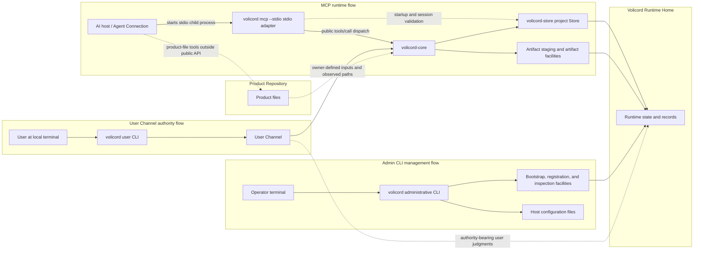
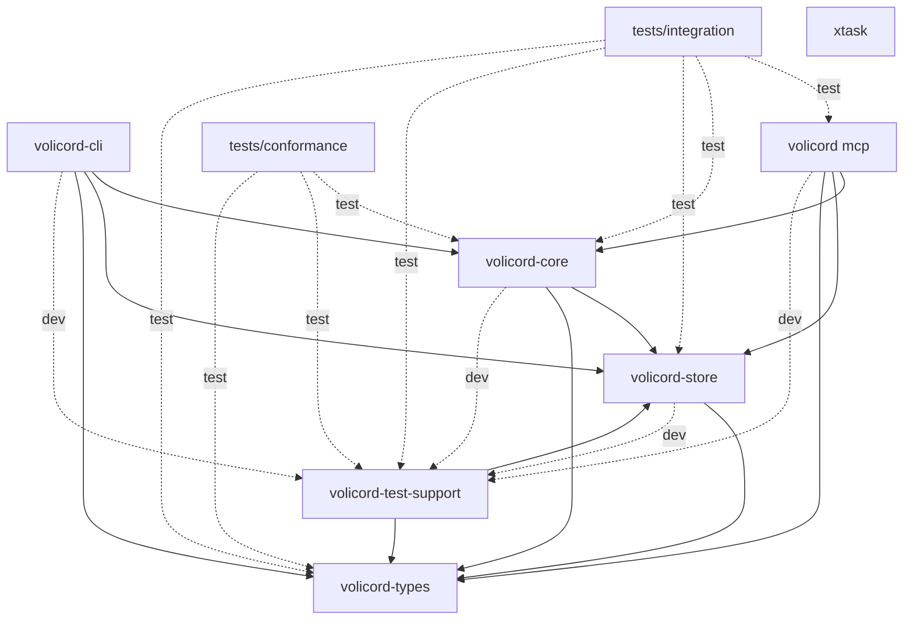
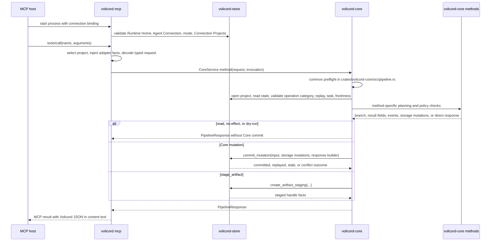
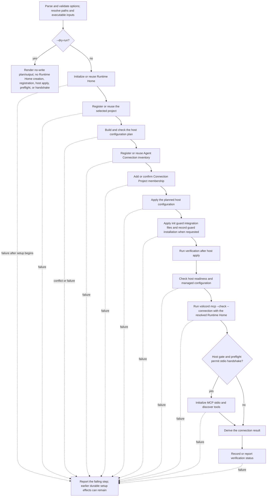

# Implementation architecture

This guide owns guide-level implementation structure and execution-flow explanation for the local Rust workspace. It helps implementers locate code, understand responsibility boundaries, and route code questions to the contract owners.

It does not define or override public API behavior, request or response fields, schema meaning, storage effects, DDL or table columns, security guarantees, runtime enforcement, Core authority semantics, or product contracts. Use the [Developer Documentation](README.md) entry point for the source-code learning path, the [Codebase Tour](codebase-tour.md) for crate-by-crate first files and symbols, the [Request Lifecycle](request-lifecycle.md) for representative method traces, [Implementation Design Patterns](design-patterns.md) for recurring implementation structures, [Storage and Transactions](storage-and-transactions.md) for Store commit and artifact boundaries, [Testing Strategy](testing-strategy.md) for test-layer choice, [Architecture Decisions](decisions/README.md) for focused decision records, the [Implementation Guide](change-guide.md) for change workflow, and the focused Reference owners for exact behavior.

Volicord is the local work-authority product/system for AI-assisted product work. Core is the local authority record for Volicord state.

Code and test paths that are meant to be opened directly are written relative to the repository root.

This checkout is the Volicord source repository and Rust workspace for the repository-maintained Volicord implementation. It contains implementation crates for Core, storage, shared types, the `volicord` administrative CLI and MCP process entry, the `volicord-mcp` adapter library, tests, documentation, validation tooling, and repository configuration. A Volicord installation is a deployed subset of executables and required runtime resources, so this source map must not be read as an installation manifest.

## Operational paths

This guide-level map shows which local implementation components and file
boundaries participate in the main operational paths. It orients execution
paths for implementers; it is not a public API contract, installation manifest,
storage ERD, or user workflow.

Read solid arrows as primary local call or record-access paths and dotted
arrows as validation, authority-record, observed-input, or outside-public-API
relationships. The `Volicord Runtime Home` and `Product Repository` boxes are
storage/file boundaries, not process containers; the Product Repository remains
outside the Runtime Home. Exact behavior belongs to the source areas and
Reference owners named in the surrounding sections.

The Volicord implementation in this repository has three distinct operational path shapes:

- MCP host -> `volicord mcp --stdio` -> `volicord-mcp` adapter library -> `volicord-core` -> Store and artifact facilities under `Volicord Runtime Home`.
- Operator -> `volicord` administrative CLI -> bootstrap and registration facilities -> `Volicord Runtime Home` and host configuration files.
- User at a local terminal -> `volicord user` CLI -> `volicord-core` -> Store under `Volicord Runtime Home`, using the `User Channel`.

The `volicord-mcp` adapter library also uses `volicord-store` directly during startup and request routing. That Store use checks Runtime Home, Agent Connection state, Connection Projects membership, project availability, `connection.mode`, `operation_category`, and `actor_source` provenance before dispatching a public method to Core. It is not an alternate implementation path for public Volicord method semantics, which route through `volicord-core`.

`Product Repository` remains a separate product-file boundary. The public Volicord API records owner-defined compatibility, observations, and artifact links; product-file writes themselves happen through an Agent Connection or local tooling outside the public API path.

## Workspace shape

The Cargo workspace contains these members:

| Workspace member | Cargo package | Targets | Guide-level role |
|---|---|---|---|
| `crates/volicord-types` | `volicord-types` | Library | Shared Rust request, response, schema-shaped, value-set, identifier, and canonical-hash types. |
| `crates/volicord-store` | `volicord-store` | Library | SQLite, Runtime Home, bootstrap, project Store, artifact storage, migration, inspection, and storage-error implementation. |
| `crates/volicord-core` | `volicord-core` | Library | Core service, shared request pipeline, method planning, policy checks, and Store coordination. |
| `crates/volicord-cli` | `volicord-cli` | Library and `volicord` binary | Local administrative CLI for Runtime Home setup, project registration, User Channel commands, Agent Connection setup, host adapters, and the public `volicord mcp` process entry. |
| `crates/volicord-mcp` | `volicord-mcp` | Library | MCP stdio adapter, startup validation, tool listing, `tools/call` dispatch, and Core invocation. |
| `crates/volicord-test-support` | `volicord-test-support` | Library | Disposable Runtime Home, Store, Core, and fixture helpers shared by implementation tests. |
| `tests/conformance` | `volicord-conformance-tests` | `baseline` test target | Baseline cross-method scenarios that exercise owner-defined behavior through Core-facing APIs. |
| `tests/integration` | `volicord-integration-tests` | `mcp_connection` test target | Cross-layer MCP, Core, Store, Agent Connection binding, and operation-category verification. |
| `xtask` | `xtask` | Library and `xtask` binary | Repository maintenance tooling for read-only documentation validation. It is not part of Volicord runtime architecture. |

Internal dependency direction from the Cargo manifests:

| Member | Normal internal dependencies | Test-only internal dependencies |
|---|---|---|
| `volicord-types` | None | None |
| `volicord-store` | `volicord-types` | `volicord-test-support` |
| `volicord-core` | `volicord-store`, `volicord-types` | `volicord-test-support` |
| `volicord-cli` | `volicord-core`, `volicord-mcp`, `volicord-store`, `volicord-types` | `volicord-store` with `test-support`, `volicord-test-support` |
| `volicord-mcp` | `volicord-core`, `volicord-store`, `volicord-types` | `volicord-test-support` |
| `volicord-test-support` | `volicord-store`, `volicord-types` | None |
| `tests/conformance` | None; the package contains only test targets | `volicord-core`, `volicord-test-support`, `volicord-types` |
| `tests/integration` | None; the package contains only test targets | `volicord-core`, `volicord-mcp`, `volicord-store`, `volicord-test-support`, `volicord-types` |
| `xtask` | None | None |

The next Mermaid diagram shows which workspace members may depend on which
other internal packages. It uses Cargo dependency direction, not runtime
process topology, and exactness belongs to the Cargo manifests. Solid arrows
point from a crate or package to a normal internal dependency. Dashed `dev` and
`test` arrows are development and test-only dependency edges.

The durable dependency boundaries are:

- Core does not depend on CLI or MCP adapter crates.
- MCP may depend on Core, Store, and shared types for distinct responsibilities: transport and dispatch, Agent Connection startup validation, request-time project routing, and typed request handling.
- The administrative CLI uses Store and shared types for local setup and registration. Its `volicord user` command path also depends on Core to invoke selected Core-facing methods through the `User Channel`.
- Store depends on shared types.
- Test-support and test packages compose implementation crates only for disposable fixtures and cross-layer verification.
- `xtask` has no internal product-crate dependencies. Documentation-tooling dependencies stay isolated in the maintenance crate.

## Source module map

| Area | Major module paths | Durable responsibility |
|---|---|---|
| `crates/volicord-types` | `crates/volicord-types/src/methods.rs`, `crates/volicord-types/src/schema.rs`, `crates/volicord-types/src/values.rs`, `crates/volicord-types/src/ids.rs`, `crates/volicord-types/src/canonical.rs` | `methods.rs` carries typed public request/result models and method-to-`operation_category` mapping. `schema.rs` carries shared schema-shaped Rust data, response branches, Core state shapes, artifact and judgment structures, and persisted helper shapes. `values.rs` carries controlled Rust enums and constants for documented value names. `ids.rs` carries opaque identifier wrappers and durable ID generation helpers. `canonical.rs` carries deterministic canonical JSON serialization and request hashing. |
| `crates/volicord-store` | `crates/volicord-store/src/runtime_home.rs`, `crates/volicord-store/src/bootstrap.rs`, `crates/volicord-store/src/sqlite.rs`, `crates/volicord-store/src/migrations.rs`, `crates/volicord-store/src/core_pipeline.rs`, `crates/volicord-store/src/artifacts.rs`, `crates/volicord-store/src/inspection.rs`, `crates/volicord-store/src/error.rs` | `runtime_home.rs` resolves Runtime Home paths. `bootstrap.rs` initializes Runtime Home metadata and registers projects, Agent Connections, Connection Projects, and the User Channel. `sqlite.rs` opens and validates registry/project SQLite databases. `migrations.rs` applies baseline migrations. `core_pipeline.rs` exposes `CoreProjectStore`, read helpers, replay rows, storage mutation types, and the atomic Core mutation commit boundary. `artifacts.rs` handles transient staging and persistent artifact body verification. `inspection.rs` supports read-only setup inspection. `error.rs` classifies storage failures for higher layers. |
| `crates/volicord-core` | `crates/volicord-core/src/pipeline.rs`, `crates/volicord-core/src/methods/`, `crates/volicord-core/src/policy/` | `pipeline.rs` owns common request preflight, validated request context preparation, effect-path selection, response construction, replay handling, and Core commit orchestration. `methods/` owns method-specific validation, planning, storage mutation lists, event payloads, dry-run summaries, and result fields. `policy/` owns reusable Core policy helpers for operation-category checks, replay context, Product Repository path normalization, Write Check compatibility, evidence status, judgment relevance, and close-readiness calculations. |
| `crates/volicord-cli` | `crates/volicord-cli/src/main.rs`, `crates/volicord-cli/src/setup_command.rs`, `crates/volicord-cli/src/doctor_command.rs`, `crates/volicord-cli/src/project_context.rs`, `crates/volicord-cli/src/connection_command.rs`, `crates/volicord-cli/src/export_command.rs`, `crates/volicord-cli/src/user_command.rs`, `crates/volicord-cli/src/host_integration/`, `crates/volicord-cli/src/registration.rs` | `main.rs` dispatches administrative commands, `volicord mcp` command modes, and binary exit behavior. `setup_command.rs` and `doctor_command.rs` handle installation profile readiness. `project_context.rs` detects Git repository roots and orchestrates project commands. `connection_command.rs` parses and orchestrates `volicord init`, `volicord connect`, `volicord connections`, and `volicord connection ...` commands. `export_command.rs` renders generic MCP config exports. `user_command.rs` parses and orchestrates local User Channel status and judgment commands. `host_integration/` owns Codex, Claude Code, and generic host plans and managed host configuration. `registration.rs` builds Agent Connection, Connection Projects, and User Channel metadata. |
| `crates/volicord-mcp` | `crates/volicord-mcp/src/lib.rs` | `lib.rs` owns MCP tool metadata, Agent Connection startup inspection, request-time project routing, the adapter-owned `volicord.list_projects` utility, typed public `tools/call` decoding, `operation_category` and `actor_source` derivation, initialization instructions, JSON-RPC stdio framing, response wrapping, and the stdio/preflight runner used by `volicord mcp`. |
| `crates/volicord-test-support` | `crates/volicord-test-support/src/lib.rs` | Provides disposable Runtime Home helpers, fixture setup for Core and Store tests, shared request builders, and fixture-only helpers used by conformance and integration tests. |

These module descriptions are implementation placement guidance. Exact API fields, method behavior, storage records, storage effects, security wording, and Core authority semantics stay with the Reference owners.

## Core pipeline and Store boundary

`crates/volicord-core/src/pipeline.rs`, `crates/volicord-core/src/methods/`, `crates/volicord-core/src/policy/`, and `crates/volicord-store/src/core_pipeline.rs` have separate jobs:

| Component | Job in the implementation |
|---|---|
| `crates/volicord-core/src/pipeline.rs` | Runs common preflight, prepares `VerifiedRequestContext`, routes prepared requests to read, no-effect, dry-run, or committed Core paths, and builds common response bases. |
| `crates/volicord-core/src/methods/` | Decodes already typed requests into method-specific plans: validation outcomes, dry-run summaries, event payloads, result fields, and `CoreStorageMutation` lists. |
| `crates/volicord-core/src/policy/` | Supplies reusable checks used by method planners and preflight: operation category, replay context, Product Repository path normalization, Write Check compatibility, evidence status, judgment relevance, and close-readiness calculations. |
| `crates/volicord-store/src/core_pipeline.rs` | Owns project-local Store access, read helpers, replay rows, storage mutation application, and the atomic `CoreProjectStore::commit_mutation` transaction. |

Method modules decide what should happen for one public method. The shared Core pipeline decides the common ordering and effect path. Store commits apply the selected storage mutations atomically; Store does not decide method policy.

## MCP and Core execution flow

This sequence follows the shared execution order that connects an MCP
`tools/call` to Core planning and Store effects. Sequence arrows show
representative implementation call order and return flow; they do not show
onboarding, every method branch, or exact public method contracts. Exact source
areas are named in the numbered flow below, and public behavior remains with
the focused Reference owners.

Implementation flow:

1. `volicord mcp --stdio` resolves Runtime Home and one Agent Connection process context from `--connection <connection_id>` and optional `VOLICORD_HOME`.
2. `McpConnectionStartupInspection` validates Runtime Home metadata, Agent Connection state, `connection.mode`, Connection Projects readability, and registry JSON needed before stdio begins. It does not select one project for all calls.
3. The stdio loop accepts line-delimited JSON-RPC and dispatches `initialize`, `ping`, `tools/list`, and `tools/call`.
4. `tools/list` exposes tools by Agent Connection mode: `workflow` mode exposes ten public Volicord method tools and the adapter-owned `volicord.list_projects` utility, while `read_only` mode exposes two public method tools and the same utility. It does not expose the public User Channel method `volicord.record_user_judgment`. For `tools/call` of a public method, the adapter decodes MCP-visible arguments, deterministically selects an allowed project from `project_selector` or connection context, validates that the Agent Connection allows that project, generates the Core request envelope, injects adapter-managed `operation_category` and `actor_source` facts, then decodes the request into the matching typed request from `volicord-types`.
5. `tools/call` derives the current connection context from the selected project, `connection_id`, `connection.mode`, method-derived `operation_category`, and `actor_source` before dispatching to Core.
6. `McpAdapter::call_tool` dispatches to the matching `CoreService` method.
7. Each `CoreService` method selects a `MethodPolicy` and calls common preflight before method-specific planning.
8. Common preflight validates request-envelope shape, rejects adapter binding mismatches, validates committed-effect envelope requirements, computes the canonical request hash, opens the project Store, reads `project_state`, verifies the current connection context, handles idempotency replay for committed branches, resolves the Task according to the method policy, checks `state_version` freshness where applicable, checks the method-derived `operation_category`, and prepares a validated request context.
9. The method module performs method-specific validation, policy evaluation, and plan or result construction.
10. The selected branch returns a read-only result, no-persistence result, dry-run preview, Core mutation commit, or transient artifact staging result.
11. Core returns a `PipelineResponse`; MCP wraps the exact Volicord response JSON as MCP `tools/call` content text.

This flow is an implementation map. Exact public method contracts, error precedence, response schemas, and storage effects remain with the focused Reference owners.

## Effect and commit boundaries

| Effect path | Implementation location | Storage consequence at guide level |
|---|---|---|
| Read-only result | `OwnerPipelineBranch::ReadOnly` through `crates/volicord-core/src/pipeline.rs` | Builds a result from current Store reads; no Core mutation commit. |
| Result with no persistence | `OwnerPipelineBranch::NoEffectResult` through `crates/volicord-core/src/pipeline.rs` | Returns a method result without a Core state mutation, such as a blocked close result. |
| Dry-run result | `OwnerPipelineBranch::DryRunPreview` through `crates/volicord-core/src/pipeline.rs` | Returns preview data with no persistent storage effect. |
| Core mutation commit | `OwnerPipelineBranch::CommitMutation` through `crates/volicord-core/src/pipeline.rs` and `CoreProjectStore::commit_mutation` | Applies method-provided `CoreStorageMutation` values inside one Store transaction, appends events, stores replay response when idempotent, and advances project state where applicable. |
| Transient artifact staging | `crates/volicord-core/src/methods/stage_artifact.rs` with `CoreProjectStore::create_artifact_staging` in `crates/volicord-store/src/artifacts.rs` | Creates a transient staged-handle row and safe staged bytes. It does not follow the normal Core mutation commit path, does not increment `project_state.state_version`, does not append `task_events`, and does not create a replay row. |

`CoreProjectStore::commit_mutation` is the Store transaction boundary for normal committed Core mutations. The detailed commit sequence, replay handling, state-version relationship, artifact staging distinction, and failure boundaries are explained in [Storage and Transactions](storage-and-transactions.md). Table layout, DDL, storage record detail, method-specific persistence effects, and artifact lifecycle rules belong to the storage Reference owners.

## Administrative agent setup flow

`volicord init`, `volicord connect`, and `volicord connection ...` are implemented as local administrative orchestration, not as public Core methods. The implementation lives under `crates/volicord-cli/src/connection_command.rs` and the host adapters in `crates/volicord-cli/src/host_integration/`; exact command, Agent Connection, MCP transport, guard integration, and runtime-boundary contracts stay with [Administrative CLI](../reference/admin-cli.md), [MCP Transport](../reference/mcp-transport.md), [Runtime Boundaries](../reference/runtime-boundaries.md), and [Security](../reference/security.md).

This setup flow shows the order followed by local administrative connection
setup. Solid arrows show the main setup order, while dotted arrows point from
stages to possible failure reporting. The diagram is not the steady-state MCP
runtime path and does not imply cross-boundary transaction rollback;
`volicord mcp` appears only in the explicit preflight and optional stdio
handshake stages.

The connection sequence validates command options and resolves paths before any persistent setup. In `--dry-run`, the command resolves enough project, target, and connection identity to render planning output and then stops on the no-write path. It does not create Runtime Home directories or SQLite state, register projects, Agent Connections, or Connection Projects, apply host configuration, run `volicord mcp --check`, initialize MCP stdio, or perform tool discovery.

Non-dry-run execution initializes or reuses the selected Runtime Home first, then registers or reuses the selected project. After the project is available in registry state, the command resolves the MCP executable, derives the connection identity, builds the host configuration plan, and rejects host-plan conflicts before registering or updating the Agent Connection row.

Once the host plan is accepted, the command registers or reuses the Agent Connection, enforces the project-count rule for single-project scopes, adds or confirms the Connection Project membership, and then applies the planned host configuration. `volicord init` also applies the owner-defined guard integration files and records guard installation status after the Agent Connection and project membership exist. Product Repository guidance, where present, remains advisory context for local agents. It is separate from Core method authority: it does not record user judgments or create a `Write Check`.

Verification runs after host configuration is applied. It checks host readiness and managed configuration through the host adapter, runs `volicord mcp --check --connection <connection_id>` with the resolved Runtime Home, and performs direct MCP stdio initialization and `tools/list` discovery only when the host gate allows that handshake and preflight has passed. The command then records or reports the resulting verification status as implemented by the administrative CLI.

Failure handling is boundary-local. Validation and dry-run failures happen before persistent writes. After Runtime Home, registry, or host configuration effects begin, a later failure reports the failing step; earlier successful effects can remain for later `connection status`, `connection verify`, `project`, or `connection remove` commands to observe. The setup flow does not provide cross-boundary undo state or a single atomic reversal across Runtime Home registry state and external host configuration.

## Decision Routes

The architecture overview keeps the workspace and execution map. Focused
decision consequences and non-goals live in the decision records:

| Boundary | Focused decision |
|---|---|
| Core independence from MCP and CLI adapters | [Core and adapter dependency boundary](decisions/core-adapter-boundary.md) |
| Method planning before normal committed Store mutation | [Planning before atomic mutation commit](decisions/plan-and-atomic-commit.md) |
| Runtime data separated from product files | [Runtime Home and Product Repository separation](decisions/runtime-home-and-product-repository.md) |

Other durable boundaries remain visible in the flow above: administrative CLI
setup is local bootstrap rather than public Core method behavior, MCP Store use
is limited to startup and session validation, artifact staging is separate from
normal Core mutation commit, and tests verify owner-defined facts rather than
owning product contracts.

## Test topology

This section maps test locations. Use [Testing Strategy](testing-strategy.md)
to choose a test layer for a concrete change.

| Test area | Verification role |
|---|---|
| Colocated unit tests in implementation modules | Check local helpers, parsing, serialization, migration, Store, policy, and edge behavior close to the code under test. |
| `crates/volicord-core/src/methods/tests.rs` | Exercises Core method planning, shared preflight behavior, effect branches, replay behavior, staging distinction, artifact promotion, close-readiness calculations, and method-owned storage mutation outcomes through `CoreService`. |
| `crates/volicord-cli/tests/binary_admin.rs` | Runs the `volicord` binary for setup, project registration, `volicord init`, `volicord connect`, `volicord connections`, `volicord connection status/verify/mode/remove`, `volicord export mcp-config`, `volicord user ...`, dry-run behavior, host integration preflight handling, host config writes, repository detection, and command-line error paths. |
| `crates/volicord-cli/tests/mcp_transport.rs` | Runs the `volicord mcp` subcommand for help/version, `--check`, stdio framing, line-delimited JSON-RPC, reconnection behavior, and MCP response wrapping. |
| `tests/integration/mcp_connection.rs` | Verifies MCP connection binding, tool schemas, public method exposure, per-method `operation_category` derivation, Core/MCP parity, session rejection cases, replay context binding, and cross-layer storage effects. |
| `tests/conformance/baseline.rs` | Exercises baseline public behavior scenarios through Core-facing APIs using shared fixtures, including replay, no-effect branches, Write Check, artifact lifecycle, judgment boundaries, close readiness, error routing, and corruption handling. |
| `crates/volicord-test-support` | Supplies disposable Runtime Home fixtures, project and Agent Connection helpers, request builders, Store helpers, and shared assertions for the test packages and crate tests. |

Tests verify behavior that owner documents define. A test fixture, assertion, or scenario name must not become the only source for a product contract.

## Code-to-owner routing

| Implementation area | First relevant contract owner |
|---|---|
| Public method implementation in `crates/volicord-core/src/methods/` | [API Methods](../reference/api/methods.md), then the linked method owner. |
| Common Core pipeline, response branches, envelope handling, request hashing, and public error routing | [API Schema Core](../reference/api/schema-core.md), [API Error Family Index](../reference/api/errors.md), and [Storage Effects](../reference/storage-effects.md) where persistence is involved. |
| Core policies for user-owned judgment, Write Check, evidence, close readiness, and authority boundaries | [Core Model](../reference/core-model.md), method owners, [Runtime Boundaries](../reference/runtime-boundaries.md), [Security](../reference/security.md), and [API Value Sets](../reference/api/schema-value-sets.md) as applicable. |
| Product Repository path normalization and product/runtime location separation | [Runtime Boundaries](../reference/runtime-boundaries.md). |
| Shared Rust types and schema-shaped data in `crates/volicord-types/src/` | [API Schema Core](../reference/api/schema-core.md), [API State Schemas](../reference/api/schema-state.md), [API Artifact Schemas](../reference/api/schema-artifacts.md), [API Judgment Schemas](../reference/api/schema-judgment.md), and [API Value Sets](../reference/api/schema-value-sets.md). |
| Atomic Store commit, replay rows, locking/versioning, storage records, and DDL | [Storage](../reference/storage.md), [Storage Effects](../reference/storage-effects.md), [Storage Records](../reference/storage-records.md), [Storage DDL](../reference/storage-ddl.md), and [Storage Versioning](../reference/storage-versioning.md). |
| Artifact staging and persistent artifact body verification | [Artifact Storage](../reference/storage-artifacts.md) and the method owner that references the artifact. |
| MCP startup, process binding, stdio framing, and `tools/call` wrapping | [MCP Transport](../reference/mcp-transport.md), with [Runtime Boundaries](../reference/runtime-boundaries.md) and [Security](../reference/security.md) for Agent Connection, project allowlist, and operation-category boundaries. |
| Administrative agent setup and local registration | [Administrative CLI](../reference/admin-cli.md), with [Runtime Boundaries](../reference/runtime-boundaries.md), [MCP Transport](../reference/mcp-transport.md), and [Security](../reference/security.md) for adjacent host, location, process, and non-guarantee behavior. |

Use this page to orient code reading and preserve implementation boundaries. Use the focused owners to decide behavior.
