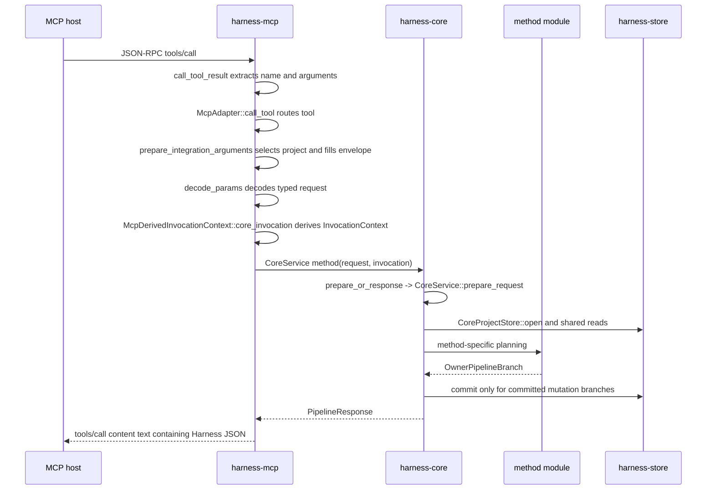

# Request lifecycle

This guide traces three representative public method calls through the current
Rust implementation:

- `harness.status` as a read-only path
- `harness.intake` as a committed state-mutation path
- `harness.prepare_write` as a policy- and authorization-sensitive path

It names source files and symbols so developers can follow the code. It does
not define exact public method behavior, request or response schemas, storage
effects, security guarantees, runtime boundaries, error semantics, or Core
authority semantics. Exact behavior belongs to the Reference owners linked in
each section.

## Shared MCP to Core shape

The shared adapter path lives in
[`crates/harness-mcp/src/lib.rs`](../../../crates/harness-mcp/src/lib.rs):

- `run_stdio` reads line-delimited JSON-RPC.
- `handle_json_rpc_request` dispatches `initialize`, `ping`, `tools/list`, and
  `tools/call`.
- `call_tool_result` extracts `params.name` and `params.arguments`, calls
  `McpAdapter::call_tool`, and wraps `PipelineResponse.response_json` as MCP
  text content.
- `McpAdapter::call_tool` matches the tool name, calls
  `prepare_typed_request<T>`, and dispatches to the matching `CoreService`
  method.
- `prepare_typed_request<T>` derives the request's method-level access class
  from the adapter-controlled tool/method mapping, rather than caller-supplied
  authority fields, then decodes the prepared arguments with
  `decode_params<T>`.
- `prepare_integration_arguments` checks the request envelope against
  `McpIntegrationContext`, selects one permitted project for the call, and
  fills the trusted envelope fields before typed decoding.
- Project selection creates `McpDerivedInvocationContext` for the selected
  project, bound surface, surface instance, requested access class, and
  adapter-binding basis.
- `McpDerivedInvocationContext::core_invocation` creates the Core
  `InvocationContext`.

Startup and session validation also live in `harness-mcp`, especially
`McpIntegrationStartupInspection::resolve`. That startup path reads Store
directly through Runtime Home, Agent Integration Profile state, surface and
surface-instance binding, role, membership, metadata, and local registry JSON
checks. It does not select one project for all calls, and it is not an
alternate implementation of public method behavior; public method execution
routes through `harness-core`.

The shared Core path lives mainly in
[`crates/harness-core/src/pipeline.rs`](../../../crates/harness-core/src/pipeline.rs)
and [`crates/harness-core/src/methods/mod.rs`](../../../crates/harness-core/src/methods/mod.rs):

- Method files call `prepare_or_response`, which delegates to
  `CoreService::prepare_request`.
- `MethodPolicy` selects the required `AccessClass`, `TaskRequirement`,
  `ReplayPolicy`, `FreshnessPolicy`, and `MethodEffectPolicy`.
- `CoreService::prepare_request` validates the envelope, rejects adapter
  binding mismatches, validates committed-effect envelope requirements,
  computes `canonical_request_hash`, opens `CoreProjectStore`, reads
  `project_state`, derives `VerifiedSurfaceContext`, handles replay preflight,
  resolves the Task, checks state-version freshness, checks method access, and
  produces `PreparedRequest`.
- `CoreService::execute_prepared_request` routes `OwnerPipelineBranch` to
  read-only, no-effect, dry-run, or committed mutation response construction.

The Store commit path lives in
[`crates/harness-store/src/core_pipeline.rs`](../../../crates/harness-store/src/core_pipeline.rs):

- Core builds `CommitMutationInput` with `commit_input`.
- `CoreProjectStore::commit_mutation` performs replay lookup, stale-state
  checking, `project_state.state_version` increment, method-supplied
  `CoreStorageMutation` application, task event insertion, response JSON
  construction, optional replay-row insertion, and transaction commit.
- `MutationCommitOutcome` routes committed, replayed, replay-context mismatch,
  idempotency conflict, and stale-state results back to Core.

## Branch differences

`OwnerPipelineBranch` is the Core-side branch selected after common preflight
and method-specific planning:

| Branch or response path | Where to read | Persistence consequence at guide level |
|---|---|---|
| Rejected response from MCP decoding or preflight | `McpAdapter::call_tool`, `CoreService::prepare_request`, `validation_rejected` | Returns a rejected response or JSON-RPC error without a Core commit. |
| `OwnerPipelineBranch::ReadOnly` | `CoreService::execute_prepared_request` | Builds a result from current reads and does not call `CoreProjectStore::commit_mutation`. |
| `OwnerPipelineBranch::NoEffectResult` | `CoreService::execute_prepared_request`; currently used by `close_task` blocked result paths | Builds a result with `EffectKind::NoEffect` and does not call `CoreProjectStore::commit_mutation`. |
| `OwnerPipelineBranch::DryRunPreview` | `CoreService::execute_prepared_request` | Builds `ToolDryRunResponse` and does not persist. |
| `OwnerPipelineBranch::CommitMutation` | `CoreService::execute_prepared_request`, Core `commit_mutation`, Store `CoreProjectStore::commit_mutation` | Runs the Store commit transaction. A method may provide zero `CoreStorageMutation` values and still commit an event and replay row when the method owner defines that branch. |

Do not treat all blocked-looking outcomes as the same implementation path. For
example, `harness.prepare_write` can reject before commit with no effect, return
a dry-run preview with no effect, commit a non-allow decision event without
creating a `Write Authorization`, or commit an allowed decision that inserts a
`Write Authorization`.

## `harness.status`: read-only path

Reference owner:

- [Status method](../reference/api/method-status.md)

Primary source path:

1. [`crates/harness-types/src/methods.rs`](../../../crates/harness-types/src/methods.rs)
   defines `StatusRequest`, `StatusInclude`, `StatusResult`, and the
   `MethodAccessClass` implementation that returns `AccessClass::ReadStatus`.
2. [`crates/harness-mcp/src/lib.rs`](../../../crates/harness-mcp/src/lib.rs)
   routes `"harness.status"` in `McpAdapter::call_tool`, decodes
   `StatusRequest`, derives `InvocationContext`, and calls
   `CoreService::status`.
3. [`crates/harness-core/src/methods/status.rs`](../../../crates/harness-core/src/methods/status.rs)
   implements `CoreService::status`, `status_task`, and
   `status_result_fields`.
4. [`crates/harness-core/src/pipeline.rs`](../../../crates/harness-core/src/pipeline.rs)
   runs common preflight and the `OwnerPipelineBranch::ReadOnly` response path.
5. [`crates/harness-store/src/core_pipeline.rs`](../../../crates/harness-store/src/core_pipeline.rs)
   supplies `CoreProjectStore` reads such as `project_state`, Task reads, Change
   Unit reads, write-authority reads, evidence reads, and close-readiness input
   reads.

Lifecycle:

1. The MCP host sends `tools/call` with `name="harness.status"`.
2. `call_tool_result` extracts the tool name and arguments.
3. `McpAdapter::call_tool` routes the call to the status branch.
4. `prepare_typed_request` derives the status access class, selects an allowed
   project from the `McpIntegrationContext`, fills the trusted envelope fields,
   decodes `StatusRequest`, and produces the Core `InvocationContext`.
5. `CoreService::status` serializes the typed request to request JSON and calls
   `prepare_or_response` with `MethodPolicy::exact`,
   `TaskRequirement::Optional`, `ReplayPolicy::None`,
   `FreshnessPolicy::None`, and `MethodEffectPolicy::ReadOnly`.
6. `CoreService::prepare_request` runs common preflight. If preflight returns a
   response, the method returns it without method-specific result construction.
7. `status_task` selects the envelope Task when present or the active Task when
   absent.
8. `status_result_fields` builds result fields from Store reads and the
   requested `StatusInclude` flags. When `include.close=true`, it reuses
   `close_task::plan_close_task` with `CloseIntent::Check` to compute the
   read-only close view.
9. `CoreService::execute_prepared_request` receives
   `OwnerPipelineBranch::ReadOnly`, builds a result with `EffectKind::ReadOnly`,
   and returns `PipelineResponse`.
10. `call_tool_result` wraps `PipelineResponse.response_json` in MCP
    `content[0].text`.

What does not happen:

- No `CoreProjectStore::commit_mutation` call.
- No state-version increment.
- No task event.
- No replay row.
- No `Write Authorization` change.

Representative tests:

- `status_is_read_only_including_dry_run` in
  [`crates/harness-core/src/methods/tests.rs`](../../../crates/harness-core/src/methods/tests.rs)
- `status_include_false_omits_optional_sections_without_effect` in
  [`crates/harness-core/src/methods/tests.rs`](../../../crates/harness-core/src/methods/tests.rs)
- `adapter_and_direct_core_status_have_equivalent_response_meaning` in
  [`crates/harness-mcp/src/lib.rs`](../../../crates/harness-mcp/src/lib.rs)
- `mcp_and_direct_status_omit_same_excluded_projection_fields` in
  [`tests/integration/mcp_surface.rs`](../../../tests/integration/mcp_surface.rs)
- `status_projection_matches_public_close_check_and_stays_read_only` in
  [`tests/conformance/baseline.rs`](../../../tests/conformance/baseline.rs)

Exact behavior questions:

- Method behavior: [Status method](../reference/api/method-status.md)
- Common response shapes: [API Schema Core](../reference/api/schema-core.md)
- State and close-readiness display shapes:
  [API State Schemas](../reference/api/schema-state.md)
- Storage effects: [Storage Effects](../reference/storage-effects.md)

## `harness.intake`: committed mutation path

Reference owner:

- [Intake method](../reference/api/method-intake.md)

Primary source path:

1. [`crates/harness-types/src/methods.rs`](../../../crates/harness-types/src/methods.rs)
   defines `IntakeRequest`, `InitialScope`, `IntakeResult`, and the
   `MethodAccessClass` implementation that returns `AccessClass::CoreMutation`.
2. [`crates/harness-mcp/src/lib.rs`](../../../crates/harness-mcp/src/lib.rs)
   routes `"harness.intake"` in `McpAdapter::call_tool`, decodes
   `IntakeRequest`, derives `InvocationContext`, and calls
   `CoreService::intake`.
3. [`crates/harness-core/src/methods/intake.rs`](../../../crates/harness-core/src/methods/intake.rs)
   implements `CoreService::intake` and `plan_intake`.
4. [`crates/harness-core/src/methods/mod.rs`](../../../crates/harness-core/src/methods/mod.rs)
   supplies `mutation_method_policy`, `prepare_or_response`, common method
   planning helpers, and response helpers.
5. [`crates/harness-core/src/pipeline.rs`](../../../crates/harness-core/src/pipeline.rs)
   executes `OwnerPipelineBranch::DryRunPreview` or
   `OwnerPipelineBranch::CommitMutation`.
6. [`crates/harness-store/src/core_pipeline.rs`](../../../crates/harness-store/src/core_pipeline.rs)
   applies `CoreStorageMutation` values and commits the event and replay row.

Lifecycle:

1. The MCP host sends `tools/call` with `name="harness.intake"`.
2. `McpAdapter::call_tool` decodes `IntakeRequest`, derives
   `InvocationContext`, and calls `CoreService::intake`.
3. `CoreService::intake` selects `mutation_method_policy` with
   `TaskRequirement::None`. For dry run, the policy uses
   `MethodEffectPolicy::DryRunPreview` and `ReplayPolicy::None`. For committed
   calls, it uses `MethodEffectPolicy::CoreMutation` and
   `ReplayPolicy::Committed`.
4. `prepare_or_response` delegates to `CoreService::prepare_request` for common
   preflight. Committed calls use the shared committed-effect envelope checks,
   replay preflight, freshness policy, and access checks.
5. The method rejects `ResumePolicy::RejectIfActive` when the current project
   state already has an active Task.
6. `plan_intake` resolves whether to create a new Task, resume the active Task,
   or supersede the active Task. It may allocate a generated `TaskId`, build a
   `TaskRecord`, select the current Change Unit for a resumed Task, compute a
   projected `StateSummary`, and produce `CoreStorageMutation` values.
7. If `request.envelope.dry_run` is true, Core executes
   `OwnerPipelineBranch::DryRunPreview` and returns a dry-run response with no
   Store commit.
8. Otherwise Core executes `OwnerPipelineBranch::CommitMutation` with
   `event_kind="task_intake"`, method result fields, the selected `task_id`,
   and the planned storage mutations.
9. Core's internal `commit_mutation` helper builds `CommitMutationInput` with
   the canonical request hash, replay context, expected state version, and
   `PendingTaskEvent`.
10. `CoreProjectStore::commit_mutation` opens one immediate transaction,
    rechecks replay and freshness, increments `project_state.state_version`,
    applies `CoreStorageMutation` values, inserts the task event, builds and
    validates response JSON, inserts the replay row for idempotent committed
    calls, and commits.
11. The committed response returns through `PipelineResponse` and is wrapped by
    MCP as `tools/call` text content.

What changes by branch:

- Dry-run intake uses `OwnerPipelineBranch::DryRunPreview`; no Task, event,
  replay row, or state-version increment is created.
- Preflight or validation rejection returns a rejected response without a Core
  commit.
- Committed intake uses `OwnerPipelineBranch::CommitMutation`; it increments
  state version, appends a `task_intake` event, stores a replay row when an
  idempotency key is present, and applies the method-planned mutations.

Representative tests:

- `intake_commits_once_and_replays_without_effect` in
  [`crates/harness-core/src/methods/tests.rs`](../../../crates/harness-core/src/methods/tests.rs)
- `intake_dry_run_has_no_storage_effect` in
  [`crates/harness-core/src/methods/tests.rs`](../../../crates/harness-core/src/methods/tests.rs)
- `adapter_and_direct_core_intake_dry_run_have_equivalent_response_meaning` in
  [`crates/harness-mcp/src/lib.rs`](../../../crates/harness-mcp/src/lib.rs)
- `one_mcp_session_with_baseline_workflow_surface_runs_full_access_workflow` in
  [`tests/integration/mcp_surface.rs`](../../../tests/integration/mcp_surface.rs)
- `no_effect_branches_state_version_and_idempotency_are_stable` in
  [`tests/conformance/baseline.rs`](../../../tests/conformance/baseline.rs)

Exact behavior questions:

- Method behavior: [Intake method](../reference/api/method-intake.md)
- Common envelope and response branches:
  [API Schema Core](../reference/api/schema-core.md)
- Task and state shapes: [API State Schemas](../reference/api/schema-state.md)
- Storage effects: [Storage Effects](../reference/storage-effects.md)
- Replay and error behavior: [API Errors](../reference/api/errors.md) and the
  method owner

## `harness.prepare_write`: policy and authorization path

Reference owner:

- [Prepare-write method](../reference/api/method-prepare-write.md)

Primary source path:

1. [`crates/harness-types/src/methods.rs`](../../../crates/harness-types/src/methods.rs)
   defines `PrepareWriteRequest`, `PrepareWriteResult`, and the
   `MethodAccessClass` implementation that returns
   `AccessClass::WriteAuthorization`.
2. [`crates/harness-mcp/src/lib.rs`](../../../crates/harness-mcp/src/lib.rs)
   routes `"harness.prepare_write"` in `McpAdapter::call_tool`, decodes
   `PrepareWriteRequest`, derives `InvocationContext`, and calls
   `CoreService::prepare_write`.
3. [`crates/harness-core/src/methods/prepare_write.rs`](../../../crates/harness-core/src/methods/prepare_write.rs)
   implements `CoreService::prepare_write`, `prepare_write_policy`, and
   `plan_prepare_write`.
4. [`crates/harness-core/src/policy/write_authorization.rs`](../../../crates/harness-core/src/policy/write_authorization.rs)
   supplies `prepare_write_decision`, `prepare_write_dry_run_summary`,
   `surface_supports_prepare_write`, `write_authorization_expires_at`,
   `write_authorization_is_expired`, and `write_decision_reason`.
5. [`crates/harness-core/src/policy/path.rs`](../../../crates/harness-core/src/policy/path.rs)
   supplies Product Repository path normalization helpers.
6. [`crates/harness-core/src/policy/judgment_relevance.rs`](../../../crates/harness-core/src/policy/judgment_relevance.rs)
   supplies judgment relevance checks used by the planner.
7. [`crates/harness-store/src/core_pipeline.rs`](../../../crates/harness-store/src/core_pipeline.rs)
   applies `CoreStorageMutation::InsertWriteAuthorization` when the committed
   allowed branch creates an authorization.

Lifecycle:

1. The MCP host sends `tools/call` with `name="harness.prepare_write"`.
2. `McpAdapter::call_tool` decodes `PrepareWriteRequest`, derives
   `InvocationContext`, and calls `CoreService::prepare_write`.
3. `CoreService::prepare_write` first checks that `envelope.task_id`, when
   present, matches `PrepareWriteRequest.task_id`.
4. `prepare_write_policy` selects `TaskRequirement::Exact` when the request or
   envelope supplies a Task ID, otherwise `TaskRequirement::Required`. Dry runs
   use `MethodEffectPolicy::DryRunPreview` and `ReplayPolicy::None`; committed
   calls use `MethodEffectPolicy::CoreMutation` and
   `ReplayPolicy::Committed`.
5. `prepare_or_response` delegates to common preflight. Access mismatches,
   stale state, missing committed-effect envelope fields, replay mismatch, and
   Store unavailability can return before method-specific planning.
6. `plan_prepare_write` normalizes `intended_operation`,
   `sensitive_categories`, and Product Repository paths. It resolves the Task
   and current Change Unit, compares product-write intent, baseline, path
   scope, pending user-owned judgments, sensitive-action approval, verified
   access class, and surface capability.
7. `prepare_write_decision` classifies the collected
   `WriteDecisionReason` values. With no reasons, the plan is allowed. With
   reasons, the plan is a non-allow decision.
8. If the request is a dry run, `CoreService::execute_prepared_request` receives
   `OwnerPipelineBranch::DryRunPreview` with `prepare_write_dry_run_summary`.
   No `Write Authorization` ID is allocated and no Store commit runs.
9. For a committed allowed plan, `OwnerPipelineBranch::CommitMutation` carries
   `CoreStorageMutation::InsertWriteAuthorization`,
   `event_kind="write_authorization_created"`, and result fields containing
   the new `write_authorization_ref`.
10. For a committed non-allow plan, `OwnerPipelineBranch::CommitMutation`
    carries `event_kind="write_decision_recorded"` and no
    `InsertWriteAuthorization` mutation. The Store transaction still records
    the decision event, advances state version, and stores replay data when the
    committed call is idempotent.
11. `CoreProjectStore::commit_mutation` executes the transaction and returns a
    `MutationCommitOutcome`. Core turns that outcome into `PipelineResponse`,
    and MCP wraps the response JSON as `tools/call` text content.

What changes by branch:

- Preflight or early validation rejection has no Core commit and creates no
  `Write Authorization`.
- Dry-run returns `ToolDryRunResponse`, has no Core commit, and allocates no
  durable `Write Authorization` ID.
- Committed non-allow decisions commit an audit/result event but create no
  consumable `Write Authorization`.
- Committed allowed decisions commit an event and
  `CoreStorageMutation::InsertWriteAuthorization`.
- Idempotent replay returns the stored original response through replay
  handling instead of creating another authorization.

Representative tests:

- `prepare_write_allowed_creates_one_authorization_with_post_commit_basis` in
  [`crates/harness-core/src/methods/tests.rs`](../../../crates/harness-core/src/methods/tests.rs)
- `prepare_write_blocked_path_creates_no_authorization` in
  [`crates/harness-core/src/methods/tests.rs`](../../../crates/harness-core/src/methods/tests.rs)
- `prepare_write_dry_run_has_no_authorization_effect` in
  [`crates/harness-core/src/methods/tests.rs`](../../../crates/harness-core/src/methods/tests.rs)
- `prepare_write_unregistered_grant_fails_before_method_decision` in
  [`crates/harness-core/src/methods/tests.rs`](../../../crates/harness-core/src/methods/tests.rs)
- `missing_write_authorization_grant_blocks_prepare_write` in
  [`tests/integration/mcp_surface.rs`](../../../tests/integration/mcp_surface.rs)
- `committed_non_allow_prepare_write_audit_and_replay_are_exact` and
  `prepare_write_allocates_authorization_only_on_committed_allowed_effect` in
  [`tests/conformance/baseline.rs`](../../../tests/conformance/baseline.rs)

Exact behavior questions:

- Method behavior and decision branches:
  [Prepare-write method](../reference/api/method-prepare-write.md)
- Core authority terms such as `Write Authorization`, write approval,
  sensitive-action approval, final acceptance, and residual-risk acceptance:
  [Core Model](../reference/core-model.md)
- Product Repository path normalization:
  [Runtime Boundaries](../reference/runtime-boundaries.md)
- Common response branches: [API Schema Core](../reference/api/schema-core.md)
- Judgment shapes: [API Judgment Schemas](../reference/api/schema-judgment.md)
- Storage effects: [Storage Effects](../reference/storage-effects.md)
- Security guarantee meaning: [Security](../reference/security.md)
