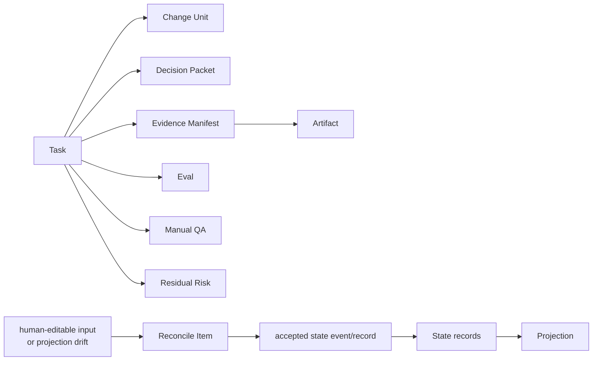
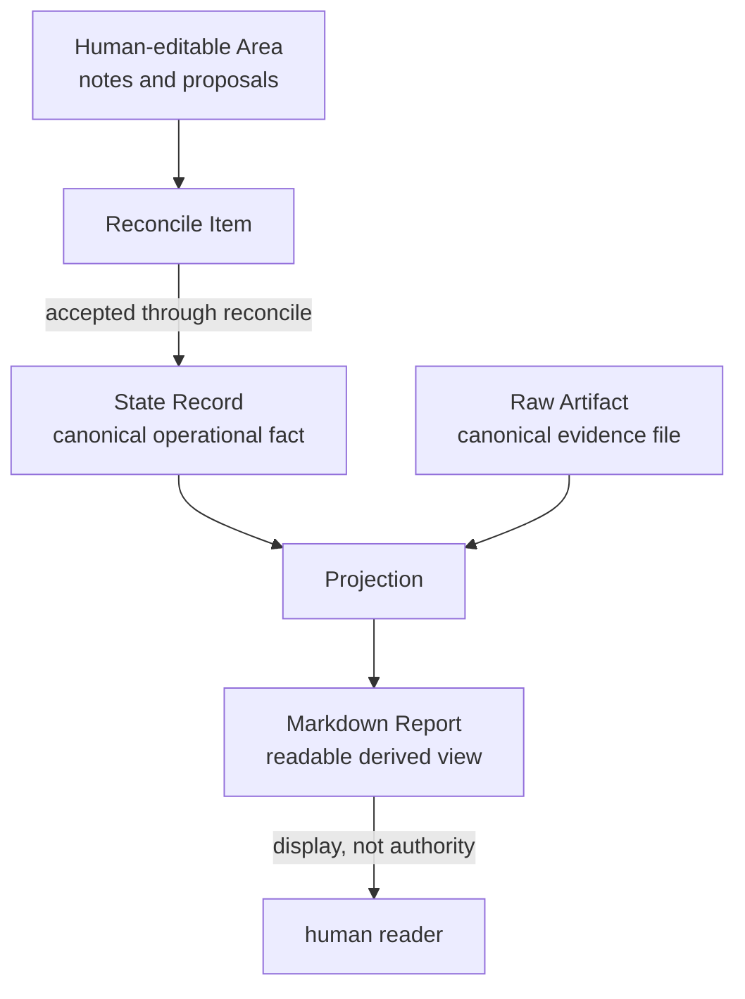
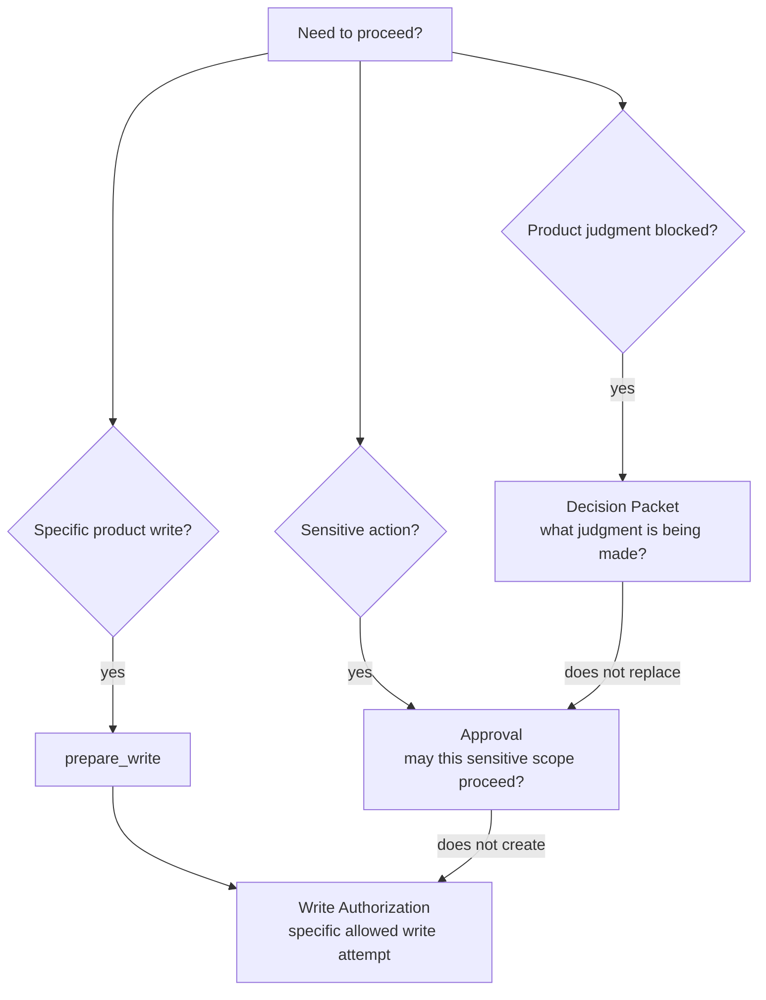

# Glossary

## Official Terms

These diagrams are reader maps only. The definitions below and the linked owner documents remain canonical.



Source-of-truth terms keep operational state, raw evidence, projections, and human input distinct.



Approval, Decision Packets, and Write Authorization answer different questions.



### Agency Conformance

The degree to which harness behavior, projections, validators, and close decisions preserve the user's Strategic Agency. Agency conformance checks whether the work journey is followable, product judgment is explicit, autonomy boundaries are respected, Decision Packets exist for blocking product judgment, and residual risk is visible before acceptance.

### Acceptance

The user's judgment that the result and remaining trade-offs are acceptable. Acceptance is separate from approval, assurance, verification, and Manual QA.

### Acceptance Gate

The kernel gate for required user acceptance. Its value set and compatibility meaning are owned by [Acceptance Gate](03-kernel-spec.md#acceptance-gate). Acceptance cannot substitute for QA or verification.

MVP final acceptance is recorded through a Decision Packet user decision, `task_gates.acceptance_gate`, and `state.sqlite.task_events`; there is no separate acceptance record or table.

### Approval

A prior user decision allowing a sensitive change to proceed within a defined scope. Approval is bound to paths, tools, commands or command classes, network targets, secret scope, baseline, sensitive categories, and expiry conditions. When approval is requested, Core captures the user judgment through an approval-shaped Decision Packet and linked Approval record; granted approval still requires a later compatible `prepare_write` result before any Write Authorization exists.

### Approval Gate

The kernel gate for sensitive-change approval. It is required only when sensitive categories are present. Granted approval does not prove correctness, imply acceptance, resolve product judgment, or create Write Authorization.

### Artifact

A recorded output used for evidence, recovery, or audit. See Raw Artifact for the canonical evidence-file boundary.

### Artifact Reference

A structured pointer to a raw artifact file registered in the artifact store, including identity, kind, URI or path, hash, size, content type, redaction state, and task/run relationship. In the reference MVP, artifact refs and `artifact_links` are Task-scoped. Artifact kinds such as `bundle`, `manifest`, or `export_component` describe files; owner links still point to existing state or Task-scoped projection records.

### Autonomy Boundary

The Change Unit semantics that record the product-judgment boundary inside which an agent may proceed without asking for additional user judgment. It is not a scope grant and does not authorize paths, tools, commands, network targets, secret access, or sensitive categories outside the active Change Unit. A Decision Packet may authorize updating the Autonomy Boundary or proposing a Change Unit update, but the resulting write still requires compatible scope and approval when sensitive categories apply.

### Assurance

The technical confidence level supported by recorded checks and verification independence.

```text
none | self_checked | detached_verified
```

An Eval verdict alone does not upgrade assurance. `detached_verified` requires passed verification with valid independence and no same-session self-review violation.

### Baseline

A captured repository state used to judge scope, approval drift, evidence freshness, and verification validity.

### `tree_hash`

The deterministic hash of a baseline file snapshot, computed from sorted NFC-normalized relative POSIX paths after ignored paths are excluded, with file bytes, size, executable bit, and symlink target handling defined by the Reference MVP.

### Capability Profile

A declared and verified description of what a connected agent surface can actually do. It records target profile, support tier, guarantee level, supported features, risks, fallbacks, and last verification time. The harness does not infer capability from product name alone.

### Capability Tier

A coarse integration level for a connected surface.

```text
T0 Context | T1 Skill | T2 MCP | T3 Capture |
T4 Guard | T5 Isolation | T6 QA Capture
```

Capability tiers describe available integration support; they are not kernel gates.

### Change Unit

The scoped implementation unit that bounds product writes. A product write requires an active Change Unit whose scope covers the intended paths, tools, commands, network targets, and sensitive categories, but the Change Unit does not itself authorize the write. Core allows the write through `prepare_write` and applicable gates.

### Close Reason

The canonical reason a Task reached a terminal close state.

```text
none | completed_verified | completed_self_checked |
completed_with_risk_accepted | cancelled | superseded
```

### Codebase Stewardship

The responsibility to preserve the product codebase as a durable asset. It includes attention to domain language, module boundaries, interface contracts, dependency direction, testability, maintainability, and future-change risk.

### Common Tool Envelope

The shared fields carried by public MCP tool calls: `request_id`, `idempotency_key`, `expected_state_version`, `project_id`, optional `task_id`, `surface_id`, optional `run_id`, `actor_kind`, and `dry_run`.

### Cooperative Guarantee

A guarantee level where the agent surface is expected to follow harness instructions and MCP decisions. The harness can guide behavior, but the surface may not provide hard pre-execution enforcement.

### Connector Manifest

A generated manifest that records connector-managed files, managed block hashes, capability profile, surface target profile, and drift status. It prevents generated surface files from being silently overwritten.

### Context Hygiene

The policy of keeping current state, evidence, and relevant references in context while avoiding stale chat, old PRDs, closed issues, and oversized raw artifacts unless they are explicitly needed.

### Context Index

A later read-only context provider that may surface relevant projections, artifact refs, repo files, docs, or notes. Indexed or retrieved context must not authorize writes, resolve Decision Packets, grant approval, satisfy gates, create evidence, perform or record verification, record QA, waive QA or verification, accept residual risk, accept the result, upgrade assurance, enqueue or refresh projections, change projection freshness, declare implementation readiness, or close Tasks.

### Decision Gate

The Task-level aggregate gate for blocking product judgment before progress, write, or close can continue. The canonical field is `decision_gate`; its value set and recompute rule are owned by [Decision Gate](03-kernel-spec.md#decision-gate). It is recomputed from relevant blocking Decision Packets and detected blockers, and it does not substitute for approval, verification, Manual QA, or acceptance.

### Decision Packet

A recorded decision-support packet for blocking product judgment. It names the decision needed, options, recommendation when available, trade-offs, affected scope, evidence, residual risk, owner, status, and next action. Decision Packet record IDs use `DEC-*`. Its record-level status is owned by [Decision Gate Aggregate Recompute](03-kernel-spec.md#decision-gate-aggregate-recompute) and the public `DecisionPacket` schema; relevant statuses feed the Task-level `decision_gate`. Its canonical form is kernel state. MVP visibility is required through Task/status/next/judgment-context and decision-packet surfaces; standalone `DEC` Markdown renderings are optional projections or proposal surfaces unless enabled.

### Decision Request

Optional routing, interaction, idempotency replay, or legacy handoff metadata that may point to a canonical Decision Packet. A minimal MVP implementation may omit it. A Decision Request is not decision authority, never satisfies `decision_gate`, approval, acceptance, waiver, residual-risk acceptance, or close by itself, and is only relevant to gate aggregation through a linked compatible `decision_packet_id`.

### Design Gate

The kernel gate for required design-quality preconditions such as shared design, domain language, TDD trace, module/interface review, or other policy-pack requirements.

### Design-Quality Policy Pack

The owner document for design-quality policy contracts and severity composition. It covers shared design, decision quality, autonomy boundary, domain language, vertical slice, feedback loop, TDD trace, module/interface review, codebase stewardship, Manual QA, and context hygiene. It influences gates, validators, evidence, write blockers, and close blockers but does not redefine the kernel state machine.

### Detached Verification

Verification performed across a meaningful independence boundary, such as a fresh session, fresh worktree, sandbox, or manual evaluator bundle. Same-session self-review is not detached verification, and subagent context is not detached by default.

### Detective Guarantee

A guarantee level where the harness can detect violations and mark state blocked, stale, partial, or failed after observation.

### Direct

A work mode for small, low-risk changes with obvious scope and result. Direct product writes still require an active scoped Change Unit.

### Docs-Maintenance Conformance

A read-only documentation maintenance check profile that detects drift in bilingual parity, links, owner boundaries, stable catalogs, glossary terms, source-of-truth phrasing, TODO usage, and non-owner duplicate contracts. Its rule bodies are owned by the Authoring Guide, and operator reporting and entrypoint expectations are owned by Operations And Conformance. It is not Core fixture conformance, a runtime validator, projection refresh, QA, acceptance, evidence, residual-risk acceptance, or a canonical state transition. If exposed through `harness conformance run` or another operator command, it is a separately selected docs-only profile, conventionally `docs-maintenance`, whose console or ephemeral result does not affect runtime fixture pass/fail, implementation readiness, close readiness, or Task state.

### Domain Language

The product's canonical vocabulary and meanings. The canonical source is `domain_terms`; Markdown domain-language documents are projections and proposal surfaces.

### Domain Term

A canonical structured record in `domain_terms` that stores a product term, meaning, code representation, related terms, source, status, and boundaries such as "not this." Public state refs use `record_kind=domain_term`.

### Evidence

Recorded support for claims about the work, such as diffs, logs, tests, run summaries, screenshots, Eval records, or Manual QA records.

### Evidence Gate

The kernel gate for required evidence coverage. Its value set and close meaning are owned by [Evidence Gate](03-kernel-spec.md#evidence-gate).

### Evidence Manifest

A state record mapping acceptance criteria or completion conditions to supporting evidence references.

### Evidence Profile

A named evidence sufficiency profile, such as `advisor`, `direct docs-only`, `direct code`, `work feature`, `UI/UX/copy work`, `sensitive work`, or `verification-required work`, that tells validators what evidence is enough for the task shape.

### Evidence Sufficiency

The close-relevant judgment that required acceptance criteria or completion conditions are supported by the Evidence Manifest plus related state records and artifact refs. It is not judged from chat text or Markdown report prose alone.

### Eval

A verification result record with verdict, checks performed, evidence reviewed, independence qualifier, blockers, and artifact references.

### Feedback Loop

A canonical support record and recorded path from checks and findings back into state, scope, design, evidence, follow-up work, or close status. Inputs can include tests, typecheck, lint, build, browser smoke, TDD red/green/refactor traces, Manual QA, Eval findings, user decisions, operational findings, and residual-risk decisions. Public refs use `StateRecordRef.record_kind=feedback_loop`; public mutation uses `FeedbackLoopUpdate` on `record_run` or a Manual QA execution link. Feedback loops keep findings from vanishing into chat.

### Fixture Assertion Semantics

The conformance comparison rules that say how `expected_state`, `expected_events`, `expected_artifacts`, `expected_projection`, and `expected_error` are matched against captured Core results. They are owned by operations and conformance, live outside the fixture body, and do not allow prose-only matching to pass a fixture.

### Fresh Session

A verification independence profile where the evaluator starts from a task/evidence bundle rather than continuing the lead chat context, reviews the Evidence Manifest and changed files, and records an Eval.

### Fresh Worktree

A verification independence profile where the evaluator checks baseline, changed paths, artifacts, and Evidence Manifest in a separate worktree or equivalent isolated repository state.

### Freeze

A user-facing safety control that requests a hold or narrower posture around current work. Freeze can hold product writes, make the next action stricter, or cause `prepare_write` to block or hold when existing scope is incompatible. It does not directly mutate Change Unit scope, allowed paths, Autonomy Boundary, AFK stop conditions, or related owner records; persistent owner-record changes still use the existing Core state-changing path, Decision Packet route, or owner-record update path. Freeze does not create Write Authorization, approval, evidence, verification, QA, acceptance, residual-risk acceptance, close, or a new authority tier.

### Gate

A canonical kernel field that controls whether a Task may write, proceed, or close. Gates are state, not display text.

### Generated File

A repository file or managed block produced by a connector, projector, or operator tool. Generated files must be tracked by a manifest or projection job when they can drift from canonical state.

### Guarantee Display

The user-facing and connector-facing display of the actual guarantee level for a status or write decision, including limitation notes when enforcement is cooperative or detective.

### Guarantee Level

The strength of enforcement available for a connected surface or runtime path.

```text
cooperative | detective | preventive | isolated
```

Capability affects validator results, blocked reasons, and display; it is not a kernel gate.

### Guard

A user-facing safety control that applies the connected profile's actual enforcement or detection layer. Guard may be cooperative, detective, preventive, or isolated; the name does not imply pre-execution blocking unless a proven `T4` path covers the operation.

### Harness Core

The runtime component that owns state transitions, gate updates, validator interpretation, artifact registration, projection job enqueueing, and close decisions.

### Harness Runtime Home

The local runtime storage area that contains `registry.sqlite`, per-project `project.yaml`, per-project `state.sqlite`, and artifact directories.

### Human-editable Area

A Markdown area where a human can write notes, proposals, questions, or corrections. It is an input surface, not canonical state. Its authority path is `human-editable input -> reconcile_items -> accepted state event/record`.

### Implementation Micro-Plan

A managed `TASK` projection section that shows small execution steps or slices, their purpose, active Change Unit scope alignment or likely paths, selected feedback loop or TDD status when relevant, expected evidence, and stop conditions. It is an execution aid, not canonical state, not a `ProjectionKind`, not scope authority, not approval, and not Write Authorization. Editing its text does not mutate state except through an accepted reconcile outcome or Core state-changing action.

### Isolated Guarantee

A guarantee level where risky work is separated by a worktree, sandbox, process boundary, or equivalent isolation mechanism.

### Journey Card

A compact human-readable projection of the current Task position: state, next action, scope, blockers, the `decision_gate`, evidence, verification, QA, acceptance, residual risk, and projection freshness. A Journey Card is display, not canonical state.

### Journey Spine

The state-derived continuity model for a Task's ordered work journey. It is reconstructed from Task, Change Unit, Run, Decision Packet, Approval, Evidence Manifest, Eval, Manual QA, Residual Risk, `task_gates.acceptance_gate`, acceptance Decision Packet user-decision state, close events, artifact references, and `state.sqlite.task_events`, not from chat memory. Journey Card and Journey Spine Markdown views are projections.

### Journey Spine Entry

A canonical support record for durable continuity annotations that cannot be fully reconstructed from existing state events or owner records. Journey Spine Entry records supplement the Journey Spine; they do not replace Task, Change Unit, Run, Decision Packet, Residual Risk, evidence, verification, QA, acceptance gate/decision state, close state/events, artifact, or event authority.

### Interface Contract

The canonical record of a module or external boundary's public interface, inputs, outputs, errors, compatibility impact, callers, and boundary tests. The canonical source is `interface_contracts`. Public state refs use `record_kind=interface_contract`.

### JSON `TEXT` Field

A SQLite `TEXT` column whose stored value is JSON. The `TEXT` type is MVP storage flexibility only; Core must validate the value before commit against the API-owned or storage-owned shape, and malformed or schema-incompatible JSON is invalid state.

### Local Derived Metrics

Later diagnostic-only metrics derived from local records such as `state.sqlite.task_events`, runs, validator results, projection jobs, and reconcile items. Metric readouts may report rates, counts, durations, or guard-trigger summaries, but they must not mutate state, satisfy gates, authorize writes, grant approval, create evidence, enqueue or refresh projections, change projection freshness, change close readiness or implementation readiness, perform or record verification, record QA, waive QA or verification, accept residual risk, accept the result, upgrade assurance, or close Tasks.

### Manual QA

Human inspection of experiential product quality such as UX, workflow, copy, visual output, accessibility, and product fit.

### Manual Bundle

A verification handoff package for a human or separate evaluator. It includes task summary, acceptance criteria, Change Unit scope, approval scope, diff/log/test artifacts, Evidence Manifest, known risks, and enough context to record an Eval verdict.

### Manual QA Record

A record-level Manual QA result, including performer, profile, result, artifacts, findings, waiver reason when applicable, and next action. Its result value set is owned by [QA Gate](03-kernel-spec.md#qa-gate) and [`harness.record_manual_qa`](05-mcp-api-and-schemas.md#harnessrecord_manual_qa). Pending required QA is represented by `qa_gate=pending`; it is not a Manual QA record result.

### `managed_hash`

The drift-detection hash of the projector-owned managed block body, excluding `HARNESS:BEGIN` and `HARNESS:END` marker lines. It is not canonical state and does not make a Markdown projection authoritative.

### Managed Block

A Markdown block delimited by harness markers and regenerated by the projector from state records and artifact refs. Direct edits to a managed block create drift or reconcile candidates; they do not become state by themselves.

### MCP Resource

A read-only MCP surface for current project, task, design, policy, status, or bundle information. Resources do not mutate state.

### MCP Server Unavailable

`MCP_SERVER_UNAVAILABLE` is the diagnostic condition where a tool call cannot reach Core. No authoritative Core response is possible, and the caller must diagnose or reconnect before claiming state changes. The stable public error code remains `MCP_UNAVAILABLE`.

### Surface MCP Unavailable

`SURFACE_MCP_UNAVAILABLE` is the diagnostic condition where Core or an operator can observe that the connected surface lacks usable MCP, has stale MCP configuration, or cannot call required MCP tools. Product writes are held by instruction on cooperative surfaces or blocked by stronger guards when available. Core responses may use `MCP_UNAVAILABLE` or `CAPABILITY_INSUFFICIENT` with `details.mcp_unavailable_kind`; the diagnostic label is not a public `ErrorCode` value.

### MCP Tool

A public MCP operation that asks Core to validate, record, transition, or close state. State changes must go through tools or reconcile actions, not resource reads.

### Markdown Report

A human-readable document generated from state records and artifact references. A Markdown report is not a raw artifact by default and does not become canonical state.

### Module Map

The product's map of modules, responsibilities, public interfaces, dependency direction, internal complexity, test boundaries, owner decisions, and watchpoints. The canonical source is `module_map_items`.

### Module Map Item

A canonical structured record in `module_map_items` that stores a module's role, public interface, dependencies, internal complexity, test boundary, owner decision, and watchpoints. Public state refs use `record_kind=module_map_item`.

### Policy Contract

The standard form used by design-quality policies: `name`, `applies_when`, `default_requirement`, `allowed_waiver`, `required_record`, `validator`, `evidence`, and `close_impact`.

### Preventive Guarantee

A guarantee level where the harness or connector can block a violating action before it executes.

### Projection

A human-readable rendering of canonical state records and artifact references. Projection is useful for reading and decision-making, but it cannot override canonical state.

### ProjectionKind

The API enum for projection job and template kinds. Tiers, values, and extension rules are owned by [Shared Schemas](05-mcp-api-and-schemas.md#shared-schemas). No ProjectionKind makes a projection canonical state.

### Projection Freshness

The relationship between a projection and its source records, managed hash, artifact refs, and projection job state. Its value set is owned by [MCP API And Schemas](05-mcp-api-and-schemas.md) and [Document Projection](07-document-projection.md).

### Projection Job

A durable outbox record that asks the projector to render a Markdown projection from committed state records and artifact refs. `record_kind=projection` identity is `projection_jobs.projection_job_id`; project-level projection jobs do not by themselves create project-scoped artifact links in the MVP artifact DDL.

### QA Gate

The canonical kernel gate for required Manual QA. `manual_qa_record.result` is record-level; `qa_gate` is the close-relevant aggregate state. `qa_gate=pending` means required QA has not yet produced a satisfying Manual QA record, or the latest relevant Manual QA record does not satisfy policy.

### Raw Artifact

A durable evidence file in the artifact store, such as a diff, log, bundle, screenshot, checkpoint, or manifest file. Raw artifacts are distinct from state records and Markdown reports.

### Reconcile

The process that turns human-editable input or projection drift into an accepted state change, rejected proposal, note, decision, or deferred item.

### Reconcile Item

The canonical candidate record created from human-editable input or projection drift before a reconcile decision accepts, rejects, converts, or defers it.

### Reference Surface

The single agent surface targeted by the MVP implementation. It demonstrates the kernel and connector contract without implying broad MVP surface support.

### Recommended Playbook

Non-authoritative status/next display guidance computed from current state and policy/playbook context. It suggests a procedure for the current stage, such as review, TDD, QA, guard check, release handoff, or browser-QA candidacy. Its `playbook_id` is a stable display/routing string identifier, not a Core-owned closed enum or DDL-backed value set. It is not a canonical kernel record, has no DDL table, task event, or projection job of its own, does not authorize writes or satisfy gates, and routes product judgment to Decision Packet paths.

### Release Handoff

An optional report/export profile that summarizes release readiness for external PR, review, deployment, rollback, and monitoring processes. It includes close readiness, blockers, evidence refs, verification refs, Manual QA refs, residual-risk refs, changed files, projection freshness, redaction notes, and suggested checklist items. It is not deployment authority, merge authority, approval, evidence, verification, QA, acceptance, residual-risk acceptance, assurance upgrade, production monitoring, or Task close.

### Role Lens

A non-authoritative skill or playbook surface that lets a user ask for a product, engineering, design, security, QA, or release-handoff review posture. Role Lens output reuses existing routes such as `RecommendedPlaybook`, `DecisionPacketCandidate`, validator/evidence/Manual QA/residual-risk candidates, and release handoff input. It is not write authority, approval, evidence, verification, QA waiver, risk acceptance, final acceptance, close, or assurance upgrade.

### Report Projection

A Markdown report generated from state records and artifact references, such as a Task report, approval report, run summary, evidence manifest report, Eval report, or direct-result report.

The named report projection kinds are projections generated from state records and artifact refs; evidence-file authority stays with registered artifact files.

### Review Stages

A managed display/procedure split that separates Spec Compliance Review from Code Quality / Stewardship Review. Spec Compliance Review asks whether the requested work is complete under current Harness authority. Code Quality / Stewardship Review asks whether the implementation is maintainable inside the codebase. Review Stages can route findings to validator results, evidence gaps, Decision Packet candidates, Change Unit update recommendations, residual-risk candidates, or close blockers, but they are not canonical records, new `ProjectionKind` values, approval, evidence, verification, QA, acceptance, risk acceptance, close, or Write Authorization. Same-session Review Stages do not create `detached_verified` assurance.

### `request_hash`

The idempotency hash of a tool request, computed from canonical UTF-8 JSON covering `tool_name`, the schema-normalized request body, and the envelope fields other than `request_id` and `idempotency_key`.

### Residual Risk

A canonical close-relevant support record for known remaining uncertainty, trade-off, limitation, or unchecked condition after evidence, verification, QA, and acceptance work. It records source refs, affected scope, related Decision Packet when applicable, visibility status, accepted risk when applicable, follow-up requirement, and close impact. Residual risk must remain visible when it affects close, and user acceptance of risk does not create detached verification. Accepted risk is metadata/state on the Residual Risk record in MVP, not a separate `accepted_risk` state record.

### Risk Accepted Close

A successful close where the user accepts close-relevant residual risk, including verification risk when verification was waived. It uses `close_reason=completed_with_risk_accepted` and must not display `assurance_level=detached_verified`.

### Run

An execution attempt by an agent, evaluator, operator, or other actor against a Task and optionally a Change Unit. Runs record baseline, surface, observed changes, commands, artifacts, and summary. A rejected pre-commit `record_run` request is not a Run and must not receive a fabricated Run ID; an audit or violation attempt becomes a Run only when Core deliberately commits it.

### Scope Gate

The kernel gate requiring product writes to be covered by an active scoped Change Unit. Scope is required for write-capable direct and work modes even when approval is not required.

### Severity Composition

The policy-owned rule for merging multiple applicable task-shape defaults, policy contracts, and validator findings. The same concern is the same policy-relevant target, not the whole Task or merely the same validator ID. The rule keeps all findings visible, preserves impacts across different affected gates or blocker targets, and uses the strongest applicable impact only for competing impacts on the same concern. It affects validators, gates, write blockers, close blockers, waivers, and Decision Packet needs, while public primary `ToolError` selection remains API-owned.

### Shared Design

The minimum recorded shared understanding of a task before implementation hardens into a plan: goal, scope, non-goals, acceptance criteria, assumptions, decisions, rejected options, domain/module/interface impact, and first Change Unit shape. Markdown renderings of Shared Design are projections and proposal surfaces.

### Source-of-truth

The authoritative source for a fact. In the harness, operational state is canonical in `state.sqlite` current records plus `state.sqlite.task_events`; raw evidence is canonical in the artifact store; Markdown documents are projections.

### `state.sqlite.task_events`

The append-only event history table inside `state.sqlite`. MVP does not use a separate event store. Deterministic order is `task_events.event_seq`, not timestamps or event IDs.

### Stable Event Catalog

The kernel-owned compact list of `task_events.event_type` names that MVP conformance fixtures may assert in `expected_events`. It classifies stable event names separately from prose examples, fixture shorthand, non-stable implementation-local detail or audit events, validator IDs, Core check names, projection status shorthands, and future extension events.

### State Record

A canonical structured record in kernel state, such as a Task, Change Unit, Decision Packet, Journey Spine Entry, Residual Risk, Run, Approval, Write Authorization, Evidence Manifest, Eval, Manual QA record, Artifact record, Shared Design record, Domain Term, Module Map Item, Interface Contract, Feedback Loop, TDD Trace, or Reconcile Item.

### State Version

An optimistic-concurrency clock for a Core-resolved state scope. Core resolves the primary Task from the envelope, tool-specific input, or active Task when one applies. `expected_state_version`, `ToolResponseBase.state_version`, `EventRef.state_version`, and `task_events.state_version` are interpreted by that affected scope, not as one global event-store sequence.

### Project State Version

The project-scoped state clock stored in `project_state.state_version`. Project-scoped mutations with no Core-resolved primary Task compare `expected_state_version` against this value and return the resulting value as the primary response `state_version`.

### Task State Version

The task-scoped state clock stored in `tasks.state_version`. Task-scoped mutations compare `expected_state_version` against the Core-resolved primary Task's value and return the resulting value as the primary response `state_version`.

### Strategic Agency

The user's durable authority to understand the work journey and make or withhold judgment over goals, scope, design, trade-offs, codebase stewardship, QA, acceptance, and residual risk. The harness preserves Strategic Agency by making state, decisions, evidence, blockers, and remaining risk explicit outside chat.

### Surface Capability Check

A validator that reports whether a connected agent surface can satisfy required harness behavior. It affects blocked reasons and guarantee display, but it is not a kernel gate.

### Surface Cookbook

The appendix that contains surface-specific connector notes, generated file details, and profile examples. Common integration rules belong in the agent integration document, not the cookbook.

### Subagent Context

A verification independence profile where a subagent or helper reviews work with some inherited implementation context. It is not detached by default and can qualify only when stricter profile metadata proves a real independence boundary.

### Task

The user value unit tracked by the kernel. It carries mode, lifecycle phase, gates, result, close reason, assurance, current summary, decisions, evidence, and projection status.

### TDD Trace

A record of red, green, and refactor evidence for a Change Unit or behavior slice, or a recorded non-TDD justification where policy allows it. A RED target or plan describes the intended failing check; RED evidence means an actual failing test artifact/log/result or another explicit policy-recognized failing-check evidence. When required, the normal path records RED evidence before non-test implementation writes, GREEN evidence after implementation, and refactor/check evidence when relevant, then links the trace to Evidence Manifest coverage. TDD Trace can be execution evidence for a Feedback Loop, but it is not the canonical selected-loop record; a waiver must point back to the alternate Feedback Loop that will prove behavior.

### Verification

The process of checking whether the result satisfies the relevant criteria. Verification is separate from approval, Manual QA, and acceptance.

### Verification Gate

The kernel gate for required verification. A user waiver sets `verification_gate=waived_by_user`; it does not create `detached_verified` assurance.

### Verification Independence Profile

A named minimum qualification for an Eval independence context, such as `same_session`, `subagent_context`, `fresh_session`, `fresh_worktree`, `sandbox`, or `manual_bundle`. A passed Eval must satisfy a valid profile before it can support `detached_verified`.

### Validator Result

A structured result from a validator, including status, guarantee level, target, findings, blocked reasons, and suggested next action.

### Vertical Slice

A Change Unit shape that connects a thin path from trigger/input through domain logic, persistence or state, caller/API boundary, observable output, tests, and optional Manual QA.

### Waiver

An explicit recorded exception to a gate requirement where policy allows it. Verification waiver, design waiver, and QA waiver are allowed under defined rules. Scope, sensitive approval, required evidence, and required acceptance are not waived for successful completion.

### Write Authorization

A durable state record created by `prepare_write` for a specific allowed write attempt. It records `basis_state_version`, the affected-scope state version used as the compatibility basis for replay, stale detection, and audit. Distinct compatible `prepare_write` requests create distinct authorizations; idempotent replay may return the committed response. It is single-use for a committed implementation or direct run, and it does not replace scope, approval, evidence, verification, Manual QA, acceptance, or residual-risk visibility.

### Write Authorization Lifecycle Events

The stable event-name set for Write Authorization creation, return, consumption, expiry, staling, revocation, and violation detection. The exact vocabulary and its relationship to `scope_violation_detected` are owned by the [Kernel Stable Event Catalog](03-kernel-spec.md#stable-event-catalog).

### Write Authority Summary

A user-facing display summary of current write authority for an intended operation, derived from active Change Unit scope, `prepare_write`, approval, baseline, guarantee, Decision Packet refs, and any Write Authorization ref. It is display, not a separate authority record, and it does not authorize work by itself.
