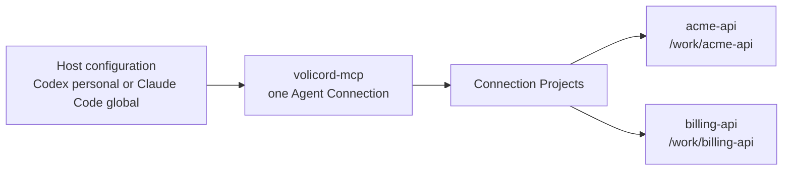

# Multi-Repository Agent Setup

Use this guide when one host-level Agent Connection should serve more than one
explicitly connected `Product Repository`.

This guide is operator workflow. Exact Agent Connection, project-selection, and
transport behavior belongs to [Agent Connection](../reference/agent-connection.md)
and [MCP Transport](../reference/mcp-transport.md).

## Topology



One host entry starts one `volicord-mcp` process for one Agent Connection. That
connection can route only to repositories explicitly connected to it. Adding one
repository does not grant access to every project registered in the Runtime
Home.

This topology fits host-level configuration:

- Codex personal connection: `volicord connect codex`
- Claude Code global connection: `volicord connect claude-code --global`

Project-shared and host-local connections remain single-repository flows.

## Connect The First Repository

From the first product repository:

```sh
cd /work/acme-api
volicord connect codex
volicord connection status codex
```

For Claude Code global configuration:

```sh
cd /work/acme-api
volicord connect claude-code --global
volicord connection status claude-code --global
```

The command detects the Git repository root, registers or reuses the repository
project, derives the visible project name from the repository directory, and
stores internal registry identities in the Runtime Home.

## Add Another Repository

Run the same host and intent from the second repository:

```sh
cd /work/billing-api
volicord connect codex
volicord connection status codex
```

Or select it explicitly:

```sh
volicord connect codex --repo /work/billing-api
volicord connection status codex --repo /work/billing-api
```

For the same host-level target, Volicord reuses the matching Agent Connection
and adds the selected repository to Connection Projects. It does not require the
operator to handle the internal connection identity.

## Inspect The Connection

```sh
volicord connections
volicord connection verify codex
volicord connection status codex --repo /work/acme-api
volicord connection status codex --repo /work/billing-api
```

If verification reports `action_required`, complete the named host-owned trust,
approval, reload, restart, or setup repair action and rerun verification. For
symptom-specific recovery, use [Agent Host Troubleshooting](agent-host-troubleshooting.md).

## What The Agent Should Do

When a user asks which repositories are available, the agent calls:

```json
{"name":"volicord.list_projects","arguments":{}}
```

The MCP result lists only projects connected to the bound Agent Connection. Once
more than one project is connected, a public Volicord method call that targets
one repository must include an explicit `project_selector` returned by
`volicord.list_projects`:

```json
{
  "name": "volicord.status",
  "arguments": {
    "project_selector": "billing-api",
    "detail": "workflow"
  }
}
```

The agent must not invent a project from folder names, current working
directory, MCP roots, host labels, repository labels, or memory. If a call
without `project_selector` is rejected as ambiguous, call
`volicord.list_projects`, choose the intended project, and retry with the
returned value. Public MCP tool arguments do not require or accept Core request
metadata such as `request_id`, `idempotency_key`, `expected_state_version`,
`dry_run`, or `locale`.

## Remove One Repository

From the repository to remove:

```sh
cd /work/billing-api
volicord connection remove codex --dry-run
volicord connection remove codex
```

Or select it explicitly:

```sh
volicord connection remove codex --repo /work/billing-api --dry-run
volicord connection remove codex --repo /work/billing-api
```

Removing one repository removes that repository's Connection Projects
membership. It does not delete the `Product Repository`, project registration,
project state, Core task/evidence/run/artifact records, or unrelated host
configuration. If other connected repositories remain, the host entry remains.
If none remain, Volicord removes the matching managed host configuration when
ownership and safety checks permit it.

## Boundaries

- Agent Connections access only explicitly connected repositories.
- Multiple connected repositories require explicit `project_selector` in public
  MCP tool calls unless the call is `volicord.list_projects`.
- A `Product Repository` is a product-file boundary and may contain selected
  shared host configuration, but it is not Core authority.
- `Write Check` is Core-state compatibility, not OS permission.
- Volicord does not provide OS sandboxing, filesystem ACLs, network policy, or
  secret isolation.
