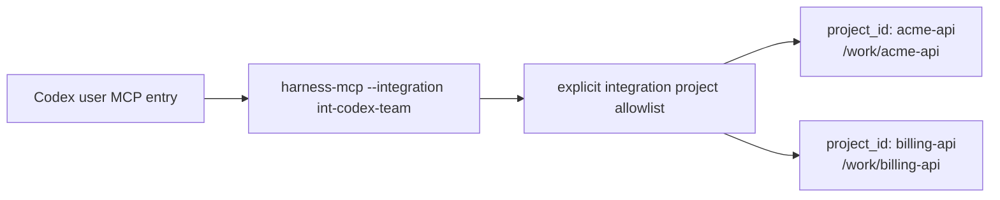

# Multi-repository agent setup

Use this guide when one user-scope integration should serve multiple explicitly allowed `Product Repository` registrations.

The baseline topology is:



There is one host MCP entry, one `harness-mcp --integration <integration_id>` process, one explicit allowlist, and multiple repositories selected per tool call. Adding a project does not grant every Runtime Home project. Removing access takes effect through registry state without requiring the host entry to be rewritten.

Project and local host scopes remain single-repository scopes. Use user scope for this topology.

## Install Product Repository A

```sh
/opt/harness/bin/harness agent install \
  --host codex \
  --scope user \
  --server-name harness-main \
  --integration-id int-codex-team \
  --project-id acme-api \
  --repo-root /work/acme-api \
  --default-project-id acme-api \
  --runtime-home /Users/alex/.harness \
  --mcp-command /opt/harness/bin/harness-mcp
```

This example pins `--server-name harness-main` so the host entry has a short predictable key. The option is not required; omitting it derives a stable name from `integration_id`.

The host config has one server entry:

```toml
[mcp_servers.harness-main]
command = "/opt/harness/bin/harness-mcp"
args = ["--integration", "int-codex-team"]

[mcp_servers.harness-main.env]
HARNESS_HOME = "/Users/alex/.harness"
```

## Add Product Repository B

```sh
/opt/harness/bin/harness agent project add \
  --integration-id int-codex-team \
  --project-id billing-api \
  --repo-root /work/billing-api \
  --runtime-home /Users/alex/.harness
```

Expected result:

```text
status: complete
allowed_projects:
  acme-api
  billing-api
verification_detail: project-specific startup preflight passed
```

Confirm the host still has one MCP server entry. The Codex config should still contain only `mcp_servers.harness-main` for this integration; it should not gain one server entry per project.

```sh
/opt/harness/bin/harness agent status \
  --integration-id int-codex-team \
  --runtime-home /Users/alex/.harness
```

Status should list both `acme-api` and `billing-api` under `allowed_projects`.

## What The Agent Should Do

When a user asks which repositories are available, the agent calls the adapter utility:

```json
{"name":"harness.list_projects","arguments":{}}
```

The MCP result contains text with a JSON object like:

```json
{
  "integration_id": "int-codex-team",
  "default_project_id": "acme-api",
  "projects": [
    {
      "project_id": "acme-api",
      "repo_root": "/work/acme-api",
      "available": true,
      "is_default": true
    },
    {
      "project_id": "billing-api",
      "repo_root": "/work/billing-api",
      "available": true,
      "is_default": false
    }
  ]
}
```

For Product Repository A, the agent supplies `project_id: "acme-api"` in the public method envelope:

```json
{
  "name": "harness.status",
  "arguments": {
    "envelope": {
      "project_id": "acme-api",
      "actor_kind": "agent",
      "request_id": "req_status_acme",
      "idempotency_key": null,
      "expected_state_version": null,
      "dry_run": false,
      "locale": "en-US",
      "task_id": null
    },
    "include": {
      "task": true,
      "pending_user_judgments": true,
      "write_authority": false,
      "evidence": false,
      "close": true,
      "guarantees": true
    }
  }
}
```

For Product Repository B, the later call changes only the explicit project selector and request id:

```json
{
  "name": "harness.status",
  "arguments": {
    "envelope": {
      "project_id": "billing-api",
      "actor_kind": "agent",
      "request_id": "req_status_billing",
      "idempotency_key": null,
      "expected_state_version": null,
      "dry_run": false,
      "locale": "en-US",
      "task_id": null
    },
    "include": {
      "task": true,
      "pending_user_judgments": true,
      "write_authority": false,
      "evidence": false,
      "close": true,
      "guarantees": true
    }
  }
}
```

The agent must not guess a project ID from folder names, current working directory, MCP roots, host labels, or memory. If multiple projects are available and no explicit project or valid default is supplied, the adapter rejects the call before Core execution with actionable text like:

```text
project selection is ambiguous; call harness.list_projects and retry with envelope.project_id
```

## Defaults And Ambiguity

A valid explicit `default_project_id` lets the adapter route an omitted `project_id` to that default. Defaults are convenience, not authority. They must name an allowed project and can become unavailable if that project is inactive or execution-ineligible.

When the user's request names a repository, the agent should still use the matching `project_id` explicitly. Explicit project selection is clearest in multi-repository work and prevents accidental work against the default project.

Set or change the default without rewriting host configuration:

```sh
/opt/harness/bin/harness agent project default set \
  --integration-id int-codex-team \
  --project-id billing-api \
  --runtime-home /Users/alex/.harness
```

Expected result:

```text
status: complete
prior_default_project_id: acme-api
resulting_default_project_id: billing-api
```

If the default is cleared while multiple projects remain available, omitted `project_id` calls become ambiguous. The agent should call `harness.list_projects` and retry with an explicit `envelope.project_id`.

## Remove Projects And Re-Add Later

After the default has moved to `billing-api`, Product Repository A is only a formerly default project. Remove it while retaining the integration and host MCP entry:

```sh
/opt/harness/bin/harness agent project remove \
  --integration-id int-codex-team \
  --project-id acme-api \
  --runtime-home /Users/alex/.harness
```

Expected result:

```text
status: complete
allowed_projects:
  billing-api
verification_detail: project membership removed; host configuration was not rewritten
```

To remove the final remaining project, clear the default first if it still names that project, then remove the membership:

```sh
/opt/harness/bin/harness agent project default clear \
  --integration-id int-codex-team \
  --runtime-home /Users/alex/.harness

/opt/harness/bin/harness agent project remove \
  --integration-id int-codex-team \
  --project-id billing-api \
  --runtime-home /Users/alex/.harness
```

Expected result:

```text
status: complete
allowed_project_count: 0
not executable until one is added
```

After removal, `harness.list_projects` exposes no projects for `int-codex-team`. The unchanged host entry still starts the same integration, and Host Installation inventory can remain, but public tool calls are not executable until a project is added again.

Observe the zero-project state:

```sh
/opt/harness/bin/harness agent status \
  --integration-id int-codex-team \
  --runtime-home /Users/alex/.harness
```

Expected status includes:

```text
allowed_project_count: 0
not executable
```

Add a project again without reinstalling the host entry:

```sh
/opt/harness/bin/harness agent project add \
  --integration-id int-codex-team \
  --project-id billing-api \
  --repo-root /work/billing-api \
  --runtime-home /Users/alex/.harness
```

If the re-added project should be the convenience default again, set it after adding it:

```sh
/opt/harness/bin/harness agent project default set \
  --integration-id int-codex-team \
  --project-id billing-api \
  --runtime-home /Users/alex/.harness
```

## Full Uninstall

Remove managed host configuration and managed guidance for the integration:

```sh
/opt/harness/bin/harness agent uninstall \
  --integration-id int-codex-team \
  --runtime-home /Users/alex/.harness \
  --allow-repository-write \
  --remove-managed
```

Uninstall removes only Harness-managed host configuration and managed guidance. It does not delete Product Repositories, Runtime Home data, project state, Core records, artifact storage, or unrelated host entries.

## Reference Links

- Exact host/scope and command behavior: [Administrative CLI](../reference/admin-cli.md)
- Exact Agent Integration Profile and project selection behavior: [Agent Integration](../reference/agent-integration.md)
- Exact `harness.list_projects` transport behavior: [MCP Transport](../reference/mcp-transport.md)
- Exact Product Repository write boundaries: [Runtime Boundaries](../reference/runtime-boundaries.md#explicit-integration-files-in-product-repositories)
