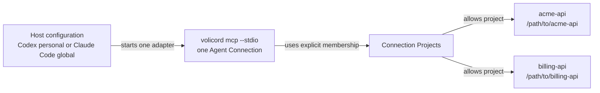

# Multi-Repository Agent Setup

Use this guide when one host-level Agent Connection should serve more than one
explicitly connected `Product Repository`.

This guide is operator workflow. Exact Agent Connection, project-selection, and
transport behavior belongs to [Agent Connection](../reference/agent-connection.md)
and [MCP Transport](../reference/mcp-transport.md).

This is not the default first-run path for one Product Repository. For ordinary
first-run setup, use [Agent Host Setup](agent-host-setup.md) and
`volicord init --host HOST --repo PATH --mode mcp-only`. Guarded setup has the
verified-hook or explicit degraded opt-in requirements described there. Use the
lower-level `volicord connect` commands here only when one host-level or global
host entry must route to more than one explicitly allowed repository.

## Topology

This topology map shows how one host entry can reach multiple explicitly
connected Product Repositories through a host-level Agent Connection. Arrows
show the configured binding and allowed membership relationships; they are not
request execution order and do not imply access to every project in the Runtime
Home.



One host entry starts one `volicord mcp --stdio` process for one Agent
Connection. That connection can route only to Product Repositories explicitly connected to it.
Adding one Product Repository does not grant access to every project registered
in the Runtime Home.

This topology fits host-level configuration:

- Codex personal connection: `volicord connect codex`
- Claude Code global connection: `volicord connect claude-code --global`

Project-shared and host-local connections remain flows for one Product
Repository.

The paths below are example Product Repository paths for repositories where you
want the agent to work.

## Connect The First Product Repository

Select the first Product Repository explicitly:

```sh
volicord connect codex --repo /path/to/acme-api
volicord connection status codex --repo /path/to/acme-api
```

For Claude Code global configuration:

```sh
volicord connect claude-code --global --repo /path/to/acme-api
volicord connection status claude-code --global --repo /path/to/acme-api
```

The command detects the Git repository root, registers or reuses the repository
project, derives the visible project name from the repository directory, and
stores internal registry identities in the Runtime Home.

## Add Another Product Repository

Run the same host and intent for the second Product Repository:

```sh
volicord connect codex --repo /path/to/billing-api
volicord connection status codex --repo /path/to/billing-api
```

The same rule applies when the current working directory is already inside the
Product Repository; using `--repo` keeps the membership target unambiguous.

```sh
volicord connect codex
volicord connection status codex
```

For the same host-level target, Volicord reuses the matching Agent Connection
and adds the selected Product Repository to Connection Projects. It does not require the
operator to handle the internal connection identity.

## Inspect The Connection

```sh
volicord connections
volicord connection verify codex
volicord connection status codex --repo /path/to/acme-api
volicord connection status codex --repo /path/to/billing-api
```

If verification reports `action_required`, complete the named host-owned trust,
approval, reload, restart, or installation-profile repair action and rerun
verification. For symptom-specific recovery, use
[Agent Host Troubleshooting](agent-host-troubleshooting.md).

## What The Agent Should Do

When a user asks which Product Repositories are available, the agent calls:

```json
{"name":"volicord.list_projects","arguments":{}}
```

The MCP result lists only projects connected to the bound Agent Connection. Once
more than one project is connected, a public Volicord method call that targets
one Product Repository must include an explicit `project_selector` returned by
`volicord.list_projects`:

```json
{
  "name": "volicord.status",
  "arguments": {
    "project_selector": "billing-api",
    "detail": "workflow"
  }
}
```

The agent must not invent a project from folder names, current working
directory, MCP roots, host labels, Product Repository labels, or memory. If a call
without `project_selector` is rejected as ambiguous, call
`volicord.list_projects`, choose the intended project, and retry with the
returned value. Public MCP tool arguments do not require or accept Core request
metadata such as `request_id`, `idempotency_key`, `expected_state_version`,
`dry_run`, or `locale`.

## Remove One Product Repository

From the Product Repository to remove:

```sh
cd /path/to/billing-api
volicord connection remove codex --dry-run
volicord connection remove codex
```

Or select the Product Repository explicitly:

```sh
volicord connection remove codex --repo /path/to/billing-api --dry-run
volicord connection remove codex --repo /path/to/billing-api
```

Removing one Product Repository removes that Product Repository's Connection
Projects membership. It does not delete the `Product Repository`, project registration,
project state, Core task/evidence/run/artifact records, or unrelated host
configuration. If other connected Product Repositories remain, the host entry
remains. If none remain, Volicord removes the matching managed host
configuration when ownership and safety checks permit it.

## Boundaries

- Agent Connections access only explicitly connected Product Repositories.
- Multiple connected Product Repositories require explicit `project_selector`
  in public MCP tool calls unless the call is `volicord.list_projects`.
- A `Product Repository` is a product-file boundary and may contain selected
  shared host configuration, but it is not Core authority.
- `Write Check` is Core-state compatibility, not OS permission.
- Volicord does not provide OS sandboxing, filesystem ACLs, network policy, or
  secret isolation.
