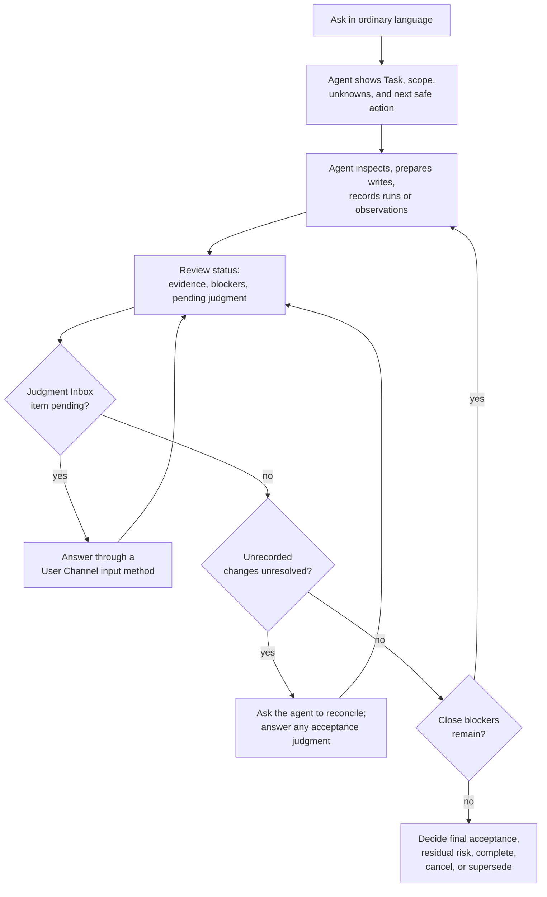
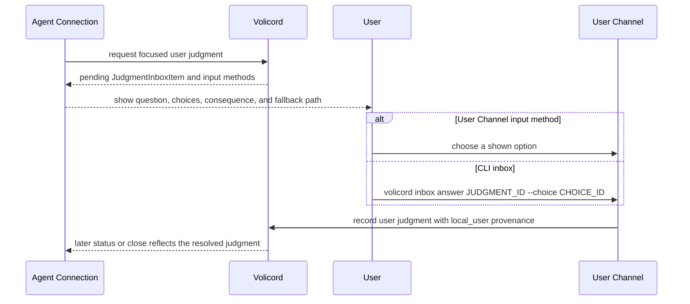
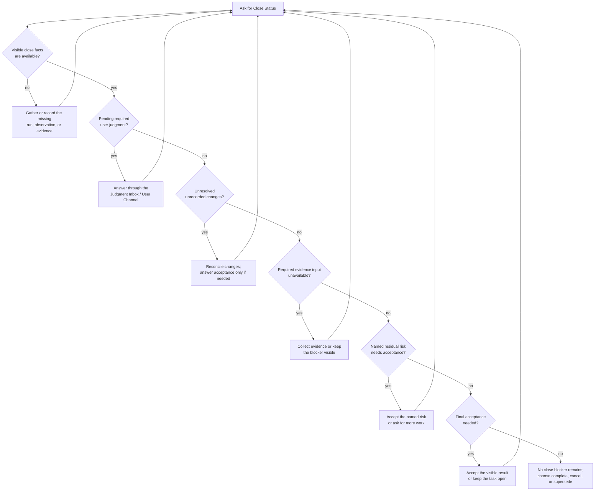

# User Guide

Volicord lets you work in ordinary language while keeping decision boundaries visible. Volicord is a local work authority record for AI-assisted product work. You decide the work and the risky calls. The agent should keep scope, User Judgment, Evidence, approvals, and Close Status separate instead of presenting inference as your decision.

This guide is the user workflow path. Exact API behavior, schemas, storage effects, security wording, and reference-level close rules live in the owners linked from the [Reference Index](../reference/README.md).

Guarantee limits stay with [Security](../reference/security.md). In this guide,
Write Tickets are not OS permission, code review approval, final acceptance, or
proof that a write occurred; Detective profile observations are signals, not
OS-level blocking; and Close Status is decision support, not proof of
correctness, test sufficiency, QA completion, deployment success, human review
completion, or risk-free completion.

## Daily workflow

Use this loop during normal work. It shows user-visible handoffs, not API call
order, storage effects, or host setup behavior.



The useful habit is to ask for status before large writes, after meaningful
changes, and before close. Treat every pending Judgment Inbox item,
Unrecorded Change, and close blocker as a named next action rather than
as background text in a summary.

## Start a task

Start the way you normally would:

```text
Help me make this plan concrete before implementation.
Add email login, but keep password reset and account creation out of scope.
Fix only typos in this document.
Show me what still blocks the first safe change.
Close this only if the evidence is sufficient.
```

You do not need internal mode names or API names. The agent should turn the request into a visible work boundary before it acts.

You decide:

- the goal in ordinary language
- the first important outcome
- non-goals, path limits, or "ask me before..." rules
- whether the request is advice, a small change, or tracked work when that distinction matters

The agent should show:

- current goal, current scope, and non-goals
- known facts, unknowns, and pending user-owned judgment
- the next safe action
- whether the request is still too vague to start safely

The agent should not treat a broad request for help as permission to write files, infer product behavior, infer final acceptance, or create one-off planning artifacts just because the task needs shaping.

## Keep scope current

Scope changes when the goal, non-goals, affected area, verification criteria, allowed paths, or current work slice changes. Say the change plainly. The agent should refresh the visible boundary before relying on old status or old write approval.

You decide:

- whether to expand, narrow, pause, cancel, or supersede the task
- whether a new path, dependency, service, command, migration choice, or user-visible behavior belongs in scope
- which verification criteria or non-goals should change
- whether a new question is yours to decide or a local implementation detail

The agent should show the accepted boundary, the reason it changed, any stale approval or status, and the next safe action under the updated scope.

The agent should not treat "sounds good" or "go ahead" as scope expansion unless the exact expansion was named.

## Review status

At any point, you can ask:

```text
What is known, what is still blocked, and what can safely happen next?
```

You decide which pending decision to answer and whether to continue, defer, narrow, cancel, or ask for more inspection.

A useful status summary says:

Volicord status-like CLI output uses the same summary card model for this:
`Task`, `Recording`, `Profile`, `Write Ticket`, `Evidence`, `User Judgment`,
`Changes`, `Close Status`, `Transport`, `Next`, and `Guarantee`. The `Next`
line should give one safe action when one is knowable.

- current `Task` or work boundary
- current scope
- out-of-scope items and allowed action state when known
- inspected facts and unknowns
- primary blocker
- pending user judgment or approval need
- evidence state, evidence provenance limits, and close blockers when relevant
- residual risks and continuity records carried forward when relevant
- one next safe action

The agent should not mix inspected facts with user-owned judgment, ask you to restate facts it can safely inspect, present stale status as current, or treat passing tests as final acceptance.

## Agent and User loop

This loop separates what an agent can do through an [Agent Connection](../reference/agent-connection.md) from what you record through the `User Channel`. Exact authority meanings belong to [Core Model](../reference/core-model.md).

| Moment | Agent can do | You decide or record | What it does not mean |
|---|---|---|---|
| Shape the work | Inspect available context, propose scope, and name the next safe action. | Set the goal, scope, non-goals, and limits in ordinary language. | A helpful plan is not write approval, evidence, final acceptance, or Close Status. |
| Ask for judgment | Request or show a focused pending judgment and Volicord-provided options. | Choose whether to answer, defer, reject, narrow, or ask for more evidence. | A judgment request is not a recorded answer. |
| Record authority-bearing judgment | Route you to the local `User Channel` path and avoid depending on an unrecorded answer. | Record one shown option when the answer must become part of Volicord state. | An Agent Connection cannot call `volicord.record_user_judgment` or turn chat text into `User Channel` provenance. |
| Continue toward close | Show evidence, evidence attachments, blockers, residual risk, and the next safe action. | Decide final acceptance, residual-risk acceptance, cancellation, supersession, or the next blocker to address. | Evidence attachments do not automatically prove correctness or replace User Judgment. |

<a id="record-a-core-user-judgment"></a>
## Record a User Judgment

When a choice must become recorded Volicord state, use a supported
`User Channel`. Current supported input methods are host prompt input when the
host client declares that capability, chat commands when command capture is
`configured`, `observed`, or `active`, local consent URL when the adapter can
safely expose a loopback one-time-token fallback, and the stable CLI inbox path
`volicord inbox`. Exact command behavior belongs to
[Administrative CLI](../reference/admin-cli.md#user-channel-commands);
authority meaning belongs to [Core Model](../reference/core-model.md), and
Agent Connection boundaries belong to
[Agent Connection Reference](../reference/agent-connection.md).

When the other User Channel input methods are unavailable or need manual
inspection, use this sequence from the selected Product Repository when a task
has a pending judgment:

```sh
volicord inbox
volicord inbox answer JUDGMENT_ID --choice CHOICE_ID
```

Use `volicord inbox` to see pending judgments for the active or selected task,
including the judgment id, question, choices, required/optional status, and
available User Channel input methods. Use `volicord inbox answer` to record only an option
shown by Volicord for that judgment. Use `--repo PATH` only when the current
directory is not the intended Product Repository, and `--task ID` only when the
active task is not the intended task.

Recording one option resolves only that addressed judgment. Broad natural
language such as "approved", "looks good", or "go ahead" does not imply every
pending authority outcome, and an explanatory `--note` does not change the
selected option.

An agent may help route you to this path, show the pending question, and explain
the options. An Agent Connection must not record your authority-bearing decision
for you, call `volicord.record_user_judgment`, or convert a chat reply into
recorded Volicord state outside a supported User Channel path. A strict
chat command such as `Volicord: answer J-3 1 #AB7K` is a User Channel path
only when command capture is available and the current verification code is
validated and recorded by the detective host hook. Generated
Markdown, status summaries, ordinary chat text, Product Repository guidance, and
rendered projections can help you read state, but they are not the Volicord
record;
for projection boundaries, see
[Projection and template display boundaries](../reference/projection-and-templates.md).

This sequence shows how a Judgment Inbox item becomes a recorded user answer.
It omits exact request fields and transport details; those stay with
[Administrative CLI](../reference/admin-cli.md), [MCP Transport](../reference/mcp-transport.md),
and the judgment method and schema owners.



## Reconcile unrecorded changes

The Detective profile may surface an unrecorded Product Repository change when
a host hook observes a product-file change that does not match an expected
write. Treat it as an Unrecorded Change, not as proof of malicious behavior
and not as a change the agent can waive.

Unresolved Unrecorded Changes block close. The agent should run
`volicord.reconcile_changes` when available, show deterministic resolutions and
any pending judgments, and route acceptance to a supported `User Channel`.
Session watcher observations follow the same reconciliation path; the watcher
detects changed Product Repository paths but does not prevent writes or identify
the actor. CLI recovery is `volicord changes reconcile`; if reconciliation
creates a pending judgment, answer it through the normal User Channel path and
rerun reconciliation.

If detective status reports `hook_path_safety` as anything other than `ok`, treat
hook-based cooperative pre-tool warning or denial, chat command capture, and
Unrecorded Change observation as unavailable or degraded until the setup is
repaired. Exact repair guidance belongs to
[Agent Host Troubleshooting](agent-host-troubleshooting.md#guard-hook-path-or-wrapper-is-unsafe).

## Approve writes and sensitive actions

A user-facing write approval is bounded user consent for a named write attempt. In this guide, write approval means ordinary user approval for a write flow; it is separate from a Volicord Write Ticket.

Write approval is not whole-plan approval, final acceptance, residual-risk acceptance, sensitive-action approval, or a guarantee that Volicord can prevent every unsafe action.

You decide:

- the specific write or set of writes you allow
- paths, commands, dependency changes, hosts, or external actions included in that approval
- whether a separate sensitive action is allowed, such as dependency installation, deployment, secret access, or destructive command use
- what is explicitly not authorized

The agent should show the intended write, the current scope checked for that write, the approval limit, whether a separate sensitive-action approval is needed, and whether the approval basis has gone stale.

The agent should not write outside the named scope, treat sensitive-action approval as product-file write approval, or claim stronger security behavior than [Security](../reference/security.md) supports.

## Provide user-owned judgment

User-owned judgment is a choice that belongs to you. The agent may recommend a bounded option when the facts support one, but it must keep your decision separate from its inference.

You decide:

- product behavior, UX, copy, user flow, accessibility trade-offs, and user-visible outcomes
- material technical direction, including architecture, dependencies, external services, authentication, migration, security, privacy, retention, compatibility, and public interfaces
- scope changes, final acceptance, residual-risk acceptance, cancellation, and supersession
- whether to defer a judgment and what may continue while it is deferred

The agent should ask the exact question, present concise options, name any bounded recommendation, record what your answer settles, and state what remains unsettled.

The agent should not turn "approved" into every pending judgment or combine product judgment, technical judgment, scope judgment, sensitive-action approval, final acceptance, and residual-risk acceptance into one broad approval.

For examples, see [Judgment Examples](judgment-examples.md). For exact authority boundaries, see [Core Model](../reference/core-model.md).

## Use evidence without replacing judgment

After meaningful action, the agent should show what happened and what supports each important claim. Evidence is support for a claim; it is not your judgment.

You decide:

- which visible result, product choice, technical choice, or risk you are judging
- whether to provide a manual observation or ask for more evidence
- whether a missing item must be gathered rather than accepted as risk

The agent should show what ran or changed, which claim each evidence item supports, what passed or failed, what is missing or stale, and which claim remains unsupported.

The agent should not treat an evidence attachment, raw local path, copied log location, screenshot alone, generated summary, or test pass as broader proof than it is. It also should not expose raw secrets, tokens, or full sensitive logs.

## Review Close Status

Before larger work is called done, ask in ordinary language:

```text
Show what changed, what was checked, what residual risk is visible, and what still blocks close.
```

For users, Close Status means whether the task can honestly finish now from the current Volicord records. It is not proof that the product result is objectively correct. Exact close meaning belongs to [Core Model](../reference/core-model.md), and close method behavior belongs to [Close-task Method](../reference/api/method-close-task.md).

This decision tree shows the user-facing order for interpreting a close
status result. It is not the exact `volicord.close_task` algorithm.



You decide:

- which blocker to address next
- whether to provide final acceptance when the close facts are visible
- whether to accept a named residual risk when the applicable close path requires that judgment
- whether the task should complete, cancel, or be superseded

The agent should show scope, evidence and provenance, checks, pending judgments, final-acceptance needs, residual-risk visibility and acceptance needs, recovery constraints, continuity records carried forward, known blockers, and the next action that would unblock close.

The agent should not call the task done while required scope, evidence, user judgment, final acceptance, residual-risk handling, or close blockers remain unresolved.

## Close or accept residual risk

Closing and accepting residual risk are separate user judgments. Final acceptance means you accept the visible result. Residual-risk acceptance means you accept a named remaining risk that is still visible.

You decide:

- whether the task should complete, cancel, or be superseded
- whether you accept the named final result
- whether you accept a named residual risk, including its affected area and consequence
- whether missing required evidence must be gathered instead of accepted as risk

The agent should not use residual-risk acceptance to cover missing required evidence, treat "looks good" as risk acceptance unless the risk was named, or present cancelled or superseded work as successful completion.

## Use reference owners for contract detail

Use guide pages for workflow. Use owner reference docs for exact contracts:

| Need | Owner Route |
|---|---|
| Baseline and out-of-scope boundary | [Scope](../reference/scope.md) |
| Work authority, User Judgment, and Close Status meaning | [Core Model](../reference/core-model.md) |
| Security wording and guarantee levels | [Security](../reference/security.md) |
| API methods and schemas | [Reference Index](../reference/README.md) |
| Agent Connection and User Channel behavior | [Agent Connection Reference](../reference/agent-connection.md) |

Do not treat this guide as the API contract. Do not copy detailed contract rules back into the user-facing path.

## Where to go next

| Reader | Path |
|---|---|
| Working user | [Judgment Examples](judgment-examples.md) -> [Scope](../reference/scope.md) |
| Agent author or operator | [Agent Guide](agent-workflow.md) -> [Agent Connection Reference](../reference/agent-connection.md) |
| Implementer | [Reference Index](../reference/README.md) -> baseline scope -> API methods -> schema owners -> storage effects |
| Documentation maintainer | [Documentation Policy](../maintain/documentation-policy.md) -> [Translation Policy](../maintain/translation-policy.md) -> [Validation](../maintain/validation.md) |
