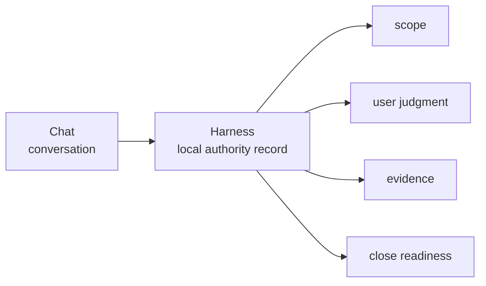
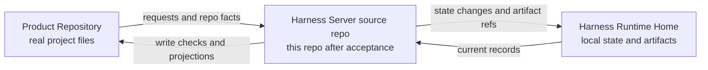

# Overview

## What this document helps you do

This document gives you the first mental model for Harness. After reading it, you should understand why Harness exists, what the three Harness spaces are, what it records, and why those records matter before you read the reference specs.

## Read this when

Read this when you are new to Harness, when an AI-assisted task has become hard to follow, or when you want to understand why Harness separates conversation, operational state, evidence, and readable documents.

## Before you read

No Harness background is required. This is the primary first read for the documentation set.

After this page, read [User Guide](../use/user-guide.md) to see how users interact with Harness during work, then [Concepts](concepts.md) for the vocabulary that appears in examples and reference specs. If you want examples before vocabulary, use [Harness in 15 Minutes](harness-in-15-minutes.md) as a scenario sampler or [Harness in One Task](harness-in-one-task.md) as the fuller tutorial.

## Main idea

Important work facts get trapped in chat.

In an AI-assisted development session, the conversation can move quickly. The user asks for something, scope changes, the agent makes choices, tests run, screenshots appear, a risk is mentioned, and then everyone says the work is done. Later, it can be hard to answer basic questions: what did we agree to change, what actually changed, what was checked, what still needs a human decision, and what risk did we accept?

One sentence version: Harness is a local authority record and judgment-routing layer for AI-assisted product work, keeping scope, user-owned judgments, evidence, verification, QA expectations, final acceptance, and residual-risk status outside fragile chat context.

One paragraph version: In practice, Harness gives the user and agent a local record of what work is in scope, which judgments belong to the user, what supports completion claims, what still needs verification or QA, whether final acceptance has been given, and what risk remains. Chat stays conversation. Markdown projections are readable views. Core-owned local state and artifact references are the source of operational truth. The point is not to replace engineering tools or instructions, but to make AI-assisted work resumable, inspectable, and closeable without pretending the agent owns decisions the user owns.

## The problem Harness solves

AI agents can help with development, but the work journey often becomes blurry. A small request may turn into a larger change. A design choice may happen inside implementation without being named. A test may be mentioned in chat but not tied to the task. A user may accept the result without seeing which risks remain.

Harness focuses on four recurring problems:

- Scope drifts or becomes implicit.
- User-owned judgment is silently replaced by agent judgment.
- Evidence, verification, QA, and completion claims get mixed.
- Chat or Markdown output is mistaken for operational truth.

Harness does not make every task heavy. It makes the important facts visible when they matter, and it keeps those facts separate enough that one kind of support is not mistaken for another.

## The three spaces, explained in plain language

Harness keeps three spaces separate so product files, operational records, and human-readable summaries do not get confused with each other.

| Space | Plain-language meaning |
|---|---|
| Product Repository | Your real project workspace. This is where your source code, tests, product docs, and generated readable reports live. Harness may coordinate work there, but that workspace remains your product workspace. |
| Harness Server / Installation | The local Harness program and tools. This is the installed system that receives agent requests, checks whether writes are allowed, records work facts, runs validators, and produces readable projections. |
| Harness Runtime Home | The local Harness data home. This is where Harness keeps project registration, operational state, and durable evidence artifacts for the registered project. |

This documentation repository is being prepared for its intended future role as the Harness Server source repository. It is not a Product Repository or a Harness Runtime Home. Server/runtime implementation here may start only after documentation acceptance and a separate implementation-planning readiness decision.

The separation matters because a Markdown report should not silently become operational truth, a chat transcript should not be treated as durable state, and product files should not be mixed with Harness's internal operating record.

## What Harness records

Harness records the parts of the work journey that must survive the conversation:

- the work the user wants completed, answered, investigated, or decided
- the scope of product files and behavior that belong to this work; the scoped product-write boundary is called a Change Unit in the Reference docs
- the choices that must stay with the user, including product direction, important technical trade-offs, QA expectations, final acceptance, and residual-risk acceptance
- sensitive-action permission, called Approval in the Reference docs
- evidence such as diffs, logs, checks, screenshots, run summaries, evaluation records, or human inspection records
- verification status, including whether a check was a self-check or a more detached check
- QA expectations and results when human inspection matters
- final acceptance or rejection of the result, called Acceptance in the Reference docs
- remaining risk after the work, called Residual Risk in the Reference docs
- readable reports and status views derived from recorded state, called Projections in the Reference docs

These records let a reader ask: where are we, what changed, what was checked, what is still risky, what is blocked, what decision is needed, and can this task close?

The Reference docs later give exact names to these records and paths, such as Task, Change Unit, Decision Packet, Approval, Write Authorization, Evidence Manifest, Verification, Manual QA, Acceptance, Residual Risk, Projection, and Reconcile. You do not need those names to understand the product value first.

## What Harness is not

Harness is not the same kind of thing as AGENTS.md or other agent instruction files, MCP, skills or reusable workflows, test runners, code review, or specs.

Agent instructions tell agents how to behave. MCP connects tools and resources. Skills and workflows package repeated behavior. Test runners execute checks. Code review examines changes. Specs describe intended behavior or design. Harness may use all of these, but its role is different: it keeps the local operational record for the current work and routes user-owned judgment when the work needs it.

Harness is also not a prompt pack, chat script, evaluation harness, dashboard, or broad hosted agent platform.

Harness also does not treat chat history as the source of truth, and it does not treat generated Markdown as the operating record. Chat is conversation. Markdown projections are readable views. Core-owned local state and artifact references are the source of operational truth. The user still owns goals, scope, design judgment, product and material technical judgment, QA judgment, final acceptance, and residual-risk acceptance.

Harness keeps a local record and decision path around AI-assisted work. It helps the user and agent work faster without losing the shape of the work.

For a side-by-side comparison with AGENTS.md / agent rules, MCP, skills / reusable workflows, test runners, code review, and specs, use the [English documentation entrypoint](../README.md#comparison). For the values behind those differences, read [Purpose and Principles](purpose-and-principles.md).

## Where to go next

- Continue the first-read path with [User Guide](../use/user-guide.md).
- Use [Concepts](concepts.md) only when terms start appearing in examples, status, or reference specs.
- Use [Purpose and Principles](purpose-and-principles.md) when reviewing the thesis, values, non-goals, failure model, or MVP boundary.
- Use [Harness in 15 Minutes](harness-in-15-minutes.md) for short scenarios, or [Harness in One Task](harness-in-one-task.md) for the tutorial walkthrough.
- Use the [Reference Index](../reference/README.md) only when you need the exact owner contract.
