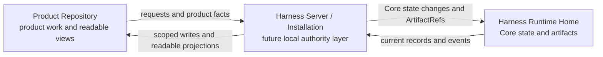

# Overview

## Start Here

Read this first if Harness is new to you.

Harness is easiest to understand as a local work-authority server for AI-assisted product work. Its job is to keep fragile conversation context from becoming the source of truth.

Harness preserves the local basis for scope, user-owned judgment, evidence, verification expectations, work acceptance, close readiness, and residual risk. When the agent should not decide, Harness routes that decision back to the user instead of letting a confident summary, tool result, or generated report stand in for judgment.

This repository is documentation-only today. It is being prepared for a possible future role as the Harness Server source repository, but no Harness Server or runtime implementation exists here yet. It is not a Product Repository and not a Harness Runtime Home.

## Why Harness Exists

AI-assisted work often moves faster than the record around it. A small request becomes a larger change. A product choice gets made inside implementation. A test pass is treated as proof of the whole experience. A user says "looks good" and the agent assumes every unresolved judgment has been answered.

Harness exists to stop those substitutions.

It does not make conversation less useful. It makes conversation less dangerous as a source of authority. The user and agent can still plan, debate, implement, inspect, and report in ordinary language. Harness keeps the parts that affect scope, judgment, evidence, close readiness, work acceptance, and risk in local Core-owned state.

## Authority Boundaries

Harness separates the surfaces people use from the records that carry authority.

| Surface | Useful for | Not authority for |
|---|---|---|
| Chat | Coordination, questions, explanation, summaries, proposed next steps. | Durable state, work acceptance, residual-risk acceptance, or resolving every pending judgment by implication. |
| Product files | Source code, tests, product docs, project assets, generated readable files. | Harness operational state. |
| Tool output | Checks, logs, diffs, screenshots, connector responses, search results. | User judgment or work acceptance by itself. |
| Readable reports | Human-readable status and reports derived from recorded facts. | Core state, evidence records, work acceptance, or close eligibility. |
| Core-owned local state | Work, scope, user-owned judgments, evidence, checks or verification, and close. | A replacement for source control, tests, code review, or product specifications. |

The practical rule is simple: read surfaces for context, but treat Core-owned state and artifact references as the operating record.

## Three Spaces

The future Harness system keeps three local spaces distinct.

| Space | Plain meaning |
|---|---|
| Product Repository | The user's real project workspace: code, tests, product docs, assets, and generated readable files. |
| Harness Server / Installation | The future local Harness program and tool surface that will mediate Harness requests and maintain authority records. This implementation does not exist in this repository yet. |
| Harness Runtime Home | The future local data home for registered project state and durable evidence artifacts. This repository is not that runtime home. |

This design-contract diagram gives first-time readers the location of Harness without requiring the architecture reference. It describes the intended future runtime shape, not an implemented server in this repository.



Core state and artifact refs live in the Runtime Home. Product files, chat, and projections remain outside authority unless routed through Core.

This separation matters because generated reports should not become state, chat should not become state, and product files should not be confused with Harness's operating record.

## What Harness Tracks

Harness tracks the parts of AI-assisted work that need to survive the conversation:

- what work is being attempted;
- what is in scope and out of scope;
- which choices belong to the user;
- which evidence references support completion or correctness claims;
- what checking or verification is expected;
- whether required work acceptance has been given;
- whether close is possible and what still blocks it;
- which residual risks are known, visible, or accepted.

Reference docs give these records exact implementation names. You do not need those names for the first mental model.

## Harness Is Not

| Harness is not | Harness does |
|---|---|
| A prompt pack or chat script. | Keeps work authority outside prompts and conversation. |
| MCP itself or an API wrapper. | May use MCP/API surfaces as implementation mechanisms. |
| A workflow engine, report generator, or dashboard. | Records the basis for work and can derive readable views from that record. |
| A hosted agent platform. | Is designed around a local Harness Server / Installation. |
| A sandbox or OS permission system. | Preserves authority boundaries without claiming OS-level isolation or arbitrary-tool permission control. |

Harness may integrate with prompts, MCP/API surfaces, workflows, tests, reviews, reports, dashboards, and specs. It does not let any of them replace the local work-authority record or the user's judgment.

## Non-Substitution Rules

These are the learning-path rules to keep close:

- Chat is not state.
- A readable report is not state.
- Tool output is not user judgment.
- Sensitive-action approval is not work acceptance.
- Test pass is not manual QA.
- Self-check is not detached verification.
- "Proceed" or "looks good" does not automatically resolve every pending judgment.

The point is not to distrust every surface. The point is to avoid treating one kind of signal as another kind of authority.

## Three Work Shapes

Users should not need to request internal modes. In ordinary work, Harness should make three visible shapes easy to recognize.

| Work shape | What it feels like | Authority boundary |
|---|---|---|
| Advice/read-only work | The user asks for explanation, planning, comparison, investigation, or a recommendation. | The agent may inspect and cite, but product writes, work acceptance, and risk acceptance do not happen just because advice was given. |
| Small direct change | The user asks for a narrow, clear edit, such as a typo fix, focused copy change, or leaf bug fix. | Scope stays small; if meaning, risk, public behavior, UX, sensitive action, or shared contract impact appears, the work must be reshaped before continuing. |
| Tracked work | The work has meaningful scope, user-owned judgment, evidence, QA, verification, work acceptance, or residual risk. | Harness keeps the boundary visible until blockers are handled and close readiness is clear. |

The user can speak normally:

```text
Help me clarify the plan before implementation.
Show what I need to decide and what you can check yourself.
Tell me if the scope is getting bigger.
Show me what still prevents closing this work.
```

Internal labels can appear later in reference docs or status details, but they are optional vocabulary for users.

## Where To Go Next

- Read [User Guide](../use/user-guide.md) to see the user-facing flow.
- Read [Harness in 15 Minutes](harness-in-15-minutes.md) for short examples of the three work shapes.
- Read [Harness in One Task](harness-in-one-task.md) for a fuller task story.
- Read [Concepts](concepts.md) when vocabulary starts appearing in examples or reference docs.
- Read [Purpose and Principles](purpose-and-principles.md) when reviewing product thesis, non-goals, or MVP boundaries.
