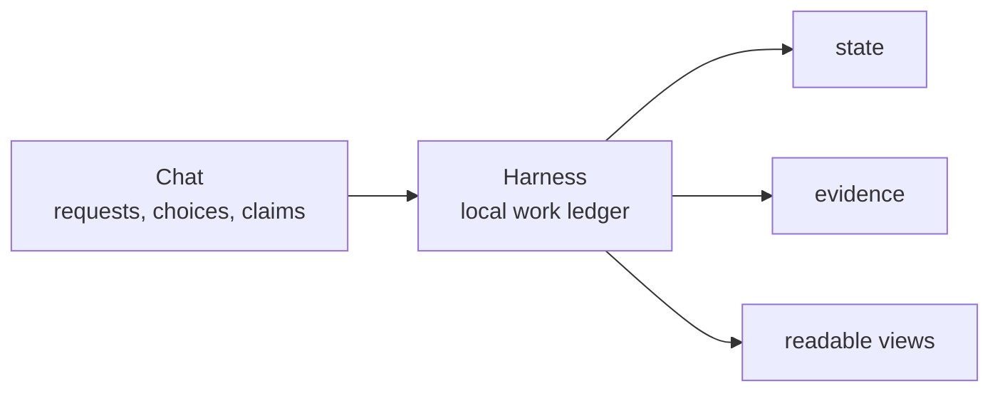

# Overview

## What this document helps you do

This document gives you the first mental model for Harness. After reading it, you should understand why Harness exists, what the three Harness spaces are, what it records, and why those records matter before you read the reference specs.

This is Learn documentation. It does not authorize runtime/server implementation, generated operational files, executable fixtures, or runtime data before maintainers explicitly accept the documentation set for first runtime-batch planning. The first implementation/proof target remains Kernel Smoke; Agency-Hardened MVP and post-MVP automation stay out of scope unless their owner docs promote and prove them.

## Read this when

Read this when you are new to Harness, when an AI-assisted task has become hard to follow, or when you want to understand why Harness separates conversation, operational state, evidence, and readable documents.

## Before you read

No Harness background is required. If you want a concrete story after this page, read [Harness in One Task](harness-in-one-task.md).

## Main idea

Important work facts get trapped in chat.

In an AI-assisted development session, the conversation can move quickly. The user asks for something, scope changes, the agent makes choices, tests run, screenshots appear, a risk is mentioned, and then everyone says the work is done. Later, it can be hard to answer basic questions: what did we agree to change, what actually changed, what was checked, what still needs a human decision, and what risk did we accept?

Harness is a local work ledger and judgment router for AI-assisted product work. It records what may change, who must decide, what evidence exists, what risk remains, and whether the work can close.

Harness still follows the agency-preserving local authority kernel principle. It keeps those work facts outside the chat in durable local state, artifact refs for supporting evidence, and readable projections derived from state. The chat can stay natural, but the durable facts of the task become followable, resumable, checkable, and closeable from current state.

## The problem Harness solves

AI agents can help with development, but the work journey often becomes blurry. A small request may turn into a larger change. A design choice may happen inside implementation without being named. A test may be mentioned in chat but not tied to the task. A user may accept the result without seeing which risks remain.

Harness solves this by making the work journey explicit. It records the task, the bounded change being attempted, decisions that need user judgment, sensitive-action Approvals, evidence, verification, Manual QA, acceptance, and residual risk. It does not make every task heavy. It makes the important facts visible when they matter.

The goal is not to replace conversation, source control, tests, code review, or user judgment. The goal is to stop relying on conversation as the only memory of the work, and to make the rest of the work record easier to inspect.

## The three spaces, explained in plain language

Harness keeps three spaces separate so product files, operational records, and human-readable summaries do not get confused with each other.

| Space | Plain-language meaning |
|---|---|
| Product Repository | Your real project workspace. This is where your source code, tests, product docs, and generated readable reports live. Harness may coordinate work here, but the repository remains your product workspace. |
| Harness Server / Installation | The local Harness program and tools. This is the installed system that receives agent requests, checks whether writes are allowed, records work facts, runs validators, and produces readable projections. |
| Harness Runtime Home | The local Harness data home. This is where Harness keeps project registration, operational state, and durable evidence artifacts for the registered project. |

The separation matters because a Markdown report should not silently become operational truth, a chat transcript should not be treated as durable state, and product files should not be mixed with Harness's internal operating record.

## What Harness records

Harness records the parts of the work journey that must survive the conversation:

- the Task the user wants done or answered
- the Change Unit that bounds product writes
- decisions and Decision Packets when user judgment blocks progress
- sensitive-action Approvals
- evidence such as diffs, logs, checks, screenshots, run summaries, evaluation records, or Manual QA records
- verification status, including whether a check was self-checking or detached from the implementation session
- Manual QA when human inspection is needed
- acceptance or rejection of the result
- residual risk that remains after the work
- projections such as readable Markdown reports, Journey Cards, or Journey Spine views derived from recorded state

These records let a reader ask: where are we, what changed, what was checked, what is still risky, what is blocked, what decision is needed, and can this task close?

## What Harness is not

Harness is not:

- a prompt pack
- a replacement for source control, tests, code review, or user judgment
- MCP itself
- a broad hosted agent platform

Harness is also not merely a chat workflow, test harness, or evaluation harness.

Harness can integrate with MCP tools/connectors, hooks, guardrails, adapters, sidecars, and isolation layers. Those surfaces can help agents read current context, call Harness tools, capture evidence, or enforce/detect boundaries when the connected profile supports it, but they are not the source of Harness authority. If a connected surface can only cooperate or detect issues after action, Harness should describe that limit instead of claiming hard prevention.

Harness authority comes from Core and canonical local state around Task state, Change Unit scope, Decision Packets, Approval, Write Authorization, evidence, verification, QA, Acceptance, Residual Risk, and close.

Harness also does not replace the user's product repository, source control or version control system, test runner, code review process, user-owned product judgment, or material technical judgment.

Harness also does not treat chat history as the source of truth. It does not treat generated Markdown as the operating record. It does not turn the agent into the owner of product or material technical direction. The user still owns goals, scope, design judgment, product and material technical judgment, sensitive-action Approvals, QA judgment, acceptance, and residual-risk acceptance.

Harness keeps a local record and decision path around AI-assisted work. It helps the user and agent work faster without losing the shape of the work.

For a side-by-side comparison with AGENTS.md / agent rules, MCP, spec-driven workflows, hooks / sidecars, and test runners / code review, use the [English documentation entrypoint](../README.md#comparison). For the values behind those differences, read [Purpose and Principles](purpose-and-principles.md).

## Where to go next

- Read [Concepts](concepts.md) for the smallest vocabulary you need before reference specs.
- Read [Purpose and Principles](purpose-and-principles.md) for the values and boundaries behind the system.
- For strict kernel behavior, read [Kernel Reference](../reference/kernel.md).
- For runtime architecture, read [Runtime Architecture Reference](../reference/runtime-architecture.md).
- For document projection, read [Document Projection Reference](../reference/document-projection.md).
